# 交互功能

<cite>
**本文档中引用的文件**
- [Treeselect.vue](file://src/components/Treeselect.vue)
- [Control.vue](file://src/components/Control.vue)
- [Input.vue](file://src/components/Input.vue)
- [Menu.vue](file://src/components/Menu.vue)
- [Option.vue](file://src/components/Option.vue)
- [treeselectMixin.js](file://src/mixins/treeselectMixin.js)
- [onLeftClick.js](file://src/utils/onLeftClick.js)
- [KeyboardSupport.spec.js](file://test/unit/specs/KeyboardSupport.spec.js)
- [shared.js](file://test/unit/specs/shared.js)
- [constants.js](file://src/constants.js)
</cite>

## 目录
1. [简介](#简介)
2. [项目结构概览](#项目结构概览)
3. [核心交互组件](#核心交互组件)
4. [键盘导航支持机制](#键盘导航支持机制)
5. [鼠标交互处理](#鼠标交互处理)
6. [焦点管理系统](#焦点管理系统)
7. [菜单控制逻辑](#菜单控制逻辑)
8. [事件流分析](#事件流分析)
9. [无障碍访问最佳实践](#无障碍访问最佳实践)
10. [总结](#总结)

## 简介

Vue TreeSelect Next 是一个功能丰富的树形选择器组件库，提供了完整的键盘导航支持和鼠标交互功能。该组件实现了符合 Web 无障碍标准的交互体验，支持 Tab 键导航、Enter 键选择、方向键导航、Space 键切换等多种操作方式。

## 项目结构概览

该组件库采用模块化架构设计，主要包含以下核心模块：

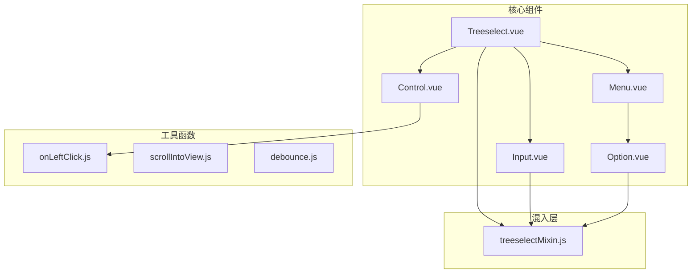

**图表来源**
- [Treeselect.vue](file://src/components/Treeselect.vue#L1-L42)
- [Control.vue](file://src/components/Control.vue#L1-L154)
- [Menu.vue](file://src/components/Menu.vue#L1-L331)

**章节来源**
- [Treeselect.vue](file://src/components/Treeselect.vue#L1-L42)
- [Control.vue](file://src/components/Control.vue#L1-L154)

## 核心交互组件

### 主容器组件 (Treeselect)

Treeselect 是整个组件的主容器，负责协调各个子组件的交互行为：

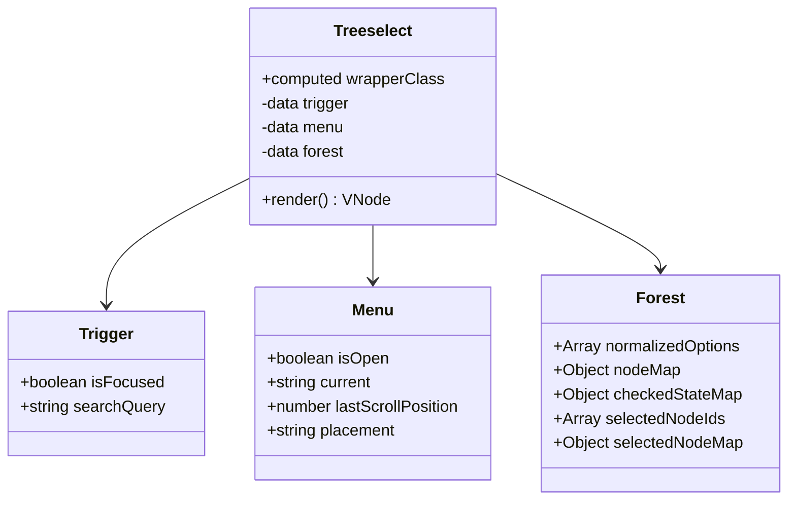

**图表来源**
- [Treeselect.vue](file://src/components/Treeselect.vue#L12-L28)
- [treeselectMixin.js](file://src/mixins/treeselectMixin.js#L658-L707)

### 控制器组件 (Control)

Control 组件处理用户界面的主要交互逻辑，包括清除按钮、箭头按钮和值容器的渲染：

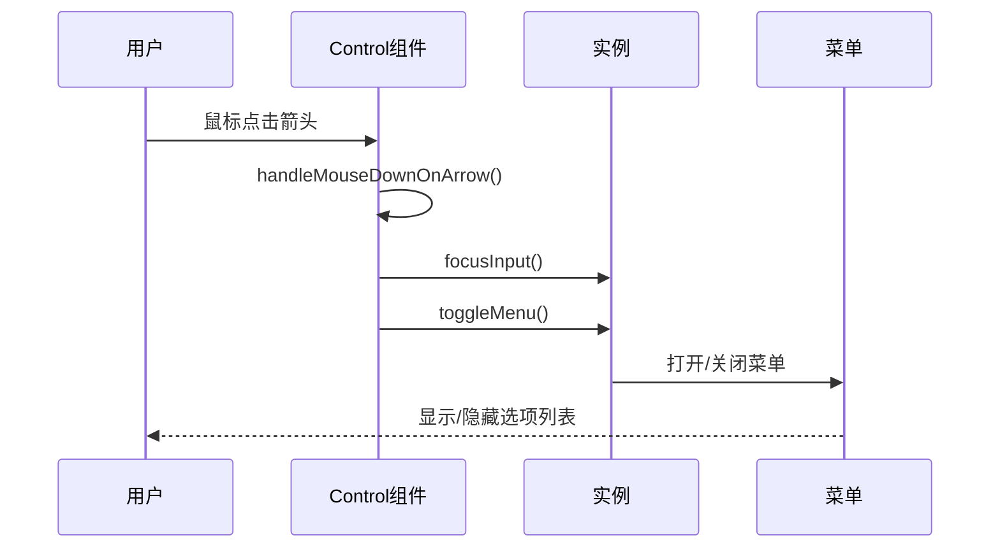

**图表来源**
- [Control.vue](file://src/components/Control.vue#L119-L128)

**章节来源**
- [Control.vue](file://src/components/Control.vue#L1-L154)
- [Treeselect.vue](file://src/components/Treeselect.vue#L1-L42)

## 键盘导航支持机制

### 支持的键盘操作

组件支持以下关键键盘操作：

| 按键 | 功能 | 触发条件 |
|------|------|----------|
| Tab | 导航到下一个可聚焦元素 | 自动触发 |
| Enter | 选择当前高亮选项 | 菜单打开且有高亮选项 |
| Escape | 关闭菜单或清空搜索 | 搜索有内容时清空，无内容时关闭菜单 |
| ↑/↓ | 上下导航选项 | 菜单打开时 |
| ←/→ | 左右展开/折叠分支节点 | 菜单打开时 |
| Home | 移动到第一个选项 | 菜单打开时 |
| End | 移动到最后一个选项 | 菜单打开时 |
| Backspace | 删除最后选择的值 | 多选模式且输入为空 |
| Delete | 删除最后选择的值 | 多选模式且输入为空 |

### 键盘事件处理流程

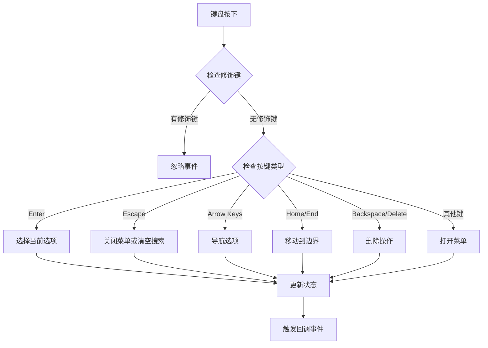

**图表来源**
- [Input.vue](file://src/components/Input.vue#L116-L203)
- [constants.js](file://src/constants.js#L32-L43)

### 具体按键处理逻辑

#### Enter 键处理
Enter 键用于确认选择操作：

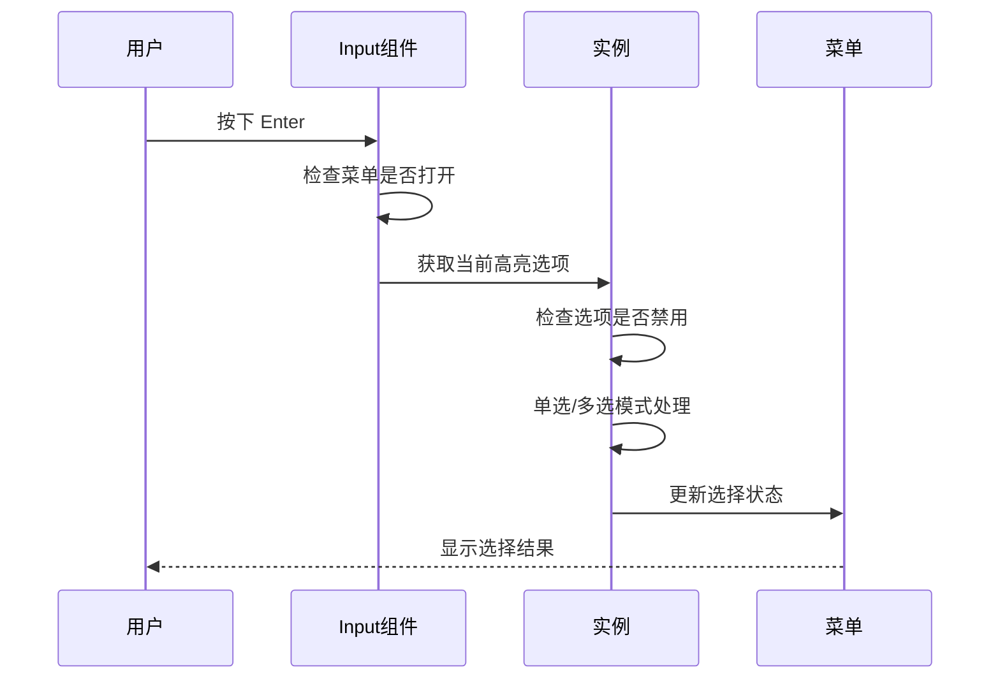

**图表来源**
- [Input.vue](file://src/components/Input.vue#L137-L143)

#### 方向键导航
方向键用于在选项间导航：

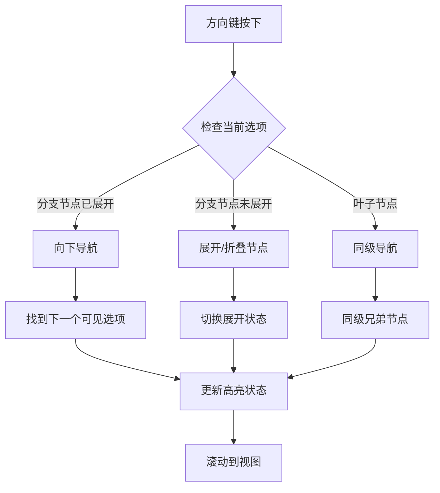

**图表来源**
- [Input.vue](file://src/components/Input.vue#L174-L190)

**章节来源**
- [Input.vue](file://src/components/Input.vue#L116-L203)
- [KeyboardSupport.spec.js](file://test/unit/specs/KeyboardSupport.spec.js#L21-L667)

## 鼠标交互处理

### onLeftClick 工具函数

onLeftClick 是一个专门处理左键点击事件的工具函数：

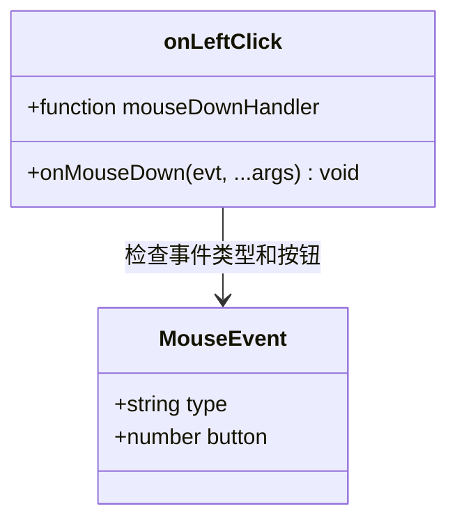

**图表来源**
- [onLeftClick.js](file://src/utils/onLeftClick.js#L1-L8)

该函数确保只有左键点击才会触发相应的处理函数，避免误触其他鼠标按钮。

### 鼠标事件处理流程

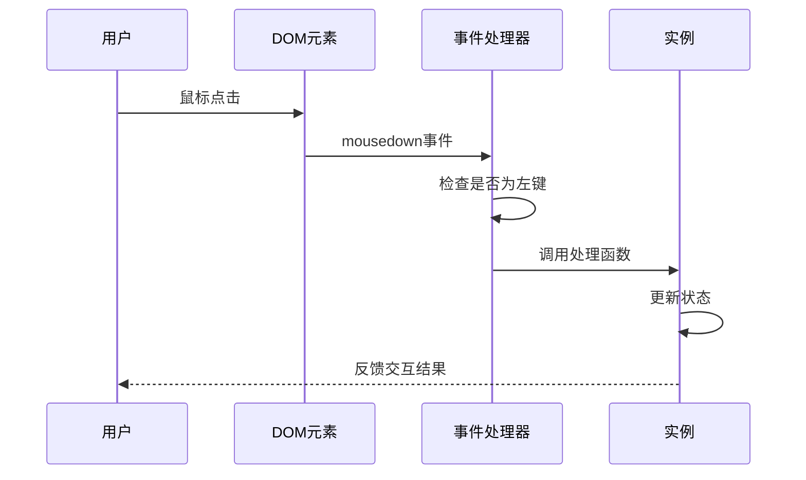

**图表来源**
- [onLeftClick.js](file://src/utils/onLeftClick.js#L2-L6)

**章节来源**
- [onLeftClick.js](file://src/utils/onLeftClick.js#L1-L8)
- [Control.vue](file://src/components/Control.vue#L87-L118)

## 焦点管理系统

### isFocused 状态管理

焦点管理系统通过 `trigger.isFocused` 状态来跟踪组件的聚焦状态：

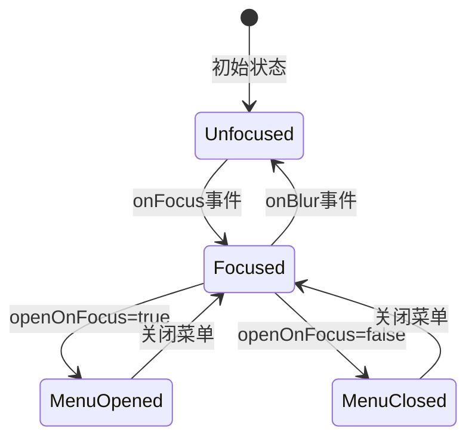

**图表来源**
- [Input.vue](file://src/components/Input.vue#L80-L99)

### 焦点控制属性

| 属性 | 类型 | 默认值 | 描述 |
|------|------|--------|------|
| openOnFocus | Boolean | false | 是否在获得焦点时自动打开菜单 |
| openOnClick | Boolean | true | 是否在点击时自动打开菜单 |
| autoFocus | Boolean | false | 组件挂载时是否自动获得焦点 |

### 焦点事件处理

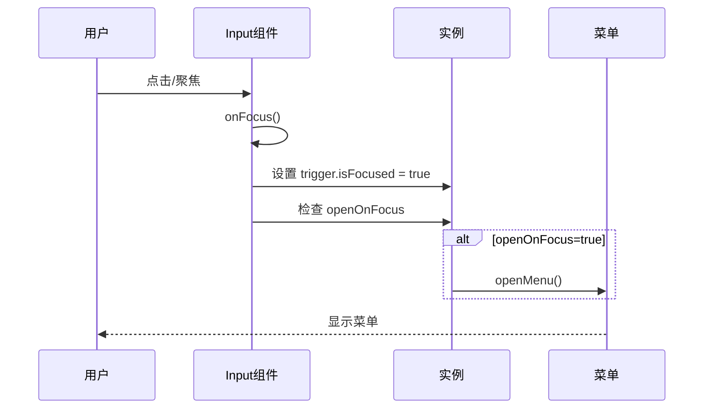

**图表来源**
- [Input.vue](file://src/components/Input.vue#L80-L85)

**章节来源**
- [Input.vue](file://src/components/Input.vue#L80-L99)
- [treeselectMixin.js](file://src/mixins/treeselectMixin.js#L658-L662)

## 菜单控制逻辑

### 菜单打开/关闭行为

菜单的打开和关闭行为受多个属性控制：

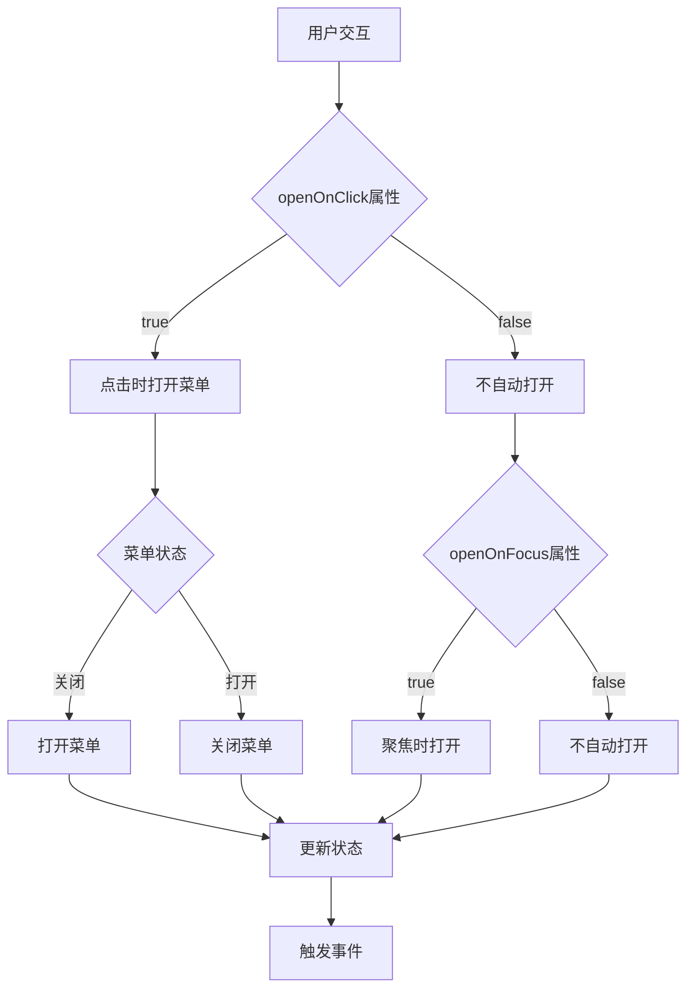

**图表来源**
- [Control.vue](file://src/components/Control.vue#L119-L128)
- [Input.vue](file://src/components/Input.vue#L83-L85)

### 菜单状态管理

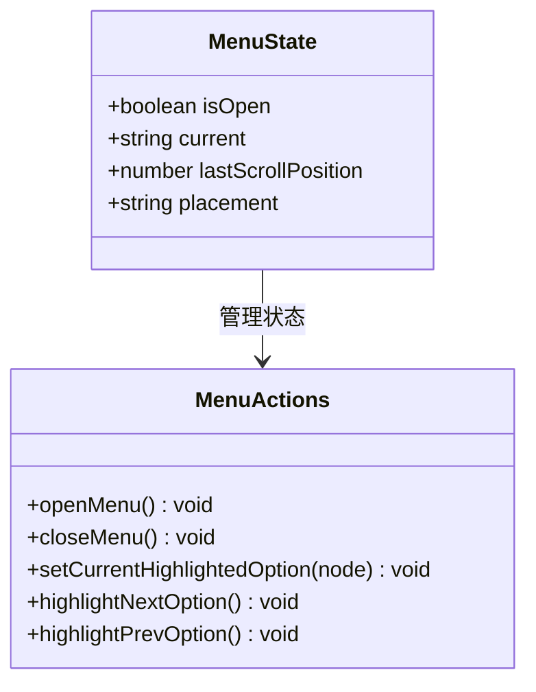

**图表来源**
- [treeselectMixin.js](file://src/mixins/treeselectMixin.js#L668-L676)

**章节来源**
- [Menu.vue](file://src/components/Menu.vue#L1-L331)
- [treeselectMixin.js](file://src/mixins/treeselectMixin.js#L668-L676)

## 事件流分析

### 完整交互链条

从用户输入到状态更新的完整事件流如下：

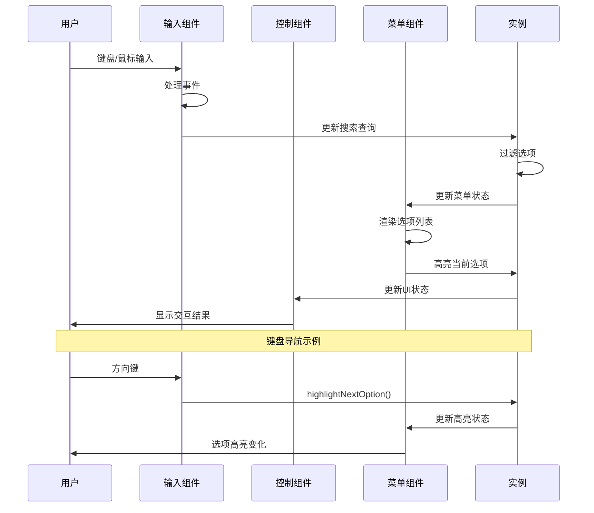

**图表来源**
- [Input.vue](file://src/components/Input.vue#L116-L203)
- [Control.vue](file://src/components/Control.vue#L119-L128)

### 异步操作处理

对于异步加载的选项，事件流需要考虑延迟加载的情况：

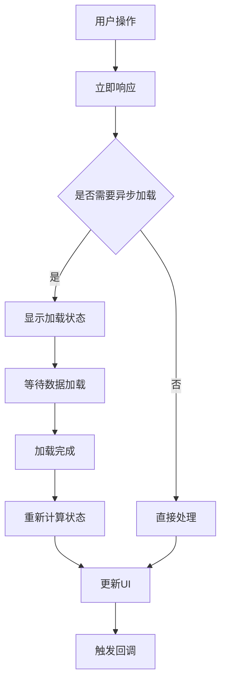

**图表来源**
- [treeselectMixin.js](file://src/mixins/treeselectMixin.js#L37-L43)

**章节来源**
- [Input.vue](file://src/components/Input.vue#L116-L203)
- [Control.vue](file://src/components/Control.vue#L119-L128)

## 无障碍访问最佳实践

### 键盘导航支持

1. **Tab 键导航**
   - 支持标准的 Tab 键顺序导航
   - 保持焦点在组件内部循环
   - 提供清晰的焦点指示器

2. **方向键导航**
   - 支持上下左右方向键进行选项导航
   - 支持 Home 和 End 键快速定位
   - 支持 Page Up/Down 键快速浏览

3. **Enter 和 Space 键**
   - Enter 键确认选择
   - Space 键切换复选框状态

### 屏幕阅读器支持

1. **语义化标签**
   - 使用适当的 ARIA 属性
   - 提供有意义的标签文本
   - 正确设置 role 属性

2. **状态通知**
   - 选项数量变化通知
   - 选择状态变化通知
   - 错误状态提示

### 可访问性特性

| 特性 | 实现方式 | 用途 |
|------|----------|------|
| ARIA 标签 | `aria-label`, `aria-describedby` | 屏幕阅读器识别 |
| 焦点管理 | `tabindex` 属性 | 键盘导航控制 |
| 状态通知 | `aria-live` 区域 | 动态内容通知 |
| 键盘快捷键 | `keydown` 事件监听 | 快速操作支持 |

### 最佳实践建议

1. **键盘优先**
   - 确保所有功能都可以通过键盘访问
   - 提供清晰的键盘操作提示
   - 保持一致的键盘操作模式

2. **视觉反馈**
   - 清晰的焦点指示器
   - 状态变化的视觉反馈
   - 加载状态的进度指示

3. **错误处理**
   - 提供有意义的错误消息
   - 支持错误恢复操作
   - 保持操作的一致性

**章节来源**
- [KeyboardSupport.spec.js](file://test/unit/specs/KeyboardSupport.spec.js#L1-L667)
- [Input.vue](file://src/components/Input.vue#L224-L241)

## 总结

Vue TreeSelect Next 组件库提供了完整的交互功能支持，涵盖了键盘导航、鼠标交互、焦点管理和菜单控制等多个方面。通过模块化的架构设计和完善的事件处理机制，该组件实现了良好的用户体验和无障碍访问支持。

### 主要特点

1. **全面的键盘支持**：支持所有标准的键盘导航操作
2. **灵活的交互控制**：通过属性控制不同的交互行为
3. **完善的焦点管理**：精确的状态跟踪和管理
4. **无障碍访问**：符合 Web 无障碍标准
5. **异步操作支持**：优雅处理异步加载场景

### 技术优势

- 采用 Vue.js 组件化架构
- 使用 Mixin 模式实现代码复用
- 提供完善的测试覆盖
- 支持多种交互模式组合

该组件库为开发者提供了一个功能丰富、易于使用的树形选择器解决方案，特别适合需要复杂数据选择场景的应用程序。