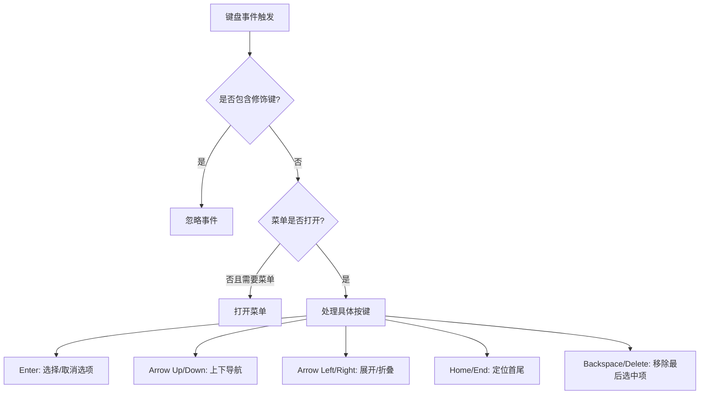
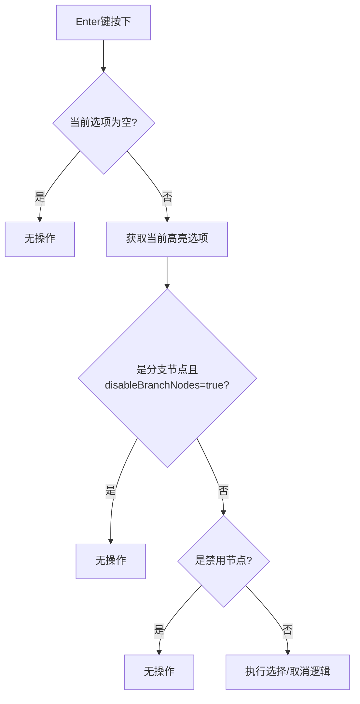
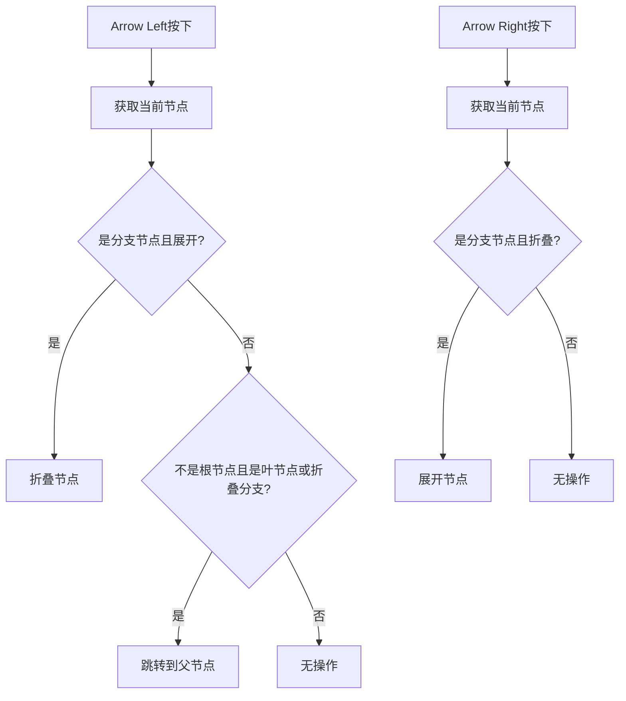
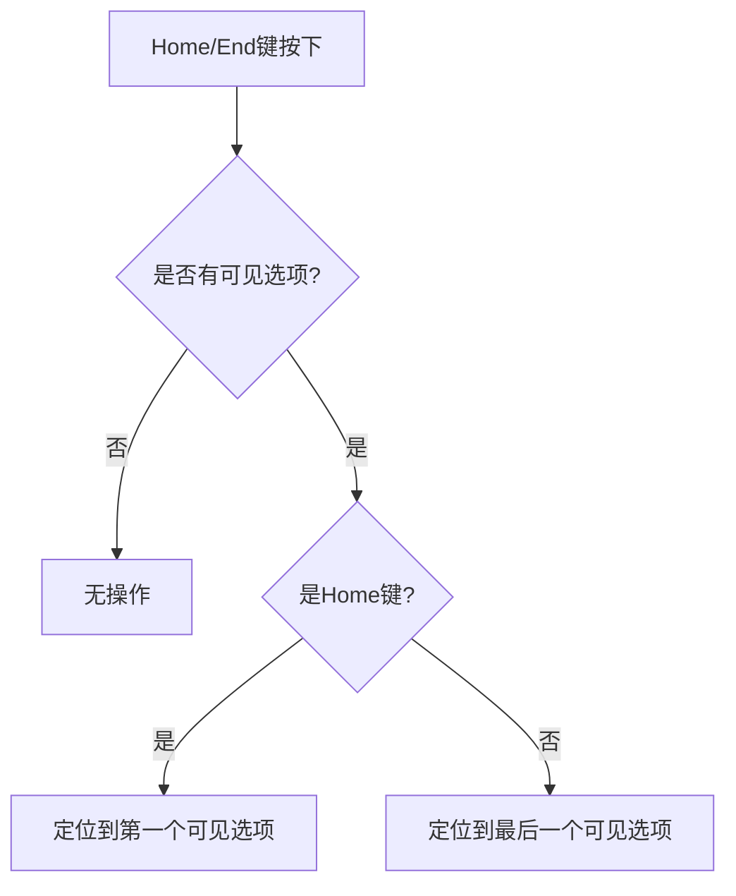
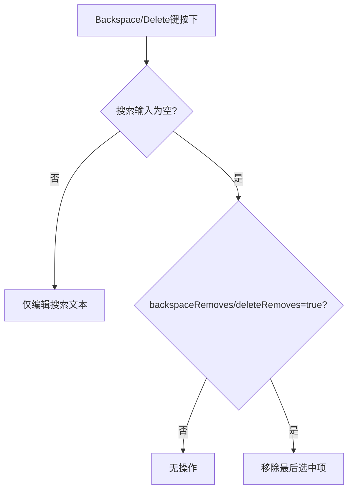
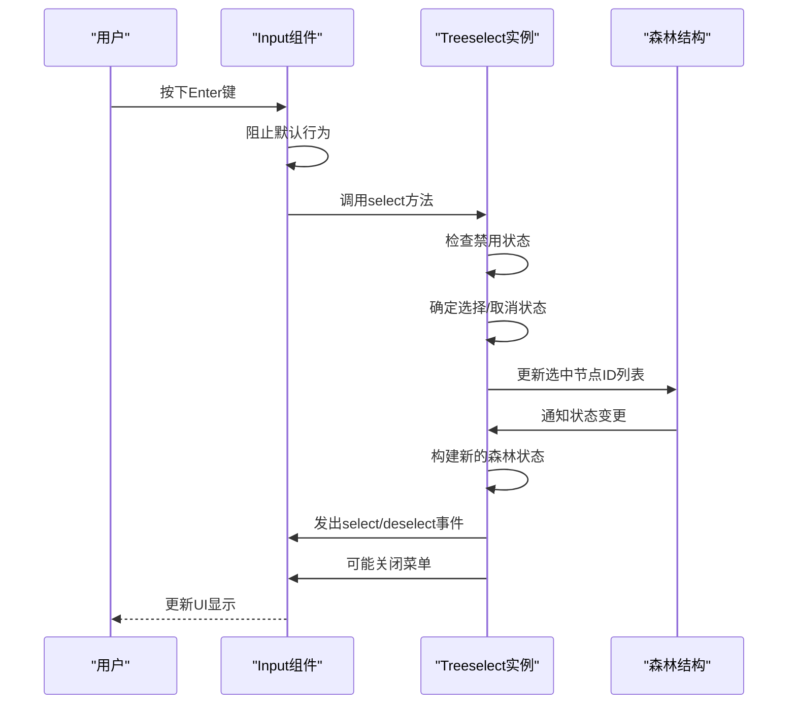

# 键盘支持

<cite>
**本文档中引用的文件**  
- [Input.vue](file://src/components/Input.vue)
- [treeselectMixin.js](file://src/mixins/treeselectMixin.js)
- [constants.js](file://src/constants.js)
- [KeyboardSupport.spec.js](file://test/unit/specs/KeyboardSupport.spec.js)
- [shared.js](file://test/unit/specs/shared.js)
</cite>

## 目录
1. [简介](#简介)
2. [核心事件处理机制](#核心事件处理机制)
3. [Enter键行为分析](#enter键行为分析)
4. [箭头键导航逻辑](#箭头键导航逻辑)
5. [Home/End键定位功能](#homeend键定位功能)
6. [Backspace/Delete键移除逻辑](#backspacedelete键移除逻辑)
7. [键盘事件流分析](#键盘事件流分析)
8. [无障碍访问最佳实践](#无障碍访问最佳实践)

## 简介
Vue Treeselect组件提供了一套完整的键盘导航支持，允许用户通过键盘与下拉树形选择器进行交互。本文档详细解析了Tab、Enter、箭头键、Space、Home、End、Backspace和Delete等关键操作的事件处理逻辑，重点关注各种键盘操作在不同模式下的行为表现。

**Section sources**
- [Input.vue](file://src/components/Input.vue#L1-L296)
- [KeyboardSupport.spec.js](file://test/unit/specs/KeyboardSupport.spec.js#L1-L667)

## 核心事件处理机制
键盘事件主要在Input.vue组件中处理，通过onKeyDown方法捕获并分发各种键盘操作。组件定义了KEY_CODES常量来映射键盘码，确保跨平台兼容性。

**Diagram sources**
- [Input.vue](file://src/components/Input.vue#L116-L203)
- [constants.js](file://src/constants.js#L31-L43)

**Section sources**
- [Input.vue](file://src/components/Input.vue#L116-L203)
- [constants.js](file://src/constants.js#L31-L43)

## Enter键行为分析
Enter键用于选中或取消当前高亮的选项，其行为在单选和多选模式下有所不同。

### 单选模式
在单选模式下，Enter键会选中当前高亮的选项。如果该选项已被选中，则保持选中状态不变。

### 多选模式
在多选模式下，Enter键实现切换行为：如果选项未被选中，则选中它；如果已选中，则取消选中。

### 禁用选项处理
当尝试通过Enter键操作禁用的选项时，系统会执行无操作（no-op）行为，确保禁用状态的完整性。

### 禁用分支节点处理
当`disableBranchNodes`属性为true时，对分支节点使用Enter键也会执行无操作，防止用户选择不允许的分支节点。

**Diagram sources**
- [Input.vue](file://src/components/Input.vue#L137-L143)
- [treeselectMixin.js](file://src/mixins/treeselectMixin.js#L1784-L1823)

**Section sources**
- [Input.vue](file://src/components/Input.vue#L137-L143)
- [treeselectMixin.js](file://src/mixins/treeselectMixin.js#L1784-L1823)
- [KeyboardSupport.spec.js](file://test/unit/specs/KeyboardSupport.spec.js#L89-L188)

## 箭头键导航逻辑
箭头键提供了在选项列表中的导航功能，包括上下移动和展开/折叠分支节点。

### Arrow Up/Down键
上下箭头键用于在可见选项之间导航，支持循环导航：到达列表末尾后按向下箭头会回到开头，到达开头后按向上箭头会跳到末尾。

### Arrow Left/Right键
左右箭头键主要用于控制分支节点的展开状态：
- **Arrow Right**：当高亮分支节点处于折叠状态时，展开该节点
- **Arrow Left**：当高亮分支节点处于展开状态时，折叠该节点

### 叶节点向左导航
当在叶节点上按下Arrow Left键时，焦点会跳转到其父节点，实现从子节点到父节点的快速导航。

**Diagram sources**
- [Input.vue](file://src/components/Input.vue#L163-L185)
- [treeselectMixin.js](file://src/mixins/treeselectMixin.js#L1428-L1456)

**Section sources**
- [Input.vue](file://src/components/Input.vue#L163-L185)
- [treeselectMixin.js](file://src/mixins/treeselectMixin.js#L1428-L1456)
- [KeyboardSupport.spec.js](file://test/unit/specs/KeyboardSupport.spec.js#L451-L544)

## Home/End键定位功能
Home和End键提供了在选项列表中快速定位的功能。

### 基本行为
- **Home键**：将焦点移动到第一个可见选项
- **End键**：将焦点移动到最后一个可见选项

### 搜索模式下的表现
在搜索模式下，Home和End键会定位到搜索结果中的第一个和最后一个匹配项，而不是整个选项列表的首尾。

### 嵌套结构中的表现
在嵌套的树形结构中，Home和End键会考虑所有展开的子节点，将焦点定位到完全展开视图中的第一个或最后一个选项。

**Diagram sources**
- [Input.vue](file://src/components/Input.vue#L153-L161)
- [treeselectMixin.js](file://src/mixins/treeselectMixin.js#L1428-L1456)

**Section sources**
- [Input.vue](file://src/components/Input.vue#L153-L161)
- [treeselectMixin.js](file://src/mixins/treeselectMixin.js#L1428-L1456)
- [KeyboardSupport.spec.js](file://test/unit/specs/KeyboardSupport.spec.js#L231-L282)

## Backspace/Delete键移除逻辑
Backspace和Delete键在特定条件下可以移除最后选中的项。

### 实现逻辑
当搜索输入为空且`backspaceRemoves`/`deleteRemoves`属性为true时，按下Backspace或Delete键会移除最后选中的值。

### 属性关联
- **backspaceRemoves**：控制Backspace键是否可以移除最后选中项
- **deleteRemoves**：控制Delete键是否可以移除最后选中项

### 条件限制
如果搜索输入框中有文本内容，则Backspace/Delete键仅用于编辑搜索文本，不会触发移除最后选中项的操作。

**Diagram sources**
- [Input.vue](file://src/components/Input.vue#L131-L135)
- [Input.vue](file://src/components/Input.vue#L192-L196)
- [treeselectMixin.js](file://src/mixins/treeselectMixin.js#L1838-L1859)

**Section sources**
- [Input.vue](file://src/components/Input.vue#L131-L135)
- [Input.vue](file://src/components/Input.vue#L192-L196)
- [treeselectMixin.js](file://src/mixins/treeselectMixin.js#L1838-L1859)
- [KeyboardSupport.spec.js](file://test/unit/specs/KeyboardSupport.spec.js#L45-L87)
- [KeyboardSupport.spec.js](file://test/unit/specs/KeyboardSupport.spec.js#L592-L633)

## 键盘事件流分析
从键盘事件触发到菜单状态更新的完整交互链条如下：

**Diagram sources**
- [Input.vue](file://src/components/Input.vue#L137-L143)
- [treeselectMixin.js](file://src/mixins/treeselectMixin.js#L1784-L1823)

**Section sources**
- [Input.vue](file://src/components/Input.vue#L137-L143)
- [treeselectMixin.js](file://src/mixins/treeselectMixin.js#L1784-L1823)

## 无障碍访问最佳实践
为了确保键盘导航的无障碍访问性，建议遵循以下最佳实践：

1. **确保所有功能可通过键盘访问**：所有用户界面元素都应能通过键盘操作
2. **提供清晰的焦点指示**：确保用户能清楚地看到当前焦点位置
3. **保持一致的导航模式**：遵循标准的键盘导航约定
4. **避免键盘陷阱**：确保用户能通过键盘离开任何界面元素
5. **使用语义化HTML**：正确使用ARIA属性和角色
6. **提供足够的视觉反馈**：对键盘操作提供即时的视觉反馈
7. **支持屏幕阅读器**：确保组件与主流屏幕阅读器兼容

**Section sources**
- [Input.vue](file://src/components/Input.vue#L1-L296)
- [treeselectMixin.js](file://src/mixins/treeselectMixin.js#L1-L1984)