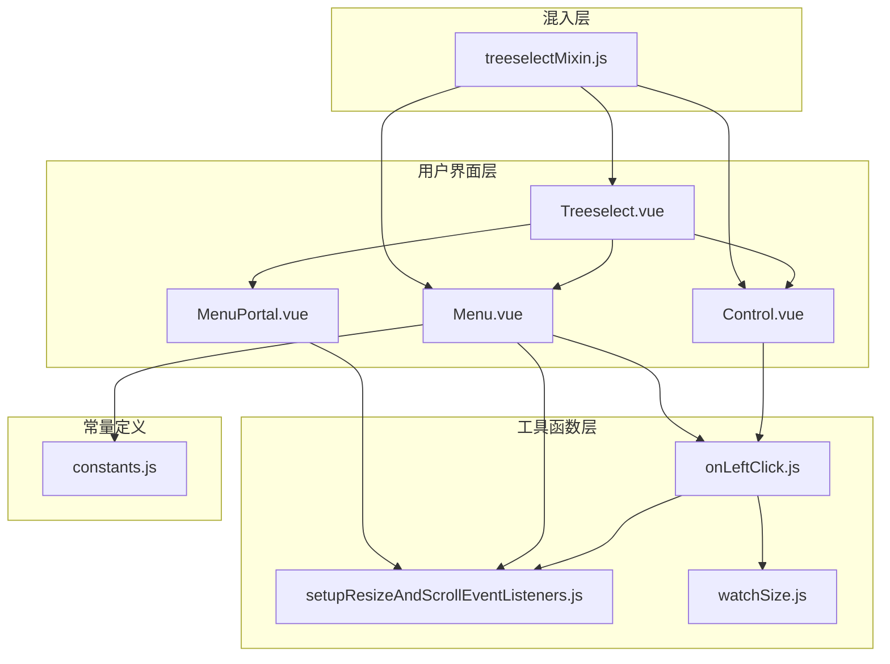
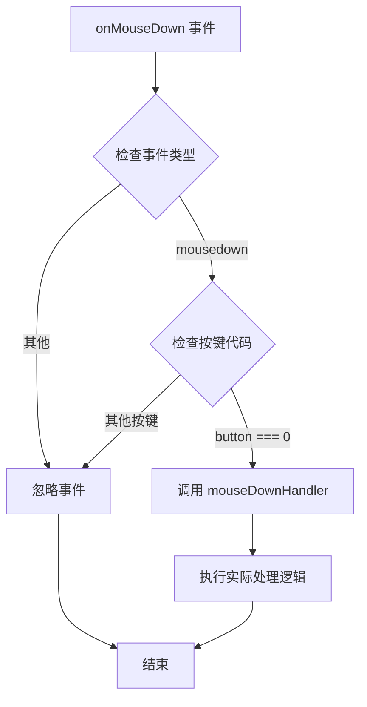
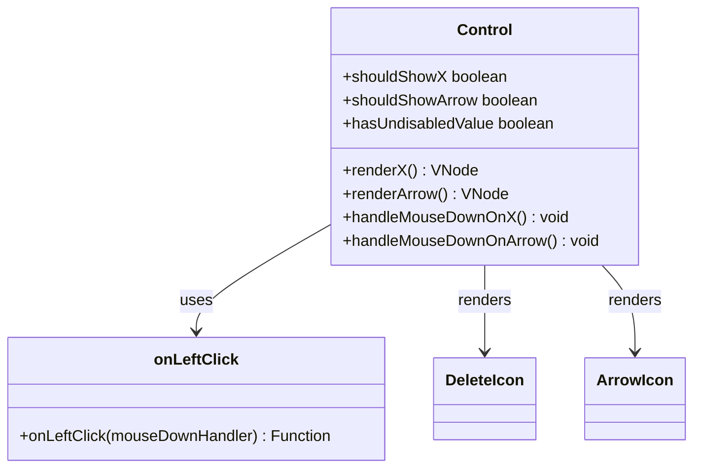
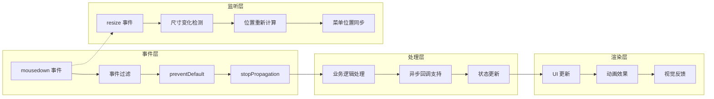
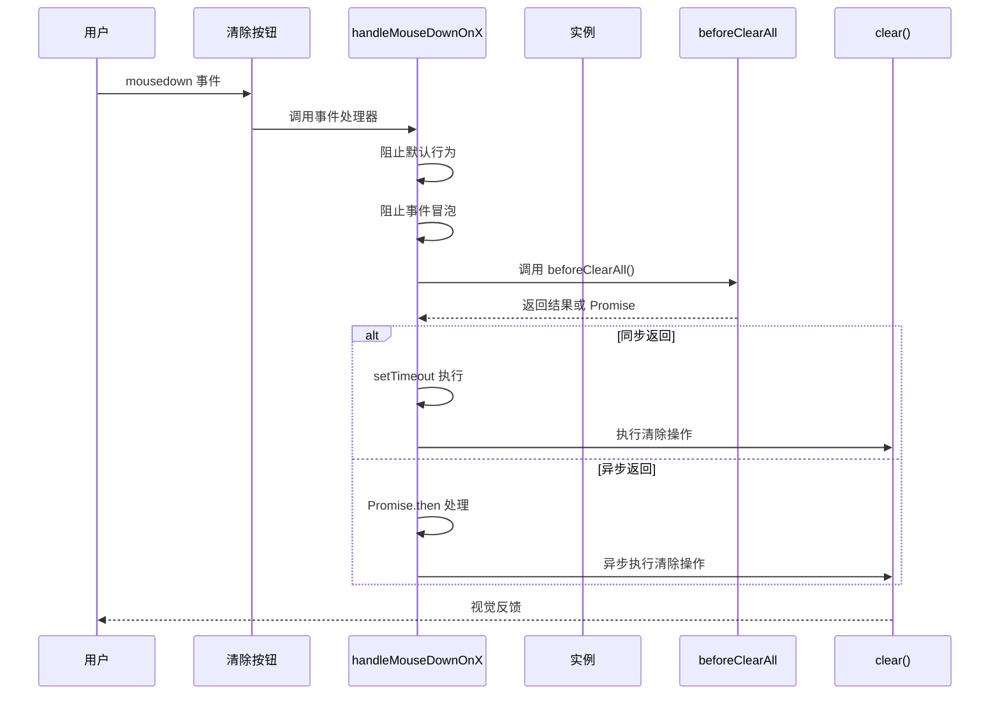
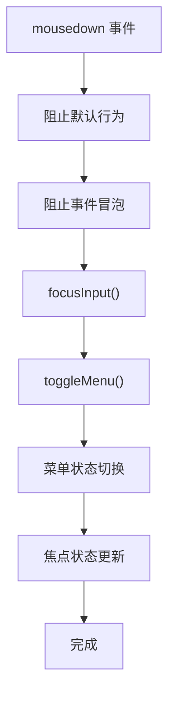
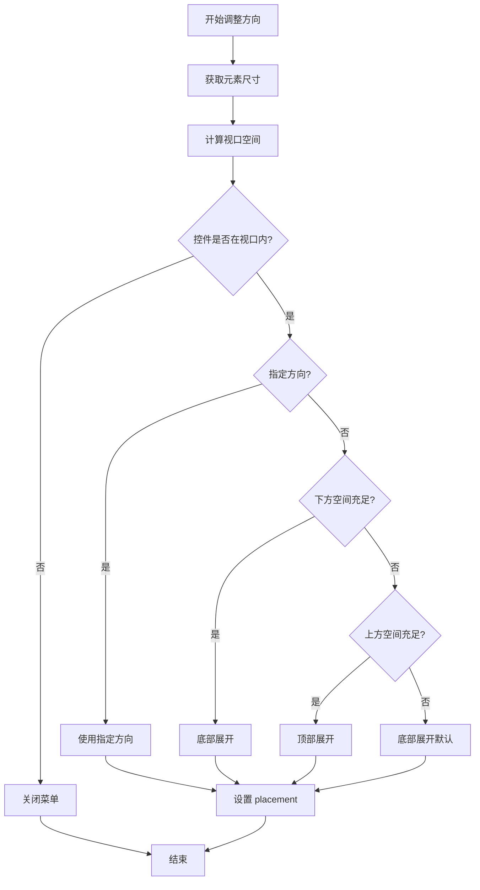
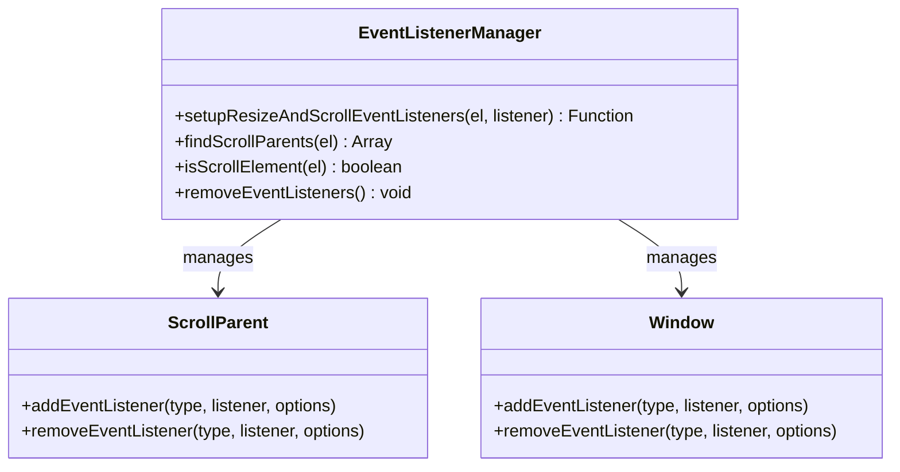
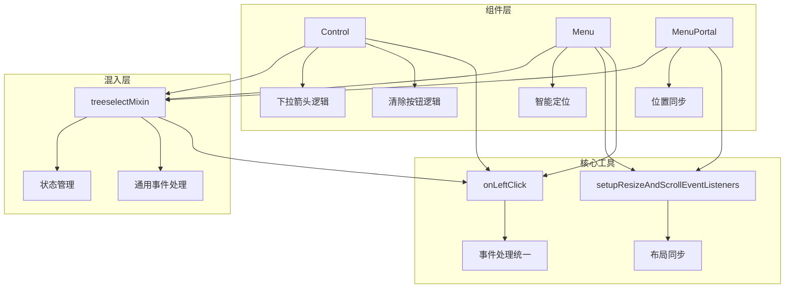

# 鼠标交互

<cite>
**本文档引用的文件**
- [onLeftClick.js](file://src/utils/onLeftClick.js)
- [Control.vue](file://src/components/Control.vue)
- [Menu.vue](file://src/components/Menu.vue)
- [setupResizeAndScrollEventListeners.js](file://src/utils/setupResizeAndScrollEventListeners.js)
- [Treeselect.vue](file://src/components/Treeselect.vue)
- [treeselectMixin.js](file://src/mixins/treeselectMixin.js)
- [MenuPortal.vue](file://src/components/MenuPortal.vue)
- [constants.js](file://src/constants.js)
</cite>

## 目录
1. [简介](#简介)
2. [项目结构概览](#项目结构概览)
3. [核心组件分析](#核心组件分析)
4. [架构总览](#架构总览)
5. [详细组件分析](#详细组件分析)
6. [依赖关系分析](#依赖关系分析)
7. [性能考虑](#性能考虑)
8. [故障排除指南](#故障排除指南)
9. [结论](#结论)

## 简介

本文档深入分析了 Vue Treeselect 组件库中鼠标交互的实现机制，重点关注 onLeftClick 工具函数在防止默认事件和阻止事件冒泡中的应用。详细阐述了 Control 组件中清除按钮（X图标）和下拉箭头的 mousedown 事件处理逻辑，包括对 beforeClearAll 异步回调的支持。同时说明了 Menu 组件如何通过 adjustMenuOpenDirection 方法实现菜单方向的智能调整，根据视口空间自动选择顶部或底部展开。此外还描述了 setupResizeAndScrollEventListeners 工具函数如何监听控制区域的尺寸变化和滚动事件，确保菜单位置实时同步。

## 项目结构概览

Vue Treeselect 是一个功能丰富的树形选择器组件库，采用模块化架构设计。项目的核心交互逻辑分布在多个精心设计的组件中，每个组件都有明确的职责分工：



**图表来源**
- [Treeselect.vue](file://src/components/Treeselect.vue#L1-L42)
- [Control.vue](file://src/components/Control.vue#L1-L154)
- [Menu.vue](file://src/components/Menu.vue#L1-L331)
- [treeselectMixin.js](file://src/mixins/treeselectMixin.js#L1-L50)

**章节来源**
- [Treeselect.vue](file://src/components/Treeselect.vue#L1-L42)
- [Control.vue](file://src/components/Control.vue#L1-L154)
- [Menu.vue](file://src/components/Menu.vue#L1-L331)

## 核心组件分析

### onLeftClick 工具函数

onLeftClick 是一个精心设计的事件处理器包装器，专门用于处理鼠标左键点击事件。它的设计理念是统一处理所有需要区分鼠标按键的事件场景。



**图表来源**
- [onLeftClick.js](file://src/utils/onLeftClick.js#L1-L8)

该工具函数的核心优势在于：
- **事件过滤**：只处理鼠标左键点击（button === 0）
- **类型安全**：确保只响应 mousedown 事件
- **可复用性**：提供统一的事件处理模式
- **性能优化**：避免不必要的事件处理开销

### Control 组件的事件处理

Control 组件是整个 treeselect 的核心交互容器，负责处理清除按钮和下拉箭头的点击事件。



**图表来源**
- [Control.vue](file://src/components/Control.vue#L58-L117)
- [onLeftClick.js](file://src/utils/onLeftClick.js#L1-L8)

**章节来源**
- [Control.vue](file://src/components/Control.vue#L58-L117)
- [onLeftClick.js](file://src/utils/onLeftClick.js#L1-L8)

## 架构总览

Vue Treeselect 的鼠标交互架构采用了分层设计模式，每一层都有明确的职责边界：



**图表来源**
- [Control.vue](file://src/components/Control.vue#L87-L117)
- [Menu.vue](file://src/components/Menu.vue#L240-L249)
- [setupResizeAndScrollEventListeners.js](file://src/utils/setupResizeAndScrollEventListeners.js#L20-L34)

## 详细组件分析

### 清除按钮事件处理机制

清除按钮（X图标）的事件处理是一个典型的异步回调模式实现，展示了现代前端组件设计的最佳实践。



**图表来源**
- [Control.vue](file://src/components/Control.vue#L87-L117)

清除按钮的事件处理具有以下特点：

1. **事件预处理**：立即调用 `evt.preventDefault()` 和 `evt.stopPropagation()`
2. **异步支持**：通过 `isPromise` 检测支持同步和异步回调
3. **兼容性考虑**：为 IE9 提供兼容的异步处理方案
4. **条件渲染**：只有在满足特定条件时才显示清除按钮

### 下拉箭头事件处理机制

下拉箭头的事件处理相对简单但功能完整，主要负责菜单的开关控制和焦点管理。



**图表来源**
- [Control.vue](file://src/components/Control.vue#L119-L128)

下拉箭头处理的关键特性：
- **焦点优先**：总是先聚焦输入框再切换菜单
- **状态同步**：确保菜单状态与焦点状态一致
- **用户体验**：提供即时的视觉反馈

### Menu 组件的智能定位系统

Menu 组件的 `adjustMenuOpenDirection` 方法实现了复杂的视口空间检测算法，确保菜单始终显示在可见区域内。



**图表来源**
- [Menu.vue](file://src/components/Menu.vue#L251-L278)

智能定位系统的算法细节：

| 条件 | 判断依据 | 结果 |
|------|----------|------|
| 控件可见性 | `(controlRect.top >= 0 && controlRect.top <= viewportHeight) \| (controlRect.top < 0 && controlRect.bottom > 0)` | 确定控件是否在视口范围内 |
| 下方空间充足 | `spaceBelow > menuHeight + MENU_BUFFER` | 判断是否有足够空间向下展开 |
| 上方空间充足 | `spaceAbove > menuHeight + MENU_BUFFER` | 判断是否有足够空间向上展开 |
| 指定方向 | `instance.openDirection !== 'auto'` | 是否使用自定义展开方向 |

### 尺寸变化和滚动事件监听

`setupResizeAndScrollEventListeners` 函数提供了全面的布局同步机制，确保菜单位置始终准确。



**图表来源**
- [setupResizeAndScrollEventListeners.js](file://src/utils/setupResizeAndScrollEventListeners.js#L1-L35)

事件监听器的配置策略：

| 事件类型 | 监听目标 | 配置选项 | 用途 |
|----------|----------|----------|------|
| resize | window | `{ passive: true }` | 监听窗口大小变化 |
| scroll | 所有滚动父元素 | `{ passive: true }` | 监听滚动容器变化 |
| scroll | window | `{ passive: true }` | 监听全局滚动 |

**章节来源**
- [Menu.vue](file://src/components/Menu.vue#L251-L318)
- [setupResizeAndScrollEventListeners.js](file://src/utils/setupResizeAndScrollEventListeners.js#L1-L35)

## 依赖关系分析

Vue Treeselect 的鼠标交互系统展现了良好的模块化设计，各组件间通过清晰的接口进行通信。



**图表来源**
- [Control.vue](file://src/components/Control.vue#L1-L5)
- [Menu.vue](file://src/components/Menu.vue#L1-L7)
- [treeselectMixin.js](file://src/mixins/treeselectMixin.js#L1188-L1207)

**章节来源**
- [Control.vue](file://src/components/Control.vue#L1-L154)
- [Menu.vue](file://src/components/Menu.vue#L1-L331)
- [treeselectMixin.js](file://src/mixins/treeselectMixin.js#L1188-L1207)

## 性能考虑

### 事件处理优化

1. **被动事件监听器**：所有滚动和调整事件都使用 `{ passive: true }` 配置
2. **防抖处理**：对于频繁触发的事件（如 resize），配合防抖机制
3. **条件渲染**：只有在必要时才渲染清除按钮和下拉箭头
4. **懒加载**：菜单内容按需加载，减少初始渲染时间

### 内存管理

1. **事件监听器清理**：组件销毁时自动移除所有事件监听器
2. **定时器管理**：使用统一的清理机制避免内存泄漏
3. **DOM 引用管理**：及时释放不再需要的 DOM 元素引用

### 渲染优化

1. **虚拟滚动**：大数据集使用虚拟列表技术
2. **条件更新**：只有在状态真正改变时才触发重新渲染
3. **批量更新**：将多个相关的状态变更合并处理

## 故障排除指南

### 常见问题及解决方案

#### 1. 清除按钮不响应点击

**症状**：点击清除按钮没有反应
**可能原因**：
- `clearable` 属性设置为 false
- 组件处于 disabled 状态
- 没有选中任何值

**解决方案**：
```javascript
// 检查清除按钮显示条件
computed: {
  shouldShowX() {
    return (
      this.instance.clearable &&
      !this.instance.disabled &&
      this.instance.hasValue &&
      (this.hasUndisabledValue || this.instance.allowClearingDisabled)
    )
  }
}
```

#### 2. 菜单位置异常

**症状**：菜单出现在错误的位置
**可能原因**：
- 视口尺寸计算错误
- 父级元素有 transform 或 position 影响
- 动态内容导致尺寸变化未被检测

**解决方案**：
- 确保 `setupResizeAndScrollEventListeners` 正确初始化
- 检查 CSS 样式对定位的影响
- 在内容变化后手动调用 `adjustMenuOpenDirection`

#### 3. 事件冒泡冲突

**症状**：点击组件外部时菜单未正确关闭
**可能原因**：
- 事件监听器未正确绑定
- 点击检测逻辑有误

**解决方案**：
```javascript
// 确保正确的事件处理链
handleClickOutside(evt) {
  if (this.$refs.wrapper && !this.$refs.wrapper.contains(evt.target)) {
    this.blurInput()
    this.closeMenu()
  }
}
```

**章节来源**
- [Control.vue](file://src/components/Control.vue#L18-L53)
- [Menu.vue](file://src/components/Menu.vue#L251-L278)
- [treeselectMixin.js](file://src/mixins/treeselectMixin.js#L1209-L1215)

## 结论

Vue Treeselect 的鼠标交互系统展现了现代前端组件库的设计精髓。通过 onLeftClick 工具函数的统一事件处理模式，结合 Control 组件的精确事件控制和 Menu 组件的智能定位算法，构建了一个既强大又易用的交互体系。

关键技术亮点：

1. **事件处理标准化**：onLeftClick 提供了一致的事件处理接口
2. **异步回调支持**：beforeClearAll 的 Promise 支持确保了灵活的业务逻辑集成
3. **智能定位算法**：基于视口空间的动态菜单方向调整
4. **实时布局同步**：完善的 resize 和 scroll 事件监听机制
5. **性能优化**：被动事件监听器和条件渲染策略

这套交互系统不仅满足了复杂业务场景的需求，还保持了良好的性能表现和用户体验。对于开发者而言，它提供了一个优秀的参考模型，展示了如何在复杂的 UI 组件中实现优雅的事件处理和状态管理。