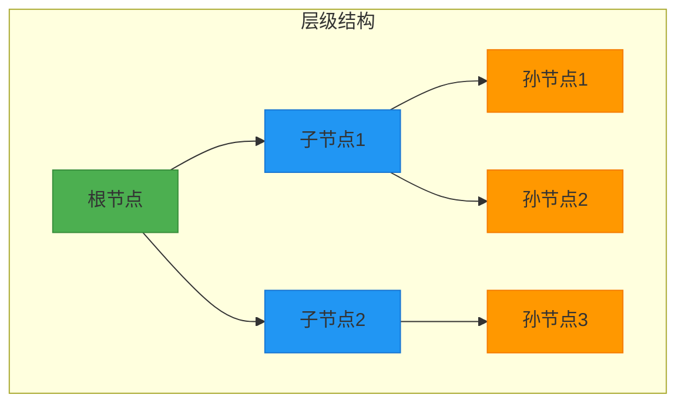
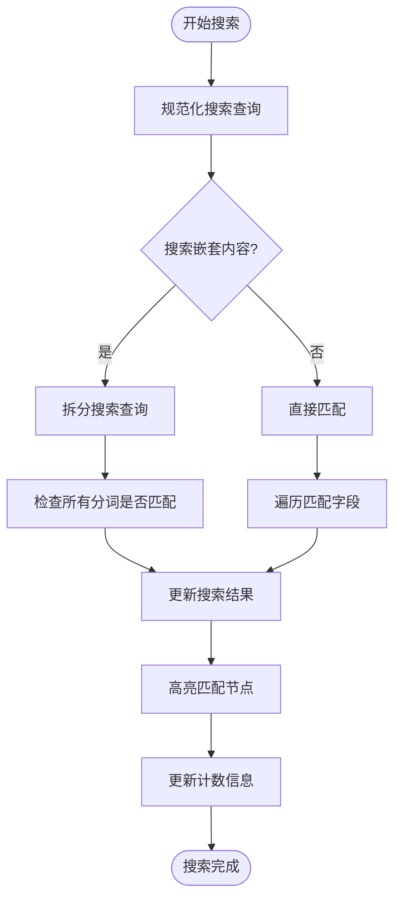
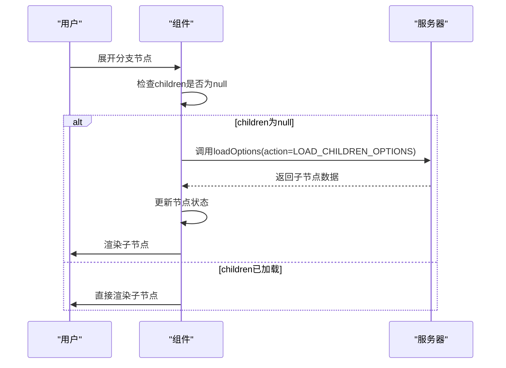
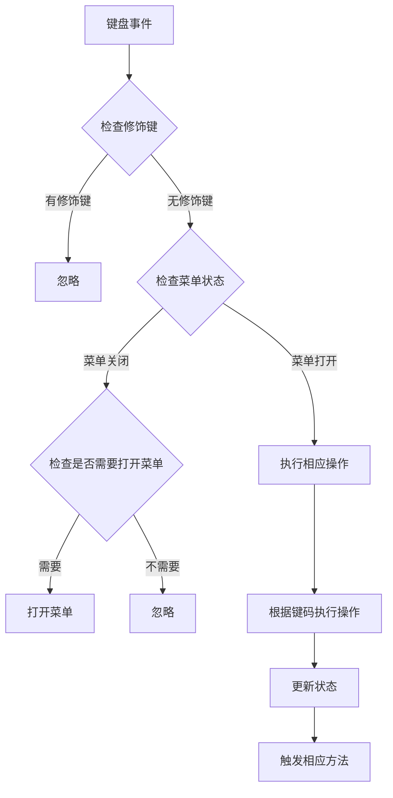
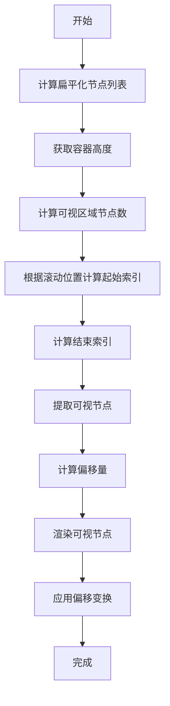

# 功能详解

<cite>
**本文档引用的文件**   
- [Treeselect.vue](file://src/components/Treeselect.vue)
- [VirtualList.vue](file://src/components/VirtualList.vue)
- [treeselectMixin.js](file://src/mixins/treeselectMixin.js)
- [Menu.vue](file://src/components/Menu.vue)
- [Option.vue](file://src/components/Option.vue)
- [Input.vue](file://src/components/Input.vue)
- [constants.js](file://src/constants.js)
- [debounce.js](file://src/utils/debounce.js)
- [LargeDataExample.vue](file://src/examples/LargeDataExample.vue)
</cite>

## 目录
1. [基础选择功能](#基础选择功能)
2. [树形结构渲染](#树形结构渲染)
3. [搜索功能实现](#搜索功能实现)
4. [延迟加载与动态加载](#延迟加载与动态加载)
5. [键盘导航支持](#键盘导航支持)
6. [虚拟滚动性能优化](#虚拟滚动性能优化)

## 基础选择功能

该组件支持单选和多选两种模式，通过 `multiple` 属性进行配置。当 `multiple` 设置为 `false` 时为单选模式，设置为 `true` 时为多选模式。选择状态的管理通过 `forest` 数据结构中的 `selectedNodeIds` 和 `checkedStateMap` 来维护。

在单选模式下，每次选择新选项时会自动清除之前的选中状态。在多选模式下，组件提供了多种选择策略，通过 `valueConsistsOf` 属性配置：
- `ALL`：所有选中的节点都包含在值中
- `BRANCH_PRIORITY`：分支节点选中时，其后代节点不包含在值中
- `LEAF_PRIORITY`：分支节点选中时，仅其叶后代节点包含在值中
- `ALL_WITH_INDETERMINATE`：包含所有选中节点和半选节点

选择操作通过 `select()` 方法处理，该方法会根据当前模式和配置决定是添加还是移除节点，并触发相应的事件。

**Section sources**
- [treeselectMixin.js](file://src/mixins/treeselectMixin.js#L1784-L1950)
- [constants.js](file://src/constants.js#L20-L24)

## 树形结构渲染

树形结构的渲染逻辑主要通过 `Option.vue` 组件实现，处理父子节点关联、分支展开控制和层级缩进。

### 父子节点关联
组件通过 `node` 对象的 `parentNode` 属性建立父子关系，每个节点都维护对其父节点的引用，形成完整的树形结构。在 `treeselectMixin.js` 中，`traverseAllNodesByIndex` 和 `traverseDescendantsBFS` 等方法用于遍历树结构。

### 分支展开控制
分支节点的展开状态通过 `shouldExpand` 计算属性控制，该属性检查节点是否为分支节点且当前是否应该展开。展开/折叠操作通过 `toggleExpanded()` 方法实现，支持点击箭头图标或使用键盘操作。

### 层级缩进处理
层级缩进通过 CSS 类 `vue-treeselect__indent-level-{level}` 实现，其中 `level` 表示节点的层级深度。在 `Option.vue` 的渲染函数中，根据节点的 `level` 属性动态生成相应的缩进类。

**Diagram sources **
- [Option.vue](file://src/components/Option.vue#L284-L288)
- [treeselectMixin.js](file://src/mixins/treeselectMixin.js#L786-L794)

**Section sources**
- [Option.vue](file://src/components/Option.vue#L79-L117)
- [treeselectMixin.js](file://src/mixins/treeselectMixin.js#L783-L797)

## 搜索功能实现

搜索功能包括本地模糊匹配、异步搜索流程和防抖机制。

### 本地模糊匹配算法
本地搜索通过 `handleLocalSearch` 方法实现，支持模糊匹配和精确匹配两种模式。模糊匹配使用 `fuzzysearch` 库，精确匹配使用简单的字符串包含检查。搜索时会遍历所有节点，根据 `matchKeys` 属性指定的字段进行匹配。

**Diagram sources **
- [treeselectMixin.js](file://src/mixins/treeselectMixin.js#L1227-L1280)
- [constants.js](file://src/constants.js#L1-L19)

### 异步搜索流程
异步搜索通过 `handleRemoteSearch` 方法实现，当 `async` 属性为 `true` 时启用。搜索请求通过 `loadOptions` 回调函数发送到服务器，支持缓存机制，可通过 `cacheOptions` 属性控制。

### 防抖机制
搜索输入的防抖通过 `debounce` 工具函数实现，延迟时间为 200ms（测试环境为 10ms）。这可以避免在用户快速输入时频繁触发搜索操作，提高性能。

**Section sources**
- [treeselectMixin.js](file://src/mixins/treeselectMixin.js#L1283-L1337)
- [Input.vue](file://src/components/Input.vue#L53-L58)
- [constants.js](file://src/constants.js#L46-L48)

## 延迟加载与动态加载

延迟加载和动态加载通过 `loadOptions` API 集成实现，支持根节点和子节点的按需加载。

### API集成方式
通过 `loadOptions` 属性提供一个回调函数，该函数在需要加载选项时被调用。回调函数接收 `action` 参数，指示加载类型：
- `LOAD_ROOT_OPTIONS`：加载根节点
- `LOAD_CHILDREN_OPTIONS`：加载子节点
- `ASYNC_SEARCH`：异步搜索

### 数据加载策略
组件提供了两种主要的加载策略：

1. **根节点延迟加载**：通过 `autoLoadRootOptions` 属性控制，设置为 `false` 时根节点在菜单打开时才加载
2. **子节点动态加载**：当用户展开分支节点时，如果该节点的 `children` 为 `null`，则触发 `loadChildrenOptions` 方法加载子节点

**Diagram sources **
- [treeselectMixin.js](file://src/mixins/treeselectMixin.js#L1672-L1730)
- [Option.vue](file://src/components/Option.vue#L256-L263)

**Section sources**
- [treeselectMixin.js](file://src/mixins/treeselectMixin.js#L1672-L1744)
- [Option.vue](file://src/components/Option.vue#L230-L244)

## 键盘导航支持

组件支持完整的键盘导航，包括 Tab、Enter、Arrow 键等操作的交互逻辑。

### 主要键盘操作
- **Tab**：在组件间切换焦点
- **Enter**：选择当前高亮的选项
- **Escape**：关闭菜单或清除输入
- **End**：高亮最后一个选项
- **Home**：高亮第一个选项
- **Arrow Left**：折叠当前节点或跳转到父节点
- **Arrow Up**：高亮上一个选项
- **Arrow Right**：展开当前节点
- **Arrow Down**：高亮下一个选项
- **Backspace/Delete**：移除最后一个选中项

### 交互逻辑
键盘导航的处理主要在 `Input.vue` 组件的 `onKeyDown` 方法中实现。组件会根据当前菜单状态和节点类型执行相应的操作。例如，当在分支节点上按左箭头时，如果节点已展开则折叠，如果已折叠则跳转到父节点。

**Diagram sources **
- [Input.vue](file://src/components/Input.vue#L116-L202)
- [treeselectMixin.js](file://src/mixins/treeselectMixin.js#L1784-L1823)

**Section sources**
- [Input.vue](file://src/components/Input.vue#L116-L202)
- [shared.js](file://test/unit/specs/shared.js#L36-L90)

## 虚拟滚动性能优化

虚拟滚动是处理大量数据的关键性能优化技术，通过只渲染可视区域内的节点来大幅提升性能。

### 原理
虚拟滚动的核心原理是：
1. 计算所有可见节点的扁平化列表
2. 根据容器高度和滚动位置计算可视区域
3. 只渲染可视区域内的节点及其缓冲区
4. 使用 CSS transform 定位渲染的节点

### 配置参数
虚拟滚动通过以下参数进行配置：
- `virtualScroll`：启用/禁用虚拟滚动
- `optionHeight`：每个选项的高度（默认 40px）
- `bufferSize`：上下缓冲区数量（默认 5）

在 `VirtualList.vue` 组件中，通过 `flattenedItems` 计算属性生成扁平化的节点列表，`startIndex` 和 `endIndex` 计算属性确定需要渲染的节点范围，`offsetY` 计算属性确定渲染容器的偏移位置。

**Diagram sources **
- [VirtualList.vue](file://src/components/VirtualList.vue#L38-L131)
- [Menu.vue](file://src/components/Menu.vue#L165-L167)

**Section sources**
- [VirtualList.vue](file://src/components/VirtualList.vue#L1-L232)
- [LargeDataExample.vue](file://src/examples/LargeDataExample.vue#L7-L38)