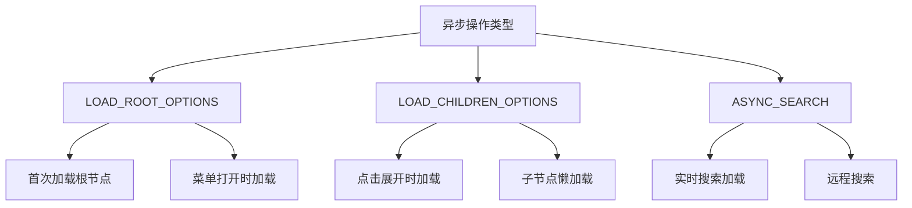
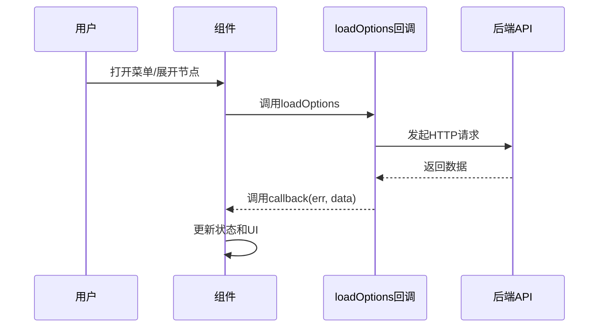
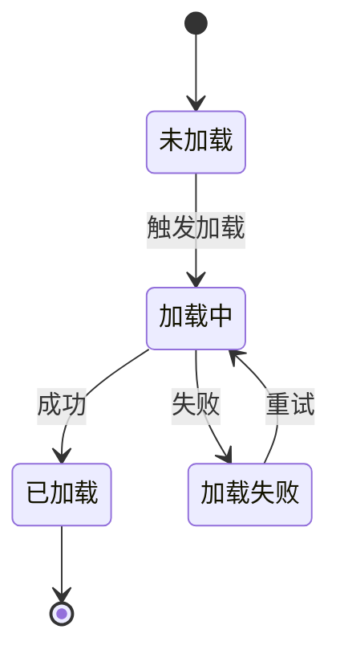
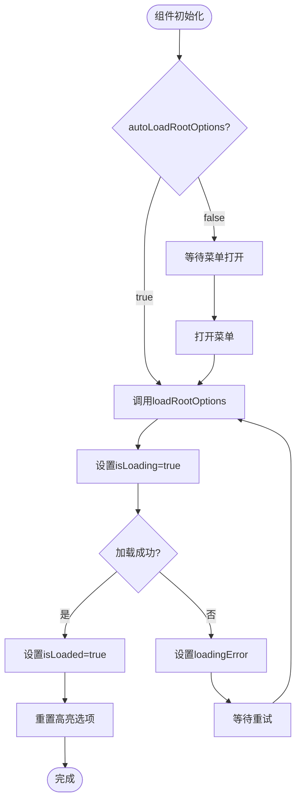
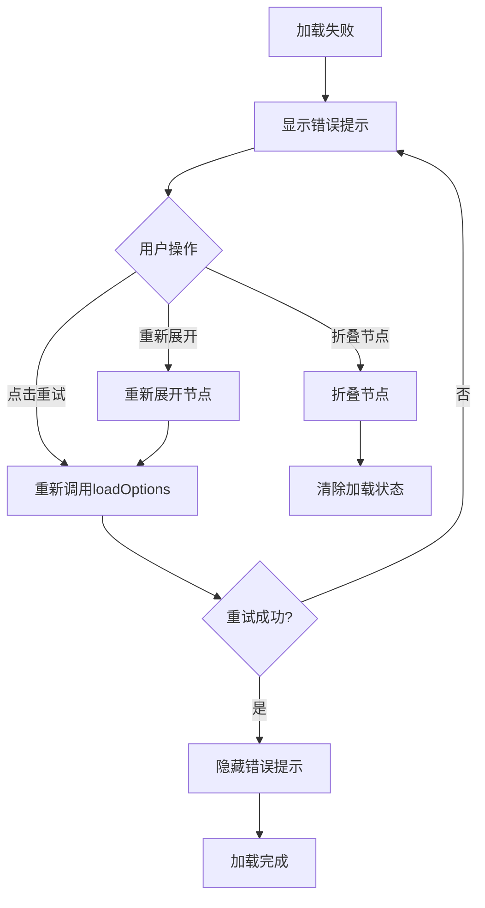
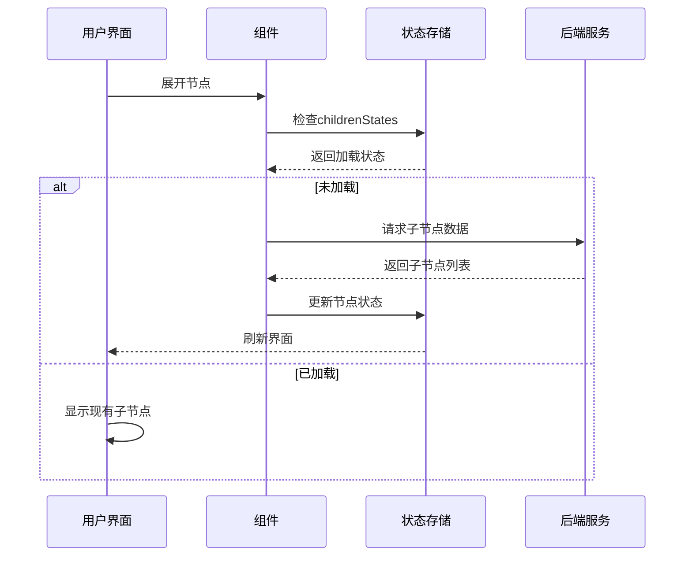

# 加载功能

<cite>
**本文档中引用的文件**
- [Treeselect.vue](file://src/components/Treeselect.vue)
- [treeselectMixin.js](file://src/mixins/treeselectMixin.js)
- [constants.js](file://src/constants.js)
- [Menu.vue](file://src/components/Menu.vue)
- [DynamicalLoading.spec.js](file://test/unit/specs/DynamicalLoading.spec.js)
- [MenuPortal.vue](file://src/components/MenuPortal.vue)
- [index.js](file://src/utils/index.js)
</cite>

## 目录
1. [概述](#概述)
2. [核心概念](#核心概念)
3. [loadOptions 回调函数详解](#loadoptions-回调函数详解)
4. [动作类型与触发条件](#动作类型与触发条件)
5. [rootOptionsStates 状态管理](#rootoptionsstates-状态管理)
6. [子节点加载与重试机制](#子节点加载与重试机制)
7. [无限层级树形数据动态加载](#无限层级树形数据动态加载)
8. [实际用例与最佳实践](#实际用例与最佳实践)
9. [性能考虑](#性能考虑)
10. [故障排除指南](#故障排除指南)

## 概述

Vue TreeSelect 组件提供了一套完整的延迟加载和动态加载机制，支持无限层级的树形数据动态加载。该系统通过 `loadOptions` 回调函数实现与后端 API 的集成，提供了灵活的状态管理和错误处理机制。

### 主要特性

- **延迟加载根选项**：支持自动或手动触发根选项加载
- **动态子节点加载**：点击展开时按需加载子节点
- **智能状态管理**：完整的加载状态跟踪和错误处理
- **重试机制**：加载失败时的自动重试功能
- **性能优化**：支持虚拟滚动和大数据集处理

## 核心概念

### 异步操作类型

系统定义了三种主要的异步操作类型：



**图表来源**
- [constants.js](file://src/constants.js#L15-L18)

### 数据流架构



**图表来源**
- [treeselectMixin.js](file://src/mixins/treeselectMixin.js#L1732-L1766)

## loadOptions 回调函数详解

### 函数签名与参数结构

`loadOptions` 是一个关键的回调函数，用于动态加载树形数据：

```javascript
function loadOptions({ action, callback, parentNode, searchQuery, instanceId }) {
  // 实现加载逻辑
}
```

### 参数详解

| 参数名 | 类型 | 描述 | 必需 |
|--------|------|------|------|
| `action` | String | 操作类型（LOAD_ROOT_OPTIONS/LOAD_CHILDREN_OPTIONS/ASYNC_SEARCH） | 是 |
| `callback` | Function | 回调函数，用于通知加载结果 | 是 |
| `parentNode` | Object | 当前父节点对象（仅在加载子节点时存在） | 否 |
| `searchQuery` | String | 搜索查询字符串（仅在异步搜索时存在） | 否 |
| `instanceId` | String/Number | 组件实例标识符 | 是 |

### 调用时机

1. **根选项加载**：
   - 组件挂载时（`autoLoadRootOptions: true`）
   - 菜单首次打开时（`autoLoadRootOptions: false`）

2. **子节点加载**：
   - 展开未加载的分支节点时
   - 检测到卸载的分支节点时

3. **异步搜索**：
   - 用户输入搜索关键词时（当 `async: true`）

**章节来源**
- [treeselectMixin.js](file://src/mixins/treeselectMixin.js#L1732-L1766)

## 动作类型与触发条件

### LOAD_ROOT_OPTIONS 动作类型

**触发条件**：
- 组件初始化且 `autoLoadRootOptions: true`
- 菜单首次打开且 `autoLoadRootOptions: false`
- 根选项加载失败后的重试

**状态变化**：


**图表来源**
- [treeselectMixin.js](file://src/mixins/treeselectMixin.js#L1672-L1695)

### LOAD_CHILDREN_OPTIONS 动作类型

**触发条件**：
- 展开具有 `children: null` 的分支节点
- 子节点加载失败后的重试
- 恢复已折叠的节点状态

**状态管理**：
每个节点都有独立的加载状态对象 `childrenStates`，包含：
- `isLoading`: 是否正在加载
- `isLoaded`: 是否已加载完成
- `loadingError`: 加载错误信息

**章节来源**
- [treeselectMixin.js](file://src/mixins/treeselectMixin.js#L1698-L1731)

## rootOptionsStates 状态管理

### 状态对象结构

`rootOptionsStates` 对象管理根选项的加载状态：

```javascript
const rootOptionsStates = {
  isLoaded: false,      // 根选项是否已加载
  isLoading: false,     // 是否正在加载
  loadingError: '',     // 加载错误信息
}
```

### 生命周期管理



**图表来源**
- [treeselectMixin.js](file://src/mixins/treeselectMixin.js#L1672-L1695)

### 状态更新流程

状态更新遵循严格的顺序以确保数据一致性：

1. **开始加载**：设置 `isLoading = true`，清空错误信息
2. **执行加载**：调用用户提供的 `loadOptions` 函数
3. **处理结果**：
   - 成功：设置 `isLoaded = true`，触发 UI 更新
   - 失败：记录错误信息，允许重试
4. **结束加载**：设置 `isLoading = false`

**章节来源**
- [treeselectMixin.js](file://src/mixins/treeselectMixin.js#L1672-L1695)

## 子节点加载与重试机制

### 加载状态管理

每个节点的子节点加载状态由 `childrenStates` 对象管理：

```javascript
const node = {
  childrenStates: {
    isLoaded: false,
    isLoading: false,
    loadingError: '',
  }
}
```

### 重试机制实现

系统提供了完善的重试机制来处理加载失败的情况：



**图表来源**
- [DynamicalLoading.spec.js](file://test/unit/specs/DynamicalLoading.spec.js#L130-L186)

### retryText 和 retryTitle 配置

系统提供了两个配置项来自定义重试按钮的行为：

| 配置项 | 默认值 | 描述 |
|--------|--------|------|
| `retryText` | 'Retry?' | 重试按钮的文本内容 |
| `retryTitle` | 'Click to retry' | 重试按钮的工具提示 |

这些配置项影响错误提示中的重试链接外观和行为。

**章节来源**
- [treeselectMixin.js](file://src/mixins/treeselectMixin.js#L499-L512)
- [Menu.vue](file://src/components/Menu.vue#L200-L203)

## 无限层级树形数据动态加载

### 实现原理

系统支持无限层级的树形数据动态加载，通过以下机制实现：

1. **懒加载策略**：只有在需要时才加载子节点
2. **状态隔离**：每个节点的加载状态独立管理
3. **递归加载**：子节点可以包含新的未加载分支节点

### 数据结构示例

```javascript
// 根节点
{
  id: 'root',
  label: '根目录',
  children: null, // 表示未加载的子节点
}

// 已加载的子节点
{
  id: 'folder1',
  label: '文件夹1',
  children: [
    {
      id: 'file1',
      label: '文件1.txt',
      children: [] // 叶子节点
    }
  ]
}
```

### 加载流程



**图表来源**
- [treeselectMixin.js](file://src/mixins/treeselectMixin.js#L1698-L1731)

### 性能优化策略

1. **虚拟滚动**：对于大量数据使用虚拟滚动技术
2. **防抖处理**：搜索操作使用防抖减少请求频率
3. **缓存机制**：已加载的数据保持在内存中
4. **并发控制**：避免同时发起过多的加载请求

**章节来源**
- [Menu.vue](file://src/components/Menu.vue#L165-L167)

## 实际用例与最佳实践

### 基础配置示例

```javascript
// 基本的树形选择器配置
const treeSelectConfig = {
  loadOptions({ action, callback }) {
    if (action === 'LOAD_ROOT_OPTIONS') {
      // 模拟API调用
      setTimeout(() => {
        const options = [
          {
            id: 'documents',
            label: '文档',
            children: null, // 标记为未加载
          },
          {
            id: 'images',
            label: '图片',
            children: null,
          }
        ];
        this.options = options;
        callback();
      }, 500);
    }
  }
};
```

### 错误处理最佳实践

```javascript
function robustLoadOptions({ action, callback }) {
  try {
    // 模拟网络请求
    fetch('/api/tree-data')
      .then(response => {
        if (!response.ok) {
          throw new Error(`HTTP ${response.status}: ${response.statusText}`);
        }
        return response.json();
      })
      .then(data => {
        // 处理数据
        this.options = processData(data);
        callback();
      })
      .catch(error => {
        console.error('加载树形数据失败:', error);
        callback(new Error('无法加载数据，请稍后重试'));
      });
  } catch (error) {
    callback(new Error('内部错误'));
  }
}
```

### 复杂场景处理

#### 1. 分页加载
```javascript
function paginatedLoadOptions({ action, callback, parentNode }) {
  const page = 1;
  const pageSize = 20;
  
  fetch(`/api/tree-data?parentId=${parentNode.id}&page=${page}&pageSize=${pageSize}`)
    .then(response => response.json())
    .then(data => {
      parentNode.children = data.items;
      callback();
    })
    .catch(callback);
}
```

#### 2. 条件加载
```javascript
function conditionalLoadOptions({ action, callback, parentNode }) {
  // 只有在特定条件下才加载子节点
  if (parentNode.requiresAuthentication && !this.isAuthenticated) {
    callback(new Error('需要登录才能查看此内容'));
    return;
  }
  
  // 执行加载逻辑
  loadDataForNode(parentNode)
    .then(() => callback())
    .catch(callback);
}
```

**章节来源**
- [DynamicalLoading.spec.js](file://test/unit/specs/DynamicalLoading.spec.js#L694-L750)

## 性能考虑

### 内存管理

1. **状态清理**：组件销毁时自动清理事件监听器
2. **数据缓存**：合理使用浏览器缓存减少重复请求
3. **垃圾回收**：及时释放不再使用的数据引用

### 网络优化

1. **请求合并**：将多个相关的加载请求合并为单个请求
2. **压缩传输**：启用gzip压缩减少传输数据量
3. **CDN加速**：使用CDN分发静态资源

### 渲染优化

1. **虚拟滚动**：大数据集使用虚拟滚动技术
2. **懒加载**：只渲染可见区域的内容
3. **防抖处理**：搜索操作使用防抖减少渲染频率

**章节来源**
- [treeselectMixin.js](file://src/mixins/treeselectMixin.js#L1972-L1982)

## 故障排除指南

### 常见问题与解决方案

#### 1. 加载超时问题

**症状**：加载长时间无响应
**原因**：网络延迟或后端处理时间过长
**解决方案**：
- 实现请求超时机制
- 提供加载进度指示
- 添加重试逻辑

#### 2. 内存泄漏

**症状**：长时间使用后页面变慢
**原因**：事件监听器未正确清理
**解决方案**：
- 确保在组件销毁时清理所有事件监听器
- 使用弱引用避免循环引用

#### 3. 状态不一致

**症状**：UI状态与数据状态不同步
**原因**：异步操作导致的状态竞争
**解决方案**：
- 使用严格的状态管理模式
- 实现操作队列机制
- 添加状态锁机制

### 调试技巧

1. **启用调试模式**：设置环境变量启用详细日志
2. **监控网络请求**：检查API调用的响应时间和成功率
3. **状态检查**：定期检查组件状态的一致性

**章节来源**
- [DynamicalLoading.spec.js](file://test/unit/specs/DynamicalLoading.spec.js#L707-L779)

## 结论

Vue TreeSelect 的加载功能提供了一个强大而灵活的解决方案，支持复杂的树形数据动态加载需求。通过合理的配置和最佳实践，可以构建高性能、用户体验良好的树形选择器组件。

关键要点：
- 正确实现 `loadOptions` 回调函数
- 合理管理加载状态和错误处理
- 利用重试机制提高系统可靠性
- 针对大数据集进行性能优化