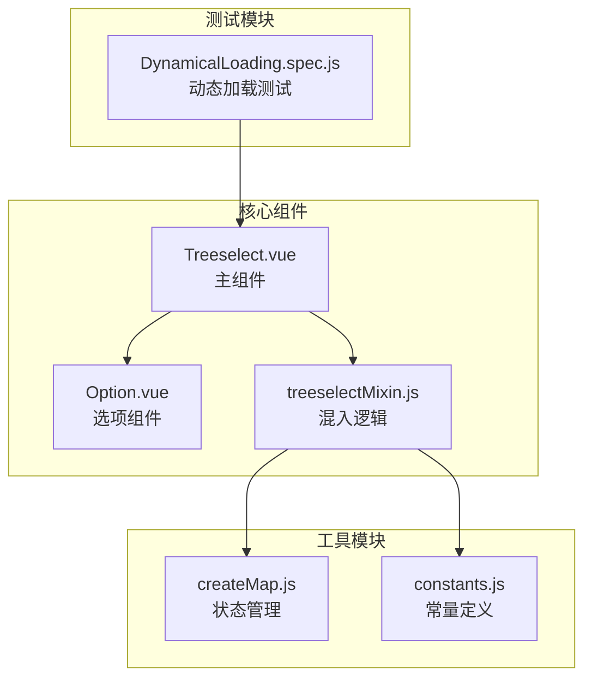
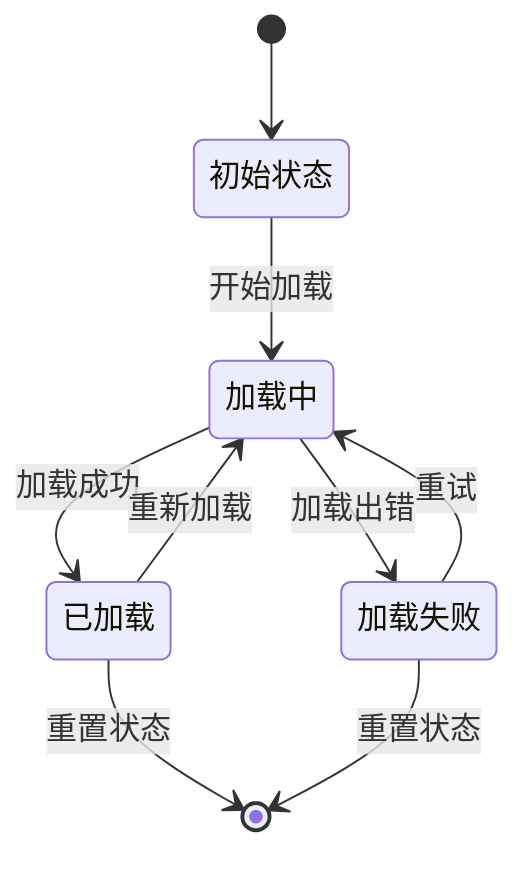
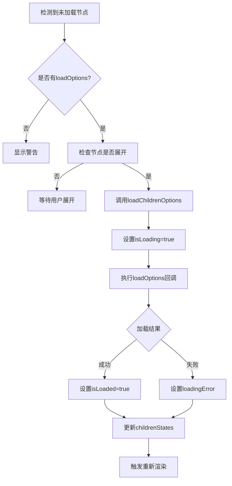
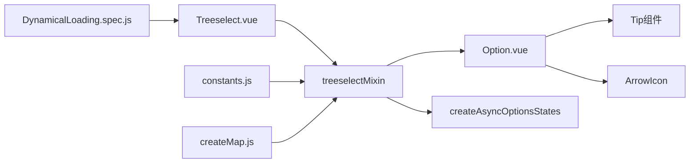

# 子节点动态加载

<cite>
**本文档引用的文件**
- [src/components/Treeselect.vue](file://src/components/Treeselect.vue)
- [src/components/Option.vue](file://src/components/Option.vue)
- [src/mixins/treeselectMixin.js](file://src/mixins/treeselectMixin.js)
- [src/utils/createMap.js](file://src/utils/createMap.js)
- [src/constants.js](file://src/constants.js)
- [test/unit/specs/DynamicalLoading.spec.js](file://test/unit/specs/DynamicalLoading.spec.js)
</cite>

## 目录
1. [简介](#简介)
2. [项目结构概览](#项目结构概览)
3. [核心组件分析](#核心组件分析)
4. [架构概览](#架构概览)
5. [详细组件分析](#详细组件分析)
6. [依赖关系分析](#依赖关系分析)
7. [性能考虑](#性能考虑)
8. [故障排除指南](#故障排除指南)
9. [结论](#结论)

## 简介

Vue Treeselect 是一个功能强大的树形选择器组件，支持子节点的动态加载功能。该功能允许开发者在用户展开未加载的分支节点时按需加载子节点数据，从而实现无限层级的树形数据懒加载。本文档深入解析了子节点动态加载的API集成与交互逻辑，包括 `loadOptions` 回调函数的调用时机、`parentNode` 参数结构、节点状态管理以及完整的用户交互反馈机制。

## 项目结构概览

Vue Treeselect 采用模块化架构设计，主要包含以下核心模块：



**图表来源**
- [src/components/Treeselect.vue](file://src/components/Treeselect.vue#L1-L42)
- [src/components/Option.vue](file://src/components/Option.vue#L1-L311)
- [src/mixins/treeselectMixin.js](file://src/mixins/treeselectMixin.js#L1-L1984)

**章节来源**
- [src/components/Treeselect.vue](file://src/components/Treeselect.vue#L1-L42)
- [src/components/Option.vue](file://src/components/Option.vue#L1-L311)
- [src/mixins/treeselectMixin.js](file://src/mixins/treeselectMixin.js#L1-L1984)

## 核心组件分析

### Treeselect 主组件

Treeselect 主组件作为整个树形选择器的入口点，负责协调各个子组件的工作。它通过 `mixins` 属性引入了 treeselectMixin 混入，提供了完整的树形数据管理和状态控制功能。

### Option 选项组件

Option 组件是树形结构中每个节点的具体表现形式，负责渲染单个选项的视觉元素和交互行为。该组件包含了完整的子节点加载状态显示逻辑。

### treeselectMixin 混入

treeselectMixin 包含了所有核心的业务逻辑，包括节点状态管理、数据加载控制、选中状态处理等关键功能。

**章节来源**
- [src/components/Treeselect.vue](file://src/components/Treeselect.vue#L8-L42)
- [src/components/Option.vue](file://src/components/Option.vue#L9-L311)
- [src/mixins/treeselectMixin.js](file://src/mixins/treeselectMixin.js#L64-L1984)

## 架构概览

Vue Treeselect 的子节点动态加载架构采用了分层设计模式：

```mermaid
sequenceDiagram
participant User as 用户
participant Option as Option组件
participant Mixin as treeselectMixin
participant LoadOptions as loadOptions回调
participant API as 后端API
User->>Option : 展开未加载节点
Option->>Mixin : toggleExpanded()
Mixin->>Mixin : 检查childrenStates.isLoaded
Mixin->>LoadOptions : 调用loadChildrenOptions()
LoadOptions->>API : 发起数据请求
API-->>LoadOptions : 返回子节点数据
LoadOptions->>Mixin : 执行callback()
Mixin->>Mixin : 更新childrenStates
Mixin-->>Option : 触发重新渲染
Option-->>User : 显示加载的子节点
```

**图表来源**
- [src/mixins/treeselectMixin.js](file://src/mixins/treeselectMixin.js#L1698-L1730)
- [src/components/Option.vue](file://src/components/Option.vue#L275-L279)

## 详细组件分析

### loadOptions 回调函数详解

#### 调用时机

`loadOptions` 回调函数在以下情况下被调用：

1. **用户展开未加载的分支节点时**：当用户点击展开箭头且节点的 `childrenStates.isLoaded` 为 `false` 时触发
2. **组件初始化时**：如果节点配置为默认展开且需要加载子节点时触发

#### parentNode 参数结构

`parentNode` 参数包含了父节点的原始数据结构，其结构如下：

```javascript
{
  id: '节点唯一标识',
  label: '节点显示名称',
  children: null, // 表示未加载的子节点
  // 其他自定义属性
}
```

#### 参数传递机制

系统会将原始的 `raw` 节点数据传递给 `loadOptions` 回调，确保后端 API 获取到的数据格式与原始数据一致。

**章节来源**
- [src/mixins/treeselectMixin.js](file://src/mixins/treeselectMixin.js#L1702-L1712)
- [test/unit/specs/DynamicalLoading.spec.js](file://test/unit/specs/DynamicalLoading.spec.js#L72-L84)

### childrenStates 对象管理

#### 状态结构定义

每个节点都维护一个 `childrenStates` 对象来管理加载状态：

```javascript
{
  isLoaded: false,    // 是否已加载完成
  isLoading: false,   // 是否正在加载
  loadingError: ''    // 加载错误信息
}
```

#### 状态转换流程



**图表来源**
- [src/mixins/treeselectMixin.js](file://src/mixins/treeselectMixin.js#L37-L43)
- [src/mixins/treeselectMixin.js](file://src/mixins/treeselectMixin.js#L1713-L1729)

**章节来源**
- [src/mixins/treeselectMixin.js](file://src/mixins/treeselectMixin.js#L37-L43)
- [src/mixins/treeselectMixin.js](file://src/mixins/treeselectMixin.js#L1713-L1729)

### Option.vue 组件中的状态显示

#### 加载提示渲染

当节点处于加载状态时，Option 组件会渲染加载提示：

```javascript
renderLoadingChildrenTip() {
  const { instance, node } = this
  
  if (!node.childrenStates.isLoading) return null
  
  return (
    <Tip type="loading" icon="loader">{ instance.loadingText }</Tip>
  )
}
```

#### 错误提示与重试机制

当加载失败时，组件提供错误提示和重试按钮：

```javascript
renderLoadingChildrenErrorTip() {
  const { instance, node } = this
  
  if (!node.childrenStates.loadingError) return null
  
  return (
    <Tip type="error" icon="error">
      { node.childrenStates.loadingError }
      <a class="vue-treeselect__retry" 
         title={instance.retryTitle} 
         onMousedown={this.handleMouseDownOnRetry}>
        { instance.retryText }
      </a>
    </Tip>
  )
}
```

#### 重试按钮交互

重试按钮的点击事件会重新调用 `loadChildrenOptions` 方法：

```javascript
handleMouseDownOnRetry: onLeftClick(function handleMouseDownOnRetry() {
  const { instance, node } = this
  
  instance.loadChildrenOptions(node)
})
```

**章节来源**
- [src/components/Option.vue](file://src/components/Option.vue#L221-L229)
- [src/components/Option.vue](file://src/components/Option.vue#L231-L244)
- [src/components/Option.vue](file://src/components/Option.vue#L275-L279)

### 无限层级树形数据懒加载实现

#### 节点初始化过程

系统在初始化节点时会检查是否需要加载子节点：

```javascript
if (!isLoaded && typeof this.loadOptions !== 'function') {
  warning(
    () => false,
    () => 'Unloaded branch node detected. "loadOptions" prop is required to load its children.',
  )
} else if (!isLoaded && normalized.isExpanded) {
  this.loadChildrenOptions(normalized)
}
```

#### 递归加载机制

对于多层级的树形结构，系统会递归地为每个未加载的分支节点执行加载操作：



**图表来源**
- [src/mixins/treeselectMixin.js](file://src/mixins/treeselectMixin.js#L1617-L1624)
- [src/mixins/treeselectMixin.js](file://src/mixins/treeselectMixin.js#L1698-L1730)

**章节来源**
- [src/mixins/treeselectMixin.js](file://src/mixins/treeselectMixin.js#L1617-L1624)
- [src/mixins/treeselectMixin.js](file://src/mixins/treeselectMixin.js#L1698-L1730)

### 选中状态继承机制

#### 自动选中子节点

当用户选择一个分支节点时，系统会自动选中该节点的所有子节点：

```javascript
// 当选择分支节点时
if (nextState) {
  this._selectNode(node)
  // 自动选中所有子节点
  if (node.isBranch && this.traverseDescendantsBFS(node, child => {
    this.addValue(child)
  })) {
    // 更新父节点状态
    let parent = node
    while ((parent = parent.parentNode) && parent.children.every(this.isSelected)) {
      this.addValue(parent)
    }
  }
}
```

#### 状态同步机制

系统维护了一个完整的选中状态映射表，确保父子节点状态的一致性：

```javascript
buildForestState() {
  const checkedStateMap = createMap()
  
  if (this.multiple) {
    this.traverseAllNodesByIndex(node => {
      checkedStateMap[node.id] = UNCHECKED
    })
    
    this.selectedNodes.forEach(selectedNode => {
      checkedStateMap[selectedNode.id] = CHECKED
      
      if (!this.flat && !this.disableBranchNodes) {
        selectedNode.ancestors.forEach(ancestorNode => {
          if (!this.isSelected(ancestorNode)) {
            checkedStateMap[ancestorNode.id] = INDETERMINATE
          }
        })
      }
    })
  }
  
  this.forest.checkedStateMap = checkedStateMap
}
```

**章节来源**
- [src/mixins/treeselectMixin.js](file://src/mixins/treeselectMixin.js#L1504-L1530)
- [src/mixins/treeselectMixin.js](file://src/mixins/treeselectMixin.js#L1504-L1530)

## 依赖关系分析

### 组件间依赖关系



**图表来源**
- [src/components/Treeselect.vue](file://src/components/Treeselect.vue#L2-L3)
- [src/mixins/treeselectMixin.js](file://src/mixins/treeselectMixin.js#L64-L66)
- [src/components/Option.vue](file://src/components/Option.vue#L1-L6)

### 外部依赖

系统依赖以下外部模块：
- Vue.js 框架
- lodash 工具库（用于通用工具函数）
- is-promise 检测 Promise
- babel-runtime 辅助函数

**章节来源**
- [src/components/Treeselect.vue](file://src/components/Treeselect.vue#L2-L3)
- [src/mixins/treeselectMixin.js](file://src/mixins/treeselectMixin.js#L64-L66)

## 性能考虑

### 数据加载优化

1. **防重复加载**：系统会检查当前是否已有进行中的加载请求
2. **状态缓存**：已加载的节点状态会被缓存，避免重复加载
3. **异步处理**：所有数据加载都是异步执行，不会阻塞UI

### 渲染性能优化

1. **条件渲染**：只有在需要时才渲染子节点列表
2. **虚拟滚动**：支持大数据量的虚拟滚动渲染
3. **状态分离**：将可变状态与不可变数据分离，减少不必要的重新渲染

## 故障排除指南

### 常见问题及解决方案

#### 1. 未加载分支节点警告

**问题**：出现 "Unloaded branch node detected. 'loadOptions' prop is required to load its children." 警告

**原因**：配置了未加载的分支节点但没有提供 `loadOptions` 回调函数

**解决方案**：
```javascript
// 正确配置
loadOptions({ action, parentNode, callback }) {
  // 实现数据加载逻辑
  callback()
}
```

#### 2. 加载失败处理

**问题**：子节点加载失败

**解决方案**：
```javascript
loadOptions({ action, parentNode, callback }) {
  // 模拟API调用
  setTimeout(() => {
    if (Math.random() > 0.5) {
      parentNode.children = [
        { id: 'child1', label: '子节点1' },
        { id: 'child2', label: '子节点2' }
      ]
      callback()
    } else {
      callback(new Error('加载失败'))
    }
  }, 1000)
}
```

#### 3. 无限循环加载

**问题**：节点反复加载

**原因**：`loadOptions` 回调未正确调用或数据结构有问题

**解决方案**：确保每次调用 `callback()` 且返回正确的数据结构

**章节来源**
- [test/unit/specs/DynamicalLoading.spec.js](file://test/unit/specs/DynamicalLoading.spec.js#L16-L49)
- [test/unit/specs/DynamicalLoading.spec.js](file://test/unit/specs/DynamicalLoading.spec.js#L130-L200)

## 结论

Vue Treeselect 的子节点动态加载功能提供了完整而灵活的树形数据懒加载解决方案。通过 `loadOptions` 回调函数、`childrenStates` 状态管理、完善的用户交互反馈机制以及智能的状态继承算法，该系统能够高效地处理大规模树形数据结构。

主要特性总结：

1. **灵活的回调机制**：支持同步和异步的数据加载方式
2. **完整的状态管理**：提供清晰的加载状态跟踪和错误处理
3. **优秀的用户体验**：通过加载提示、错误提示和重试机制提升用户满意度
4. **智能的状态继承**：自动维护父子节点的选中状态一致性
5. **高性能设计**：采用防重复加载、状态缓存等优化策略

该实现不仅满足了基本的树形数据展示需求，还为复杂的业务场景提供了强大的扩展能力，是构建大型应用的理想选择。