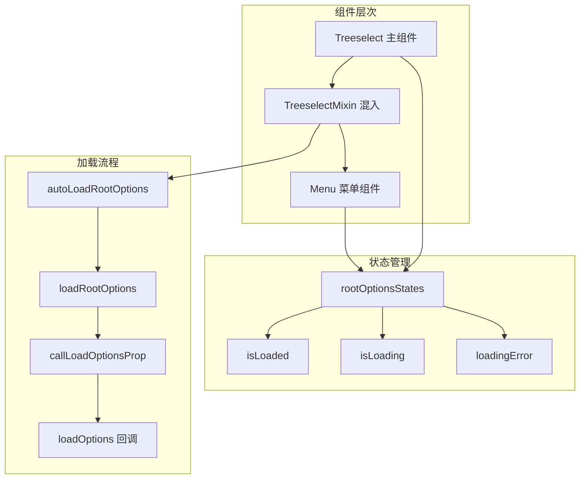
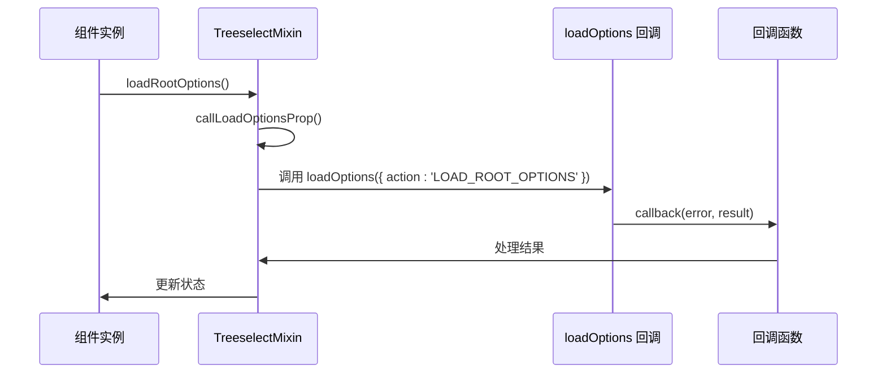
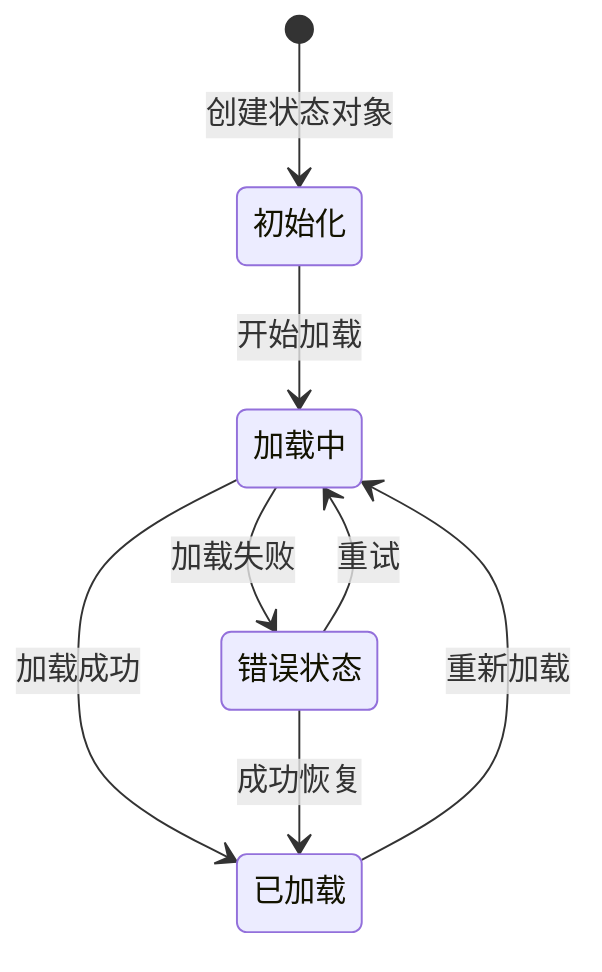
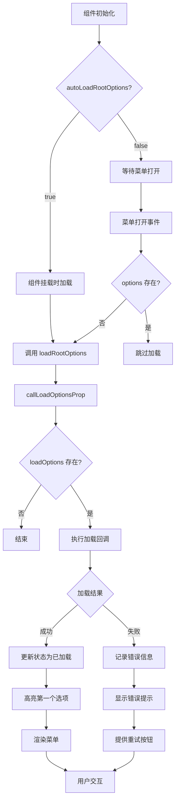
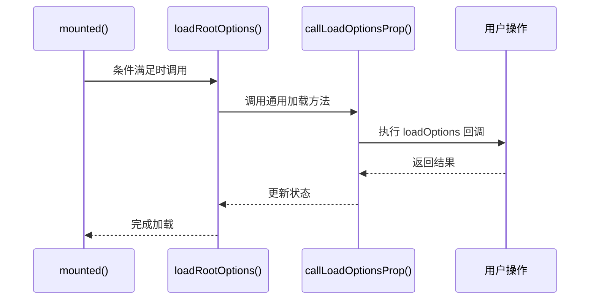
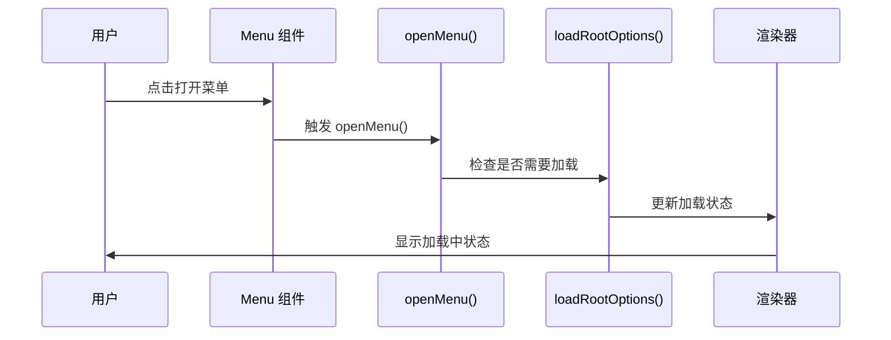
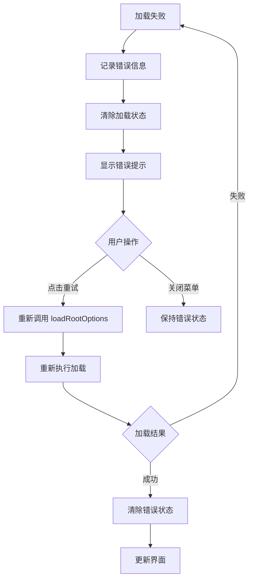

# 根节点加载

<cite>
**本文档中引用的文件**
- [treeselectMixin.js](file://src/mixins/treeselectMixin.js)
- [constants.js](file://src/constants.js)
- [Menu.vue](file://src/components/Menu.vue)
- [DynamicalLoading.spec.js](file://test/unit/specs/DynamicalLoading.spec.js)
- [createMap.js](file://src/utils/createMap.js)
</cite>

## 目录
1. [概述](#概述)
2. [核心概念](#核心概念)
3. [autoLoadRootOptions 属性详解](#autoloadrootoptions-属性详解)
4. [LOAD_ROOT_OPTIONS 动作类型](#load_root_options-动作类型)
5. [rootOptionsStates 状态管理](#rootoptionsstates-状态管理)
6. [加载流程架构](#加载流程架构)
7. [测试用例分析](#测试用例分析)
8. [错误处理与重试机制](#错误处理与重试机制)
9. [最佳实践建议](#最佳实践建议)

## 概述

根节点异步加载是 vue-treeselect 组件中的核心功能之一，它允许开发者在需要时动态加载树形结构的根级选项数据。该机制通过 `autoLoadRootOptions` 属性控制加载时机，使用 `LOAD_ROOT_OPTIONS` 动作类型触发加载过程，并通过 `rootOptionsStates` 对象管理加载状态。

## 核心概念

### 异步加载机制

根节点异步加载采用以下核心设计原则：

- **按需加载**：只有在需要显示根选项时才触发加载
- **状态管理**：通过状态对象跟踪加载进度和结果
- **错误恢复**：提供重试机制和错误提示
- **性能优化**：避免不必要的重复加载

### 关键组件关系



**图表来源**
- [treeselectMixin.js](file://src/mixins/treeselectMixin.js#L37-L43)
- [Menu.vue](file://src/components/Menu.vue#L110-L138)

## autoLoadRootOptions 属性详解

### 属性定义与默认值

`autoLoadRootOptions` 是一个布尔类型的属性，默认值为 `true`，用于控制根节点选项的加载时机。

```javascript
// 属性定义位置
autoLoadRootOptions: {
  type: Boolean,
  default: true,
},
```

### 加载时机控制

#### 自动加载模式（默认）

当 `autoLoadRootOptions` 设置为 `true` 时，组件会在以下情况下自动加载根选项：

1. **组件挂载时**：在 `mounted` 生命周期钩子中检查条件
2. **条件判断**：当 `options` 为 `null` 且不是异步模式时

```javascript
// mounted 钩子中的逻辑
if (!this.options && !this.async && this.autoLoadRootOptions) this.loadRootOptions()
```

#### 延迟加载模式

当 `autoLoadRootOptions` 设置为 `false` 时，根选项将在以下情况下加载：

1. **首次打开菜单时**：在 `openMenu` 方法中触发
2. **手动触发**：通过用户交互或程序化调用

```javascript
// openMenu 中的逻辑
if (!this.options && !this.async) this.loadRootOptions()
```

### 使用场景对比

| 加载模式 | 适用场景 | 性能特点 | 用户体验 |
|---------|---------|---------|---------|
| 自动加载 (`true`) | 小数据集、预加载需求 | 初始加载时间较长 | 即时可用 |
| 延迟加载 (`false`) | 大数据集、按需加载 | 初始加载快，按需加载 | 首次打开稍慢 |

**节来源**
- [treeselectMixin.js](file://src/mixins/treeselectMixin.js#L123-L129)
- [treeselectMixin.js](file://src/mixins/treeselectMixin.js#L1972-L1975)

## LOAD_ROOT_OPTIONS 动作类型

### 动作类型定义

`LOAD_ROOT_OPTIONS` 是一个字符串常量，表示根节点选项加载的动作类型。

```javascript
export const LOAD_ROOT_OPTIONS = 'LOAD_ROOT_OPTIONS'
```

### 触发条件

`LOAD_ROOT_OPTIONS` 动作类型在以下情况下被触发：

#### 1. 组件挂载时
当 `autoLoadRootOptions` 为 `true` 且满足加载条件时。

#### 2. 菜单首次打开时
当 `autoLoadRootOptions` 为 `false` 且菜单被打开时。

#### 3. 手动触发
通过直接调用 `loadRootOptions` 方法。

### 触发流程



**图表来源**
- [treeselectMixin.js](file://src/mixins/treeselectMixin.js#L1672-L1696)
- [treeselectMixin.js](file://src/mixins/treeselectMixin.js#L1732-L1767)

### 参数传递

`loadOptions` 回调函数接收以下参数：

```javascript
{
  id: this.getInstanceId(),
  instanceId: this.getInstanceId(),
  action: LOAD_ROOT_OPTIONS,
  callback: callbackFunction
}
```

**节来源**
- [constants.js](file://src/constants.js#L15-L15)
- [treeselectMixin.js](file://src/mixins/treeselectMixin.js#L1673-L1674)

## rootOptionsStates 状态管理

### 状态对象结构

`rootOptionsStates` 是一个包含三个关键属性的状态对象：

```javascript
function createAsyncOptionsStates() {
  return {
    isLoaded: false,      // 是否已加载完成
    isLoading: false,     // 是否正在加载
    loadingError: '',     // 加载错误信息
  }
}
```

### 状态转换图



### 状态更新流程

#### 加载开始阶段

```javascript
start: () => {
  this.rootOptionsStates.isLoading = true
  this.rootOptionsStates.loadingError = ''
}
```

#### 加载成功阶段

```javascript
succeed: () => {
  this.rootOptionsStates.isLoaded = true
  // 等待 options 重新初始化
  this.$nextTick(() => {
    this.resetHighlightedOptionWhenNecessary(true)
  })
}
```

#### 加载失败阶段

```javascript
fail: err => {
  this.rootOptionsStates.loadingError = getErrorMessage(err)
}
```

#### 结束阶段

```javascript
end: () => {
  this.rootOptionsStates.isLoading = false
}
```

### 状态监控机制

组件通过多个方法监控和响应状态变化：

1. **菜单渲染监控**：在 `renderNormalMenuInner` 中根据状态决定渲染内容
2. **加载状态检测**：通过 `isPending` 函数防止重复加载
3. **错误状态处理**：提供重试按钮和错误提示

**节来源**
- [treeselectMixin.js](file://src/mixins/treeselectMixin.js#L37-L43)
- [treeselectMixin.js](file://src/mixins/treeselectMixin.js#L1678-L1694)

## 加载流程架构

### 整体架构图



**图表来源**
- [treeselectMixin.js](file://src/mixins/treeselectMixin.js#L1972-L1975)
- [treeselectMixin.js](file://src/mixins/treeselectMixin.js#L1471-L1477)

### 核心方法调用链

#### 组件生命周期调用



**图表来源**
- [treeselectMixin.js](file://src/mixins/treeselectMixin.js#L1972-L1975)
- [treeselectMixin.js](file://src/mixins/treeselectMixin.js#L1672-L1696)

#### 菜单交互调用



**图表来源**
- [treeselectMixin.js](file://src/mixins/treeselectMixin.js#L1471-L1477)

## 测试用例分析

### 基础加载测试

#### 组件挂载时自动加载

测试验证组件挂载时会自动触发根选项加载：

```javascript
it('mounting the component should trigger loading root options', () => {
  const loadOptions = jasmine.createSpy()
  mount(Treeselect, {
    propsData: {
      options: null,
      loadOptions,
    },
  })
  
  expect(loadOptions).toHaveBeenCalled()
})
```

#### 延迟加载模式测试

测试 `autoLoadRootOptions: false` 时的行为：

```javascript
it('with autoLoadRootOptions=false, opening the menu should trigger loading root options', () => {
  const loadOptions = jasmine.createSpy()
  const wrapper = mount(Treeselect, {
    propsData: {
      options: null,
      loadOptions,
      autoLoadRootOptions: false,
    },
  })
  
  expect(loadOptions).not.toHaveBeenCalled()
  vm.openMenu()
  expect(loadOptions).toHaveBeenCalled()
})
```

### 加载成功流程测试

#### 基本加载流程

测试从加载到成功的完整流程：

```javascript
it('load root options using `loadOptions` prop', async () => {
  const DELAY = 10
  const loadOptions = ({ action, callback }) => {
    expect(action).toBe('LOAD_ROOT_OPTIONS')
    // 模拟异步加载
    setTimeout(() => {
      app.options = [{ id: 'a', label: 'a' }]
      callback()
    }, DELAY)
  }
  
  // 测试加载成功后的状态
  await sleep(DELAY)
  expect(vm.rootOptionsStates.isLoaded).toBe(true)
  expect(vm.forest.normalizedOptions).toBeNonEmptyArray()
})
```

### 错误处理测试

#### 加载失败与重试

测试加载失败后能够正确显示错误信息并支持重试：

```javascript
it('handle error of loading root options & recover from it', async () => {
  const ERROR_MESSAGE = '$ERROR_MESSAGE$'
  let called = false
  const loadOptions = ({ callback }) => {
    setTimeout(() => {
      if (called) {
        app.options = [{ id: 'a', label: 'a' }]
        callback()
      } else {
        called = true
        callback(new Error(ERROR_MESSAGE))
      }
    }, DELAY)
  }
  
  // 第一次加载失败
  vm.openMenu()
  await sleep(DELAY)
  expect(vm.rootOptionsStates.loadingError).toBe(ERROR_MESSAGE)
  
  // 重试成功
  vm.loadRootOptions()
  await sleep(DELAY)
  expect(vm.rootOptionsStates.isLoaded).toBe(true)
})
```

### 性能优化测试

#### 防止重复加载

测试系统能够防止同一请求的重复执行：

```javascript
it('should avoid duplicate calling of `loadOptions` when there is already an in-flight request', async () => {
  const DELAY = 60
  const loadOptions = ({ callback }) => {
    setTimeout(() => {
      app.options = []
      callback()
    }, DELAY)
  }
  
  vm.openMenu()
  expect(spyForLoadOptions.calls.count()).toBe(1)
  
  await sleep(DELAY / 2)
  vm.closeMenu()
  await vm.$nextTick()
  vm.openMenu()
  await vm.$nextTick()
  expect(spyForLoadOptions.calls.count()).toBe(1)
})
```

### 高级功能测试

#### Promise 支持测试

测试 `loadOptions` 支持返回 Promise：

```javascript
it('should accept promises', async () => {
  let called = false
  const DELAY = 10
  const app = new Vue({
    data: {
      async loadOptions() {
        await sleep(DELAY)
        if (called) {
          app.options = [{ id: 'a', label: 'a' }]
        } else {
          called = true
          throw new Error('test')
        }
      },
    },
  })
  
  vm.openMenu()
  await sleep(DELAY)
  expect(vm.rootOptionsStates.loadingError).toBe('test')
  
  vm.closeMenu()
  vm.openMenu()
  await sleep(DELAY)
  expect(vm.rootOptionsStates.isLoaded).toBe(true)
})
```

**节来源**
- [DynamicalLoading.spec.js](file://test/unit/specs/DynamicalLoading.spec.js#L615-L1001)

## 错误处理与重试机制

### 错误处理策略

#### 错误信息标准化

系统使用统一的错误处理机制：

```javascript
function getErrorMessage(err) {
  return err.message || String(err)
}
```

#### 错误状态管理

当加载失败时，系统会：

1. **记录错误信息**：存储具体的错误消息
2. **清除加载状态**：设置 `isLoading` 为 `false`
3. **保持加载标志**：保留 `isLoaded` 状态不变

```javascript
fail: err => {
  this.rootOptionsStates.loadingError = getErrorMessage(err)
}
```

### 重试机制

#### 用户界面重试

菜单组件提供了重试按钮，允许用户手动重新尝试加载：

```javascript
// 在 Menu.vue 中的错误提示渲染
<Tip type="error" icon="error">
  { instance.rootOptionsStates.loadingError }
  <a class="vue-treeselect__retry" onClick={instance.loadRootOptions} title={instance.retryTitle}>
    { instance.retryText }
  </a>
</Tip>
```

#### 自动重试逻辑

虽然当前实现主要依赖用户手动重试，但系统设计支持自动重试：

1. **状态重置**：重试前会清除错误状态
2. **加载标志**：确保加载过程可以重新开始
3. **防重复**：通过 `isPending` 检查防止并发加载

### 错误恢复流程



**图表来源**
- [treeselectMixin.js](file://src/mixins/treeselectMixin.js#L1690-L1691)
- [Menu.vue](file://src/components/Menu.vue#L195-L205)

**节来源**
- [treeselectMixin.js](file://src/mixins/treeselectMixin.js#L58-L60)
- [Menu.vue](file://src/components/Menu.vue#L195-L205)

## 最佳实践建议

### 性能优化建议

#### 合理选择加载模式

1. **小数据集**：使用 `autoLoadRootOptions: true` 实现即时可用
2. **大数据集**：使用 `autoLoadRootOptions: false` 实现按需加载
3. **混合场景**：考虑使用缓存机制减少重复加载

#### 加载回调优化

```javascript
// 推荐的 loadOptions 实现
const loadOptions = ({ action, callback }) => {
  if (action !== LOAD_ROOT_OPTIONS) {
    callback()
    return
  }
  
  // 使用 Promise 包装异步操作
  fetchData().then(data => {
    // 数据预处理
    const processedData = processData(data)
    callback(null, processedData)
  }).catch(error => {
    // 错误日志记录
    console.error('Root options load failed:', error)
    callback(error)
  })
}
```

### 错误处理最佳实践

#### 用户友好的错误提示

```javascript
// 在 loadOptions 中提供有意义的错误信息
const loadOptions = ({ callback }) => {
  api.getRootOptions()
    .then(options => {
      if (!options || options.length === 0) {
        callback(new Error('未找到可用的根选项'))
      } else {
        callback(null, options)
      }
    })
    .catch(error => {
      // 提供具体的错误信息
      const errorMessage = error.response 
        ? `服务器错误: ${error.response.status}`
        : '网络连接失败，请检查您的网络'
      
      callback(new Error(errorMessage))
    })
}
```

#### 加载状态管理

```javascript
// 在组件中监听加载状态
watch: {
  'rootOptionsStates.isLoading'(newValue) {
    if (newValue) {
      this.showLoadingIndicator()
    } else {
      this.hideLoadingIndicator()
    }
  },
  'rootOptionsStates.loadingError'(newValue) {
    if (newValue) {
      this.showErrorNotification(newValue)
    }
  }
}
```

### 调试和监控

#### 加载性能监控

```javascript
const loadOptions = ({ callback }) => {
  const startTime = Date.now()
  
  api.getRootOptions()
    .then(options => {
      const duration = Date.now() - startTime
      console.log(`根选项加载耗时: ${duration}ms`)
      
      // 记录性能指标
      trackPerformance('root_options_load', { duration, count: options.length })
      
      callback(null, options)
    })
    .catch(error => {
      const duration = Date.now() - startTime
      console.error(`根选项加载失败 (${duration}ms):`, error)
      callback(error)
    })
}
```

#### 状态调试工具

```javascript
// 开发环境下的状态监控
if (process.env.NODE_ENV === 'development') {
  watch('rootOptionsStates', (newState, oldState) => {
    console.log('根选项状态变更:', {
      newState,
      oldState,
      changed: JSON.stringify(newState) !== JSON.stringify(oldState)
    })
  }, { deep: true })
}
```

### 兼容性考虑

#### 浏览器兼容性

确保 `loadOptions` 回调在不同浏览器环境下的一致性：

```javascript
const loadOptions = ({ callback }) => {
  // 使用现代 JavaScript 特性
  const controller = new AbortController()
  
  api.getRootOptions({ signal: controller.signal })
    .then(options => {
      callback(null, options)
    })
    .catch(error => {
      if (error.name !== 'AbortError') {
        callback(error)
      }
    })
    
  // 可选：提供清理机制
  return () => controller.abort()
}
```

通过遵循这些最佳实践，开发者可以构建更加稳定、高效的根节点异步加载功能，为用户提供更好的使用体验。