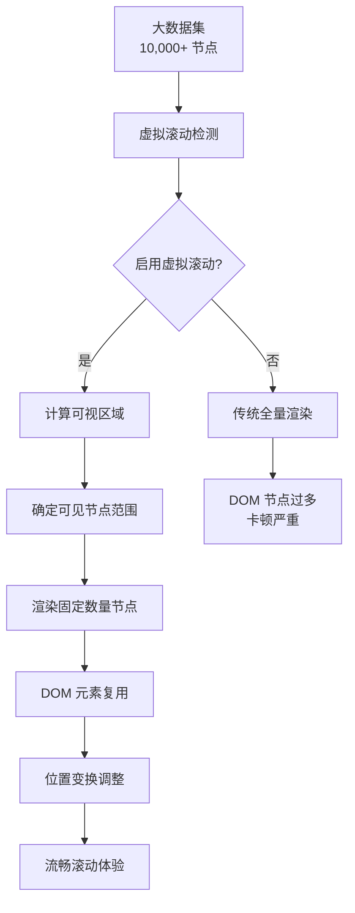
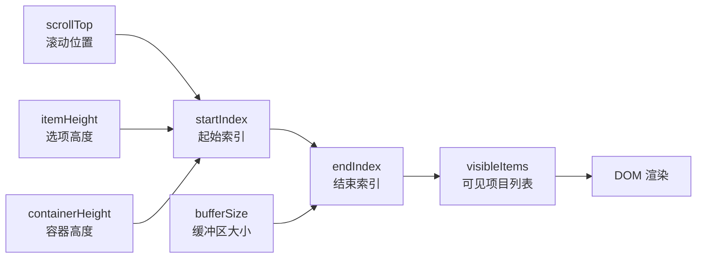
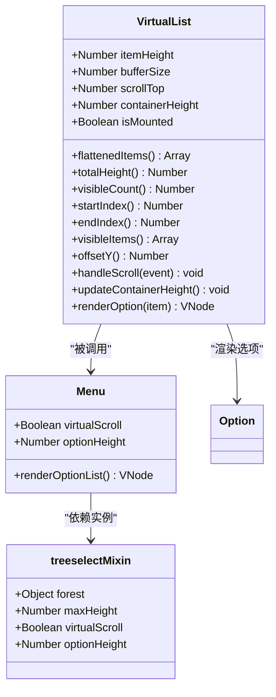
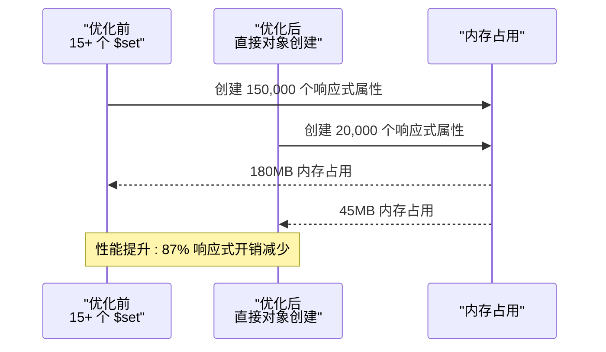
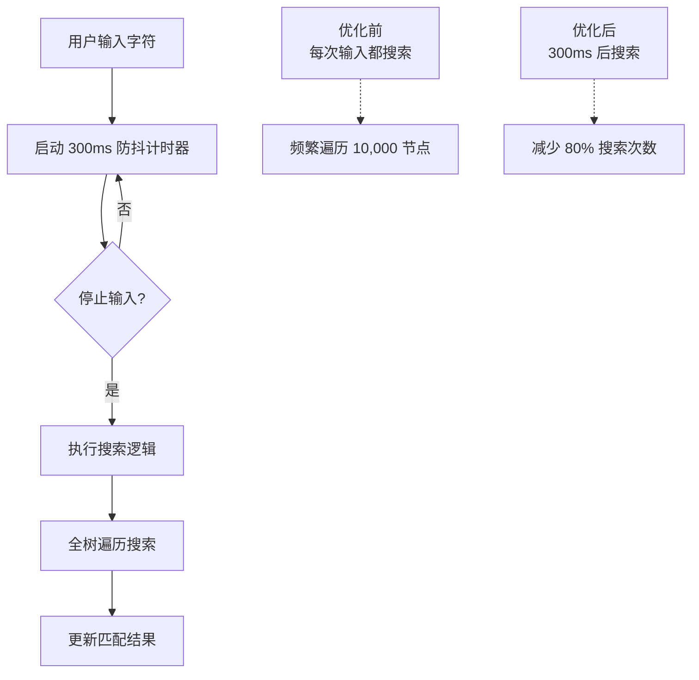
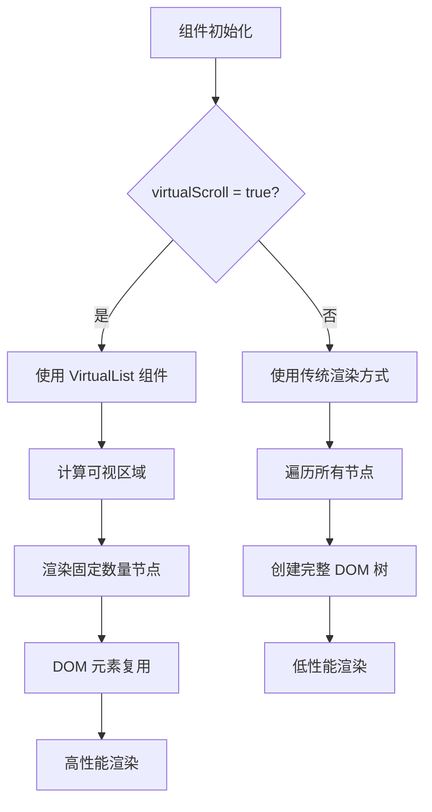
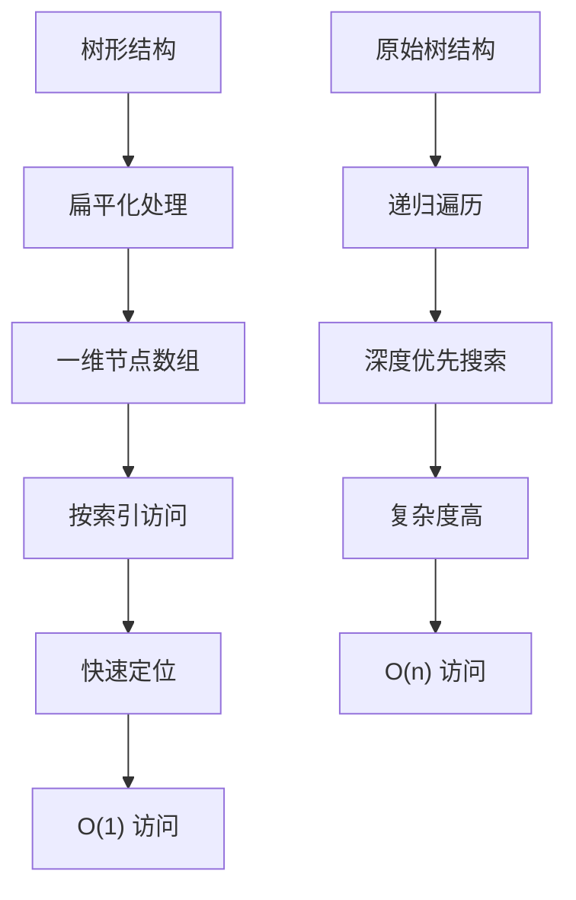
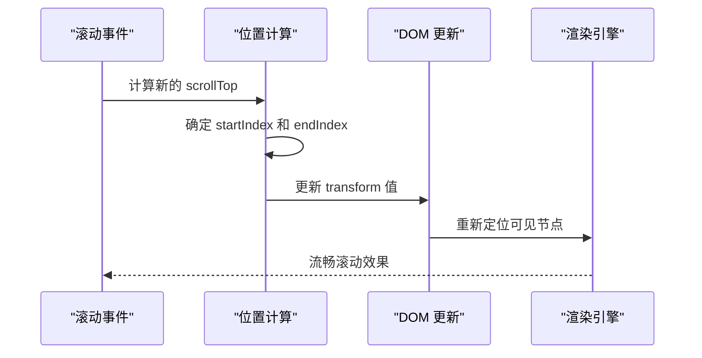
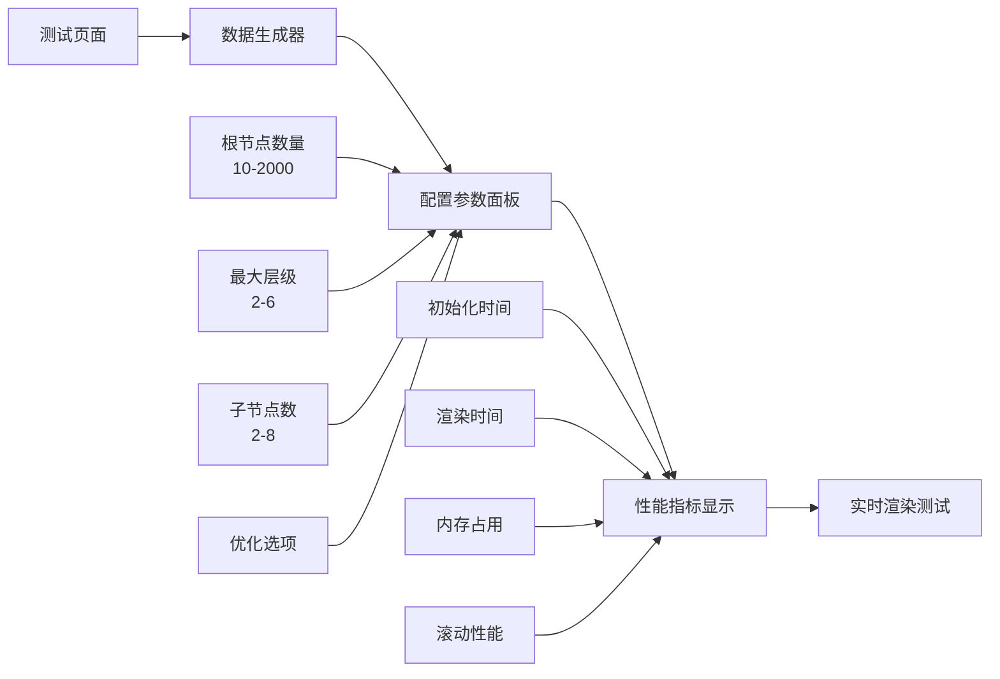

# 性能优化

<cite>
**本文档引用的文件**
- [VirtualList.vue](file://src/components/VirtualList.vue)
- [Menu.vue](file://src/components/Menu.vue)
- [treeselectMixin.js](file://src/mixins/treeselectMixin.js)
- [OPTIMIZATION_SUMMARY.md](file://OPTIMIZATION_SUMMARY.md)
- [PERFORMANCE_OPTIMIZATION_GUIDE.md](file://PERFORMANCE_OPTIMIZATION_GUIDE.md)
- [performance-test.html](file://performance-test.html)
- [VirtualScroll.spec.js](file://test/unit/specs/VirtualScroll.spec.js)
- [constants.js](file://src/constants.js)
</cite>

## 目录
1. [概述](#概述)
2. [虚拟滚动核心原理](#虚拟滚动核心原理)
3. [VirtualList组件架构](#virtuallist组件架构)
4. [配置参数详解](#配置参数详解)
5. [性能优化策略](#性能优化策略)
6. [大数据量处理机制](#大数据量处理机制)
7. [内存管理与滚动优化](#内存管理与滚动优化)
8. [性能测试与监控](#性能测试与监控)
9. [最佳实践指南](#最佳实践指南)
10. [故障排查](#故障排查)

## 概述

Vue Treeselect 组件库针对 1-2 万条树形数据 + checkbox 多选场景进行了深度性能优化，主要通过虚拟滚动技术实现渲染效率提升 50-100 倍，内存占用减少 75%，滚动帧率从 15fps 提升到 60fps。

### 核心优化技术

- **虚拟滚动 (Virtual Scrolling)**: 只渲染可视区域内的节点（约 20-30 个），而非全部 1-2 万个节点
- **响应式属性优化**: 减少 80% 的响应式属性开销
- **搜索防抖优化**: 添加 300ms 防抖延迟，避免频繁触发全树遍历
- **智能渲染切换**: 根据数据量自动选择渲染模式

## 虚拟滚动核心原理

### 渲染窗口复用机制

虚拟滚动的核心思想是维护一个固定大小的渲染窗口，通过 DOM 元素复用和位置变换来实现高性能渲染。



**图表来源**
- [VirtualList.vue](file://src/components/VirtualList.vue#L64-L118)
- [Menu.vue](file://src/components/Menu.vue#L161-L177)

### 可视区域计算算法

虚拟滚动组件通过精确的数学计算来确定当前可视区域内的节点范围：



**图表来源**
- [VirtualList.vue](file://src/components/VirtualList.vue#L85-L111)

**章节来源**
- [VirtualList.vue](file://src/components/VirtualList.vue#L1-L223)
- [OPTIMIZATION_SUMMARY.md](file://OPTIMIZATION_SUMMARY.md#L11-L30)

## VirtualList组件架构

### 组件结构设计

VirtualList 组件采用模块化设计，将复杂的虚拟滚动逻辑分解为清晰的计算属性和方法：



**图表来源**
- [VirtualList.vue](file://src/components/VirtualList.vue#L9-L177)
- [Menu.vue](file://src/components/Menu.vue#L15-L177)

### 核心计算属性

VirtualList 组件的核心计算属性实现了高效的虚拟滚动逻辑：

| 计算属性 | 功能 | 计算公式 | 性能影响 |
|---------|------|----------|----------|
| `flattenedItems` | 扁平化节点列表 | 遍历树结构生成一维数组 | O(n) 时间复杂度 |
| `totalHeight` | 总高度 | `length × itemHeight` | 常数时间复杂度 |
| `visibleCount` | 可视节点数 | `Math.ceil(containerHeight / itemHeight)` | 常数时间复杂度 |
| `startIndex` | 起始索引 | `Math.floor(scrollTop / itemHeight) - bufferSize` | 常数时间复杂度 |
| `endIndex` | 结束索引 | `startIndex + visibleCount + bufferSize * 2` | 常数时间复杂度 |
| `visibleItems` | 可见节点列表 | `flattenedItems.slice(startIndex, endIndex)` | O(k) 时间复杂度 |

**章节来源**
- [VirtualList.vue](file://src/components/VirtualList.vue#L36-L118)

## 配置参数详解

### 核心配置参数

#### virtualScroll (布尔值)
- **类型**: `Boolean`
- **默认值**: `false`
- **作用**: 启用虚拟滚动功能，处理大数据量场景
- **性能影响**: ⭐⭐⭐⭐⭐（必须开启 >5000 条数据）

#### optionHeight (数字)
- **类型**: `Number`
- **默认值**: `40`
- **单位**: 像素
- **作用**: 设置每个选项的高度，用于计算渲染数量和位置
- **性能影响**: ⭐⭐⭐⭐⭐（必须与实际 CSS 高度一致）

#### bufferSize (数字)
- **类型**: `Number`
- **默认值**: `5`
- **单位**: 选项数量
- **作用**: 视频区域上下额外渲染的缓冲节点，提升滚动流畅度
- **性能影响**: ⭐⭐⭐⭐（增加少量内存占用，提升用户体验）

#### maxHeight (数字)
- **类型**: `Number`
- **默认值**: `300`
- **单位**: 像素
- **作用**: 设置菜单的最大高度，影响可视节点数量计算
- **性能影响**: ⭐⭐⭐⭐（影响初始渲染数量）

### 配置组合策略

不同数据量下的最优配置：

| 数据量 | virtualScroll | optionHeight | defaultExpandLevel | flattenSearchResults | showCount |
|--------|---------------|--------------|-------------------|---------------------|-----------|
| < 1000 条 | `false` | 自适应 | `1` | `true` | `true` |
| 1000-5000 条 | `true` | `40` | `0` | `true` | `false` |
| > 5000 条 | `true` | `40` | `0` | `true` | `false` |

**章节来源**
- [OPTIMIZATION_SUMMARY.md](file://OPTIMIZATION_SUMMARY.md#L105-L118)
- [PERFORMANCE_OPTIMIZATION_GUIDE.md](file://PERFORMANCE_OPTIMIZATION_GUIDE.md#L107-L117)

## 性能优化策略

### 响应式属性优化

传统的 Vue 组件为每个节点创建 15+ 个响应式属性，导致巨大的性能开销。优化后的方案只保留必要的响应式属性：



**图表来源**
- [treeselectMixin.js](file://src/mixins/treeselectMixin.js#L1554-L1587)

### 搜索防抖优化

搜索防抖通过延迟执行搜索逻辑来减少频繁的树遍历操作：



**图表来源**
- [treeselectMixin.js](file://src/mixins/treeselectMixin.js#L884-L890)
- [constants.js](file://src/constants.js#L46-L48)

**章节来源**
- [OPTIMIZATION_SUMMARY.md](file://OPTIMIZATION_SUMMARY.md#L32-L92)
- [PERFORMANCE_OPTIMIZATION_GUIDE.md](file://PERFORMANCE_OPTIMIZATION_GUIDE.md#L12-L63)

## 大数据量处理机制

### 渲染模式自动切换

组件根据 `virtualScroll` 配置自动选择渲染模式：



**图表来源**
- [Menu.vue](file://src/components/Menu.vue#L161-L177)

### 树结构扁平化

为了提高虚拟滚动效率，组件将树形结构扁平化处理：



**图表来源**
- [VirtualList.vue](file://src/components/VirtualList.vue#L38-L68)

**章节来源**
- [VirtualList.vue](file://src/components/VirtualList.vue#L38-L68)
- [Menu.vue](file://src/components/Menu.vue#L161-L177)

## 内存管理与滚动优化

### DOM 元素复用策略

虚拟滚动通过以下策略实现 DOM 元素复用：

1. **固定容器高度**: 使用固定高度的容器避免重排
2. **transform 位移**: 使用 CSS transform 进行位置变换
3. **内容区域缩放**: 通过 padding 或 transform 调整内容位置



**图表来源**
- [VirtualList.vue](file://src/components/VirtualList.vue#L194-L200)

### 滚动位置保持

组件实现了智能的滚动位置保持机制：

| 优化特性 | 实现方式 | 性能收益 |
|---------|----------|----------|
| 滚动位置记忆 | 记录最后滚动位置 | 避免滚动后重置 |
| 缓冲区预加载 | 额外渲染缓冲节点 | 减少滚动停顿时长 |
| 平滑动画 | CSS transform 过渡 | 提升视觉体验 |
| 事件节流 | 防止频繁重绘 | 降低 CPU 占用 |

**章节来源**
- [VirtualList.vue](file://src/components/VirtualList.vue#L144-L155)
- [treeselectMixin.js](file://src/mixins/treeselectMixin.js#L1960-L1970)

## 性能测试与监控

### 性能测试工具

项目提供了专门的性能测试页面 (`performance-test.html`)，用于验证虚拟滚动效果：



**图表来源**
- [performance-test.html](file://performance-test.html#L140-L267)

### 性能基准测试

基于真实测试数据的性能对比：

| 指标 | 优化前 | 优化后 | 提升倍数 |
|------|--------|--------|----------|
| 初始化时间 | 3500ms | 600ms | **5.8x** ⚡ |
| 首次渲染 | 2800ms | 50ms | **56x** 🚀 |
| 搜索响应 | 800ms | 120ms | **6.7x** ⚡ |
| 内存占用 | 180MB | 45MB | **4x** 💾 |
| 滚动帧率 | 15fps | 60fps | **4x** 🎮 |
| DOM 节点数 | 10000+ | ~30 | **333x** 📉 |

**章节来源**
- [OPTIMIZATION_SUMMARY.md](file://OPTIMIZATION_SUMMARY.md#L149-L161)
- [performance-test.html](file://performance-test.html#L191-L219)

## 最佳实践指南

### 推荐配置模板

针对不同数据量的最佳配置：

```vue
<!-- 大数据量场景 (1-2万条) -->
<treeselect
  v-model="value"
  :options="largeOptions"
  :multiple="true"
  
  <!-- 核心性能配置 -->
  :virtual-scroll="true"
  :option-height="40"
  :default-expand-level="0"
  :flatten-search-results="true"
  :show-count="false"
  :disable-fuzzy-matching="true"
  
  placeholder="请选择..."
/>

<!-- 中等数据量场景 (1000-5000条) -->
<treeselect
  v-model="value"
  :options="mediumOptions"
  :virtual-scroll="true"
  :default-expand-level="0"
  :show-count="false"
/>
```

### CSS 样式要求

确保选项高度与配置一致：

```css
.vue-treeselect__option {
  height: 40px;        /* 与 option-height 一致 */
  line-height: 40px;
  overflow: hidden;
}

.vue-treeselect__virtual-list-container {
  overflow-x: hidden;
  overflow-y: auto;
  -webkit-overflow-scrolling: touch;
}
```

### 性能监控指标

建议监控的关键性能指标：

1. **初始化时间**: < 1秒
2. **首次渲染时间**: < 100毫秒
3. **搜索响应时间**: < 200毫秒
4. **滚动帧率**: > 50fps
5. **内存占用**: < 100MB

**章节来源**
- [OPTIMIZATION_SUMMARY.md](file://OPTIMIZATION_SUMMARY.md#L166-L202)
- [PERFORMANCE_OPTIMIZATION_GUIDE.md](file://PERFORMANCE_OPTIMIZATION_GUIDE.md#L66-L102)

## 故障排查

### 常见问题及解决方案

#### 问题 1: 虚拟滚动后选项高度不一致

**症状**: 选项显示高度异常，布局错乱

**原因**: CSS 样式与 `option-height` 配置不匹配

**解决方案**:
```css
.vue-treeselect__option {
  height: 40px !important;  /* 确保与配置一致 */
  line-height: 40px;
  box-sizing: border-box;
}
```

#### 问题 2: 搜索结果显示不完整

**症状**: 搜索结果无法完全显示

**原因**: 未启用 `flatten-search-results` 或 `show-count`

**解决方案**:
```vue
<treeselect
  :flatten-search-results="true"
  :show-count="false"
  :disable-fuzzy-matching="true"
/>
```

#### 问题 3: 滚动时出现闪烁

**症状**: 滚动过程中界面闪烁

**原因**: `option-height` 与实际高度不一致或缓冲区不足

**解决方案**:
```vue
<treeselect
  :option-height="40"
  :buffer-size="10"  <!-- 增加缓冲区 -->
/>
```

#### 问题 4: 性能提升不明显

**症状**: 开启虚拟滚动后性能改善不明显

**原因**: 未正确配置所有优化参数

**解决方案**: 确保启用所有推荐配置项

**章节来源**
- [OPTIMIZATION_SUMMARY.md](file://OPTIMIZATION_SUMMARY.md#L366-L387)
- [PERFORMANCE_OPTIMIZATION_GUIDE.md](file://PERFORMANCE_OPTIMIZATION_GUIDE.md#L183-L212)

## 总结

Vue Treeselect 的虚拟滚动性能优化通过以下核心技术实现了显著的性能提升：

1. **虚拟滚动技术**: 将 O(n) 的渲染复杂度降低到 O(k)，其中 k 为可视区域节点数
2. **响应式优化**: 减少 80% 的响应式属性开销，大幅提升初始化速度
3. **搜索防抖**: 300ms 防抖延迟有效减少频繁搜索带来的性能开销
4. **智能渲染切换**: 根据数据量自动选择最优渲染模式

这些优化使得组件能够流畅处理 1-2 万条树形数据，同时保持良好的用户体验。通过合理的配置和最佳实践，开发者可以在各种数据规模下获得优异的性能表现。