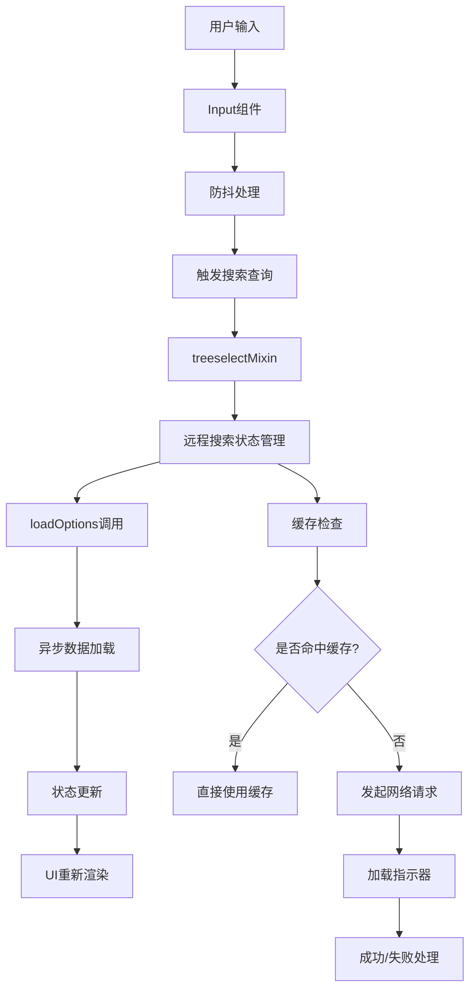
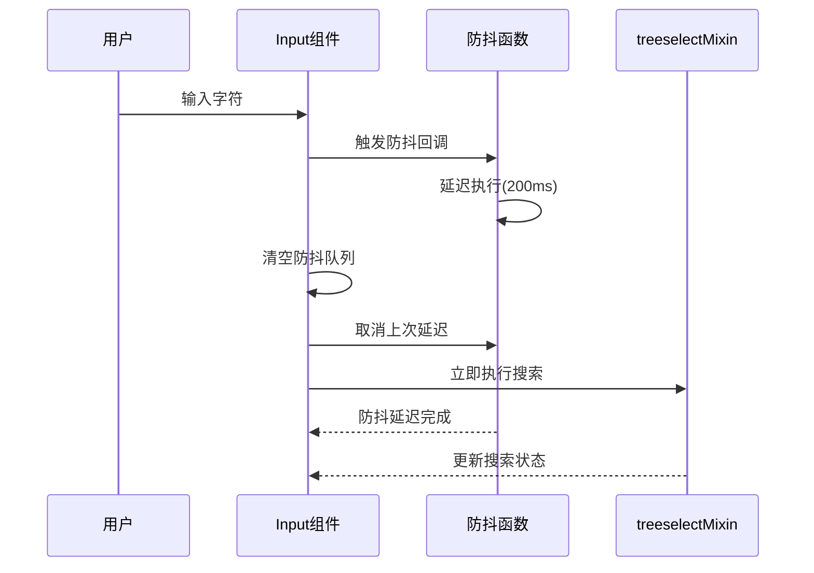
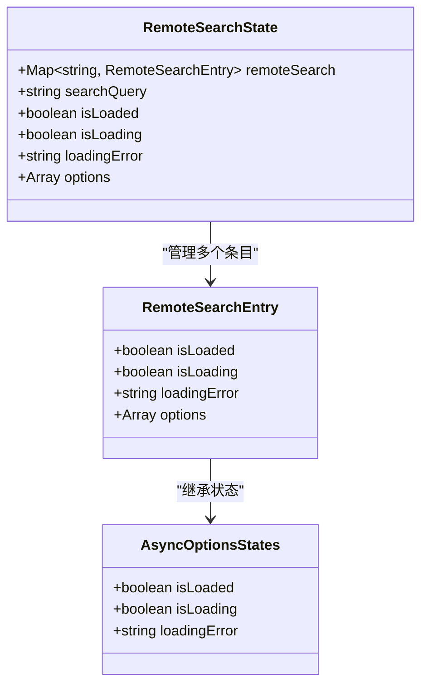
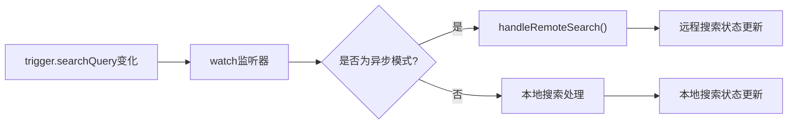
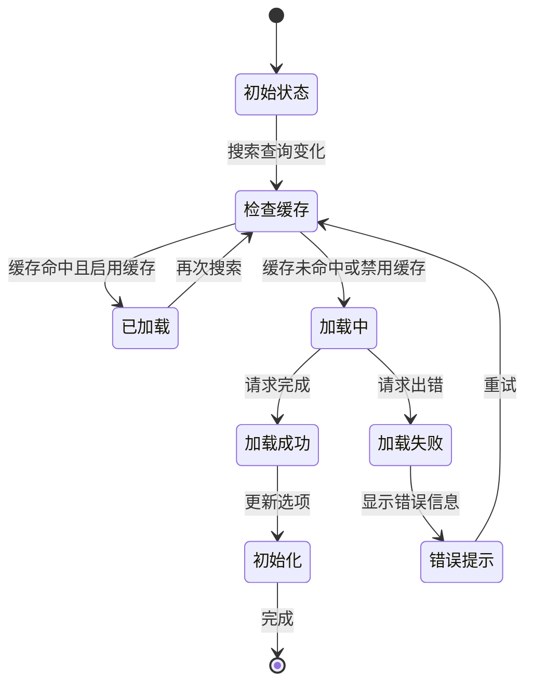
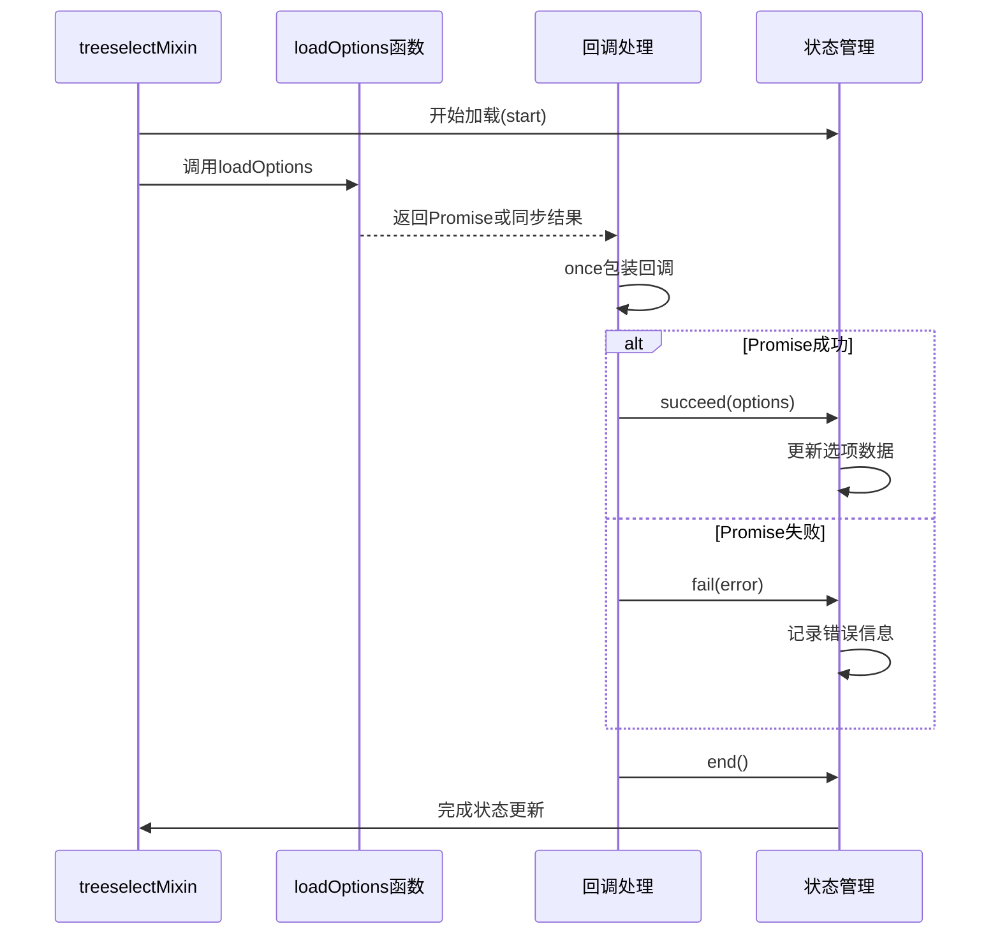
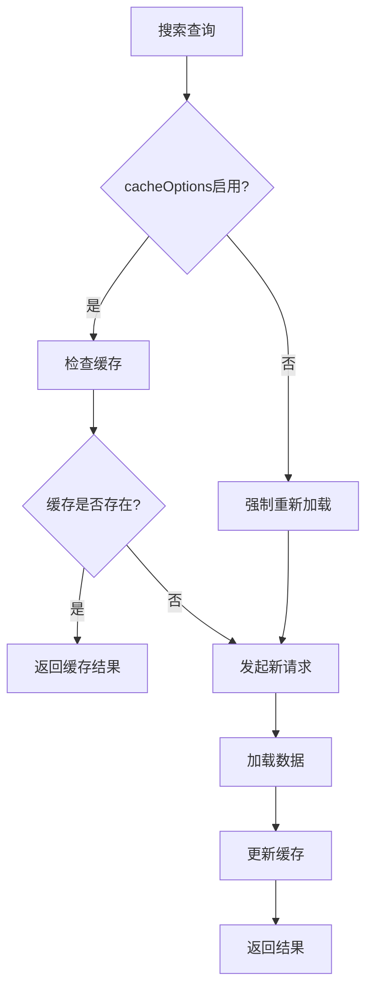
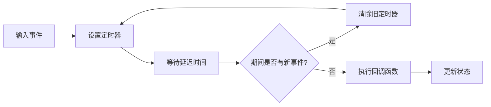
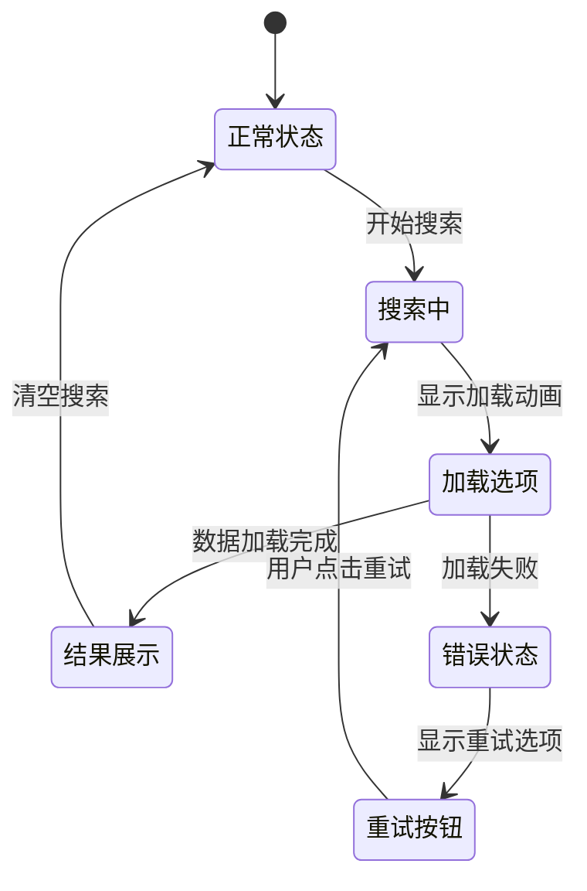
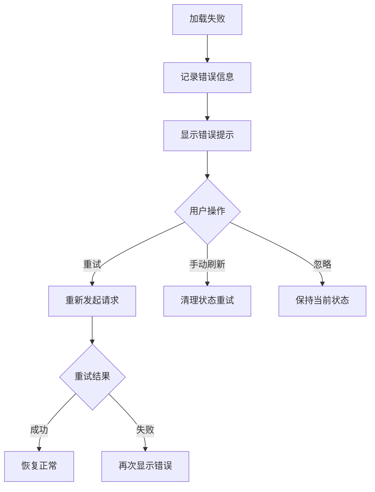

# 异步搜索功能深度解析

<cite>
**本文档引用的文件**
- [Input.vue](file://src/components/Input.vue)
- [treeselectMixin.js](file://src/mixins/treeselectMixin.js)
- [debounce.js](file://src/utils/debounce.js)
- [constants.js](file://src/constants.js)
- [Searching.spec.js](file://test/unit/specs/Searching.spec.js)
</cite>

## 目录
1. [概述](#概述)
2. [系统架构](#系统架构)
3. [Input组件的防抖输入处理](#input组件的防抖输入处理)
4. [treeselectMixin中的状态管理](#treeselectmixin中的状态管理)
5. [远程搜索状态管理](#远程搜索状态管理)
6. [loadOptions函数调用机制](#loadoptions函数调用机制)
7. [cacheOptions缓存控制](#cacheoptions缓存控制)
8. [防抖函数的性能优化](#防抖函数的性能优化)
9. [加载指示器与错误处理](#加载指示器与错误处理)
10. [测试验证](#测试验证)
11. [总结](#总结)

## 概述

Vue Treeselect的异步搜索功能是一个高度优化的系统，通过多层次的状态管理和防抖机制，实现了高效的远程数据检索和用户交互体验。该功能的核心在于`Input.vue`组件的防抖输入处理、`treeselectMixin`中的状态管理，以及完整的错误处理和缓存机制。

## 系统架构

异步搜索功能的整体架构采用分层设计，从用户输入到数据展示形成完整的数据流：

**图表来源**
- [Input.vue](file://src/components/Input.vue#L102-L112)
- [treeselectMixin.js](file://src/mixins/treeselectMixin.js#L1283-L1319)

## Input组件的防抖输入处理

### 防抖机制的实现

Input组件通过`debounce`函数实现了智能的输入防抖处理，有效减少不必要的搜索请求：

**图表来源**
- [Input.vue](file://src/components/Input.vue#L53-L58)
- [Input.vue](file://src/components/Input.vue#L102-L112)

### 防抖参数配置

防抖函数采用双触发模式（leading和trailing），确保用户体验的流畅性：

- **延迟时间**: 200毫秒（开发环境为10毫秒用于测试）
- **触发策略**: 同时支持首次立即触发和末次延迟触发
- **取消机制**: 当输入为空时立即取消防抖队列

**章节来源**
- [Input.vue](file://src/components/Input.vue#L53-L58)
- [constants.js](file://src/constants.js#L46-L48)

## treeselectMixin中的状态管理

### 远程搜索状态结构

`treeselectMixin`维护了一个复杂的远程搜索状态管理系统，包含以下核心属性：

**图表来源**
- [treeselectMixin.js](file://src/mixins/treeselectMixin.js#L1260-L1337)

### watch监听机制

系统通过Vue的响应式系统自动监听搜索查询变化，并触发相应的处理逻辑：

**图表来源**
- [treeselectMixin.js](file://src/mixins/treeselectMixin.js#L880-L892)

**章节来源**
- [treeselectMixin.js](file://src/mixins/treeselectMixin.js#L880-L892)

## 远程搜索状态管理

### 状态转换流程

远程搜索状态管理遵循严格的生命周期，确保数据的一致性和用户体验：

**图表来源**
- [treeselectMixin.js](file://src/mixins/treeselectMixin.js#L1283-L1319)

### getRemoteSearchEntry方法

该方法负责创建和管理每个搜索查询对应的搜索条目：

**章节来源**
- [treeselectMixin.js](file://src/mixins/treeselectMixin.js#L1322-L1337)

## loadOptions函数调用机制

### 调用流程

`callLoadOptionsProp`方法封装了所有loadOptions函数的调用逻辑，提供了统一的错误处理和状态管理：

**图表来源**
- [treeselectMixin.js](file://src/mixins/treeselectMixin.js#L1732-L1744)

### 参数传递机制

loadOptions函数接收标准化的参数对象，包含完整的上下文信息：

**章节来源**
- [treeselectMixin.js](file://src/mixins/treeselectMixin.js#L1732-L1744)

## cacheOptions缓存控制

### 缓存策略

cacheOptions属性控制着搜索结果的缓存行为，提供两种主要模式：

**图表来源**
- [treeselectMixin.js](file://src/mixins/treeselectMixin.js#L1291-L1293)

### 缓存失效机制

当搜索查询为空字符串时，系统会自动清除相关缓存，确保数据的新鲜度：

**章节来源**
- [treeselectMixin.js](file://src/mixins/treeselectMixin.js#L1291-L1293)

## 防抖函数的性能优化

### debounce.js实现原理

虽然项目中导入的是第三方lodash.debounce，但其核心原理对于理解性能优化至关重要：

### 性能优化效果

防抖机制带来的性能提升包括：

1. **减少网络请求**: 避免频繁的API调用
2. **降低服务器负载**: 减少不必要的计算资源消耗
3. **改善用户体验**: 避免界面闪烁和卡顿
4. **内存优化**: 减少不必要的DOM操作和状态更新

**章节来源**
- [debounce.js](file://src/utils/debounce.js#L1-L2)
- [constants.js](file://src/constants.js#L46-L48)

## 加载指示器与错误处理

### 加载状态显示

系统通过多种状态指示器向用户反馈当前的操作状态：

### 错误处理流程

错误处理采用渐进式恢复策略，提供多种故障排除方式：

**图表来源**
- [treeselectMixin.js](file://src/mixins/treeselectMixin.js#L1313-L1315)

**章节来源**
- [treeselectMixin.js](file://src/mixins/treeselectMixin.js#L1313-L1315)

## 测试验证

### 异步搜索测试场景

测试套件涵盖了各种异步搜索场景，验证系统的健壮性：

1. **基础搜索功能**: 验证基本的远程搜索能力
2. **缓存机制**: 测试cacheOptions属性的行为
3. **并发请求处理**: 验证多个搜索请求的正确处理
4. **错误恢复**: 测试网络错误后的恢复机制
5. **性能测试**: 验证防抖机制的性能效果

### 关键测试点

测试重点关注以下几个方面：

- **搜索查询的正确传递**
- **状态管理的准确性**
- **缓存策略的有效性**
- **错误处理的完整性**
- **用户体验的流畅性**

**章节来源**
- [Searching.spec.js](file://test/unit/specs/Searching.spec.js#L749-L913)

## 总结

Vue Treeselect的异步搜索功能是一个精心设计的系统，通过以下关键特性实现了高效的数据检索和优秀的用户体验：

### 核心优势

1. **智能防抖**: 通过200毫秒的防抖延迟平衡了响应速度和性能
2. **完善的缓存机制**: cacheOptions属性提供了灵活的缓存控制策略
3. **状态管理**: 多层次的状态管理确保了数据的一致性
4. **错误处理**: 全面的错误处理和恢复机制提升了系统稳定性
5. **性能优化**: 通过防抖和缓存显著减少了不必要的网络请求

### 技术亮点

- **响应式状态管理**: 利用Vue的响应式系统实现自动化的状态更新
- **异步处理**: 完整的Promise支持和错误处理机制
- **用户体验**: 流畅的加载指示和友好的错误提示
- **可扩展性**: 模块化的设计便于功能扩展和维护

该异步搜索功能不仅满足了现代Web应用对大数据集处理的需求，还为开发者提供了一个可靠、高性能的解决方案，是Vue Treeselect组件库中的核心功能之一。