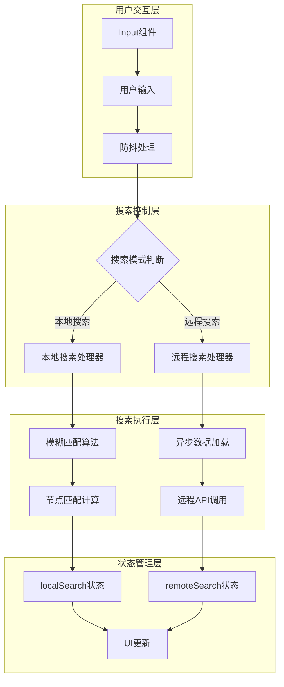
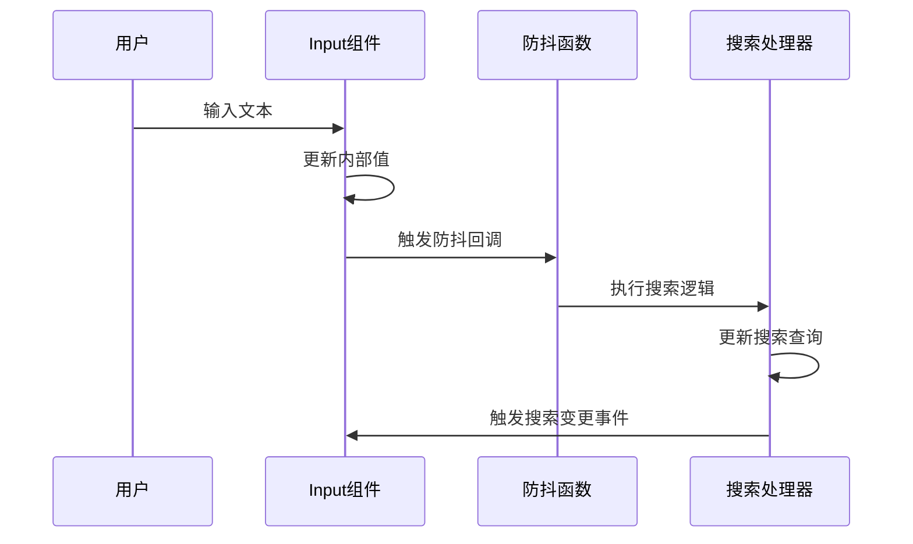
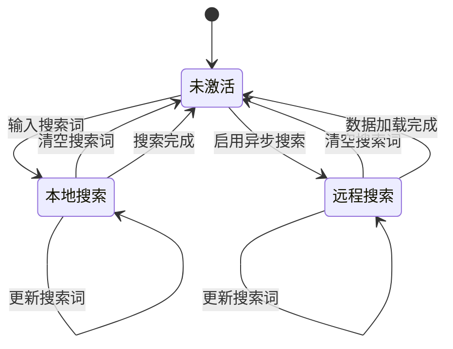
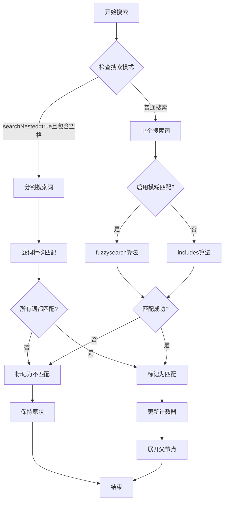
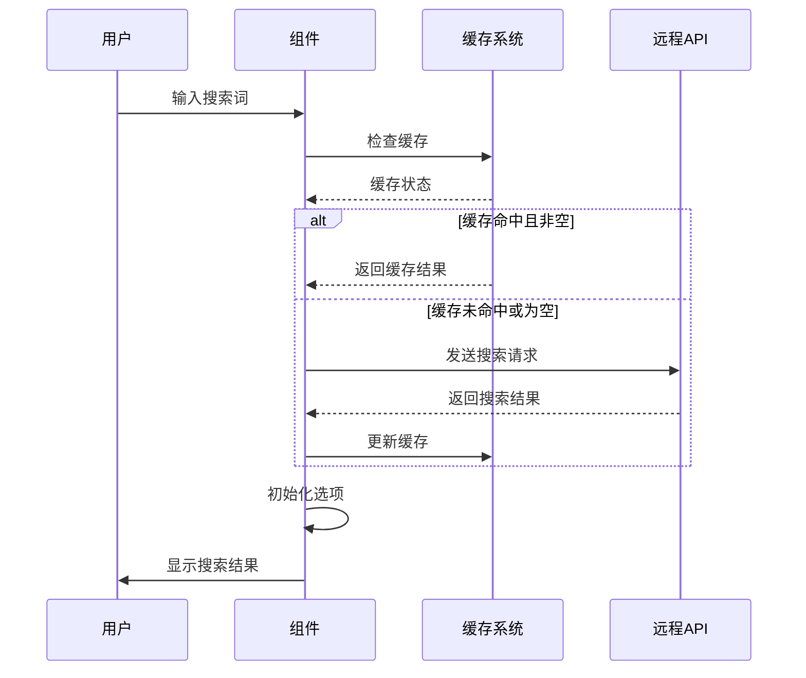
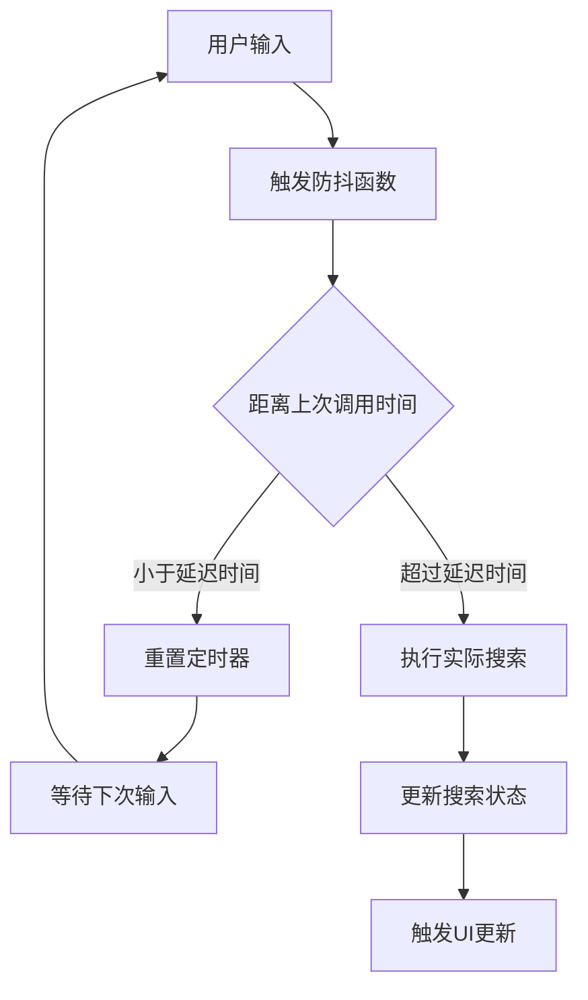
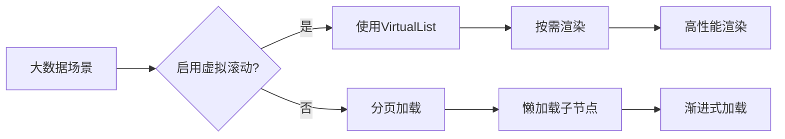

# 搜索功能

<cite>
**本文档引用的文件**
- [src/components/Input.vue](file://src/components/Input.vue)
- [src/mixins/treeselectMixin.js](file://src/mixins/treeselectMixin.js)
- [src/utils/debounce.js](file://src/utils/debounce.js)
- [src/constants.js](file://src/constants.js)
- [src/utils/find.js](file://src/utils/find.js)
- [test/unit/specs/Searching.spec.js](file://test/unit/specs/Searching.spec.js)
- [test/unit/specs/SearchInput.spec.js](file://test/unit/specs/SearchInput.spec.js)
</cite>

## 目录
1. [概述](#概述)
2. [搜索架构设计](#搜索架构设计)
3. [Input组件输入处理](#input组件输入处理)
4. [搜索状态管理](#搜索状态管理)
5. [本地搜索算法](#本地搜索算法)
6. [远程搜索机制](#远程搜索机制)
7. [防抖机制实现](#防抖机制实现)
8. [搜索配置参数](#搜索配置参数)
9. [性能优化策略](#性能优化策略)
10. [测试覆盖分析](#测试覆盖分析)

## 概述

Vue Treeselect 的搜索功能是一个高度优化的双向搜索系统，支持本地模糊匹配和远程异步搜索两种模式。该系统通过智能的状态管理和防抖机制，确保在大数据量场景下的流畅用户体验。

### 核心特性

- **双模式搜索**：本地同步搜索和远程异步搜索
- **智能防抖**：防止频繁搜索请求
- **模糊匹配**：支持字符串模糊匹配算法
- **多属性匹配**：可配置多个搜索属性
- **缓存机制**：智能缓存搜索结果
- **实时反馈**：即时搜索结果显示

## 搜索架构设计



**图表来源**
- [src/components/Input.vue](file://src/components/Input.vue#L102-L112)
- [src/mixins/treeselectMixin.js](file://src/mixins/treeselectMixin.js#L1217-L1281)

## Input组件输入处理

Input组件作为搜索功能的入口，负责捕获用户输入并触发搜索流程。

### 输入事件处理流程



**图表来源**
- [src/components/Input.vue](file://src/components/Input.vue#L102-L112)

### 关键实现细节

Input组件的核心方法包括：

- **onInput方法**：处理输入事件，触发防抖搜索
- **debouncedCallback**：防抖搜索回调函数
- **updateSearchQuery**：更新搜索查询状态

**章节来源**
- [src/components/Input.vue](file://src/components/Input.vue#L102-L112)

## 搜索状态管理

搜索功能通过两个核心状态对象进行管理：`localSearch` 和 `remoteSearch`。

### localSearch 状态结构

| 属性 | 类型 | 描述 |
|------|------|------|
| active | Boolean | 是否处于本地搜索模式 |
| noResults | Boolean | 是否没有搜索结果 |
| countMap | Object | 匹配计数映射表 |

### remoteSearch 状态结构

| 属性 | 类型 | 描述 |
|------|------|------|
| isLoaded | Boolean | 远程搜索结果是否已加载 |
| isLoading | Boolean | 是否正在加载远程搜索结果 |
| loadingError | String | 加载错误信息 |
| options | Array | 远程搜索返回的选项列表 |

### 状态转换流程



**图表来源**
- [src/mixins/treeselectMixin.js](file://src/mixins/treeselectMixin.js#L695-L706)

**章节来源**
- [src/mixins/treeselectMixin.js](file://src/mixins/treeselectMixin.js#L695-L706)

## 本地搜索算法

本地搜索采用双重匹配策略，支持精确匹配和模糊匹配两种模式。

### 匹配算法实现



**图表来源**
- [src/mixins/treeselectMixin.js](file://src/mixins/treeselectMixin.js#L1249-L1278)

### 匹配函数实现

系统使用统一的 `match` 函数处理不同类型的匹配需求：

```javascript
function match(enableFuzzyMatch, needle, haystack) {
  return enableFuzzyMatch
    ? fuzzysearch(needle, haystack)
    : includes(haystack, needle)
}
```

### 匹配属性配置

| 配置项 | 默认值 | 描述 |
|--------|--------|------|
| matchKeys | ['label'] | 用于搜索的属性数组 |
| disableFuzzyMatching | false | 是否禁用模糊匹配 |
| searchNested | false | 是否搜索祖先节点 |

**章节来源**
- [src/mixins/treeselectMixin.js](file://src/mixins/treeselectMixin.js#L52-L56)
- [src/mixins/treeselectMixin.js](file://src/mixins/treeselectMixin.js#L1249-L1278)

## 远程搜索机制

远程搜索支持异步数据加载，适用于大数据量场景。

### 远程搜索流程



**图表来源**
- [src/mixins/treeselectMixin.js](file://src/mixins/treeselectMixin.js#L1283-L1337)

### 缓存策略

| 缓存条件 | 行为 |
|----------|------|
| cacheOptions=true | 缓存所有搜索结果 |
| cacheOptions=false | 不缓存搜索结果 |
| 空搜索词 | 强制重新加载 |

### 异步搜索状态管理

远程搜索通过 `getRemoteSearchEntry` 方法管理搜索条目：

```javascript
getRemoteSearchEntry() {
  const { searchQuery } = this.trigger
  const entry = this.remoteSearch[searchQuery] || {
    ...createAsyncOptionsStates(),
    options: [],
  }
  
  // 监听选项变化
  this.$watch(
    () => entry.options,
    () => {
      if (this.trigger.searchQuery === searchQuery) this.initialize()
    },
    { deep: true },
  )
  
  return entry
}
```

**章节来源**
- [src/mixins/treeselectMixin.js](file://src/mixins/treeselectMixin.js#L1283-L1337)

## 防抖机制实现

防抖机制通过 `debounce.js` 实现，防止频繁的搜索请求。

### 防抖配置

| 参数 | 值 | 描述 |
|------|-----|------|
| delay | 200ms | 防抖延迟时间 |
| leading | true | 立即执行首次调用 |
| trailing | true | 在延迟结束后执行最后一次调用 |

### 防抖执行流程



**图表来源**
- [src/components/Input.vue](file://src/components/Input.vue#L54-L58)

### 防抖函数使用

Input组件创建防抖函数：

```javascript
this.debouncedCallback = debounce(
  this.updateSearchQuery,
  INPUT_DEBOUNCE_DELAY,
  { leading: true, trailing: true },
)
```

**章节来源**
- [src/components/Input.vue](file://src/components/Input.vue#L54-L58)
- [src/utils/debounce.js](file://src/utils/debounce.js#L1-L2)

## 搜索配置参数

### 核心配置属性

| 属性名 | 类型 | 默认值 | 描述 |
|--------|------|--------|------|
| searchable | Boolean | true | 是否启用搜索功能 |
| async | Boolean | false | 是否启用异步搜索 |
| cacheOptions | Boolean | true | 是否缓存搜索结果 |
| matchKeys | Array | ['label'] | 搜索匹配的属性列表 |
| disableFuzzyMatching | Boolean | false | 是否禁用模糊匹配 |
| searchNested | Boolean | false | 是否搜索祖先节点 |
| flattenSearchResults | Boolean | false | 是否扁平化搜索结果 |

### 高级配置选项

| 属性名 | 类型 | 默认值 | 描述 |
|--------|------|--------|------|
| loadOptions | Function | - | 动态加载选项的回调函数 |
| defaultOptions | Boolean/Array | false | 默认显示的选项 |
| noResultsText | String | 'No results found...' | 无结果时的提示文本 |

**章节来源**
- [src/mixins/treeselectMixin.js](file://src/mixins/treeselectMixin.js#L74-L480)

## 性能优化策略

### 搜索性能优化

1. **防抖机制**：减少不必要的搜索请求
2. **智能缓存**：避免重复的远程请求
3. **增量更新**：只更新变化的节点
4. **虚拟滚动**：大列表场景下的性能优化

### 内存管理

- 使用 `createMap()` 创建高效的映射表
- 及时清理不再需要的搜索状态
- 避免内存泄漏的监听器管理

### 大数据优化

对于大数据量场景，系统提供了以下优化策略：



**图表来源**
- [src/mixins/treeselectMixin.js](file://src/mixins/treeselectMixin.js#L642-L656)

**章节来源**
- [src/mixins/treeselectMixin.js](file://src/mixins/treeselectMixin.js#L642-L656)

## 测试覆盖分析

搜索功能经过全面的单元测试，涵盖以下场景：

### 测试覆盖范围

1. **本地搜索测试**
   - 精确匹配测试
   - 模糊匹配测试
   - 多属性匹配测试
   - 大小写不敏感测试

2. **远程搜索测试**
   - 缓存机制测试
   - 错误处理测试
   - 并发请求测试
   - 数据加载测试

3. **边界情况测试**
   - 空搜索词处理
   - 特殊字符处理
   - 大量数据处理
   - 性能基准测试

### 关键测试用例

```javascript
// 本地搜索测试示例
it('exactly matching', async () => {
  await typeSearchText(wrapper, 'a')
  expect(vm.forest.nodeMap.a.isMatched).toBe(true)
  expect(vm.forest.nodeMap.aa.isMatched).toBe(true)
})

// 远程搜索缓存测试
it('should cache results when cacheOptions=true', async () => {
  wrapper.setProps({ cacheOptions: true })
  await typeSearchText(wrapper, 'test')
  expect(vm.remoteSearch.test.isLoaded).toBe(true)
})
```

**章节来源**
- [test/unit/specs/Searching.spec.js](file://test/unit/specs/Searching.spec.js#L9-L44)
- [test/unit/specs/Searching.spec.js](file://test/unit/specs/Searching.spec.js#L771-L836)

## 总结

Vue Treeselect 的搜索功能是一个精心设计的高性能搜索系统，通过以下核心特性实现了优秀的用户体验：

1. **双模式搜索**：本地和远程搜索的无缝切换
2. **智能防抖**：防止频繁请求，提升性能
3. **灵活配置**：丰富的配置选项满足不同需求
4. **高效算法**：优化的匹配算法保证搜索速度
5. **完整缓存**：智能缓存策略减少网络请求
6. **全面测试**：完善的测试覆盖确保功能稳定性

该搜索系统不仅在功能上满足了复杂的应用场景需求，在性能和用户体验方面也达到了专业级标准，是现代前端组件库搜索功能的优秀范例。