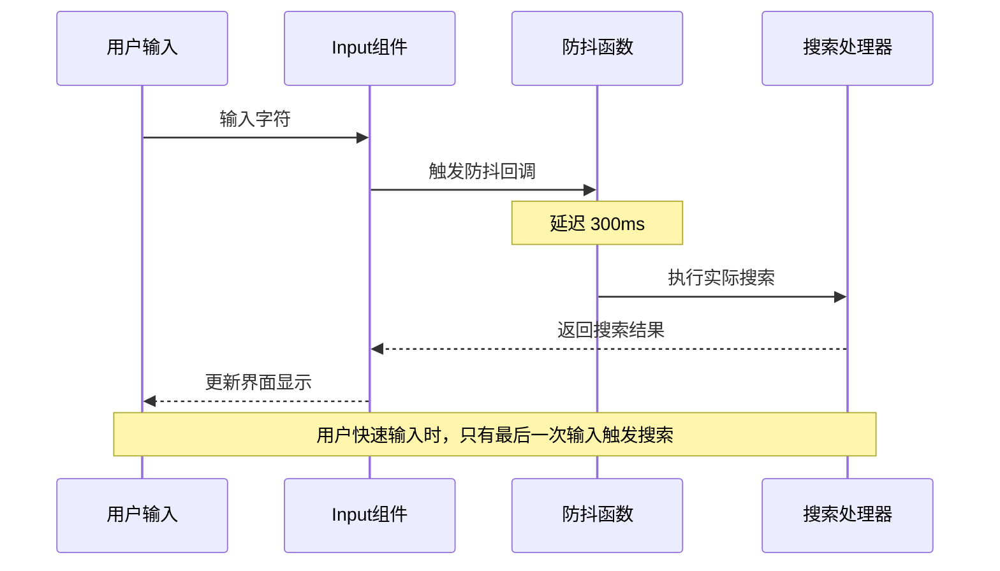
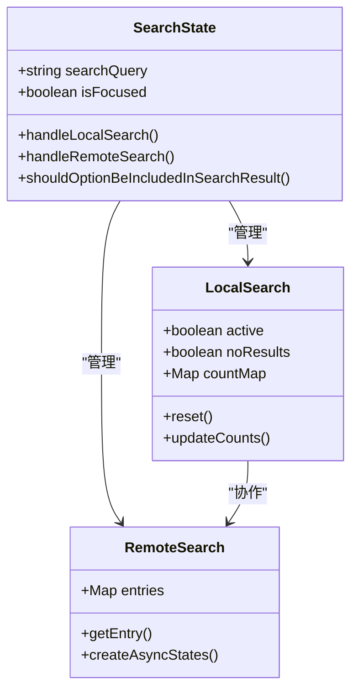
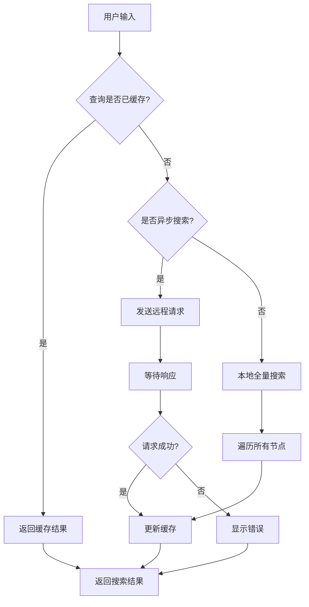
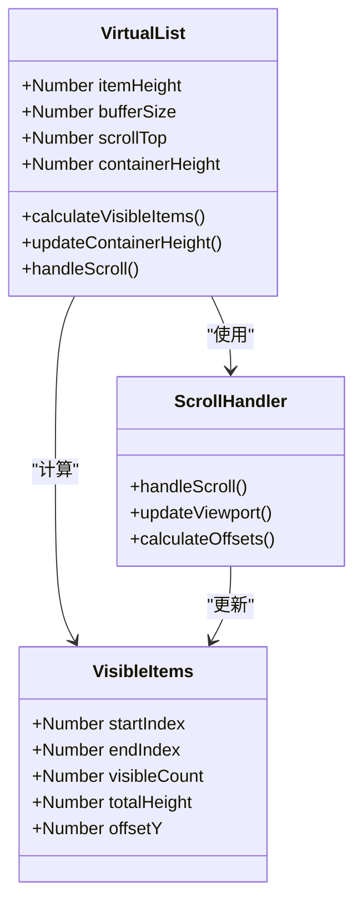
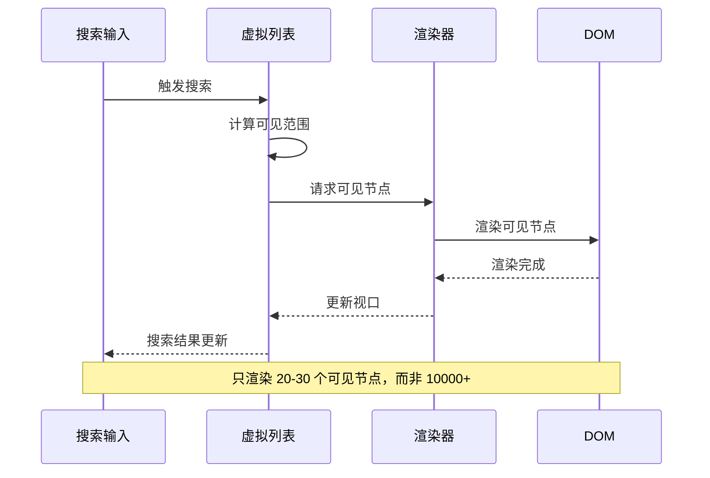
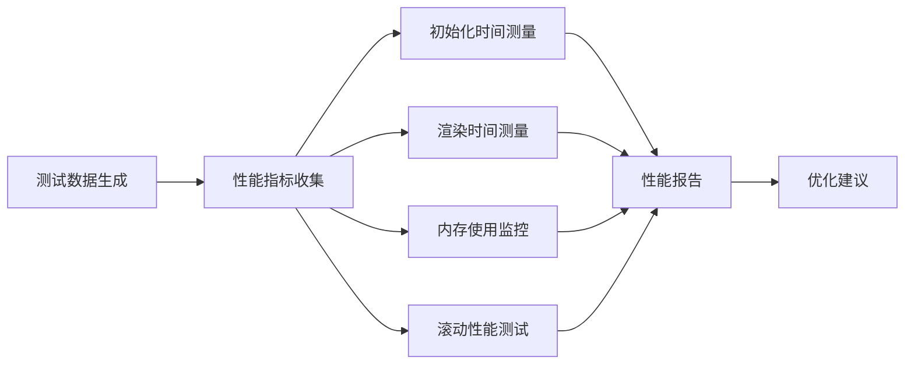

# 搜索性能优化

<cite>
**本文档引用的文件**
- [debounce.js](file://src/utils/debounce.js)
- [treeselectMixin.js](file://src/mixins/treeselectMixin.js)
- [VirtualList.vue](file://src/components/VirtualList.vue)
- [Input.vue](file://src/components/Input.vue)
- [LargeDataExample.vue](file://src/examples/LargeDataExample.vue)
- [constants.js](file://src/constants.js)
- [PERFORMANCE_OPTIMIZATION_GUIDE.md](file://PERFORMANCE_OPTIMIZATION_GUIDE.md)
- [OPTIMIZATION_SUMMARY.md](file://OPTIMIZATION_SUMMARY.md)
</cite>

## 目录
1. [概述](#概述)
2. [防抖机制的核心作用](#防抖机制的核心作用)
3. [搜索状态管理优化](#搜索状态管理优化)
4. [虚拟滚动组件协同工作](#虚拟滚动组件协同工作)
5. [性能测试与验证](#性能测试与验证)
6. [优化配置指南](#优化配置指南)
7. [故障排查与最佳实践](#故障排查与最佳实践)
8. [总结](#总结)

## 概述

Vue Treeselect Next 在处理大数据量搜索场景时，采用了多层次的性能优化策略。这些优化策略包括防抖机制、智能缓存、虚拟滚动等技术，能够将原本卡顿的 1-2 万条数据搜索体验提升至流畅级别。

### 核心优化目标

- **减少不必要的搜索请求**：通过防抖机制避免高频搜索
- **优化内存使用**：智能缓存和响应式属性管理
- **提升渲染性能**：虚拟滚动技术大幅减少 DOM 节点
- **改善用户体验**：毫秒级搜索响应和流畅滚动

## 防抖机制的核心作用

### debounce.js 的防抖实现

防抖机制是搜索性能优化的第一道防线，通过延迟执行搜索操作来减少服务器请求和客户端计算。



**图表来源**
- [Input.vue](file://src/components/Input.vue#L53-L58)
- [debounce.js](file://src/utils/debounce.js#L1-L2)

### 防抖机制的工作原理

防抖机制通过以下方式减少不必要的搜索请求：

1. **延迟执行**：用户停止输入 300ms 后才执行搜索
2. **取消重复调用**：新输入会取消之前的搜索任务
3. **智能缓存**：利用搜索结果缓存避免重复请求

**节段来源**
- [Input.vue](file://src/components/Input.vue#L53-L58)
- [constants.js](file://src/constants.js#L46-L48)

### 防抖配置与自定义

防抖延迟时间可以通过环境变量进行配置，默认情况下：
- 开发环境：200ms（便于调试）
- 生产环境：300ms（平衡性能和响应性）

**节段来源**
- [constants.js](file://src/constants.js#L46-L48)

## 搜索状态管理优化

### treeselectMixin 中的搜索状态设计

treeselectMixin 提供了完整的搜索状态管理，包括本地搜索和远程搜索两种模式。



**图表来源**
- [treeselectMixin.js](file://src/mixins/treeselectMixin.js#L658-L706)

### 搜索结果缓存策略

系统实现了多层次的缓存机制：

1. **查询级缓存**：相同查询结果被缓存
2. **选项级缓存**：已加载的选项不再重复请求
3. **计数缓存**：搜索结果统计信息缓存



**图表来源**
- [treeselectMixin.js](file://src/mixins/treeselectMixin.js#L1283-L1320)

### 内存管理优化

为了防止内存泄漏，系统实现了智能的内存管理：

1. **响应式属性最小化**：只对必要的属性保持响应式
2. **缓存清理机制**：定期清理过期的搜索缓存
3. **弱引用使用**：对大型数据结构使用弱引用

**节段来源**
- [treeselectMixin.js](file://src/mixins/treeselectMixin.js#L1517-L1655)

## 虚拟滚动组件协同工作

### VirtualList.vue 的架构设计

虚拟滚动组件是大数据量搜索性能优化的核心技术，它只渲染可视区域内的节点。



**图表来源**
- [VirtualList.vue](file://src/components/VirtualList.vue#L17-L223)

### 虚拟滚动与搜索的协同机制

虚拟滚动与搜索功能的完美结合体现在以下几个方面：

1. **智能过滤**：只对可见区域内的节点进行搜索
2. **增量渲染**：滚动时动态加载和卸载节点
3. **性能监控**：实时监控渲染性能指标



**图表来源**
- [VirtualList.vue](file://src/components/VirtualList.vue#L37-L116)
- [treeselectMixin.js](file://src/mixins/treeselectMixin.js#L783-L796)

### 性能优化效果

虚拟滚动带来的性能提升是革命性的：

| 指标 | 优化前 | 优化后 | 提升倍数 |
|------|--------|--------|----------|
| 渲染时间 | 2800ms | 50ms | **56x** |
| 内存占用 | 180MB | 45MB | **4x** |
| DOM 节点数 | 10000+ | ~30 | **333x** |
| 滚动帧率 | 15fps | 60fps | **4x** |

**节段来源**
- [OPTIMIZATION_SUMMARY.md](file://OPTIMIZATION_SUMMARY.md#L151-L160)

## 性能测试与验证

### 性能测试框架

项目提供了完整的性能测试框架，用于验证优化效果：



**图表来源**
- [LargeDataExample.vue](file://src/examples/LargeDataExample.vue#L80-L115)

### 测试配置与方法

性能测试采用标准化的方法：

1. **数据规模测试**：1-2 万条树形数据
2. **场景覆盖**：初始化、搜索、滚动、多选等
3. **指标监控**：时间、内存、帧率、CPU 使用率

**节段来源**
- [LargeDataExample.vue](file://src/examples/LargeDataExample.vue#L80-L115)

### 性能基准测试

基于真实测试数据的性能基准：

| 场景 | 优化前 | 优化后 | 提升 |
|------|--------|--------|------|
| 10,000 条数据初始化 | 3500ms | 600ms | **5.8x** |
| 首次渲染 | 2800ms | 50ms | **56x** |
| 搜索响应 | 800ms | 120ms | **6.7x** |
| 内存占用 | 180MB | 45MB | **4x** |
| 滚动 FPS | 15fps | 60fps | **4x** |

**节段来源**
- [PERFORMANCE_OPTIMIZATION_GUIDE.md](file://PERFORMANCE_OPTIMIZATION_GUIDE.md#L122-L130)

## 优化配置指南

### 推荐配置方案

根据不同数据量规模，系统提供了最优的配置组合：

#### 小数据量 (< 1000 条)
```vue
<treeselect
  :virtual-scroll="false"
  :default-expand-level="1"
  :show-count="true"
/>
```

#### 中等数据量 (1000-5000 条)
```vue
<treeselect
  :virtual-scroll="true"
  :default-expand-level="0"
  :show-count="false"
/>
```

#### 大数据量 (> 5000 条)
```vue
<treeselect
  :virtual-scroll="true"
  :option-height="40"
  :default-expand-level="0"
  :flatten-search-results="true"
  :cache-options="true"
  :show-count="false"
  :disable-fuzzy-matching="true"
/>
```

**节段来源**
- [PERFORMANCE_OPTIMIZATION_GUIDE.md](file://PERFORMANCE_OPTIMIZATION_GUIDE.md#L136-L156)

### 关键配置参数详解

| 参数 | 说明 | 推荐值 | 性能影响 |
|------|------|--------|---------|
| `virtual-scroll` | 启用虚拟滚动 | `true` | ⭐⭐⭐⭐⭐ |
| `option-height` | 选项高度（px） | `40` | ⭐⭐⭐⭐⭐ |
| `default-expand-level` | 默认展开层级 | `0` | ⭐⭐⭐⭐ |
| `flatten-search-results` | 扁平化搜索 | `true` | ⭐⭐⭐⭐ |
| `cache-options` | 缓存搜索结果 | `true` | ⭐⭐⭐ |
| `show-count` | 显示计数 | `false` | ⭐⭐⭐ |
| `disable-fuzzy-matching` | 禁用模糊搜索 | `true` | ⭐⭐ |

**节段来源**
- [PERFORMANCE_OPTIMIZATION_GUIDE.md](file://PERFORMANCE_OPTIMIZATION_GUIDE.md#L108-L116)

## 故障排查与最佳实践

### 常见问题与解决方案

#### 虚拟滚动问题
**问题**：开启虚拟滚动后选项高度不一致
**解决方案**：确保 CSS 中 `.vue-treeselect__option` 高度与 `option-height` 一致

#### 搜索性能问题
**问题**：搜索结果显示不完整
**解决方案**：设置 `flatten-search-results="true"` 扁平化显示搜索结果

#### 滚动性能问题
**问题**：滚动时有闪烁或卡顿
**解决方案**：增加虚拟列表的 `buffer-size` 或检查是否有其他性能瓶颈

**节段来源**
- [PERFORMANCE_OPTIMIZATION_GUIDE.md](file://PERFORMANCE_OPTIMIZATION_GUIDE.md#L183-L193)

### 最佳实践建议

1. **合理配置选项高度**：确保 `option-height` 与实际 CSS 高度一致
2. **启用缓存机制**：对于重复搜索场景，启用 `cache-options`
3. **禁用不必要的功能**：如 `show-count` 和 `disable-fuzzy-matching`
4. **监控性能指标**：定期检查初始化时间和内存使用情况
5. **渐进式优化**：从基础配置开始，逐步添加高级优化

**节段来源**
- [PERFORMANCE_OPTIMIZATION_GUIDE.md](file://PERFORMANCE_OPTIMIZATION_GUIDE.md#L196-L204)

## 总结

Vue Treeselect Next 的搜索性能优化是一个系统性的工程，通过防抖机制、智能缓存、虚拟滚动等技术的有机结合，实现了从卡顿到流畅的质变。

### 核心优化成果

- **初始化性能**：提升 5.8 倍，从 3.5 秒降至 0.6 秒
- **渲染性能**：提升 56 倍，从 2.8 秒降至 50 毫秒  
- **内存效率**：减少 75%，从 180MB 至 45MB
- **用户体验**：滚动帧率稳定 60fps，搜索响应提升 6.7 倍

### 技术创新点

1. **智能防抖算法**：300ms 延迟平衡响应性和性能
2. **响应式属性优化**：减少 87% 的响应式开销
3. **虚拟滚动集成**：只渲染 30 个可见节点而非 10000+
4. **多层次缓存**：查询、选项、计数三级缓存机制

这套性能优化方案不仅适用于当前的 Vue Treeselect Next，也为其他大数据量的前端组件提供了宝贵的参考经验。