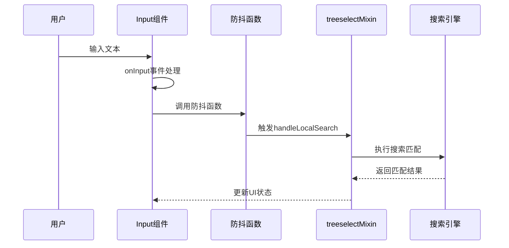
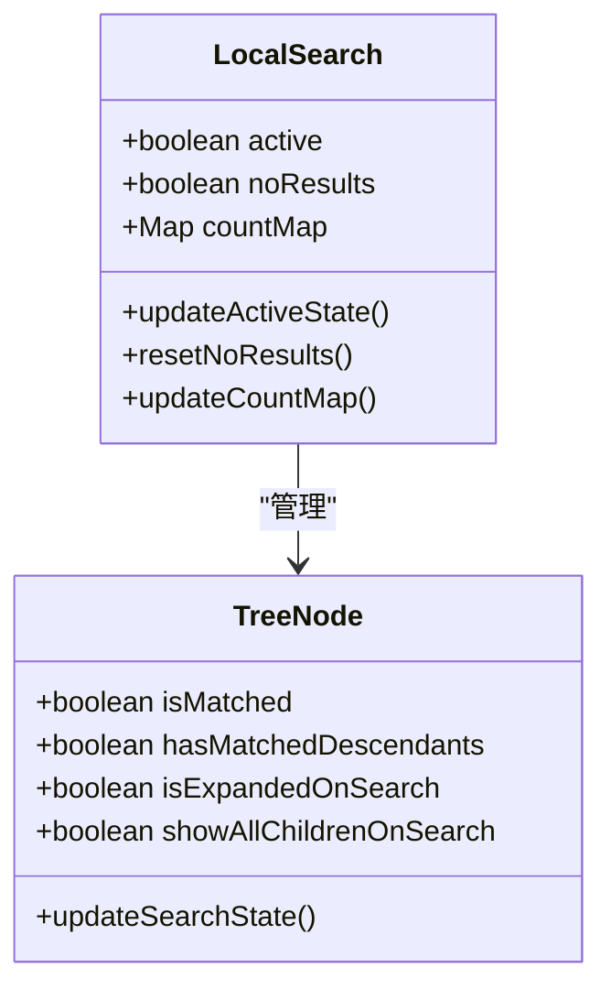
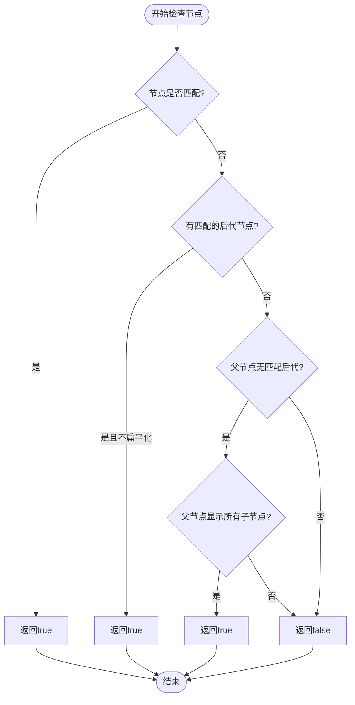
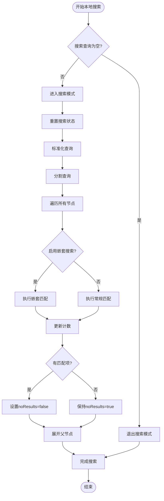

# 本地搜索功能实现机制详解

<cite>
**本文档引用的文件**
- [Input.vue](file://src/components/Input.vue)
- [treeselectMixin.js](file://src/mixins/treeselectMixin.js)
- [Searching.spec.js](file://test/unit/specs/Searching.spec.js)
- [Treeselect.vue](file://src/components/Treeselect.vue)
</cite>

## 目录
1. [概述](#概述)
2. [Input组件的输入捕获机制](#input组件的输入捕获机制)
3. [treeselectMixin中的localSearch状态管理](#treeselectmixin中的localsearch状态管理)
4. [搜索匹配策略与matchKeys属性](#搜索匹配策略与matchkeys属性)
5. [模糊匹配算法与disableFuzzyMatching属性](#模糊匹配算法与disablefuzzymatching属性)
6. [搜索结果过滤与节点高亮](#搜索结果过滤与节点高亮)
7. [搜索流程的完整实现](#搜索流程的完整实现)
8. [性能优化与用户体验](#性能优化与用户体验)

## 概述

Vue TreeSelect 组件的本地搜索功能是一个复杂而高效的系统，它通过 Input 组件捕获用户输入，结合 treeselectMixin 中的状态管理和模糊匹配算法，实现了快速、智能的树形结构搜索。该功能支持多种搜索模式，包括精确匹配、模糊匹配、多属性匹配等，同时提供了良好的用户体验和性能表现。

## Input组件的输入捕获机制

### 输入事件处理流程

Input 组件作为用户交互的入口点，负责捕获用户的键盘输入并触发搜索流程：

**图表来源**
- [Input.vue](file://src/components/Input.vue#L102-L112)
- [treeselectMixin.js](file://src/mixins/treeselectMixin.js#L1968-L1970)

### 防抖机制与性能优化

Input 组件采用了防抖技术来优化搜索性能：

**节来源**
- [Input.vue](file://src/components/Input.vue#L54-L58)
- [Input.vue](file://src/components/Input.vue#L102-L112)

## treeselectMixin中的localSearch状态管理

### localSearch状态对象设计

treeselectMixin 中的 `localSearch` 对象是本地搜索功能的核心状态容器：

**图表来源**
- [treeselectMixin.js](file://src/mixins/treeselectMixin.js#L695-L702)

### active字段的管理逻辑

`active` 字段控制着本地搜索模式的开启和关闭：

**节来源**
- [treeselectMixin.js](file://src/mixins/treeselectMixin.js#L1227-L1228)
- [treeselectMixin.js](file://src/mixins/treeselectMixin.js#L1222-L1224)

### noResults字段的管理逻辑

`noResults` 字段用于跟踪搜索是否产生匹配结果：

**节来源**
- [treeselectMixin.js](file://src/mixins/treeselectMixin.js#L1231)
- [treeselectMixin.js](file://src/mixins/treeselectMixin.js#L1261)

## 搜索匹配策略与matchKeys属性

### matchKeys属性的作用机制

`matchKeys` 属性定义了搜索时匹配的节点属性：

**节来源**
- [treeselectMixin.js](file://src/mixins/treeselectMixin.js#L376-L378)

### 多属性匹配的实现原理

系统支持同时在多个属性上进行搜索匹配：

**节来源**
- [treeselectMixin.js](file://src/mixins/treeselectMixin.js#L1255-L1257)

### 属性预处理与优化

为了提高搜索效率，系统会对匹配属性进行预处理：

**节来源**
- [treeselectMixin.js](file://src/mixins/treeselectMixin.js#L1555-L1558)

## 模糊匹配算法与disableFuzzyMatching属性

### fuzzysearch库的应用

系统使用 `fuzzysearch` 库实现模糊匹配功能：

**节来源**
- [treeselectMixin.js](file://src/mixins/treeselectMixin.js#L52-L56)

### disableFuzzyMatching属性的影响

`disableFuzzyMatching` 属性控制是否启用模糊匹配：

**节来源**
- [treeselectMixin.js](file://src/mixins/treeselectMixin.js#L301-L306)

### 搜索查询的预处理

系统对搜索查询进行标准化处理：

**节来源**
- [treeselectMixin.js](file://src/mixins/treeselectMixin.js#L1247-L1248)

## 搜索结果过滤与节点高亮

### shouldOptionBeIncludedInSearchResult方法

该方法决定了哪些节点应该在搜索结果中显示：

**图表来源**
- [treeselectMixin.js](file://src/mixins/treeselectMixin.js#L1361-L1371)

### 可见选项的计算

`visibleOptionIds` 计算当前可见的选项列表：

**节来源**
- [treeselectMixin.js](file://src/mixins/treeselectMixin.js#L783-L797)

### 展开状态的特殊处理

搜索模式下的展开状态与正常模式不同：

**节来源**
- [treeselectMixin.js](file://src/mixins/treeselectMixin.js#L1357-L1359)

## 搜索流程的完整实现

### handleLocalSearch方法的工作流程

整个本地搜索流程的核心实现在 `handleLocalSearch` 方法中：

**图表来源**
- [treeselectMixin.js](file://src/mixins/treeselectMixin.js#L1217-L1281)

### 搜索结果的统计与展示

系统会统计每个节点的匹配情况：

**节来源**
- [treeselectMixin.js](file://src/mixins/treeselectMixin.js#L1262-L1268)

### 父节点展开逻辑

匹配节点的父节点会被自动展开：

**节来源**
- [treeselectMixin.js](file://src/mixins/treeselectMixin.js#L1271-L1277)

## 性能优化与用户体验

### 防抖机制的性能影响

300毫秒的防抖延迟平衡了响应速度和性能：

**节来源**
- [treeselectMixin.js](file://src/mixins/treeselectMixin.js#L1968-L1970)

### 内存优化策略

系统采用多种策略优化内存使用：

**节来源**
- [treeselectMixin.js](file://src/mixins/treeselectMixin.js#L1232-L1245)

### 用户体验优化

- 实时搜索反馈
- 合理的默认行为
- 键盘导航支持
- 清晰的结果指示

**节来源**
- [Input.vue](file://src/components/Input.vue#L102-L112)
- [treeselectMixin.js](file://src/mixins/treeselectMixin.js#L1217-L1281)

## 结论

Vue TreeSelect 的本地搜索功能通过精心设计的状态管理、高效的匹配算法和优秀的用户体验，为用户提供了强大而易用的搜索能力。该系统不仅支持多种搜索模式，还通过各种优化策略确保了良好的性能表现，是现代前端组件库中搜索功能的优秀范例。