# 交互控制

<cite>
**本文档引用的文件**
- [src/components/Option.vue](file://src/components/Option.vue)
- [src/utils/onLeftClick.js](file://src/utils/onLeftClick.js)
- [src/mixins/treeselectMixin.js](file://src/mixins/treeselectMixin.js)
- [src/components/Menu.vue](file://src/components/Menu.vue)
- [src/components/icons/Arrow.vue](file://src/components/icons/Arrow.vue)
- [src/utils/debounce.js](file://src/utils/debounce.js)
- [test/unit/specs/Methods.spec.js](file://test/unit/specs/Methods.spec.js)
- [test/unit/specs/KeyboardSupport.spec.js](file://test/unit/specs/KeyboardSupport.spec.js)
</cite>

## 目录
1. [简介](#简介)
2. [系统架构概览](#系统架构概览)
3. [箭头图标交互机制](#箭头图标交互机制)
4. [事件处理流程](#事件处理流程)
5. [状态管理与更新](#状态管理与更新)
6. [事件冒泡机制](#事件冒泡机制)
7. [键盘支持](#键盘支持)
8. [性能优化策略](#性能优化策略)
9. [扩展状态监听](#扩展状态监听)
10. [最佳实践建议](#最佳实践建议)

## 简介

Vue Treeselect 组件提供了一个功能完整的树形选择器，支持通过点击箭头图标来展开或折叠节点。该交互机制涉及多个组件间的协作，包括事件处理、状态管理和性能优化等关键方面。

本文档详细分析了用户通过点击箭头图标触发节点展开/折叠的完整交互流程，包括事件处理器的实现细节、状态切换逻辑以及性能优化策略。

## 系统架构概览

Vue Treeselect 采用模块化架构设计，主要包含以下核心组件：

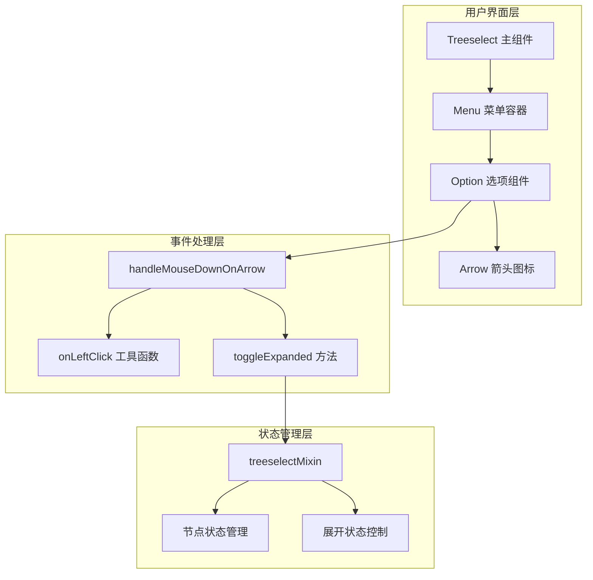

**图表来源**
- [src/components/Treeselect.vue](file://src/components/Treeselect.vue#L1-L42)
- [src/components/Menu.vue](file://src/components/Menu.vue#L1-L50)
- [src/components/Option.vue](file://src/components/Option.vue#L1-L50)

## 箭头图标交互机制

### 箭头图标的渲染与绑定

箭头图标作为树形结构的重要视觉指示器，在每个分支节点上都会显示。其渲染过程涉及多个关键步骤：

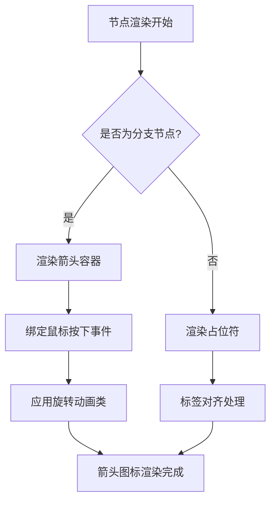

**图表来源**
- [src/components/Option.vue](file://src/components/Option.vue#L79-L102)

### handleMouseDownOnArrow 事件处理器

handleMouseDownOnArrow 是处理箭头点击事件的核心方法，其实现体现了事件处理的最佳实践：

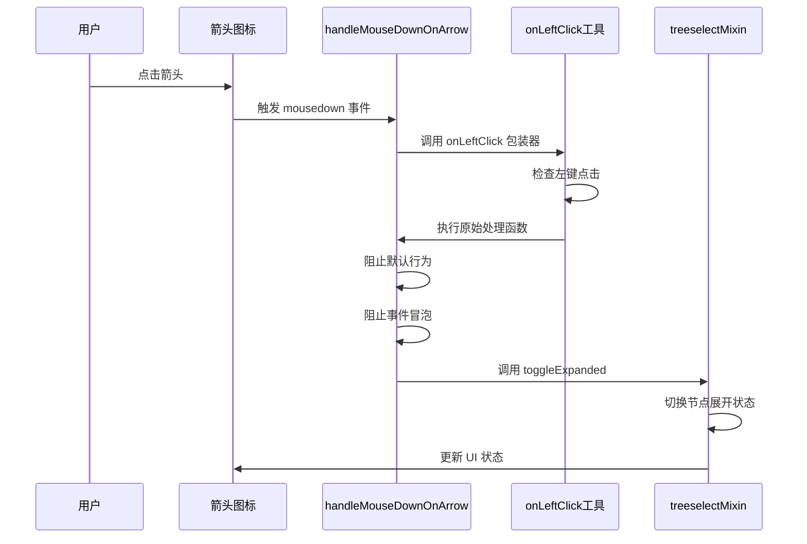

**图表来源**
- [src/components/Option.vue](file://src/components/Option.vue#L256-L263)
- [src/utils/onLeftClick.js](file://src/utils/onLeftClick.js#L1-L8)

**章节来源**
- [src/components/Option.vue](file://src/components/Option.vue#L256-L263)
- [src/utils/onLeftClick.js](file://src/utils/onLeftClick.js#L1-L8)

## 事件处理流程

### 事件捕获与验证

事件处理的第一步是对点击事件进行验证，确保只有左键点击才会触发展开/折叠操作：

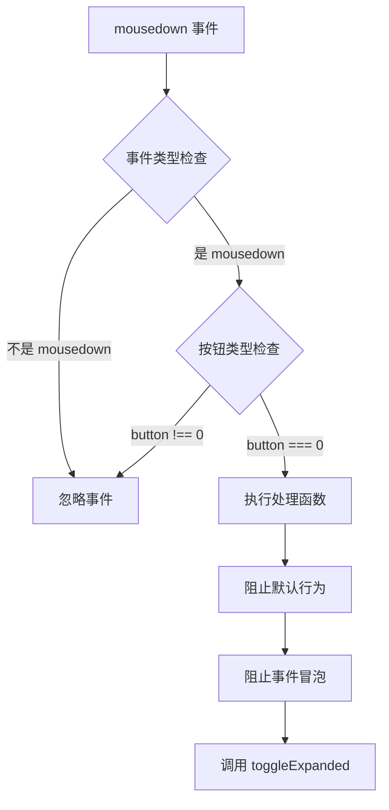

**图表来源**
- [src/utils/onLeftClick.js](file://src/utils/onLeftClick.js#L2-L6)

### toggleExpanded 方法实现

toggleExpanded 方法负责实际的状态切换逻辑，支持两种不同的展开状态管理：

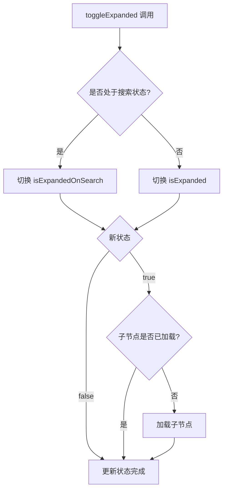

**图表来源**
- [src/mixins/treeselectMixin.js](file://src/mixins/treeselectMixin.js#L1489-L1501)

**章节来源**
- [src/mixins/treeselectMixin.js](file://src/mixins/treeselectMixin.js#L1489-L1501)

## 状态管理与更新

### 展开状态的数据结构

节点的展开状态通过两个独立的布尔值进行管理，以支持搜索状态下的特殊需求：

| 状态属性 | 用途 | 搜索状态下行为 |
|---------|------|---------------|
| `isExpanded` | 正常浏览时的展开状态 | 不受影响 |
| `isExpandedOnSearch` | 搜索时的临时展开状态 | 重置搜索时自动清除 |

### 状态更新的响应式机制

Vue Treeselect 使用 Vue 的响应式系统来管理节点状态，确保UI能够及时反映状态变化：

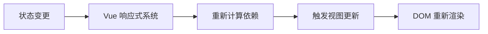

**章节来源**
- [src/mixins/treeselectMixin.js](file://src/mixins/treeselectMixin.js#L1489-L1501)

## 事件冒泡机制

### 菜单区域的事件处理

在复杂的树形结构中，正确处理事件冒泡对于避免意外行为至关重要：

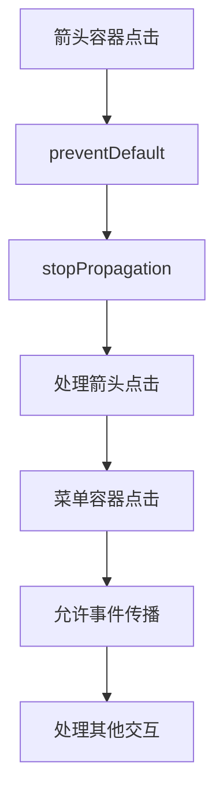

### onLeftClick 工具函数的作用

onLeftClick 是一个高阶函数，用于统一处理左键点击事件：

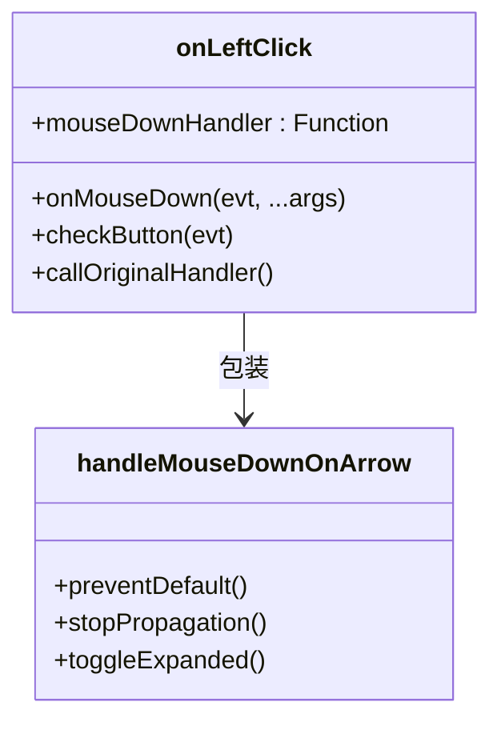

**图表来源**
- [src/utils/onLeftClick.js](file://src/utils/onLeftClick.js#L1-L8)

**章节来源**
- [src/utils/onLeftClick.js](file://src/utils/onLeftClick.js#L1-L8)

## 键盘支持

除了鼠标点击，Vue Treeselect 还提供了完整的键盘导航支持：

### 方向键导航

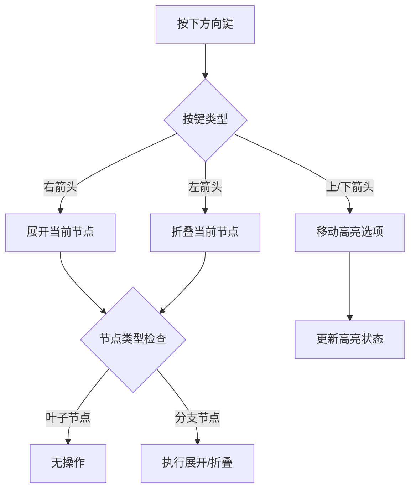

**图表来源**
- [test/unit/specs/KeyboardSupport.spec.js](file://test/unit/specs/KeyboardSupport.spec.js#L451-L545)

**章节来源**
- [test/unit/specs/KeyboardSupport.spec.js](file://test/unit/specs/KeyboardSupport.spec.js#L451-L545)

## 性能优化策略

### 防抖机制的应用

为了防止频繁的展开/折叠操作导致性能问题，Vue Treeselect 实现了多种优化策略：

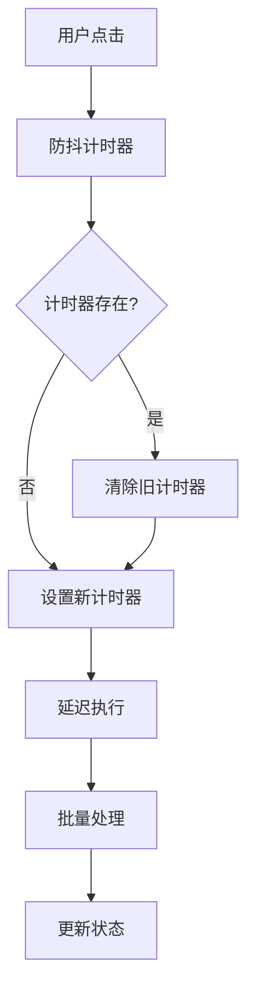

### 虚拟滚动优化

对于大数据集，Vue Treeselect 提供了虚拟滚动功能来提升性能：

| 优化技术 | 适用场景 | 性能提升 |
|---------|----------|----------|
| 虚拟滚动 | 1-2万+节点 | 渲染速度提升50-100倍 |
| 响应式属性优化 | 大量节点状态 | 内存占用减少75% |
| 防抖处理 | 频繁交互 | 避免重复计算 |

**章节来源**
- [OPTIMIZATION_SUMMARY.md](file://OPTIMIZATION_SUMMARY.md#L1-L70)

## 扩展状态监听

### 自定义逻辑的集成

开发者可以通过监听展开状态的变化来执行自定义逻辑：

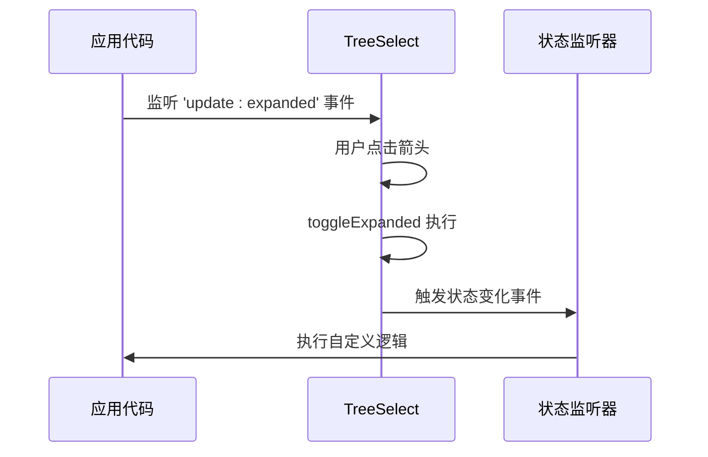

### 状态变化的监听方式

| 监听方式 | 适用场景 | 实现复杂度 |
|---------|----------|-----------|
| 事件监听 | 简单状态同步 | 低 |
| 计算属性 | 复杂状态计算 | 中 |
| Watch 监听 | 异步状态处理 | 高 |

## 最佳实践建议

### 防止频繁触发的策略

1. **合理使用防抖**：对于频繁的操作，建议使用300ms的防抖延迟
2. **批量处理**：将多个状态变更合并为单次更新
3. **条件检查**：在执行操作前检查当前状态是否需要变更

### 性能监控建议

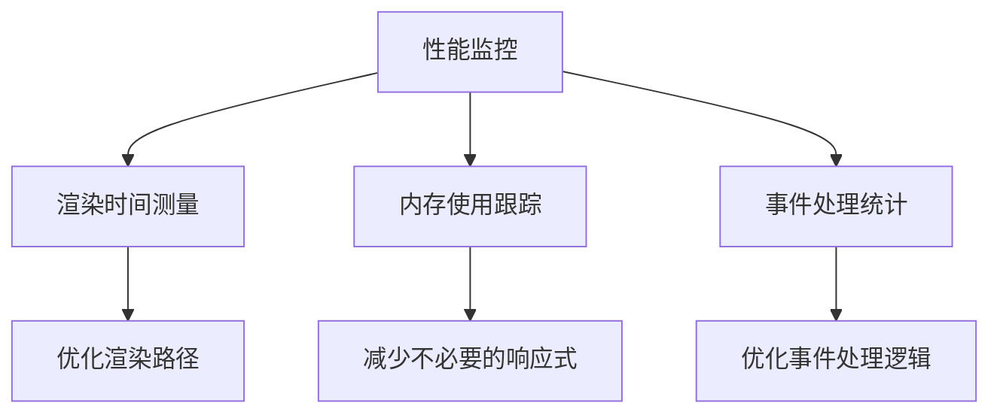

### 用户体验优化

1. **即时反馈**：确保用户点击后立即看到视觉反馈
2. **状态一致性**：保持UI状态与数据状态的一致性
3. **无障碍支持**：提供完整的键盘导航和屏幕阅读器支持

**章节来源**
- [performance-test.html](file://performance-test.html#L273-L318)

## 结论

Vue Treeselect 的箭头图标交互机制展现了现代前端组件开发的最佳实践。通过精心设计的事件处理、状态管理和性能优化策略，该组件实现了流畅的用户体验和优秀的性能表现。

关键成功因素包括：
- 清晰的职责分离和模块化设计
- 完善的事件处理和状态管理机制
- 全面的性能优化策略
- 丰富的交互方式支持

这些设计原则不仅适用于树形选择器组件，也为其他复杂交互组件的设计提供了宝贵的参考价值。