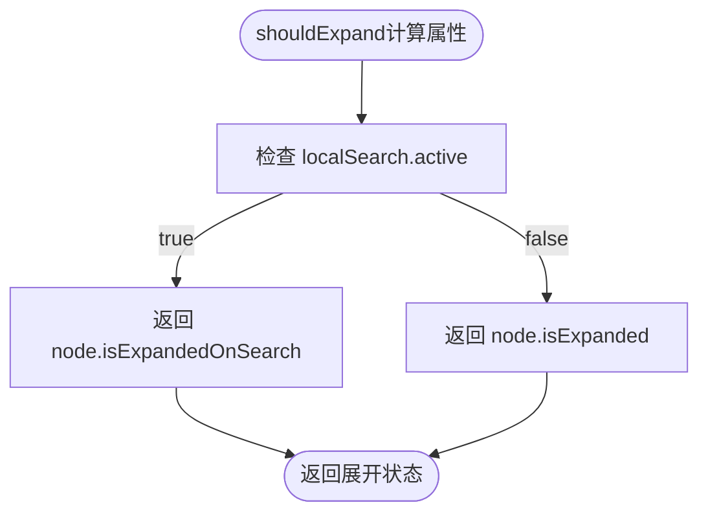
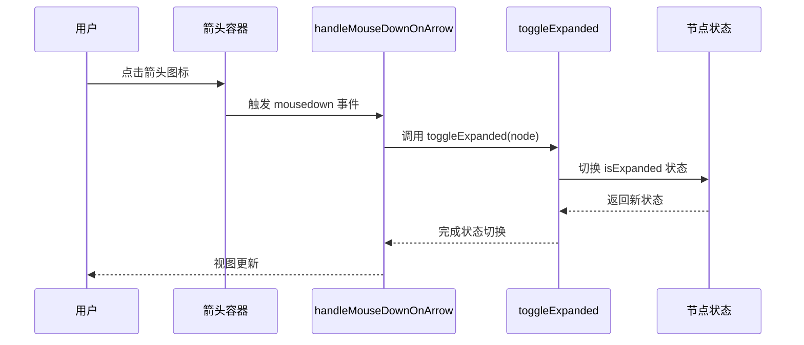
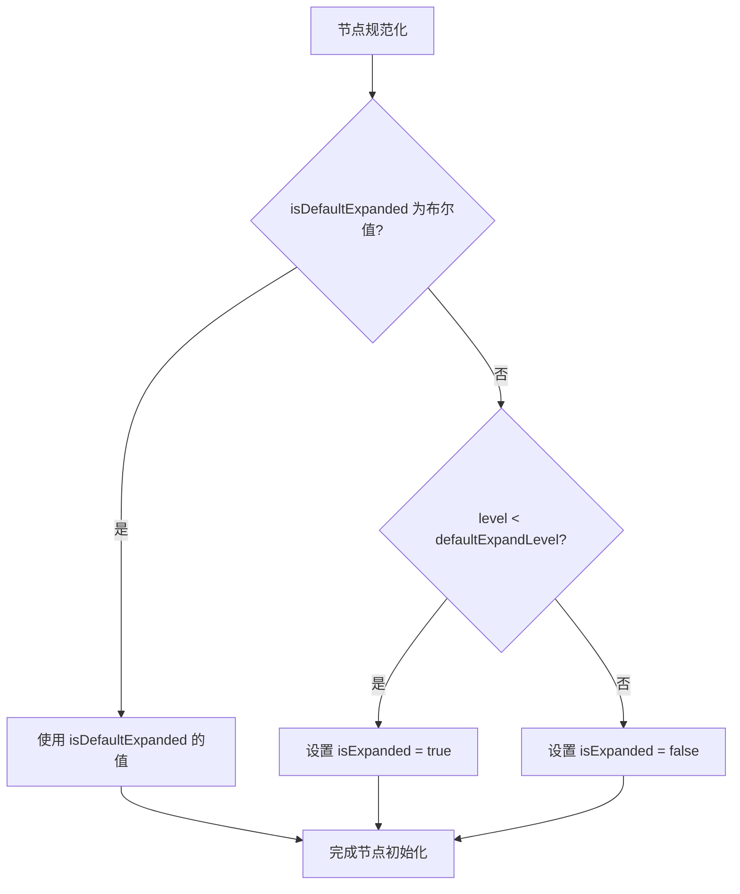
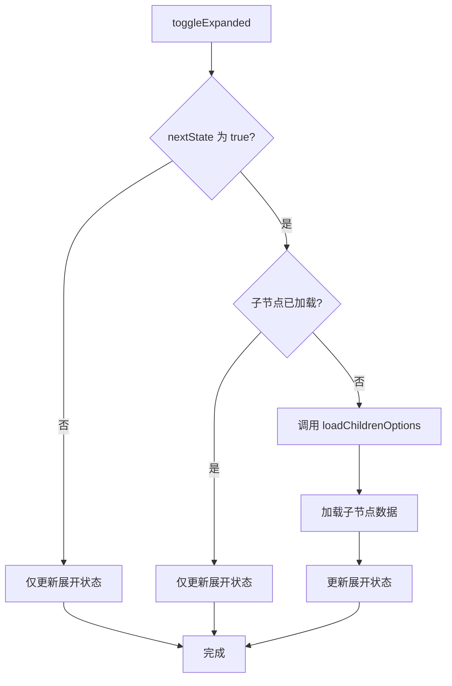

# 展开控制

<cite>
**本文档引用的文件**
- [treeselectMixin.js](file://src/mixins/treeselectMixin.js)
- [Option.vue](file://src/components/Option.vue)
- [Props.spec.js](file://test/unit/specs/Props.spec.js)
- [KeyboardSupport.spec.js](file://test/unit/specs/KeyboardSupport.spec.js)
- [Methods.spec.js](file://test/unit/specs/Methods.spec.js)
</cite>

## 目录
1. [展开控制策略](#展开控制策略)
2. [shouldExpand计算属性](#shouldexpand计算属性)
3. [箭头点击事件处理](#箭头点击事件处理)
4. [默认展开层级控制](#默认展开层级控制)
5. [异步加载时的展开行为](#异步加载时的展开行为)
6. [API控制节点展开状态](#api控制节点展开状态)

## 展开控制策略

树形结构组件中的分支节点展开与折叠控制是用户体验的核心功能。该组件通过一系列计算属性、方法和事件处理机制来实现对节点展开状态的精确控制。展开状态的管理涉及多个方面，包括用户交互、默认配置和异步数据加载等场景。

**Section sources**
- [treeselectMixin.js](file://src/mixins/treeselectMixin.js#L1357-L1502)
- [Option.vue](file://src/components/Option.vue#L100-L150)

## shouldExpand计算属性

`shouldExpand` 计算属性是决定节点是否应该展开的核心逻辑。该属性根据当前是否处于搜索状态来选择不同的展开状态标志。当用户进行搜索时，组件会进入本地搜索模式，此时节点的展开状态由 `isExpandedOnSearch` 属性控制；在正常浏览模式下，则由 `isExpanded` 属性控制。

**Diagram sources**
- [treeselectMixin.js](file://src/mixins/treeselectMixin.js#L1357-L1359)

**Section sources**
- [treeselectMixin.js](file://src/mixins/treeselectMixin.js#L1357-L1359)

## 箭头点击事件处理

箭头点击事件的处理由 `handleMouseDownOnArrow` 方法负责。该方法通过 `onLeftClick` 高阶函数包装，确保只响应鼠标左键点击。当用户点击分支节点的箭头图标时，会触发 `toggleExpanded` 方法来切换节点的展开状态。

**Diagram sources**
- [Option.vue](file://src/components/Option.vue#L200-L220)
- [treeselectMixin.js](file://src/mixins/treeselectMixin.js#L1489-L1502)

**Section sources**
- [Methods.spec.js](file://test/unit/specs/Methods.spec.js#L516-L552)

## 默认展开层级控制

`defaultExpandLevel` 属性用于控制树形结构初始化时默认展开的层级深度。该属性的值决定了在树形结构加载时，哪些层级的分支节点会自动展开。在节点规范化过程中，如果节点没有明确设置 `isDefaultExpanded` 属性，则会根据其层级与 `defaultExpandLevel` 的比较结果来决定初始展开状态。

**Diagram sources**
- [treeselectMixin.js](file://src/mixins/treeselectMixin.js#L1596-L1598)

**Section sources**
- [Props.spec.js](file://test/unit/specs/Props.spec.js#L1018-L1096)

## 异步加载时的展开行为

当节点的子节点需要异步加载时，展开行为会与数据加载过程紧密结合。在 `toggleExpanded` 方法中，当节点从折叠状态切换到展开状态时，会检查子节点是否已加载。如果子节点尚未加载（`!node.childrenStates.isLoaded`），则会立即调用 `loadChildrenOptions` 方法来加载子节点数据。

**Diagram sources**
- [treeselectMixin.js](file://src/mixins/treeselectMixin.js#L1489-L1501)

**Section sources**
- [DynamicalLoading.spec.js](file://test/unit/specs/DynamicalLoading.spec.js#L270-L316)

## API控制节点展开状态

除了用户交互外，还可以通过API编程方式控制节点的展开状态。`toggleExpanded` 方法是核心的API接口，它接受一个节点对象作为参数，并切换该节点的展开状态。在搜索模式下，该方法会操作 `isExpandedOnSearch` 属性；在正常模式下，则操作 `isExpanded` 属性。此外，键盘事件也集成了展开控制功能，右箭头键用于展开节点，左箭头键用于折叠节点或跳转到父节点。

**Section sources**
- [KeyboardSupport.spec.js](file://test/unit/specs/KeyboardSupport.spec.js#L482-L544)
- [treeselectMixin.js](file://src/mixins/treeselectMixin.js#L1489-L1502)