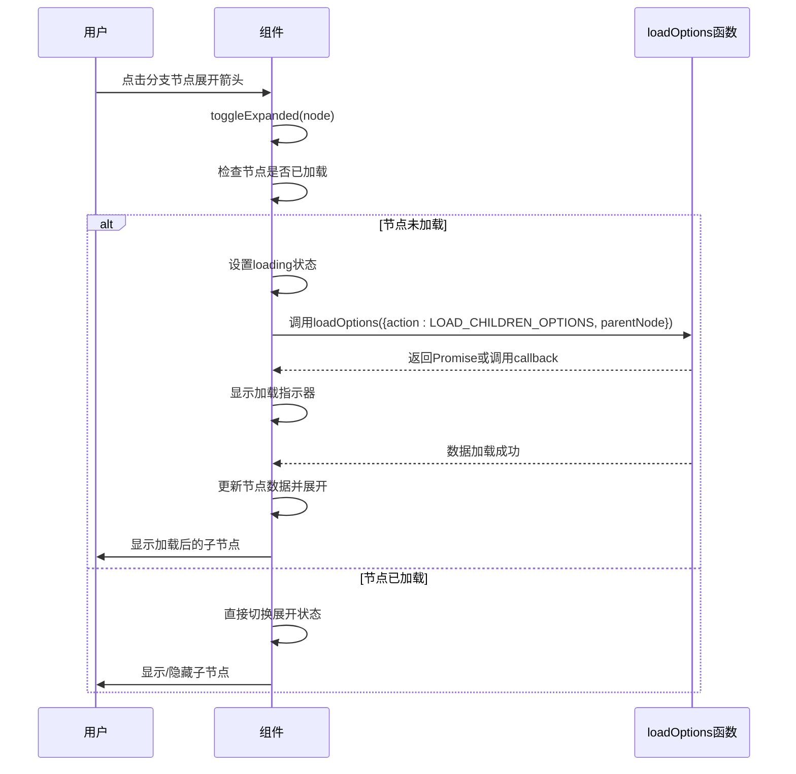
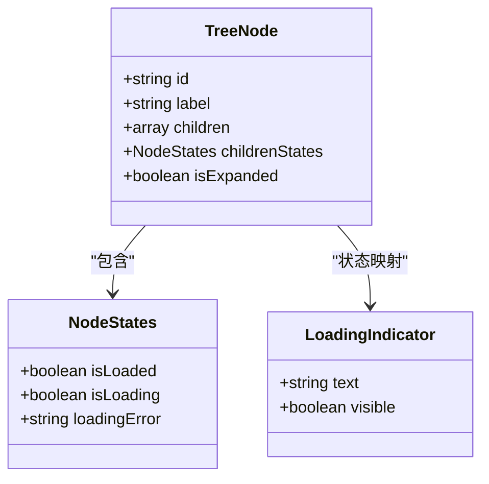
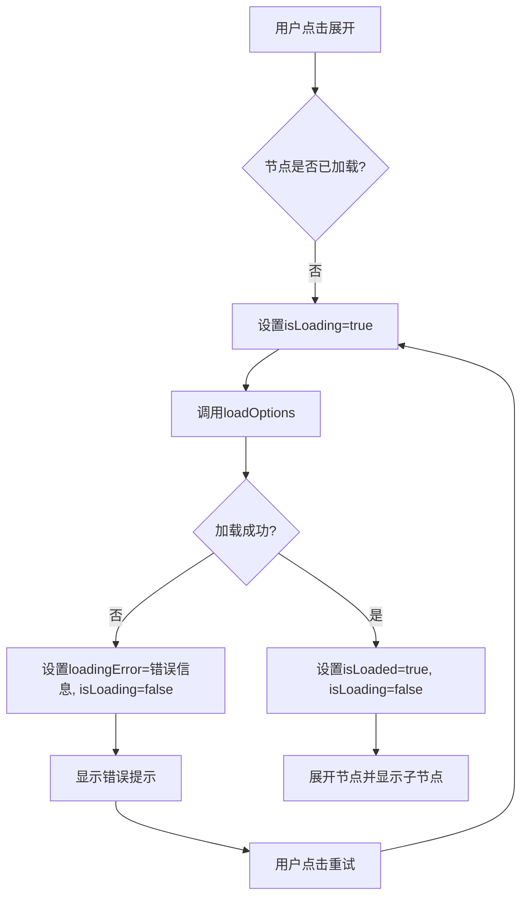

# 异步加载展开

<cite>
**本文档引用的文件**   
- [treeselectMixin.js](file://src/mixins/treeselectMixin.js)
- [Treeselect.vue](file://src/components/Treeselect.vue)
- [DynamicalLoading.spec.js](file://test/unit/specs/DynamicalLoading.spec.js)
</cite>

## 目录
1. [异步加载节点展开流程](#异步加载节点展开流程)
2. [loading状态管理机制](#loading状态管理机制)
3. [错误处理与加载超时恢复](#错误处理与加载超时恢复)
4. [异步展开与静态数据展开的区别](#异步展开与静态数据展开的区别)
5. [开发注意事项](#开发注意事项)

## 异步加载节点展开流程

当用户点击带有加载标记的分支节点时，系统会触发`loadOptions`异步函数来获取子节点数据。该流程的核心在于`toggleExpanded`方法的实现，当用户点击节点的展开箭头时，该方法会被调用。

如果节点尚未加载子节点（即`childrenStates.isLoaded`为`false`），系统会立即调用`loadChildrenOptions`方法。此方法通过`callLoadOptionsProp`调用用户提供的`loadOptions`函数，并传入`LOAD_CHILDREN_OPTIONS`动作和父节点信息。在数据返回后，系统会自动展开该节点，使用户体验更加流畅。

**Diagram sources**
- [treeselectMixin.js](file://src/mixins/treeselectMixin.js#L1488-L1500)
- [treeselectMixin.js](file://src/mixins/treeselectMixin.js#L1698-L1730)

**Section sources**
- [treeselectMixin.js](file://src/mixins/treeselectMixin.js#L1488-L1500)
- [treeselectMixin.js](file://src/mixins/treeselectMixin.js#L1698-L1730)

## loading状态管理机制

系统通过`childrenStates`对象来管理每个节点的加载状态，该对象包含三个关键属性：`isLoaded`、`isLoading`和`loadingError`。这些状态在UI上的体现主要通过不同的视觉元素来展示。

当节点开始加载时，`isLoading`被设置为`true`，此时UI会显示一个加载指示器（通常是一个旋转的图标），并显示`loadingText`属性定义的文本（默认为"Loading..."）。这个状态变化是响应式的，确保了UI能够实时反映数据加载的进度。

**Diagram sources**
- [treeselectMixin.js](file://src/mixins/treeselectMixin.js#L37-L43)
- [treeselectMixin.js](file://src/mixins/treeselectMixin.js#L1591-L1594)

**Section sources**
- [treeselectMixin.js](file://src/mixins/treeselectMixin.js#L37-L43)
- [treeselectMixin.js](file://src/mixins/treeselectMixin.js#L1591-L1594)

## 错误处理与加载超时恢复

系统提供了完善的错误处理机制。当`loadOptions`函数执行失败时，错误信息会被捕获并存储在`childrenStates.loadingError`中。此时，UI会显示错误提示，通常包含错误信息和一个"重试"按钮。

用户可以通过点击"重试"按钮或重新展开节点来恢复加载。系统通过`handleMouseDownOnRetry`方法处理重试逻辑，该方法会再次调用`loadChildrenOptions`来重新发起请求。这种设计确保了即使在网络不稳定的情况下，用户也能有机会重新获取数据。

**Diagram sources**
- [treeselectMixin.js](file://src/mixins/treeselectMixin.js#L1723-L1725)
- [treeselectMixin.js](file://src/mixins/treeselectMixin.js#L1748-L1765)
- [DynamicalLoading.spec.js](file://test/unit/specs/DynamicalLoading.spec.js#L130-L198)

**Section sources**
- [treeselectMixin.js](file://src/mixins/treeselectMixin.js#L1723-L1725)
- [treeselectMixin.js](file://src/mixins/treeselectMixin.js#L1748-L1765)
- [DynamicalLoading.spec.js](file://test/unit/specs/DynamicalLoading.spec.js#L130-L198)

## 异步展开与静态数据展开的区别

异步展开与静态数据展开在实现机制和用户体验上有显著区别。静态数据展开时，所有子节点数据已经存在于内存中，展开操作是即时的，没有延迟。而异步展开需要发起网络请求获取数据，存在明显的等待时间。

从开发角度看，异步展开需要处理加载状态、错误状态等额外情况，代码复杂度更高。同时，异步展开的节点在未加载时`children`属性为`null`，而静态数据的节点`children`属性直接包含子节点数组。这种设计差异要求开发者在处理节点数据时需要进行额外的状态判断。

**Section sources**
- [treeselectMixin.js](file://src/mixins/treeselectMixin.js#L1589-L1590)
- [treeselectMixin.js](file://src/mixins/treeselectMixin.js#L1617-L1624)

## 开发注意事项

在实现异步加载功能时，需要注意以下几点：首先，必须提供`loadOptions`函数，否则系统会发出警告。其次，未加载的分支节点应该将`children`属性设置为`null`，而不是`undefined`或空数组。最后，`loadOptions`函数应该接受一个包含`action`、`parentNode`和`callback`参数的对象，并在获取数据后调用`callback`函数。

此外，开发者应该合理设置`defaultExpandLevel`属性，避免一次性加载过多数据导致性能问题。对于大型数据集，建议结合虚拟滚动（virtualScroll）功能来优化渲染性能。

**Section sources**
- [treeselectMixin.js](file://src/mixins/treeselectMixin.js#L1617-L1621)
- [treeselectMixin.js](file://src/mixins/treeselectMixin.js#L1748-L1754)
- [treeselectMixin.js](file://src/mixins/treeselectMixin.js#L244-L247)