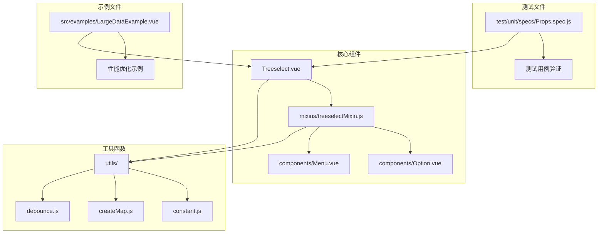
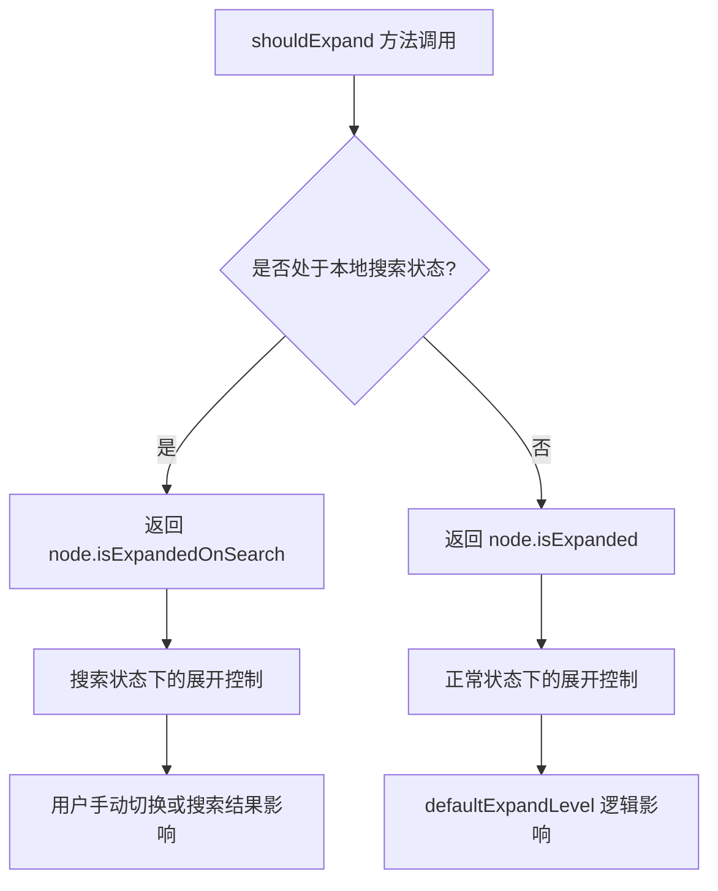
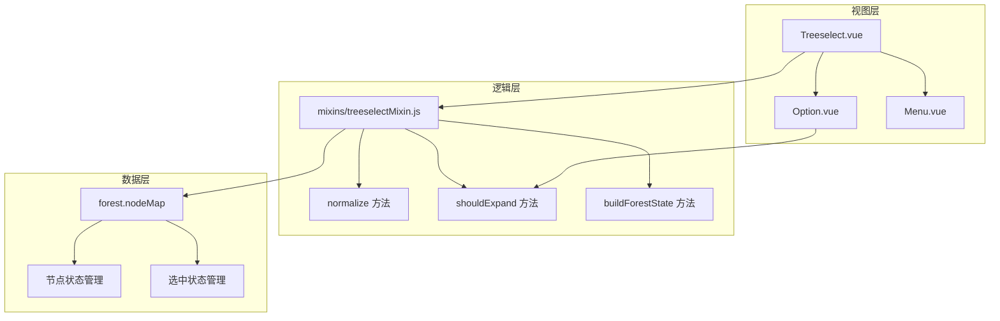
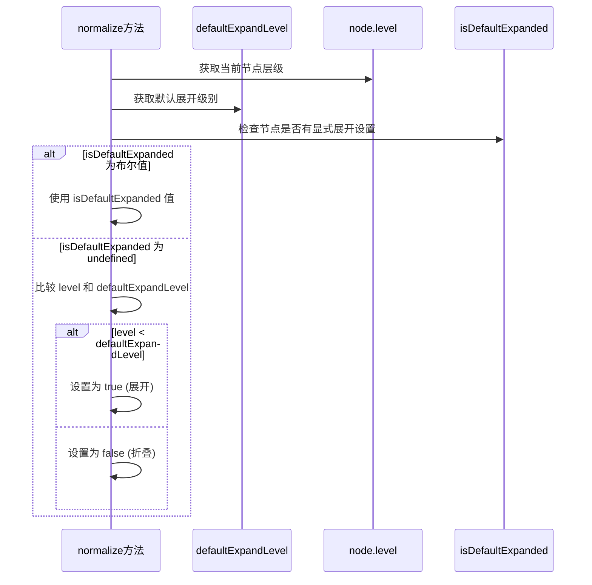
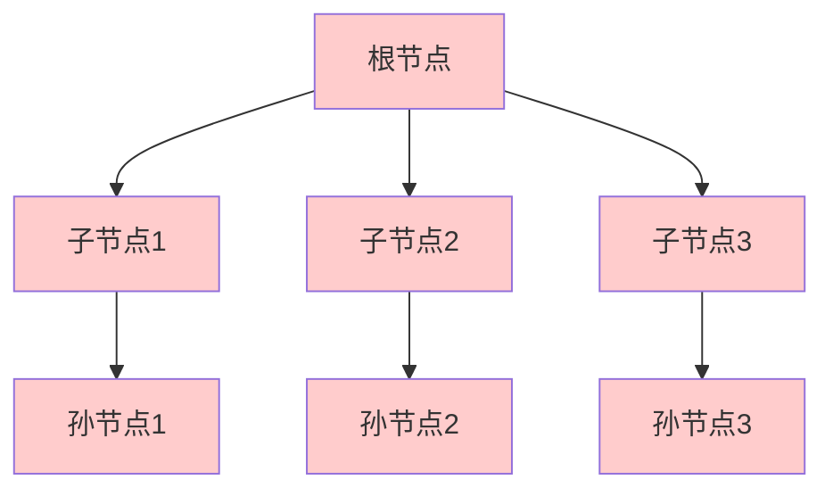
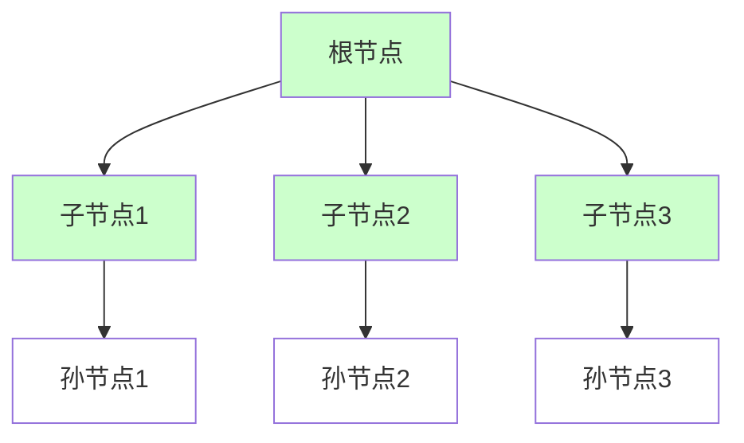
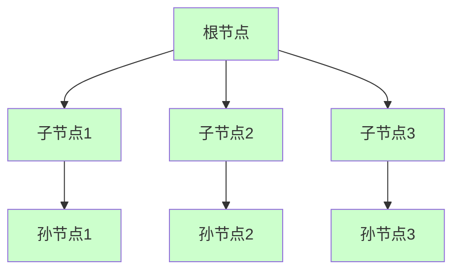
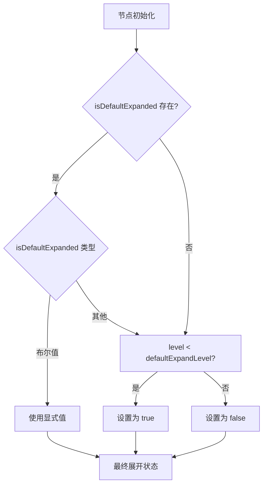
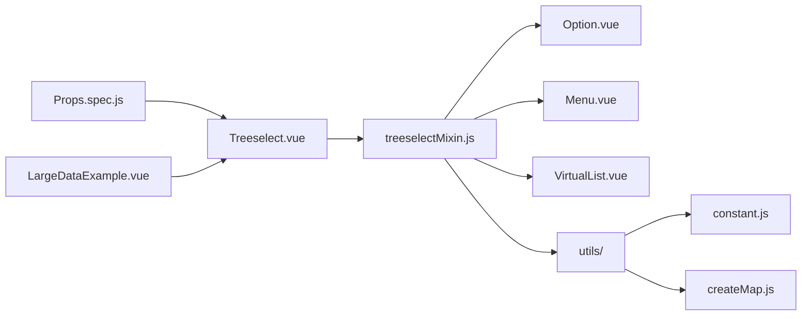
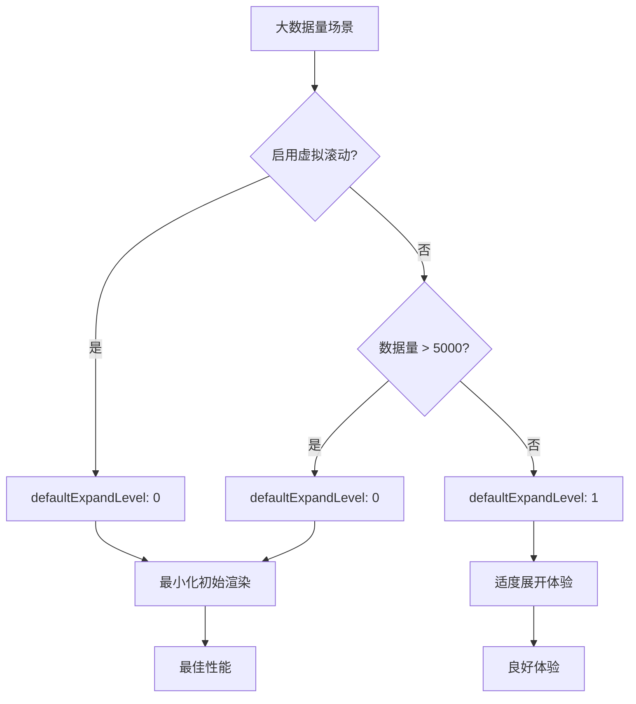

# 默认展开层级

<cite>
**本文档中引用的文件**
- [treeselectMixin.js](file://src/mixins/treeselectMixin.js)
- [Props.spec.js](file://test/unit/specs/Props.spec.js)
- [Option.vue](file://src/components/Option.vue)
- [LargeDataExample.vue](file://src/examples/LargeDataExample.vue)
- [Treeselect.vue](file://src/components/Treeselect.vue)
</cite>

## 目录
1. [简介](#简介)
2. [项目结构概览](#项目结构概览)
3. [核心组件分析](#核心组件分析)
4. [架构概览](#架构概览)
5. [详细组件分析](#详细组件分析)
6. [依赖关系分析](#依赖关系分析)
7. [性能考虑](#性能考虑)
8. [故障排除指南](#故障排除指南)
9. [结论](#结论)

## 简介

`defaultExpandLevel` 是 Vue Treeselect 组件中的一个关键属性，它控制树形结构在初始化时的默认展开深度。该属性通过与节点层级（`node.level`）的比较，决定哪些节点应该自动展开，从而影响组件的初始渲染效果和用户体验。

本文档将深入分析 `defaultExpandLevel` 的实现机制，包括其计算逻辑、与其他属性的交互关系，以及在不同场景下的最佳实践建议。

## 项目结构概览

Vue Treeselect 组件库采用模块化的架构设计，主要包含以下核心目录：



**图表来源**
- [Treeselect.vue](file://src/components/Treeselect.vue#L1-L42)
- [treeselectMixin.js](file://src/mixins/treeselectMixin.js#L1-L50)

**章节来源**
- [Treeselect.vue](file://src/components/Treeselect.vue#L1-L42)
- [treeselectMixin.js](file://src/mixins/treeselectMixin.js#L1-L100)

## 核心组件分析

### defaultExpandLevel 属性定义

`defaultExpandLevel` 属性在组件的 `props` 定义中明确声明，具有以下特征：

| 属性 | 值 |
|------|-----|
| 类型 | Number |
| 默认值 | 0 |
| 描述 | 控制树节点初始化时的默认展开层级 |

该属性的设计理念是提供灵活的展开控制，允许开发者根据具体需求设置不同的展开策略。

**章节来源**
- [treeselectMixin.js](file://src/mixins/treeselectMixin.js#L240-L247)

### shouldExpand 计算方法

`shouldExpand` 方法是 `defaultExpandLevel` 实现的核心逻辑，它决定了节点是否应该处于展开状态：



**图表来源**
- [treeselectMixin.js](file://src/mixins/treeselectMixin.js#L1357-L1359)

**章节来源**
- [treeselectMixin.js](file://src/mixins/treeselectMixin.js#L1357-L1359)

## 架构概览

Vue Treeselect 组件的整体架构体现了清晰的分层设计：



**图表来源**
- [Treeselect.vue](file://src/components/Treeselect.vue#L1-L42)
- [treeselectMixin.js](file://src/mixins/treeselectMixin.js#L1-L100)

## 详细组件分析

### defaultExpandLevel 的计算逻辑

在节点标准化过程中，`defaultExpandLevel` 通过以下逻辑确定节点的初始展开状态：



**图表来源**
- [treeselectMixin.js](file://src/mixins/treeselectMixin.js#L1596-L1598)

#### 具体实现细节

在 `normalize` 方法中，节点的初始展开状态通过以下条件判断：

```javascript
// 关键逻辑位置：treeselectMixin.js#L1596-L1598
this.$set(y, "isExpanded", typeof isDefaultExpanded === 'boolean'
  ? isDefaultExpanded
  : level < this.defaultExpandLevel)
```

这段代码展示了三种情况：
1. **显式设置**：当 `isDefaultExpanded` 为布尔值时，直接使用该值
2. **默认行为**：当 `isDefaultExpanded` 未定义时，基于层级比较决定
3. **Infinity 处理**：当 `defaultExpandLevel` 为 `Infinity` 时，所有节点都展开

**章节来源**
- [treeselectMixin.js](file://src/mixins/treeselectMixin.js#L1596-L1598)

### 不同配置值的效果对比

#### 配置值为 0（全部折叠）

当 `defaultExpandLevel` 设置为 0 时，所有节点都保持折叠状态：



**图表来源**
- [Props.spec.js](file://test/unit/specs/Props.spec.js#L1018-L1020)

#### 配置值为 1（一级展开）

设置为 1 时，只有根节点及其直接子节点会自动展开：



**图表来源**
- [Props.spec.js](file://test/unit/specs/Props.spec.js#L1021-L1041)

#### 配置值为 Infinity（全部展开）

设置为 `Infinity` 时，所有节点都会自动展开：



**图表来源**
- [Props.spec.js](file://test/unit/specs/Props.spec.js#L1043-L1063)

**章节来源**
- [Props.spec.js](file://test/unit/specs/Props.spec.js#L1018-L1063)

### 与节点层级的关系

`defaultExpandLevel` 与节点层级（`node.level`）的比较是决定节点展开状态的关键：

| 层级 | defaultExpandLevel | 展开状态 | 说明 |
|------|-------------------|----------|------|
| 0 | 0 | 折叠 | 根节点不展开 |
| 0 | 1 | 展开 | 根节点展开 |
| 1 | 1 | 折叠 | 子节点不展开 |
| 1 | 2 | 展开 | 子节点展开 |
| 2 | 1 | 折叠 | 孙节点不展开 |
| 2 | 3 | 展开 | 孙节点展开 |

这种层级比较机制确保了展开深度的精确控制。

**章节来源**
- [treeselectMixin.js](file://src/mixins/treeselectMixin.js#L1596-L1598)

### 与 isDefaultExpanded 的优先级

当节点同时设置了 `isDefaultExpanded` 属性时，它具有更高的优先级：



**图表来源**
- [treeselectMixin.js](file://src/mixins/treeselectMixin.js#L1596-L1615)

**章节来源**
- [treeselectMixin.js](file://src/mixins/treeselectMixin.js#L1596-L1615)

## 依赖关系分析

### 组件间依赖关系



**图表来源**
- [Treeselect.vue](file://src/components/Treeselect.vue#L1-L11)
- [treeselectMixin.js](file://src/mixins/treeselectMixin.js#L1-L11)

### 属性依赖关系

`defaultExpandLevel` 与其他相关属性存在复杂的依赖关系：

| 依赖属性 | 影响关系 | 说明 |
|----------|----------|------|
| level | 直接比较 | 节点层级与展开级别的比较基础 |
| isDefaultExpanded | 优先级最高 | 显式设置的展开状态优先于默认规则 |
| localSearch.active | 间接影响 | 搜索状态下使用不同的展开逻辑 |
| virtualScroll | 性能影响 | 虚拟滚动模式下对展开深度的敏感度降低 |

**章节来源**
- [treeselectMixin.js](file://src/mixins/treeselectMixin.js#L1357-L1359)
- [treeselectMixin.js](file://src/mixins/treeselectMixin.js#L1596-L1598)

## 性能考虑

### 大数据量场景下的优化策略

在处理大量数据时，合理的 `defaultExpandLevel` 设置对性能有显著影响：

#### 推荐配置

| 数据量 | 推荐配置 | 原因 |
|--------|----------|------|
| < 1000 条 | defaultExpandLevel: 1 | 平衡可见性和性能 |
| 1000-10000 条 | defaultExpandLevel: 0 或 1 | 避免过度渲染 |
| > 10000 条 | defaultExpandLevel: 0 | 必须启用虚拟滚动 |

#### 性能优化最佳实践



**图表来源**
- [LargeDataExample.vue](file://src/examples/LargeDataExample.vue#L25-L35)

**章节来源**
- [LargeDataExample.vue](file://src/examples/LargeDataExample.vue#L1-L200)

### 内存使用优化

不同展开深度对内存使用的影响：

| 展开深度 | 内存占用 | 渲染时间 | 用户体验 |
|----------|----------|----------|----------|
| 0 | 最低 | 最快 | 需要多次点击 |
| 1 | 中等 | 中等 | 初始简洁，后续方便 |
| 2+ | 较高 | 较慢 | 信息丰富但可能卡顿 |

## 故障排除指南

### 常见问题及解决方案

#### 问题1：节点没有按预期展开

**症状**：设置了 `defaultExpandLevel` 但节点仍然折叠

**可能原因**：
1. `defaultExpandLevel` 设置过小
2. 节点层级计算错误
3. 异步加载导致状态延迟

**解决方案**：
```javascript
// 检查节点层级
console.log(node.level, this.defaultExpandLevel)

// 确保正确设置
:default-expand-level="1"
```

#### 问题2：大数据量时性能下降

**症状**：组件初始化缓慢，页面卡顿

**解决方案**：
```javascript
// 推荐配置
:default-expand-level="0"
:virtual-scroll="true"
:flatten-search-results="true"
```

#### 问题3：搜索后展开状态异常

**症状**：搜索后某些节点意外展开

**解决方案**：
检查 `shouldExpand` 方法的搜索状态分支逻辑，确保搜索状态下的展开控制正确。

**章节来源**
- [treeselectMixin.js](file://src/mixins/treeselectMixin.js#L1357-L1359)

## 结论

`defaultExpandLevel` 属性是 Vue Treeselect 组件中一个精心设计的功能，它通过简单的数值配置实现了复杂的树形结构展开控制。该属性的实现体现了以下设计原则：

1. **简单性**：通过单一数值参数控制复杂的展开逻辑
2. **灵活性**：支持从完全折叠到全部展开的各种配置
3. **性能友好**：在大数据量场景下提供优化建议
4. **可预测性**：层级比较算法确保展开行为的一致性

在实际应用中，建议根据具体的数据规模和用户体验需求，合理设置 `defaultExpandLevel` 值，并结合虚拟滚动等性能优化技术，以达到最佳的应用效果。

对于开发者而言，理解 `defaultExpandLevel` 的实现机制有助于更好地控制组件的行为，特别是在处理复杂树形数据结构时能够做出明智的配置决策。