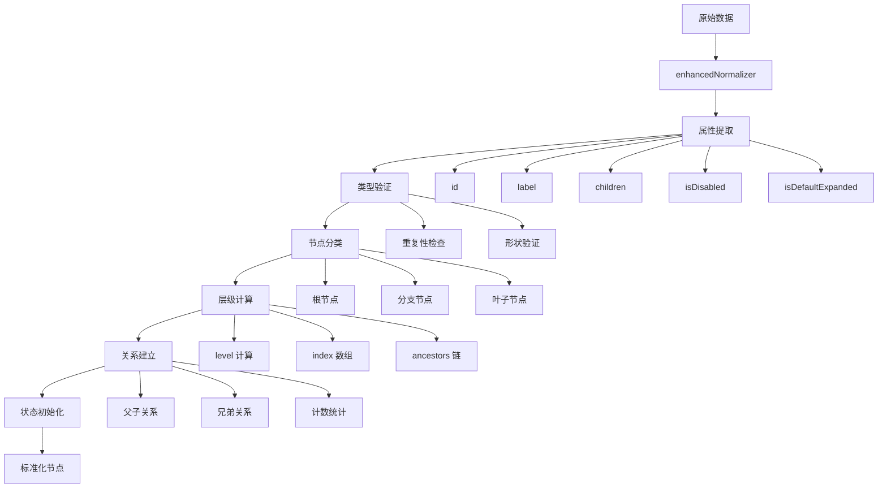
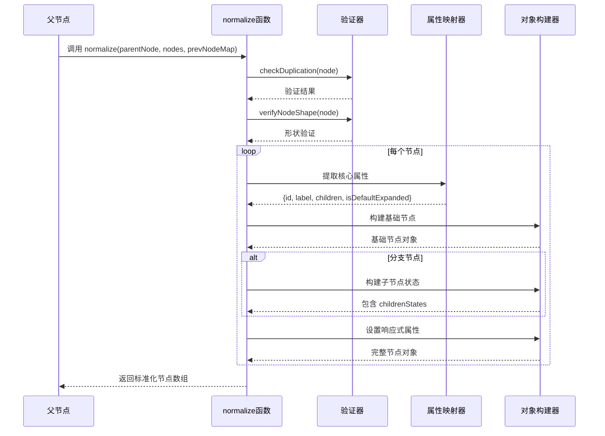

# 数据标准化

<cite>
**本文档中引用的文件**
- [src/mixins/treeselectMixin.js](file://src/mixins/treeselectMixin.js)
- [src/components/Treeselect.vue](file://src/components/Treeselect.vue)
- [src/utils/index.js](file://src/utils/index.js)
- [src/utils/identity.js](file://src/utils/identity.js)
- [src/utils/createMap.js](file://src/utils/createMap.js)
- [src/constants.js](file://src/constants.js)
- [test/unit/specs/Props.spec.js](file://test/unit/specs/Props.spec.js)
</cite>

## 目录
1. [概述](#概述)
2. [normalizer 属性介绍](#normalizer-属性介绍)
3. [数据标准化流程](#数据标准化流程)
4. [enhancedNormalizer 函数详解](#enhancednormalizer-函数详解)
5. [normalize 函数核心逻辑](#normalize-函数核心逻辑)
6. [自定义 normalizer 示例](#自定义-normalizer-示例)
7. [节点属性映射机制](#节点属性映射机制)
8. [错误处理与验证](#错误处理与验证)
9. [性能优化策略](#性能优化策略)
10. [最佳实践指南](#最佳实践指南)

## 概述

Vue TreeSelect 组件提供了一个强大的数据标准化系统，通过 `normalizer` 属性将原始树形数据转换为内部节点对象。这个系统确保了组件能够正确处理各种格式的树形数据结构，同时提供了灵活的自定义能力。

### 核心特性

- **灵活的数据转换**：支持将任意格式的原始数据转换为统一的内部节点结构
- **自动属性映射**：智能识别和映射常见的节点属性（id、label、children等）
- **类型安全验证**：内置重复性检查和节点形状验证
- **响应式更新**：保持数据的响应式特性，支持动态更新
- **性能优化**：采用多种优化策略减少不必要的计算和内存占用

## normalizer 属性介绍

`normalizer` 是一个可选的函数属性，用于自定义原始数据到内部节点对象的转换过程。

### 默认行为

当未提供 `normalizer` 函数时，组件使用默认的 `identity` 函数作为 normalizer，这意味着原始数据将被直接用作内部节点对象。

```javascript
// 默认 normalizer 实现
default: identity
```

### 函数签名

```javascript
function normalizer(rawNode, instanceId) {
  // 返回标准化后的节点对象
  return {
    id: rawNode.key,           // 必需：唯一标识符
    label: rawNode.name,       // 必需：显示文本
    children: rawNode.subitems, // 可选：子节点数组或 null
    // 其他可选属性
    isDisabled: rawNode.disabled,
    isDefaultExpanded: rawNode.expanded,
    isNew: rawNode.new,
    // 原始数据保留
    raw: rawNode
  };
}
```

**节来源**
- [src/mixins/treeselectMixin.js](file://src/mixins/treeselectMixin.js#L432-L435)

## 数据标准化流程

数据标准化是一个多步骤的过程，涉及多个阶段的转换和验证。



**图表来源**
- [src/mixins/treeselectMixin.js](file://src/mixins/treeselectMixin.js#L1532-L1537)
- [src/mixins/treeselectMixin.js](file://src/mixins/treeselectMixin.js#L1539-L1661)

## enhancedNormalizer 函数详解

`enhancedNormalizer` 是数据标准化的第一步，负责将原始数据与用户提供的 normalizer 函数结合。

### 实现原理

```javascript
enhancedNormalizer(raw) {
  return {
    ...raw,                    // 保留原始数据的所有属性
    ...this.normalizer(raw, this.getInstanceId()),  // 应用用户自定义的 normalizer
  }
}
```

### 关键特性

1. **属性合并**：使用扩展运算符合并原始数据和 normalizer 结果
2. **实例隔离**：通过 `instanceId` 参数支持多实例环境下的个性化配置
3. **完整性保护**：确保原始数据不会被意外覆盖

### 执行时机

`enhancedNormalizer` 在以下情况下被调用：
- 初始化选项列表时
- 加载子节点时  
- 处理用户选择时
- 更新现有节点时

**节来源**
- [src/mixins/treeselectMixin.js](file://src/mixins/treeselectMixin.js#L1532-L1537)

## normalize 函数核心逻辑

`normalize` 函数是数据标准化的核心，负责将标准化后的节点转换为完整的内部节点对象。

### 主要处理步骤



**图表来源**
- [src/mixins/treeselectMixin.js](file://src/mixins/treeselectMixin.js#L1539-L1661)

### 核心处理逻辑

#### 1. 属性提取与验证

```javascript
// 从标准化节点中提取核心属性
const { id, label, children, isDefaultExpanded } = node;
const isRootNode = parentNode === NO_PARENT_NODE;
const level = isRootNode ? 0 : parentNode.level + 1;
const isBranch = Array.isArray(children) || children === null;
const isLeaf = !isBranch;
const isDisabled = !!node.isDisabled || (!this.flat && !isRootNode && parentNode.isDisabled);
const isNew = !!node.isNew;
```

#### 2. 字符串化处理

```javascript
// 优化搜索性能的字符串化处理
const lowerCased = this.matchKeys.reduce((prev, key) => ({
  ...prev,
  [key]: stringifyOptionPropValue(node[key]).toLocaleLowerCase(),
}), {});
const nestedSearchLabel = isRootNode
  ? lowerCased.label
  : parentNode.nestedSearchLabel + ' ' + lowerCased.label;
```

#### 3. 节点对象构建

```javascript
// 构建基础节点对象
const normalized = {
  id,
  label,
  level,
  ancestors: isRootNode ? [] : [parentNode].concat(parentNode.ancestors),
  index: (isRootNode ? [] : parentNode.index).concat(index),
  parentNode,
  lowerCased,
  nestedSearchLabel,
  isDisabled,
  isNew,
  isBranch,
  isLeaf,
  isRootNode,
  raw,
};
```

#### 4. 分支节点特殊处理

对于分支节点，需要额外处理子节点状态：

```javascript
if (isBranch) {
  const isLoaded = Array.isArray(children);
  
  normalized.childrenStates = {
    ...createAsyncOptionsStates(),
    isLoaded,
  };
  
  this.$set(normalized, 'isExpanded', typeof isDefaultExpanded === 'boolean'
    ? isDefaultExpanded
    : level < this.defaultExpandLevel);
    
  normalized.children = isLoaded
    ? this.normalize(normalized, children, prevNodeMap)
    : [];
}
```

**节来源**
- [src/mixins/treeselectMixin.js](file://src/mixins/treeselectMixin.js#L1539-L1661)

## 自定义 normalizer 示例

以下是几种常见的自定义 normalizer 实现示例：

### 示例 1：基本属性映射

```javascript
// 将 key 和 name 映射为 id 和 label
const normalizer = node => ({
  id: node.key,
  label: node.name,
});

// 输入数据：
const rawData = {
  key: 'department_a',
  name: '研发部',
  employees: ['alice', 'bob']
};

// 输出节点：
{
  id: 'department_a',
  label: '研发部',
  raw: { key: 'department_a', name: '研发部', employees: ['alice', 'bob'] }
}
```

### 示例 2：复杂属性转换

```javascript
// 处理嵌套结构和条件属性
const normalizer = (node, instanceId) => ({
  id: `${instanceId}-${node.departmentId}`,
  label: node.fullName || node.name,
  children: node.subDepartments,
  isDisabled: node.status === 'inactive',
  isDefaultExpanded: node.autoExpand,
  isNew: node.createdAt > Date.now() - 24 * 60 * 60 * 1000,
});
```

### 示例 3：异构数据处理

```javascript
// 处理不同类型的节点
const normalizer = node => {
  if (node.type === 'folder') {
    return {
      id: node.folderId,
      label: node.title,
      children: node.contents,
      icon: 'folder',
    };
  } else if (node.type === 'file') {
    return {
      id: node.fileId,
      label: node.fileName,
      icon: 'file',
      isDisabled: node.readOnly,
    };
  }
};
```

### 示例 4：多实例环境下的个性化配置

```javascript
// 支持多实例环境下的个性化 normalizer
const normalizer = (node, instanceId) => ({
  id: `${instanceId}-${node.uniqueId}`,  // 添加实例前缀
  label: `[${instanceId}] ${node.displayName}`,
  children: node.children,
  instancePrefix: instanceId,
});
```

**节来源**
- [test/unit/specs/Props.spec.js](file://test/unit/specs/Props.spec.js#L1563-L1568)
- [test/unit/specs/Props.spec.js](file://test/unit/specs/Props.spec.js#L1586-L1589)
- [test/unit/specs/Props.spec.js](file://test/unit/specs/Props.spec.js#L1616-L1617)

## 节点属性映射机制

### 标准化属性映射表

| 原始属性 | 标准化属性 | 类型 | 描述 |
|---------|-----------|------|------|
| `id` | `id` | String | 节点唯一标识符 |
| `label` | `label` | String | 节点显示文本 |
| `children` | `children` | Array \| null | 子节点数组或 null（表示未加载） |
| `isDisabled` | `isDisabled` | Boolean | 是否禁用 |
| `isDefaultExpanded` | `isDefaultExpanded` | Boolean | 默认展开状态 |
| `isNew` | `isNew` | Boolean | 是否新创建 |

### 内部属性生成

除了直接映射的属性外，系统还会生成以下内部属性：

| 内部属性 | 类型 | 描述 |
|---------|------|------|
| `level` | Number | 节点层级（根节点为 0） |
| `ancestors` | Array | 祖先节点数组 |
| `index` | Array | 层级索引数组 |
| `isBranch` | Boolean | 是否为分支节点 |
| `isLeaf` | Boolean | 是否为叶子节点 |
| `isRootNode` | Boolean | 是否为根节点 |
| `lowerCased` | Object | 小写化的搜索属性 |
| `nestedSearchLabel` | String | 嵌套搜索标签 |
| `childrenStates` | Object | 子节点加载状态 |
| `count` | Object | 计数统计对象 |

### 计数统计机制

```javascript
// 计数统计对象结构
normalized.count = {
  [ALL_CHILDREN]: 0,        // 所有子节点数量
  [ALL_DESCENDANTS]: 0,     // 所有后代节点数量
  [LEAF_CHILDREN]: 0,       // 叶子子节点数量
  [LEAF_DESCENDANTS]: 0,    // 叶子后代节点数量
};
```

**节来源**
- [src/mixins/treeselectMixin.js](file://src/mixins/treeselectMixin.js#L1546-L1552)
- [src/mixins/treeselectMixin.js](file://src/mixins/treeselectMixin.js#L1603-L1608)

## 错误处理与验证

### 重复性检查

系统会自动检测并警告重复的节点 ID：

```javascript
checkDuplication(node) {
  warning(
    () => !((node.id in this.forest.nodeMap) && !this.forest.nodeMap[node.id].isFallbackNode),
    () => `Detected duplicate presence of node id ${JSON.stringify(node.id)}. ` +
      `Their labels are "${this.forest.nodeMap[node.id].label}" and "${node.label}" respectively.`,
  );
}
```

### 节点形状验证

系统验证节点的基本形状是否正确：

```javascript
verifyNodeShape(node) {
  warning(
    () => !(node.children === undefined && node.isBranch === true),
    () => 'Are you meant to declare an unloaded branch node? ' +
      '`isBranch: true` is no longer supported, please use `children: null` instead.',
  );
}
```

### 错误处理策略

1. **警告机制**：使用 `warning` 函数发出警告但不中断执行
2. **降级处理**：当数据不完整时，使用默认值或创建回退节点
3. **状态保持**：在数据更新时保持节点的原有状态

**节来源**
- [src/mixins/treeselectMixin.js](file://src/mixins/treeselectMixin.js#L1768-L1773)
- [src/mixins/treeselectMixin.js](file://src/mixins/treeselectMixin.js#L1776-L1781)

## 性能优化策略

### 响应式优化

系统采用多种策略优化响应式性能：

```javascript
// 优化：只对必要的属性使用 $set，其他直接赋值
const normalized = {
  id,
  label,
  level,
  // ... 其他静态属性直接赋值
};

// 需要响应式的动态属性使用 $set
this.$set(normalized, 'isMatched', false);
this.$set(normalized, 'isHighlighted', false);
```

### 内存管理

1. **对象池化**：重用节点对象以减少垃圾回收压力
2. **延迟计算**：只有在需要时才计算复杂的属性
3. **弱引用**：使用 `createMap()` 创建无原型的对象以节省内存

### 计算优化

```javascript
// 优化：分支节点优先显示
if (this.branchNodesFirst) {
  const branchNodes = normalizedOptions.filter(option => option.isBranch);
  const leafNodes = normalizedOptions.filter(option => option.isLeaf);
  normalizedOptions = branchNodes.concat(leafNodes);
}
```

### 缓存机制

系统实现了多层缓存机制：

1. **节点映射缓存**：`this.forest.nodeMap` 缓存所有节点
2. **状态缓存**：保持节点的原有状态
3. **计算结果缓存**：避免重复计算相同的值

**节来源**
- [src/mixins/treeselectMixin.js](file://src/mixins/treeselectMixin.js#L1554-L1558)
- [src/mixins/treeselectMixin.js](file://src/mixins/treeselectMixin.js#L1663-L1667)
- [src/utils/createMap.js](file://src/utils/createMap.js#L1-L2)

## 最佳实践指南

### 1. 设计原则

#### 单一职责原则
每个 normalizer 应该专注于特定的数据格式转换：

```javascript
// 好的做法：专门处理 API 数据格式
const apiNormalizer = node => ({
  id: node.id,
  label: node.name,
  children: node.children,
});

// 避免：混合多种格式的处理逻辑
const badNormalizer = node => {
  if (node.apiFormat) {
    return { id: node.id, label: node.name };
  } else if (node.customFormat) {
    return { id: node.key, label: node.title };
  }
};
```

#### 一致性原则
确保同一应用中的所有 TreeSelect 组件使用一致的 normalizer：

```javascript
// 使用工厂函数创建一致的 normalizer
function createConsistentNormalizer(instanceId) {
  return node => ({
    id: `${instanceId}-${node.uniqueId}`,
    label: node.displayName,
    children: node.subItems,
  });
}
```

### 2. 性能考虑

#### 避免昂贵操作
在 normalizer 中避免执行昂贵的操作：

```javascript
// 避免：在 normalizer 中进行复杂计算
const badNormalizer = node => ({
  id: node.id,
  label: expensiveCalculation(node.data), // 避免
});

// 推荐：在需要时再进行计算
const goodNormalizer = node => ({
  id: node.id,
  label: node.name,
  // 延迟计算
  get calculatedValue() {
    return expensiveCalculation(this.raw.data);
  },
});
```

#### 利用缓存
利用系统的缓存机制：

```javascript
const cachedNormalizer = (() => {
  const cache = new Map();
  
  return (node, instanceId) => {
    const cacheKey = `${instanceId}-${node.id}`;
    
    if (!cache.has(cacheKey)) {
      cache.set(cacheKey, {
        id: node.id,
        label: node.name,
        // 其他属性
      });
    }
    
    return cache.get(cacheKey);
  };
})();
```

### 3. 错误处理

#### 提供默认值
为可能缺失的属性提供合理的默认值：

```javascript
const robustNormalizer = node => ({
  id: node.id || `fallback-${Date.now()}`,
  label: node.name || 'Unnamed',
  children: node.children || [],
  isDisabled: !!node.disabled,
  isDefaultExpanded: !!node.expanded,
});
```

#### 数据验证
在 normalizer 中进行基本的数据验证：

```javascript
const validatedNormalizer = node => {
  if (!node.id) {
    throw new Error(`Node missing required 'id' property: ${JSON.stringify(node)}`);
  }
  
  return {
    id: node.id,
    label: node.name || node.id,
    children: Array.isArray(node.children) ? node.children : null,
  };
};
```

### 4. 测试策略

#### 单元测试
为 normalizer 编写全面的单元测试：

```javascript
describe('customNormalizer', () => {
  it('should handle basic node conversion', () => {
    const node = { key: '1', name: 'Test' };
    const result = customNormalizer(node);
    expect(result).toEqual({
      id: '1',
      label: 'Test',
      raw: node,
    });
  });
  
  it('should handle edge cases', () => {
    const node = {};
    const result = customNormalizer(node);
    expect(result.id).toBeDefined();
    expect(result.label).toBeDefined();
  });
});
```

#### 集成测试
测试 normalizer 在实际使用中的表现：

```javascript
it('should work with TreeSelect component', () => {
  const wrapper = mount(Treeselect, {
    propsData: {
      options: [{ key: '1', name: 'Test' }],
      normalizer: customNormalizer,
    },
  });
  
  expect(wrapper.vm.forest.nodeMap['1']).toBeDefined();
});
```

### 5. 迁移指南

#### 从旧版本迁移

如果从旧版本升级，注意以下变化：

```javascript
// 旧版本：使用 isBranch 标记未加载节点
const oldNormalizer = node => ({
  id: node.id,
  label: node.name,
  isBranch: true, // 表示未加载
  children: null, // 明确标记为未加载
});

// 新版本：推荐使用 children: null
const newNormalizer = node => ({
  id: node.id,
  label: node.name,
  children: null, // 清晰表示未加载状态
});
```

#### 向后兼容性

确保新旧 normalizer 的兼容性：

```javascript
const backwardCompatibleNormalizer = node => {
  // 支持旧版本的 isBranch 标记
  if (node.isBranch && !node.children) {
    return {
      id: node.id,
      label: node.name,
      children: null,
    };
  }
  
  return {
    id: node.id,
    label: node.name,
    children: node.children,
  };
};
```

通过遵循这些最佳实践，可以确保你的自定义 normalizer 既高效又可靠，同时保持良好的可维护性和扩展性。