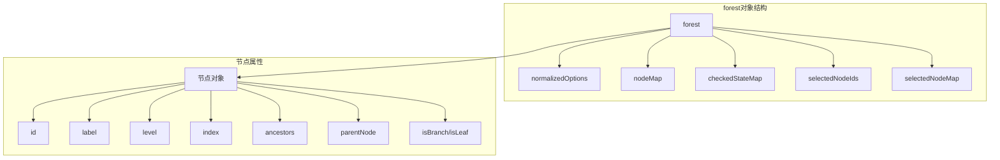

# 数据结构处理

<cite>
**本文档中引用的文件**
- [src/components/Treeselect.vue](file://src/components/Treeselect.vue)
- [src/mixins/treeselectMixin.js](file://src/mixins/treeselectMixin.js)
- [src/utils/createMap.js](file://src/utils/createMap.js)
- [src/constants.js](file://src/constants.js)
- [test/unit/specs/Selecting.spec.js](file://test/unit/specs/Selecting.spec.js)
- [test/unit/specs/Basic.spec.js](file://test/unit/specs/Basic.spec.js)
- [test/unit/specs/Props.spec.js](file://test/unit/specs/Props.spec.js)
</cite>

## 目录
1. [简介](#简介)
2. [核心数据结构概览](#核心数据结构概览)
3. [forest对象详解](#forest对象详解)
4. [节点规范化机制](#节点规范化机制)
5. [祖先关系管理](#祖先关系管理)
6. [索引系统设计](#索引系统设计)
7. [遍历算法实现](#遍历算法实现)
8. [性能优化策略](#性能优化策略)
9. [实际应用示例](#实际应用示例)
10. [总结](#总结)

## 简介

Vue TreeSelect 是一个功能强大的树形选择器组件，其内部采用了精心设计的数据结构来高效处理嵌套的树形数据。本文档深入解析了该组件的核心数据结构设计，包括 `forest` 对象中的关键映射表、节点规范化机制、祖先关系维护以及索引系统等核心技术。

## 核心数据结构概览

树形选择器的核心数据结构围绕 `forest` 对象展开，它包含了处理树形数据所需的所有关键映射表和状态信息：



**图表来源**
- [src/mixins/treeselectMixin.js](file://src/mixins/treeselectMixin.js#L678-L690)

## forest对象详解

### nodeMap - 快速查找映射

`nodeMap` 是一个以节点ID为键、节点对象为值的映射表，提供了O(1)时间复杂度的节点查找能力：

```javascript
// 创建空映射表
const createMap = () => Object.create(null)

// 在treeselectMixin中使用
this.forest.nodeMap = createMap()
```

**特性：**
- 使用 `Object.create(null)` 避免原型链查找开销
- 支持快速节点定位和访问
- 内存效率高，避免不必要的属性检查

**节来源**
- [src/mixins/treeselectMixin.js](file://src/mixins/treeselectMixin.js#L682)
- [src/utils/createMap.js](file://src/utils/createMap.js#L1-L2)

### selectedNodeMap - 选中状态映射

`selectedNodeMap` 提供了快速判断节点是否被选中的功能：

```javascript
// 选中节点时添加到映射表
this.forest.selectedNodeMap[node.id] = true

// 检查节点是否选中
const isSelected = !!this.forest.selectedNodeMap[node.id]
```

**优势：**
- O(1) 时间复杂度的选中状态查询
- 避免频繁的数组查找操作
- 内存占用小，仅存储存在的键

**节来源**
- [src/mixins/treeselectMixin.js](file://src/mixins/treeselectMixin.js#L689)

### checkedStateMap - 复杂选中状态管理

`checkedStateMap` 存储每个节点的复选框状态，支持三种状态：
- `UNCHECKED` (0) - 未选中
- `INDETERMINATE` (1) - 半选中
- `CHECKED` (2) - 全选中

```javascript
// 构建选中状态
buildForestState() {
  const checkedStateMap = createMap()
  
  if (this.multiple) {
    // 设置已选中节点为CHECKED
    this.selectedNodes.forEach(selectedNode => {
      checkedStateMap[selectedNode.id] = CHECKED
      
      // 设置祖先节点为INDETERMINATE
      if (!this.flat && !this.disableBranchNodes) {
        selectedNode.ancestors.forEach(ancestorNode => {
          if (!this.isSelected(ancestorNode)) {
            checkedStateMap[ancestorNode.id] = INDETERMINATE
          }
        })
      }
    })
  }
  
  this.forest.checkedStateMap = checkedStateMap
}
```

**节来源**
- [src/mixins/treeselectMixin.js](file://src/mixins/treeselectMixin.js#L1517-L1530)

## 节点规范化机制

### normalizer属性的作用

`normalizer` 属性是一个函数，用于将原始数据标准化为内部节点对象：

```javascript
enhancedNormalizer(raw) {
  return {
    ...raw,
    ...this.normalizer(raw, this.getInstanceId()),
  }
}
```

**标准化过程：**
1. **基础属性提取**：从原始数据中提取 `id`、`label`、`children` 等基本属性
2. **类型检测**：判断节点是分支节点还是叶子节点
3. **层级计算**：根据父节点确定当前节点的层级
4. **状态初始化**：设置初始的选中状态和可见性标志

**节来源**
- [src/mixins/treeselectMixin.js](file://src/mixins/treeselectMixin.js#L1532-L1537)

### 节点属性计算

在规范化过程中，系统会计算以下关键属性：

```javascript
const normalized = {
  id,
  label,
  level,
  ancestors: isRootNode ? [] : [parentNode].concat(parentNode.ancestors),
  index: (isRootNode ? [] : parentNode.index).concat(index),
  parentNode,
  lowerCased,
  nestedSearchLabel,
  isDisabled,
  isNew,
  isBranch,
  isLeaf,
  isRootNode,
  raw,
}
```

**关键属性说明：**

| 属性名 | 类型 | 描述 | 性能影响 |
|--------|------|------|----------|
| `level` | Number | 节点层级深度，根节点为0 | 用于排序和渲染层级 |
| `index` | Array | 节点在兄弟节点中的索引位置 | 支持精确的节点定位 |
| `ancestors` | Array | 所有祖先节点的引用列表 | 支持向上遍历和状态传播 |
| `lowerCased` | Object | 小写化的匹配属性集合 | 加速模糊搜索 |
| `nestedSearchLabel` | String | 嵌套搜索用的标签字符串 | 支持多级搜索 |

**节来源**
- [src/mixins/treeselectMixin.js](file://src/mixins/treeselectMixin.js#L1546-L1578)

## 祖先关系管理

### ancestors数组的设计

`ancestors` 数组维护了从当前节点到根节点的所有祖先节点引用：

```javascript
// 计算祖先关系
ancestors: isRootNode ? [] : [parentNode].concat(parentNode.ancestors)
```

**设计优势：**
- **向上遍历**：可以快速访问所有祖先节点
- **状态传播**：支持父子节点状态的双向同步
- **路径追踪**：便于实现复杂的选中逻辑

**使用场景：**
1. **状态继承**：子节点选中时自动设置祖先节点为半选中
2. **权限控制**：检查节点及其祖先的禁用状态
3. **搜索结果展示**：在搜索结果中显示完整路径

**节来源**
- [src/mixins/treeselectMixin.js](file://src/mixins/treeselectMixin.js#L1568)

### 祖先计数系统

每个节点都维护了对其后代节点的计数信息：

```javascript
// 更新祖先节点的计数
normalized.ancestors.forEach(ancestor => ancestor.count[ALL_DESCENDANTS]++)
if (isLeaf) normalized.ancestors.forEach(ancestor => ancestor.count[LEAF_DESCENDANTS]++)
```

**计数类型：**
- `ALL_CHILDREN`：直接子节点数量
- `ALL_DESCENDANTS`：所有后代节点数量
- `LEAF_CHILDREN`：直接叶子节点数量  
- `LEAF_DESCENDANTS`：所有叶子节点数量

**节来源**
- [src/mixins/treeselectMixin.js](file://src/mixins/treeselectMixin.js#L1627-L1628)

## 索引系统设计

### level属性的作用

`level` 属性表示节点在树中的层级深度，根节点为0：

```javascript
const level = isRootNode ? 0 : parentNode.level + 1
```

**用途：**
1. **渲染层级**：决定节点的缩进级别
2. **排序依据**：在 `sortValueBy: LEVEL` 模式下进行排序
3. **路径标识**：帮助识别节点在树中的位置

### index属性的层次化索引

`index` 属性是一个数组，记录了节点在兄弟节点中的精确位置：

```javascript
const index = (isRootNode ? [] : parentNode.index).concat(index)
```

**特点：**
- **层次化**：每个层级都有独立的索引值
- **唯一性**：确保相同层级的不同节点有不同索引
- **可比较性**：支持精确的节点排序和定位

**排序算法：**
```javascript
function sortValueByIndex(a, b) {
  let i = 0
  do {
    if (a.level < i) return -1
    if (b.level < i) return 1
    if (a.index[i] !== b.index[i]) return a.index[i] - b.index[i]
    i++
  } while (true)
}
```

**节来源**
- [src/mixins/treeselectMixin.js](file://src/mixins/treeselectMixin.js#L21-L29)

## 遍历算法实现

### traverseAllNodesByIndex

这是最常用的遍历方法，按照节点的索引顺序遍历整个树：

```javascript
traverseAllNodesByIndex(callback) {
  const traverse = node => {
    node.children.forEach(node => {
      if (callback(node) !== false && node.isBranch) {
        traverse(node)
      }
    })
  }
  
  traverse({ children: this.forest.normalizedOptions })
}
```

**特点：**
- **按序遍历**：严格按照节点的索引顺序
- **递归实现**：简洁清晰的代码结构
- **短路支持**：可以通过返回 `false` 中断遍历

### traverseDescendantsBFS

广度优先遍历，适用于需要逐层处理的场景：

```javascript
traverseDescendantsBFS(parentNode, callback) {
  if (!parentNode.isBranch) return
  
  const queue = parentNode.children.slice()
  for (let i = 0; i < queue.length; i++) {
    const node = queue[i]
    if (node.isBranch) {
      queue.push(...node.children)
    }
    callback(node)
  }
}
```

**应用场景：**
- **批量操作**：同时处理多个节点
- **状态同步**：确保父子节点状态一致
- **性能优化**：避免深层递归调用

### traverseDescendantsDFS

深度优先遍历，适用于需要完全展开树的场景：

```javascript
traverseDescendantsDFS(parentNode, callback) {
  if (parentNode.isBranch) {
    parentNode.children.forEach(child => {
      this.traverseDescendantsDFS(child, callback)
      callback(child)
    })
  }
}
```

**节来源**
- [src/mixins/treeselectMixin.js](file://src/mixins/treeselectMixin.js#L1494)
- [src/mixins/treeselectMixin.js](file://src/mixins/treeselectMixin.js#L1468)
- [src/mixins/treeselectMixin.js](file://src/mixins/treeselectMixin.js#L1479)

## 性能优化策略

### 内存优化

1. **对象池化**：重用节点对象，减少垃圾回收压力
2. **懒加载**：仅在需要时才创建和计算节点属性
3. **弱引用**：避免循环引用导致的内存泄漏

### 计算优化

1. **缓存机制**：缓存频繁访问的计算结果
2. **增量更新**：只更新发生变化的部分
3. **批量操作**：合并多个操作以减少重绘次数

### 查找优化

1. **多重映射**：使用多个映射表加速不同类型的操作
2. **索引预计算**：提前计算好所有必要的索引
3. **二分查找**：在有序数组中使用二分查找

**节来源**
- [src/mixins/treeselectMixin.js](file://src/mixins/treeselectMixin.js#L1635-L1658)

## 实际应用示例

### 基本树形结构

假设我们有以下嵌套数据结构：

```javascript
const treeData = [
  {
    id: 'a',
    label: '节点A',
    children: [
      {
        id: 'aa',
        label: '节点AA',
        children: [
          { id: 'aaa', label: '节点AAA' },
          { id: 'aab', label: '节点AAB' }
        ]
      },
      { id: 'ab', label: '节点AB' }
    ]
  },
  { id: 'b', label: '节点B' }
]
```

### 节点规范化后的结构

经过规范化后，每个节点都会包含以下关键属性：

```javascript
{
  id: 'aaa',
  label: '节点AAA',
  level: 2,
  index: [0, 0, 0],
  ancestors: [
    { id: 'aa', ... },
    { id: 'a', ... }
  ],
  parentNode: { id: 'aa', ... },
  isBranch: false,
  isLeaf: true,
  isRootNode: false,
  // ... 其他属性
}
```

### 选中状态变化示例

当用户选择节点A时，系统会自动处理以下状态变化：

```javascript
// 选中节点A
vm.select(vm.forest.nodeMap.a)

// 结果状态
expect(vm.forest.selectedNodeIds).toEqual(['a', 'aa', 'ab', 'aaa', 'aab'])
expect(vm.forest.checkedStateMap).toEqual({
  a: CHECKED,
  aa: CHECKED,
  aaa: CHECKED,
  aab: CHECKED,
  ab: CHECKED,
  b: UNCHECKED,
})
```

**节来源**
- [test/unit/specs/Selecting.spec.js](file://test/unit/specs/Selecting.spec.js#L106-L137)

## 总结

Vue TreeSelect 的数据结构设计体现了以下核心原则：

1. **高效性**：通过多重映射表和索引系统实现O(1)的查找性能
2. **灵活性**：支持多种选中模式和排序方式
3. **可扩展性**：模块化的设计便于功能扩展
4. **稳定性**：完善的错误处理和边界情况处理

这种设计使得树形选择器能够高效处理大规模的树形数据，同时保持良好的用户体验。通过深入理解这些数据结构的设计原理，开发者可以更好地利用该组件的功能，并在必要时进行定制化开发。