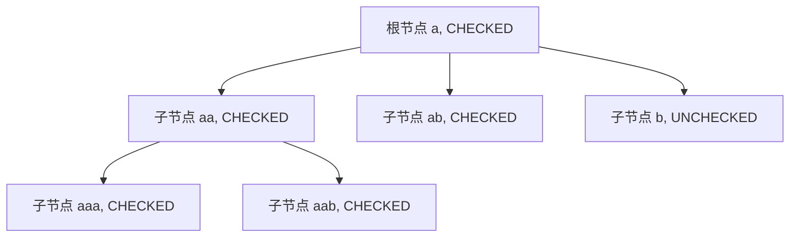

# 节点关系维护

<cite>
**本文档引用文件**   
- [Treeselect.vue](file://src/components/Treeselect.vue)
- [treeselectMixin.js](file://src/mixins/treeselectMixin.js)
- [constants.js](file://src/constants.js)
- [Basic.spec.js](file://test/unit/specs/Basic.spec.js)
- [Selecting.spec.js](file://test/unit/specs/Selecting.spec.js)
</cite>

## 目录
1. [引言](#引言)
2. [祖先链的构建与维护](#祖先链的构建与维护)
3. [层级与索引的精确定位机制](#层级与索引的精确定位机制)
4. [树形结构遍历中的祖先关系更新](#树形结构遍历中的祖先关系更新)
5. [祖先关系在搜索与展开/折叠中的应用](#祖先关系在搜索与展开/折叠中的应用)
6. [结论](#结论)

## 引言
在 Vue TreeSelect 组件中，节点关系的维护是实现高效树形结构操作的核心。通过 `ancestors` 数组、`level` 和 `index` 属性，组件能够精确地追踪每个节点在树中的位置和层级关系。这些机制不仅支持节点的选择与反选，还在搜索、展开/折叠等操作中发挥着关键作用。本文将深入解析这些机制的实现原理和应用。

## 祖先链的构建与维护

在 Vue TreeSelect 组件中，`ancestors` 数组用于维护从根节点到当前节点的祖先链。每个节点的 `ancestors` 数组包含其所有祖先节点的引用，按从当前节点到根节点的顺序排列。这一机制在节点初始化时通过 `normalize` 方法构建。

当一个节点被创建时，其 `ancestors` 数组通过递归地将父节点及其祖先节点添加到数组中来构建。例如，如果节点 `aaa` 的父节点是 `aa`，而 `aa` 的父节点是 `a`，那么 `aaa` 的 `ancestors` 数组将包含 `[aa, a]`。这种设计使得在进行节点选择或反选操作时，可以快速访问并更新所有相关祖先节点的状态。

```mermaid
graph TD
A[根节点 a] --> B[子节点 aa]
B --> C[子节点 aaa]
C --> D[ancestors: [aa, a]]
B --> E[ancestors: [a]]
A --> F[ancestors: []]
```

**图示来源**
- [treeselectMixin.js](file://src/mixins/treeselectMixin.js#L1568-L1569)

**本节来源**
- [treeselectMixin.js](file://src/mixins/treeselectMixin.js#L1568-L1569)
- [Basic.spec.js](file://test/unit/specs/Basic.spec.js#L379-L381)

## 层级与索引的精确定位机制

`level` 和 `index` 属性共同实现了节点的精确定位。`level` 表示节点在树中的深度，根节点的 `level` 为 0，每向下一层，`level` 增加 1。`index` 是一个数组，表示从根节点到当前节点的路径索引。例如，节点 `aaa` 的 `index` 可能是 `[0, 0, 0]`，表示它位于根节点的第一个子节点的第一个子节点的第一个子节点。

这些属性在 `normalize` 方法中计算并赋值。`level` 通过递归地增加父节点的 `level` 来确定，而 `index` 则通过将父节点的 `index` 数组与当前节点在其父节点子节点列表中的索引拼接而成。这种设计使得节点可以在树中被唯一标识，并且支持高效的排序和查找操作。

```mermaid
graph TD
A[根节点 a, level: 0, index: [0]] --> B[子节点 aa, level: 1, index: [0, 0]]
B --> C[子节点 aaa, level: 2, index: [0, 0, 0]]
A --> D[子节点 ab, level: 1, index: [0, 1]]
A --> E[子节点 b, level: 0, index: [1]]
```

**图示来源**
- [treeselectMixin.js](file://src/mixins/treeselectMixin.js#L1569-L1570)
- [Basic.spec.js](file://test/unit/specs/Basic.spec.js#L425-L432)

**本节来源**
- [treeselectMixin.js](file://src/mixins/treeselectMixin.js#L1569-L1570)
- [Basic.spec.js](file://test/unit/specs/Basic.spec.js#L425-L432)

## 树形结构遍历中的祖先关系更新

在树形结构遍历时，祖先关系的更新逻辑确保了节点状态的一致性。当一个节点被选择或反选时，其所有祖先节点的状态也会相应更新。这一过程通过 `buildForestState` 方法实现。

`buildForestState` 方法遍历所有选中的节点，并更新其祖先节点的 `checkedStateMap`。如果一个节点的所有子节点都被选中，则该节点的状态变为 `CHECKED`；如果部分子节点被选中，则状态变为 `INDETERMINATE`；如果没有任何子节点被选中，则状态为 `UNCHECKED`。这种机制确保了树形结构的视觉一致性，使用户能够直观地看到哪些分支被完全选中、部分选中或未选中。



**图示来源**
- [treeselectMixin.js](file://src/mixins/treeselectMixin.js#L1517-L1527)
- [Selecting.spec.js](file://test/unit/specs/Selecting.spec.js#L122-L137)

**本节来源**
- [treeselectMixin.js](file://src/mixins/treeselectMixin.js#L1517-L1527)
- [Selecting.spec.js](file://test/unit/specs/Selecting.spec.js#L122-L137)

## 祖先关系在搜索与展开/折叠中的应用

祖先关系在搜索和展开/折叠操作中也发挥着重要作用。在搜索模式下，`ancestors` 数组用于确定哪些节点应该被包含在搜索结果中。如果一个节点的祖先节点匹配搜索条件，即使该节点本身不匹配，它也可能被包含在结果中，以保持树形结构的完整性。

在展开/折叠操作中，`ancestors` 数组帮助确定哪些节点应该被展开。例如，当用户展开一个节点时，其所有祖先节点的状态会被更新，以反映新的展开状态。此外，`index` 属性用于在虚拟滚动中精确计算节点的位置，确保用户界面的流畅性和响应性。

```mermaid
graph TD
A[搜索 "a"] --> B[匹配节点 a]
B --> C[显示 a 的所有子节点]
C --> D[展开 aa]
D --> E[显示 aaa 和 aab]
C --> F[展开 ab]
F --> G[显示 ab]
```

**图示来源**
- [treeselectMixin.js](file://src/mixins/treeselectMixin.js#L1262-L1263)
- [Selecting.spec.js](file://test/unit/specs/Selecting.spec.js#L875-L943)

**本节来源**
- [treeselectMixin.js](file://src/mixins/treeselectMixin.js#L1262-L1263)
- [Selecting.spec.js](file://test/unit/specs/Selecting.spec.js#L875-L943)

## 结论
通过 `ancestors` 数组、`level` 和 `index` 属性，Vue TreeSelect 组件实现了高效的节点关系维护。这些机制不仅支持复杂的树形结构操作，还确保了用户界面的直观性和响应性。理解这些机制的实现原理，有助于开发者更好地利用和扩展该组件，以满足各种应用场景的需求。