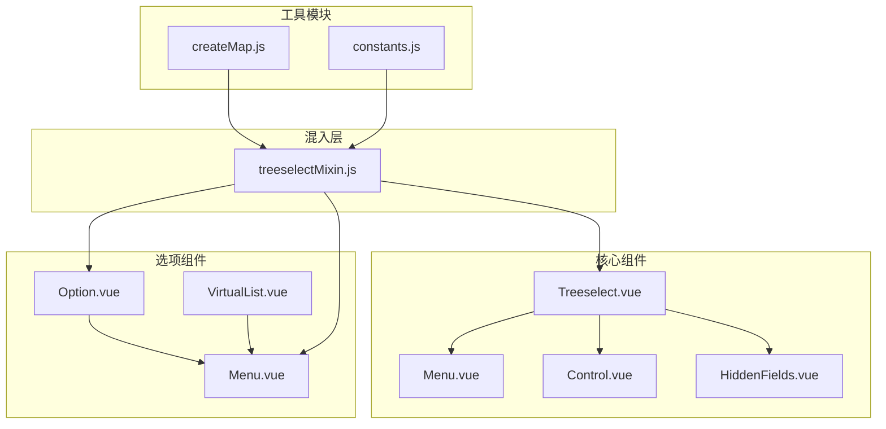
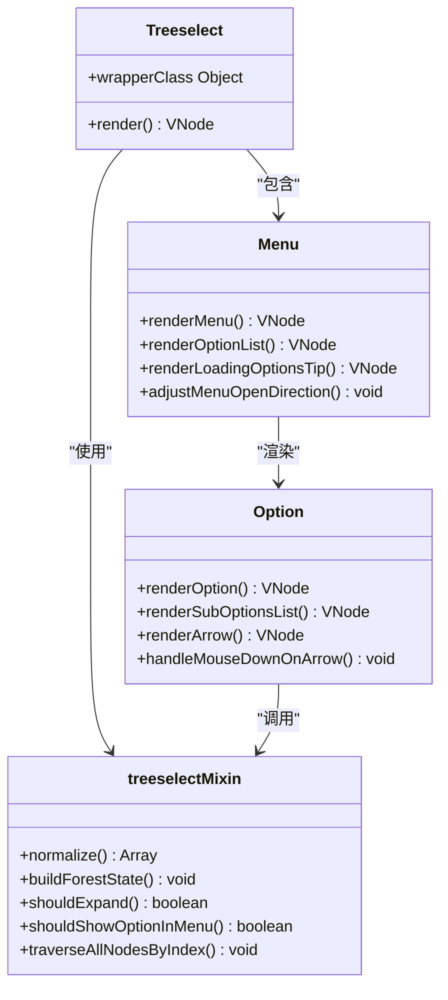
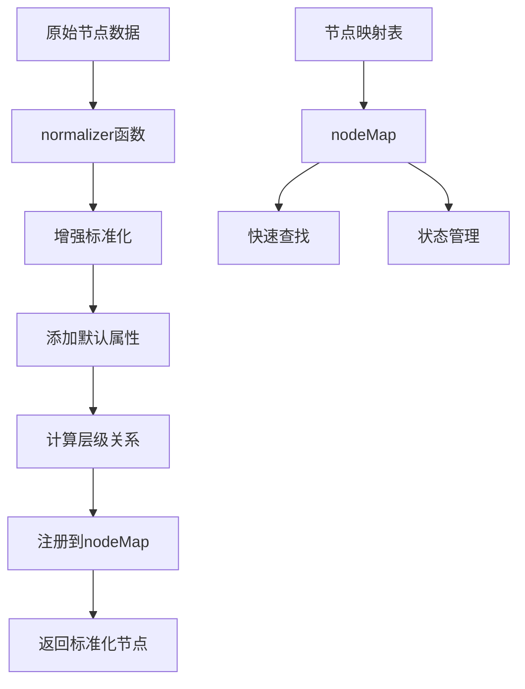
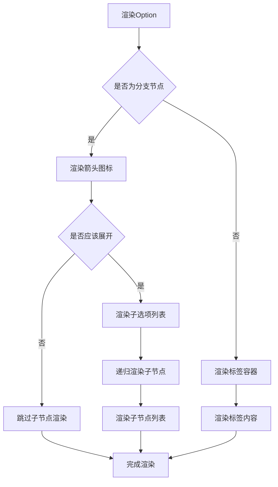
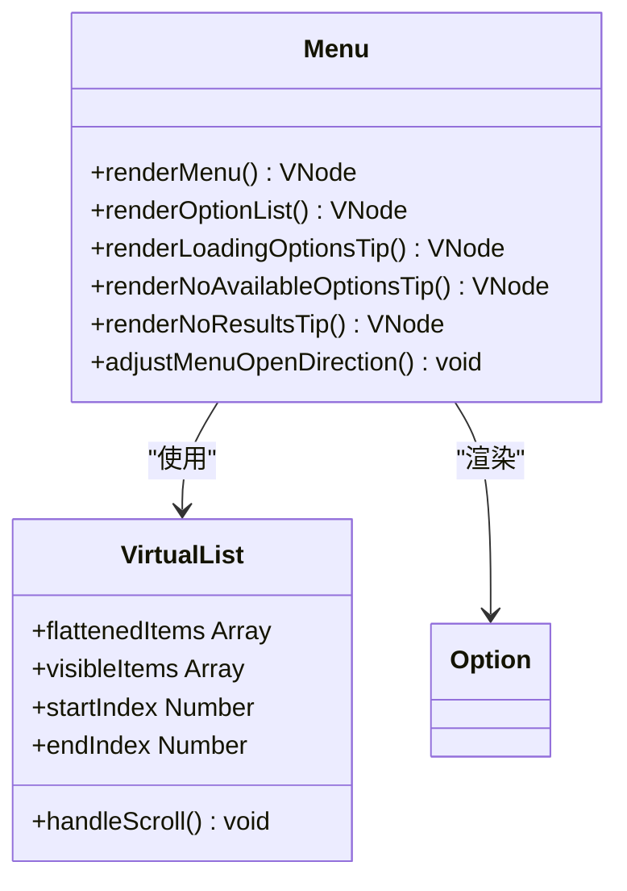
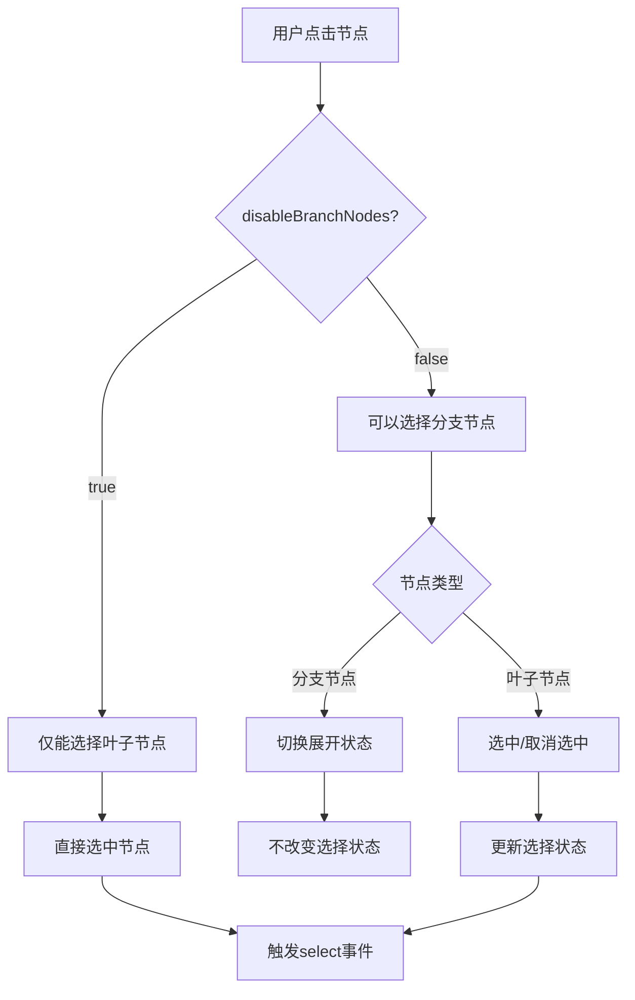
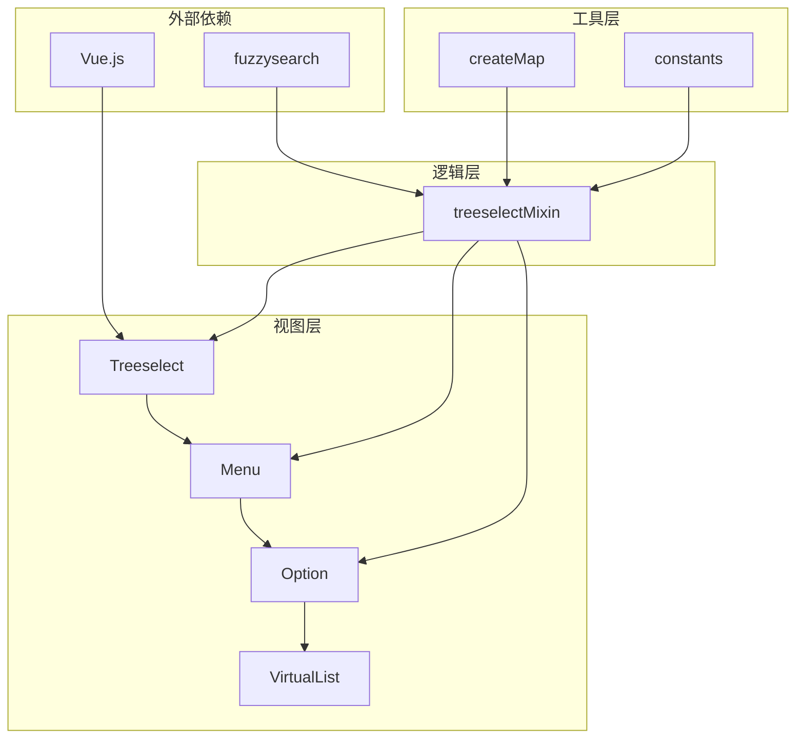

# 树形结构

<cite>
**本文档中引用的文件**
- [Treeselect.vue](file://src/components/Treeselect.vue)
- [Option.vue](file://src/components/Option.vue)
- [Menu.vue](file://src/components/Menu.vue)
- [treeselectMixin.js](file://src/mixins/treeselectMixin.js)
- [createMap.js](file://src/utils/createMap.js)
- [constants.js](file://src/constants.js)
</cite>

## 目录
1. [简介](#简介)
2. [项目结构](#项目结构)
3. [核心组件](#核心组件)
4. [架构概览](#架构概览)
5. [详细组件分析](#详细组件分析)
6. [依赖关系分析](#依赖关系分析)
7. [性能考虑](#性能考虑)
8. [故障排除指南](#故障排除指南)
9. [结论](#结论)

## 简介

Vue TreeSelect Next 是一个功能强大的 Vue.js 树形结构选择器组件，提供了完整的树形数据展示和交互功能。该组件支持嵌套选项的递归渲染、分支节点的展开控制、层级缩进处理等核心功能，同时具备高性能的数据标准化和状态管理机制。

## 项目结构

该项目采用模块化架构设计，主要包含以下核心模块：



**图表来源**
- [Treeselect.vue](file://src/components/Treeselect.vue#L1-L42)
- [Menu.vue](file://src/components/Menu.vue#L1-L331)
- [Option.vue](file://src/components/Option.vue#L1-L311)

**章节来源**
- [Treeselect.vue](file://src/components/Treeselect.vue#L1-L42)
- [Menu.vue](file://src/components/Menu.vue#L1-L331)
- [Option.vue](file://src/components/Option.vue#L1-L311)

## 核心组件

### Treeselect 主组件

Treeselect 组件作为整个树形结构的选择器入口点，负责协调各个子组件的工作。它通过提供者模式向子组件注入实例上下文，确保组件间的数据共享和通信。

### Menu 菜单组件

Menu 组件管理选项列表的展示逻辑，支持本地搜索、异步搜索和虚拟滚动等多种渲染模式。它根据不同的搜索状态和数据加载情况，智能地选择合适的渲染策略。

### Option 选项组件

Option 组件是树形结构中最基础的渲染单元，负责单个节点的显示和交互。它实现了复杂的递归渲染逻辑，能够正确处理分支节点和叶子节点的不同展示需求。

**章节来源**
- [Treeselect.vue](file://src/components/Treeselect.vue#L8-L42)
- [Menu.vue](file://src/components/Menu.vue#L15-L331)
- [Option.vue](file://src/components/Option.vue#L9-L311)

## 架构概览

系统采用分层架构设计，通过混入模式实现功能复用：



**图表来源**
- [Treeselect.vue](file://src/components/Treeselect.vue#L8-L42)
- [Menu.vue](file://src/components/Menu.vue#L15-L331)
- [Option.vue](file://src/components/Option.vue#L9-L311)
- [treeselectMixin.js](file://src/mixins/treeselectMixin.js#L64-L1984)

## 详细组件分析

### 数据标准化与节点映射

`normalizer` 属性在数据标准化过程中扮演着关键角色。它允许用户自定义节点数据的处理逻辑，确保输入数据能够被正确转换为组件内部使用的标准格式。



**图表来源**
- [treeselectMixin.js](file://src/mixins/treeselectMixin.js#L1532-L1669)
- [createMap.js](file://src/utils/createMap.js#L1-L2)

#### normalize 方法详解

normalize 方法是树形结构数据处理的核心，它负责将原始数据转换为组件可识别的标准格式：

1. **数据验证与预处理**：检查节点数据的完整性和有效性
2. **属性增强**：添加必要的默认属性和计算属性
3. **层级关系构建**：计算节点的层级深度和祖先链
4. **状态初始化**：设置节点的初始状态标志
5. **递归处理**：对分支节点的子节点进行递归标准化

**章节来源**
- [treeselectMixin.js](file://src/mixins/treeselectMixin.js#L1532-L1669)

### 分支节点展开控制策略

分支节点的展开控制是树形结构的核心功能之一，通过 `shouldExpand` 计算属性实现智能的展开逻辑：

```mermaid
sequenceDiagram
participant User as 用户
participant Option as Option组件
participant Mixin as treeselectMixin
participant State as 状态管理
User->>Option : 点击箭头图标
Option->>Mixin : toggleExpanded(node)
Mixin->>State : 更新节点展开状态
State->>Mixin : 触发重新渲染
Mixin->>Option : shouldExpand计算新状态
Option->>Option : 渲染子节点列表
```

**图表来源**
- [Option.vue](file://src/components/Option.vue#L256-L262)
- [treeselectMixin.js](file://src/mixins/treeselectMixin.js#L1489-L1502)

#### 展开状态管理

展开状态的管理涉及多个层面：

1. **本地搜索状态**：在搜索模式下，节点的展开状态独立于正常状态
2. **持久化状态**：通过 `isExpanded` 和 `isExpandedOnSearch` 分别管理不同场景下的状态
3. **异步加载触发**：当节点首次展开且未加载子节点时，自动触发数据加载

**章节来源**
- [treeselectMixin.js](file://src/mixins/treeselectMixin.js#L1357-L1359)
- [Option.vue](file://src/components/Option.vue#L256-L262)

### 层级缩进处理机制

层级缩进通过 CSS 类名动态生成实现，每个节点的缩进级别与其在树中的深度成正比：

```mermaid
flowchart LR
A[节点层级] --> B[level属性]
B --> C[CSS类名生成]
C --> D[vue-treeselect__indent-level-{level}]
D --> E[样式应用]
F[扁平模式] --> G[level=0]
G --> H[无缩进效果]
```

**图表来源**
- [Option.vue](file://src/components/Option.vue#L284-L288)

#### 缩进计算逻辑

缩进级别的计算遵循以下规则：
- 根节点层级为 0
- 子节点的层级等于父节点层级加 1
- 扁平模式下所有节点统一为层级 0

**章节来源**
- [Option.vue](file://src/components/Option.vue#L284-L288)

### Option 组件递归渲染机制

Option 组件实现了复杂的递归渲染逻辑，能够正确处理嵌套的树形结构：



**图表来源**
- [Option.vue](file://src/components/Option.vue#L35-L304)

#### 虚拟滚动集成

对于大数据集，系统集成了虚拟滚动功能以提升性能：

1. **虚拟列表检测**：通过 `virtualScroll` 属性判断是否启用虚拟滚动
2. **可见区域计算**：计算当前可视区域内的节点范围
3. **动态渲染**：只渲染可见区域内的节点，隐藏节点保持占位符
4. **滚动事件处理**：监听滚动事件，动态更新可见节点列表

**章节来源**
- [Option.vue](file://src/components/Option.vue#L59-L76)
- [Menu.vue](file://src/components/Menu.vue#L161-L176)

### Menu 组件选项列表管理

Menu 组件负责管理整个选项列表的渲染和交互：



**图表来源**
- [Menu.vue](file://src/components/Menu.vue#L74-L331)

#### 搜索模式处理

Menu 组件根据不同搜索模式渲染相应的提示信息：

1. **本地搜索**：实时过滤选项，显示匹配结果
2. **异步搜索**：发送远程请求获取搜索结果
3. **无结果处理**：显示"无结果"提示
4. **加载状态**：显示加载中或错误状态

**章节来源**
- [Menu.vue](file://src/components/Menu.vue#L110-L176)

### `disableBranchNodes` 对分支节点选择行为的影响

`disableBranchNodes` 属性控制分支节点的选择行为：



**图表来源**
- [Option.vue](file://src/components/Option.vue#L265-L272)
- [treeselectMixin.js](file://src/mixins/treeselectMixin.js#L1841-L1842)

#### 选择行为差异

- **启用分支节点禁用**：分支节点只能用于导航，不能直接选中
- **禁用分支节点禁用**：分支节点既不能选中也不能展开，只能查看其子节点

**章节来源**
- [Option.vue](file://src/components/Option.vue#L265-L272)
- [treeselectMixin.js](file://src/mixins/treeselectMixin.js#L1841-L1842)

### 内部数据结构设计原理

#### nodeMap 设计

nodeMap 是一个高效的节点查找映射表，采用 `Object.create(null)` 创建，避免原型链查找开销：

```javascript
// 性能优势：
// 1. 避免原型链查找
// 2. 不会受到 Object.prototype 修改的影响
// 3. 内存占用更小
const nodeMap = createMap()
```

#### ancestors 层级关系

每个节点都维护了一个祖先节点数组，用于快速访问父级路径：

```mermaid
graph TD
A[根节点] --> B[分支节点1]
A --> C[分支节点2]
B --> D[叶子节点1]
B --> E[叶子节点2]
C --> F[叶子节点3]
G[节点D] --> H[D.ancestors = [B, A]]
I[节点E] --> J[E.ancestors = [B, A]]
K[节点F] --> L[F.ancestors = [C, A]]
```

**图表来源**
- [treeselectMixin.js](file://src/mixins/treeselectMixin.js#L1568-L1569)

**章节来源**
- [createMap.js](file://src/utils/createMap.js#L1-L2)
- [treeselectMixin.js](file://src/mixins/treeselectMixin.js#L1568-L1569)

## 依赖关系分析

系统的依赖关系呈现清晰的层次结构：



**图表来源**
- [Treeselect.vue](file://src/components/Treeselect.vue#L2-L6)
- [treeselectMixin.js](file://src/mixins/treeselectMixin.js#L1-L11)

### 性能优化策略

1. **响应式数据优化**：使用 `$set` 方法精确控制响应式更新
2. **渲染优化**：通过 `shouldShow` 计算属性避免不必要的渲染
3. **内存管理**：及时清理事件监听器和定时器
4. **懒加载**：按需加载子节点数据

**章节来源**
- [treeselectMixin.js](file://src/mixins/treeselectMixin.js#L1584-L1657)

## 性能考虑

### 大数据集处理

对于大型树形结构，系统提供了多种性能优化策略：

1. **虚拟滚动**：只渲染可视区域内的节点
2. **懒加载**：分支节点的子节点按需加载
3. **搜索优化**：使用防抖函数优化搜索性能
4. **状态缓存**：缓存搜索结果和节点状态

### 内存使用优化

1. **弱引用**：避免循环引用导致的内存泄漏
2. **及时清理**：组件销毁时清理相关资源
3. **数据压缩**：合理使用数据结构减少内存占用

## 故障排除指南

### 常见问题及解决方案

1. **节点无法展开**
   - 检查 `loadOptions` 是否正确配置
   - 确认分支节点的 `children` 属性设置

2. **搜索结果不准确**
   - 验证 `matchKeys` 配置是否正确
   - 检查 `normalizer` 函数是否影响了搜索字段

3. **性能问题**
   - 启用虚拟滚动处理大数据集
   - 优化 `normalizer` 函数的执行效率

**章节来源**
- [treeselectMixin.js](file://src/mixins/treeselectMixin.js#L1672-L1730)

## 结论

Vue TreeSelect Next 提供了一个功能完整、性能优异的树形结构选择器解决方案。通过精心设计的架构和优化策略，它能够满足各种复杂场景的需求，从简单的单选到复杂的多选和搜索功能。组件的模块化设计使其易于扩展和定制，而完善的性能优化机制确保了在处理大规模数据时的流畅体验。