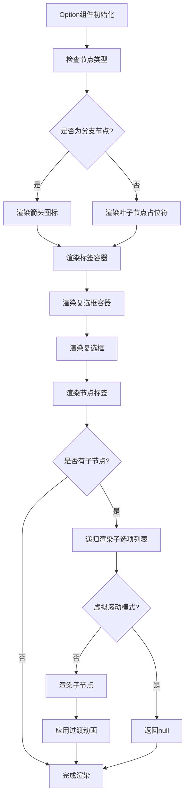
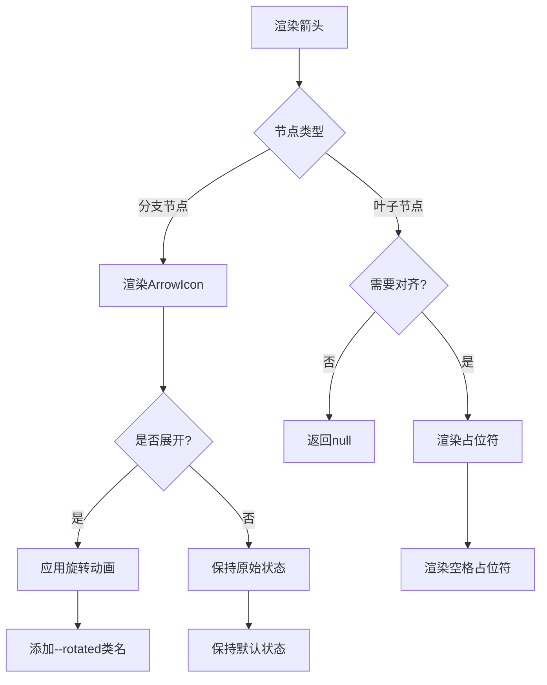
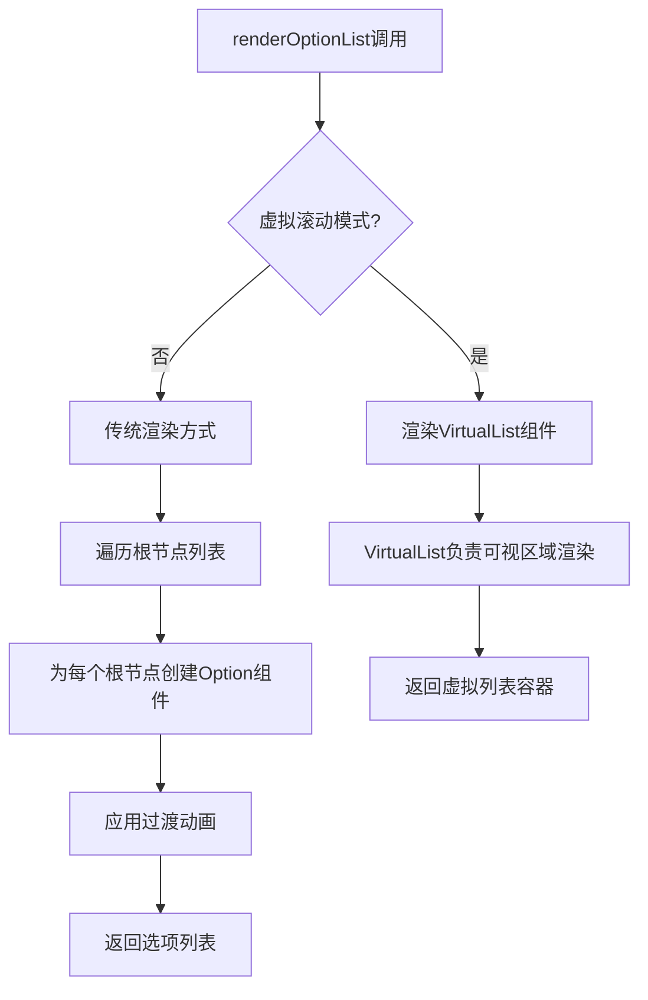
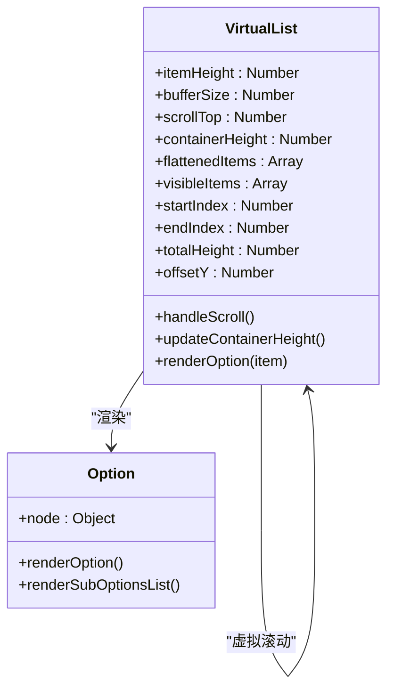
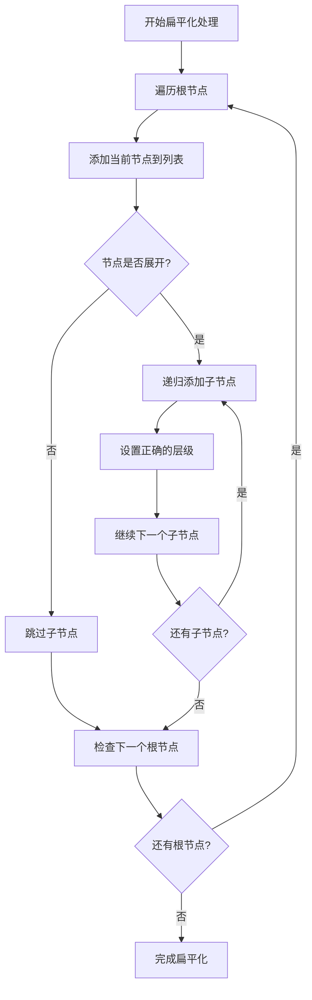
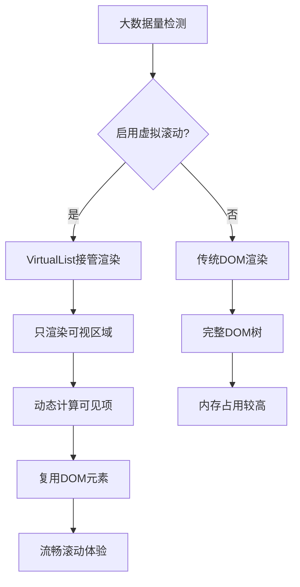

# 渲染机制

<cite>
**本文档引用的文件**
- [Option.vue](file://src/components/Option.vue)
- [Menu.vue](file://src/components/Menu.vue)
- [VirtualList.vue](file://src/components/VirtualList.vue)
- [treeselectMixin.js](file://src/mixins/treeselectMixin.js)
- [constants.js](file://src/constants.js)
- [Treeselect.vue](file://src/components/Treeselect.vue)
</cite>

## 目录
1. [概述](#概述)
2. [Option组件的递归渲染机制](#option组件的递归渲染机制)
3. [Menu组件的协调作用](#menu组件的协调作用)
4. [虚拟滚动模式下的协作机制](#虚拟滚动模式下的协作机制)
5. [CSS类名的动态绑定机制](#css类名的动态绑定机制)
6. [Scoped Slots自定义渲染](#scoped-slots自定义渲染)
7. [性能优化策略](#性能优化策略)
8. [总结](#总结)

## 概述

Vue Treeselect组件库采用了复杂的渲染机制来处理树形结构的数据展示。核心机制包括递归渲染Option组件、Menu组件的协调管理、虚拟滚动优化以及灵活的CSS类名绑定系统。这些机制共同实现了高效、可扩展的树形选择器组件。

## Option组件的递归渲染机制

### 核心渲染流程

Option组件是树形结构渲染的核心，它通过递归机制处理嵌套的树形选项。



**图表来源**
- [Option.vue](file://src/components/Option.vue#L35-L304)

### 节点标签渲染逻辑

Option组件的标签渲染遵循以下优先级顺序：

1. **自定义标签渲染器**：如果提供了`$scopedSlots['option-label']`，则使用自定义渲染函数
2. **默认标签渲染**：显示节点的`label`属性
3. **计数显示**：当启用`showCount`时，显示匹配的子节点数量

### 复选框状态管理

复选框的状态通过以下条件确定：
- **未选中**：`UNCHECKED` - 节点未被选中
- **选中**：`CHECKED` - 节点及其所有子节点都被选中
- **半选中**：`INDETERMINATE` - 部分子节点被选中

### 箭头图标渲染机制

箭头图标用于指示分支节点的展开状态：



**图表来源**
- [Option.vue](file://src/components/Option.vue#L79-L117)

**章节来源**
- [Option.vue](file://src/components/Option.vue#L35-L304)

## Menu组件的协调作用

### renderOptionList方法

Menu组件的`renderOptionList`方法是协调选项列表展示的核心方法，它根据不同的场景选择合适的渲染策略：



**图表来源**
- [Menu.vue](file://src/components/Menu.vue#L161-L176)

### 不同场景的菜单渲染

Menu组件根据不同场景渲染相应的菜单内层：

| 场景 | 方法 | 描述 |
|------|------|------|
| 正常模式 | `renderNormalMenuInner()` | 显示所有可用选项 |
| 本地搜索 | `renderLocalSearchMenuInner()` | 显示搜索结果 |
| 异步搜索 | `renderAsyncSearchMenuInner()` | 显示远程搜索结果 |
| 加载状态 | `renderLoadingOptionsTip()` | 显示加载提示 |
| 错误状态 | `renderLoadingRootOptionsErrorTip()` | 显示错误提示 |

### 菜单状态管理

Menu组件维护以下关键状态：
- **打开状态**：控制菜单的显示与隐藏
- **高亮选项**：跟踪当前鼠标悬停或键盘导航的选项
- **滚动位置**：保存关闭前的滚动位置以便恢复
- **排列方向**：自动调整菜单的显示方向以适应屏幕空间

**章节来源**
- [Menu.vue](file://src/components/Menu.vue#L74-L176)

## 虚拟滚动模式下的协作机制

### VirtualList组件架构

VirtualList组件专门处理大数据量的树形选择器渲染，采用虚拟滚动技术只渲染可视区域的内容：



**图表来源**
- [VirtualList.vue](file://src/components/VirtualList.vue#L9-L231)

### 数据扁平化处理

VirtualList通过递归遍历树结构将其转换为扁平化的选项列表：



**图表来源**
- [VirtualList.vue](file://src/components/VirtualList.vue#L38-L67)

### 视口计算算法

VirtualList使用精确的算法计算可视区域的选项：

1. **可见数量计算**：`Math.ceil(containerHeight / itemHeight)`
2. **起始索引**：`Math.floor(scrollTop / itemHeight) - bufferSize`
3. **结束索引**：`startIndex + visibleCount + bufferSize * 2`
4. **偏移量计算**：`startIndex * itemHeight`

### 与Option组件的协作

VirtualList通过以下方式与Option组件协作：
- **传递节点数据**：将扁平化后的节点对象传递给Option组件
- **控制渲染时机**：只渲染可视区域内的选项
- **处理滚动事件**：实时更新可视区域并重新渲染

**章节来源**
- [VirtualList.vue](file://src/components/VirtualList.vue#L38-L231)

## CSS类名的动态绑定机制

### 主要CSS类名系统

Vue Treeselect使用一套完整的CSS类名系统来反映节点的各种状态：

| 类名 | 条件 | 效果 |
|------|------|------|
| `vue-treeselect__option--selected` | `instance.isSelected(node)` | 标记已选中的选项 |
| `vue-treeselect__option--highlight` | `node.isHighlighted` | 高亮当前选中选项 |
| `vue-treeselect__option--disabled` | `node.isDisabled` | 禁用状态样式 |
| `vue-treeselect__option--matched` | `instance.localSearch.active && node.isMatched` | 搜索匹配样式 |
| `vue-treeselect__option--hide` | `!this.shouldShow` | 隐藏非可见选项 |

### 状态类名的组合规则

Option组件的CSS类名通过计算属性动态生成：

```javascript
const optionClass = {
  'vue-treeselect__option': true,
  'vue-treeselect__option--disabled': node.isDisabled,
  'vue-treeselect__option--selected': instance.isSelected(node),
  'vue-treeselect__option--highlight': node.isHighlighted,
  'vue-treeselect__option--matched': instance.localSearch.active && node.isMatched,
  'vue-treeselect__option--hide': !this.shouldShow,
}
```

### 层级缩进系统

为了支持树形结构的视觉层次，组件使用层级类名：

```javascript
const indentLevel = this.instance.shouldFlattenOptions ? 0 : node.level
const listItemClass = {
  'vue-treeselect__list-item': true,
  [`vue-treeselect__indent-level-${indentLevel}`]: true,
}
```

### 状态切换动画

CSS类名还控制各种状态切换的动画效果：
- **选中状态**：平滑的颜色过渡
- **高亮状态**：背景色变化
- **展开/折叠**：箭头旋转动画
- **搜索匹配**：渐变高亮效果

**章节来源**
- [Option.vue](file://src/components/Option.vue#L37-L44)

## Scoped Slots自定义渲染

### 自定义选项标签

通过`option-label`作用域插槽，用户可以完全自定义选项标签的渲染：

```javascript
// 示例：自定义标签渲染
{
  $scopedSlots: {
    'option-label': ({ node, shouldShowCount, count, labelClassName, countClassName }) => (
      <label class={labelClassName}>
        {node.isBranch ? '📁' : '📄'} {node.label}
        {shouldShowCount && (
          <span class={countClassName}>({count})</span>
        )}
      </label>
    )
  }
}
```

### 自定义列表前后内容

Menu组件提供了两个作用域插槽用于自定义列表的前后内容：

| 插槽名称 | 用途 | 参数 |
|----------|------|------|
| `before-list` | 列表上方的自定义内容 | 无 |
| `after-list` | 列表下方的自定义内容 | 无 |

### 插槽参数详解

每个作用域插槽接收特定的参数集合：

```javascript
// option-label插槽参数
{
  node,                    // 当前节点对象
  shouldShowCount,         // 是否应该显示计数
  count,                   // 匹配的子节点数量
  labelClassName,          // 标签容器的CSS类名
  countClassName          // 计数文本的CSS类名
}

// before-list/after-list插槽参数
{
  // 这些插槽通常不需要参数
  // 返回自定义的HTML内容即可
}
```

### 实际应用场景

1. **图标增强**：为不同类型的节点添加图标
2. **状态指示**：显示额外的状态信息
3. **分组标题**：在选项间添加分组标题
4. **操作按钮**：为选项添加额外的操作按钮
5. **统计信息**：显示节点相关的统计数据

**章节来源**
- [Menu.vue](file://src/components/Menu.vue#L92-L107)
- [Option.vue](file://src/components/Option.vue#L181-L189)

## 性能优化策略

### 虚拟滚动优化

对于大数据量场景，组件采用虚拟滚动技术：



**图表来源**
- [VirtualList.vue](file://src/components/VirtualList.vue#L161-L180)

### 渲染优化技巧

1. **条件渲染**：使用`shouldShow`计算属性避免不必要的渲染
2. **懒加载**：子节点仅在展开时才渲染
3. **缓存机制**：缓存计算结果避免重复计算
4. **事件委托**：减少事件监听器的数量

### 内存管理

- **组件销毁**：正确清理事件监听器和定时器
- **数据清理**：及时释放不再使用的数据引用
- **DOM优化**：避免创建过多的DOM元素

**章节来源**
- [VirtualList.vue](file://src/components/VirtualList.vue#L143-L180)

## 总结

Vue Treeselect的渲染机制体现了现代前端框架的最佳实践：

1. **递归渲染**：通过Option组件实现树形结构的优雅渲染
2. **模块化设计**：Menu组件负责协调，VirtualList专注性能优化
3. **动态绑定**：灵活的CSS类名系统反映节点状态
4. **可扩展性**：Scoped Slots提供强大的自定义能力
5. **性能优先**：虚拟滚动等技术确保大数据量场景的流畅体验

这套渲染机制不仅保证了功能的完整性，还兼顾了性能和用户体验，为开发者提供了一个强大而易用的树形选择器解决方案。