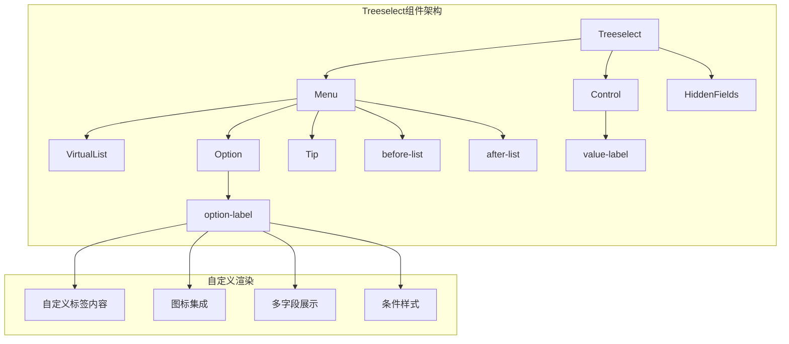

# 自定义渲染

<cite>
**本文档中引用的文件**
- [Option.vue](file://src/components/Option.vue)
- [Treeselect.vue](file://src/components/Treeselect.vue)
- [VirtualList.vue](file://src/components/VirtualList.vue)
- [Menu.vue](file://src/components/Menu.vue)
- [SingleValue.vue](file://src/components/SingleValue.vue)
- [MultiValue.vue](file://src/components/MultiValue.vue)
- [treeselectMixin.js](file://src/mixins/treeselectMixin.js)
- [Slots.spec.js](file://test/unit/specs/Slots.spec.js)
- [CustomizeOptionLabel.vue](file://docs/components/CustomizeOptionLabel.vue)
- [CustomizeValueLabel.vue](file://docs/components/CustomizeValueLabel.vue)
- [DocSlots.vue](file://docs/components/DocSlots.vue)
- [LargeDataExample.vue](file://src/examples/LargeDataExample.vue)
</cite>

## 目录
1. [简介](#简介)
2. [Scoped Slots概述](#scoped-slots概述)
3. [option-label插槽详解](#option-label插槽详解)
4. [value-label插槽详解](#value-label插槽详解)
5. [其他可用插槽](#其他可用插槽)
6. [自定义渲染实现](#自定义渲染实现)
7. [虚拟滚动兼容性](#虚拟滚动兼容性)
8. [性能优化建议](#性能优化建议)
9. [完整示例](#完整示例)
10. [最佳实践](#最佳实践)

## 简介

Vue Treeselect是一个功能强大的树形选择器组件，提供了丰富的自定义渲染能力。通过scoped slots机制，开发者可以完全控制选项标签、值标签以及菜单列表的渲染方式，实现复杂的UI需求。

## Scoped Slots概述

Vue Treeselect提供了多个scoped slots，允许开发者自定义不同部分的渲染逻辑：



**图表来源**
- [Treeselect.vue](file://src/components/Treeselect.vue#L31-L40)
- [Menu.vue](file://src/components/Menu.vue#L74-L89)
- [Option.vue](file://src/components/Option.vue#L182-L198)

## option-label插槽详解

### 插槽参数

`option-label`插槽是最常用的自定义渲染插槽，它接收以下参数：

| 参数名 | 类型 | 描述 |
|--------|------|------|
| `node` | Object | 当前选项节点对象，包含id、label、children等属性 |
| `shouldShowCount` | Boolean | 是否应该显示计数器 |
| `count` | Number | 选项的计数值（当`shouldShowCount`为true时有效） |
| `labelClassName` | String | 默认的标签类名 |
| `countClassName` | String | 默认的计数器类名 |

### 基础使用示例

```vue
<template>
  <treeselect>
    <label slot="option-label" slot-scope="{ node, shouldShowCount, count, labelClassName, countClassName }">
      {{ node.isBranch ? '📁' : '📄' }} {{ node.label }}
      <span v-if="shouldShowCount" :class="countClassName">({{ count }})</span>
    </label>
  </treeselect>
</template>
```

### 高级自定义渲染

```vue
<template>
  <treeselect>
    <div slot="option-label" slot-scope="{ node, shouldShowCount, count, labelClassName, countClassName }" :class="labelClassName">
      <!-- 图标集成 -->
      <span :class="getNodeIconClass(node)" class="custom-icon"></span>
      
      <!-- 主要文本 -->
      <span class="main-text">{{ node.label }}</span>
      
      <!-- 条件显示计数 -->
      <span v-if="shouldShowCount" :class="countClassName" class="count-badge">
        ({{ count }})
      </span>
      
      <!-- 条件显示状态 -->
      <span v-if="node.isDisabled" class="status-badge disabled">禁用</span>
      <span v-if="node.isHighlighted" class="status-badge highlighted">选中</span>
    </div>
  </treeselect>
</template>
```

**章节来源**
- [Option.vue](file://src/components/Option.vue#L182-L198)
- [CustomizeOptionLabel.vue](file://docs/components/CustomizeOptionLabel.vue#L9-L12)

## value-label插槽详解

### 插槽参数

`value-label`插槽用于自定义单选模式下的值显示：

| 参数名 | 类型 | 描述 |
|--------|------|------|
| `node` | Object | 当前选中的节点对象 |

### 基础使用示例

```vue
<template>
  <treeselect :multiple="false">
    <div slot="value-label" slot-scope="{ node }">
      {{ node.raw.customLabel || node.label }}
    </div>
  </treeselect>
</template>
```

### 复杂值显示示例

```vue
<template>
  <treeselect :multiple="false">
    <div slot="value-label" slot-scope="{ node }" class="value-display">
      <!-- 用户头像 -->
      
      
      <!-- 用户信息 -->
      <div class="user-info">
        <span class="username">{{ node.raw.username }}</span>
        <span class="email">{{ node.raw.email }}</span>
      </div>
      
      <!-- 角色标签 -->
      <span v-if="node.raw.role" :class="getRoleClass(node.raw.role)" class="role-tag">
        {{ node.raw.role }}
      </span>
    </div>
  </treeselect>
</template>
```

**章节来源**
- [SingleValue.vue](file://src/components/SingleValue.vue#L13-L15)
- [CustomizeValueLabel.vue](file://docs/components/CustomizeValueLabel.vue#L4-L5)

## 其他可用插槽

### before-list插槽

在菜单列表之前显示的内容：

```vue
<template>
  <treeselect>
    <div slot="before-list">
      <h3>可选选项</h3>
      <p>请选择您需要的选项</p>
    </div>
    
    <label slot="option-label" slot-scope="{ node }">
      {{ node.label }}
    </label>
  </treeselect>
</template>
```

### after-list插槽

在菜单列表之后显示的内容：

```vue
<template>
  <treeselect>
    <div slot="after-list">
      <button @click="addNewOption">添加新选项</button>
    </div>
  </treeselect>
</template>
```

**章节来源**
- [Menu.vue](file://src/components/Menu.vue#L92-L107)

## 自定义渲染实现

### 实现步骤

1. **确定自定义需求**：明确需要自定义的部分和期望的效果
2. **选择合适的插槽**：根据需求选择对应的scoped slot
3. **编写自定义模板**：使用插槽提供的参数构建自定义内容
4. **添加样式**：确保自定义内容的样式与整体设计协调
5. **处理交互**：实现必要的用户交互功能

### 多字段展示实现

```vue
<template>
  <treeselect>
    <div slot="option-label" slot-scope="{ node, shouldShowCount, count }">
      <!-- 主要信息 -->
      <div class="primary-info">
        <span class="title">{{ node.label }}</span>
        <span class="subtitle">{{ node.raw.description }}</span>
      </div>
      
      <!-- 辅助信息 -->
      <div class="auxiliary-info">
        <span class="category">{{ node.raw.category }}</span>
        <span class="status">{{ getStatusText(node.raw.status) }}</span>
      </div>
      
      <!-- 计数器 -->
      <span v-if="shouldShowCount" class="count">{{ count }}</span>
    </div>
  </treeselect>
</template>

<style>
.primary-info {
  display: flex;
  flex-direction: column;
  gap: 4px;
}

.title {
  font-weight: bold;
  color: #333;
}

.subtitle {
  font-size: 12px;
  color: #666;
}

.auxiliary-info {
  display: flex;
  gap: 8px;
  font-size: 12px;
  color: #999;
}

.category {
  background: #f0f0f0;
  padding: 2px 6px;
  border-radius: 4px;
}

.status {
  background: #e6f7ff;
  padding: 2px 6px;
  border-radius: 4px;
}

.count {
  margin-left: 8px;
  font-size: 12px;
  color: #999;
}
</style>
```

### 图标集成实现

```vue
<template>
  <treeselect>
    <div slot="option-label" slot-scope="{ node }">
      <!-- 动态图标 -->
      <span :class="getIconClass(node)" class="tree-icon"></span>
      
      <!-- 文本内容 -->
      <span class="node-label">{{ node.label }}</span>
      
      <!-- 特殊标记 -->
      <span v-if="node.raw.special" class="special-marker">★</span>
    </div>
  </treeselect>
</template>

<script>
export default {
  methods: {
    getIconClass(node) {
      if (node.isBranch) {
        return node.isExpanded ? 'icon-folder-open' : 'icon-folder';
      }
      return 'icon-file';
    }
  }
}
</script>

<style>
.tree-icon {
  margin-right: 8px;
  font-size: 16px;
  color: #409EFF;
}

.node-label {
  flex-grow: 1;
}

.special-marker {
  margin-left: 8px;
  color: #FF9800;
  font-size: 14px;
}
</style>
```

## 虚拟滚动兼容性

### 虚拟滚动模式下的注意事项

当启用虚拟滚动(`virtual-scroll="true"`)时，需要注意以下几点：

1. **性能考虑**：虚拟滚动会限制同时渲染的节点数量，避免一次性渲染大量DOM元素
2. **动态内容**：确保自定义内容能够正确响应数据变化
3. **样式一致性**：保持与非虚拟滚动模式下的视觉效果一致

### 虚拟滚动优化示例

```vue
<template>
  <treeselect
    :virtual-scroll="true"
    :option-height="40"
    :options="largeOptions"
  >
    <div slot="option-label" slot-scope="{ node }">
      <!-- 简化的渲染内容 -->
      <span :class="getIconClass(node.isBranch)"></span>
      <span>{{ node.label }}</span>
    </div>
  </treeselect>
</template>

<script>
export default {
  data() {
    return {
      largeOptions: this.generateLargeDataset(10000)
    };
  },
  
  methods: {
    generateLargeDataset(count) {
      // 生成大量数据，但保持简单的渲染结构
      return Array.from({ length: count }, (_, i) => ({
        id: `item-${i}`,
        label: `选项 ${i + 1}`,
        isBranch: i % 10 === 0, // 每10个节点有一个分支节点
        raw: {
          description: `这是第 ${i + 1} 个选项的描述`
        }
      }));
    },
    
    getIconClass(isBranch) {
      return isBranch ? 'folder-icon' : 'file-icon';
    }
  }
}
</script>
```

**章节来源**
- [VirtualList.vue](file://src/components/VirtualList.vue#L160-L179)
- [LargeDataExample.vue](file://src/examples/LargeDataExample.vue#L26-L35)

## 性能优化建议

### 渲染性能优化

1. **简化自定义内容**：在虚拟滚动模式下，尽量保持渲染内容简单
2. **避免复杂计算**：减少在插槽模板中的计算逻辑
3. **使用CSS动画**：优先使用CSS动画而非JavaScript动画
4. **懒加载资源**：对于图片等资源，考虑使用懒加载

### 内存管理

1. **及时清理事件监听器**：确保在组件销毁时清理所有事件监听器
2. **避免内存泄漏**：不要在插槽函数中创建闭包引用大量数据
3. **合理使用缓存**：对于静态内容，考虑使用缓存机制

### 示例优化代码

```vue
<template>
  <treeselect :virtual-scroll="true" :option-height="40">
    <div slot="option-label" slot-scope="{ node }">
      <!-- 优化的渲染结构 -->
      <span :class="getNodeIcon(node)" class="node-icon"></span>
      <span class="node-text">{{ node.label }}</span>
      <span v-if="shouldShowBadge(node)" class="node-badge">{{ getBadgeText(node) }}</span>
    </div>
  </treeselect>
</template>

<script>
export default {
  methods: {
    // 缓存图标类名，避免重复计算
    getNodeIcon(node) {
      if (!this.iconCache) {
        this.iconCache = {};
      }
      
      if (!this.iconCache[node.id]) {
        this.iconCache[node.id] = this.calculateIconClass(node);
      }
      
      return this.iconCache[node.id];
    },
    
    calculateIconClass(node) {
      return node.isBranch ? 'folder-icon' : 'file-icon';
    },
    
    // 预计算徽章显示逻辑
    shouldShowBadge(node) {
      return node.raw && node.raw.priority;
    },
    
    getBadgeText(node) {
      return node.raw.priority === 1 ? '高' : '中';
    }
  },
  
  beforeDestroy() {
    // 清理缓存
    this.iconCache = null;
  }
}
</script>
```

## 完整示例

### 复杂自定义渲染示例

```vue
<template>
  <div class="advanced-tree-select">
    <treeselect
      v-model="selectedValue"
      :options="treeOptions"
      :multiple="true"
      :virtual-scroll="true"
      :option-height="48"
      :show-count="true"
      :default-expand-level="1"
      placeholder="选择部门或员工..."
    >
      <!-- 自定义选项标签 -->
      <div slot="option-label" slot-scope="{ node, shouldShowCount, count, labelClassName }">
        <div class="option-wrapper" :class="{ 'is-branch': node.isBranch }">
          <!-- 图标区域 -->
          <span :class="getNodeIconClass(node)" class="option-icon"></span>
          
          <!-- 内容区域 -->
          <div class="option-content">
            <div class="option-main">
              <span :class="labelClassName">{{ node.label }}</span>
              <span v-if="shouldShowCount" class="option-count">({{ count }})</span>
            </div>
            
            <!-- 辅助信息 -->
            <div v-if="node.raw" class="option-meta">
              <span v-if="node.raw.department" class="meta-dept">{{ node.raw.department }}</span>
              <span v-if="node.raw.position" class="meta-position">{{ node.raw.position }}</span>
            </div>
          </div>
          
          <!-- 操作按钮 -->
          <div v-if="node.raw && node.raw.actions" class="option-actions">
            <button v-for="action in node.raw.actions" 
                    :key="action.type"
                    @click.stop="handleAction(action.type, node)"
                    class="action-btn">
              {{ action.label }}
            </button>
          </div>
        </div>
      </div>
      
      <!-- 自定义值标签 -->
      <div slot="value-label" slot-scope="{ node }">
        <div class="value-display">
          <span :class="getNodeIconClass(node)" class="value-icon"></span>
          <span>{{ node.label }}</span>
        </div>
      </div>
      
      <!-- 菜单前缀 -->
      <div slot="before-list" class="menu-prefix">
        <div class="filter-controls">
          <input v-model="searchQuery" placeholder="搜索..." class="search-input">
          <select v-model="filterStatus" class="status-filter">
            <option value="">全部状态</option>
            <option value="active">活跃</option>
            <option value="inactive">不活跃</option>
          </select>
        </div>
      </div>
      
      <!-- 菜单后缀 -->
      <div slot="after-list" class="menu-suffix">
        <button @click="loadMore" class="load-more-btn">
          加载更多...
        </button>
      </div>
    </treeselect>
  </div>
</template>

<script>
export default {
  data() {
    return {
      selectedValue: [],
      treeOptions: [],
      searchQuery: '',
      filterStatus: '',
      currentPage: 1
    };
  },
  
  computed: {
    filteredOptions() {
      // 根据搜索和过滤条件筛选选项
      return this.treeOptions.filter(node => {
        const matchesSearch = node.label.toLowerCase().includes(this.searchQuery.toLowerCase());
        const matchesStatus = !this.filterStatus || (node.raw && node.raw.status === this.filterStatus);
        return matchesSearch && matchesStatus;
      });
    }
  },
  
  methods: {
    getNodeIconClass(node) {
      if (node.isBranch) {
        return node.isExpanded ? 'icon-folder-open' : 'icon-folder';
      }
      return 'icon-user';
    },
    
    handleAction(actionType, node) {
      // 处理选项操作
      switch (actionType) {
        case 'edit':
          this.editNode(node);
          break;
        case 'delete':
          this.deleteNode(node);
          break;
        case 'share':
          this.shareNode(node);
          break;
      }
    },
    
    editNode(node) {
      // 编辑节点逻辑
      console.log('编辑节点:', node);
    },
    
    deleteNode(node) {
      // 删除节点逻辑
      console.log('删除节点:', node);
    },
    
    shareNode(node) {
      // 分享节点逻辑
      console.log('分享节点:', node);
    },
    
    loadMore() {
      // 加载更多数据
      this.currentPage++;
      // 模拟异步加载
      setTimeout(() => {
        const newOptions = this.generateMoreOptions();
        this.treeOptions = [...this.treeOptions, ...newOptions];
      }, 500);
    },
    
    generateMoreOptions() {
      // 生成更多选项
      return Array.from({ length: 20 }, (_, i) => ({
        id: `more-${this.currentPage}-${i}`,
        label: `更多选项 ${this.currentPage}-${i}`,
        isBranch: i % 3 === 0,
        raw: {
          department: `部门 ${Math.floor(Math.random() * 5) + 1}`,
          position: ['经理', '主管', '员工'][Math.floor(Math.random() * 3)],
          status: Math.random() > 0.5 ? 'active' : 'inactive'
        }
      }));
    }
  },
  
  created() {
    // 初始化树形数据
    this.treeOptions = this.generateInitialOptions();
  },
  
  mounted() {
    // 添加全局点击事件监听器
    document.addEventListener('click', this.handleClickOutside);
  },
  
  beforeDestroy() {
    // 移除事件监听器
    document.removeEventListener('click', this.handleClickOutside);
  }
};
</script>

<style scoped>
.advanced-tree-select {
  width: 100%;
  max-width: 600px;
}

.option-wrapper {
  display: flex;
  align-items: center;
  gap: 8px;
  padding: 8px;
  border-radius: 4px;
  transition: background-color 0.2s;
}

.option-wrapper:hover {
  background-color: #f5f7fa;
}

.option-icon {
  font-size: 18px;
  color: #409EFF;
}

.option-content {
  flex-grow: 1;
}

.option-main {
  display: flex;
  align-items: center;
  gap: 8px;
}

.option-count {
  font-size: 12px;
  color: #909399;
}

.option-meta {
  display: flex;
  gap: 8px;
  font-size: 12px;
  color: #909399;
}

.option-actions {
  display: flex;
  gap: 4px;
}

.action-btn {
  padding: 2px 8px;
  font-size: 12px;
  border: 1px solid #dcdfe6;
  border-radius: 4px;
  background: transparent;
  cursor: pointer;
  transition: all 0.2s;
}

.action-btn:hover {
  background-color: #f0f9eb;
  border-color: #e1f3d8;
  color: #67C23A;
}

.value-display {
  display: flex;
  align-items: center;
  gap: 8px;
}

.menu-prefix {
  padding: 8px;
  border-bottom: 1px solid #ebeef5;
}

.filter-controls {
  display: flex;
  gap: 8px;
  margin-bottom: 8px;
}

.search-input {
  flex-grow: 1;
  padding: 4px 8px;
  border: 1px solid #dcdfe6;
  border-radius: 4px;
}

.status-filter {
  padding: 4px 8px;
  border: 1px solid #dcdfe6;
  border-radius: 4px;
}

.load-more-btn {
  width: 100%;
  padding: 8px;
  text-align: center;
  background: #f5f7fa;
  border: none;
  border-top: 1px solid #ebeef5;
  cursor: pointer;
  transition: background-color 0.2s;
}

.load-more-btn:hover {
  background-color: #ebedf0;
}
</style>
```

## 最佳实践

### 1. 保持代码可维护性

```vue
<!-- 推荐：将复杂逻辑提取到方法中 -->
<template>
  <treeselect>
    <div slot="option-label" slot-scope="{ node }">
      <NodeRenderer :node="node" />
    </div>
  </treeselect>
</template>

<script>
import NodeRenderer from './NodeRenderer.vue';

export default {
  components: { NodeRenderer }
};
</script>
```

### 2. 合理使用CSS类名

```vue
<template>
  <treeselect>
    <div slot="option-label" slot-scope="{ node, labelClassName, countClassName }">
      <span :class="[labelClassName, 'custom-label']">{{ node.label }}</span>
      <span v-if="shouldShowCount(node)" :class="[countClassName, 'custom-count']">
        ({{ getCount(node) }})
      </span>
    </div>
  </treeselect>
</template>
```

### 3. 处理边界情况

```vue
<template>
  <treeselect>
    <div slot="option-label" slot-scope="{ node }">
      <span v-if="node.label" :class="getNodeClass(node)">
        {{ node.label }}
      </span>
      <span v-else class="empty-label">无标题</span>
    </div>
  </treeselect>
</template>

<script>
export default {
  methods: {
    getNodeClass(node) {
      return {
        'node-active': node.isActive,
        'node-disabled': node.isDisabled,
        'node-selected': node.isSelected
      };
    }
  }
}
</script>
```

### 4. 性能监控

```vue
<template>
  <treeselect>
    <div slot="option-label" slot-scope="{ node }">
      <!-- 使用性能友好的渲染方式 -->
      <span>{{ node.label }}</span>
      <span v-if="node.raw && node.raw.timestamp">
        {{ formatTimestamp(node.raw.timestamp) }}
      </span>
    </div>
  </treeselect>
</template>

<script>
export default {
  methods: {
    // 缓存格式化结果
    formatTimestamp(timestamp) {
      if (!this.timestampCache) {
        this.timestampCache = {};
      }
      
      if (!this.timestampCache[timestamp]) {
        this.timestampCache[timestamp] = this.formatDate(new Date(timestamp));
      }
      
      return this.timestampCache[timestamp];
    }
  }
}
</script>
```

通过以上详细的文档说明，开发者可以充分利用Vue Treeselect的scoped slots机制，实现丰富而灵活的自定义渲染效果，同时保持良好的性能和可维护性。