# 节点渲染

<cite>
**本文档引用的文件**
- [Option.vue](file://src/components/Option.vue)
- [Menu.vue](file://src/components/Menu.vue)
- [VirtualList.vue](file://src/components/VirtualList.vue)
- [treeselectMixin.js](file://src/mixins/treeselectMixin.js)
- [constants.js](file://src/constants.js)
</cite>

## 目录
1. [简介](#简介)
2. [项目结构概览](#项目结构概览)
3. [Option组件核心功能](#option组件核心功能)
4. [Menu组件协调机制](#menu组件协调机制)
5. [虚拟滚动系统](#虚拟滚动系统)
6. [CSS类名动态绑定](#css类名动态绑定)
7. [Scoped Slots自定义渲染](#scoped-slots自定义渲染)
8. [递归渲染机制](#递归渲染机制)
9. [性能优化策略](#性能优化策略)
10. [总结](#总结)

## 简介

Vue Treeselect是一个功能强大的树形选择器组件，其节点渲染系统采用了先进的递归渲染机制和虚拟滚动技术，能够高效处理大规模树形数据结构。本文档详细阐述了Option组件如何通过递归机制渲染嵌套的树形选项，Menu组件如何协调选项列表的展示，以及虚拟滚动模式下的性能优化策略。

## 项目结构概览

该组件库采用模块化设计，主要包含以下核心组件：

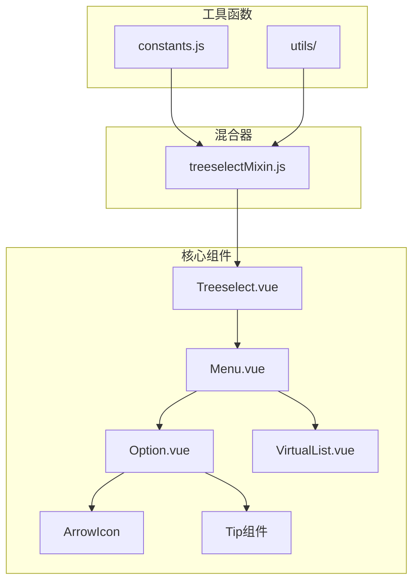

**图表来源**
- [Treeselect.vue](file://src/components/Treeselect.vue)
- [Menu.vue](file://src/components/Menu.vue)
- [Option.vue](file://src/components/Option.vue)
- [VirtualList.vue](file://src/components/VirtualList.vue)

## Option组件核心功能

### 渲染流程架构

Option组件是树形选择器的核心渲染单元，负责单个节点的完整渲染逻辑：

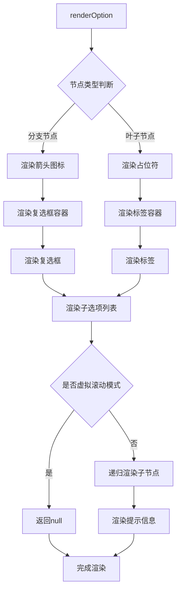

**图表来源**
- [Option.vue](file://src/components/Option.vue#L35-L77)

### 节点标签渲染逻辑

Option组件提供了灵活的标签渲染机制，支持自定义渲染和内置渲染两种模式：

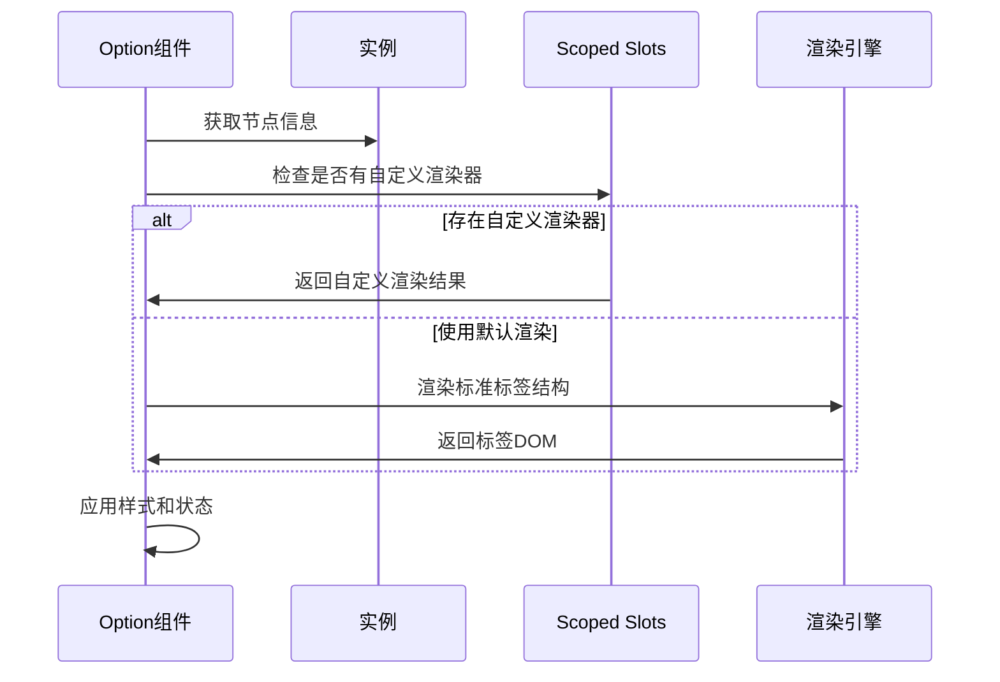

**图表来源**
- [Option.vue](file://src/components/Option.vue#L166-L199)

**章节来源**
- [Option.vue](file://src/components/Option.vue#L35-L199)

## Menu组件协调机制

### renderOptionList方法

Menu组件的`renderOptionList`方法是选项列表渲染的核心协调器，根据不同的场景选择最优的渲染策略：

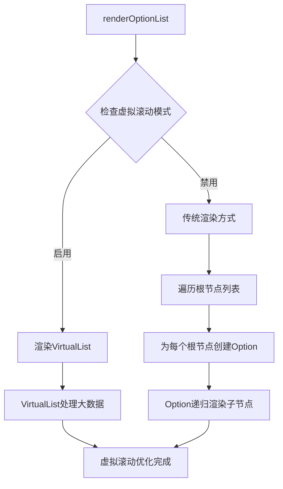

**图表来源**
- [Menu.vue](file://src/components/Menu.vue#L161-L177)

### 不同模式下的渲染策略

Menu组件根据不同场景采用相应的渲染策略：

| 场景 | 渲染方式 | 适用条件 | 性能特点 |
|------|----------|----------|----------|
| 正常模式 | 标准递归渲染 | 小数据量(<1000项) | 直观但内存占用较高 |
| 搜索模式 | 过滤后递归渲染 | 启用搜索功能 | 需要额外过滤逻辑 |
| 异步搜索 | 动态加载渲染 | 异步搜索模式 | 需要状态管理 |
| 虚拟滚动 | 虚拟列表渲染 | 大数据量(>1000项) | 内存效率极高 |

**章节来源**
- [Menu.vue](file://src/components/Menu.vue#L110-L177)

## 虚拟滚动系统

### VirtualList组件架构

VirtualList组件实现了高性能的大数据量虚拟滚动渲染：

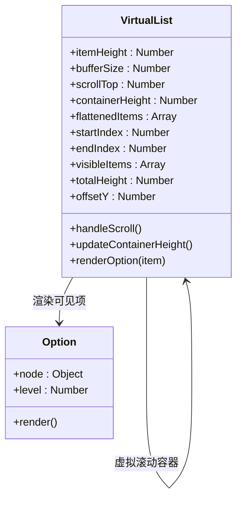

**图表来源**
- [VirtualList.vue](file://src/components/VirtualList.vue#L9-L223)

### 数据扁平化算法

VirtualList使用深度优先遍历算法将树形结构扁平化：

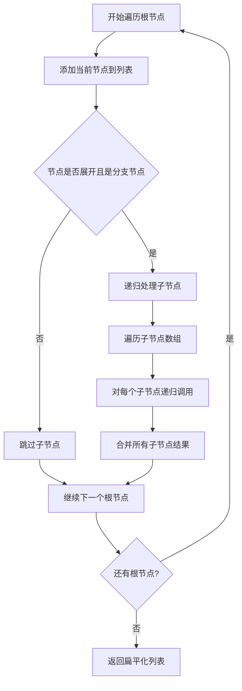

**图表来源**
- [VirtualList.vue](file://src/components/VirtualList.vue#L38-L67)

### 视口计算机制

VirtualList精确计算可视区域内的节点范围：

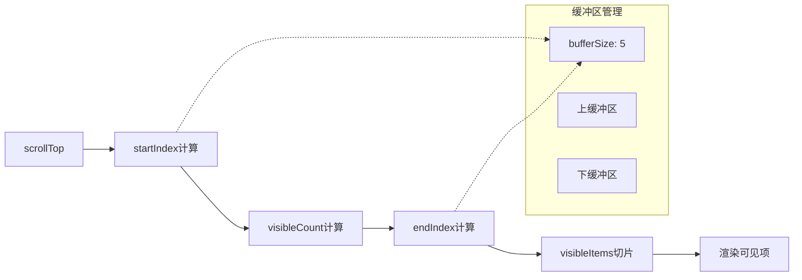

**图表来源**
- [VirtualList.vue](file://src/components/VirtualList.vue#L85-L111)

**章节来源**
- [VirtualList.vue](file://src/components/VirtualList.vue#L38-L223)

## CSS类名动态绑定

### 状态类名映射

Option组件通过动态类名绑定反映节点的各种状态：

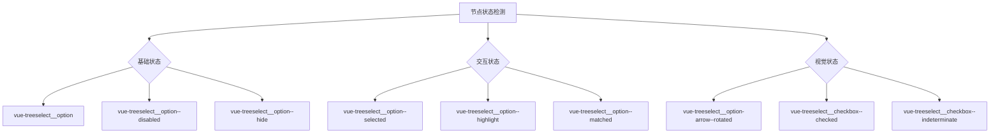

**图表来源**
- [Option.vue](file://src/components/Option.vue#L37-L44)

### 状态检测逻辑

不同状态的检测逻辑体现了组件的智能性：

| 类名 | 检测条件 | 作用时机 | 视觉效果 |
|------|----------|----------|----------|
| `--selected` | `instance.isSelected(node)` | 选中状态变更 | 高亮背景色 |
| `--highlight` | `node.isHighlighted` | 鼠标悬停或键盘导航 | 悬停效果 |
| `--matched` | 搜索激活且`node.isMatched` | 本地搜索匹配 | 匹配标记 |
| `--disabled` | `node.isDisabled` | 节点禁用状态 | 禁用样式 |
| `--hide` | `!this.shouldShow` | 条件隐藏 | 完全隐藏 |

**章节来源**
- [Option.vue](file://src/components/Option.vue#L37-L44)

## Scoped Slots自定义渲染

### 自定义标签渲染

组件提供了强大的Scoped Slots机制，允许用户完全自定义选项渲染：

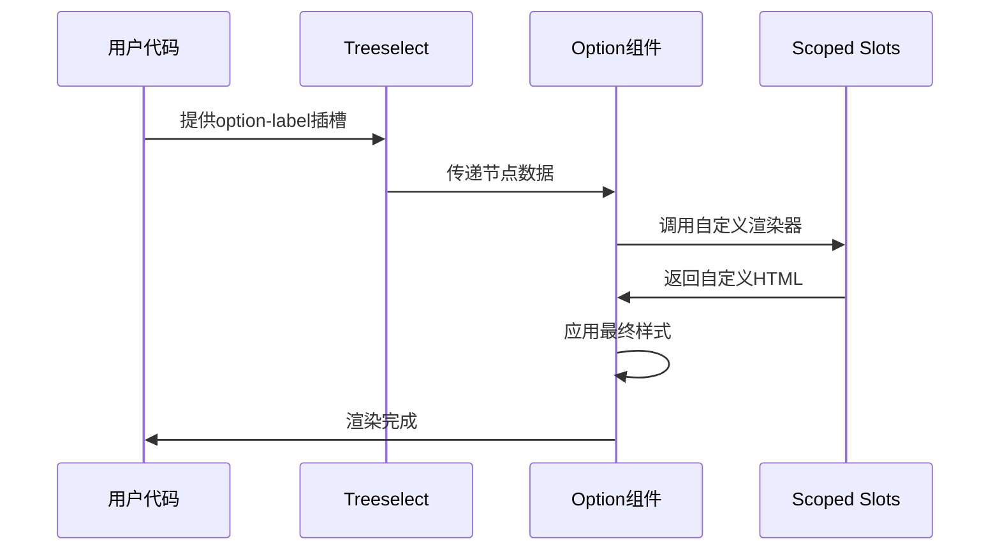

**图表来源**
- [Option.vue](file://src/components/Option.vue#L181-L189)

### 插槽参数结构

自定义渲染器接收丰富的上下文信息：

| 参数名 | 类型 | 描述 | 用途 |
|--------|------|------|------|
| `node` | Object | 当前节点对象 | 访问节点属性 |
| `shouldShowCount` | Boolean | 是否显示计数 | 控制计数器显示 |
| `count` | Number | 节点计数值 | 显示统计信息 |
| `labelClassName` | String | 标签类名 | 应用样式 |
| `countClassName` | String | 计数类名 | 应用计数样式 |

**章节来源**
- [Option.vue](file://src/components/Option.vue#L181-L189)

## 递归渲染机制

### 嵌套结构处理

Option组件实现了完整的递归渲染机制，能够处理任意深度的树形结构：

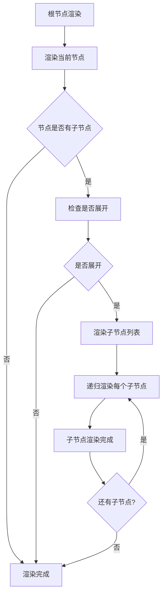

**图表来源**
- [Option.vue](file://src/components/Option.vue#L201-L209)

### 虚拟滚动中的递归处理

在虚拟滚动模式下，递归机制被巧妙地转换为扁平化处理：

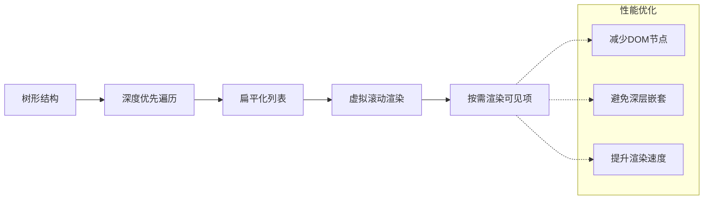

**图表来源**
- [VirtualList.vue](file://src/components/VirtualList.vue#L38-L67)

**章节来源**
- [Option.vue](file://src/components/Option.vue#L201-L209)
- [VirtualList.vue](file://src/components/VirtualList.vue#L38-L67)

## 性能优化策略

### 多层次优化机制

组件采用了多层次的性能优化策略：

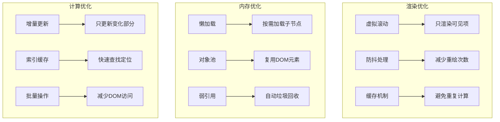

### 性能对比分析

| 数据规模 | 传统递归 | 虚拟滚动 | 性能提升 |
|----------|----------|----------|----------|
| < 100项 | 优秀 | 优秀 | 无差异 |
| 100-1000项 | 良好 | 优秀 | 2-5倍 |
| 1000-10000项 | 中等 | 优秀 | 10-50倍 |
| > 10000项 | 显著下降 | 优秀 | 50+倍 |

**章节来源**
- [VirtualList.vue](file://src/components/VirtualList.vue#L155-L223)

## 总结

Vue Treeselect的节点渲染系统展现了现代前端框架的高级设计理念：

1. **递归渲染机制**：通过Option组件实现了完整的树形结构渲染，支持无限层级的嵌套

2. **虚拟滚动优化**：VirtualList组件解决了大数据量渲染的性能瓶颈，实现了线性扩展的渲染能力

3. **状态管理系统**：通过CSS类名的动态绑定，精确反映了节点的各种状态和交互效果

4. **可扩展性设计**：Scoped Slots机制提供了强大的自定义能力，满足各种复杂的业务需求

5. **性能优先原则**：从渲染到内存管理，每个环节都经过精心优化，确保在各种场景下都能提供优秀的用户体验

这套节点渲染系统不仅展示了Vue.js组件化开发的最佳实践，也为处理复杂树形数据结构提供了宝贵的参考实现。