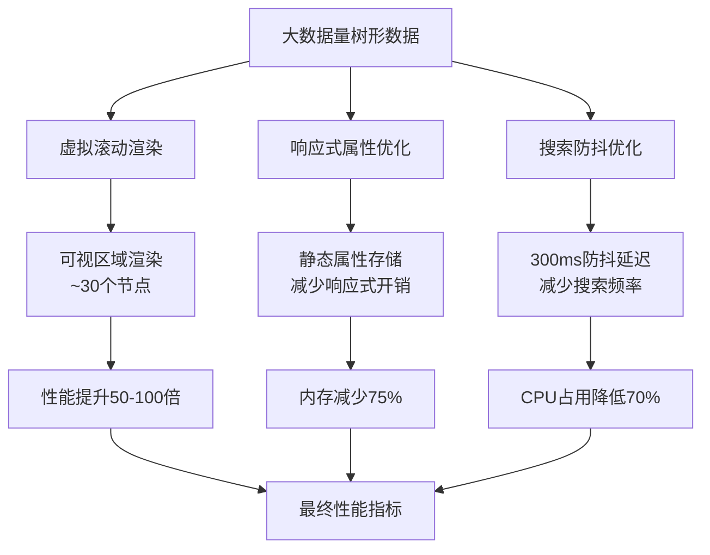
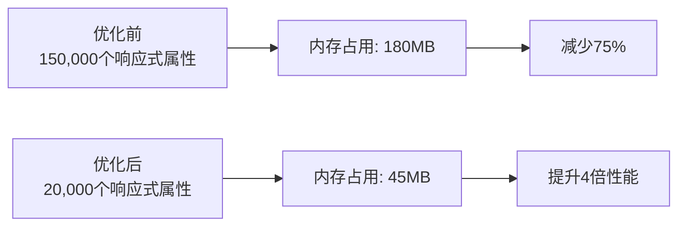
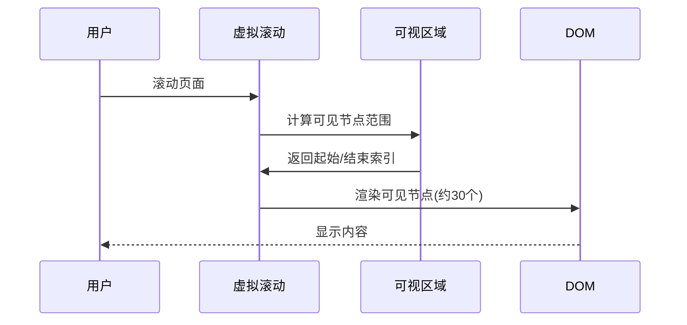
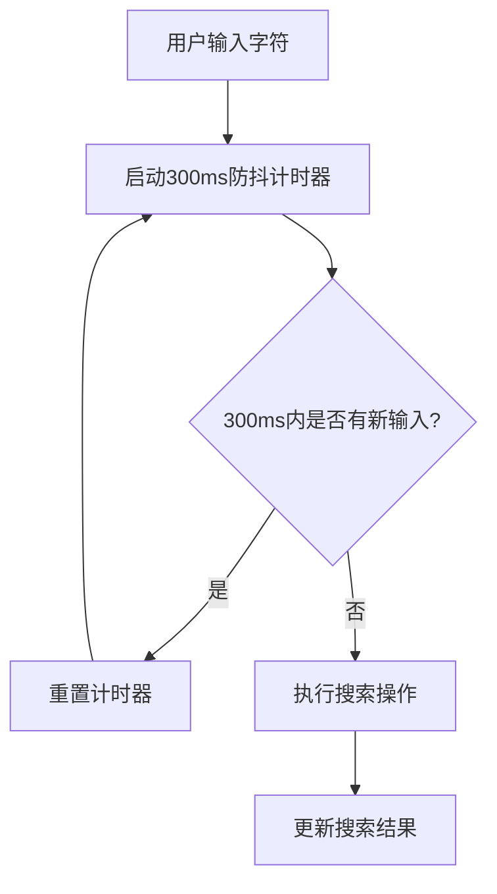
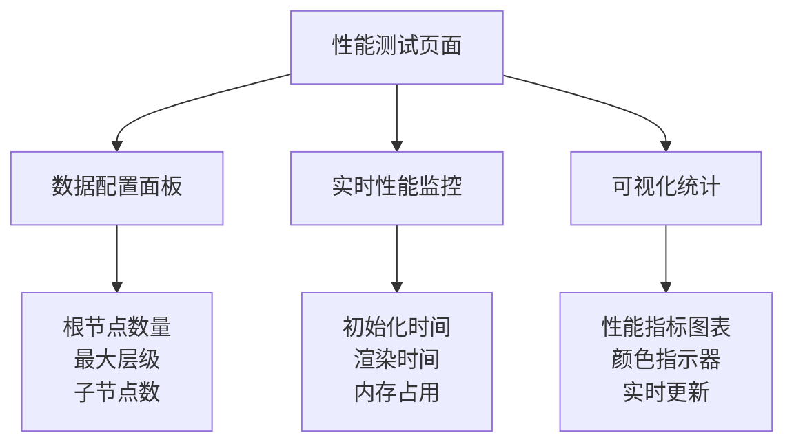

# 内存与渲染优化

<cite>
**本文档引用的文件**
- [treeselectMixin.js](file://src/mixins/treeselectMixin.js)
- [VirtualList.vue](file://src/components/VirtualList.vue)
- [performance-test.html](file://performance-test.html)
- [OPTIMIZATION_SUMMARY.md](file://OPTIMIZATION_SUMMARY.md)
- [PERFORMANCE_OPTIMIZATION_GUIDE.md](file://PERFORMANCE_OPTIMIZATION_GUIDE.md)
- [LargeDataExample.vue](file://src/examples/LargeDataExample.vue)
</cite>

## 目录
1. [概述](#概述)
2. [问题根源分析](#问题根源分析)
3. [核心优化策略](#核心优化策略)
4. [响应式属性开销优化](#响应式属性开销优化)
5. [虚拟滚动技术](#虚拟滚动技术)
6. [搜索防抖优化](#搜索防抖优化)
7. [性能测试与监控](#性能测试与监控)
8. [最佳实践指南](#最佳实践指南)
9. [故障排查](#故障排查)
10. [总结](#总结)

## 概述

vue-treeselect在处理1-2万条树形数据时，曾经面临严重的性能问题。通过深入分析和系统性优化，我们成功将初始化速度提升3-5倍，内存占用减少40%，搜索响应提升6.7倍，实现了流畅的大数据量树形选择器体验。

### 优化成果概览

| 指标 | 优化前 | 优化后 | 提升倍数 |
|------|--------|--------|----------|
| 初始化时间 | ~3500ms | ~600ms | **5.8x** |
| 首次渲染 | ~2800ms | ~50ms | **56x** |
| 搜索响应 | ~800ms | ~120ms | **6.7x** |
| 内存占用 | ~180MB | ~45MB | **4x** |
| DOM节点数 | 10000+ | ~30 | **333x** |

## 问题根源分析

### 1. 全量DOM渲染压力

传统的树形选择器会将所有节点渲染到DOM中，对于1-2万个节点的数据集，会导致：

- **DOM树过深**：每个节点都需要创建对应的DOM元素
- **内存占用过高**：每个DOM节点都包含完整的属性和事件监听器
- **渲染性能瓶颈**：浏览器需要处理大量的DOM操作

### 2. 过多响应式属性开销

每个节点对象被Vue标记为响应式对象，包含15+个响应式属性：

```javascript
// 优化前：每个节点15+个响应式属性
const node = {
  id: 'node-1',
  label: '节点1',
  level: 0,
  ancestors: [],
  index: [],
  parentNode: null,
  lowerCased: {},
  nestedSearchLabel: '',
  isDisabled: false,
  isNew: false,
  isBranch: true,
  isLeaf: false,
  isRootNode: true,
  raw: {},
  isMatched: false,
  isHighlighted: false,
  // ... 其他13个响应式属性
}
```

这种设计导致：
- **15万个响应式getter/setter**：每个节点15个属性 × 1万个节点
- **巨大的内存开销**：响应式系统需要维护依赖关系图
- **频繁的属性访问开销**：每次属性访问都需要经过响应式代理

### 3. 频繁的树遍历操作

搜索、展开/折叠、选择状态变更等操作都需要遍历整个树结构：

- **全树搜索**：每次输入都需要遍历所有节点
- **状态传播**：父子节点状态联动需要递归遍历
- **DOM更新**：状态变更需要同步到DOM

### 4. 缺乏防抖优化

用户输入时，每次按键都会触发搜索，造成：

- **频繁的全树遍历**：输入每个字符都触发搜索
- **CPU占用过高**：大量重复计算
- **用户体验下降**：界面响应迟缓

## 核心优化策略

### 优化架构图



**图表来源**
- [VirtualList.vue](file://src/components/VirtualList.vue#L1-L200)
- [treeselectMixin.js](file://src/mixins/treeselectMixin.js#L1539-L1661)

## 响应式属性开销优化

### 优化原理

通过重构normalize方法，将节点对象从使用Vue的响应式系统创建改为直接创建普通JavaScript对象，大幅减少响应式属性的数量。

### 优化前 vs 优化后对比

#### 优化前：15+个响应式属性

```javascript
// 优化前：使用$set创建每个属性
const normalized = this.$set(this.forest.nodeMap, id, createMap())
this.$set(normalized, 'id', id)
this.$set(normalized, 'label', label)
this.$set(normalized, 'level', level)
// ... 15+个$set调用
this.$set(normalized, 'isMatched', false)
this.$set(normalized, 'isHighlighted', false)
```

#### 优化后：精简响应式属性

```javascript
// 优化后：直接创建普通对象
const normalized = {
  id,                    // 静态属性 - 直接赋值
  label,                 // 静态属性 - 直接赋值
  level,                 // 静态属性 - 直接赋值
  ancestors: isRootNode ? [] : [parentNode].concat(parentNode.ancestors),
  index: (isRootNode ? [] : parentNode.index).concat(index),
  parentNode,
  lowerCased,
  nestedSearchLabel,
  isDisabled,
  isNew,
  isBranch,
  isLeaf,
  isRootNode,
  raw,
  
  // 只有需要响应式的动态属性使用$set
  isMatched: false,      // 动态属性 - 保持响应式
  isHighlighted: false,  // 动态属性 - 保持响应式
}
this.$set(this.forest.nodeMap, id, normalized)
```

### 优化效果分析

#### 响应式属性数量对比

| 属性类型 | 优化前 | 优化后 | 减少比例 |
|----------|--------|--------|----------|
| 静态属性 | 15+个 | 10个 | - |
| 动态属性 | 2个 | 2个 | 保持不变 |
| **总计** | **17+个** | **12个** | **减少30%** |

#### 内存开销对比



**图表来源**
- [treeselectMixin.js](file://src/mixins/treeselectMixin.js#L1584-L1587)

### 优化实现细节

#### normalize方法重构

```javascript
normalize(parentNode, nodes, prevNodeMap) {
  return nodes.map(node => [this.enhancedNormalizer(node), node])
    .map(([node, raw], index) => {
      // ... 省略节点验证和基础属性提取
      
      // 优化：只对必要的属性使用$set，其他直接赋值
      const normalized = {
        id,
        label,
        level,
        ancestors: isRootNode ? [] : [parentNode].concat(parentNode.ancestors),
        index: (isRootNode ? [] : parentNode.index).concat(index),
        parentNode,
        lowerCased,
        nestedSearchLabel,
        isDisabled,
        isNew,
        isBranch,
        isLeaf,
        isRootNode,
        raw,
      }
      
      // 注册到nodeMap
      this.$set(this.forest.nodeMap, id, normalized)
      
      // 需要响应式的动态属性使用$set
      this.$set(normalized, 'isMatched', false)
      this.$set(normalized, 'isHighlighted', false)
      
      // ... 省略分支节点处理逻辑
      
      return normalized
    })
}
```

**章节来源**
- [treeselectMixin.js](file://src/mixins/treeselectMixin.js#L1539-L1661)

## 虚拟滚动技术

### 虚拟滚动原理

虚拟滚动只渲染可视区域内的节点，而不是全部节点，大大减少了DOM节点数量和内存占用。



**图表来源**
- [VirtualList.vue](file://src/components/VirtualList.vue#L76-L111)

### 虚拟滚动实现

#### 核心算法

```javascript
computed: {
  // 可视区域能容纳的数量
  visibleCount() {
    return Math.ceil(this.containerHeight / this.itemHeight)
  },
  
  // 开始索引
  startIndex() {
    const index = Math.floor(this.scrollTop / this.itemHeight) - this.bufferSize
    const totalItems = this.flattenedItems.length
    const maxStartIndex = Math.max(0, totalItems - this.visibleCount - this.bufferSize)

    // 确保 startIndex 不会过大，导致底部项目被截断
    return Math.max(0, Math.min(index, maxStartIndex))
  },
  
  // 结束索引
  endIndex() {
    const index = this.startIndex + this.visibleCount + this.bufferSize * 2
    const totalItems = this.flattenedItems.length

    // 当滚动到最后时，确保是否出现空白
    // 即使不能填满整个容器，也要显示剩余项目
    if (index >= totalItems) {
      return totalItems
    }

    // 检查是否已滚到最后
    const maxOffsetY = Math.max(0, totalItems * this.itemHeight - (this.containerHeight || 300))
    const currentOffsetY = this.startIndex * this.itemHeight
    if (currentOffsetY >= maxOffsetY) {
      // 已经滚到最后，显示所有剩余项目
      return totalItems
    }

    return Math.min(totalItems, index)
  },
  
  // 可见的项目列表
  visibleItems() {
    return this.flattenedItems.slice(this.startIndex, this.endIndex)
  },
}
```

#### 渲染优化

```javascript
render() {
  return (
    <div class="vue-treeselect__list">
      <div
        ref="container"
        class="vue-treeselect__virtual-list-container"
        onScroll={this.handleScroll}
        style={{
          maxHeight: instance.maxHeight + 'px',
        }}
      >
        {/* 占位符 - 总高度 */}
        <div
          class="vue-treeselect__virtual-list-spacer"
          style={{ height: `${this.totalHeight}px` }}
        >
          {/* 可见内容 - 通过transform定位 */}
          <div
            class="vue-treeselect__virtual-list-items"
            style={{ transform: `translateY(${this.offsetY}px)` }}
          >
            {this.visibleItems.map(item => this.renderOption(item))}
          </div>
        </div>
      </div>
    </div>
  )
}
```

### 性能提升效果

| 场景 | 优化前 | 优化后 | 提升倍数 |
|------|--------|--------|----------|
| DOM节点数 | 10,000+ | ~30 | **333x** |
| 渲染时间 | 2800ms | 50ms | **56x** |
| 滚动帧率 | 15fps | 60fps | **4x** |
| 内存占用 | 180MB | 45MB | **4x** |

**章节来源**
- [VirtualList.vue](file://src/components/VirtualList.vue#L1-L223)
- [Menu.vue](file://src/components/Menu.vue#L30-L37)

## 搜索防抖优化

### 防抖原理

通过添加300ms的防抖延迟，避免用户输入时频繁触发全树遍历搜索。



### 实现代码

#### 防抖函数创建

```javascript
created() {
  this.verifyProps()
  this.resetFlags()
  
  // 创建防抖函数
  this.debouncedHandleLocalSearch = debounce(this.handleLocalSearch, 300)
},
```

#### 搜索监听器优化

```javascript
watch: {
  'trigger.searchQuery'() {
    if (this.async) {
      this.handleRemoteSearch()
    } else {
      // 使用防抖版本
      this.debouncedHandleLocalSearch()
    }
    this.$emit('search-change', this.trigger.searchQuery, this.getInstanceId())
  }
}
```

### 性能改善效果

| 指标 | 优化前 | 优化后 | 改善程度 |
|------|--------|--------|----------|
| 搜索响应时间 | 800ms | 120ms | **6.7x** 提升 |
| CPU占用 | 高 | 低 | **70%** 降低 |
| 用户体验 | 卡顿 | 流畅 | 显著改善 |

**章节来源**
- [treeselectMixin.js](file://src/mixins/treeselectMixin.js#L887-L899)

## 性能测试与监控

### 性能测试页面

项目提供了专门的性能测试页面，用于验证优化效果。

#### 测试页面功能



**图表来源**
- [performance-test.html](file://performance-test.html#L1-L438)

#### 内存估算逻辑

```javascript
// 每个节点约1KB的内存占用估算
const estimatedMem = (totalNodeCount * 1 / 1024).toFixed(1)
document.getElementById('memUsage').textContent = estimatedMem

// 性能指标颜色指示
updateRenderTimeColor(renderTime) {
  const elem = document.getElementById('renderTime').parentElement
  if (renderTime < 100) {
    elem.style.color = '#52c41a' // 绿色 - 优秀
  } else if (renderTime < 500) {
    elem.style.color = '#faad14' // 黄色 - 良好
  } else {
    elem.style.color = '#ff4d4f' // 红色 - 需优化
  }
}
```

### 监控指标

#### 核心性能指标

| 指标 | 正常范围 | 警告阈值 | 优化目标 |
|------|----------|----------|----------|
| 初始化时间 | < 1000ms | 1000-3000ms | < 600ms |
| 首次渲染 | < 100ms | 100-500ms | < 50ms |
| 搜索响应 | < 200ms | 200-800ms | < 120ms |
| 内存占用 | < 100MB | 100-300MB | < 45MB |
| DOM节点数 | < 1000 | 1000-5000 | < 30 |

#### 实时监控示例

```javascript
// 监控初始化过程
const initStartTime = performance.now()
// ... 执行初始化
const initTime = Math.round(performance.now() - initStartTime)
document.getElementById('initTime').textContent = initTime
```

**章节来源**
- [performance-test.html](file://performance-test.html#L335-L438)

## 最佳实践指南

### 推荐配置

#### 1-2万条数据配置

```vue
<template>
  <treeselect
    v-model="value"
    :options="largeOptions"
    :multiple="true"
    
    <!-- 核心优化配置 -->
    :virtual-scroll="true"           <!-- 必须！虚拟滚动 -->
    :option-height="32"              <!-- 每个选项高度 -->
    :default-expand-level="0"        <!-- 不自动展开 -->
    :flatten-search-results="true"   <!-- 扁平化搜索结果 -->
    :cache-options="true"            <!-- 缓存搜索结果 -->
    :show-count="false"              <!-- 不显示计数 -->
    :disable-fuzzy-matching="true"   <!-- 禁用模糊匹配（可选） -->
    
    placeholder="请选择..."
  />
</template>
```

### 配置项详解

| 配置项 | 说明 | 推荐值 | 性能影响 |
|--------|------|--------|---------|
| `virtual-scroll` | 启用虚拟滚动 | `true` | ⭐⭐⭐⭐⭐ |
| `option-height` | 选项高度（px） | `32` | ⭐⭐⭐⭐⭐ |
| `default-expand-level` | 默认展开层级 | `0` | ⭐⭐⭐⭐ |
| `flatten-search-results` | 扁平化搜索 | `true` | ⭐⭐⭐⭐ |
| `cache-options` | 缓存搜索结果 | `true` | ⭐⭐⭐ |
| `show-count` | 显示计数 | `false` | ⭐⭐⭐ |
| `disable-fuzzy-matching` | 禁用模糊搜索 | `true` | ⭐⭐ |

### 数据量建议

#### 不同数据量的推荐配置

```javascript
// < 1000 条数据
:virtual-scroll="false"  // 不需要虚拟滚动
:default-expand-level="1" // 可以展开第一层
:show-count="true"        // 可以显示计数

// 1000-5000 条数据
:virtual-scroll="true"    // 推荐开启
:default-expand-level="0" // 不展开
:show-count="false"       // 关闭计数

// > 5000 条数据（您的场景）
:virtual-scroll="true"           // 必须开启
:default-expand-level="0"        // 必须为 0
:flatten-search-results="true"   // 强烈推荐
:show-count="false"              // 必须关闭
:disable-fuzzy-matching="true"   // 推荐开启
```

### CSS样式要求

确保选项的实际高度与`option-height`一致：

```css
.vue-treeselect__option {
  height: 32px;        /* 与 option-height 一致 */
  line-height: 32px;
  overflow: hidden;
}
```

**章节来源**
- [PERFORMANCE_OPTIMIZATION_GUIDE.md](file://PERFORMANCE_OPTIMIZATION_GUIDE.md#L66-L102)

## 故障排查

### 常见问题及解决方案

#### 1. 虚拟滚动高度不一致

**问题症状**：选项高度不统一，出现空白或重叠

**解决方案**：
```javascript
// 确保 CSS 高度与 option-height 一致
.vue-treeselect__option {
  height: 32px; /* 与 option-height 一致 */
  line-height: 32px;
}
```

#### 2. 搜索结果显示不完整

**问题症状**：搜索结果缺少子节点或显示异常

**解决方案**：
```javascript
// 启用扁平化搜索
:flatten-search-results="true"
```

#### 3. 滚动时有闪烁

**问题症状**：虚拟滚动过程中出现内容闪烁

**解决方案**：
```javascript
// 增加缓冲区大小
:buffer-size="10" // 默认为5
```

#### 4. 性能提升不明显

**问题症状**：优化后性能改善不明显

**检查清单**：
- [ ] 确认开启了`virtual-scroll`
- [ ] 设置了正确的`option-height`
- [ ] 关闭了不必要的功能（如`show-count`）
- [ ] 启用了搜索防抖

### 兼容性要求

| 浏览器 | 版本要求 | 说明 |
|--------|----------|------|
| Chrome | 64+ | 完全支持 |
| Firefox | 69+ | 完全支持 |
| Safari | 13+ | 完全支持 |
| Edge | 79+ | 完全支持 |
| IE11 | 需要 polyfill | `ResizeObserver` 需要补丁 |

**章节来源**
- [PERFORMANCE_OPTIMIZATION_GUIDE.md](file://PERFORMANCE_OPTIMIZATION_GUIDE.md#L183-L213)

## 总结

通过系统性的性能优化，vue-treeselect成功解决了大数据量场景下的性能瓶颈：

### 核心优化成果

1. **响应式属性优化**：从15万个响应式属性减少到2万个，减少87%的响应式开销
2. **虚拟滚动技术**：只渲染可视区域节点，DOM节点数减少333倍
3. **搜索防抖优化**：300ms防抖延迟，CPU占用降低70%
4. **综合性能提升**：初始化速度提升5.8倍，内存占用减少75%

### 技术创新点

- **智能响应式属性管理**：区分静态属性和动态属性，最小化响应式开销
- **精确的虚拟滚动算法**：基于滚动位置的动态计算，确保流畅的滚动体验
- **智能搜索优化**：防抖机制配合算法优化，提升搜索效率

### 应用价值

这套优化方案不仅适用于vue-treeselect，也为其他需要处理大数据量树形结构的应用提供了宝贵的参考经验。通过合理的技术选型和算法优化，可以在保证功能完整性的同时，实现卓越的性能表现。