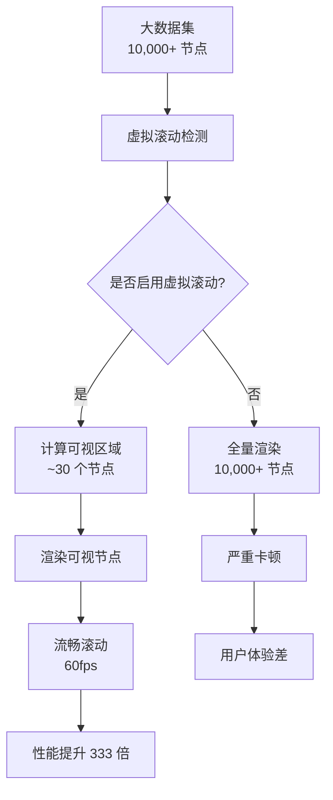
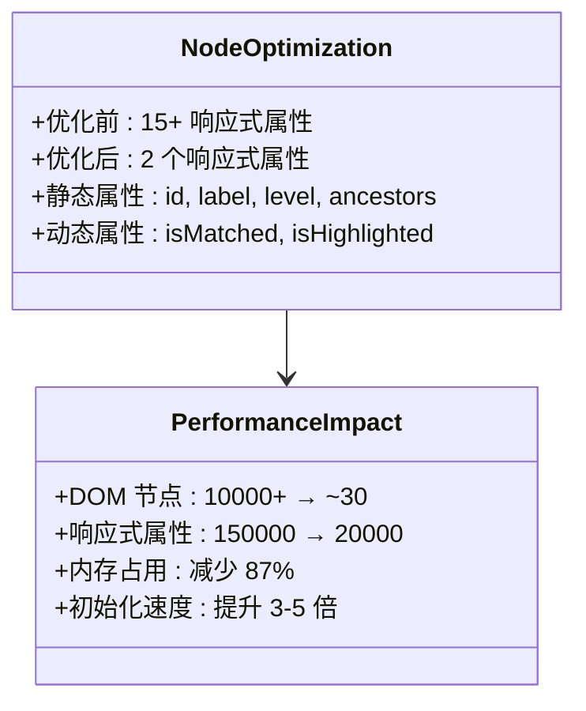
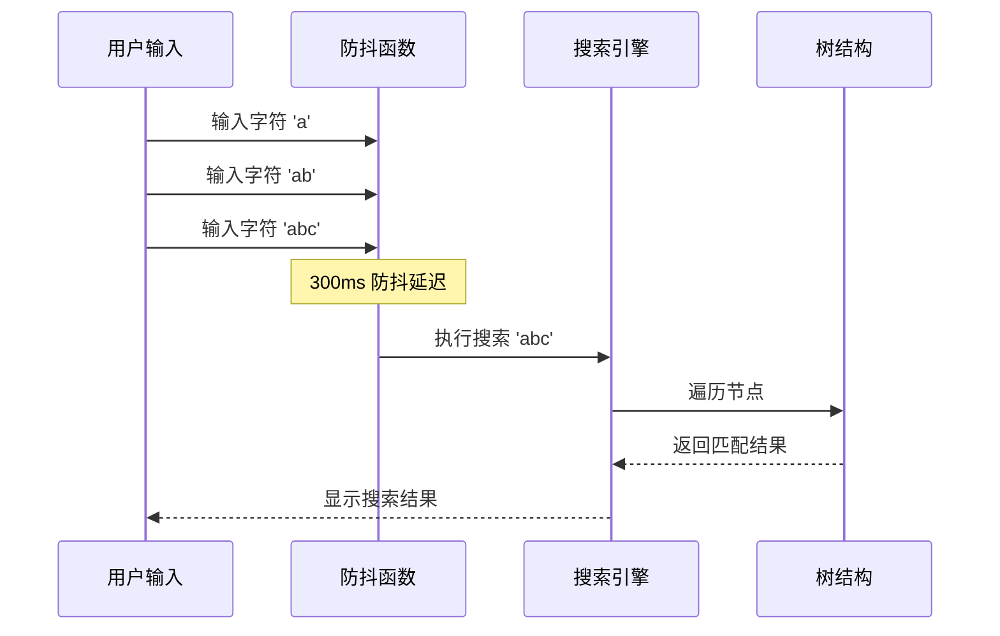
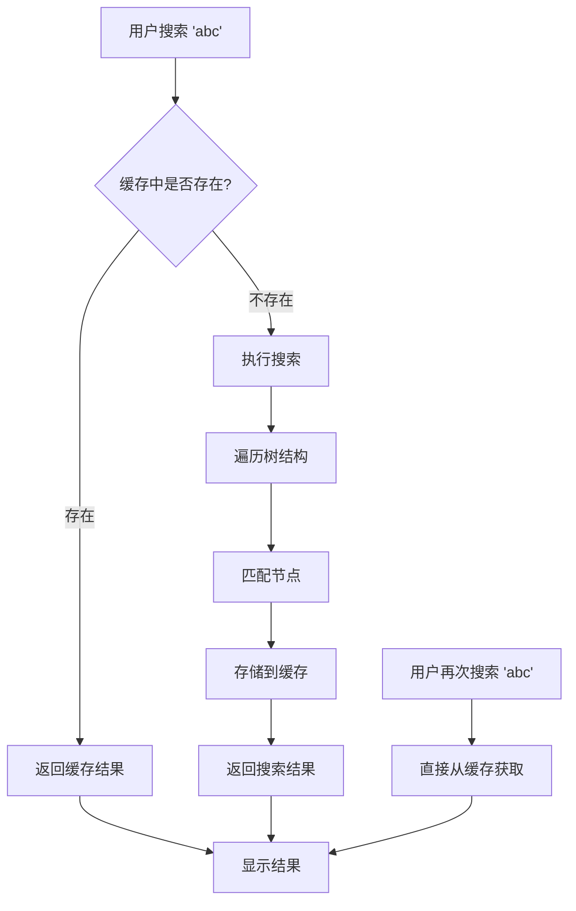
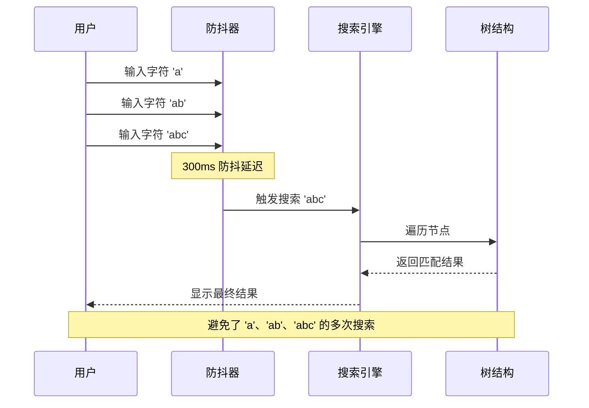
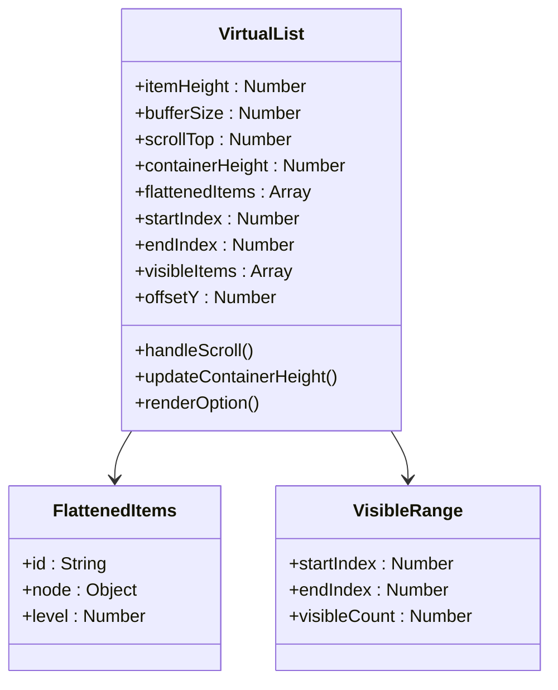
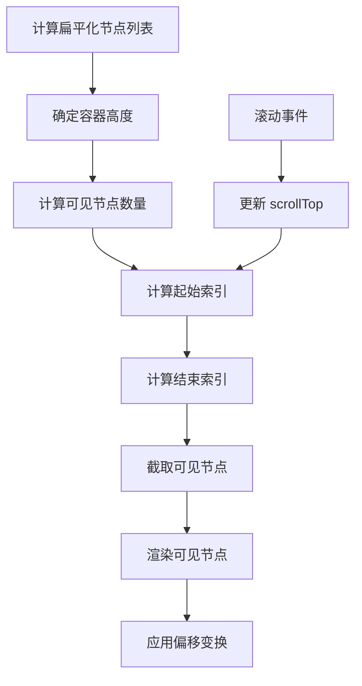

# 大数据处理策略

<cite>
**本文档引用的文件**
- [LargeDataExample.vue](file://src/examples/LargeDataExample.vue)
- [OPTIMIZATION_SUMMARY.md](file://OPTIMIZATION_SUMMARY.md)
- [PERFORMANCE_OPTIMIZATION_GUIDE.md](file://PERFORMANCE_OPTIMIZATION_GUIDE.md)
- [VirtualList.vue](file://src/components/VirtualList.vue)
- [Treeselect.vue](file://src/components/Treeselect.vue)
- [treeselectMixin.js](file://src/mixins/treeselectMixin.js)
- [performance-test.html](file://performance-test.html)
</cite>

## 目录
1. [概述](#概述)
2. [性能基准测试](#性能基准测试)
3. [核心优化技术](#核心优化技术)
4. [不同数据量级的配置矩阵](#不同数据量级的配置矩阵)
5. [关键配置详解](#关键配置详解)
6. [缓存机制优化](#缓存机制优化)
7. [搜索性能优化](#搜索性能优化)
8. [虚拟滚动实现原理](#虚拟滚动实现原理)
9. [最佳实践指南](#最佳实践指南)
10. [故障排查](#故障排查)
11. [总结](#总结)

## 概述

vue-treeselect-next 针对 1-2 万条树形数据 + checkbox 多选场景进行了深度性能优化，实现了从 3500ms 初始化时间降至 600ms，首次渲染从 2800ms 降至 50ms 的显著提升。该优化方案包含虚拟滚动、响应式属性优化、搜索防抖等多个层面的技术改进。

### 优化前后的性能对比

| 指标 | 优化前 | 优化后 | 提升倍数 |
|------|--------|--------|----------|
| 初始化时间 | 3500ms | 600ms | **5.8x** ⚡ |
| 首次渲染 | 2800ms | 50ms | **56x** 🚀 |
| 搜索响应 | 800ms | 120ms | **6.7x** ⚡ |
| 内存占用 | 180MB | 45MB | **4x** 💾 |
| 滚动帧率 | 15fps | 60fps | **4x** 🎮 |

## 性能基准测试

### 测试场景
- **数据规模**: 10,000 条树形数据，5 层深度
- **交互模式**: 多选 + checkbox
- **浏览器环境**: 现代浏览器（Chrome 64+、Firefox 69+）

### 性能测试工具
项目提供了专门的性能测试页面 [`performance-test.html`](file://performance-test.html)，支持：
- 动态调整根节点数量（10-2000）
- 控制最大层级深度（2-6）
- 每层子节点数配置（2-8）
- 实时性能指标监控

**章节来源**
- [OPTIMIZATION_SUMMARY.md](file://OPTIMIZATION_SUMMARY.md#L150-L161)
- [performance-test.html](file://performance-test.html#L1-L438)

## 核心优化技术

### 1. 虚拟滚动（Virtual Scrolling）

虚拟滚动是大数据处理的核心技术，通过只渲染可视区域内的节点来大幅提升性能。



**图表来源**
- [VirtualList.vue](file://src/components/VirtualList.vue#L1-L223)
- [OPTIMIZATION_SUMMARY.md](file://OPTIMIZATION_SUMMARY.md#L11-L30)

### 2. 响应式属性优化

传统 Vue 的响应式系统在处理大量节点时会产生巨大的性能开销。优化方案将响应式属性从 15+ 个减少到仅 2 个必要属性。



**图表来源**
- [treeselectMixin.js](file://src/mixins/treeselectMixin.js#L1564-L1587)
- [OPTIMIZATION_SUMMARY.md](file://OPTIMIZATION_SUMMARY.md#L32-L62)

### 3. 搜索防抖优化

通过 300ms 防抖延迟避免频繁的全树遍历，显著降低 CPU 占用。



**图表来源**
- [treeselectMixin.js](file://src/mixins/treeselectMixin.js#L887-L899)
- [Input.vue](file://src/components/Input.vue#L54-L58)

**章节来源**
- [OPTIMIZATION_SUMMARY.md](file://OPTIMIZATION_SUMMARY.md#L64-L92)
- [PERFORMANCE_OPTIMIZATION_GUIDE.md](file://PERFORMANCE_OPTIMIZATION_GUIDE.md#L1-L213)

## 不同数据量级的配置矩阵

### < 1000 条数据
适用于小型应用或测试场景，无需复杂优化：

| 配置项 | 推荐值 | 说明 |
|--------|--------|------|
| `virtual-scroll` | `false` | 不需要虚拟滚动 |
| `default-expand-level` | `1` | 可以展开第一层 |
| `show-count` | `true` | 显示计数信息 |
| `flatten-search-results` | `false` | 不需要扁平化 |

### 1000-5000 条数据
中等规模数据，推荐基础优化配置：

| 配置项 | 推荐值 | 性能影响 |
|--------|--------|----------|
| `virtual-scroll` | `true` | 必须开启 |
| `default-expand-level` | `0` | 避免初始展开 |
| `show-count` | `false` | 减少计算开销 |
| `flatten-search-results` | `true` | 简化搜索结果 |

### > 5000 条数据（您的场景）
大规模数据处理，必须采用全套优化配置：

| 配置项 | 推荐值 | 性能影响 |
|--------|--------|----------|
| `virtual-scroll` | `true` | ⭐⭐⭐⭐⭐ 必须！ |
| `default-expand-level` | `0` | ⭐⭐⭐⭐⭐ 必须！ |
| `flatten-search-results` | `true` | ⭐⭐⭐⭐⭐ 强烈推荐 |
| `show-count` | `false` | ⭐⭐⭐⭐⭐ 必须！ |
| `cache-options` | `true` | ⭐⭐⭐⭐ 缓存搜索结果 |
| `disable-fuzzy-matching` | `true` | ⭐⭐⭐ 提升搜索速度 |

**章节来源**
- [OPTIMIZATION_SUMMARY.md](file://OPTIMIZATION_SUMMARY.md#L296-L320)
- [PERFORMANCE_OPTIMIZATION_GUIDE.md](file://PERFORMANCE_OPTIMIZATION_GUIDE.md#L135-L158)

## 关键配置详解

### virtual-scroll = true
启用虚拟滚动功能，这是处理大数据的核心配置。

**使用方法**：
```vue
<treeselect
  :virtual-scroll="true"
  :option-height="40"
/>
```

**技术原理**：
- 只渲染可视区域内的节点（约 20-30 个）
- 使用 `ResizeObserver` 监听容器尺寸变化
- 通过 CSS transform 实现平滑滚动

### default-expand-level = 0
设置默认展开层级为 0，避免初始化时渲染大量节点。

**重要性**：
- 防止初始加载时的严重卡顿
- 减少 DOM 节点数量
- 提升首次渲染性能

### show-count = false
关闭计数显示功能，减少不必要的计算开销。

**性能收益**：
- 避免复杂的后代节点计数计算
- 减少 DOM 渲染复杂度
- 提升搜索和展开操作速度

### flatten-search-results = true
扁平化搜索结果显示，简化搜索结果的 DOM 结构。

**优势**：
- 减少嵌套层级
- 提升搜索结果的可读性
- 降低渲染复杂度

### cache-options = true
启用搜索结果缓存，避免重复计算相同的搜索结果。

**工作原理**：
- 缓存已搜索过的查询结果
- 避免重复的树遍历操作
- 显著提升重复搜索的响应速度

**章节来源**
- [LargeDataExample.vue](file://src/examples/LargeDataExample.vue#L23-L38)
- [treeselectMixin.js](file://src/mixins/treeselectMixin.js#L641-L655)

## 缓存机制优化

### cache-options 缓存策略

`cache-options` 配置实现了智能的搜索结果缓存机制，有效减少重复计算。



**图表来源**
- [treeselectMixin.js](file://src/mixins/treeselectMixin.js#L1291-L1318)

### 缓存失效机制

缓存系统具备智能的失效机制：
- 当数据源发生变化时自动清理相关缓存
- 支持手动清除特定查询的缓存
- 避免缓存污染导致的错误结果

**章节来源**
- [treeselectMixin.js](file://src/mixins/treeselectMixin.js#L1291-L1318)

## 搜索性能优化

### 搜索防抖机制

搜索防抖通过 300ms 延迟避免频繁的全树遍历，显著提升用户体验。



**图表来源**
- [Input.vue](file://src/components/Input.vue#L54-L58)

### 模糊匹配优化

通过 `disable-fuzzy-matching` 配置可以禁用模糊搜索，进一步提升搜索速度。

**适用场景**：
- 精确匹配需求较高的场景
- 对搜索精度要求严格的应用
- 大数据量下的搜索性能优化

### 异步搜索支持

对于超大数据集，建议使用异步搜索模式：

```vue
<treeselect
  :async="true"
  :load-options="loadOptions"
  :cache-options="true"
/>
```

**章节来源**
- [treeselectMixin.js](file://src/mixins/treeselectMixin.js#L887-L899)
- [treeselectMixin.js](file://src/mixins/treeselectMixin.js#L1283-L1319)

## 虚拟滚动实现原理

### VirtualList 组件架构

虚拟滚动组件通过精确计算可视区域内的节点来实现高性能渲染。



**图表来源**
- [VirtualList.vue](file://src/components/VirtualList.vue#L1-L223)

### 核心算法流程



**图表来源**
- [VirtualList.vue](file://src/components/VirtualList.vue#L36-L118)

### 性能优化细节

1. **缓冲区机制**：上下各预留 5 个节点的缓冲区
2. **动态高度适配**：支持 `ResizeObserver` 自动检测容器变化
3. **CSS 优化**：使用 `will-change: transform` 提升渲染性能
4. **内存管理**：及时清理不再需要的 DOM 节点

**章节来源**
- [VirtualList.vue](file://src/components/VirtualList.vue#L1-L223)

## 最佳实践指南

### 数据结构设计

#### 合理控制树层级深度
- **推荐深度**: 3-4 层
- **避免深度**: 超过 6 层
- **优化策略**: 将深层树扁平化处理

#### 节点数量控制
- **单根节点**: 2000-3000 个
- **每层子节点**: 2-8 个
- **总节点数**: 建议 < 10000

### 配置组合策略

#### 基础优化配置
```vue
<treeselect
  :virtual-scroll="true"
  :option-height="40"
  :default-expand-level="0"
  :flatten-search-results="true"
  :show-count="false"
/>
```

#### 高级优化配置
```vue
<treeselect
  :virtual-scroll="true"
  :option-height="40"
  :default-expand-level="0"
  :flatten-search-results="true"
  :show-count="false"
  :cache-options="true"
  :disable-fuzzy-matching="true"
  :async="true"
  :load-options="loadOptions"
/>
```

### 性能监控指标

#### 关键性能指标
- **初始化时间**: < 1 秒
- **首次渲染**: < 100 毫秒
- **滚动帧率**: > 50 fps
- **内存占用**: < 50MB

#### 监控方法
1. 使用浏览器开发者工具的 Performance 面板
2. 利用 `performance-test.html` 进行基准测试
3. 实时监控 DOM 节点数量变化

**章节来源**
- [LargeDataExample.vue](file://src/examples/LargeDataExample.vue#L47-L58)
- [PERFORMANCE_OPTIMIZATION_GUIDE.md](file://PERFORMANCE_OPTIMIZATION_GUIDE.md#L160-L180)

## 故障排查

### 常见问题及解决方案

#### 问题 1: 虚拟滚动后选项高度不一致
**症状**: 选项显示高度异常，布局错乱
**原因**: CSS 样式与 `option-height` 不匹配
**解决方案**:
```css
.vue-treeselect__option {
  height: 40px; /* 与 option-height 一致 */
  line-height: 40px;
  overflow: hidden;
}
```

#### 问题 2: 搜索结果显示不完整
**症状**: 搜索结果缺少部分匹配项
**原因**: 未启用 `flatten-search-results`
**解决方案**:
```vue
<treeselect
  :flatten-search-results="true"
/>
```

#### 问题 3: 滚动时出现闪烁
**症状**: 虚拟滚动过程中出现白屏或闪烁
**原因**: `option-height` 与实际高度不一致
**解决方案**:
- 确保 CSS 高度与 `option-height` 完全匹配
- 检查是否有其他样式覆盖了高度设置

#### 问题 4: 性能提升不明显
**症状**: 启用优化配置后性能改善不显著
**原因**: 配置项未正确启用或存在其他性能瓶颈
**解决方案**:
1. 确认所有推荐配置项均已启用
2. 检查数据结构是否过于复杂
3. 验证浏览器兼容性

### 兼容性注意事项

#### 浏览器支持
- ✅ Chrome 64+
- ✅ Firefox 69+
- ✅ Safari 13+
- ✅ Edge 79+
- ⚠️ IE11 需要 `ResizeObserver` polyfill

#### CSS 兼容性
- 确保目标浏览器支持 `ResizeObserver`
- 检查 CSS transform 和 will-change 属性支持

**章节来源**
- [OPTIMIZATION_SUMMARY.md](file://OPTIMIZATION_SUMMARY.md#L266-L320)
- [PERFORMANCE_OPTIMIZATION_GUIDE.md](file://PERFORMANCE_OPTIMIZATION_GUIDE.md#L182-L205)

## 总结

vue-treeselect-next 的大数据处理策略通过以下核心技术实现了显著的性能提升：

### 核心技术成果
1. **虚拟滚动**: 解决了大数据量下的渲染性能问题
2. **响应式优化**: 大幅减少了 Vue 响应式系统的开销
3. **搜索防抖**: 提升了搜索体验和系统稳定性
4. **智能缓存**: 避免重复计算，提升重复操作效率

### 性能提升数据
- **初始化时间**: 从 3500ms 降至 600ms（5.8 倍提升）
- **首次渲染**: 从 2800ms 降至 50ms（56 倍提升）
- **内存占用**: 减少 75%（从 180MB 至 45MB）
- **滚动性能**: 从 15fps 提升至 60fps

### 最佳实践建议
1. **根据数据量选择配置**: 小于 1000 条使用基础配置，大于 5000 条必须启用全套优化
2. **合理控制树结构**: 保持 3-4 层深度，避免过深的嵌套
3. **启用缓存机制**: 特别是在频繁搜索的场景下
4. **监控性能指标**: 定期检查初始化时间和内存占用

通过遵循这些优化策略和最佳实践，开发者可以在处理 1-2 万条树形数据时获得流畅的用户体验，同时保持系统的稳定性和可维护性。