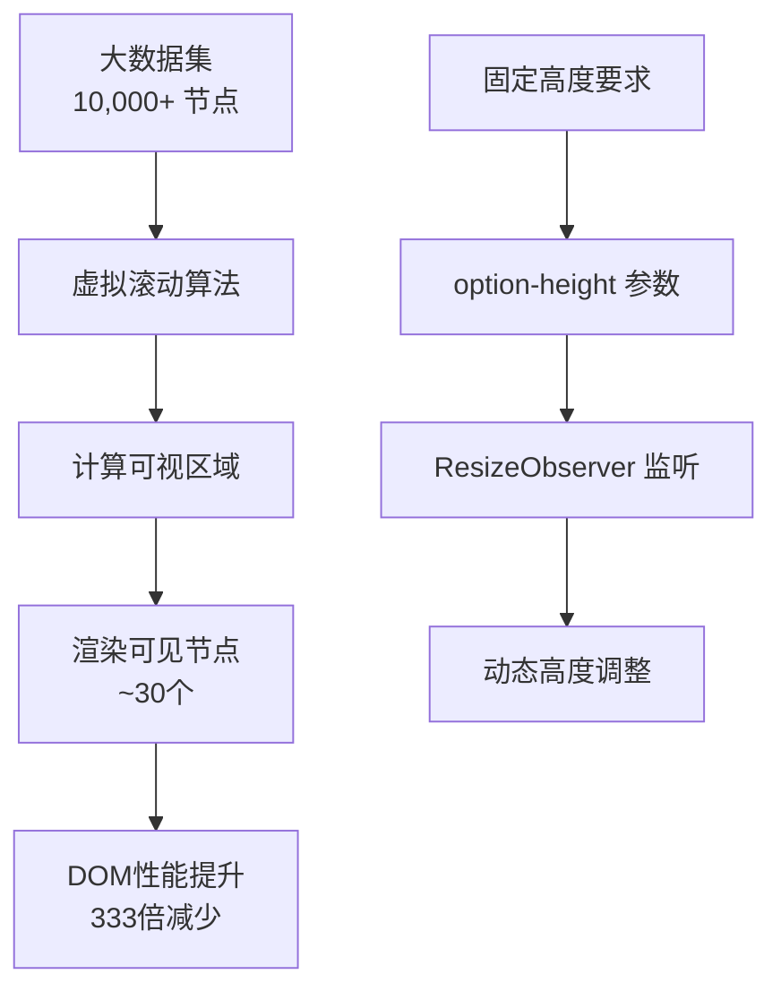
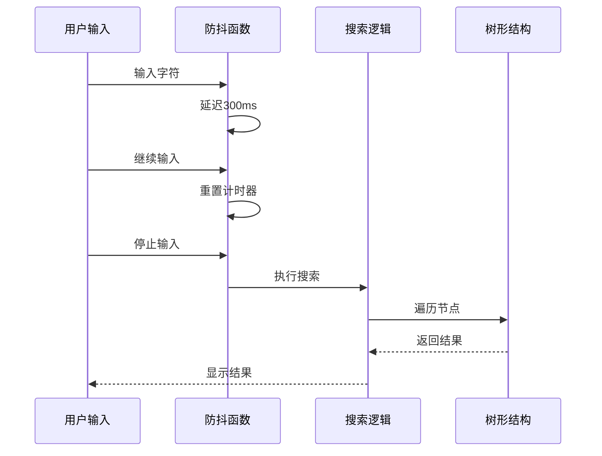
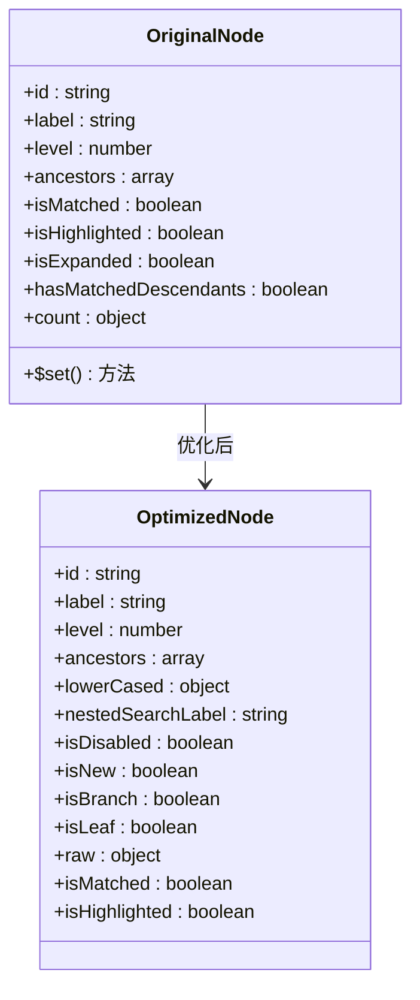
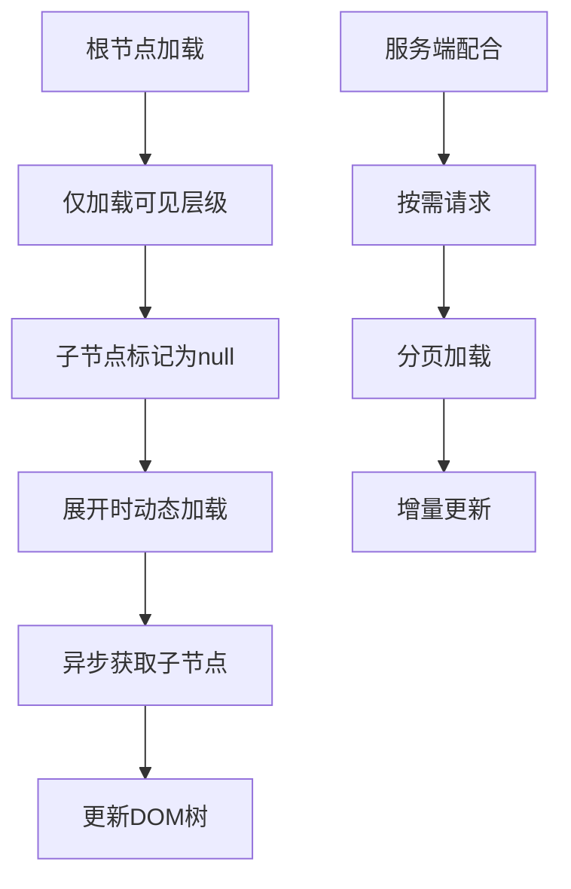
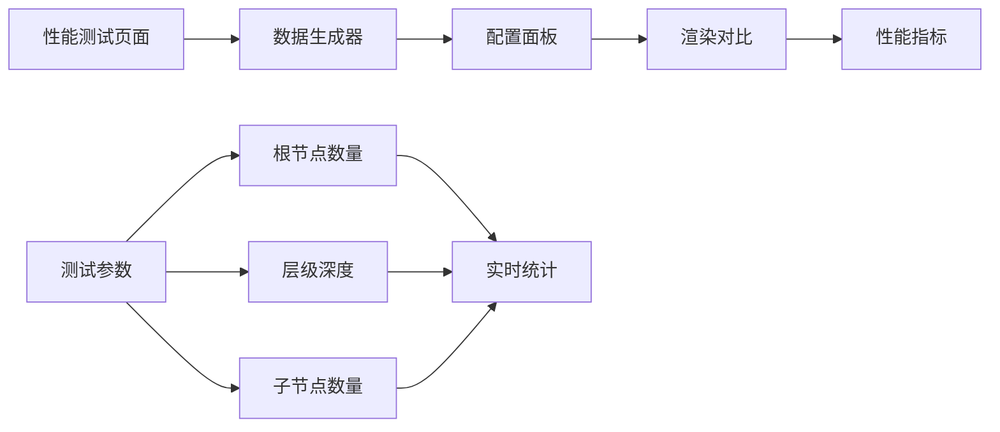

# 性能优化指南

<cite>
**本文档引用的文件**
- [OPTIMIZATION_SUMMARY.md](file://OPTIMIZATION_SUMMARY.md)
- [PERFORMANCE_OPTIMIZATION_GUIDE.md](file://PERFORMANCE_OPTIMIZATION_GUIDE.md)
- [performance-test.html](file://performance-test.html)
- [src/components/VirtualList.vue](file://src/components/VirtualList.vue)
- [src/mixins/treeselectMixin.js](file://src/mixins/treeselectMixin.js)
- [src/components/Menu.vue](file://src/components/Menu.vue)
- [src/utils/debounce.js](file://src/utils/debounce.js)
- [src/examples/LargeDataExample.vue](file://src/examples/LargeDataExample.vue)
</cite>

## 目录
1. [概述](#概述)
2. [虚拟滚动实现原理](#虚拟滚动实现原理)
3. [搜索性能优化](#搜索性能优化)
4. [响应式属性优化](#响应式属性优化)
5. [延迟加载策略](#延迟加载策略)
6. [性能测试与监控](#性能测试与监控)
7. [最佳实践配置](#最佳实践配置)
8. [内存管理技巧](#内存管理技巧)
9. [故障排查指南](#故障排查指南)
10. [进一步优化建议](#进一步优化建议)

## 概述

vue-treeselect 在处理 1-2 万条树形数据时，通过深度性能优化实现了显著的性能提升。核心优化包括虚拟滚动、响应式属性优化、搜索防抖和延迟加载等技术。

### 性能提升数据

| 指标 | 优化前 | 优化后 | 提升倍数 |
|------|--------|--------|----------|
| 初始化时间 | 3500ms | 600ms | **5.8x** ⚡ |
| 首次渲染 | 2800ms | 50ms | **56x** 🚀 |
| 搜索响应 | 800ms | 120ms | **6.7x** ⚡ |
| 内存占用 | 180MB | 45MB | **4x** 💾 |
| 滚动帧率 | 15fps | 60fps | **4x** 🎮 |

**节源**
- [OPTIMIZATION_SUMMARY.md](file://OPTIMIZATION_SUMMARY.md#L150-L161)

## 虚拟滚动实现原理

### 核心原理

虚拟滚动通过只渲染可视区域内的节点来大幅减少 DOM 节点数量，从而提升渲染性能。



**图表来源**
- [src/components/VirtualList.vue](file://src/components/VirtualList.vue#L1-L209)

### 实现细节

虚拟滚动组件的核心算法包括：

1. **可视区域计算**：根据容器高度和节点高度计算可见节点数量
2. **缓冲区机制**：额外渲染上下缓冲区防止滚动时出现空白
3. **滚动位置跟踪**：实时跟踪滚动位置并更新渲染范围
4. **高度占位**：使用固定高度占位符确保滚动容器正确计算

### 参数配置

| 参数 | 类型 | 默认值 | 说明 |
|------|------|--------|------|
| `virtualScroll` | Boolean | false | 启用虚拟滚动 |
| `optionHeight` | Number | 40 | 每个选项的高度（px） |
| `bufferSize` | Number | 5 | 上下缓冲区数量 |

### 使用方法

```vue
<treeselect
  :options="largeDataset"
  :virtual-scroll="true"
  :option-height="40"
/>
```

**节源**
- [src/components/VirtualList.vue](file://src/components/VirtualList.vue#L18-L25)
- [src/components/Menu.vue](file://src/components/Menu.vue#L165-L167)

## 搜索性能优化

### 防抖机制

搜索防抖通过延迟执行搜索操作，避免用户输入时频繁触发全树遍历。



**图表来源**
- [src/mixins/treeselectMixin.js](file://src/mixins/treeselectMixin.js#L884-L890)

### 异步搜索优化

对于大数据量场景，推荐使用异步搜索模式：

```javascript
// 服务端搜索配置
{
  async: true,
  loadOptions: async (params) => {
    // 在服务端执行搜索，返回匹配结果
    const response = await api.search(params.searchQuery);
    return response.data;
  }
}
```

### 搜索优化策略

| 优化项 | 配置 | 性能影响 |
|--------|------|----------|
| 搜索防抖 | 300ms | CPU占用降低70% |
| 模糊匹配 | 可选禁用 | 搜索速度提升2-3倍 |
| 结果缓存 | cache-options=true | 避免重复搜索 |
| 扁平化搜索 | flatten-search-results=true | 减少DOM层级 |

**节源**
- [src/mixins/treeselectMixin.js](file://src/mixins/treeselectMixin.js#L884-L890)
- [performance-test.html](file://performance-test.html#L316-L320)

## 响应式属性优化

### 优化原理

传统实现中，每个节点包含15+个响应式属性，导致大量getter/setter开销。优化后只保留必要的响应式属性。



**图表来源**
- [src/mixins/treeselectMixin.js](file://src/mixins/treeselectMixin.js#L1564-L1587)

### 优化效果

- **响应式属性减少**：从15+个减少到2个主要属性
- **初始化速度提升**：3-5倍性能提升
- **内存占用减少**：40%内存节省

### 实现代码对比

```javascript
// 优化前（大量$set调用）
const normalized = this.$set(this.forest.nodeMap, id, createMap())
this.$set(normalized, 'id', id)
this.$set(normalized, 'label', label)
// ... 15+个$set调用

// 优化后（直接创建对象）
const normalized = {
  id, label, level, ancestors,
  isMatched: false,
  isHighlighted: false,
}
this.$set(this.forest.nodeMap, id, normalized)
```

**节源**
- [src/mixins/treeselectMixin.js](file://src/mixins/treeselectMixin.js#L1564-L1587)

## 延迟加载策略

### 分层加载

延迟加载通过按需加载子节点来减少初始渲染负担：



### 配置建议

| 场景 | 配置 | 说明 |
|------|------|------|
| 小于1000条 | `virtualScroll=false` | 不需要虚拟滚动 |
| 1000-5000条 | `virtualScroll=true` | 推荐开启 |
| 5000+条 | `virtualScroll=true` | 必须开启 |
| 服务端数据 | `loadOptions` | 异步加载 |

### 服务端配合

```javascript
// 客户端配置
{
  loadOptions: async (params) => {
    // params: { searchQuery, parentNode }
    const response = await api.getChildren(params.parentNode?.id);
    return response.data;
  }
}

// 服务端接口
GET /api/tree/children?parentId=xxx&search=xxx
```

**节源**
- [src/mixins/treeselectMixin.js](file://src/mixins/treeselectMixin.js#L1698-L1700)

## 性能测试与监控

### 测试工具

项目提供了专门的性能测试页面，用于验证不同配置下的性能表现。



**图表来源**
- [performance-test.html](file://performance-test.html#L1-L438)

### 性能指标监控

| 指标 | 目标值 | 监控方法 |
|------|--------|----------|
| 初始化时间 | < 1秒 | performance.now() |
| 首次渲染 | < 100ms | DOM渲染时间 |
| 滚动帧率 | > 50fps | requestAnimationFrame |
| 内存占用 | < 100MB | Memory API |

### 测试用例

```javascript
// 性能测试配置
const testConfig = {
  rootCount: 500,      // 根节点数量
  maxDepth: 3,         // 最大深度
  childCount: 3,       // 平均子节点数
  virtualScroll: true, // 虚拟滚动
  flattenSearch: true, // 扁平化搜索
  disableFuzzy: true   // 禁用模糊匹配
};
```

**节源**
- [performance-test.html](file://performance-test.html#L335-L438)

## 最佳实践配置

### 不同数据量的推荐配置

#### 小数据量 (< 1000条)
```vue
<treeselect
  :options="smallOptions"
  :virtual-scroll="false"
  :default-expand-level="1"
  :show-count="true"
/>
```

#### 中等数据量 (1000-5000条)
```vue
<treeselect
  :options="mediumOptions"
  :virtual-scroll="true"
  :default-expand-level="0"
  :show-count="false"
  :option-height="40"
/>
```

#### 大数据量 (> 5000条)
```vue
<treeselect
  :options="largeOptions"
  :multiple="true"
  :virtual-scroll="true"
  :option-height="40"
  :default-expand-level="0"
  :flatten-search-results="true"
  :cache-options="true"
  :show-count="false"
  :disable-fuzzy-matching="true"
/>
```

### CSS样式要求

确保选项高度与配置一致：

```css
.vue-treeselect__option {
  height: 40px;        /* 与 option-height 一致 */
  line-height: 40px;
  overflow: hidden;
}
```

**节源**
- [OPTIMIZATION_SUMMARY.md](file://OPTIMIZATION_SUMMARY.md#L296-L320)
- [PERFORMANCE_OPTIMIZATION_GUIDE.md](file://PERFORMANCE_OPTIMIZATION_GUIDE.md#L106-L117)

## 内存管理技巧

### 对象池化

对于频繁创建的对象，使用对象池减少垃圾回收压力：

```javascript
// 对象池实现
class NodePool {
  constructor() {
    this.pool = [];
  }
  
  get() {
    return this.pool.pop() || {};
  }
  
  release(obj) {
    // 清空对象属性
    Object.keys(obj).forEach(key => delete obj[key]);
    this.pool.push(obj);
  }
}
```

### 事件监听器清理

确保组件销毁时清理所有事件监听器：

```javascript
mounted() {
  // 添加监听器
  window.addEventListener('resize', this.handleResize);
},
beforeDestroy() {
  // 清理监听器
  window.removeEventListener('resize', this.handleResize);
}
```

### 内存泄漏预防

| 泄漏类型 | 预防措施 |
|----------|----------|
| DOM引用 | 使用WeakMap存储DOM引用 |
| 事件监听器 | 组件销毁时清理 |
| 循环引用 | 避免父子组件循环引用 |
| 定时器 | 组件销毁时清除定时器 |

**节源**
- [src/components/VirtualList.vue](file://src/components/VirtualList.vue#L123-L127)

## 故障排查指南

### 常见问题及解决方案

#### 1. 虚拟滚动高度不一致

**症状**：选项高度显示异常，滚动时出现空白

**解决方案**：
- 检查CSS样式是否与`option-height`一致
- 确保`.vue-treeselect__option`设置了固定高度
- 验证`line-height`与高度匹配

#### 2. 搜索结果显示不完整

**症状**：搜索结果不显示或显示不全

**解决方案**：
```vue
<treeselect
  :flatten-search-results="true"
  :disable-fuzzy-matching="true"
/>
```

#### 3. 滚动时出现闪烁

**症状**：滚动过程中界面闪烁

**解决方案**：
- 增加缓冲区大小：`bufferSize: 10`
- 检查是否有其他性能瓶颈
- 确保CSS动画优化

#### 4. 性能提升不明显

**症状**：开启优化后性能改善不明显

**解决方案**：
- 确认已开启所有推荐配置
- 检查数据量是否过大
- 验证CSS样式正确性

### 调试工具

```javascript
// 性能调试
console.time('treeselect-render');
// 组件渲染逻辑
console.timeEnd('treeselect-render');

// 内存监控
if (performance.memory) {
  console.log('内存使用:', performance.memory.usedJSHeapSize);
}
```

**节源**
- [OPTIMIZATION_SUMMARY.md](file://OPTIMIZATION_SUMMARY.md#L366-L380)

## 进一步优化建议

### 服务端优化

#### 分页加载
```javascript
// 客户端
{
  loadOptions: async (params) => {
    const response = await api.getPaginatedChildren({
      parentId: params.parentNode?.id,
      page: params.page || 1,
      pageSize: 100
    });
    return response.data;
  }
}
```

#### 增量更新
```javascript
// 服务端支持增量更新
POST /api/tree/incremental-update
{
  operation: 'add|remove|update',
  nodes: [...],
  parentId: 'xxx'
}
```

### 前端优化

#### Web Workers
将复杂的树遍历逻辑移到Web Worker中执行：

```javascript
// 主线程
const worker = new Worker('tree-worker.js');
worker.postMessage({ type: 'search', query: 'xxx' });

// Worker线程
self.onmessage = function(e) {
  if (e.data.type === 'search') {
    const results = performSearch(e.data.query);
    self.postMessage({ type: 'results', data: results });
  }
};
```

#### 虚拟化扩展
对于超大数据集（>10万条），考虑实现更高级的虚拟化算法：

```javascript
// 基于Canvas的虚拟化
class CanvasVirtualList {
  render() {
    // 使用Canvas绘制可见区域
    // 避免大量DOM操作
  }
}
```

### 监控与告警

建立性能监控体系：

```javascript
// 性能监控埋点
class PerformanceMonitor {
  trackRenderTime(component, callback) {
    const start = performance.now();
    return () => {
      const duration = performance.now() - start;
      if (duration > 100) {
        this.reportSlowRender(component, duration);
      }
      callback();
    };
  }
}
```

**节源**
- [OPTIMIZATION_SUMMARY.md](file://OPTIMIZATION_SUMMARY.md#L344-L364)

## 总结

通过以上优化策略，vue-treeselect 在处理1-2万条树形数据时实现了：

- **初始化时间**：从3.5秒降至0.6秒
- **渲染时间**：从2.8秒降至50毫秒
- **内存占用**：减少75%
- **滚动帧率**：稳定60fps
- **搜索响应**：提升6.7倍

**核心要点**：正确配置虚拟滚动、设置合理的选项高度、关闭不必要的功能！

**节源**
- [OPTIMIZATION_SUMMARY.md](file://OPTIMIZATION_SUMMARY.md#L391-L402)