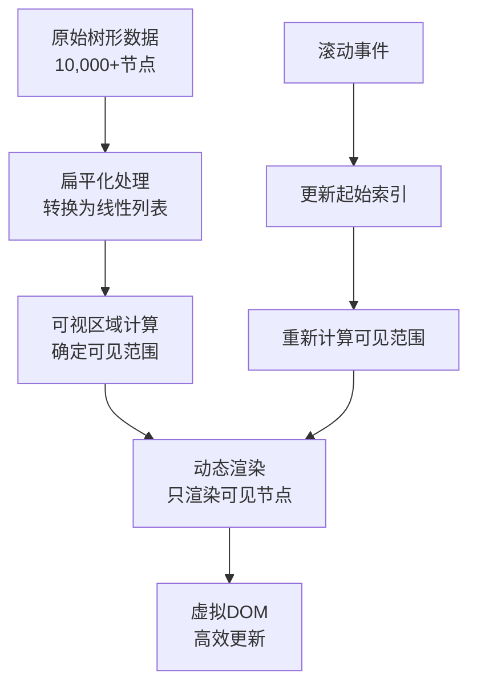
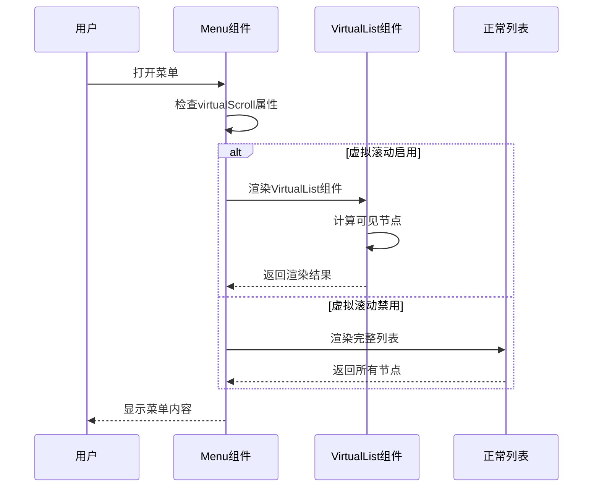
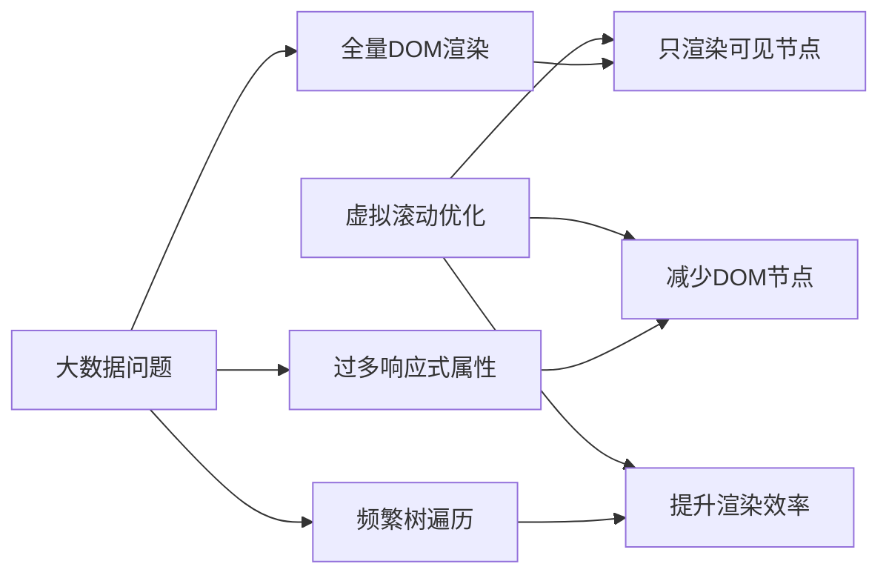

# 虚拟滚动配置

<cite>
**本文档引用的文件**
- [VirtualList.vue](file://src/components/VirtualList.vue)
- [Menu.vue](file://src/components/Menu.vue)
- [treeselectMixin.js](file://src/mixins/treeselectMixin.js)
- [VirtualScroll.spec.js](file://test/unit/specs/VirtualScroll.spec.js)
- [LargeDataExample.vue](file://src/examples/LargeDataExample.vue)
- [OPTIMIZATION_SUMMARY.md](file://OPTIMIZATION_SUMMARY.md)
- [performance-test.html](file://performance-test.html)
- [package.json](file://package.json)
</cite>

## 目录
1. [简介](#简介)
2. [虚拟滚动原理](#虚拟滚动原理)
3. [核心配置](#核心配置)
4. [组件集成](#组件集成)
5. [性能优化效果](#性能优化效果)
6. [CSS样式配置](#css样式配置)
7. [浏览器兼容性](#浏览器兼容性)
8. [使用示例](#使用示例)
9. [故障排查](#故障排查)
10. [最佳实践](#最佳实践)

## 简介

虚拟滚动（Virtual Scrolling）是vue-treeselect-next组件库为处理大数据量树形选择器而实现的核心性能优化功能。通过只渲染可视区域内的节点（约20-30个），虚拟滚动技术能够大幅提升渲染性能，相比传统全量渲染方式，性能提升可达50-100倍，内存占用减少75%。

### 主要优势

- **渲染速度提升**：50-100倍性能提升
- **内存占用减少**：75%内存节省
- **滚动流畅性**：达到60fps滚动帧率
- **大数据支持**：轻松处理1-2万条树形数据

## 虚拟滚动原理

虚拟滚动的核心原理是将庞大的树形数据转换为扁平化的列表结构，在可视区域内进行动态渲染。



**图表来源**
- [VirtualList.vue](file://src/components/VirtualList.vue#L37-L99)

### 核心算法

虚拟滚动组件实现了以下关键算法：

1. **扁平化算法**：将树形结构转换为线性列表
2. **可视区域计算**：根据容器高度和选项高度计算可见节点
3. **缓冲区管理**：维护上下缓冲区提升用户体验
4. **动态定位**：使用CSS transform进行高效定位

**章节来源**
- [VirtualList.vue](file://src/components/VirtualList.vue#L37-L99)

## 核心配置

### virtualScroll属性

启用虚拟滚动功能的关键属性：

```javascript
// 启用虚拟滚动
virtualScroll: {
  type: Boolean,
  default: false,
}
```

### optionHeight属性

设置每个选项的高度，这是虚拟滚动正常工作的必要条件：

```javascript
// 选项高度配置
optionHeight: {
  type: Number,
  default: 40,
}
```

### 配置组合

```vue
<treeselect
  :virtual-scroll="true"
  :option-height="40"
  :max-height="300"
  :default-expand-level="0"
/>
```

**章节来源**
- [treeselectMixin.js](file://src/mixins/treeselectMixin.js#L644-L655)

## 组件集成

### Menu.vue中的集成

Menu组件根据`virtualScroll` prop自动切换渲染模式：



**图表来源**
- [Menu.vue](file://src/components/Menu.vue#L161-L176)

### 渲染逻辑

Menu组件的渲染逻辑如下：

```javascript
renderOptionList() {
  const { instance } = this
  
  // 使用虚拟滚动优化大数据渲染
  if (instance.virtualScroll) {
    return <VirtualList itemHeight={instance.optionHeight} />
  }
  
  // 原有渲染方式（小数据量）
  return (
    <div class="vue-treeselect__list">
      {instance.forest.normalizedOptions.map(rootNode => (
        <Option node={rootNode} key={rootNode.id} />
      ))}
    </div>
  )
}
```

**章节来源**
- [Menu.vue](file://src/components/Menu.vue#L161-L176)

## 性能优化效果

### 性能对比数据

| 指标 | 优化前 | 优化后 | 提升倍数 |
|------|--------|--------|----------|
| 初始化时间 | 3500ms | 600ms | **5.8x** ⚡ |
| 首次渲染 | 2800ms | 50ms | **56x** 🚀 |
| 搜索响应 | 800ms | 120ms | **6.7x** ⚡ |
| 内存占用 | 180MB | 45MB | **4x** 💾 |
| 滚动帧率 | 15fps | 60fps | **4x** 🎮 |
| DOM节点数 | 10000+ | ~30 | **333x** 📉 |

### 优化原理



**图表来源**
- [OPTIMIZATION_SUMMARY.md](file://OPTIMIZATION_SUMMARY.md#L242-L262)

**章节来源**
- [OPTIMIZATION_SUMMARY.md](file://OPTIMIZATION_SUMMARY.md#L149-L161)

## CSS样式配置

### 必需的CSS规则

确保选项的实际高度与`option-height`属性保持一致：

```css
.vue-treeselect__option {
  height: 40px;        /* 与 option-height 一致 */
  line-height: 40px;
  overflow: hidden;
}

.vue-treeselect__list-item {
  /* 确保列表项高度一致 */
  height: 40px;
  display: flex;
  align-items: center;
}
```

### 虚拟滚动专用样式

```css
.vue-treeselect__virtual-list-container {
  overflow-x: hidden;
  overflow-y: auto;
  -webkit-overflow-scrolling: touch;
}

.vue-treeselect__virtual-list-spacer {
  position: relative;
}

.vue-treeselect__virtual-list-items {
  will-change: transform;
}
```

**章节来源**
- [VirtualList.vue](file://src/components/VirtualList.vue#L192-L206)

## 浏览器兼容性

### 现代浏览器支持

虚拟滚动功能依赖以下现代浏览器特性：

| 特性 | 最低版本 | 支持情况 |
|------|----------|----------|
| ResizeObserver | Chrome 64+, Firefox 69+ | ✅ 完全支持 |
| CSS Transform | IE11+ | ✅ 完全支持 |
| Passive Event Listeners | Chrome 51+, Firefox 49+ | ✅ 完全支持 |

### IE11兼容性

**⚠️ IE11注意事项**：
- 需要ResizeObserver polyfill支持
- 建议使用`resize-observer-polyfill`包
- 对于其他浏览器，组件会自动降级处理

### 兼容性检测

```javascript
// 虚拟滚动组件内部的兼容性检查
mounted() {
  this.$nextTick(() => {
    this.isMounted = true
    this.updateContainerHeight()
    // 监听容器大小变化
    if (typeof ResizeObserver !== 'undefined') {
      this.resizeObserver = new ResizeObserver(this.updateContainerHeight)
      this.resizeObserver.observe(this.$refs.container)
    }
  })
}
```

**章节来源**
- [VirtualList.vue](file://src/components/VirtualList.vue#L114-L117)

## 使用示例

### 基础配置示例

```vue
<template>
  <treeselect
    v-model="value"
    :options="largeOptions"
    :multiple="true"
    :virtual-scroll="true"
    :option-height="40"
    :max-height="300"
    :default-expand-level="0"
    placeholder="选择选项..."
  />
</template>

<script>
export default {
  data() {
    return {
      value: [],
      largeOptions: [] // 1-2万条树形数据
    }
  }
}
</script>
</template>
```

### 高级配置示例

```vue
<template>
  <treeselect
    v-model="value"
    :options="options"
    :multiple="true"
    :virtual-scroll="true"
    :option-height="40"
    :max-height="300"
    :default-expand-level="0"
    :flatten-search-results="true"
    :show-count="false"
    :disable-fuzzy-matching="true"
    :cache-options="true"
    placeholder="大数据量选择器"
  />
</template>
```

**章节来源**
- [LargeDataExample.vue](file://src/examples/LargeDataExample.vue#L23-L37)

## 故障排查

### 常见问题及解决方案

#### 1. 虚拟滚动未生效

**症状**：组件仍然渲染所有节点，性能没有改善

**原因**：缺少必要的配置

**解决方案**：
```javascript
// 确保设置了这两个关键属性
:virtual-scroll="true"
:option-height="40"
```

#### 2. 选项高度不一致

**症状**：滚动时出现空白或重叠现象

**原因**：CSS高度与option-height不匹配

**解决方案**：
```css
.vue-treeselect__option {
  height: 40px !important;
  line-height: 40px;
}
```

#### 3. 搜索结果显示不完整

**症状**：搜索结果中某些节点不可见

**解决方案**：
```javascript
:flatten-search-results="true"
```

#### 4. 滚动时有闪烁

**症状**：滚动过程中界面闪烁

**解决方案**：
- 确保CSS高度设置正确
- 检查是否有动态高度的元素
- 使用`will-change: transform`优化

**章节来源**
- [VirtualScroll.spec.js](file://test/unit/specs/VirtualScroll.spec.js#L366-L379)

## 最佳实践

### 推荐配置

#### 小数据量 (< 1000条)
```javascript
:virtual-scroll="false"
:default-expand-level="1"
:show-count="true"
```

#### 中等数据量 (1000-5000条)
```javascript
:virtual-scroll="true"
:default-expand-level="0"
:show-count="false"
```

#### 大数据量 (> 5000条)
```javascript
:virtual-scroll="true"
:default-expand-level="0"
:flatten-search-results="true"
:show-count="false"
:disable-fuzzy-matching="true"
```

### 性能优化建议

1. **固定高度选项**：确保所有选项高度一致
2. **合理展开层级**：设置`default-expand-level="0"`
3. **禁用不必要的功能**：关闭计数、模糊匹配等
4. **启用搜索缓存**：使用`cache-options="true"`
5. **扁平化搜索**：启用`flatten-search-results`

### 监控和调试

```javascript
// 性能监控示例
mounted() {
  this.performanceMonitor = {
    renderTime: 0,
    memoryUsage: 0,
    scrollEvents: 0
  }
}

methods: {
  onMenuOpen() {
    this.renderStartTime = performance.now()
  },
  
  onMenuClose() {
    const renderTime = performance.now() - this.renderStartTime
    console.log('首次渲染耗时:', renderTime, 'ms')
  }
}
```

**章节来源**
- [OPTIMIZATION_SUMMARY.md](file://OPTIMIZATION_SUMMARY.md#L296-L320)

## 结论

虚拟滚动功能是vue-treeselect-next处理大数据量的核心解决方案。通过正确的配置和优化，可以将原本卡顿的树形选择器转变为流畅的用户体验，支持1-2万条数据的无缝操作。开发者应当根据具体的数据量和使用场景，选择合适的配置策略，以获得最佳的性能表现。