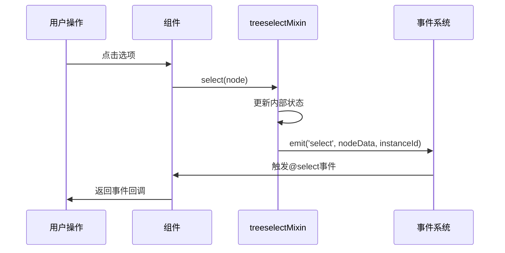
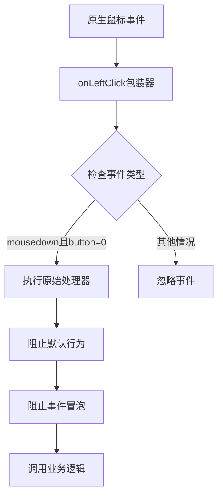
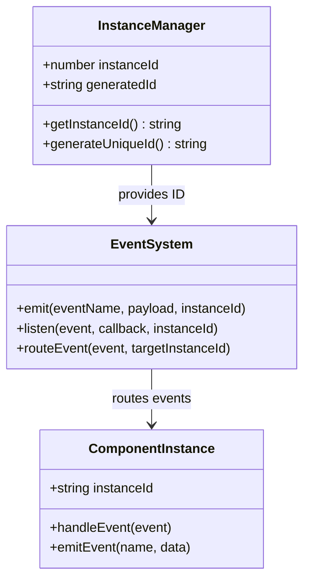
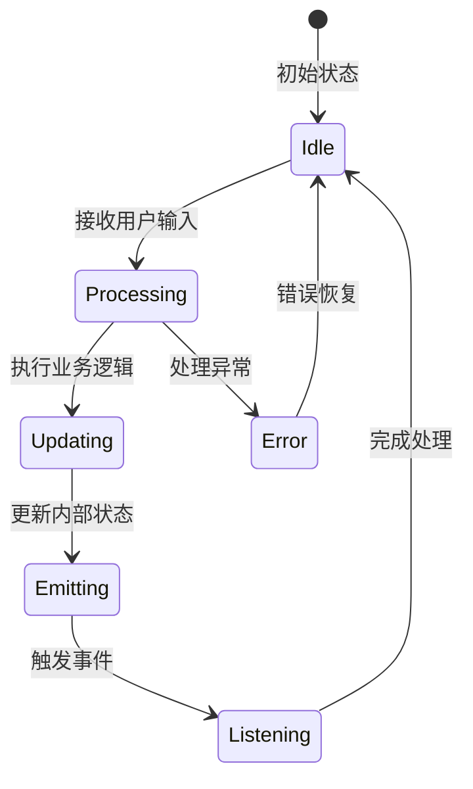

# 事件系统

<cite>
**本文档引用的文件**
- [treeselectMixin.js](file://src/mixins/treeselectMixin.js)
- [Control.vue](file://src/components/Control.vue)
- [Input.vue](file://src/components/Input.vue)
- [onLeftClick.js](file://src/utils/onLeftClick.js)
- [Events.spec.js](file://test/unit/specs/Events.spec.js)
- [Selecting.spec.js](file://test/unit/specs/Selecting.spec.js)
- [Methods.spec.js](file://test/unit/specs/Methods.spec.js)
</cite>

## 目录
1. [概述](#概述)
2. [核心事件类型](#核心事件类型)
3. [事件触发机制](#事件触发机制)
4. [实例ID系统](#实例id系统)
5. [事件传播控制](#事件传播控制)
6. [状态管理联动](#状态管理联动)
7. [实际使用示例](#实际使用示例)
8. [最佳实践](#最佳实践)

## 概述

vue-treeselect-next的事件系统是一个高度封装的组件级事件处理机制，它通过treeselectMixin提供了完整的事件生命周期管理。该系统不仅暴露了标准的Vue事件接口，还集成了复杂的用户交互逻辑和状态同步机制。

### 核心特性

- **语义化事件命名**：提供`@input`、`@select`、`@deselect`、`@open`、`@close`等语义明确的事件
- **自动状态同步**：事件触发时自动更新内部状态并触发视图更新
- **实例隔离**：每个组件实例都有独立的事件标识符
- **事件传播控制**：精确控制事件冒泡和默认行为

## 核心事件类型

### 输入事件

#### @input事件
- **触发时机**：当组件的内部值发生变化时
- **参数结构**：`(value, instanceId)`
- **用途**：用于双向绑定和值变化监听

#### @search-change事件
- **触发时机**：搜索查询发生变化时
- **参数结构**：`(searchQuery, instanceId)`
- **用途**：监听搜索状态变化

### 选择事件

#### @select事件
- **触发时机**：用户选择或取消选择节点时
- **参数结构**：`(nodeData, instanceId)`
- **用途**：监听节点选择状态变化

#### @deselect事件
- **触发时机**：用户取消选择节点时
- **参数结构**：`(nodeData, instanceId)`
- **用途**：监听节点取消选择状态变化

### 菜单事件

#### @open事件
- **触发时机**：菜单打开时
- **参数结构**：`(instanceId)`
- **用途**：监听菜单打开状态

#### @close事件
- **触发时机**：菜单关闭时
- **参数结构**：`(value, instanceId)`
- **用途**：监听菜单关闭状态



**图表来源**
- [treeselectMixin.js](file://src/mixins/treeselectMixin.js#L1784-L1823)
- [Control.vue](file://src/components/Control.vue#L119-L128)

**章节来源**
- [treeselectMixin.js](file://src/mixins/treeselectMixin.js#L1784-L1823)
- [Events.spec.js](file://test/unit/specs/Events.spec.js#L37-L62)

## 事件触发机制

### onLeftClick工具函数

事件系统的核心是`onLeftClick`工具函数，它负责处理原生DOM事件并将其转化为组件级语义事件。



**图表来源**
- [onLeftClick.js](file://src/utils/onLeftClick.js#L1-L8)

### 事件处理器映射

| DOM事件 | 组件事件 | 处理器位置 |
|---------|----------|------------|
| `mousedown` | `handleMouseDown` | Control.vue |
| `click` | `handleMouseDownOnX` | Control.vue |
| `click` | `handleMouseDownOnArrow` | Control.vue |
| `keydown` | `onKeyDown` | Input.vue |
| `focus` | `onFocus` | Input.vue |
| `blur` | `onBlur` | Input.vue |

**章节来源**
- [Control.vue](file://src/components/Control.vue#L87-L128)
- [Input.vue](file://src/components/Input.vue#L68-L203)

## 实例ID系统

### getInstanceId方法

每个treeselect组件实例都拥有唯一的`instanceId`，这是事件溯源和多实例管理的关键。



**图表来源**
- [treeselectMixin.js](file://src/mixins/treeselectMixin.js#L323-L326)

### 实例ID的作用

1. **事件路由**：确保事件只发送给特定实例
2. **调试支持**：便于开发者追踪事件来源
3. **多实例隔离**：避免不同实例间的事件冲突
4. **状态关联**：建立事件与具体组件实例的关联

**章节来源**
- [treeselectMixin.js](file://src/mixins/treeselectMixin.js#L323-L326)
- [treeselectMixin.js](file://src/mixins/treeselectMixin.js#L1749-L1750)

## 事件传播控制

### 默认行为阻止

事件系统实现了精确的默认行为控制：

```mermaid
flowchart TD
A[用户交互] --> B{需要阻止默认行为?}
B --> |是| C[evt.preventDefault()]
B --> |否| D[允许默认行为]
C --> E{需要阻止冒泡?}
D --> E
E --> |是| F[evt.stopPropagation()]
E --> |否| G[允许事件传播]
F --> H[事件终止]
G --> I[事件继续传播]
```

### 事件拦截策略

| 事件类型 | 阻止策略 | 原因 |
|----------|----------|------|
| 键盘导航 | 阻止默认滚动 | 避免页面滚动干扰 |
| 菜单点击 | 阻止冒泡 | 防止意外关闭 |
| 输入焦点 | 允许默认行为 | 维持输入功能 |
| 搜索输入 | 阻止默认行为 | 防止表单提交 |

**章节来源**
- [Input.vue](file://src/components/Input.vue#L137-L142)
- [Control.vue](file://src/components/Control.vue#L87-L128)

## 状态管理联动

### 事件与状态同步

事件系统与组件状态管理系统紧密集成，确保状态变更的原子性和一致性。



### 状态更新流程

1. **用户交互**：触发DOM事件
2. **事件转换**：onLeftClick包装器处理
3. **业务逻辑**：调用相应的处理方法
4. **状态更新**：修改内部状态
5. **事件发射**：触发Vue事件
6. **视图更新**：响应式更新UI

**章节来源**
- [treeselectMixin.js](file://src/mixins/treeselectMixin.js#L1784-L1823)
- [treeselectMixin.js](file://src/mixins/treeselectMixin.js#L1462-L1469)

## 实际使用示例

### 基本事件监听

```javascript
// 基本事件监听示例
export default {
  template: `
    <vue-treeselect
      v-model="selectedValue"
      :options="options"
      @select="handleSelect"
      @deselect="handleDeselect"
      @open="handleOpen"
      @close="handleClose"
      @input="handleInput"
    />
  `,
  methods: {
    handleSelect(nodeData, instanceId) {
      console.log('节点被选择:', nodeData, '来自实例:', instanceId);
      // 可以在这里进行额外的业务逻辑处理
    },
    
    handleDeselect(nodeData, instanceId) {
      console.log('节点被取消选择:', nodeData, '来自实例:', instanceId);
    },
    
    handleOpen(instanceId) {
      console.log('菜单打开:', instanceId);
      // 可以在这里进行初始化操作
    },
    
    handleClose(value, instanceId) {
      console.log('菜单关闭:', value, '来自实例:', instanceId);
      // 可以在这里进行清理操作
    },
    
    handleInput(newValue, instanceId) {
      console.log('值发生变化:', newValue, '来自实例:', instanceId);
      // 用于双向绑定的值变化监听
    }
  }
}
```

### 高级事件处理

```javascript
export default {
  methods: {
    // 条件性事件处理
    handleSelectWithValidation(nodeData, instanceId) {
      if (this.isValidSelection(nodeData)) {
        this.performSelection(nodeData);
      } else {
        this.showValidationError();
      }
    },
    
    // 异步事件处理
    async handleAsyncSelect(nodeData, instanceId) {
      try {
        const validationResult = await this.validateSelection(nodeData);
        if (validationResult.valid) {
          this.commitSelection(nodeData);
        } else {
          this.handleValidationFailure(validationResult.errors);
        }
      } catch (error) {
        this.handleError(error);
      }
    },
    
    // 事件组合处理
    handleCombinedEvents(eventType, eventData, instanceId) {
      const handlers = {
        select: this.handleSelect.bind(this),
        deselect: this.handleDeselect.bind(this),
        open: this.handleOpen.bind(this),
        close: this.handleClose.bind(this)
      };
      
      if (handlers[eventType]) {
        handlers[eventType](eventData, instanceId);
      }
    }
  }
}
```

### 多实例事件管理

```javascript
export default {
  data() {
    return {
      instances: {}
    };
  },
  
  methods: {
    // 动态添加实例监听
    addInstance(instanceId, options) {
      this.instances[instanceId] = {
        options,
        listeners: []
      };
      
      // 为新实例添加全局事件监听
      this.$on('treeselect-event', this.handleGlobalEvent);
    },
    
    // 移除实例监听
    removeInstance(instanceId) {
      if (this.instances[instanceId]) {
        // 清理相关监听器
        this.$off('treeselect-event', this.handleGlobalEvent);
        delete this.instances[instanceId];
      }
    },
    
    // 全局事件处理
    handleGlobalEvent(eventName, eventData, instanceId) {
      if (this.instances[instanceId]) {
        // 处理特定实例的事件
        this.processInstanceEvent(eventName, eventData, instanceId);
      }
    }
  }
}
```

**章节来源**
- [Events.spec.js](file://test/unit/specs/Events.spec.js#L37-L62)
- [Selecting.spec.js](file://test/unit/specs/Selecting.spec.js#L45-L69)

## 最佳实践

### 事件处理原则

1. **单一职责**：每个事件处理器只处理一种类型的事件
2. **幂等性**：事件处理器应该能够安全地重复调用
3. **错误处理**：始终包含适当的错误处理逻辑
4. **性能考虑**：避免在事件处理器中执行耗时操作

### 性能优化建议

```javascript
export default {
  methods: {
    // 使用防抖处理频繁事件
    handleSearchChange: debounce(function(searchQuery, instanceId) {
      this.performSearch(searchQuery);
    }, 300),
    
    // 使用节流限制事件频率
    handleScroll: throttle(function(event) {
      this.updateScrollPosition(event.target.scrollTop);
    }, 16),
    
    // 缓存事件处理结果
    handleSelectWithCache(nodeData, instanceId) {
      const cacheKey = `${instanceId}-${nodeData.id}`;
      if (this.selectionCache[cacheKey]) {
        return this.selectionCache[cacheKey];
      }
      
      const result = this.computeSelectionResult(nodeData);
      this.selectionCache[cacheKey] = result;
      return result;
    }
  }
}
```

### 调试和监控

```javascript
export default {
  created() {
    // 添加事件监听器用于调试
    this.$on('treeselect-event', this.debugEventListener);
  },
  
  methods: {
    debugEventListener(eventName, eventData, instanceId) {
      console.group(`Treeselect Event Debug`);
      console.log('Event:', eventName);
      console.log('Data:', eventData);
      console.log('Instance:', instanceId);
      console.log('Timestamp:', new Date().toISOString());
      console.groupEnd();
    },
    
    // 性能监控
    monitorEventPerformance(eventName, startTime) {
      const endTime = performance.now();
      const duration = endTime - startTime;
      
      if (duration > 100) {
        console.warn(`Slow event (${eventName}): ${duration.toFixed(2)}ms`);
      }
    }
  }
}
```

### 错误处理模式

```javascript
export default {
  methods: {
    safeEventHandler(handlerName, ...args) {
      try {
        return this[handlerName](...args);
      } catch (error) {
        this.handleError(error, handlerName, args);
        throw error; // 重新抛出以便上层处理
      }
    },
    
    handleError(error, context, args) {
      console.error('Event handler error:', {
        error,
        context,
        arguments: args,
        timestamp: new Date().toISOString()
      });
      
      // 发送错误报告
      this.reportError(error, context, args);
    }
  }
}
```

通过遵循这些最佳实践，可以构建出健壮、可维护且高性能的vue-treeselect-next事件处理系统。