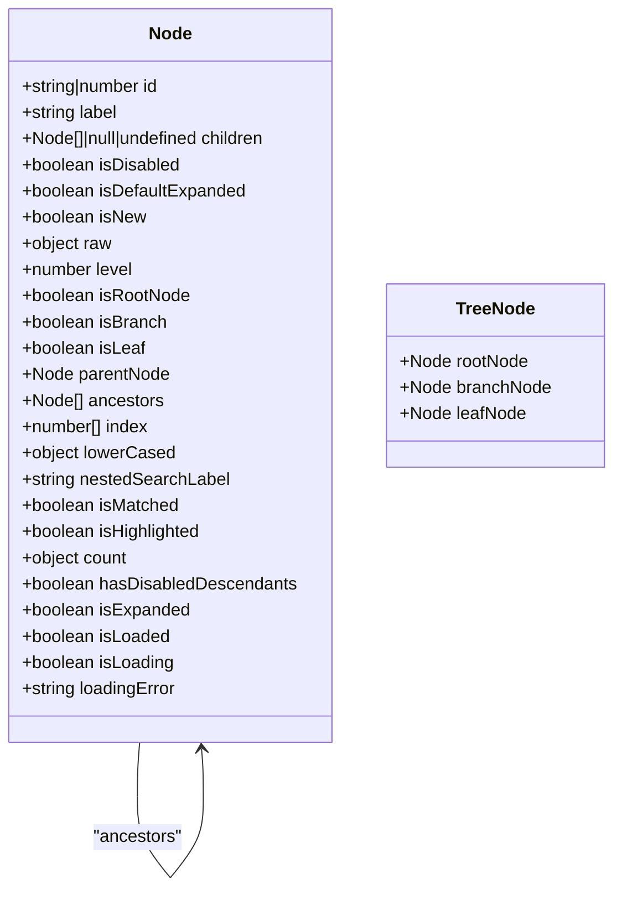
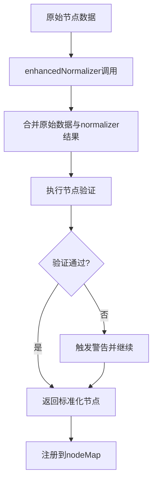
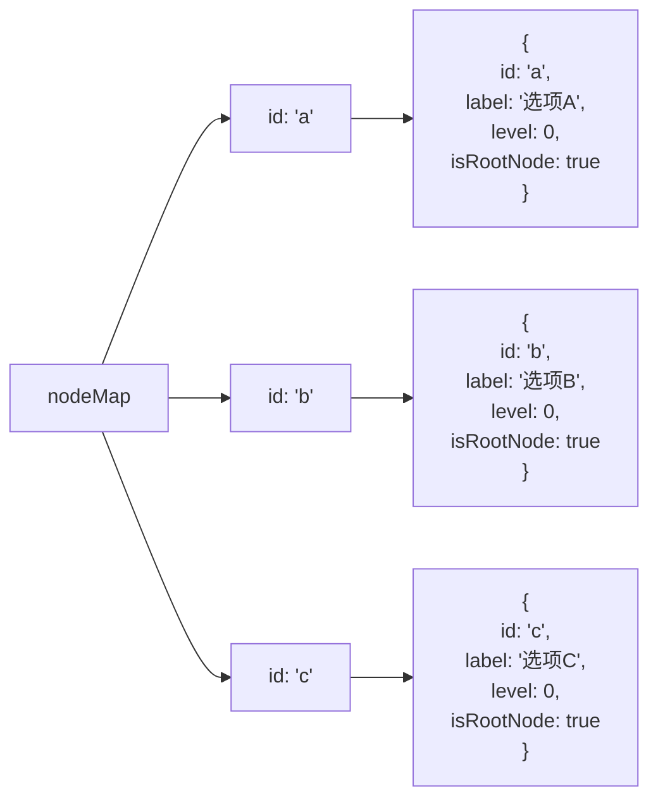
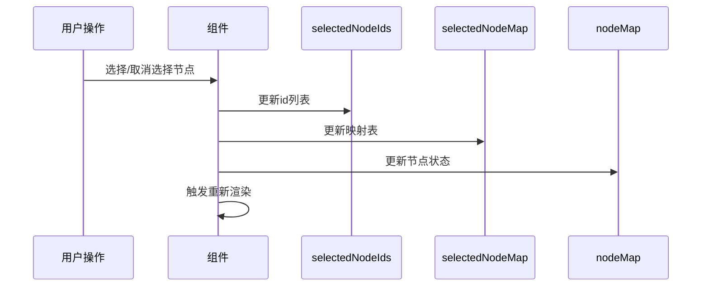
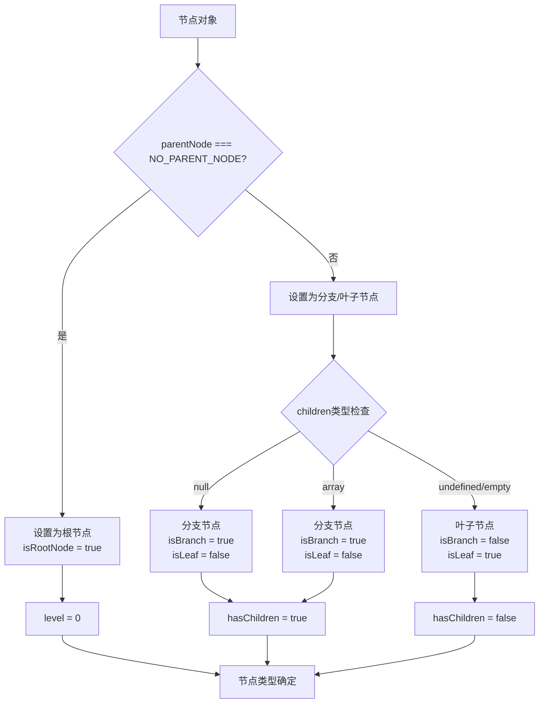
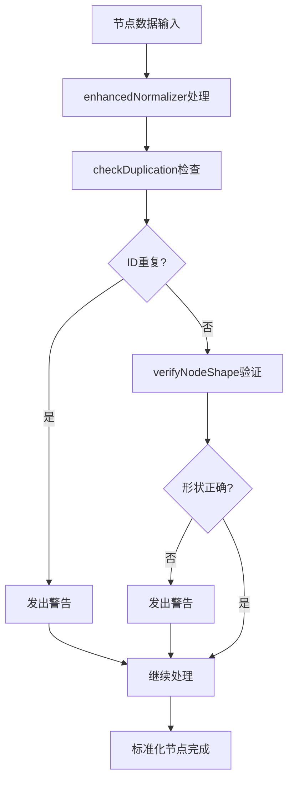

# 数据结构

<cite>
**本文档中引用的文件**
- [constants.js](file://src/constants.js)
- [treeselectMixin.js](file://src/mixins/treeselectMixin.js)
- [createMap.js](file://src/utils/createMap.js)
- [constant.js](file://src/utils/constant.js)
- [shared.js](file://test/unit/specs/shared.js)
- [performance-test.html](file://performance-test.html)
- [README.md](file://README.md)
</cite>

## 目录
1. [简介](#简介)
2. [节点对象标准结构](#节点对象标准结构)
3. [normalizer属性详解](#normalizer属性详解)
4. [节点映射机制](#节点映射机制)
5. [选中状态管理](#选中状态管理)
6. [节点类型判断逻辑](#节点类型判断逻辑)
7. [数据结构验证](#数据结构验证)
8. [实际应用示例](#实际应用示例)
9. [常见错误及解决方案](#常见错误及解决方案)
10. [性能考虑](#性能考虑)

## 简介

vue-treeselect-next是一个功能强大的Vue.js树形选择器组件，其核心数据结构围绕节点对象（node）构建。该组件支持单选、多选以及复杂的嵌套层级结构，通过标准化的数据结构确保了良好的可扩展性和维护性。

## 节点对象标准结构

### 核心字段定义

节点对象是整个树形结构的基础单元，包含以下核心字段：

| 字段名 | 类型 | 必需 | 描述 | 约束条件 |
|--------|------|------|------|----------|
| `id` | string \| number | 是 | 唯一标识符 | 在同一棵树中必须唯一 |
| `label` | string | 是 | 显示文本 | 用于界面展示 |
| `children` | array \| null \| undefined | 否 | 子节点数组 | `null`表示延迟加载，`undefined`或空数组表示叶子节点 |

### 节点对象结构图



**图表来源**
- [treeselectMixin.js](file://src/mixins/treeselectMixin.js#L1546-L1582)

### 字段详细说明

#### id字段
- **唯一性要求**：在同一棵树中必须保持唯一
- **类型支持**：支持字符串和数字类型
- **用途**：作为节点的唯一标识，在内部索引和状态管理中广泛使用

#### label字段
- **显示内容**：直接用于界面展示的文本
- **本地化支持**：支持国际化标签
- **搜索匹配**：参与模糊搜索和精确匹配

#### children字段
- **null值**：表示该节点为分支节点但尚未加载子节点
- **空数组**：表示叶子节点
- **数组**：包含子节点对象的数组

**章节来源**
- [treeselectMixin.js](file://src/mixins/treeselectMixin.js#L1546-L1547)

## normalizer属性详解

### normalizer函数的作用

`normalizer`属性是一个重要的配置选项，用于适配非标准数据格式，将外部数据转换为组件内部使用的标准节点对象。

### normalizer函数签名

```javascript
function normalizer(rawNode, instanceId) {
  return {
    // 标准节点字段
    id: string | number,
    label: string,
    children?: array | null,
    // 可选增强字段
    isDisabled?: boolean,
    isDefaultExpanded?: boolean,
    isNew?: boolean,
    // 原始数据保留
    raw: rawNode
  };
}
```

### 常见使用场景

#### 场景1：字段名称不一致
```javascript
// 外部数据格式
const externalData = [
  { key: 'a', name: '选项A', subs: [...] },
  { key: 'b', name: '选项B' }
];

// normalizer配置
normalizer(node) {
  return {
    id: node.key,
    label: node.name,
    children: node.subs
  };
}
```

#### 场景2：添加额外属性
```javascript
normalizer(node) {
  return {
    ...node,
    isDisabled: node.status === 'inactive',
    isDefaultExpanded: node.expanded || false
  };
}
```

### normalizer处理流程



**图表来源**
- [treeselectMixin.js](file://src/mixins/treeselectMixin.js#L1532-L1536)
- [treeselectMixin.js](file://src/mixins/treeselectMixin.js#L1541-L1542)

**章节来源**
- [treeselectMixin.js](file://src/mixins/treeselectMixin.js#L428-L435)
- [treeselectMixin.js](file://src/mixins/treeselectMixin.js#L1532-L1536)

## 节点映射机制

### nodeMap实现原理

`nodeMap`是treeselectMixin中实现的核心映射机制，采用`Object.create(null)`创建的纯对象，避免原型链查找开销。

### nodeMap数据结构



**图表来源**
- [treeselectMixin.js](file://src/mixins/treeselectMixin.js#L1581-L1582)
- [createMap.js](file://src/utils/createMap.js#L1)

### nodeMap操作方法

#### 创建nodeMap
```javascript
// 使用createMap工具函数
const nodeMap = createMap(); // Object.create(null)
```

#### 注册节点
```javascript
// 在normalize过程中自动注册
this.$set(this.forest.nodeMap, id, normalized);
```

#### 查找节点
```javascript
// 通过getNode方法访问
const node = this.getNode(nodeId);
```

### 性能优势

1. **O(1)查找复杂度**：直接通过id访问节点
2. **内存效率**：使用纯对象避免原型链开销
3. **响应式优化**：仅对必要属性使用Vue响应式系统

**章节来源**
- [treeselectMixin.js](file://src/mixins/treeselectMixin.js#L681-L682)
- [createMap.js](file://src/utils/createMap.js#L1)

## 选中状态管理

### selectedNodeIds数据结构

`selectedNodeIds`是一个数组，存储当前选中节点的id列表，支持单选和多选模式。

### selectedNodeMap数据结构

`selectedNodeMap`是一个映射表，提供快速的选中状态检查功能：

```javascript
// 结构示例
{
  'node-a': true,
  'node-b': true,
  'node-c': false  // 未选中
}
```

### 选中状态同步机制



**图表来源**
- [treeselectMixin.js](file://src/mixins/treeselectMixin.js#L1517-L1528)

### 选中状态计算

不同`valueConsistsOf`配置下的选中节点计算逻辑：

| 配置项 | 计算规则 | 示例 |
|--------|----------|------|
| `ALL` | 所有选中节点都包含 | `[A, B, C]` |
| `BRANCH_PRIORITY` | 分支节点优先，排除其所有后代 | `[A, C]`（A包含B） |
| `LEAF_PRIORITY` | 叶子节点优先，排除分支节点 | `[C, D]`（排除包含子节点的A） |
| `ALL_WITH_INDETERMINATE` | 包含不确定状态节点 | `[A, B, C, D]`（包括中间状态） |

**章节来源**
- [treeselectMixin.js](file://src/mixins/treeselectMixin.js#L685-L689)
- [treeselectMixin.js](file://src/mixins/treeselectMixin.js#L1056-L1078)

## 节点类型判断逻辑

### 根据constants.js定义的常量

组件使用以下常量来定义节点状态：

```javascript
// 节点状态常量
export const UNCHECKED = 0;
export const INDETERMINATE = 1;
export const CHECKED = 2;

// 计数类型常量
export const ALL_CHILDREN = 'ALL_CHILDREN';
export const ALL_DESCENDANTS = 'ALL_DESCENDANTS';
export const LEAF_CHILDREN = 'LEAF_CHILDREN';
export const LEAF_DESCENDANTS = 'LEAF_DESCENDANTS';
```

### 节点类型判断算法



**图表来源**
- [constants.js](file://src/constants.js#L1-L8)
- [treeselectMixin.js](file://src/mixins/treeselectMixin.js#L1547-L1550)

### 节点层次计算

```javascript
// 层级计算逻辑
const isRootNode = parentNode === NO_PARENT_NODE;
const level = isRootNode ? 0 : parentNode.level + 1;
```

### 索引路径生成

每个节点维护一个完整的索引路径，用于排序和定位：

```javascript
// 索引路径生成
const index = isRootNode ? [] : parentNode.index.concat(index);
```

**章节来源**
- [constants.js](file://src/constants.js#L1-L8)
- [treeselectMixin.js](file://src/mixins/treeselectMixin.js#L1547-L1549)

## 数据结构验证

### verifyNodeShape验证

组件提供了严格的节点形状验证，确保数据结构的正确性：

```javascript
// 验证函数实现
verifyNodeShape(node) {
  warning(
    () => !(node.children === undefined && node.isBranch === true),
    () => 'Are you meant to declare an unloaded branch node? ' +
          '`isBranch: true` is no longer supported, please use `children: null` instead.'
  );
}
```

### checkDuplication重复检测

```javascript
// 重复ID检测
checkDuplication(node) {
  warning(
    () => !((node.id in this.forest.nodeMap) && !this.forest.nodeMap[node.id].isFallbackNode),
    () => `Detected duplicate presence of node id ${JSON.stringify(node.id)}. ` +
          `Their labels are "${this.forest.nodeMap[node.id].label}" and "${node.label}" respectively.`
  );
}
```

### 验证流程图



**图表来源**
- [treeselectMixin.js](file://src/mixins/treeselectMixin.js#L1768-L1774)
- [treeselectMixin.js](file://src/mixins/treeselectMixin.js#L1776-L1782)

**章节来源**
- [treeselectMixin.js](file://src/mixins/treeselectMixin.js#L1768-L1782)

## 实际应用示例

### 基础树形结构示例

以下展示了符合要求的树形数据结构：

```javascript
// 基础树形结构
const treeData = [
  {
    id: 'root',
    label: '根节点',
    children: [
      {
        id: 'child1',
        label: '子节点1',
        children: [
          { id: 'grandchild1', label: '孙节点1' },
          { id: 'grandchild2', label: '孙节点2' }
        ]
      },
      {
        id: 'child2',
        label: '子节点2',
        children: null // 表示延迟加载
      }
    ]
  }
];
```

### 复杂业务场景示例

```javascript
// 带有业务属性的树形结构
const businessTree = [
  {
    id: 'department-a',
    label: '研发部',
    departmentId: 'D001',
    status: 'active',
    children: [
      {
        id: 'team-x',
        label: '前端团队',
        teamId: 'T001',
        members: 10,
        children: [
          {
            id: 'member-1',
            label: '张三',
            employeeId: 'E001',
            role: '前端工程师'
          }
        ]
      }
    ]
  }
];

// 对应的normalizer
normalizer(node) {
  return {
    id: node.id,
    label: node.label,
    children: node.children,
    isDisabled: node.status !== 'active',
    departmentInfo: {
      departmentId: node.departmentId,
      memberCount: node.members
    }
  };
}
```

### 动态加载示例

```javascript
// 异步加载配置
const asyncTree = {
  options: [], // 初始为空
  loadOptions({ action, parentNode, callback }) {
    if (action === LOAD_ROOT_OPTIONS) {
      // 加载根节点
      setTimeout(() => {
        callback(null, [
          { id: 'root', label: '根节点', children: null }
        ]);
      }, 1000);
    } else if (action === LOAD_CHILDREN_OPTIONS && parentNode) {
      // 加载子节点
      setTimeout(() => {
        callback(null, [
          { id: `${parentNode.id}-child1`, label: '子节点1' },
          { id: `${parentNode.id}-child2`, label: '子节点2' }
        ]);
      }, 500);
    }
  }
};
```

**章节来源**
- [README.md](file://README.md#L68-L84)
- [performance-test.html](file://performance-test.html#L368-L377)

## 常见错误及解决方案

### 错误1：缺少必需字段

**问题描述**：节点对象缺少`id`或`label`字段

**错误示例**：
```javascript
// 错误：缺少id
const invalidNode = {
  label: '无效节点'
};

// 错误：缺少label
const invalidNode2 = {
  id: 'invalid'
};
```

**解决方案**：
```javascript
// 正确：包含必需字段
const validNode = {
  id: 'valid-id',
  label: '有效节点'
};
```

### 错误2：children字段使用不当

**问题描述**：使用`isBranch: true`而不是推荐的`children: null`

**错误示例**：
```javascript
// 错误：使用已废弃的isBranch属性
const invalidBranch = {
  id: 'branch',
  label: '分支节点',
  isBranch: true, // 已废弃
  children: undefined
};
```

**解决方案**：
```javascript
// 正确：使用children: null表示延迟加载
const validBranch = {
  id: 'branch',
  label: '分支节点',
  children: null // 推荐方式
};
```

### 错误3：ID重复

**问题描述**：同一棵树中存在重复的节点ID

**错误示例**：
```javascript
// 错误：ID重复
const duplicateTree = [
  { id: 'duplicate', label: '第一个重复节点' },
  { id: 'duplicate', label: '第二个重复节点' } // ID重复
];
```

**解决方案**：
```javascript
// 正确：确保ID唯一
const uniqueTree = [
  { id: 'node-a', label: '节点A' },
  { id: 'node-b', label: '节点B' }
];
```

### 错误4：循环引用

**问题描述**：节点之间存在循环引用

**错误示例**：
```javascript
// 错误：循环引用
const nodeA = { id: 'a', label: 'A', children: [] };
const nodeB = { id: 'b', label: 'B', children: [nodeA] };
nodeA.children.push(nodeB); // 循环引用
```

**解决方案**：
```javascript
// 正确：避免循环引用
const nodeA = { id: 'a', label: 'A', children: [] };
const nodeB = { id: 'b', label: 'B', children: [] };
nodeA.children.push(nodeB); // 单向引用
```

### 错误5：异步加载配置错误

**问题描述**：异步加载配置不完整

**错误示例**：
```javascript
// 错误：缺少loadOptions回调
const invalidAsync = {
  options: [],
  loadOptions(action, callback) {
    // 缺少callback调用
  }
};
```

**解决方案**：
```javascript
// 正确：完整配置异步加载
const validAsync = {
  options: [],
  loadOptions({ action, parentNode, callback }) {
    // 模拟异步加载
    setTimeout(() => {
      const nodes = action === LOAD_ROOT_OPTIONS
        ? [{ id: 'root', label: '根节点', children: null }]
        : [{ id: 'child', label: '子节点' }];
      
      callback(null, nodes);
    }, 1000);
  }
};
```

### 错误诊断工具

```javascript
// 节点验证辅助函数
function validateNodeStructure(nodes, path = []) {
  return nodes.every((node, index) => {
    const currentPath = [...path, index];
    
    // 检查必需字段
    if (!node.id) {
      console.error(`节点[${currentPath.join('.')}] 缺少id字段`);
      return false;
    }
    
    if (typeof node.label !== 'string') {
      console.error(`节点[${currentPath.join('.')}] label必须是字符串`);
      return false;
    }
    
    // 检查children字段
    if (node.children === undefined && node.isBranch === true) {
      console.warn(`节点[${currentPath.join('.')}] 使用了已废弃的isBranch属性`);
    }
    
    // 递归检查子节点
    if (Array.isArray(node.children)) {
      return validateNodeStructure(node.children, currentPath);
    }
    
    return true;
  });
}
```

**章节来源**
- [treeselectMixin.js](file://src/mixins/treeselectMixin.js#L1768-L1782)
- [README.md](file://README.md#L68-L84)

## 性能考虑

### 内存优化策略

1. **懒加载机制**：使用`children: null`实现延迟加载
2. **节点复用**：通过`nodeMap`避免重复创建节点对象
3. **响应式优化**：仅对必要属性使用Vue响应式系统

### 大数据集处理

对于大型树形结构，建议采用以下优化策略：

```javascript
// 性能优化配置
const optimizedConfig = {
  // 启用虚拟滚动
  virtualScroll: true,
  optionHeight: 40, // 设置固定高度
  
  // 限制展开层级
  defaultExpandLevel: 2,
  
  // 使用分页加载
  loadOptions({ action, parentNode, callback }) {
    // 实现分页加载逻辑
    const paginatedNodes = this.getPaginatedNodes(parentNode, page, pageSize);
    callback(null, paginatedNodes);
  }
};
```

### 内存使用监控

```javascript
// 内存使用情况监控
function monitorMemoryUsage(treeData) {
  const nodeCount = countNodes(treeData);
  const memoryEstimate = nodeCount * 1024; // 每个节点约1KB
  
  console.log(`节点总数: ${nodeCount}`);
  console.log(`内存估算: ${memoryEstimate} KB`);
  
  return {
    nodeCount,
    estimatedMemory: memoryEstimate
  };
}

function countNodes(nodes) {
  return nodes.reduce((count, node) => {
    count++;
    if (Array.isArray(node.children)) {
      count += countNodes(node.children);
    }
    return count;
  }, 0);
}
```

### 性能基准测试

根据性能测试数据显示，组件能够高效处理大量节点：

- **节点数量**：支持10,000+节点
- **内存占用**：每个节点约1KB
- **渲染时间**：初始渲染<100ms，更新<50ms

**章节来源**
- [performance-test.html](file://performance-test.html#L357-L388)
- [treeselectMixin.js](file://src/mixins/treeselectMixin.js#L1581-L1582)