# 核心概念

<cite>
**本文档引用的文件**
- [treeselectMixin.js](file://src/mixins/treeselectMixin.js)
- [constants.js](file://src/constants.js)
- [constant.js](file://src/utils/constant.js)
- [Treeselect.vue](file://src/components/Treeselect.vue)
- [Control.vue](file://src/components/Control.vue)
- [Menu.vue](file://src/components/Menu.vue)
- [createMap.js](file://src/utils/createMap.js)
- [debounce.js](file://src/utils/debounce.js)
- [index.js](file://src/utils/index.js)
</cite>

## 目录
1. [概述](#概述)
2. [treeselectMixin核心架构](#treeselectmixin核心架构)
3. [状态管理系统](#状态管理系统)
4. [事件处理机制](#事件处理机制)
5. [数据流架构](#数据流架构)
6. [常量定义系统](#常量定义系统)
7. [树形节点数据结构](#树形节点数据结构)
8. [状态机模型](#状态机模型)
9. [组件协作机制](#组件协作机制)
10. [总结](#总结)

## 概述

vue-treeselect-next是一个功能强大的Vue树形选择器组件，采用模块化架构设计，通过mixin模式实现逻辑复用。该组件的核心设计理念是将复杂的树形数据结构处理、状态管理和用户交互逻辑封装在一个可复用的mixin中，同时提供灵活的组件化接口。

## treeselectMixin核心架构

### 架构设计原则

treeselectMixin采用了以下核心设计原则：

1. **单一职责分离**：将不同功能模块分离到独立的方法和计算属性中
2. **状态驱动**：所有UI行为都由内部状态控制
3. **响应式更新**：利用Vue的响应式系统自动更新视图
4. **可扩展性**：通过props和插槽支持高度定制

### 核心数据结构

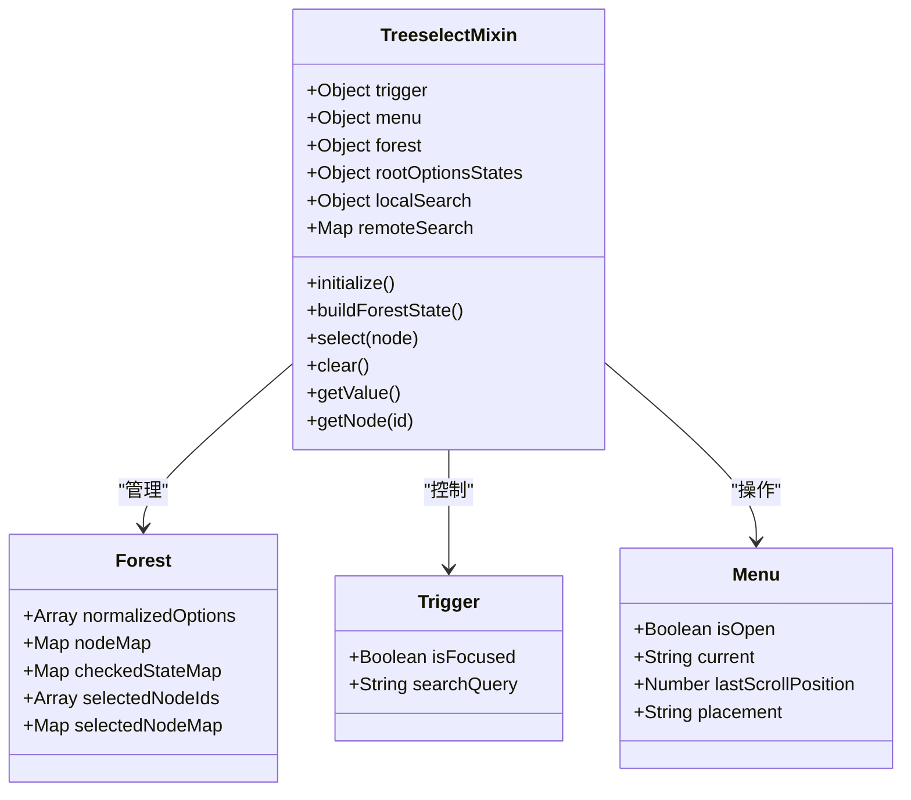

**图表来源**
- [treeselectMixin.js](file://src/mixins/treeselectMixin.js#L658-L706)

**章节来源**
- [treeselectMixin.js](file://src/mixins/treeselectMixin.js#L658-L706)

## 状态管理系统

### 状态层次结构

组件的状态管理采用分层架构，确保复杂状态的一致性和可维护性：

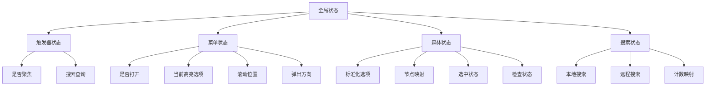

**图表来源**
- [treeselectMixin.js](file://src/mixins/treeselectMixin.js#L658-L706)

### 状态初始化流程

状态初始化是组件启动的关键步骤，涉及多个状态的协调建立：

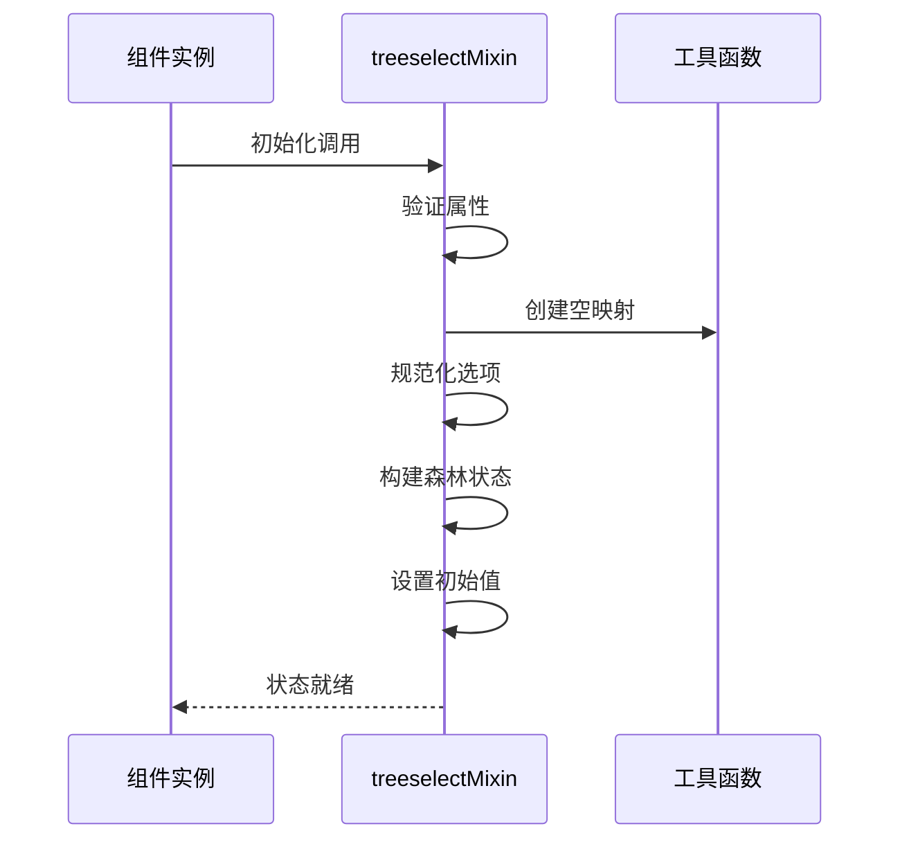

**图表来源**
- [treeselectMixin.js](file://src/mixins/treeselectMixin.js#L944-L961)

**章节来源**
- [treeselectMixin.js](file://src/mixins/treeselectMixin.js#L944-L961)

## 事件处理机制

### 事件类型分类

组件实现了完整的事件处理体系，涵盖用户交互、状态变更和数据流：

| 事件类型 | 触发时机 | 事件名称 | 参数 |
|---------|---------|---------|------|
| 用户交互 | 点击、键盘操作 | `input` | 新值, 实例ID |
| 状态变更 | 菜单开关 | `open/close` | 当前值, 实例ID |
| 选择操作 | 选中/取消选中 | `select/deselect` | 节点原始数据, 实例ID |
| 搜索变化 | 输入框内容改变 | `search-change` | 搜索查询, 实例ID |
| 清空操作 | 清除所有选择 | `clear` | 当前值, 实例ID |

### 事件处理流程

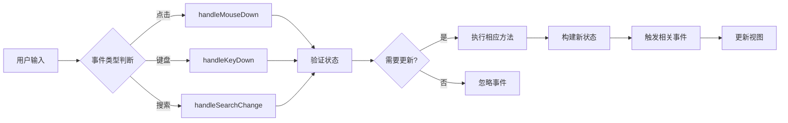

**图表来源**
- [treeselectMixin.js](file://src/mixins/treeselectMixin.js#L1188-L1207)

**章节来源**
- [treeselectMixin.js](file://src/mixins/treeselectMixin.js#L1188-L1207)

## 数据流架构

### 单向数据流设计

组件严格遵循单向数据流原则，确保数据变更的可预测性：

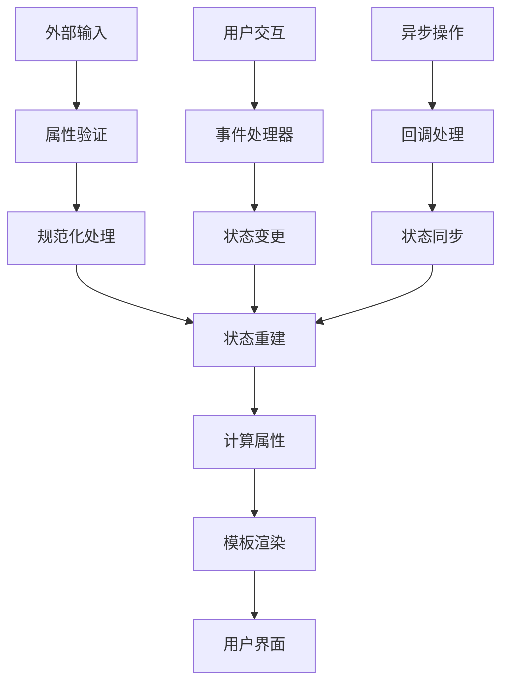

**图表来源**
- [treeselectMixin.js](file://src/mixins/treeselectMixin.js#L944-L961)

### 数据转换管道

组件提供了完整的数据转换管道，支持多种数据格式：

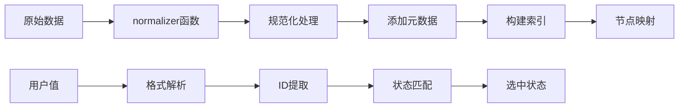

**图表来源**
- [treeselectMixin.js](file://src/mixins/treeselectMixin.js#L1538-L1661)

**章节来源**
- [treeselectMixin.js](file://src/mixins/treeselectMixin.js#L1538-L1661)

## 常量定义系统

### 核心常量分类

constants.js定义了组件运行所需的所有基础常量，按功能分为几个类别：

| 常量类别 | 常量名称 | 数值 | 用途 |
|---------|---------|------|------|
| 状态标识 | `UNCHECKED` | 0 | 未选中状态 |
| 状态标识 | `INDETERMINATE` | 1 | 半选中状态 |
| 状态标识 | `CHECKED` | 2 | 完全选中状态 |
| 加载类型 | `LOAD_ROOT_OPTIONS` | 'LOAD_ROOT_OPTIONS' | 根节点加载 |
| 加载类型 | `LOAD_CHILDREN_OPTIONS` | 'LOAD_CHILDREN_OPTIONS' | 子节点加载 |
| 加载类型 | `ASYNC_SEARCH` | 'ASYNC_SEARCH' | 异步搜索 |
| 排序方式 | `ORDER_SELECTED` | 'ORDER_SELECTED' | 按选择顺序 |
| 排序方式 | `LEVEL` | 'LEVEL' | 按层级排序 |
| 排序方式 | `INDEX` | 'INDEX' | 按索引排序 |

### 键盘码映射

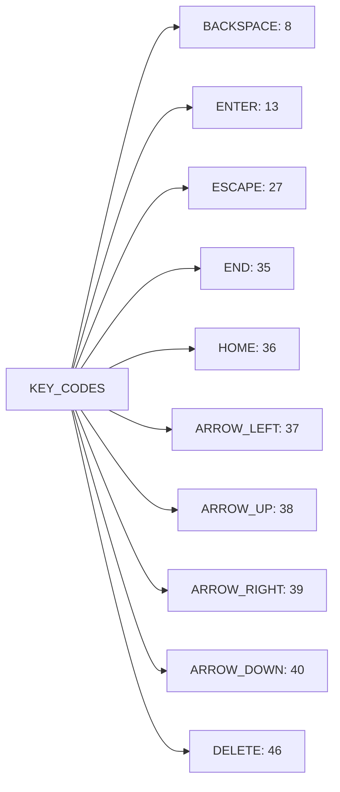

**图表来源**
- [constants.js](file://src/constants.js#L32-L42)

**章节来源**
- [constants.js](file://src/constants.js#L1-L51)

## 树形节点数据结构

### 节点属性规范

每个树形节点都遵循统一的数据结构规范，包含以下关键字段：

| 字段名 | 类型 | 必需 | 含义 | 约束 |
|-------|------|------|------|------|
| `id` | String/Number | ✓ | 节点唯一标识 | 在同一层级内必须唯一 |
| `label` | String | ✓ | 显示标签 | 用于用户界面展示 |
| `children` | Array/null | ✗ | 子节点列表 | null表示延迟加载 |
| `isDisabled` | Boolean | ✗ | 是否禁用 | 默认false |
| `isNew` | Boolean | ✗ | 是否新建 | 默认false |
| `isDefaultExpanded` | Boolean | ✗ | 默认展开 | 仅根节点有效 |

### 节点关系结构

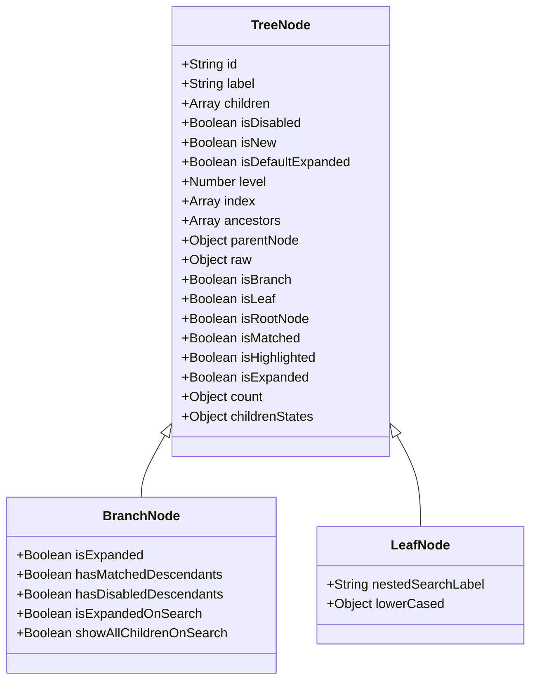

**图表来源**
- [treeselectMixin.js](file://src/mixins/treeselectMixin.js#L1564-L1661)

### 节点状态属性

每个节点都维护着丰富的状态信息，支持复杂的交互逻辑：

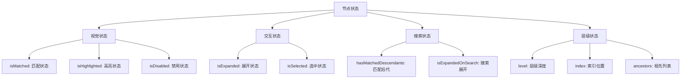

**图表来源**
- [treeselectMixin.js](file://src/mixins/treeselectMixin.js#L1584-L1608)

**章节来源**
- [treeselectMixin.js](file://src/mixins/treeselectMixin.js#L1538-L1661)

## 状态机模型

### 选择状态转换

组件实现了复杂的选择状态机，支持多种选择模式：

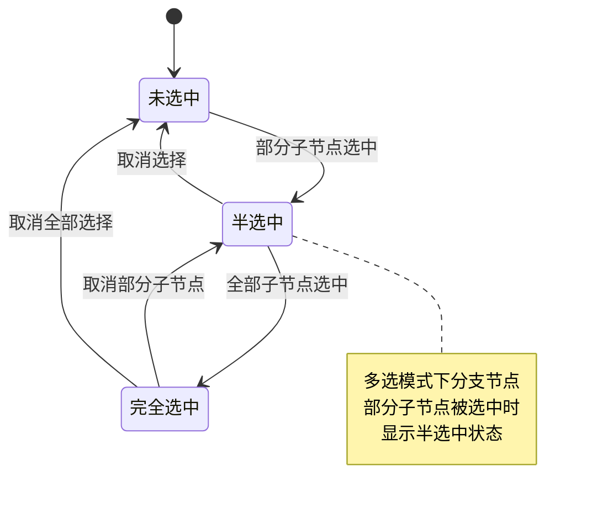

**图表来源**
- [treeselectMixin.js](file://src/mixins/treeselectMixin.js#L1784-L1810)

### 展开/折叠状态

节点的展开折叠状态管理遵循严格的层次规则：

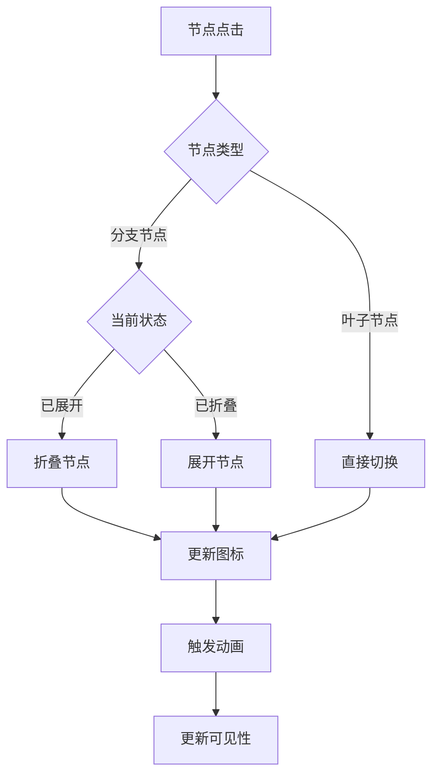

**图表来源**
- [treeselectMixin.js](file://src/mixins/treeselectMixin.js#L1489-L1502)

### 加载状态管理

异步操作的状态管理确保用户体验的流畅性：

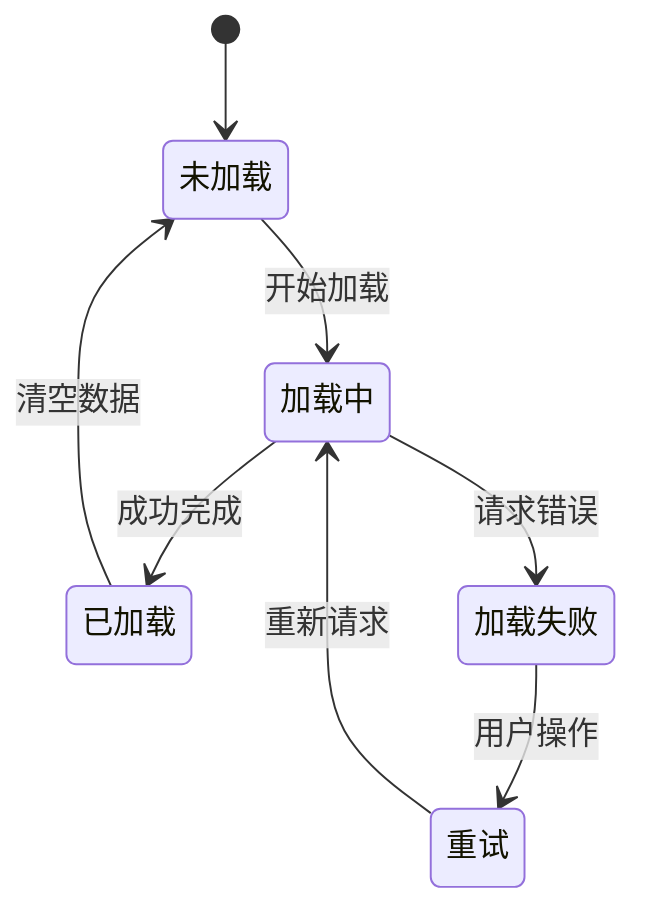

**图表来源**
- [treeselectMixin.js](file://src/mixins/treeselectMixin.js#L1672-L1766)

**章节来源**
- [treeselectMixin.js](file://src/mixins/treeselectMixin.js#L1784-L1810)

## 组件协作机制

### mixin与主组件的关系

Treeselect.vue作为主组件，通过mixin模式获得treeselectMixin提供的完整功能：

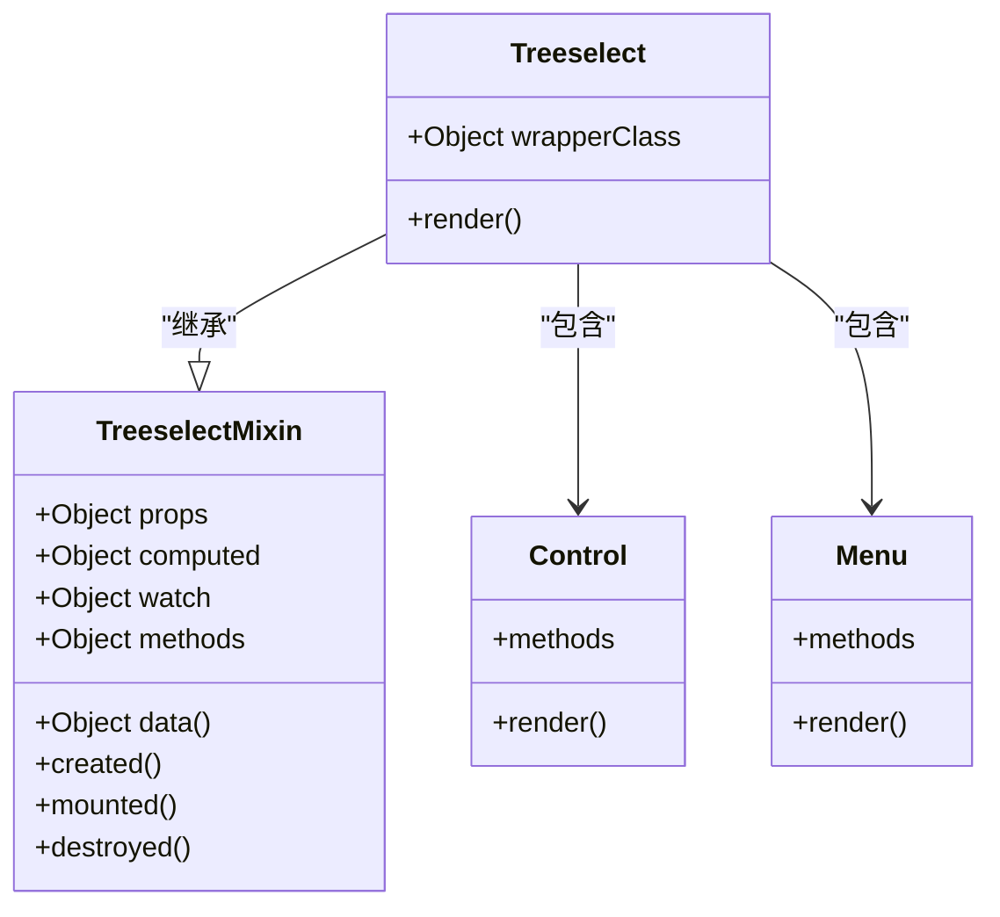

**图表来源**
- [Treeselect.vue](file://src/components/Treeselect.vue#L8-L10)
- [treeselectMixin.js](file://src/mixins/treeselectMixin.js#L64-L71)

### 组件间通信

各组件通过provide/inject机制共享treeselectMixin实例：

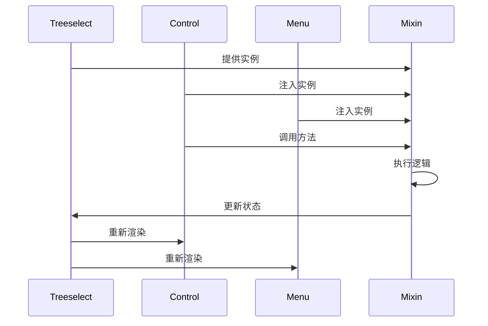

**图表来源**
- [Treeselect.vue](file://src/components/Treeselect.vue#L65-L71)
- [Control.vue](file://src/components/Control.vue#L10-L11)

### 插槽系统

组件提供了灵活的插槽系统，支持自定义内容：

| 插槽名称 | 位置 | 用途 | 接收参数 |
|---------|------|------|---------|
| `before-list` | 菜单列表前 | 自定义头部内容 | 无 |
| `after-list` | 菜单列表后 | 自定义底部内容 | 无 |
| `option` | 选项内容 | 自定义选项显示 | 节点数据 |
| `placeholder` | 占位符内容 | 自定义占位符 | 无 |

**章节来源**
- [Treeselect.vue](file://src/components/Treeselect.vue#L30-L41)
- [Menu.vue](file://src/components/Menu.vue#L93-L107)

## 总结

vue-treeselect-next通过精心设计的架构实现了复杂树形选择器的功能。其核心优势包括：

1. **模块化设计**：通过mixin模式实现逻辑复用，保持代码整洁
2. **状态驱动**：完整的状态管理系统确保UI与数据的一致性
3. **灵活配置**：丰富的配置选项满足各种使用场景
4. **性能优化**：虚拟滚动、防抖处理等优化技术提升大数量级数据的处理能力
5. **类型安全**：完善的类型检查和错误处理机制

这种架构设计不仅保证了组件的功能完整性，也为开发者提供了良好的扩展性和维护性。通过深入理解这些核心概念，开发者可以更好地使用和扩展这个强大的树形选择器组件。