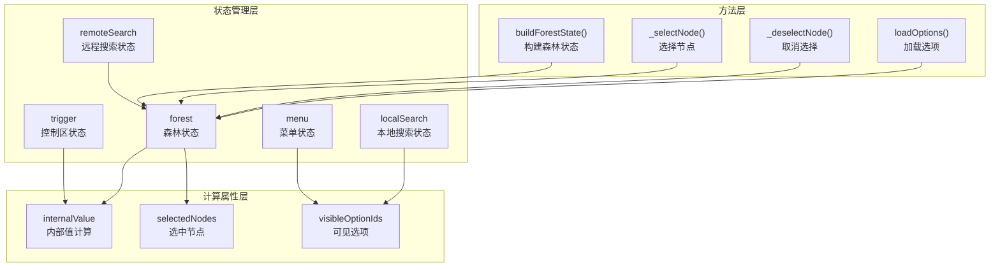
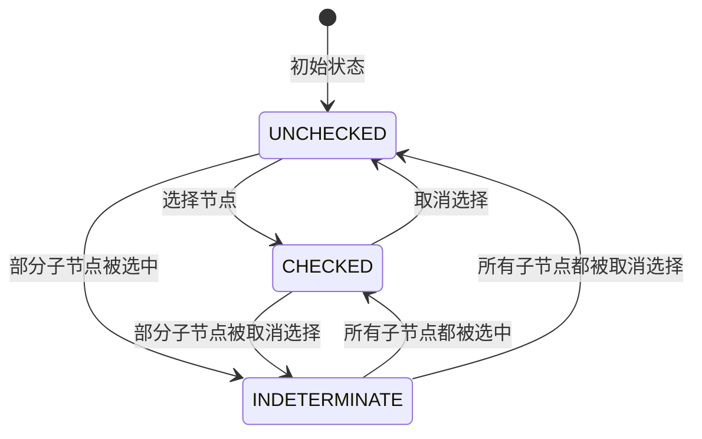
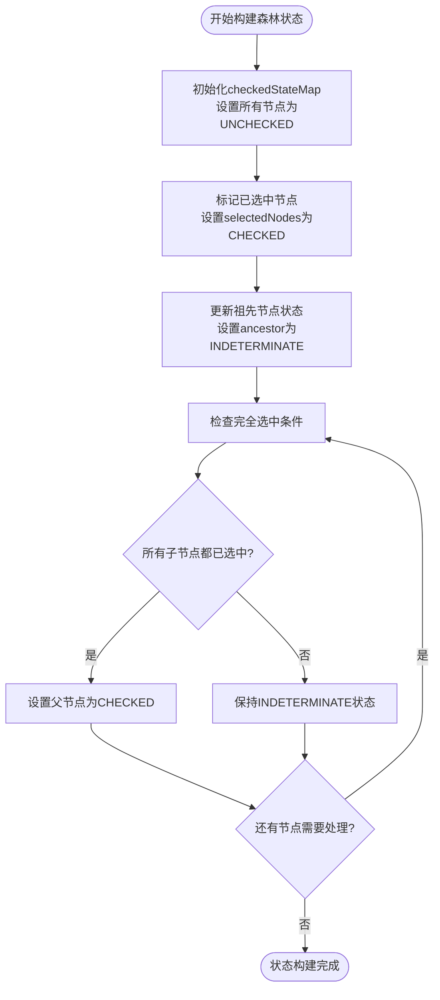
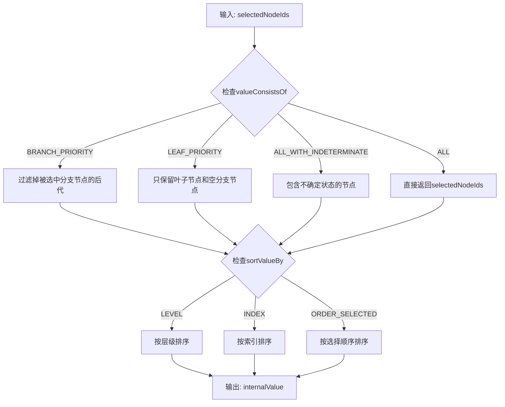
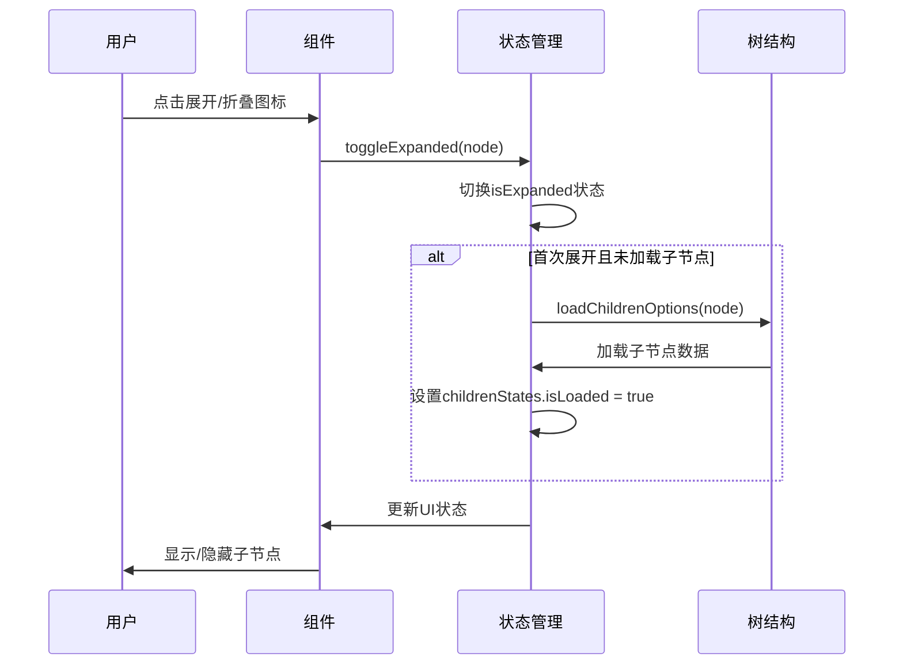
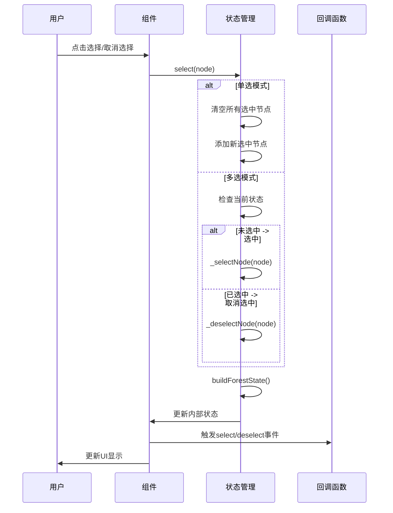

# 状态管理

<cite>
**本文档中引用的文件**
- [treeselectMixin.js](file://src/mixins/treeselectMixin.js)
- [constants.js](file://src/constants.js)
- [Treeselect.vue](file://src/components/Treeselect.vue)
- [createMap.js](file://src/utils/createMap.js)
</cite>

## 目录
1. [概述](#概述)
2. [状态管理体系架构](#状态管理体系架构)
3. [核心状态对象详解](#核心状态对象详解)
4. [checkedStateMap状态管理机制](#checkedstatemap状态管理机制)
5. [internalValue计算属性](#internalvalue计算属性)
6. [状态转换与响应逻辑](#状态转换与响应逻辑)
7. [状态管理最佳实践](#状态管理最佳实践)
8. [总结](#总结)

## 概述

vue-treeselect-next采用了一套精密的状态管理体系来管理复杂的树形选择器的各种状态。该体系通过多个专门的状态对象协同工作，实现了对用户交互、数据加载、搜索过滤、选中状态等全方位的精确控制。

核心状态管理体系包含五个主要状态对象：
- **trigger（控制区状态）**：管理输入框焦点、搜索查询等用户交互状态
- **menu（菜单状态）**：控制菜单的打开关闭、高亮选项、滚动位置等
- **forest（森林状态）**：维护整个树形结构的数据状态和选中状态映射
- **localSearch（本地搜索状态）**：处理本地搜索功能的状态管理
- **remoteSearch（远程搜索状态）**：管理异步搜索和远程数据加载状态

## 状态管理体系架构



**图表来源**
- [treeselectMixin.js](file://src/mixins/treeselectMixin.js#L658-L706)

**章节来源**
- [treeselectMixin.js](file://src/mixins/treeselectMixin.js#L658-L706)

## 核心状态对象详解

### trigger 控制区状态

trigger状态对象负责管理用户界面的交互状态，主要包括：

```javascript
trigger: {
  // 是否获得焦点
  isFocused: false,
  // 用户输入的搜索查询
  searchQuery: '',
}
```

**功能特性：**
- **isFocused**：跟踪控制区是否获得焦点，影响样式和键盘导航
- **searchQuery**：存储当前的搜索文本，触发搜索逻辑的入口点

**触发机制：**
- 输入框聚焦时设置为`true`
- 失去焦点时重置为空字符串
- 搜索查询变化时更新对应的值

### menu 菜单状态

menu状态对象管理菜单组件的各种状态：

```javascript
menu: {
  // 菜单是否打开
  isOpen: false,
  // 当前高亮的选项ID
  current: null,
  // 最后一次菜单关闭时的滚动位置
  lastScrollPosition: 0,
  // 菜单打开方向
  placement: 'bottom',
}
```

**功能特性：**
- **isOpen**：控制菜单的显示和隐藏
- **current**：跟踪当前高亮的选项，支持键盘导航
- **lastScrollPosition**：保存和恢复菜单滚动位置
- **placement**：确定菜单的显示位置（自动、上方、下方）

### forest 森林状态

forest是状态管理体系中最复杂和重要的部分，维护整个树形结构的状态：

```javascript
forest: {
  // 规范化后的选项列表
  normalizedOptions: [],
  // <id, node>映射，用于快速查找
  nodeMap: createMap(),
  // <id, checkedState>映射，多选模式下的选中状态
  checkedStateMap: createMap(),
  // 已选中节点的ID列表
  selectedNodeIds: [],
  // <id, true>映射，用于快速检查节点是否已选中
  selectedNodeMap: createMap(),
}
```

**核心功能：**
- **nodeMap**：提供O(1)时间复杂度的节点查找能力
- **checkedStateMap**：管理多选模式下的三种状态（未选中、不确定、已选中）
- **selectedNodeIds**：维护选中节点的有序列表
- **selectedNodeMap**：优化选中状态检查的性能

### localSearch 本地搜索状态

本地搜索状态管理本地搜索功能：

```javascript
localSearch: {
  // 是否处于搜索模式
  active: false,
  // 搜索是否有结果
  noResults: true,
  // 匹配计数映射
  countMap: createMap(),
}
```

**功能特性：**
- **active**：标识是否正在进行本地搜索
- **noResults**：指示搜索是否找到匹配项
- **countMap**：记录每个节点的匹配子节点数量

### remoteSearch 远程搜索状态

远程搜索状态管理异步搜索和远程数据加载：

```javascript
remoteSearch: createMap(),
```

**功能特性：**
- 基于搜索查询的缓存机制
- 异步数据加载状态管理
- 错误处理和重试机制

**章节来源**
- [treeselectMixin.js](file://src/mixins/treeselectMixin.js#L658-L706)

## checkedStateMap状态管理机制

checkedStateMap是多选模式下状态管理的核心，它维护了每个节点的三种状态：



**图表来源**
- [constants.js](file://src/constants.js#L4-L8)

### 状态定义

根据constants.js中的定义：

| 状态 | 数值 | 描述 |
|------|------|------|
| UNCHECKED | 0 | 未选中状态 |
| INDETERMINATE | 1 | 不确定状态（部分子节点被选中） |
| CHECKED | 2 | 已选中状态 |

### 父子节点联动机制

在非扁平模式下，节点状态具有以下联动规则：

1. **完全选中规则**：当一个分支节点的所有子节点都被选中时，该节点变为已选中状态
2. **部分选中规则**：当一个分支节点只有部分子节点被选中时，该节点变为不确定状态
3. **祖先状态传播**：选中节点时，其所有祖先节点都变为不确定状态
4. **后代状态同步**：取消选中节点时，其所有后代节点都会被取消选中

### 状态构建过程

buildForestState方法负责构建和更新checkedStateMap：



**图表来源**
- [treeselectMixin.js](file://src/mixins/treeselectMixin.js#L1504-L1530)

**章节来源**
- [treeselectMixin.js](file://src/mixins/treeselectMixin.js#L1504-L1530)

## internalValue计算属性

internalValue是状态管理体系中的关键计算属性，它根据不同的配置生成最终的值：

### 计算逻辑



**图表来源**
- [treeselectMixin.js](file://src/mixins/treeselectMixin.js#L722-L759)

### 配置选项详解

| valueConsistsOf | 行为描述 |
|-----------------|----------|
| ALL | 包含所有选中的节点，无论是否被祖先节点包含 |
| BRANCH_PRIORITY | 如果分支节点被选中，则排除其所有后代节点 |
| LEAF_PRIORITY | 只包含叶子节点，或空分支节点 |
| ALL_WITH_INDETERMINATE | 包含所有选中的节点，加上不确定状态的节点 |

### 排序选项

| sortValueBy | 排序依据 |
|-------------|----------|
| ORDER_SELECTED | 按节点被选择的顺序排序 |
| LEVEL | 按节点的层级深度排序 |
| INDEX | 按节点在树中的具体索引位置排序 |

**章节来源**
- [treeselectMixin.js](file://src/mixins/treeselectMixin.js#L722-L759)

## 状态转换与响应逻辑

### 展开/折叠状态管理



**图表来源**
- [treeselectMixin.js](file://src/mixins/treeselectMixin.js#L1489-L1502)

### 选中/取消选中状态转换



**图表来源**
- [treeselectMixin.js](file://src/mixins/treeselectMixin.js#L1784-L1803)

### 加载中状态管理

状态管理体系通过多种状态标志来管理各种加载场景：

| 状态类型 | 状态标志 | 触发条件 | 响应行为 |
|----------|----------|----------|----------|
| 根选项加载 | rootOptionsStates.isLoading | 调用loadRootOptions | 显示加载指示器 |
| 子节点加载 | node.childrenStates.isLoading | 展开分支节点 | 显示加载指示器 |
| 远程搜索 | remoteSearch.isLoading | 执行异步搜索 | 显示加载指示器 |
| 数据错误 | loadingError | 加载失败 | 显示错误信息和重试按钮 |

**章节来源**
- [treeselectMixin.js](file://src/mixins/treeselectMixin.js#L1672-L1728)

## 状态管理最佳实践

### 性能优化策略

1. **状态缓存**：使用createMap()创建无原型链的对象，避免hasOwnProperty检查
2. **增量更新**：只更新发生变化的状态，避免全量重新渲染
3. **防抖处理**：对频繁触发的操作（如搜索）使用防抖机制
4. **懒加载**：按需加载子节点数据，减少初始加载时间

### 状态一致性保证


### 错误处理机制

状态管理体系包含了完善的错误处理机制：

- **数据验证**：检查节点ID重复、节点形状错误等问题
- **边界情况处理**：处理空数据、无效状态等情况
- **降级策略**：当数据加载失败时提供备用方案

**章节来源**
- [treeselectMixin.js](file://src/mixins/treeselectMixin.js#L1768-L1782)

## 总结

vue-treeselect-next的状态管理体系是一个精心设计的多层架构，通过五个专门的状态对象协同工作，实现了对复杂树形选择器的全面状态管理。

### 核心优势

1. **模块化设计**：每个状态对象职责明确，便于维护和扩展
2. **高性能**：使用Map数据结构和缓存机制，确保操作的高效性
3. **灵活性**：支持多种配置选项，适应不同的使用场景
4. **一致性**：通过严格的验证和同步机制，保证状态的一致性

### 设计亮点

- **checkedStateMap的三态模型**：完美解决了父子节点联动的问题
- **internalValue的智能计算**：根据配置自动生成最终值
- **异步状态管理**：优雅地处理了各种异步操作状态
- **响应式设计**：充分利用Vue的响应式系统，实现自动更新

这套状态管理体系不仅保证了组件的功能完整性，也为开发者提供了强大而灵活的定制能力，是现代前端组件库状态管理的优秀范例。