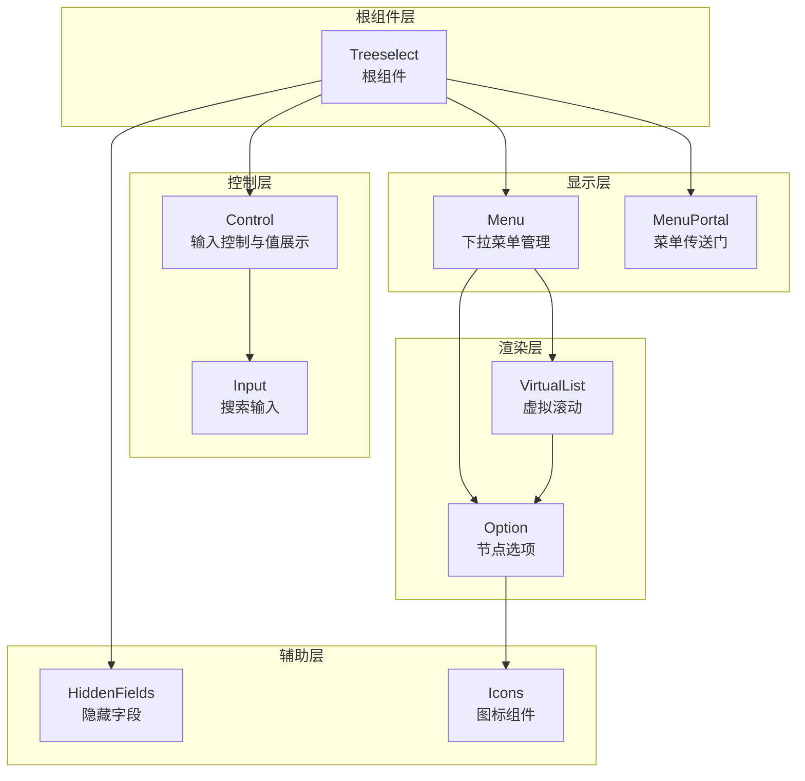
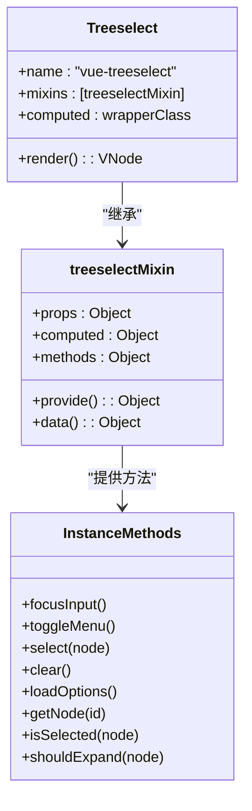
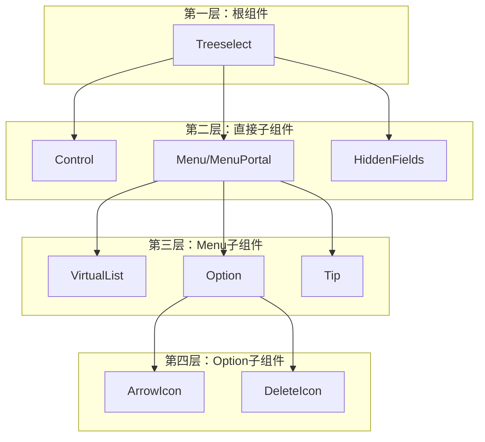
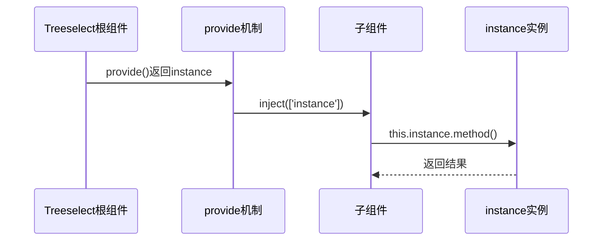
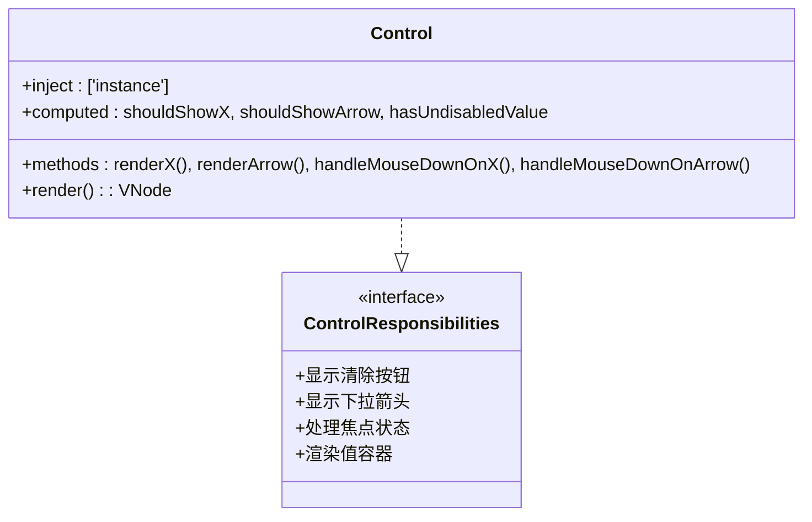
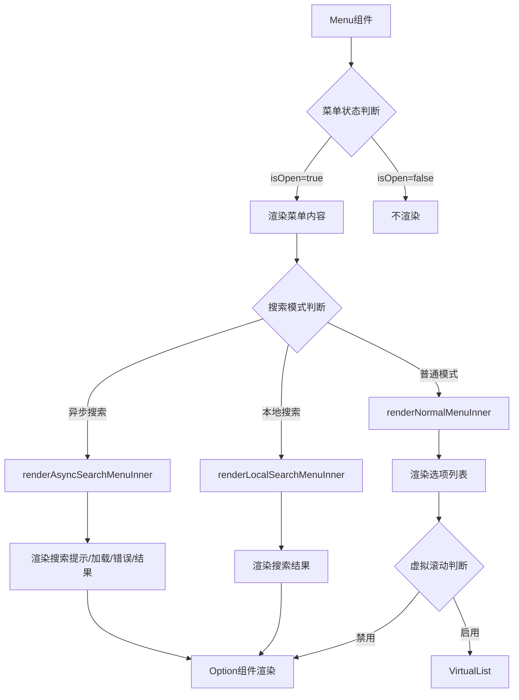
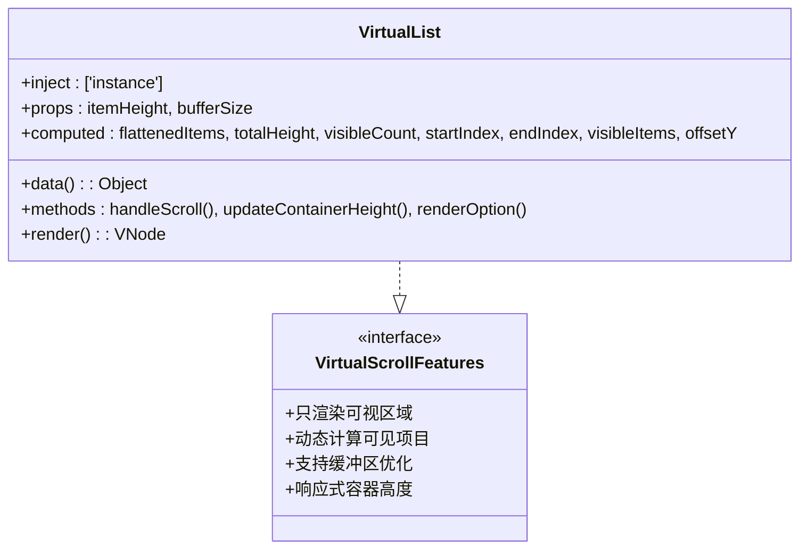
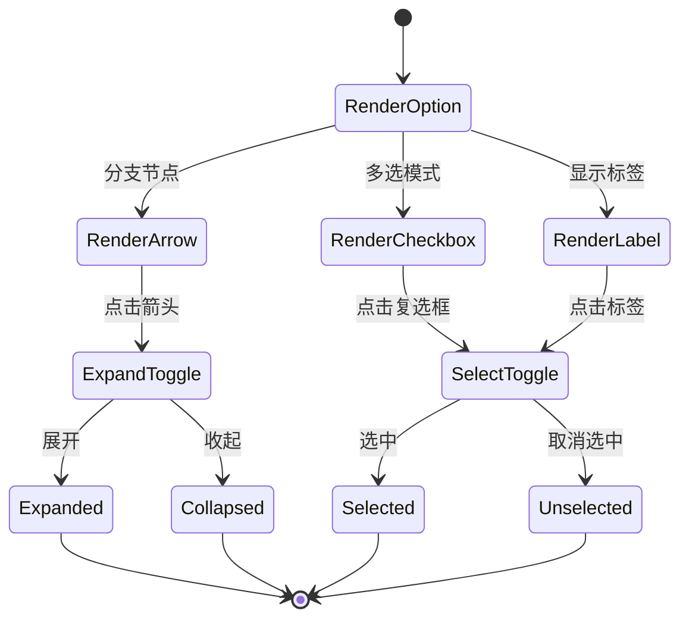
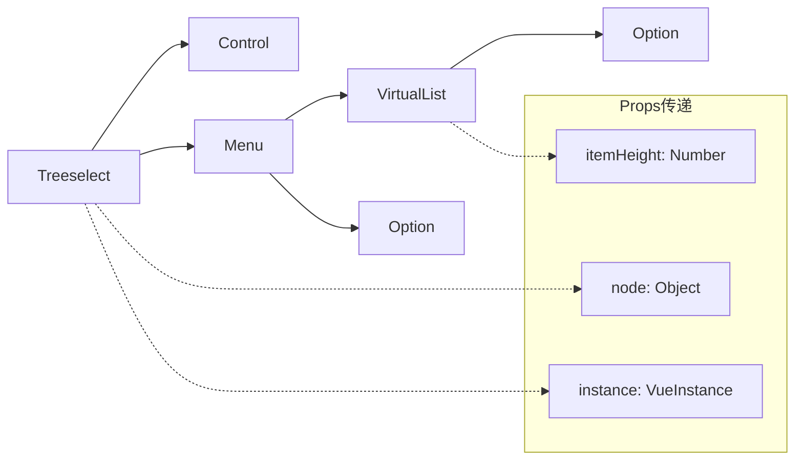

# 组件架构

<cite>
**本文档引用的文件**
- [Treeselect.vue](file://src/components/Treeselect.vue)
- [treeselectMixin.js](file://src/mixins/treeselectMixin.js)
- [Control.vue](file://src/components/Control.vue)
- [Menu.vue](file://src/components/Menu.vue)
- [VirtualList.vue](file://src/components/VirtualList.vue)
- [Option.vue](file://src/components/Option.vue)
- [MenuPortal.vue](file://src/components/MenuPortal.vue)
- [HiddenFields.vue](file://src/components/HiddenFields.vue)
- [Input.vue](file://src/components/Input.vue)
- [index.js](file://src/index.js)
- [constants.js](file://src/constants.js)
- [utils/index.js](file://src/utils/index.js)
</cite>

## 目录
1. [概述](#概述)
2. [核心架构设计](#核心架构设计)
3. [mixin模式集成](#mixin模式集成)
4. [组件层级关系](#组件层级关系)
5. [provide/inject通信机制](#provideinject通信机制)
6. [组件职责划分](#组件职责划分)
7. [组件间通信方式](#组件间通信方式)
8. [架构优势分析](#架构优势分析)
9. [总结](#总结)

## 概述

vue-treeselect-next是一个功能强大的树形选择器组件库，采用了精心设计的组件架构。该架构以Treeselect根组件为核心，通过mixin模式实现功能复用与状态共享，同时利用Vue的provide/inject机制实现跨层级通信。整个系统包含多个专门化的子组件，每个组件都有明确的职责分工，形成了一个高度模块化和可维护的架构体系。

## 核心架构设计

### 整体架构图



**图表来源**
- [Treeselect.vue](file://src/components/Treeselect.vue#L1-L42)
- [Control.vue](file://src/components/Control.vue#L1-L154)
- [Menu.vue](file://src/components/Menu.vue#L1-L331)
- [VirtualList.vue](file://src/components/VirtualList.vue#L1-L209)

### 架构特点

1. **分层架构**：从根组件到具体渲染，逐层细化职责
2. **模块化设计**：每个组件专注于特定功能领域
3. **可扩展性**：支持虚拟滚动、异步加载等高级特性
4. **性能优化**：针对大数据量场景的专门优化

**章节来源**
- [Treeselect.vue](file://src/components/Treeselect.vue#L1-L42)
- [Menu.vue](file://src/components/Menu.vue#L1-L331)

## mixin模式集成

### treeselectMixin的核心作用

vue-treeselect-next采用mixin模式将核心逻辑集中在一个共享的treeselectMixin中，实现了功能复用与状态共享。



**图表来源**
- [Treeselect.vue](file://src/components/Treeselect.vue#L8-L11)
- [treeselectMixin.js](file://src/mixins/treeselectMixin.js#L64-L71)

### 提供的核心功能

1. **状态管理**：统一管理组件状态，包括触发器状态、菜单状态、森林状态等
2. **计算属性**：提供复杂的计算属性，如内部值、可见选项等
3. **事件处理**：封装通用的事件处理逻辑
4. **工具方法**：提供搜索、排序、验证等工具函数

**章节来源**
- [treeselectMixin.js](file://src/mixins/treeselectMixin.js#L64-L800)

## 组件层级关系

### 层级结构分析

vue-treeselect-next的组件层级呈现清晰的树状结构：



**图表来源**
- [Treeselect.vue](file://src/components/Treeselect.vue#L31-L38)
- [Menu.vue](file://src/components/Menu.vue#L16-L23)
- [VirtualList.vue](file://src/components/VirtualList.vue#L11-L15)

### 组件间的依赖关系

1. **Treeselect**：作为根组件，负责整体布局和状态提供
2. **Control**：负责输入控制和值的展示
3. **Menu**：管理下拉菜单的渲染和交互
4. **VirtualList**：处理大数据量的虚拟滚动渲染
5. **Option**：单个节点的渲染和交互处理

**章节来源**
- [Control.vue](file://src/components/Control.vue#L8-L11)
- [Menu.vue](file://src/components/Menu.vue#L16-L18)
- [VirtualList.vue](file://src/components/VirtualList.vue#L11-L12)

## provide/inject通信机制

### instance实例传递

vue-treeselect-next通过Vue的provide/inject机制实现跨层级通信，确保所有子组件都能访问到根组件的实例。



**图表来源**
- [treeselectMixin.js](file://src/mixins/treeselectMixin.js#L64-L71)
- [Control.vue](file://src/components/Control.vue#L10-L11)

### 通信范围

1. **全局访问**：所有子组件都可以通过`this.instance`访问根组件实例
2. **状态共享**：共享组件状态和方法调用
3. **事件传播**：支持事件在组件树中的传播

### 实现细节

```javascript
// provide机制实现
provide() {
  return {
    instance: this,
  }
}

// inject机制使用
inject: ['instance']
```

**章节来源**
- [treeselectMixin.js](file://src/mixins/treeselectMixin.js#L64-L71)
- [Control.vue](file://src/components/Control.vue#L10-L11)

## 组件职责划分

### Control组件 - 输入控制与值展示

Control组件负责处理用户输入和值的展示，是用户交互的主要入口。



**图表来源**
- [Control.vue](file://src/components/Control.vue#L8-L154)

#### 主要职责：
1. **清除按钮管理**：根据配置和状态决定是否显示清除按钮
2. **箭头指示器**：控制下拉箭头的显示和旋转
3. **焦点处理**：管理组件的焦点状态
4. **值容器渲染**：为SingleValue或MultiValue提供容器

**章节来源**
- [Control.vue](file://src/components/Control.vue#L12-L55)

### Menu组件 - 下拉菜单渲染管理

Menu组件负责下拉菜单的整体管理和渲染逻辑。



**图表来源**
- [Menu.vue](file://src/components/Menu.vue#L74-L167)

#### 核心功能：
1. **菜单定位**：自动调整菜单位置避免溢出
2. **搜索模式**：支持本地搜索和异步搜索
3. **状态管理**：管理菜单的打开关闭状态
4. **事件监听**：监听窗口大小和滚动事件

**章节来源**
- [Menu.vue](file://src/components/Menu.vue#L74-L167)

### VirtualList组件 - 大数据量优化

VirtualList组件专门处理大数据量场景下的性能优化问题。



**图表来源**
- [VirtualList.vue](file://src/components/VirtualList.vue#L9-L209)

#### 性能优化特性：
1. **虚拟滚动**：只渲染可视区域内的节点
2. **动态计算**：根据容器高度动态计算可见项目
3. **缓冲区**：提供上下缓冲区避免空白
4. **响应式**：监听容器大小变化

**章节来源**
- [VirtualList.vue](file://src/components/VirtualList.vue#L36-L109)

### Option组件 - 节点交互处理

Option组件处理单个节点的渲染和用户交互。



**图表来源**
- [Option.vue](file://src/components/Option.vue#L35-L305)

#### 交互功能：
1. **节点展开/收起**：处理分支节点的展开状态
2. **选择操作**：支持单选和多选
3. **状态显示**：根据节点状态显示不同的样式
4. **子节点渲染**：递归渲染子节点

**章节来源**
- [Option.vue](file://src/components/Option.vue#L282-L305)

## 组件间通信方式

### Props传递

组件间通过props进行自上而下的数据传递：



**图表来源**
- [Control.vue](file://src/components/Control.vue#L10-L11)
- [VirtualList.vue](file://src/components/VirtualList.vue#L11-L12)
- [Option.vue](file://src/components/Option.vue#L13-L17)

### Events事件

组件间通过事件进行自下而上的通信：

```mermaid
sequenceDiagram
participant User as 用户操作
participant Option as Option组件
participant Menu as Menu组件
participant Treeselect as Treeselect根组件
User->>Option : 点击选择
Option->>Menu : emit('select', node)
Menu->>Treeselect : 触发选择事件
Treeselect->>Treeselect : 更新内部状态
Treeselect-->>Menu : 状态更新通知
Menu-->>User : UI更新反馈
```

**图表来源**
- [Option.vue](file://src/components/Option.vue#L265-L272)
- [Menu.vue](file://src/components/Menu.vue#L74-L90)

### Slots插槽

组件通过插槽提供定制化能力：

| 插槽名称 | 用途 | 提供者 |
|---------|------|--------|
| `before-list` | 菜单列表前的内容 | Menu |
| `after-list` | 菜单列表后的提示信息 | Menu |
| `option-label` | 自定义选项标签渲染 | Option |

**章节来源**
- [Menu.vue](file://src/components/Menu.vue#L93-L107)
- [Option.vue](file://src/components/Option.vue#L181-L190)

## 架构优势分析

### 可维护性优势

1. **单一职责原则**：每个组件都有明确的职责边界
2. **低耦合高内聚**：组件间通过标准化接口通信
3. **易于测试**：模块化设计便于单元测试
4. **版本兼容**：mixin模式确保向后兼容

### 扩展性优势

1. **插槽系统**：提供丰富的定制化能力
2. **事件系统**：支持复杂的应用场景
3. **配置灵活**：大量配置选项满足不同需求
4. **性能优化**：虚拟滚动等特性支持大规模数据

### 性能优势

1. **按需渲染**：组件只渲染必要的部分
2. **虚拟滚动**：大数据量场景下的性能优化
3. **事件防抖**：减少不必要的计算
4. **懒加载**：支持异步加载和动态加载

### 架构演进价值

1. **技术债务最小化**：清晰的架构降低维护成本
2. **团队协作友好**：标准化的设计便于团队开发
3. **社区贡献便利**：模块化设计便于社区参与
4. **长期可维护**：良好的设计模式确保长期可用性

## 总结

vue-treeselect-next的组件架构体现了现代前端框架的最佳实践。通过Treeselect根组件的统一管理，配合mixin模式的功能复用，以及provide/inject机制的跨层级通信，构建了一个既强大又灵活的树形选择器解决方案。

该架构的主要特点包括：

1. **清晰的分层设计**：从根组件到具体渲染，层次分明
2. **高效的mixin模式**：实现功能复用与状态共享
3. **灵活的provide/inject**：支持跨层级通信
4. **专业的职责划分**：每个组件专注特定功能领域
5. **多样化的通信方式**：props、events、slots的有机结合
6. **优秀的性能表现**：针对大数据量场景的专门优化

这种架构设计不仅保证了组件的功能完整性，还为未来的功能扩展和性能优化奠定了坚实的基础，是现代Vue组件库设计的优秀范例。