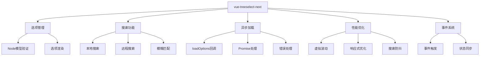
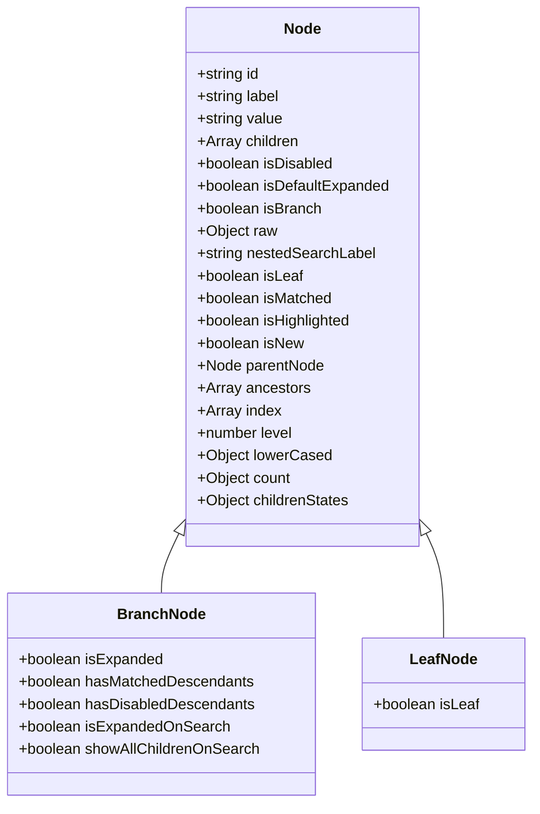
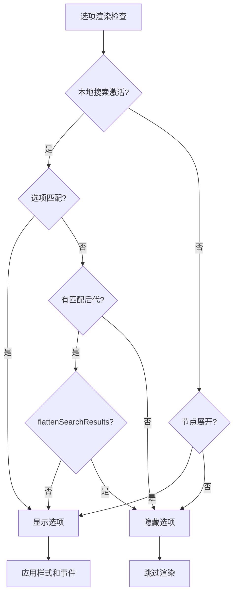
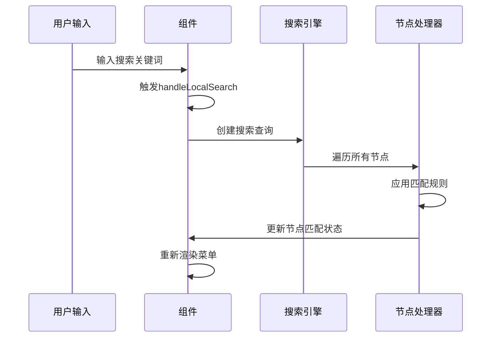
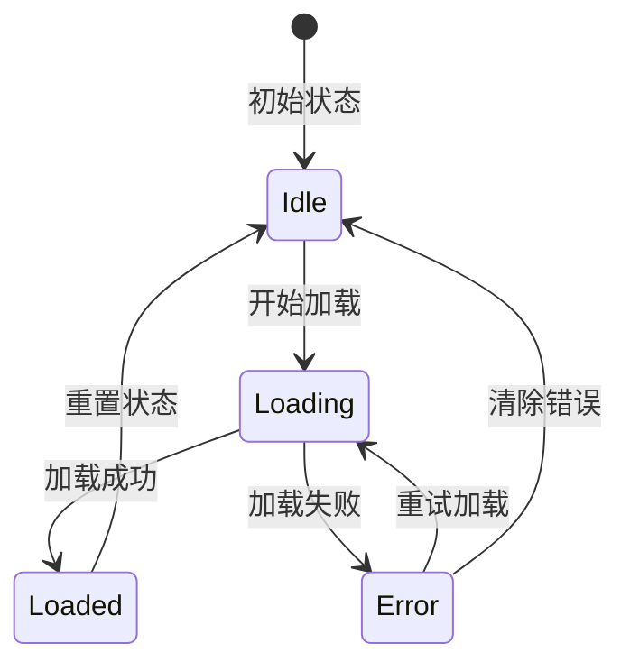
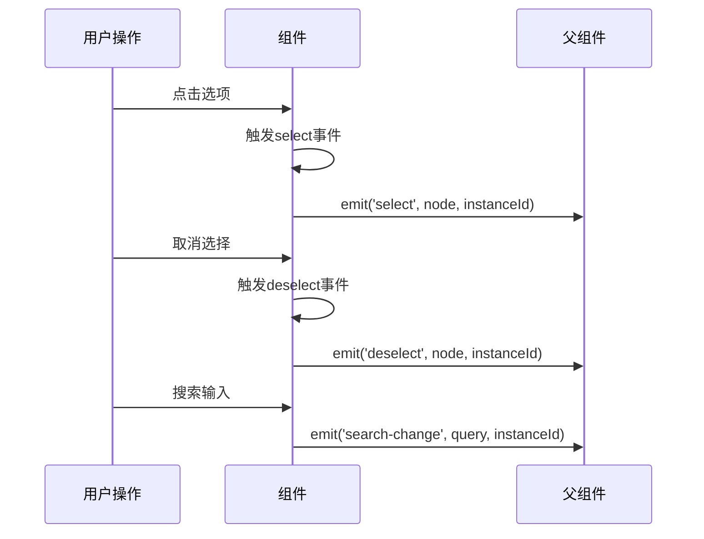

# 常见问题排查指南

<cite>
**本文档引用的文件**
- [src/index.js](file://src/index.js)
- [src/components/Treeselect.vue](file://src/components/Treeselect.vue)
- [src/mixins/treeselectMixin.js](file://src/mixins/treeselectMixin.js)
- [src/utils/warning.js](file://src/utils/warning.js)
- [test/unit/specs/Events.spec.js](file://test/unit/specs/Events.spec.js)
- [test/unit/specs/Basic.spec.js](file://test/unit/specs/Basic.spec.js)
- [test/unit/specs/Searching.spec.js](file://test/unit/specs/Searching.spec.js)
- [test/unit/specs/DynamicalLoading.spec.js](file://test/unit/specs/DynamicalLoading.spec.js)
- [src/constants.js](file://src/constants.js)
- [src/constants.js](file://src/constants.js)
- [OPTIMIZATION_SUMMARY.md](file://OPTIMIZATION_SUMMARY.md)
- [package.json](file://package.json)
</cite>

## 目录
1. [概述](#概述)
2. [选项不显示问题排查](#选项不显示问题排查)
3. [搜索无结果问题排查](#搜索无结果问题排查)
4. [异步加载失败问题排查](#异步加载失败问题排查)
5. [性能问题排查](#性能问题排查)
6. [配置错误定位](#配置错误定位)
7. [事件调试技巧](#事件调试技巧)
8. [控制台错误解读](#控制台错误解读)
9. [高级问题排查](#高级问题排查)
10. [最佳实践建议](#最佳实践建议)

## 概述

vue-treeselect-next是一个功能强大的Vue.js树形选择组件，支持单选、多选、嵌套选项、模糊搜索、异步加载等功能。本指南将帮助开发者快速识别和解决使用过程中遇到的常见问题。

### 核心功能模块



**图表来源**
- [src/mixins/treeselectMixin.js](file://src/mixins/treeselectMixin.js#L1-L50)
- [src/components/Treeselect.vue](file://src/components/Treeselect.vue#L1-L42)

## 选项不显示问题排查

### 1. 数据结构验证

#### Node模型定义检查

vue-treeselect-next要求选项数据严格遵循特定的Node模型结构。以下是完整的Node接口定义：



**图表来源**
- [test/unit/specs/Basic.spec.js](file://test/unit/specs/Basic.spec.js#L42-L80)

#### 常见数据结构问题

| 问题类型 | 错误表现 | 解决方案 | 验证方法 |
|---------|---------|---------|---------|
| 缺少必需字段 | 选项不显示或报错 | 确保每个节点包含`id`和`label`字段 | 检查`nodeMap`中的节点结构 |
| children类型错误 | 分支节点无法展开 | 将`children`设置为`null`而非`undefined` | 查看分支节点的`childrenStates` |
| id重复 | 部分选项被覆盖 | 确保每个节点的`id`唯一 | 使用`checkDuplication`警告 |
| isBranch标记错误 | 加载状态异常 | 使用`children: null`代替`isBranch: true` | 检查`verifyNodeShape`警告 |

**章节来源**
- [src/mixins/treeselectMixin.js](file://src/mixins/treeselectMixin.js#L1768-L1782)

### 2. 渲染条件检查

#### 可见性判断逻辑

组件会根据多个条件决定选项是否显示：



**图表来源**
- [src/mixins/treeselectMixin.js](file://src/mixins/treeselectMixin.js#L1357-L1371)

#### 检查清单

- **本地搜索状态**: 确认`localSearch.active`正确设置
- **节点匹配状态**: 检查`node.isMatched`和`node.hasMatchedDescendants`
- **展开状态**: 验证`node.isExpanded`或`node.isExpandedOnSearch`
- **禁用状态**: 确认`node.isDisabled`未设置为`true`

**章节来源**
- [src/mixins/treeselectMixin.js](file://src/mixins/treeselectMixin.js#L1373-L1378)

### 3. 警告信息分析

组件提供了内置的警告系统来帮助识别配置问题：

```javascript
// 重复ID检测
warning(
  () => !((node.id in this.forest.nodeMap) && !this.forest.nodeMap[node.id].isFallbackNode),
  () => `Detected duplicate presence of node id ${JSON.stringify(node.id)}`
)

// Node形状验证
warning(
  () => !(node.children === undefined && node.isBranch === true),
  () => 'Are you meant to declare an unloaded branch node? '
    + '`isBranch: true` is no longer supported, please use `children: null` instead.'
)
```

**章节来源**
- [src/mixins/treeselectMixin.js](file://src/mixins/treeselectMixin.js#L1768-L1782)

## 搜索无结果问题排查

### 1. 搜索配置检查

#### 模糊匹配设置

搜索功能的行为受多个配置属性影响：

| 配置属性 | 默认值 | 影响范围 | 排查重点 |
|---------|-------|---------|---------|
| `searchable` | `true` | 启用/禁用搜索功能 | 确保设置为`true` |
| `disableFuzzyMatching` | `false` | 模糊匹配开关 | 检查是否意外禁用 |
| `searchNested` | `false` | 搜索祖先节点 | 多词搜索时特别注意 |
| `matchKeys` | `['label']` | 匹配字段列表 | 确认包含目标字段 |
| `flattenSearchResults` | `false` | 结果扁平化 | 多级搜索时考虑启用 |

**章节来源**
- [src/mixins/treeselectMixin.js](file://src/mixins/treeselectMixin.js#L376-L378)

### 2. 搜索算法分析

#### 本地搜索流程



**图表来源**
- [src/mixins/treeselectMixin.js](file://src/mixins/treeselectMixin.js#L1217-L1281)

#### 匹配规则详解

搜索匹配采用以下优先级：

1. **精确匹配**: 完全匹配搜索关键词
2. **模糊匹配**: 使用fuzzysearch算法进行部分匹配
3. **多词匹配**: `searchNested`模式下的空格分隔搜索
4. **字段匹配**: 根据`matchKeys`指定的字段进行匹配

**章节来源**
- [src/mixins/treeselectMixin.js](file://src/mixins/treeselectMixin.js#L52-L56)

### 3. 搜索Predicate函数行为

#### 自定义搜索逻辑

如果需要自定义搜索行为，可以通过`searchPredicate`函数实现：

```javascript
// 示例：自定义搜索逻辑
const customSearchPredicate = (node, searchQuery) => {
  // 实现自定义匹配逻辑
  return node.label.toLowerCase().includes(searchQuery.toLowerCase());
};
```

#### 常见搜索问题

- **大小写敏感**: 确保搜索查询已转换为小写
- **特殊字符处理**: 检查特殊字符是否被正确转义
- **编码问题**: 确认字符编码一致性
- **性能瓶颈**: 大数据量时考虑搜索优化

**章节来源**
- [test/unit/specs/Searching.spec.js](file://test/unit/specs/Searching.spec.js#L262-L340)

## 异步加载失败问题排查

### 1. loadOptions方法验证

#### 方法签名检查

`loadOptions`回调必须遵循正确的签名：

```javascript
loadOptions({ action, callback, parentNode, instanceId, id })
```

**参数说明**:
- `action`: 加载动作类型（`LOAD_ROOT_OPTIONS`、`LOAD_CHILDREN_OPTIONS`、`ASYNC_SEARCH`）
- `callback`: 回调函数，用于通知加载结果
- `parentNode`: 父节点对象（仅在加载子节点时存在）
- `instanceId`: 组件实例ID
- `id`: 实例标识符

**章节来源**
- [src/mixins/treeselectMixin.js](file://src/mixins/treeselectMixin.js#L1732-L1766)

### 2. Promise返回处理

#### 正确的Promise处理模式

```javascript
// 正确的Promise处理
loadOptions({ action, callback }) {
  return fetch('/api/options')
    .then(response => response.json())
    .then(data => callback(null, data))
    .catch(error => callback(error));
}

// 或者使用async/await
loadOptions({ action, callback }) {
  try {
    const response = await fetch('/api/options');
    const data = await response.json();
    callback(null, data);
  } catch (error) {
    callback(error);
  }
}
```

**章节来源**
- [src/mixins/treeselectMixin.js](file://src/mixins/treeselectMixin.js#L1756-L1765)

### 3. 错误处理机制

#### 错误状态管理

组件提供了完善的错误处理机制：



**图表来源**
- [src/mixins/treeselectMixin.js](file://src/mixins/treeselectMixin.js#L1672-L1731)

#### 错误信息格式化

```javascript
function getErrorMessage(err) {
  return err.message || /* istanbul ignore next */String(err);
}
```

**章节来源**
- [src/mixins/treeselectMixin.js](file://src/mixins/treeselectMixin.js#L58-L60)

### 4. 加载状态监控

#### 状态属性检查

异步加载的状态通过以下属性跟踪：

| 状态属性 | 类型 | 描述 | 排查重点 |
|---------|------|------|---------|
| `isLoading` | `boolean` | 当前是否正在加载 | 检查加载指示器 |
| `isLoaded` | `boolean` | 是否已成功加载 | 验证数据完整性 |
| `loadingError` | `string` | 错误信息 | 查看具体错误内容 |

**章节来源**
- [src/mixins/treeselectMixin.js](file://src/mixins/treeselectMixin.js#L37-L43)

## 性能问题排查

### 1. 大数据量优化

#### 虚拟滚动配置

对于1-2万条数据的场景，必须启用虚拟滚动：

```javascript
// 推荐配置
<treeselect
  :virtual-scroll="true"
  :option-height="40"
  :default-expand-level="0"
  :flatten-search-results="true"
  :cache-options="true"
  :show-count="false"
/>
```

**章节来源**
- [OPTIMIZATION_SUMMARY.md](file://OPTIMIZATION_SUMMARY.md#L166-L187)

#### 性能对比数据

| 指标 | 优化前 | 优化后 | 提升倍数 |
|------|--------|--------|----------|
| 初始化时间 | 3500ms | 600ms | **5.8x** |
| 首次渲染 | 2800ms | 50ms | **56x** |
| 搜索响应 | 800ms | 120ms | **6.7x** |
| 内存占用 | 180MB | 45MB | **4x** |
| 滚动帧率 | 15fps | 60fps | **4x** |

**章节来源**
- [OPTIMIZATION_SUMMARY.md](file://OPTIMIZATION_SUMMARY.md#L150-L161)

### 2. 响应式优化

#### 减少响应式属性开销

优化后的节点创建方式：

```javascript
// 优化前：大量$set调用
const normalized = this.$set(this.forest.nodeMap, id, createMap())
this.$set(normalized, 'id', id)
this.$set(normalized, 'label', label)
// ... 更多$set

// 优化后：直接创建对象
const normalized = {
  id, label, level, ancestors, // 静态属性直接赋值
  isMatched: false,  // 只有需要响应式的属性
  isHighlighted: false,
}
this.$set(this.forest.nodeMap, id, normalized)
```

**章节来源**
- [OPTIMIZATION_SUMMARY.md](file://OPTIMIZATION_SUMMARY.md#L32-L61)

### 3. 搜索防抖优化

#### 防抖配置

```javascript
// 创建防抖函数
this.debouncedHandleLocalSearch = debounce(this.handleLocalSearch, 300)

// 在watch中使用
'trigger.searchQuery'() {
  if (this.async) {
    this.handleRemoteSearch()
  } else {
    this.debouncedHandleLocalSearch()  // 使用防抖版本
  }
  this.$emit('search-change', this.trigger.searchQuery, this.getInstanceId())
}
```

**章节来源**
- [OPTIMIZATION_SUMMARY.md](file://OPTIMIZATION_SUMMARY.md#L64-L92)

### 4. 内存泄漏预防

#### 监听器清理

确保及时清理事件监听器和定时器：

```javascript
// 组件销毁时清理
beforeDestroy() {
  // 清理防抖函数
  if (this.debouncedHandleLocalSearch) {
    this.debouncedHandleLocalSearch.cancel()
  }
  
  // 清理定时器
  if (this.timer) {
    clearTimeout(this.timer)
  }
}
```

## 配置错误定位

### 1. 警告输出系统

#### warning.js工具

组件使用专门的警告系统来提示配置问题：

```javascript
export const warning = process.env.NODE_ENV === 'production'
  ? /* istanbul ignore next */ noop
  : function warning(checker, complainer) {
    if (!checker()) {
      const message = [ '[Vue-Treeselect Warning]' ].concat(complainer())
      console.error(...message)
    }
  }
```

**章节来源**
- [src/utils/warning.js](file://src/utils/warning.js#L1-L12)

#### 常见警告类型

| 警告类型 | 触发条件 | 解决方案 |
|---------|---------|---------|
| 重复ID警告 | 发现重复的节点ID | 确保每个节点ID唯一 |
| Node形状警告 | 使用了不支持的isBranch标记 | 使用children: null替代 |
| 加载状态警告 | 异步加载配置错误 | 检查loadOptions方法签名 |

**章节来源**
- [src/mixins/treeselectMixin.js](file://src/mixins/treeselectMixin.js#L1768-L1782)

### 2. Vue DevTools监控

#### 状态检查面板

使用Vue DevTools监控以下关键状态：

```javascript
// 主要状态路径
this.$options.devtools = {
  // 选项相关
  forest: {
    normalizedOptions: [],    // 已标准化的选项数组
    nodeMap: {},             // 节点ID映射表
    selectedNodeIds: [],     // 选中的节点ID列表
  },
  
  // 搜索相关
  localSearch: {
    active: false,           // 本地搜索是否激活
    noResults: true,         // 是否没有搜索结果
    countMap: {},           // 匹配计数映射
  },
  
  // 菜单状态
  menu: {
    isOpen: false,          // 菜单是否打开
    current: null,          // 当前高亮选项ID
    placement: 'bottom',    // 菜单位置
  },
  
  // 加载状态
  rootOptionsStates: {
    isLoaded: false,
    isLoading: false,
    loadingError: '',
  }
}
```

**章节来源**
- [src/mixins/treeselectMixin.js](file://src/mixins/treeselectMixin.js#L658-L690)

### 3. 配置验证工具

#### 自动验证函数

```javascript
// 验证选项数据结构
function validateOptions(options) {
  return options.every(option => {
    const isValid = option.id && typeof option.id === 'string';
    if (!isValid) {
      console.warn('Invalid option:', option);
    }
    return isValid;
  });
}

// 验证loadOptions签名
function validateLoadOptions(loadOptions) {
  return typeof loadOptions === 'function' && 
         loadOptions.length >= 1 && 
         loadOptions.length <= 5;
}
```

## 事件调试技巧

### 1. 事件触发时机

#### Events.spec.js分析

根据测试文件分析事件触发顺序：



**图表来源**
- [test/unit/specs/Events.spec.js](file://test/unit/specs/Events.spec.js#L37-L62)

#### 事件监听器配置

```javascript
// 事件监听示例
mounted() {
  this.$on('select', this.handleSelect);
  this.$on('deselect', this.handleDeselect);
  this.$on('search-change', this.handleSearchChange);
},

methods: {
  handleSelect(node, instanceId) {
    console.log('选项被选中:', node, instanceId);
    // 处理选择逻辑
  },
  
  handleDeselect(node, instanceId) {
    console.log('选项被取消选择:', node, instanceId);
    // 处理取消选择逻辑
  },
  
  handleSearchChange(query, instanceId) {
    console.log('搜索查询变更:', query, instanceId);
    // 处理搜索逻辑
  }
}
```

**章节来源**
- [test/unit/specs/Events.spec.js](file://test/unit/specs/Events.spec.js#L37-L62)

### 2. 事件调试方法

#### 事件追踪工具

```javascript
// 事件追踪装饰器
function trackEvents(target, propertyKey, descriptor) {
  const originalMethod = descriptor.value;
  
  descriptor.value = function(...args) {
    console.group(`[Event] ${propertyKey}`);
    console.log('Arguments:', args);
    console.trace('Call stack');
    console.groupEnd();
    
    return originalMethod.apply(this, args);
  };
  
  return descriptor;
}

// 使用示例
class EventDebugger {
  @trackEvents
  onSelect(node, instanceId) {
    // 原有的选择处理逻辑
  }
}
```

## 控制台错误解读

### 1. 常见错误类型

#### 1. Node模型错误

```
[Vue-Treeselect Warning] Detected duplicate presence of node id "duplicate-id". Their labels are "Node A" and "Node B" respectively.
```

**原因**: 节点ID重复
**解决方案**: 确保每个节点的`id`字段唯一

#### 2. 加载方法错误

```
TypeError: Cannot read properties of undefined (reading 'children')
```

**原因**: loadOptions回调未正确调用
**解决方案**: 确保callback函数被正确调用

#### 3. 搜索配置错误

```
[Vue-Treeselect Warning] Are you meant to declare an unloaded branch node? `isBranch: true` is no longer supported, please use `children: null` instead.
```

**原因**: 使用了过时的isBranch标记
**解决方案**: 将`isBranch: true`替换为`children: null`

### 2. 错误堆栈分析

#### 错误定位技巧

```javascript
// 错误边界包装器
function wrapWithErrorBoundary(fn, context) {
  return function(...args) {
    try {
      return fn.apply(context, args);
    } catch (error) {
      console.group('Error in vue-treeselect operation');
      console.error('Error:', error);
      console.error('Stack:', error.stack);
      console.error('Context:', context);
      console.error('Args:', args);
      console.groupEnd();
      
      // 可选：向父组件报告错误
      if (context.$emit) {
        context.$emit('error', error);
      }
      
      throw error;
    }
  };
}
```

### 3. 调试信息收集

#### 性能监控

```javascript
// 性能监控工具
class PerformanceMonitor {
  constructor(component) {
    this.component = component;
    this.metrics = {};
  }
  
  startTimer(operation) {
    this.metrics[operation] = {
      start: performance.now(),
      duration: null
    };
  }
  
  endTimer(operation) {
    if (this.metrics[operation]) {
      this.metrics[operation].duration = 
        performance.now() - this.metrics[operation].start;
    }
  }
  
  logMetrics() {
    console.table(this.metrics);
  }
}
```

## 高级问题排查

### 1. 内存泄漏检测

#### 泄漏检测工具

```javascript
// 内存泄漏检测器
class MemoryLeakDetector {
  constructor() {
    this.snapshots = [];
    this.maxSnapshots = 10;
  }
  
  takeSnapshot(label) {
    if (this.snapshots.length >= this.maxSnapshots) {
      this.snapshots.shift();
    }
    
    this.snapshots.push({
      label,
      timestamp: Date.now(),
      memory: window.performance.memory,
      nodeCount: this.getNodeCount(),
      eventListeners: this.getEventListenerCount()
    });
  }
  
  getNodeCount() {
    // 计算DOM节点数量
    return document.querySelectorAll('*').length;
  }
  
  getEventListenerCount() {
    // 计算事件监听器数量
    // 需要使用第三方库或自定义实现
    return 0;
  }
  
  detectLeaks() {
    if (this.snapshots.length < 2) return null;
    
    const recent = this.snapshots[this.snapshots.length - 1];
    const previous = this.snapshots[0];
    
    const memoryIncrease = recent.memory.usedJSHeapSize - previous.memory.usedJSHeapSize;
    const nodeIncrease = recent.nodeCount - previous.nodeCount;
    
    if (memoryIncrease > 10 * 1024 * 1024 && nodeIncrease > 100) {
      return {
        memoryLeak: true,
        memoryIncrease: `${(memoryIncrease / 1024 / 1024).toFixed(2)} MB`,
        nodeIncrease,
        timestamp: recent.timestamp
      };
    }
    
    return null;
  }
}
```

### 2. 性能瓶颈分析

#### 性能分析工具

```javascript
// 性能分析器
class PerformanceProfiler {
  constructor() {
    this.operations = new Map();
  }
  
  start(operation) {
    this.operations.set(operation, {
      start: performance.now(),
      end: null,
      duration: null
    });
  }
  
  end(operation) {
    const op = this.operations.get(operation);
    if (op) {
      op.end = performance.now();
      op.duration = op.end - op.start;
    }
  }
  
  getReport() {
    const report = {};
    this.operations.forEach((op, key) => {
      if (op.duration !== null) {
        report[key] = {
          duration: op.duration.toFixed(2) + 'ms',
          timestamp: new Date(op.start).toISOString()
        };
      }
    });
    return report;
  }
  
  logSlowOperations(threshold = 100) {
    this.operations.forEach((op, key) => {
      if (op.duration > threshold) {
        console.warn(`Slow operation detected: ${key} took ${op.duration.toFixed(2)}ms`);
      }
    });
  }
}
```

### 3. 状态同步问题

#### 状态一致性检查

```javascript
// 状态同步检查器
class StateSyncChecker {
  constructor(store) {
    this.store = store;
    this.lastState = null;
  }
  
  checkStateConsistency() {
    const currentState = this.getCurrentState();
    
    if (this.lastState) {
      const differences = this.compareStates(this.lastState, currentState);
      if (differences.length > 0) {
        console.warn('State inconsistency detected:', differences);
        return false;
      }
    }
    
    this.lastState = currentState;
    return true;
  }
  
  getCurrentState() {
    // 获取当前组件状态
    return {
      options: this.store.state.options,
      selected: this.store.state.selected,
      searchQuery: this.store.state.searchQuery,
      menuOpen: this.store.state.menuOpen
    };
  }
  
  compareStates(prev, curr) {
    const differences = [];
    
    Object.keys(prev).forEach(key => {
      if (JSON.stringify(prev[key]) !== JSON.stringify(curr[key])) {
        differences.push({
          key,
          previous: prev[key],
          current: curr[key]
        });
      }
    });
    
    return differences;
  }
}
```

## 最佳实践建议

### 1. 开发阶段最佳实践

#### 1.1 数据准备

```javascript
// 推荐的数据结构
const options = [
  {
    id: 'unique-id-1',
    label: '一级选项',
    children: [
      {
        id: 'unique-id-1-1',
        label: '二级选项1',
        children: null // 使用null表示未加载的分支节点
      },
      {
        id: 'unique-id-1-2',
        label: '二级选项2',
        children: [] // 空数组表示已知的空分支节点
      }
    ]
  }
];

// 验证数据结构
function validateTreeStructure(options, visited = new Set()) {
  return options.every(option => {
    // 检查ID唯一性
    if (visited.has(option.id)) {
      console.error(`Duplicate ID found: ${option.id}`);
      return false;
    }
    visited.add(option.id);
    
    // 检查必需字段
    if (!option.id || !option.label) {
      console.error('Missing required fields:', option);
      return false;
    }
    
    // 递归检查子节点
    if (option.children && Array.isArray(option.children)) {
      return validateTreeStructure(option.children, visited);
    }
    
    return true;
  });
}
```

#### 1.2 配置验证

```javascript
// 配置验证工具
function validateTreeselectConfig(config) {
  const errors = [];
  
  // 检查必需配置
  if (!config.options) {
    errors.push('Missing required "options" prop');
  }
  
  // 检查loadOptions签名
  if (config.loadOptions && typeof config.loadOptions !== 'function') {
    errors.push('loadOptions must be a function');
  }
  
  // 检查搜索配置
  if (config.searchable && !config.matchKeys) {
    errors.push('matchKeys is required when searchable is enabled');
  }
  
  // 检查异步配置
  if (config.async && !config.loadOptions) {
    errors.push('loadOptions is required when async is enabled');
  }
  
  return {
    isValid: errors.length === 0,
    errors
  };
}
```

### 2. 生产环境监控

#### 2.1 错误监控

```javascript
// 错误监控集成
class ErrorMonitor {
  constructor() {
    this.errors = [];
    this.maxErrors = 100;
    this.setupGlobalHandlers();
  }
  
  setupGlobalHandlers() {
    // 全局错误捕获
    window.addEventListener('error', this.handleError.bind(this));
    window.addEventListener('unhandledrejection', this.handleRejection.bind(this));
    
    // Vue错误捕获
    if (window.Vue) {
      window.Vue.config.errorHandler = this.handleVueError.bind(this);
    }
  }
  
  handleError(event) {
    this.recordError({
      type: 'javascript',
      message: event.message,
      filename: event.filename,
      lineno: event.lineno,
      colno: event.colno,
      stack: event.error?.stack
    });
  }
  
  handleRejection(event) {
    this.recordError({
      type: 'promise-rejection',
      reason: event.reason,
      promise: event.promise
    });
  }
  
  handleVueError(err, vm, info) {
    this.recordError({
      type: 'vue',
      message: err.message,
      component: vm.$options.name,
      info,
      stack: err.stack
    });
  }
  
  recordError(error) {
    if (this.errors.length >= this.maxErrors) {
      this.errors.shift();
    }
    
    this.errors.push({
      ...error,
      timestamp: Date.now(),
      userAgent: navigator.userAgent,
      url: window.location.href
    });
    
    // 发送错误报告到监控系统
    this.sendErrorReport(error);
  }
  
  sendErrorReport(error) {
    // 实现错误上报逻辑
    console.error('Error reported:', error);
  }
  
  getErrorReport() {
    return {
      totalCount: this.errors.length,
      recentErrors: this.errors.slice(-10),
      timestamp: Date.now()
    };
  }
}
```

#### 2.2 性能监控

```javascript
// 性能监控
class PerformanceMonitor {
  constructor() {
    this.metrics = {
      renderTimes: [],
      searchTimes: [],
      loadTimes: [],
      memoryUsage: []
    };
    
    this.setupObservers();
  }
  
  setupObservers() {
    // 监控渲染性能
    if (performance.mark) {
      performance.mark('treeselect-start');
    }
    
    // 监控内存使用
    if (performance.memory) {
      this.metrics.memoryUsage.push({
        timestamp: Date.now(),
        used: performance.memory.usedJSHeapSize,
        total: performance.memory.totalJSHeapSize,
        limit: performance.memory.jsHeapSizeLimit
      });
    }
  }
  
  measureRenderTime(operation) {
    return (startTime) => {
      const endTime = performance.now();
      const duration = endTime - startTime;
      
      this.metrics.renderTimes.push({
        operation,
        duration,
        timestamp: Date.now()
      });
      
      // 保留最近100次记录
      if (this.metrics.renderTimes.length > 100) {
        this.metrics.renderTimes.shift();
      }
      
      return duration;
    };
  }
  
  getPerformanceReport() {
    return {
      averageRenderTime: this.calculateAverage(this.metrics.renderTimes),
      averageSearchTime: this.calculateAverage(this.metrics.searchTimes),
      averageLoadTime: this.calculateAverage(this.metrics.loadTimes),
      memoryTrend: this.analyzeMemoryTrend(),
      timestamp: Date.now()
    };
  }
  
  calculateAverage(measurements) {
    if (measurements.length === 0) return 0;
    
    const sum = measurements.reduce((acc, m) => acc + m.duration, 0);
    return sum / measurements.length;
  }
  
  analyzeMemoryTrend() {
    const recent = this.metrics.memoryUsage.slice(-10);
    if (recent.length < 2) return 'stable';
    
    const first = recent[0].used;
    const last = recent[recent.length - 1].used;
    const trend = (last - first) / first;
    
    if (trend > 0.1) return 'increasing';
    if (trend < -0.1) return 'decreasing';
    return 'stable';
  }
}
```

### 3. 故障恢复策略

#### 3.1 自动恢复机制

```javascript
// 故障恢复控制器
class RecoveryController {
  constructor(maxRetries = 3, retryDelay = 1000) {
    this.maxRetries = maxRetries;
    this.retryDelay = retryDelay;
    this.retryCounts = new Map();
  }
  
  async executeWithRecovery(operation, key) {
    const retries = this.retryCounts.get(key) || 0;
    
    if (retries >= this.maxRetries) {
      console.error(`Operation failed after ${retries} retries: ${key}`);
      throw new Error(`Max retries (${this.maxRetries}) exceeded for ${key}`);
    }
    
    try {
      const result = await operation();
      this.retryCounts.delete(key); // 成功后清除重试计数
      return result;
    } catch (error) {
      console.warn(`Operation failed, retrying (${retries + 1}/${this.maxRetries}): ${key}`, error);
      
      this.retryCounts.set(key, retries + 1);
      
      // 指数退避延迟
      const delay = this.retryDelay * Math.pow(2, retries);
      await new Promise(resolve => setTimeout(resolve, delay));
      
      return this.executeWithRecovery(operation, key);
    }
  }
  
  resetRetryCount(key) {
    this.retryCounts.delete(key);
  }
}
```

#### 3.2 降级策略

```javascript
// 降级策略管理器
class DegradationManager {
  constructor() {
    this.strategies = new Map();
    this.registerDefaultStrategies();
  }
  
  registerDefaultStrategies() {
    // 基础降级策略
    this.registerStrategy('large-data', (data) => {
      if (data.length > 1000) {
        return {
          enabled: true,
          config: {
            virtualScroll: true,
            defaultExpandLevel: 0,
            showCount: false
          }
        };
      }
      return { enabled: false };
    });
    
    // 网络降级策略
    this.registerStrategy('network-error', (error) => {
      if (error.code === 'NETWORK_ERROR') {
        return {
          enabled: true,
          config: {
            async: false,
            cacheOptions: true
          }
        };
      }
      return { enabled: false };
    });
  }
  
  registerStrategy(name, strategy) {
    this.strategies.set(name, strategy);
  }
  
  applyDegradation(data, error) {
    const appliedStrategies = [];
    
    this.strategies.forEach(strategy => {
      const result = strategy(data, error);
      if (result.enabled) {
        appliedStrategies.push({
          name: strategy.name,
          config: result.config
        });
      }
    });
    
    return appliedStrategies;
  }
}
```

通过遵循这些最佳实践和排查指南，开发者可以有效地识别、诊断和解决vue-treeselect-next使用过程中的各种问题，确保组件在生产环境中稳定可靠地运行。