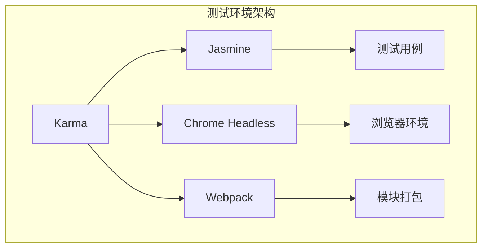
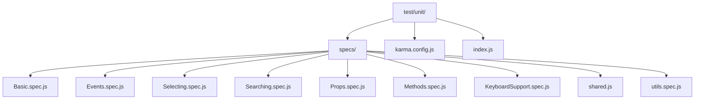
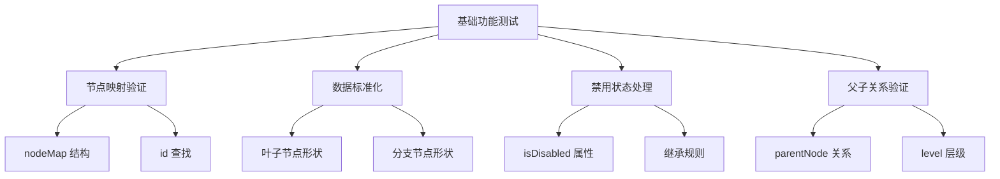
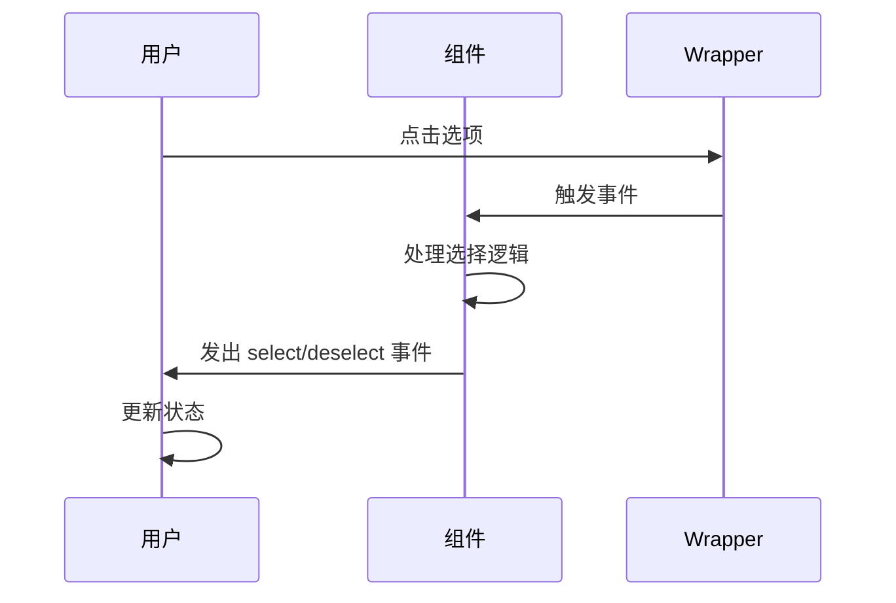
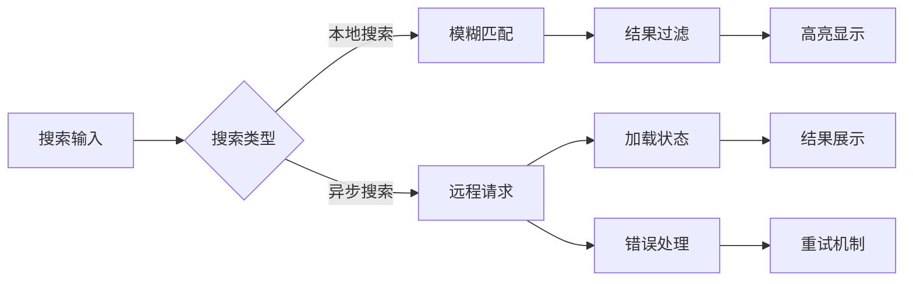
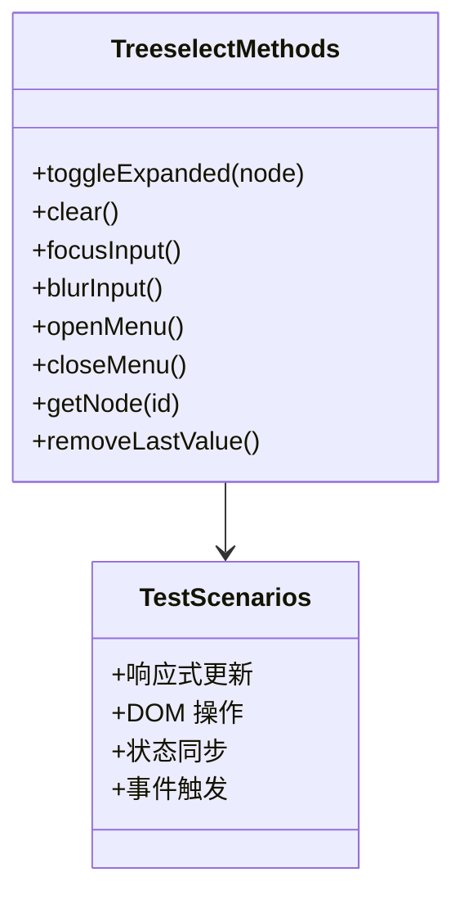
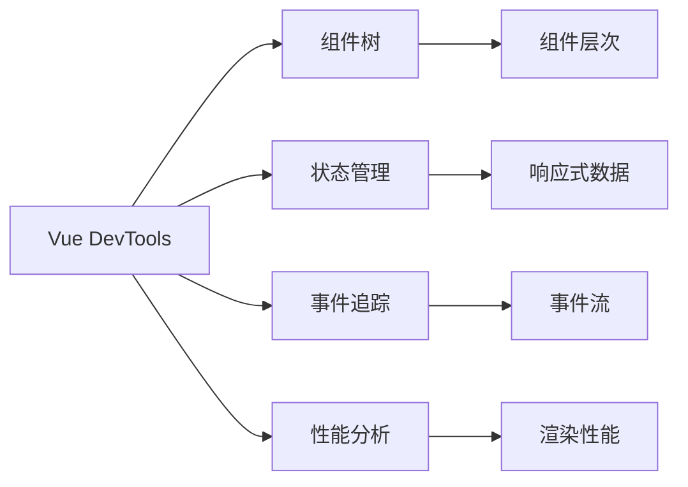
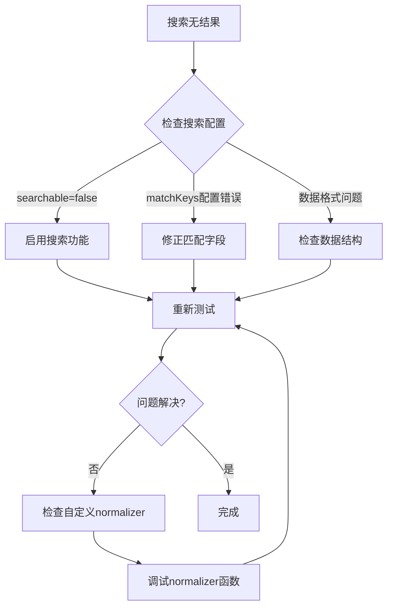
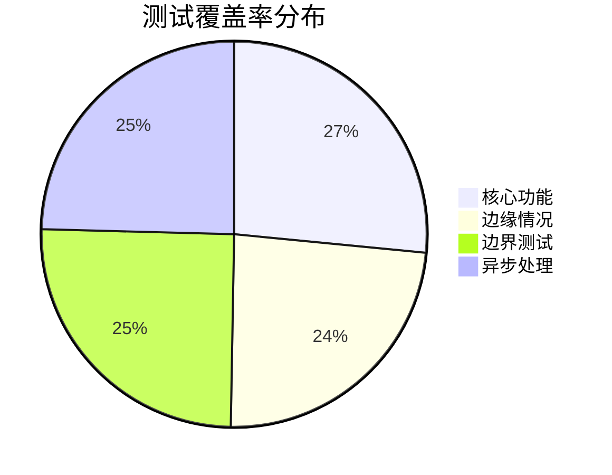
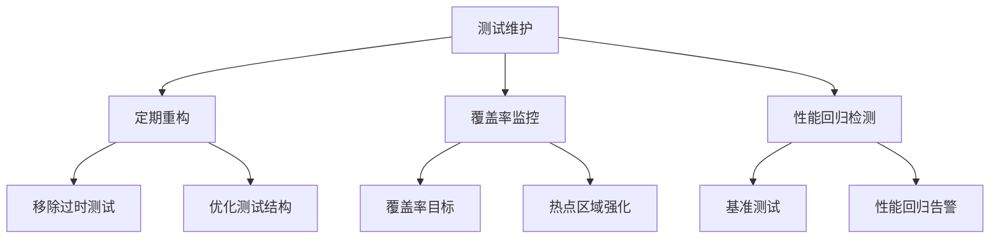

# 测试与调试

<cite>
**本文档中引用的文件**
- [package.json](file://package.json)
- [test/unit/karma.config.js](file://test/unit/karma.config.js)
- [test/unit/index.js](file://test/unit/index.js)
- [test/unit/specs/shared.js](file://test/unit/specs/shared.js)
- [test/unit/specs/Basic.spec.js](file://test/unit/specs/Basic.spec.js)
- [test/unit/specs/Events.spec.js](file://test/unit/specs/Events.spec.js)
- [test/unit/specs/Selecting.spec.js](file://test/unit/specs/Selecting.spec.js)
- [test/unit/specs/Searching.spec.js](file://test/unit/specs/Searching.spec.js)
- [test/unit/specs/Props.spec.js](file://test/unit/specs/Props.spec.js)
- [test/unit/specs/Methods.spec.js](file://test/unit/specs/Methods.spec.js)
- [test/unit/specs/KeyboardSupport.spec.js](file://test/unit/specs/KeyboardSupport.spec.js)
- [src/utils/warning.js](file://src/utils/warning.js)
- [src/examples/LargeDataExample.vue](file://src/examples/LargeDataExample.vue)
- [src/components/Treeselect.vue](file://src/components/Treeselect.vue)
</cite>

## 目录
1. [简介](#简介)
2. [测试环境配置](#测试环境配置)
3. [测试框架架构](#测试框架架构)
4. [单元测试套件详解](#单元测试套件详解)
5. [编写有效测试用例](#编写有效测试用例)
6. [调试技巧与工具](#调试技巧与工具)
7. [常见问题排查](#常见问题排查)
8. [性能监控与优化](#性能监控与优化)
9. [最佳实践指南](#最佳实践指南)

## 简介

vue-treeselect-next 是一个功能强大的多选树形下拉组件，提供了完整的单元测试套件来确保组件的稳定性和可靠性。本指南将帮助开发者理解测试架构、掌握测试编写技巧，并提供有效的调试方法。

## 测试环境配置

### Karma 测试运行器配置

项目使用 Karma 作为测试运行器，配合 Jasmine 框架进行单元测试。



**图表来源**
- [test/unit/karma.config.js](file://test/unit/karma.config.js#L1-L39)

### 关键配置参数

| 配置项 | 值 | 说明 |
|--------|-----|------|
| 测试框架 | Jasmine | JavaScript 测试框架 |
| 浏览器 | ChromeHeadlessWithoutSandbox | 无头浏览器，禁用沙盒模式 |
| 覆盖率报告 | lcov, text-summary | 代码覆盖率统计格式 |
| 预处理器 | webpack, sourcemap | 模块打包和源码映射 |

**章节来源**
- [test/unit/karma.config.js](file://test/unit/karma.config.js#L1-L39)

### 测试脚本命令

| 命令 | 功能 | 参数 |
|------|------|------|
| `npm run unit` | 监听模式测试 | 自动重新运行变更的测试 |
| `npm run testonly` | 单次运行测试 | 清理覆盖度并运行所有测试 |
| `npm run pretest` | 测试前检查 | 运行 ESLint 和 StyleLint |

**章节来源**
- [package.json](file://package.json#L28-L32)

## 测试框架架构

### 测试目录结构



**图表来源**
- [test/unit/index.js](file://test/unit/index.js#L1-L12)

### 共享测试工具

测试套件提供了丰富的共享工具函数，简化测试代码编写：

| 工具函数 | 功能 | 使用场景 |
|----------|------|----------|
| `$(selector)` | DOM 查询 | 获取元素引用 |
| `generateOptions()` | 生成测试数据 | 创建树形结构测试数据 |
| `leftClick()` | 模拟鼠标点击 | 用户交互测试 |
| `typeSearchText()` | 输入搜索文本 | 搜索功能测试 |
| 键盘操作函数 | 模拟键盘事件 | 键盘导航测试 |

**章节来源**
- [test/unit/specs/shared.js](file://test/unit/specs/shared.js#L1-L162)

## 单元测试套件详解

### 基础功能测试 (Basic.spec.js)

基础功能测试验证组件的核心数据结构和初始化逻辑：



**图表来源**
- [test/unit/specs/Basic.spec.js](file://test/unit/specs/Basic.spec.js#L1-L800)

### 事件处理测试 (Events.spec.js)

事件测试验证组件的交互行为：



**图表来源**
- [test/unit/specs/Events.spec.js](file://test/unit/specs/Events.spec.js#L1-L67)

### 选择功能测试 (Selecting.spec.js)

选择功能是组件的核心特性，测试覆盖单选和多选的各种场景：

| 测试场景 | 验证内容 | 关键点 |
|----------|----------|--------|
| 单选模式 | 唯一选择 | 互斥性验证 |
| 多选模式 | 层级选择 | 父子节点联动 |
| 禁用状态 | 选择限制 | 状态继承 |
| 自动选择 | 策略验证 | autoSelectAncestors/autoSelectDescendants |

**章节来源**
- [test/unit/specs/Selecting.spec.js](file://test/unit/specs/Selecting.spec.js#L1-L800)

### 搜索功能测试 (Searching.spec.js)

搜索功能测试涵盖本地搜索和异步搜索：



**图表来源**
- [test/unit/specs/Searching.spec.js](file://test/unit/specs/Searching.spec.js#L1-L800)

### 属性配置测试 (Props.spec.js)

属性测试验证各种配置选项的行为：

| 属性类别 | 测试重点 | 验证方法 |
|----------|----------|----------|
| 显示控制 | clearable, searchable | 界面元素存在性 |
| 行为控制 | multiple, disabled | 交互功能可用性 |
| 数据处理 | valueFormat, matchKeys | 数据转换正确性 |
| 性能优化 | virtualScroll, cacheOptions | 性能指标验证 |

**章节来源**
- [test/unit/specs/Props.spec.js](file://test/unit/specs/Props.spec.js#L1-L800)

### 方法接口测试 (Methods.spec.js)

方法测试验证组件的编程式 API：



**图表来源**
- [test/unit/specs/Methods.spec.js](file://test/unit/specs/Methods.spec.js#L1-L615)

### 键盘支持测试 (KeyboardSupport.spec.js)

键盘导航测试确保无障碍访问：

| 键盘组合 | 功能 | 测试要点 |
|----------|------|----------|
| Enter | 选择/取消选择 | 状态切换验证 |
| Escape | 关闭/清空 | 状态重置验证 |
| 方向键 | 导航 | 选项遍历验证 |
| Home/End | 快速定位 | 边界情况处理 |

**章节来源**
- [test/unit/specs/KeyboardSupport.spec.js](file://test/unit/specs/KeyboardSupport.spec.js#L1-L667)

## 编写有效测试用例

### 测试用例结构模式

```javascript
// 示例：标准测试用例结构
describe('组件功能描述', () => {
  let wrapper, vm
  
  beforeEach(() => {
    // 初始化测试环境
    wrapper = mount(Treeselect, {
      propsData: {
        // 测试数据
      }
    })
    vm = wrapper.vm
  })
  
  it('具体测试场景描述', () => {
    // 测试步骤
    // 断言验证
  })
})
```

### 模拟用户交互的最佳实践

1. **使用共享工具函数**：优先使用 `shared.js` 中的工具函数
2. **保持测试独立性**：每个测试用例都应该独立运行
3. **清理测试状态**：使用 `beforeEach` 和 `afterEach` 清理状态
4. **异步等待**：使用 `await vm.$nextTick()` 处理异步更新

### 断言策略

| 断言类型 | 使用场景 | 示例 |
|----------|----------|------|
| 值断言 | 验证具体值 | `expect(vm.internalValue).toEqual(['a'])` |
| 存在性断言 | 验证元素存在 | `expect(wrapper.contains('.element')).toBe(true)` |
| 状态断言 | 验证组件状态 | `expect(vm.menu.isOpen).toBe(true)` |
| 事件断言 | 验证事件触发 | `expect(wrapper.emitted().select).toEqual([[node, instanceId]])` |

## 调试技巧与工具

### Vue DevTools 集成

Vue DevTools 是调试 Vue 应用的强大工具：



### 控制台警告系统

项目内置了完善的警告系统，帮助开发者识别潜在问题：

```javascript
// 警告系统核心实现
export const warning = process.env.NODE_ENV === 'production'
  ? /* istanbul ignore next */ noop
  : function warning(checker, complainer) {
    if (!checker()) {
      const message = ['[Vue-Treeselect Warning]'].concat(complainer())
      console.error(...message)
    }
  }
```

**章节来源**
- [src/utils/warning.js](file://src/utils/warning.js#L1-L12)

### 调试技巧清单

| 技巧 | 适用场景 | 实现方法 |
|------|----------|----------|
| 状态快照 | 组件状态检查 | 在测试中打印 `vm.$data` |
| 事件追踪 | 事件流分析 | 使用 `wrapper.emitted()` |
| DOM 检查 | 元素状态验证 | 使用 `wrapper.find()` |
| 性能监控 | 性能问题定位 | 使用浏览器性能面板 |

## 常见问题排查

### 选项不显示问题

**症状**：配置了正确的选项数据，但界面不显示任何选项

**排查步骤**：
1. 检查 `options` 数据格式是否正确
2. 验证 `loadOptions` 回调是否被正确调用
3. 检查是否有搜索条件过滤掉所有选项
4. 确认 `disabled` 状态没有影响显示

**解决方案**：
```javascript
// 调试选项数据
console.log('选项数据:', wrapper.vm.forest.normalizedOptions)
console.log('可见选项:', wrapper.vm.visibleOptionIds)
```

### 搜索无结果问题

**症状**：输入搜索关键词后没有匹配结果

**排查流程**：



### 异步加载失败问题

**常见原因**：
1. `loadOptions` 回调未正确调用
2. 异步操作超时
3. 错误处理不当

**调试方法**：
```javascript
// 添加加载状态监听
wrapper.setProps({
  loadOptions: ({ action, searchQuery, callback }) => {
    console.log('加载请求:', { action, searchQuery })
    // 模拟异步加载
    setTimeout(() => {
      callback(null, [{ id: 'test', label: '测试' }])
    }, 1000)
  }
})
```

### 性能问题诊断

**大数据量场景**：
1. 启用虚拟滚动：`virtual-scroll="true"`
2. 优化默认展开层级：`default-expand-level="0"`
3. 启用结果缓存：`cache-options="true"`
4. 禁用不必要的功能：`show-count="false"`

**章节来源**
- [src/examples/LargeDataExample.vue](file://src/examples/LargeDataExample.vue#L1-L214)

## 性能监控与优化

### 测试覆盖率分析

项目配置了完整的代码覆盖率报告：



### 性能基准测试

| 测试场景 | 性能指标 | 优化建议 |
|----------|----------|----------|
| 1000+ 选项渲染 | 渲染时间 < 100ms | 启用虚拟滚动 |
| 搜索响应 | 响应时间 < 100ms | 防抖处理 + 缓存 |
| 大数据量选择 | 操作流畅性 | 分批处理 + 虚拟化 |

### 内存泄漏检测

定期运行以下测试来检测内存泄漏：

```javascript
// 内存泄漏测试模板
describe('内存泄漏检测', () => {
  it('组件销毁后不应有内存泄漏', () => {
    const wrapper = mount(Treeselect, { propsData: { options } })
    const initialMemory = performance.memory.usedJSHeapSize
    
    // 执行多次操作
    for (let i = 0; i < 100; i++) {
      wrapper.vm.openMenu()
      wrapper.vm.closeMenu()
    }
    
    // 销毁组件
    wrapper.destroy()
    
    // 检查内存增长
    const finalMemory = performance.memory.usedJSHeapSize
    expect(finalMemory - initialMemory).toBeLessThan(threshold)
  })
})
```

## 最佳实践指南

### 测试编写原则

1. **单一职责**：每个测试用例只验证一个功能点
2. **可重复性**：测试结果应该一致可靠
3. **独立性**：测试用例之间不应该相互依赖
4. **可读性**：测试代码应该清晰易懂

### 测试维护策略



### 调试工作流程

1. **问题重现**：使用最小化测试用例重现问题
2. **日志记录**：添加适当的调试日志
3. **状态检查**：检查组件内部状态和外部表现
4. **逐步排除**：通过注释和条件判断排除干扰因素
5. **验证修复**：确认问题解决且没有引入新问题

### 团队协作规范

| 规范 | 要求 | 工具 |
|------|------|------|
| 代码风格 | 遵循项目 ESLint 规则 | ESLint |
| 测试命名 | 使用描述性测试名称 | Jasmine |
| 提交规范 | 包含测试更新说明 | Commitizen |
| 审查流程 | 至少一次同行审查 | GitHub PR |

通过遵循这些最佳实践和调试技巧，开发者可以更高效地使用 vue-treeselect-next 组件，并快速定位和解决问题。测试套件不仅保证了组件的质量，也为开发者提供了可靠的调试工具和方法。