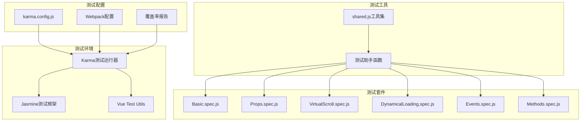
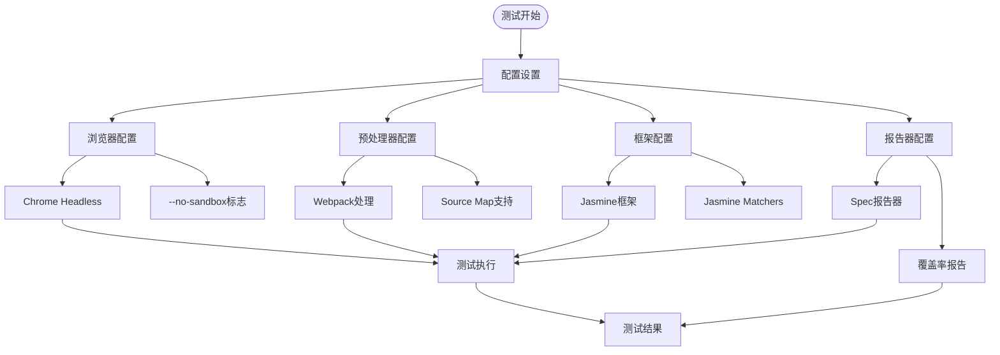
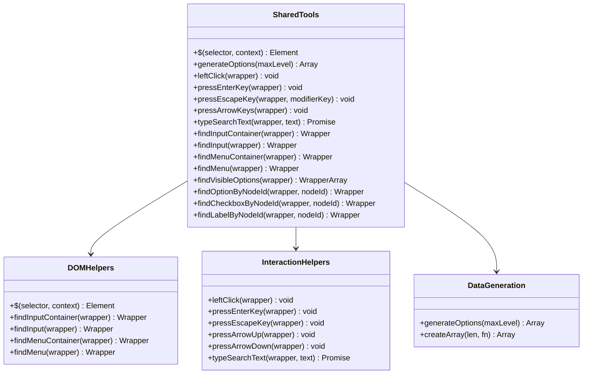
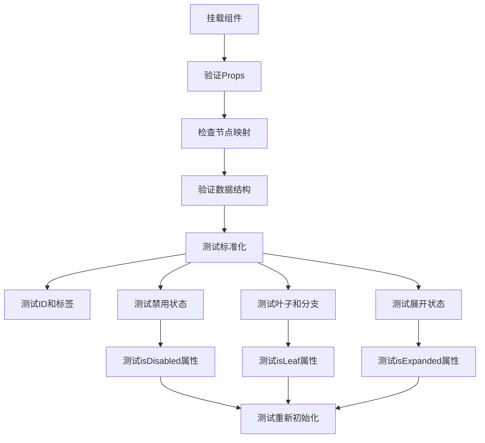
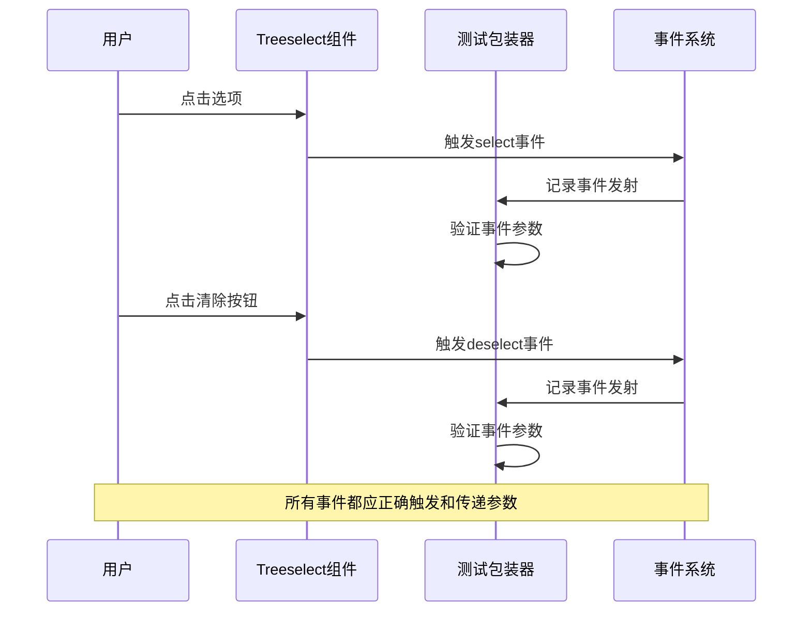
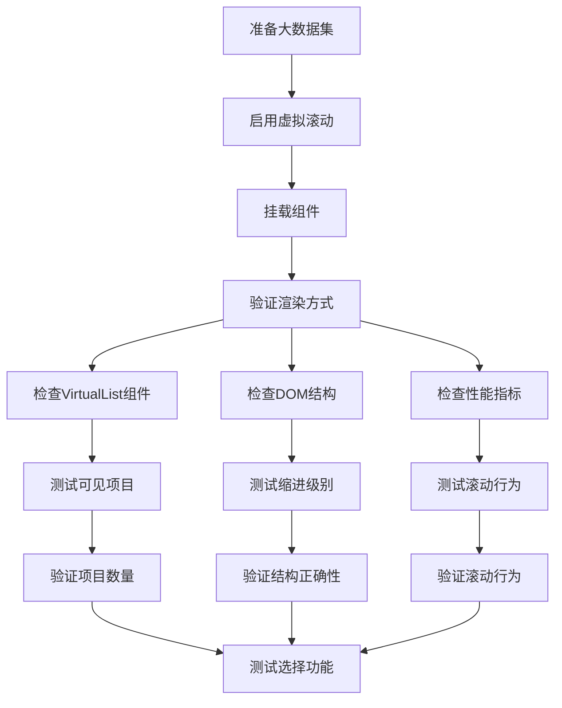
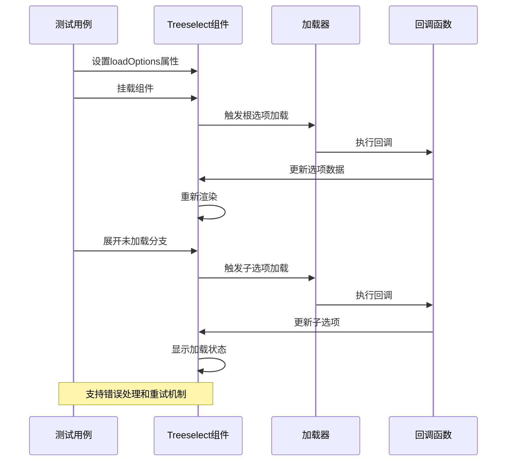

# 测试实践

<cite>
**本文档引用的文件**
- [karma.config.js](file://test/unit/karma.config.js)
- [shared.js](file://test/unit/specs/shared.js)
- [Basic.spec.js](file://test/unit/specs/Basic.spec.js)
- [Props.spec.js](file://test/unit/specs/Props.spec.js)
- [VirtualScroll.spec.js](file://test/unit/specs/VirtualScroll.spec.js)
- [DynamicalLoading.spec.js](file://test/unit/specs/DynamicalLoading.spec.js)
- [Events.spec.js](file://test/unit/specs/Events.spec.js)
- [Methods.spec.js](file://test/unit/specs/Methods.spec.js)
- [index.js](file://test/unit/index.js)
- [package.json](file://package.json)
</cite>

## 目录
1. [概述](#概述)
2. [测试框架架构](#测试框架架构)
3. [Karma配置详解](#karma配置详解)
4. [共享测试工具](#共享测试工具)
5. [组件测试实践](#组件测试实践)
6. [虚拟滚动测试](#虚拟滚动测试)
7. [动态加载测试](#动态加载测试)
8. [测试用例编写指南](#测试用例编写指南)
9. [最佳实践与扩展](#最佳实践与扩展)
10. [总结](#总结)

## 概述

vue-treeselect-next项目采用了一套完整的单元测试体系，基于Karma和Jasmine测试框架，配合Vue Test Utils进行组件测试。这套测试体系涵盖了组件的props验证、事件处理、方法调用、插槽渲染以及复杂的交互场景，特别是针对虚拟滚动和动态加载等高级功能的专门测试。

## 测试框架架构

### 整体架构图



**图表来源**
- [karma.config.js](file://test/unit/karma.config.js#L1-L39)
- [index.js](file://test/unit/index.js#L1-L12)

### 核心依赖关系

测试框架的核心依赖包括：
- **Karma**: 测试运行器，负责启动浏览器和管理测试执行
- **Jasmine**: 测试框架，提供断言和测试组织能力
- **Vue Test Utils**: Vue.js官方测试工具库，提供组件挂载和交互能力
- **Webpack**: 构建工具，用于编译和打包测试代码

**章节来源**
- [package.json](file://package.json#L83-L96)
- [karma.config.js](file://test/unit/karma.config.js#L25-L28)

## Karma配置详解

### 关键配置解析

Karma配置文件是整个测试体系的核心，它定义了测试环境、浏览器兼容性和构建流程。



**图表来源**
- [karma.config.js](file://test/unit/karma.config.js#L3-L38)

### 浏览器配置

Karma使用Chrome Headless浏览器进行测试，通过添加`--no-sandbox`标志解决沙箱限制问题：

| 配置项 | 值 | 说明 |
|--------|-----|------|
| 浏览器类型 | ChromeHeadlessWithoutSandbox | 使用无沙箱的Chrome Headless |
| 标志参数 | --no-sandbox | 解决权限问题，允许测试运行 |
| 自定义启动器 | base: 'ChromeHeadless' | 基于标准Chrome Headless |

### 文件加载配置

测试文件通过Webpack进行预处理和打包：

| 配置项 | 值 | 功能 |
|--------|-----|------|
| 文件入口 | ./index.js | 主测试入口文件 |
| 预处理器 | webpack, sourcemap | 代码转换和源码映射 |
| Webpack配置 | ../../build/webpack-configs/test | 测试专用Webpack配置 |
| 中间件设置 | noInfo: true | 禁用Webpack中间件信息输出 |

### 报告器配置

测试结果通过多种格式输出：

| 报告器类型 | 输出路径 | 格式 |
|------------|----------|------|
| spec | 控制台 | 友好格式的测试结果 |
| coverage | ./coverage | 代码覆盖率报告 |
| lcov | ./coverage | LCOV格式覆盖率 |
| text-summary | ./coverage | 文本摘要 |

**章节来源**
- [karma.config.js](file://test/unit/karma.config.js#L1-L39)

## 共享测试工具

### 工具函数分类

shared.js文件提供了丰富的测试辅助函数，分为以下几类：



**图表来源**
- [shared.js](file://test/unit/specs/shared.js#L1-L162)

### 核心工具函数

#### DOM查询工具
- **`$`函数**: 提供CSS选择器查询，支持上下文限定
- **`findInputContainer`**: 查找输入容器元素
- **`findMenuContainer`**: 查找菜单容器元素
- **`findVisibleOptions`**: 查找可见选项列表

#### 交互模拟工具
- **鼠标点击**: `leftClick`函数模拟左键点击
- **键盘事件**: 支持Enter、Escape、方向键等按键模拟
- **文本输入**: `typeSearchText`函数模拟搜索文本输入

#### 数据生成工具
- **树形数据生成**: `generateOptions`函数生成嵌套选项数据
- **数组创建**: `createArray`函数创建指定长度的数组

### 使用模式

这些工具函数遵循统一的使用模式：

```javascript
// 1. 导入工具函数
import { findInput, typeSearchText } from './shared'

// 2. 挂载组件
const wrapper = mount(Treeselect, { propsData: { options } })

// 3. 使用工具函数进行交互
const input = findInput(wrapper)
await typeSearchText(wrapper, 'search term')

// 4. 验证结果
expect(wrapper.vm.trigger.searchQuery).toBe('search term')
```

**章节来源**
- [shared.js](file://test/unit/specs/shared.js#L1-L162)

## 组件测试实践

### 基础功能测试

Basic.spec.js展示了组件基础功能的全面测试：



**图表来源**
- [Basic.spec.js](file://test/unit/specs/Basic.spec.js#L1-L800)

### Props验证测试

Props.spec.js专注于组件属性的验证和边界情况测试：

| 测试类别 | 测试内容 | 验证点 |
|----------|----------|--------|
| 基础属性 | clearable, searchable | 属性值正确应用 |
| 行为控制 | allowClearingDisabled | 清除行为控制 |
| 选择策略 | autoSelectAncestors | 自动选择祖先节点 |
| 显示控制 | alwaysOpen, appendToBody | 显示和定位控制 |
| 性能优化 | virtualScroll | 虚拟滚动支持 |

### 事件处理测试

Events.spec.js专门测试组件的事件触发机制：



**图表来源**
- [Events.spec.js](file://test/unit/specs/Events.spec.js#L1-L67)

**章节来源**
- [Basic.spec.js](file://test/unit/specs/Basic.spec.js#L1-L800)
- [Props.spec.js](file://test/unit/specs/Props.spec.js#L1-L800)
- [Events.spec.js](file://test/unit/specs/Events.spec.js#L1-L67)

## 虚拟滚动测试

### 虚拟滚动核心特性

VirtualScroll.spec.js专门测试虚拟滚动功能，这是处理大量数据的关键特性：



**图表来源**
- [VirtualScroll.spec.js](file://test/unit/specs/VirtualScroll.spec.js#L1-L363)

### 虚拟滚动测试场景

#### 大数据集处理
- **数据生成**: 使用递归算法生成大规模嵌套数据
- **内存优化**: 验证只渲染可见项目，避免内存溢出
- **性能基准**: 测试初始化时间和渲染性能

#### DOM结构验证
- **容器结构**: 验证vue-treeselect__virtual-list-container的存在
- **项目定位**: 检查spacer和items容器的正确布局
- **缩进系统**: 验证不同层级选项的正确缩进

#### 交互功能测试
- **滚动行为**: 验证滚动事件处理和偏移计算
- **选择功能**: 测试虚拟滚动下的选择操作
- **错误处理**: 验证滚动到底部时的空白处理

### 性能测试指标

| 测试指标 | 阈值要求 | 测试方法 |
|----------|----------|----------|
| 初始化时间 | < 2000ms | 测量组件挂载时间 |
| 渲染项目数 | 可视区域+缓冲区 | 计算可见项目数量 |
| 内存使用 | 线性增长 | 监控内存占用 |
| 滚动响应 | 实时响应 | 测试滚动事件处理 |

**章节来源**
- [VirtualScroll.spec.js](file://test/unit/specs/VirtualScroll.spec.js#L1-L363)

## 动态加载测试

### 异步加载机制

DynamicalLoading.spec.js全面测试动态加载功能，包括根选项和子选项的异步加载：



**图表来源**
- [DynamicalLoading.spec.js](file://test/unit/specs/DynamicalLoading.spec.js#L1-L800)

### 加载状态管理

#### 根选项加载
- **自动加载**: 组件挂载时自动触发根选项加载
- **手动触发**: 通过`autoLoadRootOptions=false`手动控制
- **加载状态**: 显示加载提示和错误信息

#### 子选项加载
- **延迟加载**: 分支节点首次展开时才加载子选项
- **状态跟踪**: 管理加载中、已加载、加载失败状态
- **缓存机制**: 避免重复加载相同的数据

### 错误处理测试

| 错误类型 | 处理方式 | 验证点 |
|----------|----------|--------|
| 加载失败 | 显示错误提示 | 错误信息正确显示 |
| 网络超时 | 提供重试按钮 | 重试功能可用 |
| 数据不一致 | 自动恢复 | 状态正确恢复 |
| 并发冲突 | 防止重复请求 | 请求去重机制 |

### 回调函数测试

动态加载支持多种回调方式：

```javascript
// 同步回调
loadOptions({ parentNode, callback }) {
  parentNode.children = [{ id: 'child', label: 'Child' }]
  callback()
}

// 异步回调
async loadOptions({ parentNode, callback }) {
  const data = await api.getChildren(parentNode.id)
  parentNode.children = data
  callback()
}

// 错误回调
loadOptions({ parentNode, callback }) {
  try {
    const data = await api.getChildren(parentNode.id)
    parentNode.children = data
    callback()
  } catch (error) {
    callback(error)
  }
}
```

**章节来源**
- [DynamicalLoading.spec.js](file://test/unit/specs/DynamicalLoading.spec.js#L1-L800)

## 测试用例编写指南

### 测试结构规范

所有测试文件都遵循统一的结构模式：

```javascript
describe('模块名称', () => {
  describe('功能描述', () => {
    let wrapper, vm
    
    beforeEach(() => {
      // 设置测试环境
      wrapper = mount(Component, {
        propsData: { options, ...otherProps }
      })
      vm = wrapper.vm
    })
    
    afterEach(() => {
      // 清理测试环境
      if (wrapper && wrapper.destroy) {
        wrapper.destroy()
      }
    })
    
    it('测试描述', async () => {
      // 测试步骤
      await wrapper.vm.someMethod()
      
      // 断言验证
      expect(wrapper.vm.someProperty).toBe(expectedValue)
    })
  })
})
```

### 测试数据准备

#### 基础数据结构
```javascript
const basicOptions = [
  {
    id: 'a',
    label: 'A',
    children: [
      { id: 'aa', label: 'AA' },
      { id: 'ab', label: 'AB' }
    ]
  },
  { id: 'b', label: 'B' }
]
```

#### 复杂数据结构
```javascript
const complexOptions = [
  {
    id: 'branch',
    label: 'Branch',
    children: null // 未加载分支
  },
  {
    id: 'disabled',
    label: 'Disabled',
    isDisabled: true,
    children: [
      { id: 'disabled-child', label: 'Disabled Child' }
    ]
  }
]
```

### 断言策略

#### Vue组件断言
```javascript
// 组件实例断言
expect(wrapper.vm.someMethod).toBeDefined()

// DOM元素断言
expect(wrapper.find('.vue-treeselect__menu').exists()).toBe(true)

// 属性值断言
expect(wrapper.vm.internalValue).toEqual(['a', 'b'])

// 事件发射断言
expect(wrapper.emitted().select).toEqual([[optionData, instanceId]])
```

#### 异步操作断言
```javascript
// 等待异步操作完成
await wrapper.vm.$nextTick()

// 等待Promise完成
await someAsyncOperation()

// 等待定时器
await sleep(100)
```

### 测试工具使用

#### 共享工具函数
```javascript
import { 
  findInput,
  typeSearchText,
  leftClick,
  pressEnterKey
} from './shared'

// 使用DOM查找工具
const input = findInput(wrapper)
const option = findOptionByNodeId(wrapper, 'node-id')

// 使用交互工具
await typeSearchText(wrapper, 'search term')
leftClick(option)
pressEnterKey(wrapper)
```

#### 自定义断言
```javascript
// 扩展Jasmine断言
expect.extend({
  toBeNonEmptyArray(received) {
    return {
      message: () => `Expected ${received} to be a non-empty array`,
      pass: Array.isArray(received) && received.length > 0
    }
  }
})
```

## 最佳实践与扩展

### 测试覆盖率优化

#### 关键测试场景
- **边界条件**: 测试空数据、null值、undefined值
- **异常处理**: 测试错误情况和异常流程
- **性能测试**: 测试大数据量和复杂交互
- **兼容性测试**: 测试不同浏览器和设备

#### 测试数据策略
```javascript
// 使用测试工具生成多样化数据
const testData = {
  smallDataset: generateOptions(3),      // 小数据集
  mediumDataset: generateOptions(5),     // 中等数据集  
  largeDataset: generateOptions(10),     // 大数据集
  edgeCases: [
    [],                                  // 空数组
    null,                                // null值
    undefined,                           // undefined值
    { id: 'invalid', label: 'Invalid' }  // 无效数据
  ]
}
```

### 测试维护策略

#### 版本兼容性
- **向后兼容**: 确保新版本不会破坏现有测试
- **渐进升级**: 逐步更新测试框架和工具
- **迁移指南**: 提供测试代码迁移指南

#### 性能监控
```javascript
// 监控测试执行时间
const startTime = Date.now()
await wrapper.vm.someMethod()
const executionTime = Date.now() - startTime
expect(executionTime).toBeLessThan(1000) // 1秒内完成
```

### 扩展测试套件

#### 新功能测试模板
```javascript
describe('新功能', () => {
  it('基本功能测试', async () => {
    // 测试新功能的基本行为
  })
  
  it('边界条件测试', async () => {
    // 测试新功能的边界情况
  })
  
  it('与其他功能集成测试', async () => {
    // 测试新功能与现有功能的集成
  })
})
```

#### 性能回归测试
```javascript
describe('性能回归测试', () => {
  it('大数据集渲染性能', () => {
    const largeDataset = generateLargeDataset(1000, 3)
    const startTime = performance.now()
    
    const wrapper = mount(Treeselect, {
      propsData: { options: largeDataset }
    })
    
    const renderTime = performance.now() - startTime
    expect(renderTime).toBeLessThan(2000) // 2秒内渲染完成
  })
})
```

### 持续集成支持

#### CI/CD集成
- **自动化测试**: 在CI/CD流水线中自动运行测试
- **覆盖率报告**: 生成和上传覆盖率报告
- **失败通知**: 测试失败时发送通知

#### 测试环境隔离
```javascript
// 使用不同的测试环境
const testEnv = process.env.NODE_ENV || 'test'

if (testEnv === 'ci') {
  // CI环境特定配置
  jest.setTimeout(30000) // 30秒超时
} else {
  // 开发环境配置
  jest.setTimeout(5000) // 5秒超时
}
```

## 总结

vue-treeselect-next的测试实践展现了现代前端组件测试的最佳实践。通过Karma与Jasmine的深度集成，配合Vue Test Utils的强大功能，构建了一个全面、可靠的测试体系。

### 核心优势

1. **全面覆盖**: 从基础功能到高级特性，从单元测试到集成测试
2. **工具化**: 丰富的共享测试工具提高了测试效率和一致性
3. **可维护性**: 清晰的测试结构和规范化的测试模式
4. **性能保障**: 专门的性能测试确保组件在大数据量下的稳定性

### 技术亮点

- **虚拟滚动测试**: 针对大数据量场景的专门测试方案
- **动态加载测试**: 完整的异步加载流程测试
- **交互测试**: 丰富的用户交互场景模拟
- **错误处理测试**: 全面的异常情况处理验证

### 实践价值

这套测试实践不仅保证了组件的质量和稳定性，更为其他Vue组件的测试开发提供了宝贵的参考经验。通过学习和应用这些测试模式，开发者可以构建更加可靠和高质量的前端组件库。