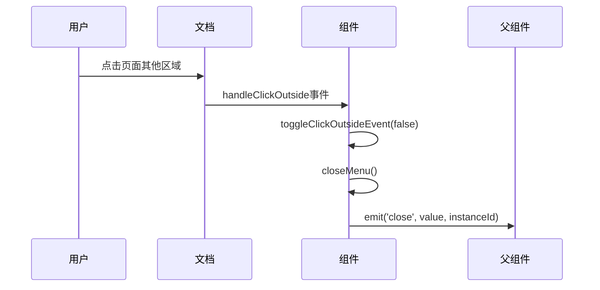
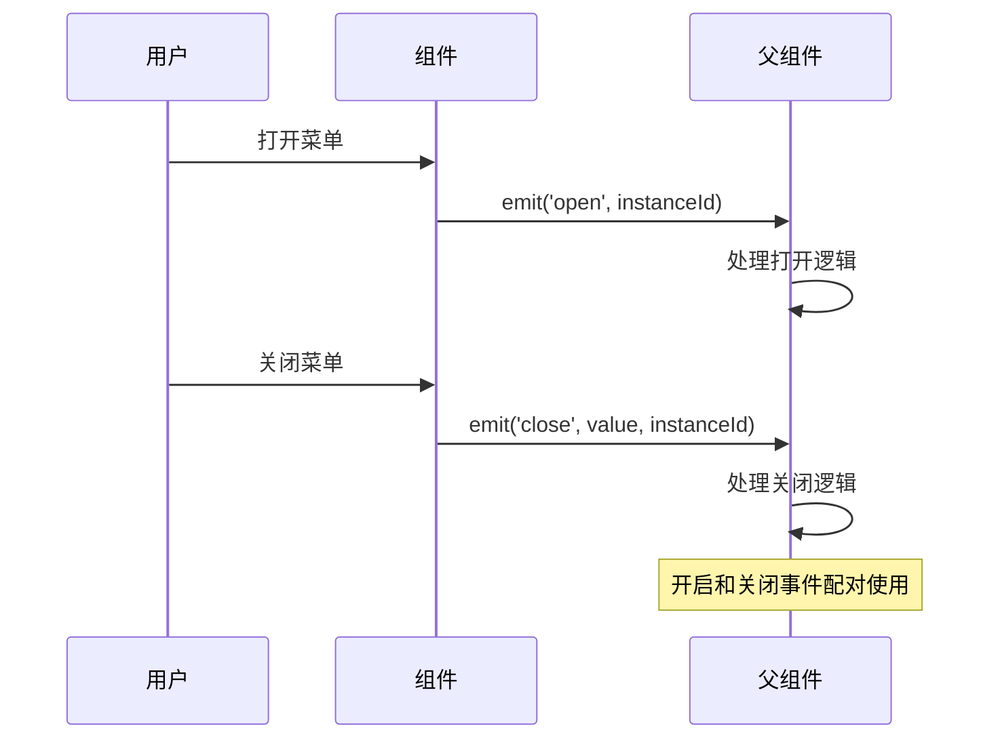

# @close 事件

<cite>
**本文档中引用的文件**
- [src/components/Treeselect.vue](file://src/components/Treeselect.vue)
- [src/mixins/treeselectMixin.js](file://src/mixins/treeselectMixin.js)
- [src/components/Menu.vue](file://src/components/Menu.vue)
- [src/components/Input.vue](file://src/components/Input.vue)
- [src/components/MenuPortal.vue](file://src/components/MenuPortal.vue)
- [test/unit/specs/Events.spec.js](file://test/unit/specs/Events.spec.js)
</cite>

## 目录
1. [简介](#简介)
2. [事件概述](#事件概述)
3. [触发条件](#触发条件)
4. [参数详解](#参数详解)
5. [使用场景](#使用场景)
6. [最佳实践](#最佳实践)
7. [多实例环境](#多实例环境)
8. [与其他事件的关系](#与其他事件的关系)
9. [故障排除](#故障排除)
10. [总结](#总结)

## 简介

`@close` 事件是 Vue Treeselect 组件中的一个重要事件，当下拉菜单关闭时触发。该事件携带组件实例ID作为参数，为开发者提供了在菜单关闭时执行特定逻辑的能力，如状态保存、资源清理和数据分析等。

## 事件概述

### 基本特性

- **触发时机**: 下拉菜单完全关闭时
- **触发条件**: 多种用户交互或系统操作导致菜单关闭
- **携带参数**: 包含组件实例ID的数组 `[value, instanceId]`
- **事件名称**: `'close'`

### 核心功能

`@close` 事件的主要作用是在菜单关闭时通知父组件，允许开发者执行以下操作：
- 状态持久化
- 资源清理
- 数据分析
- 用户行为追踪

## 触发条件

`@close` 事件会在以下情况下触发：

### 1. 点击外部区域
当用户点击页面其他位置而非组件内部时，会触发点击外部事件处理器，导致菜单关闭。



**图表来源**
- [src/mixins/treeselectMixin.js](file://src/mixins/treeselectMixin.js#L1163-L1170)
- [src/mixins/treeselectMixin.js](file://src/mixins/treeselectMixin.js#L1209-L1215)

### 2. 选择选项后自动关闭
当 `closeOnSelect` 属性为 `true` 且用户选择了某个选项时，菜单会自动关闭。

### 3. 按下 ESC 键
当菜单处于打开状态时，按下键盘的 ESC 键会关闭菜单。

### 4. 菜单失去焦点
当菜单失去焦点时，会触发关闭操作。

### 5. 异步加载完成
在异步加载模式下，当远程数据加载完成后，如果菜单仍然打开，则会触发关闭事件。

### 6. 手动调用关闭方法
通过编程方式调用 `closeMenu()` 方法时也会触发该事件。

**节来源**
- [src/mixins/treeselectMixin.js](file://src/mixins/treeselectMixin.js#L1462-L1469)
- [src/components/Input.vue](file://src/components/Input.vue#L145-L151)

## 参数详解

### instanceId 参数

`@close` 事件携带两个参数：

1. **value**: 当前选中的值（数组形式）
2. **instanceId**: 组件实例的唯一标识符

#### instanceId 的重要性

- **唯一标识**: 每个组件实例都有唯一的 `instanceId`
- **多实例支持**: 在同一页面存在多个 Treeselect 实例时区分不同实例
- **状态管理**: 帮助维护每个实例独立的状态

```mermaid
flowchart TD
A[用户交互] --> B{判断触发条件}
B --> |点击外部| C[handleClickOutside]
B --> |选择选项| D[select方法]
B --> |按下ESC| E[handleKeyDown]
B --> |失去焦点| F[blur事件]
C --> G[toggleClickOutsideEvent(false)]
D --> H[closeMenu]
E --> I[closeMenu]
F --> J[closeMenu]
G --> K[closeMenu方法]
H --> K
I --> K
J --> K
K --> L[emit('close', value, instanceId)]
```

**图表来源**
- [src/mixins/treeselectMixin.js](file://src/mixins/treeselectMixin.js#L1462-L1469)
- [src/mixins/treeselectMixin.js](file://src/mixins/treeselectMixin.js#L1209-L1215)

**节来源**
- [src/mixins/treeselectMixin.js](file://src/mixins/treeselectMixin.js#L1462-L1469)

## 使用场景

### 1. 状态保存

在菜单关闭时保存当前选择状态，防止数据丢失。

```javascript
// 示例：状态保存场景
methods: {
  handleClose(value, instanceId) {
    // 将当前选择状态保存到 Vuex 或本地存储
    this.$store.dispatch('saveSelection', { 
      instanceId, 
      value 
    });
    
    // 或者保存到本地存储
    localStorage.setItem(`treeselect_${instanceId}`, JSON.stringify(value));
  }
}
```

### 2. 资源清理

释放菜单打开时可能占用的资源。

```javascript
// 示例：资源清理场景
methods: {
  handleClose(value, instanceId) {
    // 清理搜索缓存
    this.clearSearchCache(instanceId);
    
    // 停止定时器
    if (this.timers[instanceId]) {
      clearInterval(this.timers[instanceId]);
      delete this.timers[instanceId];
    }
    
    // 重置滚动位置
    this.resetScrollPosition(instanceId);
  }
}
```

### 3. 分析统计

记录用户使用行为，用于产品分析。

```javascript
// 示例：分析统计场景
methods: {
  handleClose(value, instanceId) {
    // 发送分析事件
    this.trackAnalytics({
      eventType: 'treeselect_closed',
      instanceId,
      selectionCount: value.length,
      timestamp: Date.now()
    });
    
    // 记录关闭原因（可扩展）
    this.recordCloseReason(instanceId);
  }
}
```

### 4. 条件性操作

根据关闭时的选择状态执行不同的逻辑。

```javascript
// 示例：条件性操作场景
methods: {
  handleClose(value, instanceId) {
    // 如果有选择，执行某些操作
    if (value.length > 0) {
      this.performPostSelectionActions(value, instanceId);
    }
    
    // 清理临时数据
    this.cleanupTemporaryData(instanceId);
  }
}
```

## 最佳实践

### 1. 事件监听器设置

正确设置 `@close` 事件监听器：

```javascript
// 推荐：在模板中绑定事件
<treeselect
  v-model="selectedValue"
  :options="options"
  @close="handleClose"
/>

// 或者在 JavaScript 中绑定
mounted() {
  this.$refs.myTreeselect.$on('close', this.handleClose);
}
```

### 2. 参数解构

合理使用解构来访问参数：

```javascript
methods: {
  handleClose([value, instanceId]) {
    // 使用解构后的参数
    console.log('关闭时的值:', value);
    console.log('实例ID:', instanceId);
    
    // 执行业务逻辑
    this.processCloseAction(value, instanceId);
  }
}
```

### 3. 错误处理

添加适当的错误处理机制：

```javascript
methods: {
  handleClose([value, instanceId]) {
    try {
      // 执行可能出错的操作
      this.saveState(value, instanceId);
      this.cleanupResources(instanceId);
      
    } catch (error) {
      console.error('关闭事件处理失败:', error);
      // 可以选择发送错误报告或显示用户友好的消息
      this.showErrorNotification(error);
    }
  }
}
```

### 4. 性能优化

避免在事件处理函数中执行耗时操作：

```javascript
methods: {
  handleClose([value, instanceId]) {
    // 使用微任务确保 DOM 更新完成
    this.$nextTick(() => {
      // 执行非关键操作
      this.scheduleBackgroundTasks(instanceId);
    });
    
    // 立即执行关键操作
    this.performImmediateActions(value, instanceId);
  }
}
```

### 5. 事件防抖

对于频繁触发的场景，考虑使用防抖：

```javascript
methods: {
  handleClose: debounce(function([value, instanceId]) {
    this.processCloseEvent(value, instanceId);
  }, 300)
}
```

## 多实例环境

### 实例隔离

在多实例环境中，`instanceId` 参数至关重要：

```javascript
// 多实例场景下的正确处理
methods: {
  handleClose([value, instanceId]) {
    // 确保操作仅影响正确的实例
    if (this.activeInstanceId === instanceId) {
      this.updateActiveState(value);
    }
    
    // 在全局状态中保存各实例的状态
    this.updateGlobalState(instanceId, value);
  }
}
```

### 实例管理

```javascript
// 实例管理示例
data() {
  return {
    instances: {},
    activeInstanceId: null
  };
},
methods: {
  handleClose([value, instanceId]) {
    // 更新实例状态
    this.$set(this.instances, instanceId, {
      value,
      lastClosed: Date.now(),
      isOpen: false
    });
    
    // 执行跨实例操作
    this.notifyOtherInstances(instanceId, value);
  }
}
```

### 状态同步

```javascript
// 状态同步示例
methods: {
  handleClose([value, instanceId]) {
    // 广播状态变化
    this.$emit('instance-state-changed', {
      instanceId,
      value,
      action: 'closed'
    });
    
    // 同步到服务器
    this.syncInstanceState(instanceId, value);
  }
}
```

**节来源**
- [src/mixins/treeselectMixin.js](file://src/mixins/treeselectMixin.js#L62)
- [src/mixins/treeselectMixin.js](file://src/mixins/treeselectMixin.js#L1468)

## 与其他事件的关系

### @open 事件配对使用

`@close` 事件通常与 `@open` 事件配合使用，形成完整的生命周期管理：



**图表来源**
- [src/mixins/treeselectMixin.js](file://src/mixins/treeselectMixin.js#L1478)
- [src/mixins/treeselectMixin.js](file://src/mixins/treeselectMixin.js#L1468)

### 生命周期对比

| 事件 | 触发时机 | 主要用途 | 参数 |
|------|----------|----------|------|
| `@open` | 菜单打开时 | 初始化、加载数据、状态准备 | `instanceId` |
| `@close` | 菜单关闭时 | 状态保存、资源清理、数据分析 | `[value, instanceId]` |

### 状态管理最佳实践

```javascript
// 完整的生命周期管理
data() {
  return {
    openInstances: new Set(),
    closeTimestamps: {}
  };
},
methods: {
  handleOpen(instanceId) {
    this.openInstances.add(instanceId);
    this.$emit('instance-opened', { instanceId, timestamp: Date.now() });
  },
  
  handleClose([value, instanceId]) {
    this.openInstances.delete(instanceId);
    this.closeTimestamps[instanceId] = Date.now();
    
    // 执行关闭后的清理工作
    this.performCleanup(instanceId);
    
    this.$emit('instance-closed', { 
      instanceId, 
      value, 
      duration: this.calculateDuration(instanceId) 
    });
  }
}
```

**节来源**
- [src/mixins/treeselectMixin.js](file://src/mixins/treeselectMixin.js#L1478)
- [src/mixins/treeselectMixin.js](file://src/mixins/treeselectMixin.js#L1468)

## 故障排除

### 常见问题

#### 1. 事件未触发

**问题**: `@close` 事件没有按预期触发

**可能原因**:
- 事件监听器未正确绑定
- 组件被销毁或卸载
- 条件阻止了事件发射

**解决方案**:
```javascript
// 检查事件绑定
mounted() {
  console.log('Close事件监听器:', this.$listeners.close);
}

// 确保组件正常运行
beforeDestroy() {
  console.log('组件即将销毁');
}
```

#### 2. instanceId 不一致

**问题**: 在多实例环境中获取到错误的 `instanceId`

**解决方案**:
```javascript
// 添加调试信息
methods: {
  handleClose([value, instanceId]) {
    console.log('接收到的instanceId:', instanceId);
    console.log('期望的instanceId:', this.expectedInstanceId);
    
    if (instanceId !== this.expectedInstanceId) {
      console.warn('instanceId不匹配');
    }
  }
}
```

#### 3. 参数格式错误

**问题**: 事件参数格式不符合预期

**解决方案**:
```javascript
// 参数验证
methods: {
  handleClose(params) {
    // 验证参数格式
    if (!Array.isArray(params) || params.length !== 2) {
      console.error('无效的事件参数:', params);
      return;
    }
    
    const [value, instanceId] = params;
    
    // 验证参数类型
    if (typeof instanceId !== 'string' && typeof instanceId !== 'number') {
      console.error('无效的instanceId类型:', typeof instanceId);
      return;
    }
    
    // 处理事件
    this.processCloseEvent(value, instanceId);
  }
}
```

### 调试技巧

#### 1. 添加日志

```javascript
methods: {
  handleClose([value, instanceId]) {
    console.group('Close事件详情');
    console.log('选中值:', value);
    console.log('实例ID:', instanceId);
    console.log('当前时间:', new Date().toISOString());
    console.groupEnd();
    
    // 继续处理
    this.processCloseEvent(value, instanceId);
  }
}
```

#### 2. 状态检查

```javascript
methods: {
  handleClose([value, instanceId]) {
    // 检查组件状态
    const component = this.$refs[`treeselect-${instanceId}`];
    console.log('组件状态:', {
      isOpen: component?.menu.isOpen,
      value: component?.internalValue,
      instanceId
    });
    
    // 继续处理
    this.processCloseEvent(value, instanceId);
  }
}
```

#### 3. 时间戳跟踪

```javascript
data() {
  return {
    eventTimestamps: {}
  };
},
methods: {
  handleClose([value, instanceId]) {
    const timestamp = Date.now();
    this.eventTimestamps[instanceId] = timestamp;
    
    console.log(`实例${instanceId}在${timestamp}关闭`);
    
    // 分析事件间隔
    const lastOpen = this.eventTimestamps[`open-${instanceId}`];
    if (lastOpen) {
      const duration = timestamp - lastOpen;
      console.log(`打开到关闭耗时: ${duration}ms`);
    }
    
    this.processCloseEvent(value, instanceId);
  }
}
```

## 总结

`@close` 事件是 Vue Treeselect 组件生态系统中的关键部分，它提供了在菜单关闭时执行自定义逻辑的能力。通过理解其触发条件、参数结构和最佳实践，开发者可以构建更加健壮和用户友好的应用程序。

### 关键要点

1. **事件触发时机**: 在菜单完全关闭时触发
2. **参数结构**: `[value, instanceId]` 数组格式
3. **instanceId 重要性**: 在多实例环境中提供实例隔离
4. **使用场景**: 状态保存、资源清理、数据分析等
5. **最佳实践**: 正确绑定、参数验证、错误处理

### 推荐做法

- 始终验证事件参数的格式和类型
- 在多实例环境中充分利用 `instanceId` 进行实例隔离
- 结合 `@open` 事件实现完整的生命周期管理
- 考虑性能影响，避免在事件处理函数中执行耗时操作

通过遵循这些指导原则，您可以充分发挥 `@close` 事件的潜力，创建更加可靠和高效的 Vue Treeselect 应用程序。