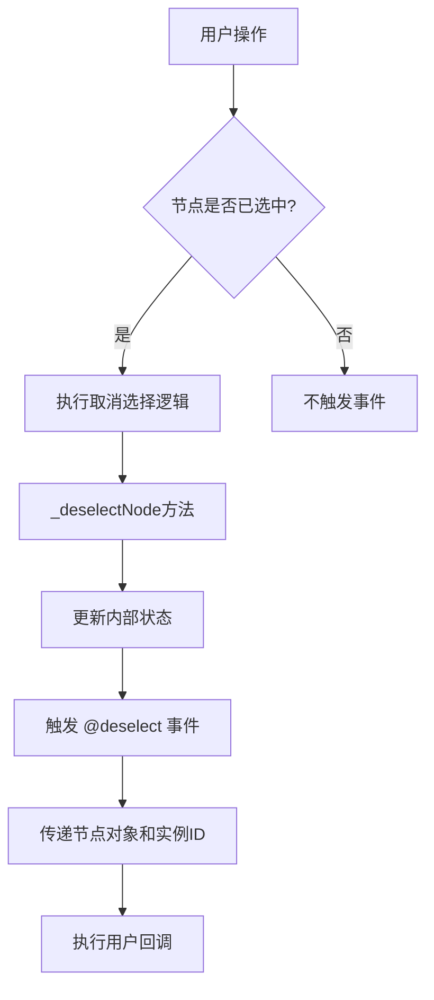
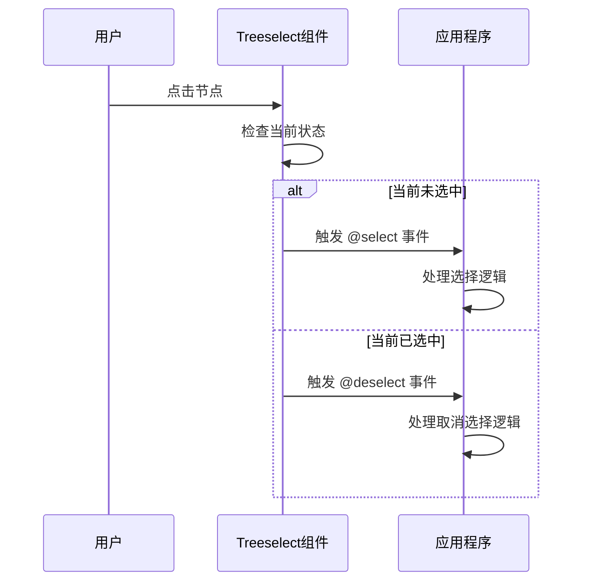

# @deselect 事件

<cite>
**本文档中引用的文件**
- [Treeselect.vue](file://src/components/Treeselect.vue)
- [treeselectMixin.js](file://src/mixins/treeselectMixin.js)
- [Events.spec.js](file://test/unit/specs/Events.spec.js)
- [Props.spec.js](file://test/unit/specs/Props.spec.js)
- [DynamicalLoading.spec.js](file://test/unit/specs/DynamicalLoading.spec.js)
</cite>

## 目录
1. [概述](#概述)
2. [事件触发机制](#事件触发机制)
3. [事件参数详解](#事件参数详解)
4. [与 @select 事件的对称关系](#与-select-事件的对称关系)
5. [应用场景](#应用场景)
6. [代码示例](#代码示例)
7. [实例ID参数详解](#实例id参数详解)
8. [最佳实践](#最佳实践)
9. [故障排除](#故障排除)

## 概述

`@deselect` 事件是 Vue Treeselect 组件中的一个重要事件，当用户取消选择一个已选项时触发。该事件携带两个主要参数：被取消选择的节点对象和组件实例ID，为开发者提供了精确的事件监听和状态管理能力。

### 核心特性

- **精确性**：提供被取消选择节点的完整数据
- **唯一性**：通过实例ID区分多个组件实例
- **实时性**：在节点状态变更时立即触发
- **对称性**：与 `@select` 事件形成完整的选中状态监控

## 事件触发机制

### 触发时机

`@deselect` 事件在以下情况下触发：

1. **用户交互**：点击已选中节点的取消按钮或复选框
2. **程序控制**：通过编程方式调用取消选择操作
3. **批量操作**：清空所有选择项时
4. **键盘操作**：使用退格键删除最后一个选择项

### 触发流程



**图表来源**
- [treeselectMixin.js](file://src/mixins/treeselectMixin.js#L1784-L1809)

**章节来源**
- [treeselectMixin.js](file://src/mixins/treeselectMixin.js#L1784-L1809)

## 事件参数详解

### 参数结构

`@deselect` 事件触发时传递两个参数：

| 参数名 | 类型 | 描述 |
|--------|------|------|
| `node` | Object | 被取消选择的节点原始数据对象 |
| `instanceId` | String/Number | 组件实例的唯一标识符 |

### 节点对象结构

节点对象包含以下关键属性：

| 属性名 | 类型 | 描述 |
|--------|------|------|
| `id` | String/Number | 节点的唯一标识符 |
| `label` | String | 节点显示文本 |
| `children` | Array | 子节点数组（分支节点） |
| `isDisabled` | Boolean | 是否禁用状态 |
| `raw` | Object | 原始传入的数据对象 |

### 实例ID参数

实例ID用于区分同一页面中的多个 Treeselect 组件实例，确保事件处理的准确性。

**章节来源**
- [Events.spec.js](file://test/unit/specs/Events.spec.js#L37-L62)

## 与 @select 事件的对称关系

### 完整的选中状态监控

`@deselect` 和 `@select` 事件形成了完整的选中状态监控体系：



**图表来源**
- [treeselectMixin.js](file://src/mixins/treeselectMixin.js#L1784-L1809)

### 对称性特征

1. **参数一致性**：两个事件都传递相同的参数结构
2. **触发条件互补**：一个在选择时触发，另一个在取消选择时触发
3. **状态转换对应**：形成完整的状态转换链路
4. **业务逻辑互补**：分别处理添加和移除场景

**章节来源**
- [treeselectMixin.js](file://src/mixins/treeselectMixin.js#L1784-L1809)

## 应用场景

### 审计日志记录

```javascript
// 记录用户的选择和取消选择操作
methods: {
  handleSelectionChange(node, instanceId) {
    const action = this.selectionHistory.has(node.id) ? '取消选择' : '选择';
    this.logAuditTrail({
      userId: this.currentUser.id,
      action,
      nodeId: node.id,
      nodeName: node.label,
      timestamp: new Date(),
      instanceId
    });
  }
}
```

### 权限变更追踪

```javascript
// 监控权限相关节点的选择状态变化
methods: {
  trackPermissionChanges(node, instanceId) {
    if (node.category === 'permission') {
      this.updateUserPermissions({
        userId: this.targetUserId,
        permissionId: node.id,
        action: this.selectionHistory.has(node.id) ? 'remove' : 'add',
        timestamp: new Date()
      });
    }
  }
}
```

### 实时状态同步

```javascript
// 同步到远程服务
methods: {
  syncSelectionWithServer(node, instanceId) {
    this.api.updateSelection({
      userId: this.userId,
      selection: {
        nodeId: node.id,
        action: this.selectionHistory.has(node.id) ? 'deselect' : 'select',
        timestamp: Date.now()
      }
    });
  }
}
```

## 代码示例

### 基础使用示例

```vue
<template>
  <treeselect
    v-model="selectedValues"
    :options="treeOptions"
    @deselect="handleDeselect"
    @select="handleSelect"
    instance-id="user-permissions"
  />
</template>

<script>
export default {
  data() {
    return {
      selectedValues: [],
      treeOptions: [
        {
          id: 'admin',
          label: '管理员',
          children: [
            { id: 'read', label: '读取权限' },
            { id: 'write', label: '写入权限' }
          ]
        }
      ]
    };
  },
  methods: {
    handleSelect(node, instanceId) {
      console.log('节点被选择:', node);
      console.log('来自实例:', instanceId);
      // 执行选择后的逻辑
    },
    handleDeselect(node, instanceId) {
      console.log('节点被取消选择:', node);
      console.log('来自实例:', instanceId);
      // 执行取消选择后的逻辑
    }
  }
};
</script>
```

### 多实例场景示例

```vue
<template>
  <div>
    <!-- 用户权限选择 -->
    <treeselect
      v-model="userPermissions"
      :options="permissionsTree"
      @deselect="handleDeselect"
      @select="handleSelect"
      instance-id="user-permissions"
      placeholder="选择用户权限"
    />
    
    <!-- 角色分配 -->
    <treeselect
      v-model="userRoles"
      :options="rolesTree"
      @deselect="handleDeselect"
      @select="handleSelect"
      instance-id="user-roles"
      placeholder="选择用户角色"
    />
  </div>
</template>

<script>
export default {
  methods: {
    handleSelectionChange(node, instanceId) {
      switch(instanceId) {
        case 'user-permissions':
          this.handlePermissionChange(node);
          break;
        case 'user-roles':
          this.handleRoleChange(node);
          break;
        default:
          console.warn('未知实例ID:', instanceId);
      }
    },
    handlePermissionChange(node) {
      // 处理权限变更逻辑
      console.log('权限变更:', node);
    },
    handleRoleChange(node) {
      // 处理角色变更逻辑
      console.log('角色变更:', node);
    }
  }
};
</script>
```

### 高级监控示例

```vue
<template>
  <treeselect
    v-model="selectionState"
    :options="treeData"
    @deselect="trackDeselect"
    @select="trackSelect"
    instance-id="audit-trail"
  />
</template>

<script>
export default {
  data() {
    return {
      selectionState: [],
      auditLog: [],
      sessionStartTime: Date.now()
    };
  },
  methods: {
    trackDeselect(node, instanceId) {
      this.auditLog.push({
        type: 'DESELECT',
        nodeId: node.id,
        nodeName: node.label,
        timestamp: Date.now(),
        duration: Date.now() - this.sessionStartTime,
        userAction: this.detectUserAction()
      });
      
      // 实时同步到服务器
      this.syncToServer('deselect', node);
    },
    trackSelect(node, instanceId) {
      this.auditLog.push({
        type: 'SELECT',
        nodeId: node.id,
        nodeName: node.label,
        timestamp: Date.now(),
        duration: Date.now() - this.sessionStartTime,
        userAction: this.detectUserAction()
      });
      
      // 实时同步到服务器
      this.syncToServer('select', node);
    },
    detectUserAction() {
      // 检测用户行为模式
      return this.getUserBehaviorPattern();
    },
    syncToServer(action, node) {
      // 异步同步到服务器
      this.api.post('/audit-log', {
        action,
        nodeId: node.id,
        timestamp: Date.now(),
        sessionId: this.sessionId
      });
    }
  }
};
</script>
```

**章节来源**
- [Events.spec.js](file://test/unit/specs/Events.spec.js#L37-L62)
- [Props.spec.js](file://test/unit/specs/Props.spec.js#L1585-L1613)

## 实例ID参数详解

### 实例ID的作用

实例ID是 Treeselect 组件的一个重要特性，用于区分同一页面中的多个组件实例：

1. **唯一标识**：每个组件实例都有唯一的实例ID
2. **事件隔离**：不同实例的事件不会相互干扰
3. **状态分离**：各实例维护独立的状态
4. **调试支持**：便于调试和问题定位

### 实例ID的生成规则

```javascript
// 自动生成的实例ID格式
// 默认情况下，如果没有指定instanceId，系统会自动生成
// 格式：数字$$，例如：0$$, 1$$, 2$$...
```

### 自定义实例ID

```vue
<template>
  <treeselect
    v-model="selectedItems"
    :options="options"
    @deselect="handleDeselect"
    instance-id="custom-instance-1"
    placeholder="自定义实例1"
  />
  
  <treeselect
    v-model="selectedItems"
    :options="options"
    @deselect="handleDeselect"
    instance-id="custom-instance-2"
    placeholder="自定义实例2"
  />
</template>
```

### 实例ID在事件处理中的应用

```javascript
methods: {
  handleDeselect(node, instanceId) {
    // 根据实例ID进行不同的处理
    switch(instanceId) {
      case 'user-permissions':
        this.handleUserPermissionDeselect(node);
        break;
      case 'department-selection':
        this.handleDepartmentDeselect(node);
        break;
      case 'custom-instance-1':
        this.handleCustomInstance1Deselect(node);
        break;
      default:
        console.warn(`未知实例ID: ${instanceId}`);
        this.handleDefaultDeselect(node);
    }
  },
  
  handleUserPermissionDeselect(node) {
    // 用户权限相关的取消选择处理
    this.updateUserPermissions(node.id, 'remove');
  },
  
  handleDepartmentDeselect(node) {
    // 部门选择相关的取消选择处理
    this.updateDepartmentHierarchy(node.id, 'remove');
  }
}
```

**章节来源**
- [treeselectMixin.js](file://src/mixins/treeselectMixin.js#L967-L969)
- [DynamicalLoading.spec.js](file://test/unit/specs/DynamicalLoading.spec.js#L387-L402)

## 最佳实践

### 1. 事件处理函数设计

```javascript
// 推荐：使用解构和类型检查
methods: {
  handleDeselect({ id, label, category }, instanceId) {
    // 类型检查和默认值处理
    if (!id || !label) {
      console.error('无效的节点对象:', { id, label, category });
      return;
    }
    
    // 业务逻辑处理
    this.processDeselection(id, label, category, instanceId);
  }
}
```

### 2. 错误处理和边界情况

```javascript
methods: {
  handleDeselect(node, instanceId) {
    try {
      // 验证输入参数
      if (!node || typeof node !== 'object') {
        throw new Error('无效的节点参数');
      }
      
      // 检查节点完整性
      if (!node.hasOwnProperty('id') || !node.hasOwnProperty('label')) {
        throw new Error('节点缺少必要属性');
      }
      
      // 执行业务逻辑
      this.performDeselection(node, instanceId);
      
    } catch (error) {
      console.error('取消选择失败:', {
        error: error.message,
        node,
        instanceId,
        timestamp: new Date()
      });
      
      // 可选：回滚操作或通知用户
      this.notifyUser('操作失败，请重试');
    }
  }
}
```

### 3. 性能优化建议

```javascript
methods: {
  // 使用防抖处理频繁的取消选择操作
  handleDeselect: debounce(function(node, instanceId) {
    this.processDeselection(node, instanceId);
  }, 300),
  
  // 批量处理多个取消选择事件
  handleBatchDeselect(nodes, instanceId) {
    // 将多个取消选择合并为单次处理
    const deselectionActions = nodes.map(node => 
      this.prepareDeselectionAction(node, instanceId)
    );
    
    this.executeBatchAction(deselectionActions);
  }
}
```

### 4. 状态管理集成

```javascript
methods: {
  handleDeselect(node, instanceId) {
    // Vuex集成
    this.$store.commit('updateSelection', {
      nodeId: node.id,
      action: 'deselect',
      timestamp: Date.now()
    });
    
    // 或者Pinia集成
    this.store.updateSelection({
      nodeId: node.id,
      action: 'deselect',
      timestamp: Date.now()
    });
  }
}
```

## 故障排除

### 常见问题及解决方案

#### 1. 事件未触发

**问题描述**：绑定的 `@deselect` 事件没有响应

**可能原因**：
- 组件未正确初始化
- 事件监听器绑定错误
- 节点状态不符合触发条件

**解决方案**：
```javascript
// 检查组件状态
mounted() {
  console.log('组件初始化完成:', this.$refs.treeselect);
  
  // 确保事件监听器正确绑定
  this.$refs.treeselect.$on('deselect', this.handleDeselect);
}

// 检查节点状态
methods: {
  handleDeselect(node, instanceId) {
    console.log('接收到取消选择事件:', { node, instanceId });
    
    // 添加调试信息
    if (!node || !node.id) {
      console.error('节点对象不完整:', node);
      return;
    }
    
    // 验证实例ID
    if (!instanceId) {
      console.error('实例ID缺失:', instanceId);
      return;
    }
  }
}
```

#### 2. 实例ID不匹配

**问题描述**：在多实例场景中，事件中的实例ID与预期不符

**解决方案**：
```javascript
// 明确设置实例ID
<treeselect
  v-model="selectedItems"
  :options="options"
  @deselect="handleDeselect"
  instance-id="specific-instance-name"
/>

// 在事件处理中验证实例ID
methods: {
  handleDeselect(node, instanceId) {
    const expectedInstanceId = 'specific-instance-name';
    
    if (instanceId !== expectedInstanceId) {
      console.warn(`实例ID不匹配: ${instanceId} != ${expectedInstanceId}`);
      return;
    }
    
    // 正常处理逻辑
    this.processDeselection(node);
  }
}
```

#### 3. 内存泄漏问题

**问题描述**：长时间运行后出现性能下降

**解决方案**：
```javascript
// 清理事件监听器
beforeDestroy() {
  // 移除事件监听器
  if (this.$refs.treeselect) {
    this.$refs.treeselect.$off('deselect', this.handleDeselect);
  }
  
  // 清理定时器和订阅
  if (this.debounceTimer) {
    clearTimeout(this.debounceTimer);
  }
}

// 使用弱引用避免循环引用
methods: {
  setupEventListeners() {
    // 使用弱引用避免内存泄漏
    const weakHandler = (...args) => {
      if (this && this.handleDeselect) {
        this.handleDeselect(...args);
      }
    };
    
    this.$refs.treeselect.$on('deselect', weakHandler);
  }
}
```

#### 4. 异步处理问题

**问题描述**：在异步操作中处理取消选择事件导致竞态条件

**解决方案**：
```javascript
data() {
  return {
    processingDeselect: false,
    pendingDeselectQueue: []
  };
},

methods: {
  async handleDeselect(node, instanceId) {
    // 防止并发处理
    if (this.processingDeselect) {
      this.pendingDeselectQueue.push({ node, instanceId });
      return;
    }
    
    try {
      this.processingDeselect = true;
      
      // 执行异步处理
      await this.processDeselectionAsync(node, instanceId);
      
      // 处理队列中的待处理事件
      while (this.pendingDeselectQueue.length > 0) {
        const { node, instanceId } = this.pendingDeselectQueue.shift();
        await this.processDeselectionAsync(node, instanceId);
      }
      
    } catch (error) {
      console.error('异步取消选择处理失败:', error);
    } finally {
      this.processingDeselect = false;
    }
  }
}
```

**章节来源**
- [treeselectMixin.js](file://src/mixins/treeselectMixin.js#L967-L969)