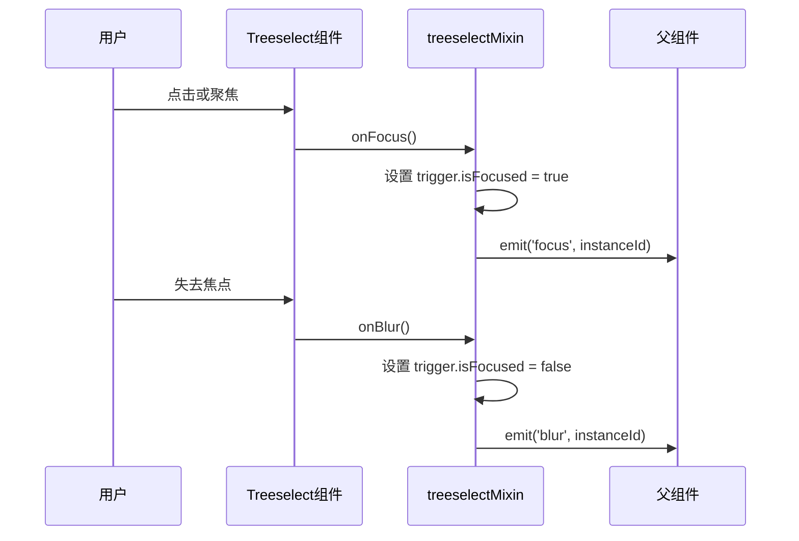
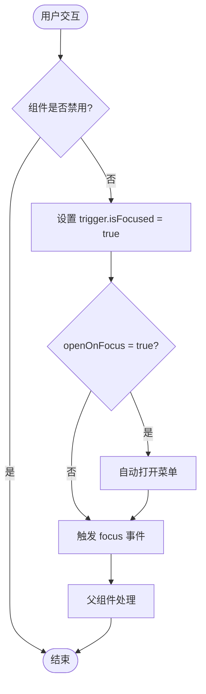
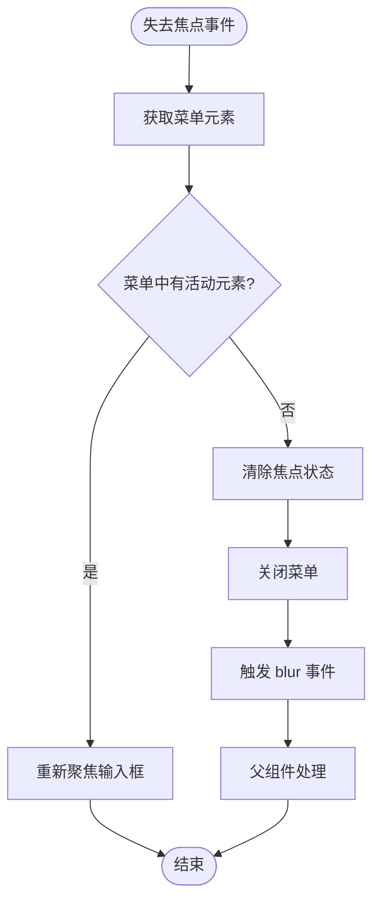

# @focus 和 @blur 事件

<cite>
**本文档中引用的文件**
- [src/components/Treeselect.vue](file://src/components/Treeselect.vue)
- [src/mixins/treeselectMixin.js](file://src/mixins/treeselectMixin.js)
- [src/components/Input.vue](file://src/components/Input.vue)
- [src/components/Control.vue](file://src/components/Control.vue)
- [test/unit/specs/Events.spec.js](file://test/unit/specs/Events.spec.js)
- [test/unit/specs/Props.spec.js](file://test/unit/specs/Props.spec.js)
- [test/unit/specs/Menu.spec.js](file://test/unit/specs/Menu.spec.js)
- [test/unit/specs/shared.js](file://test/unit/specs/shared.js)
</cite>

## 目录
1. [简介](#简介)
2. [事件机制概述](#事件机制概述)
3. [@focus 事件详解](#-focus-事件详解)
4. [@blur 事件详解](#-blur-事件详解)
5. [instanceId 参数详解](#instanceid-参数详解)
6. [实际应用场景](#实际应用场景)
7. [最佳实践指南](#最佳实践指南)
8. [故障排除](#故障排除)
9. [总结](#总结)

## 简介

Treeselect 组件提供了两个重要的生命周期事件：`@focus` 和 `@blur`。这两个事件分别在组件获得焦点和失去焦点时触发，为开发者提供了精确的交互控制能力。通过这些事件，可以实现复杂的表单验证、UI 状态管理、用户体验优化等功能。

## 事件机制概述

Treeselect 的事件系统基于 Vue.js 的事件发射机制，所有事件都携带组件实例 ID 作为参数，确保在复杂应用中的可追踪性和唯一性。



**图表来源**
- [src/mixins/treeselectMixin.js](file://src/mixins/treeselectMixin.js#L1180-L1200)
- [src/components/Input.vue](file://src/components/Input.vue#L80-L100)

## @focus 事件详解

### 触发时机

`@focus` 事件在以下情况下触发：
- 用户点击组件控件区域
- 调用 `focusInput()` 方法
- 组件获得键盘焦点
- 自动聚焦（autoFocus 属性启用）

### 核心功能

#### 1. 焦点状态管理
当 `@focus` 事件触发时，组件内部会设置 `trigger.isFocused = true`，这直接影响组件的视觉状态和行为。

#### 2. 自动打开菜单
结合 `openOnFocus` 属性，可以在获得焦点时自动打开下拉菜单。

#### 3. 焦点样式切换
组件会根据焦点状态动态添加 CSS 类名，如 `vue-treeselect--focused`。

### 技术实现



**图表来源**
- [src/mixins/treeselectMixin.js](file://src/mixins/treeselectMixin.js#L80-L90)
- [src/components/Input.vue](file://src/components/Input.vue#L80-L90)

**章节来源**
- [src/mixins/treeselectMixin.js](file://src/mixins/treeselectMixin.js#L80-L90)
- [src/components/Input.vue](file://src/components/Input.vue#L80-L100)

## @blur 事件详解

### 触发时机

`@blur` 事件在以下情况下触发：
- 用户点击页面其他区域
- 组件失去焦点
- 调用 `blurInput()` 方法
- 选择选项后自动失焦（closeOnSelect = true）

### 核心功能

#### 1. 焦点状态重置
组件会将 `trigger.isFocused` 设置为 false，清除焦点状态。

#### 2. 菜单关闭
通常会自动关闭下拉菜单，除非设置了 `alwaysOpen` 属性。

#### 3. 输入框清理
可能需要清理输入框内容或恢复默认值。

### 技术实现



**图表来源**
- [src/mixins/treeselectMixin.js](file://src/mixins/treeselectMixin.js#L88-L100)
- [src/components/Input.vue](file://src/components/Input.vue#L88-L100)

**章节来源**
- [src/mixins/treeselectMixin.js](file://src/mixins/treeselectMixin.js#L88-L100)
- [src/components/Input.vue](file://src/components/Input.vue#L88-L100)

## instanceId 参数详解

### 唯一标识符

每个 Treeselect 实例都有一个唯一的 `instanceId`，用于区分不同的组件实例。

### 获取方式

```javascript
// 在组件内部
const instanceId = this.getInstanceId()

// 在事件回调中
this.$emit('focus', this.getInstanceId())
this.$emit('blur', this.getInstanceId())
```

### 应用场景

#### 1. 复杂表单调试
在包含多个 Treeselect 组件的复杂表单中，可以通过 instanceId 追踪特定组件的状态变化。

#### 2. 条件逻辑处理
根据不同的组件实例执行不同的业务逻辑。

#### 3. 状态持久化
将组件状态与特定的 instanceId 关联，实现状态的持久化存储。

**章节来源**
- [src/mixins/treeselectMixin.js](file://src/mixins/treeselectMixin.js#L62-L63)
- [src/mixins/treeselectMixin.js](file://src/mixins/treeselectMixin.js#L1749-L1750)

## 实际应用场景

### 表单验证集成

```javascript
// 表单验证示例
methods: {
  handleFocus(instanceId) {
    // 清除之前的错误状态
    this.validationErrors[instanceId] = null;
    
    // 添加验证提示
    this.showValidationTips(instanceId);
  },
  
  handleBlur(instanceId) {
    // 执行验证逻辑
    const isValid = this.validateField(instanceId);
    
    if (!isValid) {
      this.validationErrors[instanceId] = '此字段为必填项';
    }
  }
}
```

### UI 状态更新

```javascript
// 状态管理示例
data() {
  return {
    activeInstances: new Set(),
    validationStates: {}
  };
},
methods: {
  handleFocus(instanceId) {
    // 标记为活跃实例
    this.activeInstances.add(instanceId);
    
    // 更新UI状态
    this.$set(this.validationStates, instanceId, 'active');
  },
  
  handleBlur(instanceId) {
    // 移除活跃标记
    this.activeInstances.delete(instanceId);
    
    // 更新UI状态
    this.$set(this.validationStates, instanceId, 'idle');
  }
}
```

### 用户体验优化

#### 自动打开菜单功能

```javascript
// 自动打开菜单配置
<template>
  <treeselect
    v-model="value"
    :options="options"
    @focus="handleFocus"
    @blur="handleBlur"
    :open-on-focus="true"
  />
</template>

<script>
methods: {
  handleFocus(instanceId) {
    // 可以在这里添加额外的逻辑
    console.log('组件获得焦点:', instanceId);
  }
}
</script>
```

#### 焦点样式切换

```css
/* 焦点状态样式 */
.vue-treeselect--focused {
  border-color: #409eff;
  box-shadow: 0 0 0 2px rgba(64, 158, 255, 0.2);
}

.vue-treeselect--focused .vue-treeselect__control {
  border-color: #409eff;
}
```

**章节来源**
- [test/unit/specs/Props.spec.js](file://test/unit/specs/Props.spec.js#L1747-L1763)
- [src/mixins/treeselectMixin.js](file://src/mixins/treeselectMixin.js#L1180-L1200)

## 最佳实践指南

### 1. 事件处理策略

#### 防抖处理
对于频繁触发的事件，建议使用防抖技术：

```javascript
methods: {
  handleFocus: debounce(function(instanceId) {
    // 处理焦点事件
  }, 300),
  
  handleBlur: debounce(function(instanceId) {
    // 处理失焦事件
  }, 200)
}
```

#### 错误边界
确保事件处理器有适当的错误处理：

```javascript
methods: {
  handleFocus(instanceId) {
    try {
      // 业务逻辑
    } catch (error) {
      console.error('焦点事件处理失败:', error);
      // 可以发送错误报告
    }
  }
}
```

### 2. 性能优化

#### 条件渲染
只在需要时渲染相关的 UI 元素：

```javascript
computed: {
  shouldShowValidationTip() {
    return this.activeInstances.size > 0;
  }
}
```

#### 内存管理
及时清理不再需要的事件监听器：

```javascript
beforeDestroy() {
  // 清理定时器
  if (this.focusTimer) {
    clearTimeout(this.focusTimer);
  }
}
```

### 3. 可访问性考虑

#### 键盘导航支持
确保焦点事件与键盘导航配合良好：

```javascript
methods: {
  handleFocus(instanceId) {
    // 添加键盘导航提示
    this.$nextTick(() => {
      this.$refs[`treeselect-${instanceId}`].setAttribute('aria-expanded', 'true');
    });
  }
}
```

#### 屏幕阅读器友好
为焦点事件提供适当的 ARIA 属性：

```html
<treeselect
  aria-describedby="help-text"
  aria-required="true"
  @focus="handleFocus"
  @blur="handleBlur"
/>
```

**章节来源**
- [src/mixins/treeselectMixin.js](file://src/mixins/treeselectMixin.js#L1180-L1200)
- [test/unit/specs/Props.spec.js](file://test/unit/specs/Props.spec.js#L1730-L1796)

## 故障排除

### 常见问题及解决方案

#### 1. 事件未触发

**问题**: `@focus` 或 `@blur` 事件没有按预期触发

**排查步骤**:
- 检查组件是否被禁用 (`disabled` 属性)
- 确认事件绑定语法正确
- 验证组件实例是否正确挂载

**解决方案**:
```javascript
// 检查组件状态
console.log('组件是否禁用:', this.disabled);
console.log('组件是否已挂载:', this._isMounted);
```

#### 2. instanceId 不一致

**问题**: 在不同事件中收到的 instanceId 不匹配

**原因**: 组件实例被重新创建或销毁

**解决方案**:
```javascript
// 使用 WeakMap 存储组件状态
const componentStates = new WeakMap();

// 在组件创建时初始化状态
created() {
  componentStates.set(this, {
    lastFocusTime: null,
    focusCount: 0
  });
}
```

#### 3. 焦点丢失问题

**问题**: 组件获得焦点后立即失去焦点

**排查**: 检查是否有外部代码干扰焦点

**解决方案**:
```javascript
methods: {
  handleFocus(instanceId) {
    // 延迟处理，避免立即失焦
    setTimeout(() => {
      if (document.activeElement === this.$refs.input) {
        // 确认焦点仍然在组件上
        this.processFocus(instanceId);
      }
    }, 10);
  }
}
```

### 调试技巧

#### 1. 日志记录
```javascript
methods: {
  handleFocus(instanceId) {
    console.log('[Focus Event]', {
      instanceId,
      timestamp: Date.now(),
      isFocused: this.trigger.isFocused,
      isOpen: this.menu.isOpen
    });
  },
  
  handleBlur(instanceId) {
    console.log('[Blur Event]', {
      instanceId,
      timestamp: Date.now(),
      isFocused: this.trigger.isFocused,
      isOpen: this.menu.isOpen
    });
  }
}
```

#### 2. 状态监控
```javascript
watch: {
  'trigger.isFocused'(newValue) {
    console.log('焦点状态变化:', newValue);
  },
  
  'menu.isOpen'(newValue) {
    console.log('菜单状态变化:', newValue);
  }
}
```

**章节来源**
- [test/unit/specs/Menu.spec.js](file://test/unit/specs/Menu.spec.js#L11-L29)
- [test/unit/specs/Props.spec.js](file://test/unit/specs/Props.spec.js#L1730-L1796)

## 总结

Treeselect 组件的 `@focus` 和 `@blur` 事件提供了强大的交互控制能力。通过合理使用这些事件，开发者可以：

1. **实现精确的表单验证** - 在焦点获得和失去时执行相应的验证逻辑
2. **优化用户体验** - 通过自动打开菜单、焦点样式切换等功能提升用户交互体验
3. **构建复杂的表单流程** - 利用 instanceId 参数在多组件环境中进行精确的状态管理
4. **提高应用性能** - 通过适当的事件处理策略和性能优化技巧

掌握这些事件的使用方法，不仅能够解决常见的开发需求，还能为用户提供更加流畅和直观的操作体验。在实际项目中，建议结合具体业务场景，灵活运用这些功能，同时注意性能优化和可访问性要求。