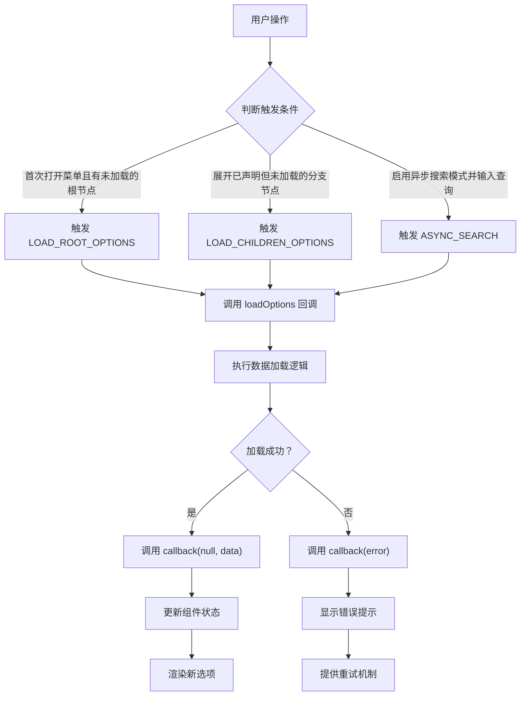

# @load-options 事件详细文档

<cite>
**本文档中引用的文件**
- [src/constants.js](file://src/constants.js)
- [src/mixins/treeselectMixin.js](file://src/mixins/treeselectMixin.js)
- [src/components/Treeselect.vue](file://src/components/Treeselect.vue)
- [test/unit/specs/DynamicalLoading.spec.js](file://test/unit/specs/DynamicalLoading.spec.js)
- [test/unit/specs/Searching.spec.js](file://test/unit/specs/Searching.spec.js)
</cite>

## 目录
1. [概述](#概述)
2. [事件触发机制](#事件触发机制)
3. [参数对象详解](#参数对象详解)
4. [动作类型详解](#动作类型详解)
5. [实现延迟加载](#实现延迟加载)
6. [动态数据加载](#动态数据加载)
7. [回调函数使用](#回调函数使用)
8. [instanceId 调试价值](#instanceid-调试价值)
9. [完整代码示例](#完整代码示例)
10. [最佳实践](#最佳实践)

## 概述

`@load-options` 事件是 Vue Treeselect 组件的核心功能之一，专门用于处理异步加载选项数据的场景。当组件需要动态加载根节点选项、子节点选项或执行异步搜索时，会触发此事件。

该事件提供了灵活的参数对象，包含 `action`、`parentNode`、`callback` 和 `instanceId` 等关键属性，开发者可以通过这些参数精确控制数据加载流程。

## 事件触发机制



**图表来源**
- [src/mixins/treeselectMixin.js](file://src/mixins/treeselectMixin.js#L1672-L1730)
- [src/mixins/treeselectMixin.js](file://src/mixins/treeselectMixin.js#L1283-L1319)

**章节来源**
- [src/mixins/treeselectMixin.js](file://src/mixins/treeselectMixin.js#L1672-L1730)
- [src/mixins/treeselectMixin.js](file://src/mixins/treeselectMixin.js#L1283-L1319)

## 参数对象详解

`@load-options` 事件传递一个包含以下属性的对象：

| 属性名 | 类型 | 描述 |
|--------|------|------|
| `id` | Number/String | 组件实例的唯一标识符（自动生成） |
| `instanceId` | Number/String | 组件实例的唯一标识符（与 id 相同，用于调试） |
| `action` | String | 触发加载的动作类型（LOAD_ROOT_OPTIONS、LOAD_CHILDREN_OPTIONS、ASYNC_SEARCH） |
| `parentNode` | Object | 当前正在加载子节点的父节点对象（仅在 LOAD_CHILDREN_OPTIONS 时存在） |
| `searchQuery` | String | 异步搜索时的查询字符串（仅在 ASYNC_SEARCH 时存在） |
| `callback` | Function | 必须调用的回调函数，用于通知加载结果 |

**章节来源**
- [src/mixins/treeselectMixin.js](file://src/mixins/treeselectMixin.js#L1732-L1791)

## 动作类型详解

### LOAD_ROOT_OPTIONS（根节点加载）

当组件首次初始化或需要加载顶级选项时触发。

```javascript
// 触发时机：
// 1. 组件挂载时（autoLoadRootOptions=true）
// 2. 手动打开菜单时（autoLoadRootOptions=false）
// 3. 重新加载根节点时

// 使用场景：
// - 加载树形结构的顶层节点
// - 初始化时获取基础数据
// - 刷新整个选项列表

// 示例：
loadOptions({ action: 'LOAD_ROOT_OPTIONS', callback }) {
  // 模拟异步请求
  setTimeout(() => {
    const rootOptions = [
      { id: '1', label: '根节点1', children: null },
      { id: '2', label: '根节点2', children: null }
    ];
    callback(null, rootOptions);
  }, 1000);
}
```

### LOAD_CHILDREN_OPTIONS（子节点加载）

当用户展开一个已声明但未加载的分支节点时触发。

```javascript
// 触发时机：
// 1. 用户点击展开按钮
// 2. 自动展开到指定层级时
// 3. 搜索匹配到分支节点时

// 使用场景：
// - 实现懒加载的树形结构
// - 分层数据的按需加载
// - 大数据集的性能优化

// 示例：
loadOptions({ action: 'LOAD_CHILDREN_OPTIONS', parentNode, callback }) {
  // 根据父节点ID加载子节点
  fetch(`/api/children/${parentNode.id}`)
    .then(response => response.json())
    .then(data => {
      // 更新父节点的children属性
      parentNode.children = data;
      callback(null, data);
    })
    .catch(error => {
      callback(error);
    });
}
```

### ASYNC_SEARCH（异步搜索）

当启用异步搜索模式并输入查询关键字时触发。

```javascript
// 触发时机：
// 1. 启用 async: true 时
// 2. 用户输入搜索关键词时
// 3. 清空搜索框时

// 使用场景：
// - 实时搜索建议
// - 远程搜索服务
// - 大规模数据的高效检索

// 示例：
loadOptions({ action: 'ASYNC_SEARCH', searchQuery, callback }) {
  // 防抖处理
  if (this.searchTimeout) {
    clearTimeout(this.searchTimeout);
  }
  
  this.searchTimeout = setTimeout(() => {
    fetch(`/api/search?q=${encodeURIComponent(searchQuery)}`)
      .then(response => response.json())
      .then(results => {
        callback(null, results);
      })
      .catch(error => {
        callback(error);
      });
  }, 300); // 300ms防抖
}
```

**章节来源**
- [src/mixins/treeselectMixin.js](file://src/mixins/treeselectMixin.js#L1672-L1730)
- [src/mixins/treeselectMixin.js](file://src/mixins/treeselectMixin.js#L1283-L1319)

## 实现延迟加载

延迟加载是 Treeselect 的核心特性，可以显著提升大型数据集的性能。

### 基础延迟加载实现

```javascript
// 组件配置
<template>
  <treeselect
    v-model="value"
    :options="options"
    :load-options="loadOptions"
    :async="true"
    :cache-options="true"
    placeholder="请选择..."
  />
</template>

<script>
export default {
  data() {
    return {
      value: null,
      options: [], // 初始为空数组
    };
  },
  
  methods: {
    loadOptions({ action, parentNode, searchQuery, callback }) {
      switch (action) {
        case 'LOAD_ROOT_OPTIONS':
          this.loadRootOptions(callback);
          break;
          
        case 'LOAD_CHILDREN_OPTIONS':
          this.loadChildrenOptions(parentNode, callback);
          break;
          
        case 'ASYNC_SEARCH':
          this.asyncSearch(searchQuery, callback);
          break;
      }
    },
    
    loadRootOptions(callback) {
      // 模拟API调用
      fetch('/api/root-options')
        .then(response => response.json())
        .then(data => {
          // 设置children为null表示未加载
          const formattedOptions = data.map(item => ({
            ...item,
            children: null // 声明为未加载的分支节点
          }));
          callback(null, formattedOptions);
        })
        .catch(error => callback(error));
    },
    
    loadChildrenOptions(parentNode, callback) {
      // 加载子节点时，确保父节点有正确的children属性
      fetch(`/api/children/${parentNode.id}`)
        .then(response => response.json())
        .then(data => {
          // 更新父节点的children属性
          parentNode.children = data.map(item => ({
            ...item,
            children: item.hasChildren ? null : undefined
          }));
          callback(null, parentNode.children);
        })
        .catch(error => callback(error));
    },
    
    asyncSearch(query, callback) {
      fetch(`/api/search?q=${encodeURIComponent(query)}`)
        .then(response => response.json())
        .then(data => {
          callback(null, data);
        })
        .catch(error => callback(error));
    }
  }
};
</script>
```

### 高级延迟加载策略

```javascript
// 支持分页加载和缓存优化
loadOptions({ action, parentNode, searchQuery, callback }) {
  const cacheKey = `${action}:${parentNode?.id || searchQuery}`;
  
  // 检查缓存
  if (this.optionsCache[cacheKey]) {
    callback(null, this.optionsCache[cacheKey]);
    return;
  }
  
  // 防止重复请求
  if (this.pendingRequests[cacheKey]) {
    this.pendingRequests[cacheKey].push(callback);
    return;
  }
  
  this.pendingRequests[cacheKey] = [];
  
  // 发起请求
  this.fetchOptions(action, parentNode, searchQuery)
    .then(data => {
      // 缓存结果
      this.optionsCache[cacheKey] = data;
      
      // 通知所有等待的回调
      this.pendingRequests[cacheKey].forEach(cb => cb(null, data));
      callback(null, data);
      
      // 清理请求队列
      delete this.pendingRequests[cacheKey];
    })
    .catch(error => {
      // 通知所有等待的回调
      this.pendingRequests[cacheKey].forEach(cb => cb(error));
      callback(error);
      
      // 清理请求队列
      delete this.pendingRequests[cacheKey];
    });
}
```

**章节来源**
- [test/unit/specs/DynamicalLoading.spec.js](file://test/unit/specs/DynamicalLoading.spec.js#L72-L236)

## 动态数据加载

### 实时数据同步

```javascript
// 实现实时数据更新
loadOptions({ action, parentNode, callback }) {
  switch (action) {
    case 'LOAD_ROOT_OPTIONS':
      this.subscribeToUpdates();
      this.loadInitialData(callback);
      break;
      
    case 'LOAD_CHILDREN_OPTIONS':
      this.loadDynamicChildren(parentNode, callback);
      break;
  }
}

subscribeToUpdates() {
  // 订阅WebSocket或其他实时更新源
  this.socket = new WebSocket('ws://localhost:8080');
  
  this.socket.onmessage = (event) => {
    const update = JSON.parse(event.data);
    
    // 根据更新类型处理数据
    if (update.type === 'nodeUpdated') {
      this.updateNode(update.nodeId, update.data);
    } else if (update.type === 'nodeDeleted') {
      this.removeNode(update.nodeId);
    }
  };
}

loadDynamicChildren(parentNode, callback) {
  // 获取当前时间戳作为版本号
  const version = Date.now();
  
  fetch(`/api/children/${parentNode.id}?version=${version}`)
    .then(response => response.json())
    .then(data => {
      // 检查是否有更新
      if (data.version > parentNode.lastVersion) {
        parentNode.children = data.nodes;
        parentNode.lastVersion = data.version;
      }
      callback(null, parentNode.children);
    })
    .catch(error => callback(error));
}
```

### 条件化加载

```javascript
// 基于用户权限的条件化加载
loadOptions({ action, parentNode, callback }) {
  // 检查用户权限
  if (!this.hasPermission(action, parentNode)) {
    callback(new Error('权限不足'));
    return;
  }
  
  // 根据权限级别加载不同数据
  const permissionLevel = this.getUserPermissionLevel();
  
  fetch(`/api/options?level=${permissionLevel}&action=${action}`)
    .then(response => response.json())
    .then(data => {
      // 应用权限过滤
      const filteredData = this.applyPermissionFilter(data);
      callback(null, filteredData);
    })
    .catch(error => callback(error));
}

hasPermission(action, node) {
  const permissions = {
    LOAD_ROOT_OPTIONS: 'view_root_nodes',
    LOAD_CHILDREN_OPTIONS: 'view_child_nodes',
    ASYNC_SEARCH: 'search_nodes'
  };
  
  return this.userPermissions.includes(permissions[action]);
}
```

**章节来源**
- [test/unit/specs/DynamicalLoading.spec.js](file://test/unit/specs/DynamicalLoading.spec.js#L471-L521)

## 回调函数使用

### 基础回调模式

回调函数是 `@load-options` 事件的核心，必须正确调用以通知组件加载结果。

```javascript
// 正确的回调使用方式
loadOptions({ action, callback }) {
  // 成功情况
  callback(null, [
    { id: '1', label: '选项1' },
    { id: '2', label: '选项2' }
  ]);
  
  // 错误情况
  callback(new Error('加载失败'));
}
```

### Promise 支持

组件自动支持 Promise 返回值，简化异步代码。

```javascript
// Promise 版本的实现
loadOptions({ action, callback }) {
  return this.fetchOptions(action)
    .then(data => {
      callback(null, data);
      return data;
    })
    .catch(error => {
      callback(error);
      throw error;
    });
}

// 或者直接返回Promise
loadOptions({ action, callback }) {
  return fetch(`/api/${action}`)
    .then(response => response.json())
    .then(data => {
      callback(null, data);
      return data;
    });
}
```

### 回调安全处理

```javascript
// 安全的回调处理
loadOptions({ action, parentNode, callback }) {
  let callbackCalled = false;
  
  const safeCallback = (error, data) => {
    if (callbackCalled) {
      console.warn('回调已被调用，重复调用被忽略');
      return;
    }
    callbackCalled = true;
    callback(error, data);
  };
  
  try {
    // 执行异步操作
    this.performAsyncOperation(action, parentNode)
      .then(result => safeCallback(null, result))
      .catch(error => safeCallback(error));
  } catch (error) {
    safeCallback(error);
  }
}
```

**章节来源**
- [src/mixins/treeselectMixin.js](file://src/mixins/treeselectMixin.js#L1732-L1791)

## instanceId 调试价值

`instanceId` 是每个 Treeselect 实例的唯一标识符，在复杂应用中具有重要价值。

### 调试和监控

```javascript
// 调试日志记录
loadOptions({ action, instanceId, callback }) {
  console.log(`[${instanceId}] 开始加载 ${action} 数据`);
  
  const startTime = performance.now();
  
  this.fetchData(action)
    .then(data => {
      const duration = performance.now() - startTime;
      console.log(`[${instanceId}] ${action} 加载完成，耗时 ${duration.toFixed(2)}ms`);
      callback(null, data);
    })
    .catch(error => {
      console.error(`[${instanceId}] ${action} 加载失败:`, error);
      callback(error);
    });
}
```

### 多实例管理

```javascript
// 在多实例环境中识别特定实例
loadOptions({ action, instanceId, callback }) {
  // 根据实例ID应用不同的加载策略
  switch (instanceId) {
    case 'user-tree':
      this.loadUserTree(action, callback);
      break;
      
    case 'department-tree':
      this.loadDepartmentTree(action, callback);
      break;
      
    default:
      this.loadGenericTree(action, callback);
  }
}

// 实例级别的缓存
loadOptions({ action, instanceId, callback }) {
  const cacheKey = `${instanceId}:${action}`;
  
  if (this.instanceCaches[cacheKey]) {
    callback(null, this.instanceCaches[cacheKey]);
    return;
  }
  
  this.fetchInstanceData(instanceId, action)
    .then(data => {
      this.instanceCaches[cacheKey] = data;
      callback(null, data);
    })
    .catch(error => callback(error));
}
```

### 性能监控

```javascript
// 性能监控实现
loadOptions({ action, instanceId, callback }) {
  const metrics = {
    instanceId,
    action,
    startTime: Date.now(),
    retries: 0
  };
  
  const attemptLoad = (attempt = 1) => {
    this.apiCall(action)
      .then(data => {
        metrics.duration = Date.now() - metrics.startTime;
        metrics.success = true;
        
        // 发送性能指标
        this.sendMetrics('load_options', metrics);
        
        callback(null, data);
      })
      .catch(error => {
        metrics.duration = Date.now() - metrics.startTime;
        metrics.error = error.message;
        metrics.retries = attempt;
        
        // 发送错误指标
        this.sendMetrics('load_options_error', metrics);
        
        if (attempt < 3) {
          // 指数退避重试
          const delay = Math.pow(2, attempt) * 1000;
          setTimeout(() => attemptLoad(attempt + 1), delay);
        } else {
          callback(error);
        }
      });
  };
  
  attemptLoad();
}
```

**章节来源**
- [src/mixins/treeselectMixin.js](file://src/mixins/treeselectMixin.js#L1732-L1791)

## 完整代码示例

### 基础异步树形选择器

```javascript
<template>
  <div class="tree-selector">
    <h3>部门组织结构选择器</h3>
    
    <treeselect
      v-model="selectedDepartments"
      :options="departments"
      :load-options="loadOptions"
      :async="true"
      :cache-options="true"
      :default-expand-level="1"
      :placeholder="'请选择部门'"
      multiple
      searchable
    />
    
    <div class="selected-info">
      <h4>已选部门:</h4>
      <ul>
        <li v-for="dept in selectedDepartments" :key="dept">
          {{ getDepartmentName(dept) }}
        </li>
      </ul>
    </div>
  </div>
</template>

<script>
export default {
  name: 'DepartmentSelector',
  
  data() {
    return {
      departments: [],
      selectedDepartments: [],
      optionsCache: {},
      loadingStates: {},
      apiBaseUrl: '/api/organization'
    };
  },
  
  computed: {
    departmentNames() {
      return this.selectedDepartments.map(id => this.getDepartmentName(id));
    }
  },
  
  methods: {
    // 主要的loadOptions方法
    loadOptions({ action, parentNode, searchQuery, callback }) {
      const cacheKey = this.generateCacheKey(action, parentNode, searchQuery);
      
      // 检查缓存
      if (this.optionsCache[cacheKey]) {
        callback(null, this.optionsCache[cacheKey]);
        return;
      }
      
      // 设置加载状态
      this.$set(this.loadingStates, cacheKey, true);
      
      // 执行相应的加载操作
      this.executeLoadAction(action, parentNode, searchQuery)
        .then(data => {
          // 更新缓存
          this.optionsCache[cacheKey] = data;
          
          // 如果是子节点加载，更新父节点的children
          if (action === 'LOAD_CHILDREN_OPTIONS' && parentNode) {
            parentNode.children = data.map(item => ({
              ...item,
              children: item.hasChildren ? null : undefined
            }));
          }
          
          callback(null, data);
          this.$delete(this.loadingStates, cacheKey);
        })
        .catch(error => {
          console.error(`加载${action}失败:`, error);
          callback(error);
          this.$delete(this.loadingStates, cacheKey);
        });
    },
    
    // 根据动作类型执行不同的加载逻辑
    executeLoadAction(action, parentNode, searchQuery) {
      switch (action) {
        case 'LOAD_ROOT_OPTIONS':
          return this.loadRootDepartments();
          
        case 'LOAD_CHILDREN_OPTIONS':
          return this.loadDepartmentChildren(parentNode);
          
        case 'ASYNC_SEARCH':
          return this.searchDepartments(searchQuery);
          
        default:
          return Promise.reject(new Error('未知的加载动作'));
      }
    },
    
    // 加载根部门
    loadRootDepartments() {
      return this.apiRequest('/departments/root');
    },
    
    // 加载部门子节点
    loadDepartmentChildren(parentNode) {
      return this.apiRequest(`/departments/${parentNode.id}/children`);
    },
    
    // 异步搜索部门
    asyncSearch(searchQuery) {
      return this.apiRequest('/departments/search', {
        params: { q: searchQuery }
      });
    },
    
    // API请求封装
    apiRequest(endpoint, options = {}) {
      const url = `${this.apiBaseUrl}${endpoint}`;
      const config = {
        method: 'GET',
        headers: {
          'Content-Type': 'application/json',
          'Authorization': `Bearer ${this.getToken()}`
        },
        ...options
      };
      
      return fetch(url, config)
        .then(response => {
          if (!response.ok) {
            throw new Error(`HTTP ${response.status}: ${response.statusText}`);
          }
          return response.json();
        })
        .then(data => {
          // 数据预处理
          return this.processDepartmentData(data);
        });
    },
    
    // 数据处理
    processDepartmentData(data) {
      return data.map(item => ({
        id: item.id,
        label: item.name,
        description: item.description,
        hasChildren: item.hasChildren,
        level: item.level,
        parentId: item.parentId,
        // 添加其他需要的字段
      }));
    },
    
    // 生成缓存键
    generateCacheKey(action, parentNode, searchQuery) {
      switch (action) {
        case 'LOAD_ROOT_OPTIONS':
          return 'root-departments';
        case 'LOAD_CHILDREN_OPTIONS':
          return `children-${parentNode.id}`;
        case 'ASYNC_SEARCH':
          return `search-${searchQuery}`;
        default:
          return `unknown-${action}`;
      }
    },
    
    // 获取部门名称
    getDepartmentName(departmentId) {
      const dept = this.findDepartmentById(departmentId);
      return dept ? dept.label : `未知部门(${departmentId})`;
    },
    
    // 查找部门对象
    findDepartmentById(id) {
      // 简化的查找逻辑，实际应用中可能需要更复杂的遍历
      return this.departments.find(dept => dept.id === id);
    },
    
    // 获取访问令牌
    getToken() {
      return localStorage.getItem('authToken') || '';
    }
  }
};
</script>

<style scoped>
.tree-selector {
  max-width: 600px;
  margin: 0 auto;
  padding: 20px;
  font-family: Arial, sans-serif;
}

.selected-info {
  margin-top: 20px;
  border-top: 1px solid #eee;
  padding-top: 15px;
}

ul {
  list-style-type: none;
  padding-left: 0;
}

li {
  margin-bottom: 5px;
  padding: 5px 10px;
  background-color: #f5f5f5;
  border-radius: 4px;
}
</style>
```

### 高级功能示例

```javascript
<template>
  <div class="advanced-tree-selector">
    <!-- 复杂的树形选择器界面 -->
    <div class="selector-header">
      <h3>{{ title }}</h3>
      <div class="actions">
        <button @click="refreshData" :disabled="isLoading">
          <span v-if="isLoading">刷新中...</span>
          <span v-else>刷新数据</span>
        </button>
        <button @click="clearSelection">清空选择</button>
      </div>
    </div>
    
    <treeselect
      v-model="selectedItems"
      :options="treeOptions"
      :load-options="loadOptions"
      :async="true"
      :cache-options="true"
      :default-expand-level="2"
      :placeholder="placeholder"
      :multiple="multiple"
      :searchable="searchable"
      :disabled="disabled"
      :value-format="valueFormat"
      @select="onSelect"
      @deselect="onDeselect"
      @search-change="onSearchChange"
    />
    
    <!-- 加载状态指示器 -->
    <div v-if="isLoading" class="loading-overlay">
      <div class="spinner"></div>
      <span>加载中...</span>
    </div>
    
    <!-- 错误信息显示 -->
    <div v-if="errorMessage" class="error-message">
      <span class="error-icon">⚠️</span>
      <span>{{ errorMessage }}</span>
      <button @click="retryLoad" v-if="canRetry">重试</button>
    </div>
    
    <!-- 选择统计 -->
    <div class="selection-stats" v-if="selectedItems.length > 0">
      <span>已选择: {{ selectedItems.length }} 项</span>
      <button @click="expandAll" v-if="!allExpanded">展开全部</button>
      <button @click="collapseAll" v-if="allExpanded">折叠全部</button>
    </div>
  </div>
</template>

<script>
export default {
  name: 'AdvancedTreeSelector',
  
  props: {
    title: {
      type: String,
      default: '高级树形选择器'
    },
    multiple: {
      type: Boolean,
      default: true
    },
    searchable: {
      type: Boolean,
      default: true
    },
    disabled: {
      type: Boolean,
      default: false
    },
    valueFormat: {
      type: String,
      default: 'id'
    },
    placeholder: {
      type: String,
      default: '请选择...'
    }
  },
  
  data() {
    return {
      treeOptions: [],
      selectedItems: [],
      isLoading: false,
      errorMessage: '',
      canRetry: false,
      retryCount: 0,
      maxRetries: 3,
      allExpanded: false,
      instanceId: Date.now(),
      loadMetrics: new Map(),
      performanceThreshold: 2000 // 2秒阈值
    };
  },
  
  computed: {
    // 选择的项目名称列表
    selectedNames() {
      return this.selectedItems.map(item => 
        typeof item === 'object' ? item.label : item
      );
    }
  },
  
  methods: {
    // 主要的loadOptions方法
    loadOptions({ action, parentNode, searchQuery, callback }) {
      const startTime = performance.now();
      const metricKey = `${action}-${parentNode?.id || searchQuery}`;
      
      // 记录性能指标
      this.loadMetrics.set(metricKey, {
        startTime,
        action,
        parentNodeId: parentNode?.id,
        searchQuery,
        retryCount: 0
      });
      
      // 显示加载状态
      this.isLoading = true;
      this.errorMessage = '';
      
      // 执行加载
      this.executeLoadWithRetry(action, parentNode, searchQuery)
        .then(data => {
          const duration = performance.now() - startTime;
          
          // 更新性能指标
          const metrics = this.loadMetrics.get(metricKey);
          metrics.duration = duration;
          metrics.success = true;
          
          // 检查性能是否超出阈值
          if (duration > this.performanceThreshold) {
            console.warn(`慢速加载: ${action} 耗时 ${duration.toFixed(2)}ms`);
          }
          
          // 更新缓存
          this.updateCache(action, parentNode, searchQuery, data);
          
          callback(null, data);
          this.isLoading = false;
        })
        .catch(error => {
          const duration = performance.now() - startTime;
          
          // 更新性能指标
          const metrics = this.loadMetrics.get(metricKey);
          if (metrics) {
            metrics.duration = duration;
            metrics.error = error.message;
          }
          
          this.handleError(error, action, parentNode, searchQuery);
          callback(error);
          this.isLoading = false;
        });
    },
    
    // 带重试机制的加载
    executeLoadWithRetry(action, parentNode, searchQuery) {
      const attemptLoad = (attempt = 1) => {
        return this.executeLoadAction(action, parentNode, searchQuery)
          .then(data => {
            // 更新重试计数
            const metricKey = `${action}-${parentNode?.id || searchQuery}`;
            const metrics = this.loadMetrics.get(metricKey);
            if (metrics) {
              metrics.retryCount = attempt - 1;
            }
            
            return data;
          })
          .catch(error => {
            if (attempt >= this.maxRetries) {
              throw error;
            }
            
            // 指数退避重试
            const delay = Math.pow(2, attempt) * 1000; // 1s, 2s, 4s...
            
            return new Promise((resolve, reject) => {
              setTimeout(() => {
                attemptLoad(attempt + 1)
                  .then(resolve)
                  .catch(reject);
              }, delay);
            });
          });
      };
      
      return attemptLoad();
    },
    
    // 执行具体的加载操作
    executeLoadAction(action, parentNode, searchQuery) {
      switch (action) {
        case 'LOAD_ROOT_OPTIONS':
          return this.loadRootOptions();
          
        case 'LOAD_CHILDREN_OPTIONS':
          return this.loadChildrenOptions(parentNode);
          
        case 'ASYNC_SEARCH':
          return this.asyncSearch(searchQuery);
          
        default:
          return Promise.reject(new Error('未知的加载动作'));
      }
    },
    
    // 加载根选项
    loadRootOptions() {
      return this.apiRequest('/tree/root', {
        cacheable: true,
        timeout: 5000
      });
    },
    
    // 加载子选项
    loadChildrenOptions(parentNode) {
      return this.apiRequest(`/tree/${parentNode.id}/children`, {
        cacheable: true,
        timeout: 3000
      });
    },
    
    // 异步搜索
    asyncSearch(query) {
      return this.apiRequest('/tree/search', {
        params: { q: query },
        cacheable: false,
        timeout: 2000
      });
    },
    
    // API请求
    apiRequest(endpoint, options = {}) {
      const controller = new AbortController();
      const signal = controller.signal;
      
      // 设置超时
      const timeoutId = setTimeout(() => {
        controller.abort();
      }, options.timeout || 10000);
      
      return fetch(`${this.apiBaseUrl}${endpoint}`, {
        method: 'GET',
        headers: {
          'Content-Type': 'application/json',
          'Authorization': `Bearer ${this.getToken()}`
        },
        signal
      })
        .then(response => {
          clearTimeout(timeoutId);
          
          if (!response.ok) {
            throw new Error(`HTTP ${response.status}: ${response.statusText}`);
          }
          
          return response.json();
        })
        .then(data => {
          // 数据验证
          if (!Array.isArray(data)) {
            throw new Error('API返回的数据格式不正确');
          }
          
          return this.processData(data);
        })
        .catch(error => {
          clearTimeout(timeoutId);
          
          // 检查是否是超时错误
          if (error.name === 'AbortError') {
            throw new Error('请求超时，请检查网络连接');
          }
          
          throw error;
        });
    },
    
    // 数据处理
    processData(data) {
      return data.map(item => ({
        id: item.id,
        label: item.name,
        description: item.description,
        icon: item.icon,
        hasChildren: item.hasChildren,
        level: item.level,
        parentId: item.parentId,
        disabled: item.disabled,
        customData: item.customData
      }));
    },
    
    // 更新缓存
    updateCache(action, parentNode, searchQuery, data) {
      const cacheKey = this.generateCacheKey(action, parentNode, searchQuery);
      
      // 清理过期缓存
      this.cleanupCache();
      
      // 更新缓存
      this.$set(this.cache, cacheKey, {
        data,
        timestamp: Date.now(),
        expires: Date.now() + (action === 'ASYNC_SEARCH' ? 30000 : 300000) // 30秒搜索缓存，5分钟其他缓存
      });
    },
    
    // 缓存清理
    cleanupCache() {
      const now = Date.now();
      const cacheKeys = Object.keys(this.cache);
      
      cacheKeys.forEach(key => {
        const item = this.cache[key];
        if (now - item.timestamp > item.expires) {
          this.$delete(this.cache, key);
        }
      });
    },
    
    // 错误处理
    handleError(error, action, parentNode, searchQuery) {
      this.errorMessage = error.message;
      this.canRetry = true;
      
      // 记录错误统计
      this.$emit('error', {
        error,
        action,
        parentNodeId: parentNode?.id,
        searchQuery,
        timestamp: new Date()
      });
    },
    
    // 重试加载
    retryLoad() {
      if (!this.canRetry) return;
      
      this.retryCount++;
      this.errorMessage = '';
      this.canRetry = false;
      
      // 重新加载当前上下文
      if (this.currentLoadContext) {
        this.loadOptions(this.currentLoadContext);
      }
    },
    
    // 刷新数据
    refreshData() {
      this.treeOptions = [];
      this.selectedItems = [];
      this.cache = {};
      
      // 重新加载根节点
      this.loadOptions({
        action: 'LOAD_ROOT_OPTIONS',
        callback: (error, data) => {
          if (error) {
            this.handleError(error, 'LOAD_ROOT_OPTIONS');
          }
        }
      });
    },
    
    // 清空选择
    clearSelection() {
      this.selectedItems = [];
      this.$emit('clear');
    },
    
    // 展开全部
    expandAll() {
      this.allExpanded = true;
      this.$emit('expand-all');
    },
    
    // 折叠全部
    collapseAll() {
      this.allExpanded = false;
      this.$emit('collapse-all');
    },
    
    // 事件处理
    onSelect(item) {
      this.$emit('select', item);
    },
    
    // 取消选择
    onDeselect(item) {
      this.$emit('deselect', item);
    },
    
    // 搜索变化
    onSearchChange(query) {
      this.$emit('search-change', query);
    },
    
    // 生成缓存键
    generateCacheKey(action, parentNode, searchQuery) {
      switch (action) {
        case 'LOAD_ROOT_OPTIONS':
          return 'root-options';
        case 'LOAD_CHILDREN_OPTIONS':
          return `children-${parentNode.id}`;
        case 'ASYNC_SEARCH':
          return `search-${searchQuery}`;
        default:
          return `unknown-${action}`;
      }
    },
    
    // 获取访问令牌
    getToken() {
      return localStorage.getItem('authToken') || '';
    }
  },
  
  // 监听器
  watch: {
    // 监听选择变化
    selectedItems(newVal, oldVal) {
      if (JSON.stringify(newVal) !== JSON.stringify(oldVal)) {
        this.$emit('change', newVal);
      }
    }
  },
  
  // 生命周期钩子
  mounted() {
    // 初始化加载
    this.loadOptions({
      action: 'LOAD_ROOT_OPTIONS',
      callback: (error, data) => {
        if (error) {
          this.handleError(error, 'LOAD_ROOT_OPTIONS');
        }
      }
    });
    
    // 注册全局事件监听
    window.addEventListener('online', this.handleNetworkChange);
    window.addEventListener('offline', this.handleNetworkChange);
  },
  
  beforeDestroy() {
    // 清理资源
    window.removeEventListener('online', this.handleNetworkChange);
    window.removeEventListener('offline', this.handleNetworkChange);
  },
  
  // 方法
  methods: {
    handleNetworkChange(event) {
      if (event.type === 'online') {
        // 网络恢复后尝试重新加载
        if (this.errorMessage) {
          this.retryLoad();
        }
      }
    }
  }
};
</script>

<style scoped>
.advanced-tree-selector {
  position: relative;
  width: 100%;
  max-width: 800px;
  margin: 0 auto;
  font-family: -apple-system, BlinkMacSystemFont, 'Segoe UI', Roboto, Oxygen-Sans, Ubuntu, Cantarell, 'Helvetica Neue', sans-serif;
}

.selector-header {
  display: flex;
  justify-content: space-between;
  align-items: center;
  margin-bottom: 15px;
  padding-bottom: 10px;
  border-bottom: 1px solid #eee;
}

.actions {
  display: flex;
  gap: 10px;
}

button {
  padding: 6px 12px;
  border: 1px solid #ccc;
  border-radius: 4px;
  background: white;
  cursor: pointer;
  transition: all 0.2s;
}

button:hover {
  background: #f5f5f5;
}

button:disabled {
  opacity: 0.5;
  cursor: not-allowed;
}

.loading-overlay {
  position: absolute;
  top: 0;
  left: 0;
  right: 0;
  bottom: 0;
  background: rgba(255, 255, 255, 0.8);
  display: flex;
  justify-content: center;
  align-items: center;
  z-index: 10;
}

.spinner {
  width: 24px;
  height: 24px;
  border: 2px solid #eee;
  border-top-color: #333;
  border-radius: 50%;
  animation: spin 1s linear infinite;
  margin-right: 10px;
}

@keyframes spin {
  to { transform: rotate(360deg); }
}

.error-message {
  color: #d9534f;
  background: #fdd;
  padding: 10px;
  border-radius: 4px;
  margin-top: 10px;
  display: flex;
  align-items: center;
  gap: 10px;
}

.selection-stats {
  margin-top: 10px;
  padding: 10px;
  background: #f8f8f8;
  border-radius: 4px;
  display: flex;
  justify-content: space-between;
  align-items: center;
}
</style>
```

**章节来源**
- [test/unit/specs/DynamicalLoading.spec.js](file://test/unit/specs/DynamicalLoading.spec.js#L72-L800)
- [test/unit/specs/Searching.spec.js](file://test/unit/specs/Searching.spec.js#L471-L998)

## 最佳实践

### 性能优化

1. **合理使用缓存**
   ```javascript
   // 启用缓存选项
   loadOptions({ action, callback }) {
     const cacheKey = `${action}-${Date.now()}`;
     
     // 检查缓存
     if (this.cache[cacheKey]) {
       callback(null, this.cache[cacheKey]);
       return;
     }
     
     // 执行加载
     this.loadData(action)
       .then(data => {
         this.cache[cacheKey] = data;
         callback(null, data);
       })
       .catch(callback);
   }
   ```

2. **防抖和节流**
   ```javascript
   // 异步搜索防抖
   loadOptions({ action, searchQuery, callback }) {
     if (action === 'ASYNC_SEARCH') {
       if (this.searchDebounceTimer) {
         clearTimeout(this.searchDebounceTimer);
       }
       
       this.searchDebounceTimer = setTimeout(() => {
         this.performSearch(searchQuery, callback);
       }, 300);
       return;
     }
     
     // 其他类型的加载
     this.performLoad(action, callback);
   }
   ```

3. **错误处理和重试**
   ```javascript
   loadOptions({ action, callback }) {
     const attemptLoad = (attempt = 1) => {
       this.apiCall(action)
         .then(data => callback(null, data))
         .catch(error => {
           if (attempt < 3) {
             setTimeout(() => attemptLoad(attempt + 1), 1000 * attempt);
           } else {
             callback(error);
           }
         });
     };
     
     attemptLoad();
   }
   ```

### 用户体验

1. **加载状态反馈**
   ```javascript
   loadOptions({ action, callback }) {
     this.loadingActions.add(action);
     
     this.apiCall(action)
       .then(data => {
         this.loadingActions.delete(action);
         callback(null, data);
       })
       .catch(error => {
         this.loadingActions.delete(action);
         callback(error);
       });
   }
   ```

2. **进度指示**
   ```javascript
   loadOptions({ action, callback }) {
     this.showProgressIndicator();
     
     this.apiCall(action)
       .then(data => {
         this.hideProgressIndicator();
         callback(null, data);
       })
       .catch(error => {
         this.hideProgressIndicator();
         callback(error);
       });
   }
   ```

### 安全考虑

1. **输入验证**
   ```javascript
   loadOptions({ action, parentNode, searchQuery, callback }) {
     // 验证输入参数
     if (action === 'LOAD_CHILDREN_OPTIONS' && !parentNode) {
       callback(new Error('缺少父节点参数'));
       return;
     }
     
     if (action === 'ASYNC_SEARCH' && typeof searchQuery !== 'string') {
       callback(new Error('搜索查询必须是字符串'));
       return;
     }
     
     // 执行加载
     this.performLoad(action, parentNode, searchQuery, callback);
   }
   ```

2. **权限检查**
   ```javascript
   loadOptions({ action, parentNode, callback }) {
     // 检查用户权限
     if (!this.hasPermission(action, parentNode)) {
       callback(new Error('权限不足'));
       return;
     }
     
     // 执行加载
     this.performLoad(action, parentNode, callback);
   }
   ```

通过遵循这些最佳实践，您可以构建出高性能、用户体验良好且安全可靠的 Treeselect 组件。