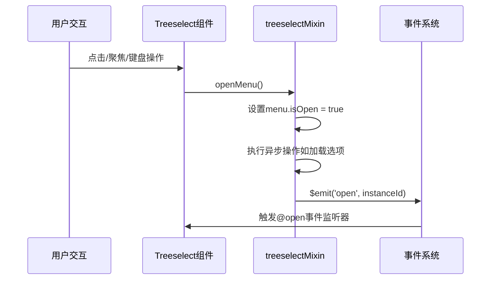

# @open 事件

<cite>
**本文档引用的文件**
- [src/mixins/treeselectMixin.js](file://src/mixins/treeselectMixin.js)
- [src/components/Treeselect.vue](file://src/components/Treeselect.vue)
- [src/components/Input.vue](file://src/components/Input.vue)
- [src/examples/LargeDataExample.vue](file://src/examples/LargeDataExample.vue)
- [test/unit/specs/Events.spec.js](file://test/unit/specs/Events.spec.js)
- [performance-test.html](file://performance-test.html)
</cite>

## 目录
1. [概述](#概述)
2. [事件触发机制](#事件触发机制)
3. [参数详解](#参数详解)
4. [触发时机](#触发时机)
5. [使用场景](#使用场景)
6. [与@close事件配合使用](#与close事件配合使用)
7. [多组件环境中的应用](#多组件环境中的应用)
8. [最佳实践](#最佳实践)
9. [性能考虑](#性能考虑)
10. [故障排除](#故障排除)

## 概述

@open事件是Vue Treeselect组件的一个重要生命周期事件，当下拉菜单即将打开时触发。该事件携带组件实例ID作为参数，允许开发者在菜单打开时执行各种操作，如数据预加载、日志记录和UI同步。

### 核心特性

- **触发时机准确**：在菜单状态变为打开之前触发
- **携带实例标识**：提供唯一的instanceId参数用于组件识别
- **异步安全**：支持在事件处理中执行异步操作
- **生命周期集成**：与组件的完整生命周期紧密配合

## 事件触发机制

### 触发流程



**图表来源**
- [src/mixins/treeselectMixin.js](file://src/mixins/treeselectMixin.js#L1471-L1478)

### 关键代码分析

事件触发的核心逻辑位于`openMenu`方法中：

```javascript
// 在treeselectMixin.js中
openMenu() {
  if (this.disabled || this.menu.isOpen) return
  this.menu.isOpen = true
  this.$nextTick(this.resetHighlightedOptionWhenNecessary)
  this.$nextTick(this.restoreMenuScrollPosition)
  if (!this.options && !this.async) this.loadRootOptions()
  this.toggleClickOutsideEvent(true)
  this.$emit('open', this.getInstanceId())
},
```

**节来源**
- [src/mixins/treeselectMixin.js](file://src/mixins/treeselectMixin.js#L1471-L1478)

## 参数详解

### instanceId参数

@open事件携带的唯一参数是`instanceId`，它具有以下特点：

| 特性 | 描述 |
|------|------|
| 类型 | String或Number |
| 唯一性 | 每个组件实例都有独立的instanceId |
| 自动生成 | 如果未指定，系统会自动生成递增ID |
| 可访问性 | 通过`getInstanceId()`方法获取 |

### 获取instanceId的方法

```javascript
// 在组件内部获取
const instanceId = this.getInstanceId()

// 或者从事件参数中获取
onOpen(instanceId) {
  console.log('组件实例ID:', instanceId)
}
```

**节来源**
- [src/mixins/treeselectMixin.js](file://src/mixins/treeselectMixin.js#L967-L968)

## 触发时机

### 精确的触发点

@open事件在以下情况下触发：

1. **用户交互触发**：
   - 点击控制元素
   - 聚焦输入框
   - 按下特定键盘快捷键

2. **程序化触发**：
   - 调用`openMenu()`方法
   - 设置`alwaysOpen`属性为true

3. **条件触发**：
   - 组件未禁用且菜单未打开
   - 异步加载根选项（如果需要）

### 触发顺序

```mermaid
flowchart TD
A[用户操作] --> B{组件状态检查}
B --> |未禁用且未打开| C[设置menu.isOpen = true]
B --> |已禁用或已打开| D[不触发]
C --> E[执行异步操作]
E --> F[设置点击外部事件]
F --> G[触发@open事件]
G --> H[事件处理完成]
```

**图表来源**
- [src/mixins/treeselectMixin.js](file://src/mixins/treeselectMixin.js#L1471-L1478)

**节来源**
- [src/mixins/treeselectMixin.js](file://src/mixins/treeselectMixin.js#L1471-L1478)

## 使用场景

### 数据预加载

在菜单打开时预加载相关数据，提升用户体验：

```javascript
// 示例：预加载子选项
methods: {
  onOpen(instanceId) {
    // 查找对应的组件实例
    const component = this.getComponentById(instanceId)
    
    // 检查是否需要预加载
    if (component && component.needsPreload) {
      this.preloadRelatedData(instanceId)
    }
  },
  
  preloadRelatedData(instanceId) {
    // 异步加载数据
    this.$store.dispatch('loadRelatedOptions', { instanceId })
  }
}
```

### 日志记录

记录菜单打开的详细信息：

```javascript
methods: {
  onOpen(instanceId) {
    // 记录打开时间
    const openTime = Date.now()
    
    // 发送分析数据
    this.$analytics.track('menu_opened', {
      instanceId,
      timestamp: openTime,
      userId: this.currentUser.id,
      viewport: this.getCurrentViewport()
    })
  }
}
```

### UI同步

确保界面状态与组件状态同步：

```javascript
methods: {
  onOpen(instanceId) {
    // 更新全局状态
    this.$store.commit('SET_MENU_OPEN_STATE', {
      instanceId,
      isOpen: true,
      timestamp: Date.now()
    })
    
    // 触发UI更新
    this.$nextTick(() => {
      this.syncUIWithComponentState(instanceId)
    })
  }
}
```

**节来源**
- [src/examples/LargeDataExample.vue](file://src/examples/LargeDataExample.vue#L117-L119)

## 与@close事件配合使用

### 完整的生命周期监控

结合@open和@close事件可以实现完整的组件生命周期监控：

```javascript
export default {
  data() {
    return {
      openInstances: new Map()
    }
  },
  
  methods: {
    onOpen(instanceId) {
      // 记录打开时间
      this.openInstances.set(instanceId, {
        openTime: Date.now(),
        isOpen: true
      })
      
      // 性能监控
      this.startPerformanceTracking(instanceId)
    },
    
    onClose(instanceId) {
      // 获取打开状态
      const openInfo = this.openInstances.get(instanceId)
      
      if (openInfo) {
        // 计算打开时长
        const duration = Date.now() - openInfo.openTime
        
        // 发送性能数据
        this.$analytics.track('menu_closed', {
          instanceId,
          duration,
          isOpen: false
        })
        
        // 清理状态
        this.openInstances.delete(instanceId)
      }
    },
    
    startPerformanceTracking(instanceId) {
      // 开始性能计时
      this.$store.dispatch('startPerformanceTracking', instanceId)
    }
  }
}
```

### 状态管理集成

```javascript
methods: {
  onOpen(instanceId) {
    // 更新Vuex状态
    this.$store.commit('menu/opened', {
      instanceId,
      timestamp: Date.now(),
      count: this.$store.state.menu.openCount + 1
    })
  },
  
  onClose(instanceId) {
    // 更新Vuex状态
    this.$store.commit('menu/closed', {
      instanceId,
      timestamp: Date.now(),
      count: this.$store.state.menu.closeCount + 1
    })
  }
}
```

**节来源**
- [performance-test.html](file://performance-test.html#L303-L313)

## 多组件环境中的应用

### 组件实例识别

在包含多个Treeselect组件的页面中，使用instanceId进行精确跟踪：

```javascript
export default {
  methods: {
    handleOpen(instanceId) {
      // 根据instanceId区分不同组件
      switch(instanceId) {
        case 'department-selector':
          this.handleDepartmentOpen(instanceId)
          break
        case 'category-selector':
          this.handleCategoryOpen(instanceId)
          break
        case 'status-selector':
          this.handleStatusOpen(instanceId)
          break
        default:
          this.handleGenericOpen(instanceId)
      }
    },
    
    handleDepartmentOpen(instanceId) {
      // 加载部门相关的预设数据
      this.$api.department.getPredefinedData()
        .then(data => {
          this.$store.commit('SET_DEPARTMENT_PRESETS', data)
        })
    },
    
    handleCategoryOpen(instanceId) {
      // 预加载分类选项
      this.$store.dispatch('categories/loadCategories')
    }
  }
}
```

### 全局事件分发

```javascript
export default {
  methods: {
    onOpen(instanceId) {
      // 分发全局事件
      this.$emit('treeselect-menu-open', {
        instanceId,
        componentType: this.getComponentType(instanceId),
        timestamp: Date.now()
      })
      
      // 广播给所有监听器
      this.$bus.emit('menu-open', {
        instanceId,
        source: 'treeselect',
        timestamp: Date.now()
      })
    }
  }
}
```

### 组件间通信

```javascript
export default {
  methods: {
    onOpen(instanceId) {
      // 通知其他相关组件
      this.$store.dispatch('notifyMenuOpened', {
        instanceId,
        componentType: this.getComponentType(instanceId),
        payload: this.getOpenEventData(instanceId)
      })
    },
    
    getComponentType(instanceId) {
      // 根据instanceId判断组件类型
      const mapping = {
        'user-selector': 'user',
        'role-selector': 'role',
        'permission-selector': 'permission'
      }
      
      return Object.keys(mapping)
        .find(key => instanceId.includes(key)) || 'generic'
    }
  }
}
```

**节来源**
- [test/unit/specs/Props.spec.js](file://test/unit/specs/Props.spec.js#L1585-L1613)

## 最佳实践

### 性能优化

1. **避免阻塞操作**：
```javascript
methods: {
  onOpen(instanceId) {
    // 使用微任务避免阻塞UI
    this.$nextTick(() => {
      this.performHeavyOperation(instanceId)
    })
  }
}
```

2. **缓存策略**：
```javascript
methods: {
  onOpen(instanceId) {
    // 检查是否需要重新加载
    if (!this.shouldReloadData(instanceId)) {
      return
    }
    
    this.loadData(instanceId)
  },
  
  shouldReloadData(instanceId) {
    const lastLoad = this.lastLoadTimes.get(instanceId)
    const now = Date.now()
    return !lastLoad || (now - lastLoad) > 30000 // 30秒内不重复加载
  }
}
```

### 错误处理

```javascript
methods: {
  onOpen(instanceId) {
    try {
      // 执行可能出错的操作
      this.loadData(instanceId)
    } catch (error) {
      // 记录错误但不影响组件功能
      console.error('Failed to load data for instance:', instanceId, error)
      
      // 发送错误报告
      this.$analytics.track('menu_open_error', {
        instanceId,
        error: error.message,
        stack: error.stack
      })
    }
  }
}
```

### 内存管理

```javascript
methods: {
  onOpen(instanceId) {
    // 确保不会创建内存泄漏
    this.cleanupOldListeners(instanceId)
    
    // 添加新的监听器
    this.$store.subscribeAction((action, state) => {
      if (action.type === 'cleanup') {
        this.cleanupListeners(instanceId)
      }
    })
  },
  
  cleanupOldListeners(instanceId) {
    // 清理旧的事件监听器
    this.eventListeners.forEach((listener, key) => {
      if (key.startsWith(`${instanceId}_`)) {
        listener.destroy()
        this.eventListeners.delete(key)
      }
    })
  }
}
```

## 性能考虑

### 异步操作优化

```javascript
methods: {
  onOpen(instanceId) {
    // 使用防抖避免频繁调用
    if (!this.openDebounce) {
      this.openDebounce = debounce(() => {
        this.processOpenEvent(instanceId)
      }, 100)
    }
    
    this.openDebounce()
  },
  
  processOpenEvent(instanceId) {
    // 执行实际的打开处理逻辑
    this.loadData(instanceId)
  }
}
```

### 条件加载

```javascript
methods: {
  onOpen(instanceId) {
    // 只有在需要时才加载数据
    if (this.shouldLoadData(instanceId)) {
      this.loadData(instanceId)
    } else {
      // 使用缓存的数据
      this.useCachedData(instanceId)
    }
  },
  
  shouldLoadData(instanceId) {
    // 检查缓存有效性
    const cache = this.dataCache.get(instanceId)
    return !cache || cache.timestamp < Date.now() - CACHE_TIMEOUT
  }
}
```

## 故障排除

### 常见问题

1. **事件未触发**
```javascript
// 检查：确保正确绑定事件
<Treeselect @open="onOpen" />

// 检查：确保组件未被禁用
<Treeselect :disabled="false" @open="onOpen" />
```

2. **instanceId不匹配**
```javascript
methods: {
  onOpen(instanceId) {
    // 验证instanceId格式
    if (!instanceId || typeof instanceId !== 'string') {
      console.warn('Invalid instanceId:', instanceId)
      return
    }
    
    // 确保处理逻辑正确
    this.processInstance(instanceId)
  }
}
```

3. **内存泄漏**
```javascript
methods: {
  onOpen(instanceId) {
    // 确保清理旧的定时器
    if (this.timers.has(instanceId)) {
      clearTimeout(this.timers.get(instanceId))
    }
    
    // 设置新的定时器
    const timer = setTimeout(() => {
      this.handleTimeout(instanceId)
    }, 5000)
    
    this.timers.set(instanceId, timer)
  }
}
```

### 调试技巧

```javascript
methods: {
  onOpen(instanceId) {
    // 启用调试模式
    if (process.env.NODE_ENV === 'development') {
      console.log('[DEBUG] Menu opened for instance:', instanceId)
      console.trace()
    }
    
    // 验证组件状态
    const component = this.getComponentByInstanceId(instanceId)
    console.log('[DEBUG] Component state:', {
      isOpen: component?.menu?.isOpen,
      optionsLength: component?.options?.length,
      instanceId
    })
    
    // 执行主要逻辑
    this.mainLogic(instanceId)
  }
}
```

**节来源**
- [src/mixins/treeselectMixin.js](file://src/mixins/treeselectMixin.js#L1471-L1478)