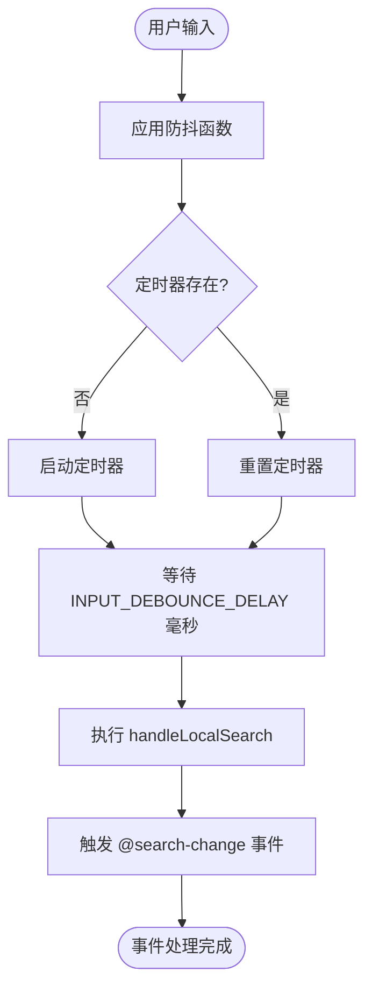
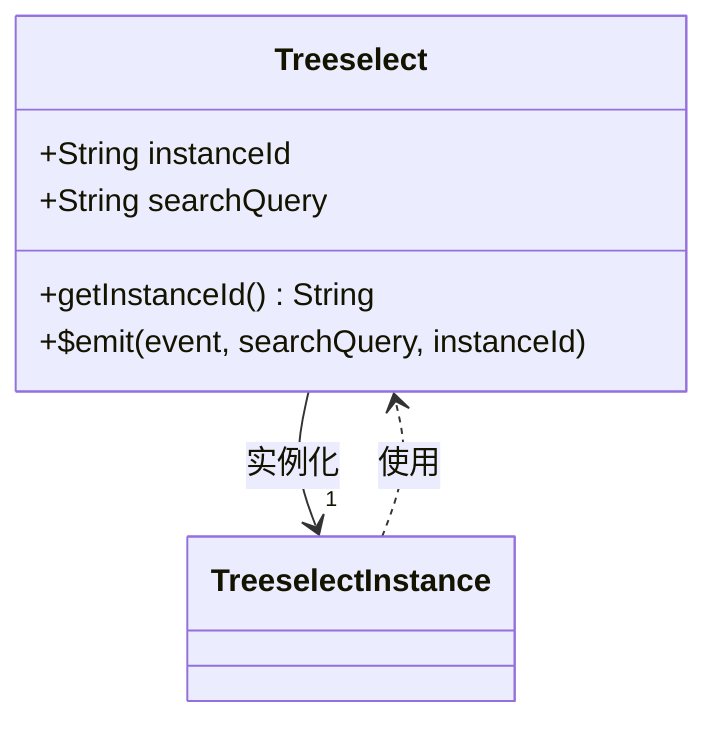
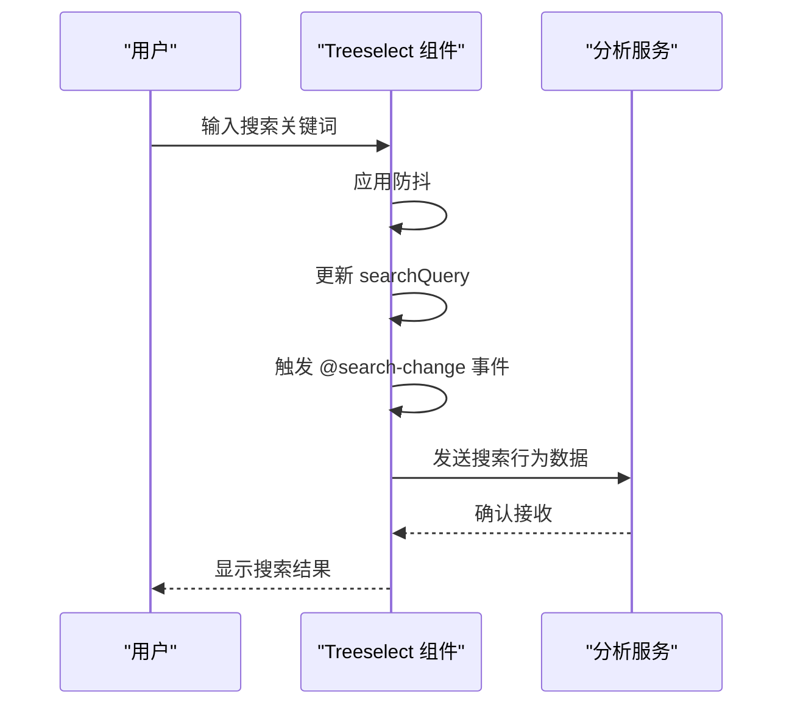
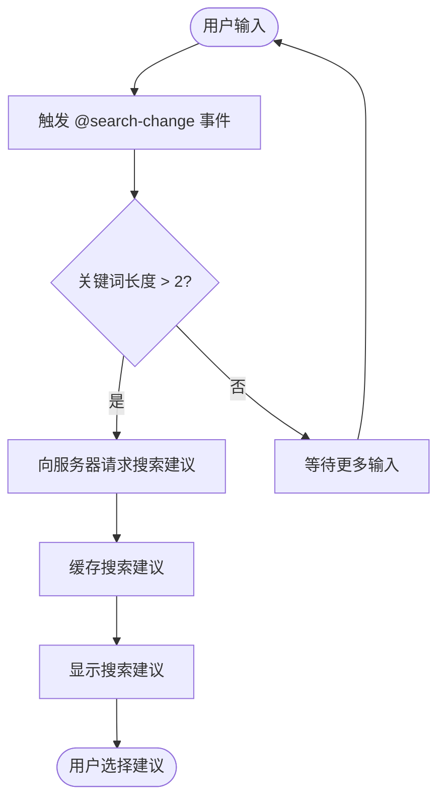
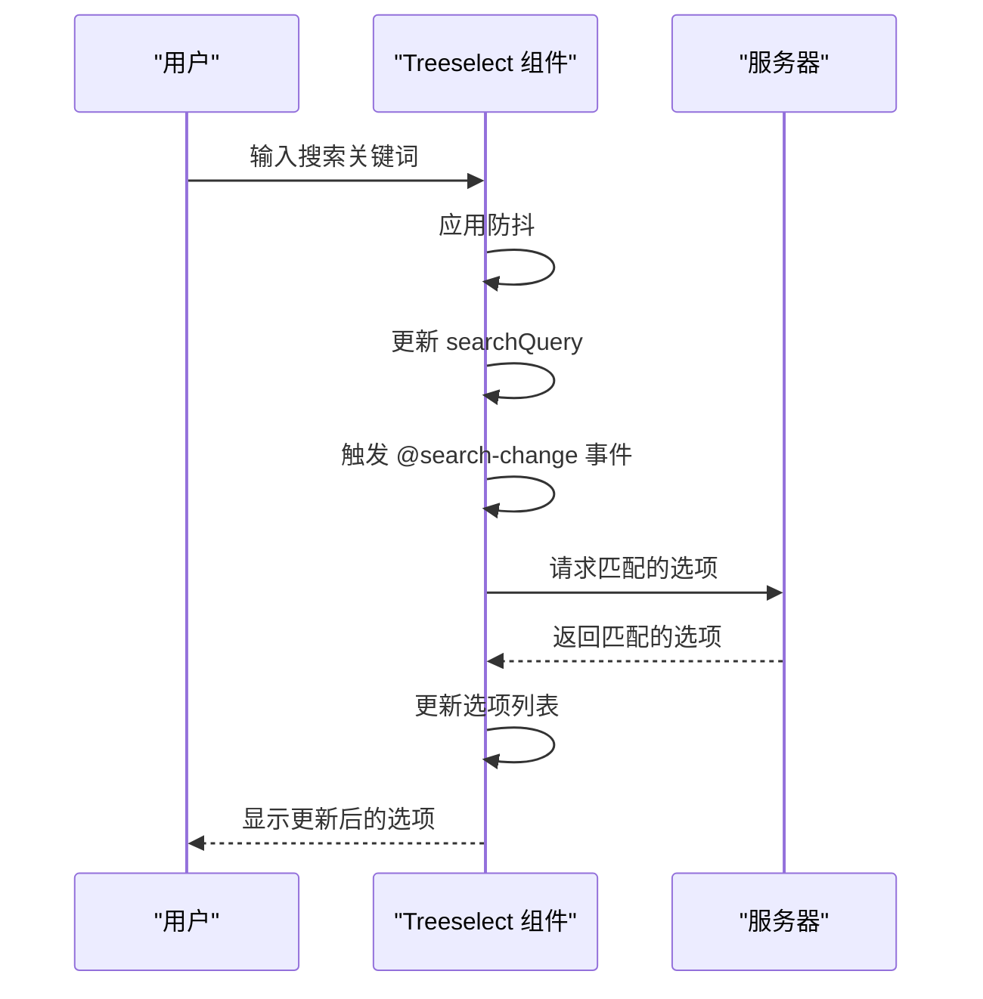

# @search-change 事件

<cite>
**本文档引用的文件**   
- [treeselectMixin.js](file://src/mixins/treeselectMixin.js#L880-L893)
- [Input.vue](file://src/components/Input.vue#L54-L58)
- [constants.js](file://src/constants.js#L46-L48)
- [debounce.js](file://src/utils/debounce.js)
</cite>

## 目录
1. [简介](#简介)
2. [事件参数](#事件参数)
3. [触发时机与防抖机制](#触发时机与防抖机制)
4. [instanceId 的作用](#instanceid-的作用)
5. [高级功能应用](#高级功能应用)
6. [与远程搜索配合使用](#与远程搜索配合使用)
7. [总结](#总结)

## 简介
`@search-change` 事件是 Treeselect 组件中用于监听搜索查询变化的核心事件。当用户在搜索输入框中输入内容时，该事件会被触发，携带当前的搜索关键词和组件实例 ID 作为参数。此事件在实现搜索行为分析、搜索建议预加载等高级功能时非常有用。

**Section sources**
- [treeselectMixin.js](file://src/mixins/treeselectMixin.js#L880-L893)

## 事件参数
`@search-change` 事件携带两个参数：
- **searchQuery**: 当前搜索关键词字符串。
- **instanceId**: 组件实例的唯一标识符。

这两个参数使得开发者能够准确地追踪每个组件实例的搜索行为，并进行相应的处理。

**Section sources**
- [treeselectMixin.js](file://src/mixins/treeselectMixin.js#L892-L893)

## 触发时机与防抖机制
`@search-change` 事件在搜索查询发生变化后触发，但其触发时机受到防抖机制的影响。防抖机制通过 `lodash/debounce` 函数实现，确保在用户快速输入时不会频繁触发事件，从而优化性能。

**Diagram sources **
- [Input.vue](file://src/components/Input.vue#L54-L58)
- [constants.js](file://src/constants.js#L46-L48)
- [debounce.js](file://src/utils/debounce.js)

**Section sources**
- [treeselectMixin.js](file://src/mixins/treeselectMixin.js#L880-L893)
- [Input.vue](file://src/components/Input.vue#L54-L58)

## instanceId 的作用
`instanceId` 是 Treeselect 组件实例的唯一标识符，在多组件环境中起到关键作用。它可以帮助开发者区分不同组件实例的事件，避免混淆。例如，在一个页面中有多个 Treeselect 组件时，可以通过 `instanceId` 来确定是哪个组件触发了 `@search-change` 事件。

**Diagram sources **
- [treeselectMixin.js](file://src/mixins/treeselectMixin.js#L967-L969)

**Section sources**
- [treeselectMixin.js](file://src/mixins/treeselectMixin.js#L967-L969)

## 高级功能应用
`@search-change` 事件可以用于实现多种高级功能，如搜索行为分析和搜索建议预加载。

### 搜索行为分析
通过监听 `@search-change` 事件，可以收集用户的搜索行为数据，进行分析以优化用户体验。

**Diagram sources **
- [treeselectMixin.js](file://src/mixins/treeselectMixin.js#L880-L893)

### 搜索建议预加载
在用户输入时，可以根据当前的搜索关键词预加载可能的搜索建议，提高响应速度。

**Diagram sources **
- [treeselectMixin.js](file://src/mixins/treeselectMixin.js#L880-L893)

**Section sources**
- [treeselectMixin.js](file://src/mixins/treeselectMixin.js#L880-L893)

## 与远程搜索配合使用
`@search-change` 事件还可以与远程搜索功能配合使用，实现在用户输入时动态加载选项。

**Diagram sources **
- [treeselectMixin.js](file://src/mixins/treeselectMixin.js#L1283-L1319)

**Section sources**
- [treeselectMixin.js](file://src/mixins/treeselectMixin.js#L1283-L1319)

## 总结
`@search-change` 事件是 Treeselect 组件中一个重要的事件，它在搜索查询发生变化时触发，并携带当前搜索关键词和组件实例 ID 作为参数。通过防抖机制，该事件能够在保证性能的同时准确反映用户的搜索行为。利用 `instanceId`，可以在多组件环境中准确标识事件来源，实现搜索行为分析和搜索建议预加载等高级功能。

**Section sources**
- [treeselectMixin.js](file://src/mixins/treeselectMixin.js#L880-L893)