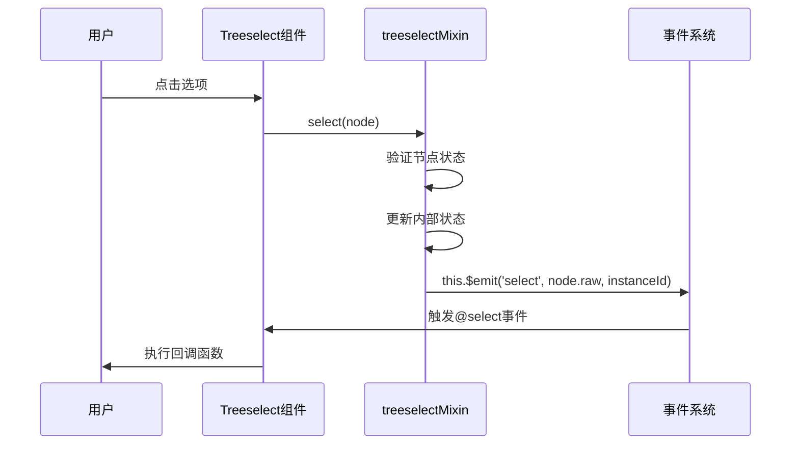
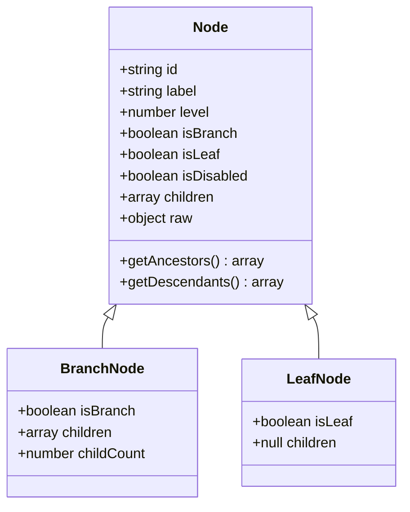

# @select 事件

<cite>
**本文档中引用的文件**
- [Treeselect.vue](file://src/components/Treeselect.vue)
- [treeselectMixin.js](file://src/mixins/treeselectMixin.js)
- [Events.spec.js](file://test/unit/specs/Events.spec.js)
- [createMap.js](file://src/utils/createMap.js)
</cite>

## 目录
1. [概述](#概述)
2. [事件触发机制](#事件触发机制)
3. [参数详解](#参数详解)
4. [节点对象结构](#节点对象结构)
5. [instanceId的作用](#instanceid的作用)
6. [事件监听示例](#事件监听示例)
7. [实际应用场景](#实际应用场景)
8. [最佳实践](#最佳实践)

## 概述

@select事件是Treeselect组件中的核心事件之一，当用户成功选择一个选项时触发。该事件携带两个关键参数：被选择的节点对象和组件实例ID，为开发者提供了精确的选中信息和组件标识能力。

## 事件触发机制



**图表来源**
- [treeselectMixin.js](file://src/mixins/treeselectMixin.js#L1784-L1823)

**章节来源**
- [treeselectMixin.js](file://src/mixins/treeselectMixin.js#L1784-L1823)

## 参数详解

### 被选择的节点对象

当@select事件触发时，第一个参数是被选择的节点对象，包含了丰富的节点信息：

| 属性名 | 类型 | 描述 |
|--------|------|------|
| id | string | 节点的唯一标识符 |
| label | string | 节点显示的标签文本 |
| level | number | 节点在树形结构中的层级深度（根节点为0） |
| isBranch | boolean | 是否为分支节点（有子节点） |
| isLeaf | boolean | 是否为叶子节点（无子节点） |
| isDisabled | boolean | 节点是否被禁用 |
| children | array \| null | 子节点数组或null（未加载时） |
| raw | object | 原始传入的数据对象 |

### 组件实例ID

第二个参数是组件实例ID，用于在复杂页面中区分不同的Treeselect组件实例：

| 特性 | 描述 |
|------|------|
| 类型 | string 或 number |
| 默认值 | 自动生成的递增数字后缀"$$" |
| 用途 | 在多实例场景下识别特定组件 |
| 格式 | `instanceId$$` |

**章节来源**
- [treeselectMixin.js](file://src/mixins/treeselectMixin.js#L967-L969)
- [treeselectMixin.js](file://src/mixins/treeselectMixin.js#L1784-L1823)

## 节点对象结构

### 完整节点对象示例

```javascript
{
  id: 'department-001',
  label: '技术部',
  level: 0,
  isBranch: true,
  isLeaf: false,
  isDisabled: false,
  children: [
    {
      id: 'team-001',
      label: '前端团队',
      level: 1,
      isBranch: false,
      isLeaf: true,
      isDisabled: false,
      children: null
    }
  ],
  raw: {
    id: 'department-001',
    label: '技术部',
    children: [
      {
        id: 'team-001',
        label: '前端团队'
      }
    ]
  }
}
```

### 节点属性说明



**图表来源**
- [treeselectMixin.js](file://src/mixins/treeselectMixin.js#L1539-L1582)

**章节来源**
- [treeselectMixin.js](file://src/mixins/treeselectMixin.js#L1539-L1582)

## instanceId的作用

### 多实例场景下的重要性

在复杂的Web应用中，经常需要在同一页面上渲染多个Treeselect组件。instanceId确保了即使多个组件具有相同的配置，也能准确识别事件来源：

```javascript
// 示例：多实例场景
<template>
  <div>
    <treeselect 
      v-model="departments"
      :options="departmentOptions"
      @select="handleDepartmentSelect"
      instance-id="department-selector"
    />
    <treeselect 
      v-model="teams"
      :options="teamOptions"
      @select="handleTeamSelect"
      instance-id="team-selector"
    />
  </div>
</template>
```

### 自动分配机制

如果没有显式指定instanceId，组件会自动分配一个唯一的ID：

```javascript
// 自动生成的instanceId示例
let instanceId = 0;
export default {
  props: {
    instanceId: {
      default: () => `${instanceId++}$$`,
      type: [String, Number],
    },
  },
  // ...
}
```

**章节来源**
- [treeselectMixin.js](file://src/mixins/treeselectMixin.js#L323-L326)

## 事件监听示例

### 基础监听器

```javascript
<template>
  <treeselect
    v-model="selectedValue"
    :options="options"
    @select="onNodeSelect"
  />
</template>

<script>
export default {
  methods: {
    onNodeSelect(node, instanceId) {
      console.log('被选择的节点:', node)
      console.log('来自组件实例:', instanceId)
      
      // 基本处理逻辑
      this.logSelection(node, instanceId)
      this.updateRelatedState(node)
    }
  }
}
</script>
```

### 多实例事件处理

```javascript
<template>
  <div>
    <treeselect
      v-model="department"
      :options="departmentOptions"
      @select="handleSelect"
      instance-id="department"
    />
    <treeselect
      v-model="location"
      :options="locationOptions"
      @select="handleSelect"
      instance-id="location"
    />
  </div>
</template>

<script>
export default {
  methods: {
    handleSelect(node, instanceId) {
      switch(instanceId) {
        case 'department':
          this.processDepartmentSelection(node)
          break
        case 'location':
          this.processLocationSelection(node)
          break
        default:
          console.warn('未知的组件实例:', instanceId)
      }
    }
  }
}
</script>
```

**章节来源**
- [Events.spec.js](file://test/unit/specs/Events.spec.js#L37-L61)

## 实际应用场景

### 日志记录

```javascript
methods: {
  logSelection(node, instanceId) {
    const logEntry = {
      timestamp: new Date().toISOString(),
      instanceId: instanceId,
      nodeId: node.id,
      nodeLabel: node.label,
      eventType: 'select',
      level: node.level,
      action: '节点被选择'
    }
    
    // 发送到日志服务
    this.sendToAnalytics(logEntry)
    
    // 记录到控制台
    console.log('节点选择日志:', logEntry)
  }
}
```

### 状态更新

```javascript
methods: {
  updateRelatedState(node) {
    // 根据选择的部门更新团队列表
    if (node.level === 0) {
      this.fetchTeamsForDepartment(node.id)
    }
    
    // 更新面包屑导航
    this.updateBreadcrumb(node)
    
    // 清空相关字段
    this.clearRelatedFields(node)
  }
}
```

### 第三方服务集成

```javascript
methods: {
  integrateWithThirdParty(node, instanceId) {
    // Google Analytics事件跟踪
    if (typeof gtag !== 'undefined') {
      gtag('event', 'treeselect_select', {
        'event_category': 'user_interaction',
        'event_label': `${instanceId}_${node.id}`,
        'value': node.level
      })
    }
    
    // Mixpanel用户行为分析
    if (typeof mixpanel !== 'undefined') {
      mixpanel.track('Node Selected', {
        component: instanceId,
        nodeId: node.id,
        nodeLabel: node.label,
        level: node.level,
        timestamp: new Date().toISOString()
      })
    }
  }
}
```

### 表单验证和依赖关系管理

```javascript
methods: {
  handleSelect(node, instanceId) {
    // 更新表单状态
    this.updateFormValidation(node, instanceId)
    
    // 处理级联依赖
    this.handleCascadingDependencies(node, instanceId)
    
    // 更新UI反馈
    this.showSuccessMessage(node, instanceId)
  },
  
  updateFormValidation(node, instanceId) {
    // 根据选择更新必填字段状态
    if (node.level >= 2) {
      this.$set(this.formFields, 'subCategoryRequired', true)
    }
    
    // 触发表单重新验证
    this.$refs.form.validate()
  }
}
```

## 最佳实践

### 1. 事件处理函数设计原则

```javascript
// 推荐：清晰的职责分离
methods: {
  handleSelect(node, instanceId) {
    // 1. 参数验证
    if (!this.isValidNode(node)) return
    
    // 2. 业务逻辑处理
    this.processSelection(node, instanceId)
    
    // 3. 状态更新
    this.updateApplicationState(node, instanceId)
    
    // 4. 用户反馈
    this.provideUserFeedback(node, instanceId)
  },
  
  isValidNode(node) {
    return node && node.id && node.label
  }
}
```

### 2. 性能优化建议

```javascript
// 推荐：使用防抖处理频繁选择
methods: {
  handleSelect: debounce(function(node, instanceId) {
    // 复杂的业务逻辑处理
    this.complexProcessing(node, instanceId)
  }, 300)
}
```

### 3. 错误处理和边界情况

```javascript
methods: {
  handleSelect(node, instanceId) {
    try {
      // 主要业务逻辑
      this.processNodeSelection(node, instanceId)
    } catch (error) {
      console.error('节点选择处理失败:', error)
      this.showErrorNotification(error)
    }
  }
}
```

### 4. 测试策略

```javascript
// 单元测试示例
it('应该正确触发select事件', () => {
  const wrapper = mount(Treeselect, {
    propsData: {
      options: [{ id: 'test', label: 'Test' }],
      instanceId: 'test-instance'
    }
  })
  
  // 模拟用户选择
  wrapper.find('.vue-treeselect__option').trigger('click')
  
  // 验证事件触发
  expect(wrapper.emitted().select).toBeTruthy()
  expect(wrapper.emitted().select[0]).toEqual([
    { id: 'test', label: 'Test' },
    'test-instance'
  ])
})
```

**章节来源**
- [Events.spec.js](file://test/unit/specs/Events.spec.js#L1-L67)