# 交互控制

<cite>
**本文档引用的文件**
- [src/mixins/treeselectMixin.js](file://src/mixins/treeselectMixin.js)
- [src/components/Treeselect.vue](file://src/components/Treeselect.vue)
- [src/components/Control.vue](file://src/components/Control.vue)
- [src/components/Input.vue](file://src/components/Input.vue)
- [src/components/Menu.vue](file://src/components/Menu.vue)
- [src/utils/onLeftClick.js](file://src/utils/onLeftClick.js)
- [test/unit/specs/Props.spec.js](file://test/unit/specs/Props.spec.js)
- [test/unit/specs/Props.spec.js](file://test/unit/specs/Props.spec.js)
</cite>

## 目录
1. [简介](#简介)
2. [核心交互控制Props](#核心交互控制props)
3. [组件架构概览](#组件架构概览)
4. [disabled 禁用状态控制](#disabled-禁用状态控制)
5. [searchable 搜索功能控制](#searchable-搜索功能控制)
6. [openOnClick 菜单触发控制](#openonclick-菜单触发控制)
7. [autoFocus 自动聚焦控制](#autofocus-自动聚焦控制)
8. [tabIndex Tab键顺序控制](#tabindex-tab键顺序控制)
9. [交互组合效果](#交互组合效果)
10. [表单集成最佳实践](#表单集成最佳实践)
11. [总结](#总结)

## 简介

Vue TreeSelect 组件提供了丰富的交互控制Props，允许开发者精确控制组件的用户交互行为。这些Props涵盖了从基础的禁用状态到复杂的键盘导航和焦点管理等多个方面，为构建灵活的树形选择器提供了强大的配置能力。

## 核心交互控制Props

### 主要Props列表

| Prop名称 | 类型 | 默认值 | 描述 |
|---------|------|--------|------|
| `disabled` | Boolean | false | 控制整个组件是否禁用 |
| `searchable` | Boolean | true | 是否启用搜索功能 |
| `openOnClick` | Boolean | true | 点击控件时是否打开菜单 |
| `autoFocus` | Boolean | false | 组件挂载后是否自动聚焦 |
| `tabIndex` | Number | 0 | Tab键导航顺序 |

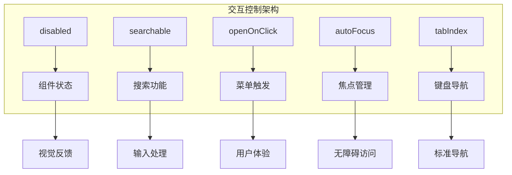

**图表来源**
- [src/mixins/treeselectMixin.js](file://src/mixins/treeselectMixin.js#L292-L464)

## 组件架构概览

Vue TreeSelect 组件采用分层架构设计，通过多个子组件协同工作来实现复杂的交互控制：

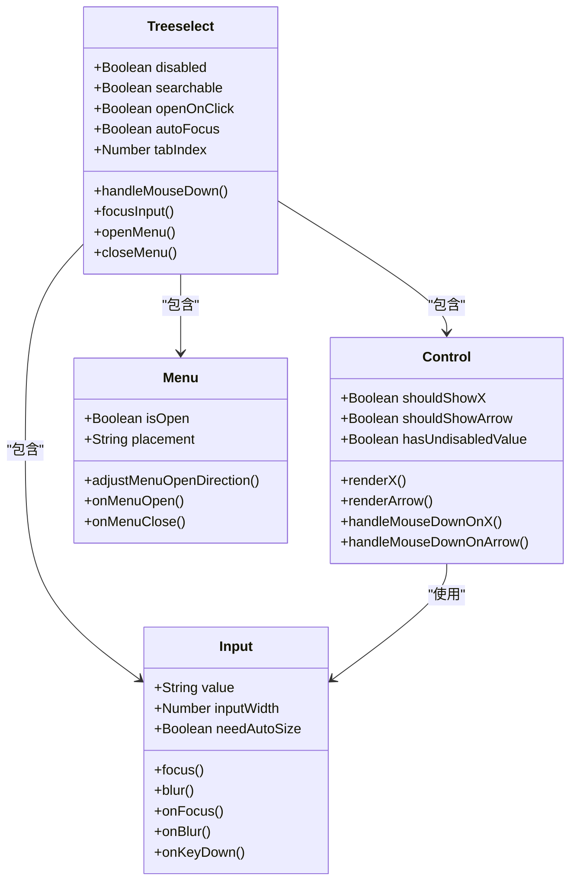

**图表来源**
- [src/components/Treeselect.vue](file://src/components/Treeselect.vue#L1-L42)
- [src/components/Control.vue](file://src/components/Control.vue#L1-L154)
- [src/components/Input.vue](file://src/components/Input.vue#L1-L296)

**章节来源**
- [src/components/Treeselect.vue](file://src/components/Treeselect.vue#L1-L42)
- [src/components/Control.vue](file://src/components/Control.vue#L1-L154)
- [src/components/Input.vue](file://src/components/Input.vue#L1-L296)

## disabled 禁用状态控制

`disabled` 属性是最重要的交互控制之一，它完全禁用了组件的所有交互功能。

### 实现机制

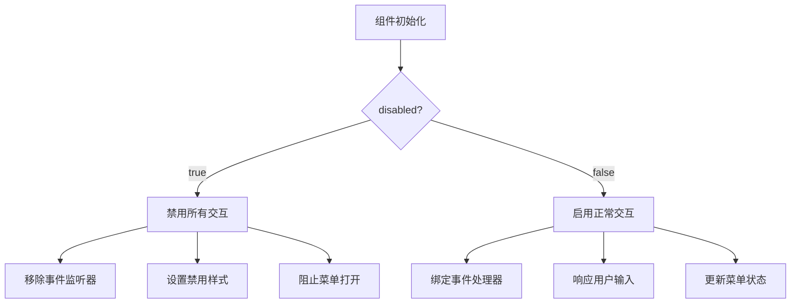

**图表来源**
- [src/mixins/treeselectMixin.js](file://src/mixins/treeselectMixin.js#L840-L844)

### 关键特性

1. **完全禁用**: 当 `disabled: true` 时，组件完全失去交互能力
2. **自动关闭**: 禁用状态下会自动关闭打开的菜单
3. **样式应用**: 自动添加禁用样式类名
4. **事件拦截**: 所有鼠标和键盘事件都被拦截

### 使用场景

- 表单验证失败时禁用提交按钮
- 条件性禁用某些选项
- 加载状态下的临时禁用

**章节来源**
- [src/mixins/treeselectMixin.js](file://src/mixins/treeselectMixin.js#L292-L298)
- [src/mixins/treeselectMixin.js](file://src/mixins/treeselectMixin.js#L840-L844)

## searchable 搜索功能控制

`searchable` 属性控制组件是否显示搜索输入框，影响用户的搜索体验。

### 显示逻辑

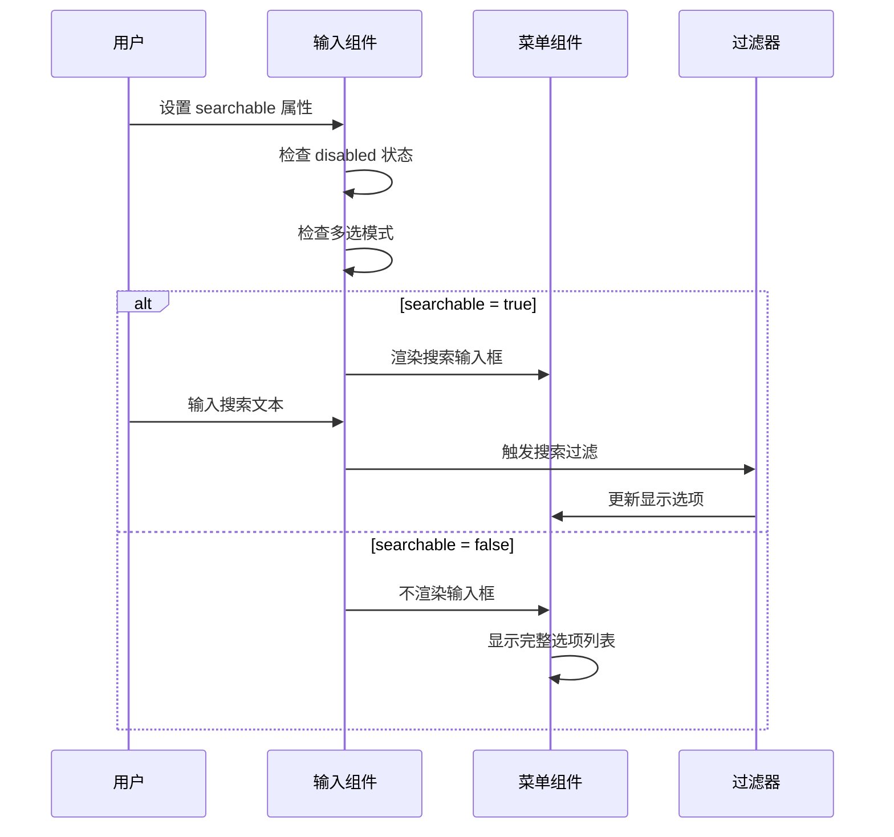

**图表来源**
- [src/components/Input.vue](file://src/components/Input.vue#L214-L247)

### 搜索输入框渲染条件

搜索输入框的显示遵循以下规则：
1. `searchable = true` 且 `disabled = false`
2. 在多选模式下，搜索输入框始终显示
3. 单选模式下，当 `searchable = false` 时隐藏输入框

### 动态宽度调整

对于多选模式，搜索输入框支持动态宽度调整：


**图表来源**
- [src/components/Input.vue](file://src/components/Input.vue#L277-L282)

**章节来源**
- [src/components/Input.vue](file://src/components/Input.vue#L25-L32)
- [src/components/Input.vue](file://src/components/Input.vue#L214-L247)

## openOnClick 菜单触发控制

`openOnClick` 决定用户点击组件时是否自动打开菜单，这是影响用户体验的关键参数。

### 触发机制

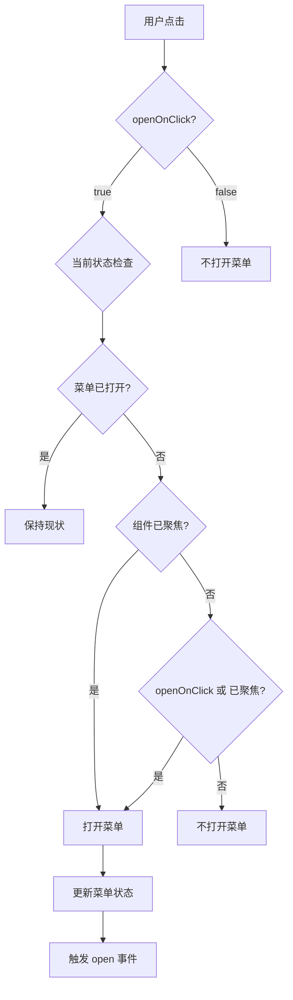

**图表来源**
- [src/mixins/treeselectMixin.js](file://src/mixins/treeselectMixin.js#L1188-L1197)

### 触发条件详解

1. **基本条件**: 必须满足 `!this.menu.isOpen && (this.openOnClick || this.trigger.isFocused)`
2. **状态依赖**: 受 `openOnClick` 和 `trigger.isFocused` 共同控制
3. **事件传播**: 使用 `onLeftClick` 防止右键菜单干扰

### 与其他属性的协作

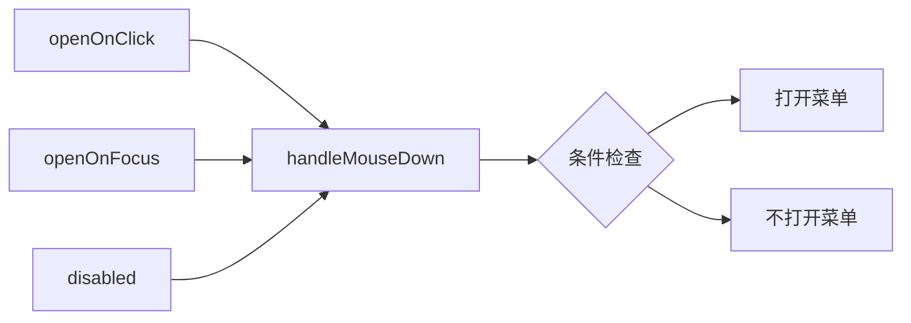

**图表来源**
- [src/mixins/treeselectMixin.js](file://src/mixins/treeselectMixin.js#L1188-L1197)

**章节来源**
- [src/mixins/treeselectMixin.js](file://src/mixins/treeselectMixin.js#L461-L464)
- [src/mixins/treeselectMixin.js](file://src/mixins/treeselectMixin.js#L1188-L1197)

## autoFocus 自动聚焦控制

`autoFocus` 属性控制组件挂载后是否自动获得焦点，这对无障碍访问和用户体验至关重要。

### 生命周期集成

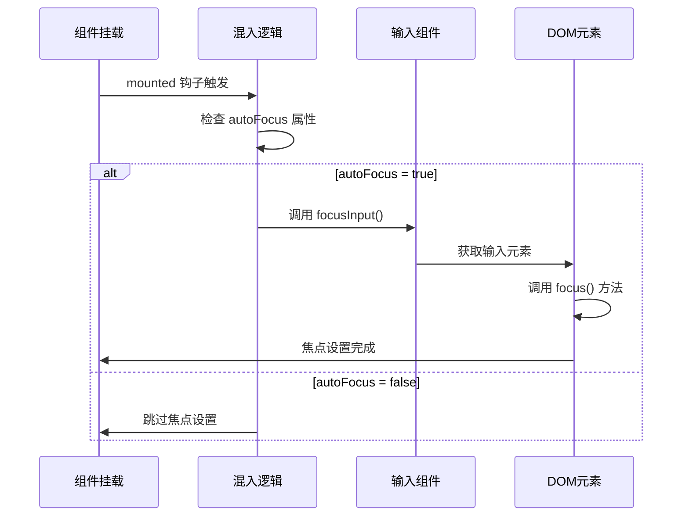

**图表来源**
- [src/mixins/treeselectMixin.js](file://src/mixins/treeselectMixin.js#L1972-L1973)

### 焦点管理策略

1. **时机控制**: 在 `mounted` 钩子中执行，确保DOM已渲染
2. **条件检查**: 只有在 `autoFocus = true` 时才执行
3. **元素验证**: 通过 `getInput()` 确保目标元素存在

### 与 openOnFocus 的关系

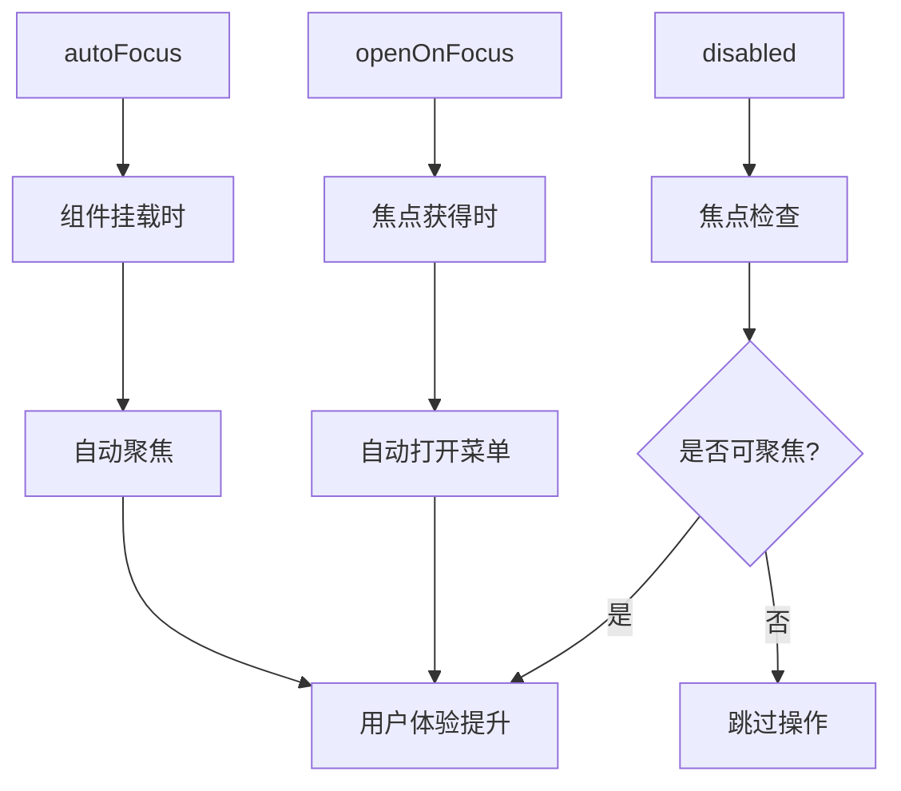

**图表来源**
- [src/mixins/treeselectMixin.js](file://src/mixins/treeselectMixin.js#L1972-L1977)

**章节来源**
- [src/mixins/treeselectMixin.js](file://src/mixins/treeselectMixin.js#L461-L464)
- [src/mixins/treeselectMixin.js](file://src/mixins/treeselectMixin.js#L1972-L1977)

## tabIndex Tab键顺序控制

`tabIndex` 属性控制组件在Tab键导航中的顺序，对键盘导航和无障碍访问至关重要。

### Tab导航流程

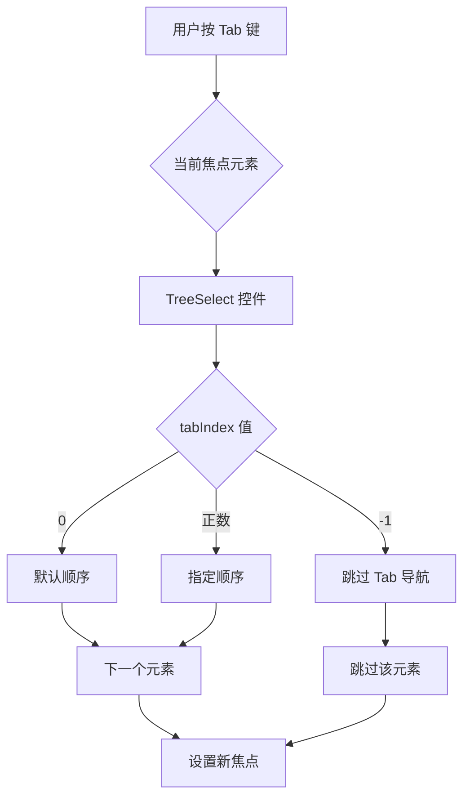

**图表来源**
- [src/components/Input.vue](file://src/components/Input.vue#L258)

### 不同模式下的Tab处理

1. **搜索模式**: `tabIndex` 直接传递给输入框
2. **非搜索模式**: 通过 `tabIndex` 属性传递给容器
3. **禁用状态**: 不设置 `tabIndex` 属性

### 无障碍访问考虑

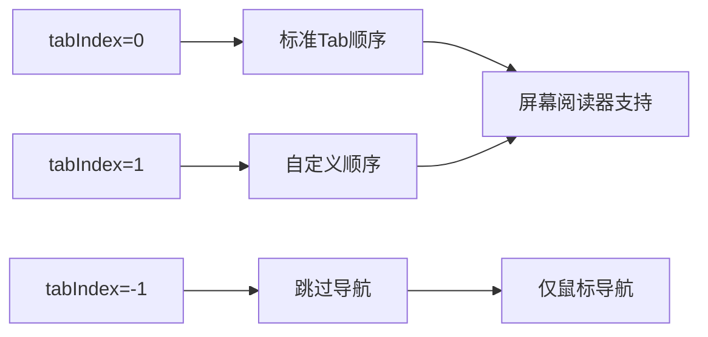

**图表来源**
- [src/components/Input.vue](file://src/components/Input.vue#L235-L241)

**章节来源**
- [src/mixins/treeselectMixin.js](file://src/mixins/treeselectMixin.js#L588-L593)
- [src/components/Input.vue](file://src/components/Input.vue#L235-L241)

## 交互组合效果

多个交互控制Props可以协同工作，产生复杂但一致的用户体验。

### 组合场景分析

| disabled | searchable | openOnClick | autoFocus | 效果描述 |
|----------|------------|-------------|-----------|----------|
| false | true | true | true | 完整交互功能，自动聚焦 |
| false | true | false | true | 搜索功能可用，需手动点击打开 |
| true | false | - | false | 完全禁用，无交互 |
| false | false | true | false | 无搜索框，点击打开菜单 |

### 状态转换图

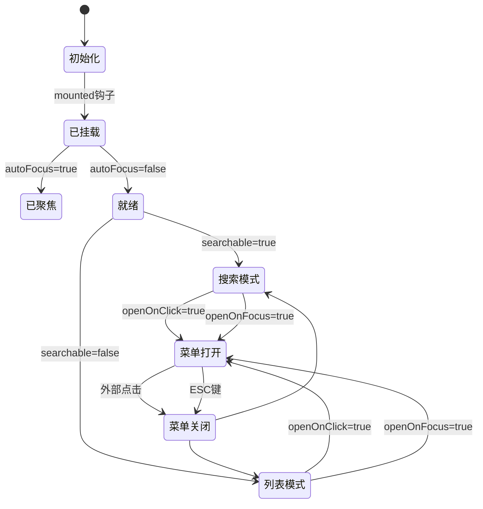

**图表来源**
- [src/mixins/treeselectMixin.js](file://src/mixins/treeselectMixin.js#L1972-L1977)

### 性能优化考虑

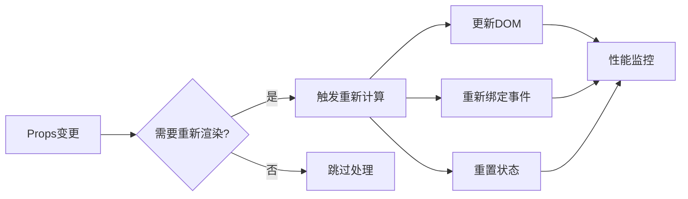

**章节来源**
- [test/unit/specs/Props.spec.js](file://test/unit/specs/Props.spec.js#L466-L479)
- [test/unit/specs/Props.spec.js](file://test/unit/specs/Props.spec.js#L1689-L1719)

## 表单集成最佳实践

### 基本表单集成

```javascript
// 基础表单配置
const formConfig = {
  // 禁用状态控制
  disabled: false,
  
  // 搜索功能配置
  searchable: true,
  
  // 交互行为配置
  openOnClick: true,
  autoFocus: false,
  
  // Tab导航配置
  tabIndex: 0,
  
  // 数据配置
  options: [],
  value: null
}
```

### 动态状态管理

```javascript
// 状态驱动的配置
computed: {
  treeSelectProps() {
    return {
      disabled: this.formState.loading,
      searchable: this.userPreferences.enableSearch,
      openOnClick: this.userPreferences.clickToOpen,
      autoFocus: this.formState.firstField,
      tabIndex: this.fieldTabIndex
    }
  }
}
```

### 错误处理和验证

```javascript
// 验证规则配置
const validationRules = {
  // 必填验证
  required: {
    disabled: false,
    searchable: true,
    openOnClick: true,
    autoFocus: true,
    tabIndex: 0
  },
  
  // 条件禁用
  conditional: {
    disabled: this.needsApproval,
    searchable: true,
    openOnClick: true,
    autoFocus: false,
    tabIndex: 0
  }
}
```

### 无障碍访问优化

```javascript
// 无障碍访问配置
const a11yConfig = {
  // 提供清晰的标签
  ariaLabel: '请选择项目',
  
  // 支持键盘导航
  tabIndex: 0,
  
  // 禁用状态下的提示
  disabled: {
    tabIndex: -1,
    ariaDisabled: true
  }
}
```

### 性能优化建议

1. **合理使用 autoFocus**: 只在必要时启用，避免页面加载时过多焦点切换
2. **搜索性能**: 对于大量数据，考虑使用异步搜索
3. **菜单状态**: 合理使用 `alwaysOpen` 减少频繁开关
4. **事件优化**: 使用防抖和节流优化搜索和滚动事件

**章节来源**
- [test/unit/specs/Props.spec.js](file://test/unit/specs/Props.spec.js#L2273-L2327)
- [test/unit/specs/Props.spec.js](file://test/unit/specs/Props.spec.js#L1765-L1792)

## 总结

Vue TreeSelect 组件的交互控制Props系统提供了强大而灵活的配置能力：

1. **disabled**: 完全控制组件的可用性
2. **searchable**: 灵活控制搜索功能的显示
3. **openOnClick/openOnFocus**: 精确控制菜单的触发时机
4. **autoFocus**: 优化用户体验和无障碍访问
5. **tabIndex**: 确保标准的键盘导航体验

这些Props不仅各自独立工作，还能相互协作，为开发者提供了构建复杂交互场景的能力。通过合理配置这些属性，可以创建既功能丰富又易于使用的树形选择器组件。

在实际开发中，建议根据具体的使用场景和用户需求，选择合适的Props组合，并注意性能优化和无障碍访问的最佳实践。