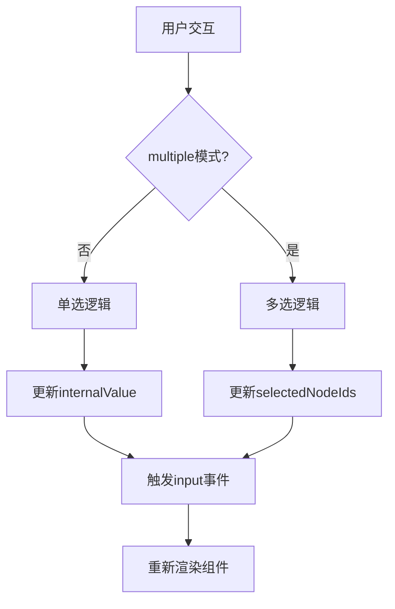
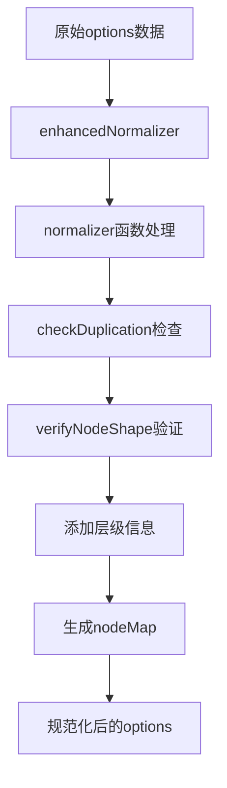
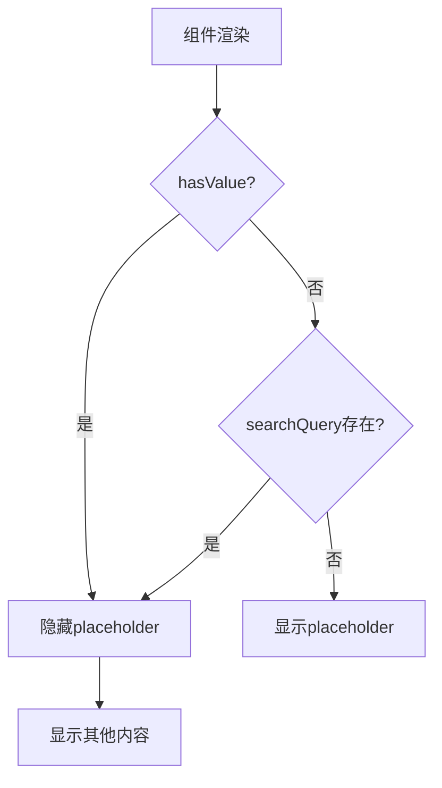
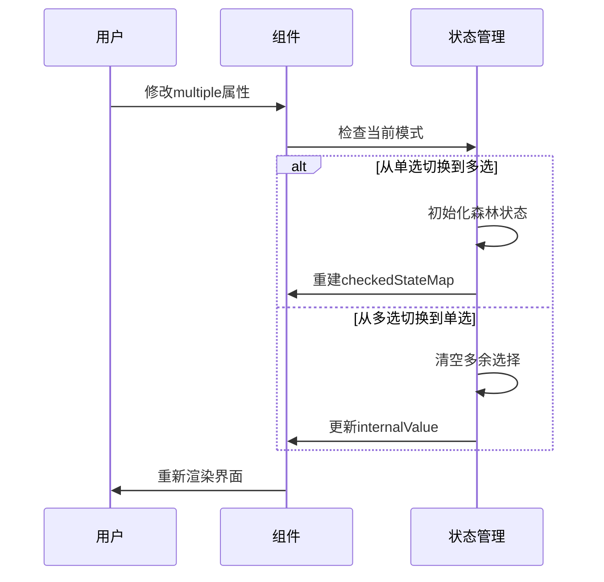
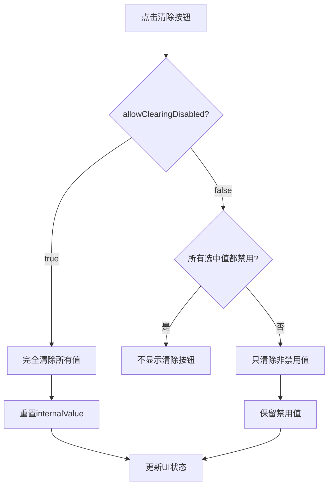
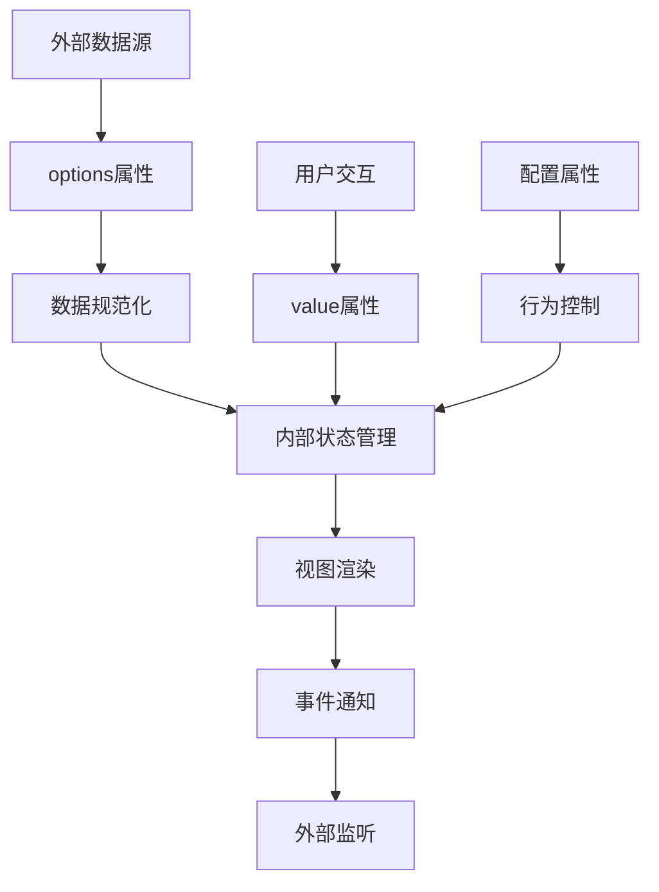

# 基础功能

<cite>
**本文档引用的文件**
- [Treeselect.vue](file://src/components/Treeselect.vue)
- [treeselectMixin.js](file://src/mixins/treeselectMixin.js)
- [Placeholder.vue](file://src/components/Placeholder.vue)
- [Props.spec.js](file://test/unit/specs/Props.spec.js)
- [Basic.spec.js](file://test/unit/specs/Basic.spec.js)
- [Selecting.spec.js](file://test/unit/specs/Selecting.spec.js)
- [README.md](file://README.md)
- [warning.js](file://src/utils/warning.js)
</cite>

## 目录
1. [简介](#简介)
2. [核心Props概览](#核心props概览)
3. [value属性详解](#value属性详解)
4. [options属性详解](#options属性详解)
5. [placeholder属性详解](#placeholder属性详解)
6. [multiple属性详解](#multiple属性详解)
7. [clearable属性详解](#clearable属性详解)
8. [Props协同工作机制](#props协同工作机制)
9. [基础使用示例](#基础使用示例)
10. [常见配置错误及解决方案](#常见配置错误及解决方案)
11. [总结](#总结)

## 简介

Vue Treeselect是一个功能强大的多级嵌套选择器组件，支持单选和多选模式。本文档重点介绍其基础功能Props，包括`value`、`options`、`placeholder`、`multiple`、`clearable`等核心配置项，帮助开发者快速掌握组件的基本使用方法。

## 核心Props概览

Vue Treeselect提供了丰富的配置选项来满足不同的业务需求。以下是基础功能相关的核心Props：

| 属性名 | 类型 | 默认值 | 作用描述 |
|--------|------|--------|----------|
| `value` | `any` | `null` | 组件的双向绑定值，支持单选和多选模式 |
| `options` | `Array` | `undefined` | 树形数据源，定义可选择的选项结构 |
| `placeholder` | `String` | `'Select...'` | 输入框为空时显示的提示文本 |
| `multiple` | `Boolean` | `false` | 是否启用多选模式 |
| `clearable` | `Boolean` | `true` | 是否显示清除按钮 |

## value属性详解

### 属性定义

`value`是Treeselect的核心双向绑定属性，用于控制组件的选中状态。

### 类型与格式

- **单选模式**: `value`可以是字符串、数字或对象，对应选项的`id`或完整节点对象
- **多选模式**: `value`必须是数组，包含多个选项的`id`或对象
- **valueFormat配置**: 可通过`valueFormat`属性控制`value`的格式

### 默认值与行为

- 单选模式下默认值为`null`
- 多选模式下默认值为空数组`[]`
- 当`value`发生变化时，会触发`input`事件

### 内部实现机制



**图表来源**
- [treeselectMixin.js](file://src/mixins/treeselectMixin.js#L846-L867)

**章节来源**
- [treeselectMixin.js](file://src/mixins/treeselectMixin.js#L596-L602)
- [Props.spec.js](file://test/unit/specs/Props.spec.js#L2823-L3018)

## options属性详解

### 属性定义

`options`属性定义了Treeselect的树形数据源，决定了组件中可选择的选项结构。

### 数据结构要求

选项数据必须遵循特定的结构规范：

```javascript
// 基本结构示例
const options = [
  {
    id: 'unique-id',           // 必需：唯一标识符
    label: '显示名称',         // 必需：显示文本
    children: [                // 可选：子节点数组
      { id: 'child-id', label: '子选项' }
    ],
    isDisabled: false,        // 可选：是否禁用
    isDefaultExpanded: false, // 可选：是否默认展开
    // 其他自定义属性
  }
]
```

### 数据规范化过程

组件内部会对原始数据进行规范化处理：



**图表来源**
- [treeselectMixin.js](file://src/mixins/treeselectMixin.js#L1532-L1545)

### 验证规则

组件会对选项数据进行严格验证：

1. **重复ID检查**: 确保每个节点的`id`唯一性
2. **结构完整性**: 验证必需字段的存在
3. **分支节点声明**: 正确使用`children: null`表示未加载的分支节点

### 动态加载支持

支持异步加载子节点数据：

```javascript
// 异步加载配置示例
{
  loadOptions({ action, parentNode, callback }) {
    // action: LOAD_ROOT_OPTIONS 或 LOAD_CHILDREN_OPTIONS
    // parentNode: 当前父节点（加载根节点时为undefined）
    // callback: 加载完成后的回调函数
  }
}
```

**章节来源**
- [treeselectMixin.js](file://src/mixins/treeselectMixin.js#L1539-L1669)
- [Basic.spec.js](file://test/unit/specs/Basic.spec.js#L686-L730)

## placeholder属性详解

### 属性定义

`placeholder`属性设置输入框为空时显示的提示文本，默认值为`'Select...'`。

### 显示条件

提示文本在以下情况下显示：
- 组件没有选中任何值
- 用户正在输入搜索关键词
- 搜索结果为空且没有其他内容显示

### 实现机制



**图表来源**
- [Placeholder.vue](file://src/components/Placeholder.vue#L11-L12)

### 自定义配置

可以通过修改`placeholder`属性来自定义提示文本：

```javascript
// 示例：设置自定义提示文本
<treeselect
  v-model="value"
  :options="options"
  placeholder="请选择分类"
/>
```

**章节来源**
- [Placeholder.vue](file://src/components/Placeholder.vue#L1-L21)
- [treeselectMixin.js](file://src/mixins/treeselectMixin.js#L484-L488)

## multiple属性详解

### 属性定义

`multiple`属性控制组件是否启用多选模式，默认为`false`（单选模式）。

### 单选模式特性

- 每次只能选择一个选项
- 选中后自动关闭下拉菜单
- 清空输入框时重置选择状态

### 多选模式特性

- 支持同时选择多个选项
- 选中后保持菜单打开状态
- 提供视觉反馈显示已选项目

### 模式切换机制



**图表来源**
- [treeselectMixin.js](file://src/mixins/treeselectMixin.js#L862-L867)

### 多选配置选项

多选模式下还有相关配置属性：

| 属性名 | 类型 | 默认值 | 作用描述 |
|--------|------|--------|----------|
| `closeOnSelect` | `Boolean` | `true` | 选中后是否关闭菜单 |
| `clearOnSelect` | `Boolean` | `false` | 选中后是否清空搜索框 |
| `valueConsistsOf` | `String` | `'BRANCH_PRIORITY'` | 多选时包含哪些节点 |

**章节来源**
- [treeselectMixin.js](file://src/mixins/treeselectMixin.js#L390-L396)
- [Selecting.spec.js](file://test/unit/specs/Selecting.spec.js#L801-L830)

## clearable属性详解

### 属性定义

`clearable`属性决定是否显示清除按钮，默认为`true`。

### 显示条件

清除按钮在以下情况下显示：
- `clearable`属性为`true`
- 组件有选中的值
- 组件未被禁用
- 对于多选模式，至少有一个可清除的值

### 禁用场景

清除按钮不会显示的情况：
- `clearable`为`false`
- 组件处于禁用状态
- 没有选中的值

### 多选模式下的特殊行为

对于多选模式，清除按钮的行为更加智能：



**图表来源**
- [Props.spec.js](file://test/unit/specs/Props.spec.js#L49-L102)

### 相关配置属性

| 属性名 | 类型 | 默认值 | 作用描述 |
|--------|------|--------|----------|
| `clearable` | `Boolean` | `true` | 是否显示清除按钮 |
| `clearValueText` | `String` | `'Clear value'` | 单选模式下清除按钮的标题 |
| `clearAllText` | `String` | `'Clear all'` | 多选模式下清除按钮的标题 |
| `allowClearingDisabled` | `Boolean` | `false` | 是否允许清除禁用的选中值 |

**章节来源**
- [treeselectMixin.js](file://src/mixins/treeselectMixin.js#L197-L238)
- [Props.spec.js](file://test/unit/specs/Props.spec.js#L828-L852)

## Props协同工作机制

### 数据流架构



### 状态同步机制

组件通过以下机制确保状态同步：

1. **响应式监听**: 监听`value`和`options`的变化
2. **内部状态维护**: 维护`internalValue`和`selectedNodeIds`
3. **事件传播**: 通过`input`事件向外传递变化

### 性能优化策略

- **防抖处理**: 搜索输入采用防抖机制
- **缓存机制**: 启用选项缓存减少重复计算
- **懒加载**: 支持异步加载大型数据集

**章节来源**
- [treeselectMixin.js](file://src/mixins/treeselectMixin.js#L846-L892)

## 基础使用示例

### 单选模式示例

```vue
<template>
  <div>
    <h3>单选模式</h3>
    <treeselect
      v-model="singleValue"
      :options="categories"
      placeholder="请选择分类"
      clearable
    />
    <p>当前选中: {{ singleValue }}</p>
  </div>
</template>

<script>
export default {
  data() {
    return {
      singleValue: null,
      categories: [
        {
          id: 'electronics',
          label: '电子产品',
          children: [
            { id: 'mobile', label: '手机' },
            { id: 'laptop', label: '笔记本电脑' }
          ]
        },
        {
          id: 'clothing',
          label: '服装',
          children: [
            { id: 'shirt', label: '衬衫' },
            { id: 'pants', label: '裤子' }
          ]
        }
      ]
    }
  }
}
</script>
```

### 多选模式示例

```vue
<template>
  <div>
    <h3>多选模式</h3>
    <treeselect
      v-model="multiValue"
      :options="categories"
      :multiple="true"
      :close-on-select="false"
      :clearable="true"
      placeholder="请选择多个分类"
    />
    <p>当前选中: {{ multiValue }}</p>
  </div>
</template>

<script>
export default {
  data() {
    return {
      multiValue: [],
      categories: [
        // 同上
      ]
    }
  }
}
</script>
```

### 动态加载示例

```vue
<template>
  <div>
    <h3>动态加载示例</h3>
    <treeselect
      v-model="value"
      :options="options"
      :load-options="loadOptions"
      :async="true"
      :searchable="true"
      placeholder="搜索并加载选项"
    />
  </div>
</template>

<script>
export default {
  data() {
    return {
      value: null,
      options: null
    }
  },
  methods: {
    loadOptions({ action, parentNode, callback }) {
      // 模拟异步加载
      setTimeout(() => {
        if (action === 'LOAD_ROOT_OPTIONS') {
          this.options = [
            { id: 'root1', label: '根节点1' },
            { id: 'root2', label: '根节点2' }
          ]
        } else if (action === 'LOAD_CHILDREN_OPTIONS' && parentNode) {
          // 加载子节点
          parentNode.children = [
            { id: `${parentNode.id}-child1`, label: `${parentNode.label} 子选项1` }
          ]
        }
        callback()
      }, 500)
    }
  }
}
</script>
```

## 常见配置错误及解决方案

### 错误1：options数据格式不正确

**问题表现**：
- 选项无法正常显示
- 控制台出现警告信息

**原因分析**：
- 缺少必需字段（`id`、`label`）
- 使用了不正确的分支节点声明方式

**解决方案**：
```javascript
// ❌ 错误示例
const badOptions = [
  { name: '电子产品' }, // 缺少id字段
  { id: 'electronics' }  // 缺少label字段
]

// ✅ 正确示例
const goodOptions = [
  { id: 'electronics', label: '电子产品' },
  { id: 'clothing', label: '服装' }
]
```

### 错误2：重复的节点ID

**问题表现**：
- 控制台警告："Detected duplicate presence of node id"
- 选项显示异常

**解决方案**：
确保每个节点的`id`唯一：

```javascript
// ❌ 错误：重复ID
const optionsWithDuplicates = [
  { id: 'item1', label: '重复项1' },
  { id: 'item1', label: '重复项2' } // ID重复
]

// ✅ 解决方案：使用唯一ID
const optionsWithoutDuplicates = [
  { id: 'item1', label: '选项1' },
  { id: 'item2', label: '选项2' }
]
```

### 错误3：多选模式配置不当

**问题表现**：
- 多选功能异常
- 选中状态不正确

**解决方案**：
正确配置多选相关属性：

```javascript
// ❌ 错误配置
<treeselect
  v-model="value"
  :options="options"
  :multiple="true"  // 缺少必要的多选配置
/>

// ✅ 正确配置
<treeselect
  v-model="value"
  :options="options"
  :multiple="true"
  :close-on-select="false"
  :clearable="true"
/>
```

### 错误4：异步搜索配置错误

**问题表现**：
- 异步搜索功能失效
- 控制台警告

**解决方案**：
确保异步搜索配置正确：

```javascript
// ❌ 错误：searchable为false时启用async
<treeselect
  :async="true"
  :searchable="false"  // 必须为true
  :load-options="loadOptions"
/>

// ✅ 正确配置
<treeselect
  :async="true"
  :searchable="true"
  :load-options="loadOptions"
/>
```

### 错误5：清除功能配置不当

**问题表现**：
- 清除按钮不显示
- 清除功能异常

**解决方案**：
根据需求正确配置清除相关属性：

```javascript
// ❌ 错误：多选模式下禁用了清除功能
<treeselect
  :multiple="true"
  :clearable="false"  // 多选模式下通常需要清除功能
  :value="selectedItems"
/>

// ✅ 正确配置
<treeselect
  :multiple="true"
  :clearable="true"
  :allow-clearing-disabled="true"  // 允许清除禁用项
  :value="selectedItems"
/>
```

### 调试技巧

1. **启用开发环境警告**: 在开发环境中，组件会输出有用的警告信息
2. **检查控制台输出**: 关注控制台中的警告和错误信息
3. **使用Vue DevTools**: 利用Vue开发工具检查组件状态
4. **简化测试**: 从最简单的配置开始，逐步添加功能

**章节来源**
- [warning.js](file://src/utils/warning.js#L1-L12)
- [Basic.spec.js](file://test/unit/specs/Basic.spec.js#L686-L730)

## 总结

Vue Treeselect的基础功能Props为开发者提供了灵活而强大的配置能力。通过合理配置`value`、`options`、`placeholder`、`multiple`、`clearable`等核心属性，可以满足各种复杂的业务需求。

### 关键要点

1. **数据规范化**: 确保`options`数据符合组件要求
2. **状态管理**: 正确使用`value`实现双向绑定
3. **模式适配**: 根据业务需求选择合适的单选或多选模式
4. **用户体验**: 合理配置提示文本和清除功能
5. **错误预防**: 注意常见的配置陷阱和最佳实践

### 最佳实践

- 从简单配置开始，逐步添加复杂功能
- 保持数据结构的一致性和完整性
- 合理使用异步加载处理大数据集
- 注重用户体验，提供清晰的提示信息
- 定期检查和更新组件配置

通过掌握这些基础功能，开发者可以充分发挥Vue Treeselect的强大能力，构建出功能完善、用户体验优秀的树形选择器组件。