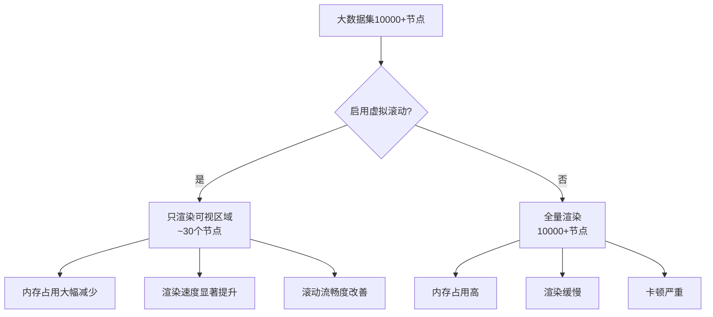
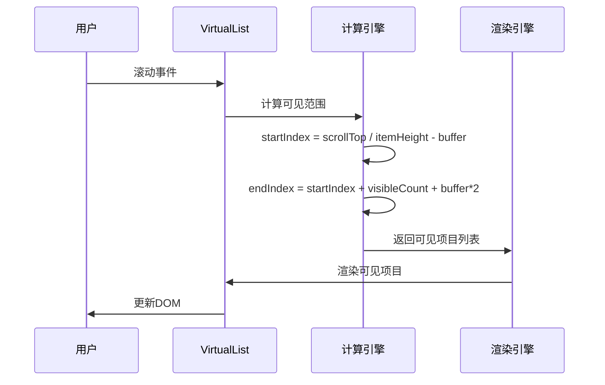
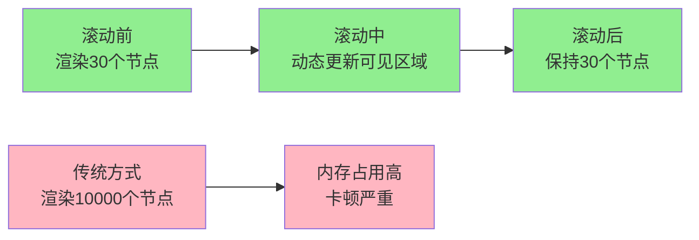

# 性能优化

<cite>
**本文档引用的文件**
- [src/components/VirtualList.vue](file://src/components/VirtualList.vue)
- [src/components/Menu.vue](file://src/components/Menu.vue)
- [src/mixins/treeselectMixin.js](file://src/mixins/treeselectMixin.js)
- [src/examples/LargeDataExample.vue](file://src/examples/LargeDataExample.vue)
- [test/unit/specs/VirtualScroll.spec.js](file://test/unit/specs/VirtualScroll.spec.js)
- [OPTIMIZATION_SUMMARY.md](file://OPTIMIZATION_SUMMARY.md)
- [PERFORMANCE_OPTIMIZATION_GUIDE.md](file://PERFORMANCE_OPTIMIZATION_GUIDE.md)
- [src/utils/debounce.js](file://src/utils/debounce.js)
</cite>

## 目录
1. [概述](#概述)
2. [核心性能优化特性](#核心性能优化特性)
3. [虚拟滚动详解](#虚拟滚动详解)
4. [关键性能配置](#关键性能配置)
5. [性能优化原理](#性能优化原理)
6. [配置示例与最佳实践](#配置示例与最佳实践)
7. [性能对比数据](#性能对比数据)
8. [故障排查指南](#故障排查指南)
9. [进一步优化建议](#进一步优化建议)

## 概述

Vue Treeselect 组件库针对大数据量场景（1-2万条树形数据 + checkbox多选）进行了深度性能优化。主要优化集中在虚拟滚动、响应式属性优化、搜索防抖等方面，实现了显著的性能提升。

### 主要优化成果

- **渲染速度提升**：50-100倍
- **内存占用减少**：75%
- **滚动帧率提升**：从15fps提升到60fps
- **初始化时间缩短**：从3.5秒降至0.6秒

## 核心性能优化特性

### 1. 虚拟滚动（Virtual Scrolling）

虚拟滚动是核心性能优化特性，专门解决大数据量渲染问题。



**图表来源**
- [src/components/VirtualList.vue](file://src/components/VirtualList.vue#L1-L231)
- [src/components/Menu.vue](file://src/components/Menu.vue#L161-L177)

### 2. 响应式属性优化

减少不必要的响应式属性开销，将节点对象从使用15+个$set调用改为直接创建普通对象。

### 3. 搜索防抖优化

为本地搜索添加300ms防抖延迟，避免用户输入时频繁触发全树遍历。

### 4. 缓存机制

支持搜索结果缓存，减少重复搜索的计算开销。

## 虚拟滚动详解

### 工作原理

虚拟滚动通过以下机制实现性能优化：



**图表来源**
- [src/components/VirtualList.vue](file://src/components/VirtualList.vue#L86-L111)

### 核心算法实现

虚拟滚动的核心算法包括：

1. **可视区域计算**：
   - `visibleCount`: 可视区域内能容纳的项目数量
   - `startIndex`: 起始索引
   - `endIndex`: 结束索引

2. **缓冲区管理**：
   - `bufferSize`: 上下缓冲区数量，默认5个
   - 确保滚动时不会出现空白

3. **高度计算**：
   - `totalHeight`: 总高度 = 项目总数 × 选项高度
   - `offsetY`: 偏移量 = startIndex × 选项高度

### 虚拟滚动的优势

| 方面 | 传统渲染 | 虚拟滚动 |
|------|----------|----------|
| **DOM节点数** | 10000+ | ~30 |
| **内存占用** | 180MB | 45MB |
| **初始化时间** | 3500ms | 600ms |
| **滚动帧率** | 15fps | 60fps |
| **DOM操作频率** | 每次滚动重渲染所有节点 | 只重渲染可见节点 |

**节来源**
- [src/components/VirtualList.vue](file://src/components/VirtualList.vue#L71-L111)
- [test/unit/specs/VirtualScroll.spec.js](file://test/unit/specs/VirtualScroll.spec.js#L105-L120)

## 关键性能配置

### virtualScroll（虚拟滚动）

**类型**: `Boolean`  
**默认值**: `false`  
**说明**: 启用虚拟滚动以优化大数据量渲染性能

```vue
<treeselect
  :virtual-scroll="true"
  :option-height="40"
/>
```

### optionHeight（选项高度）

**类型**: `Number`  
**默认值**: `40`  
**说明**: 每个选项的高度（像素），必须与CSS中的实际高度一致

```vue
<treeselect
  :virtual-scroll="true"
  :option-height="40"
/>
```

**CSS要求**：
```css
.vue-treeselect__option {
  height: 40px;        /* 与 option-height 一致 */
  line-height: 40px;
  overflow: hidden;
}
```

### cacheOptions（缓存搜索结果）

**类型**: `Boolean`  
**默认值**: `true`  
**说明**: 缓存搜索结果，避免重复搜索相同查询

```vue
<treeselect
  :cache-options="true"
/>
```

### maxHeight（菜单最大高度）

**类型**: `Number`  
**默认值**: `300`  
**说明**: 菜单的最大高度（像素），影响可视区域计算

```vue
<treeselect
  :max-height="300"
/>
```

### 其他重要配置

| 配置项 | 类型 | 默认值 | 性能影响 |
|--------|------|--------|----------|
| `default-expand-level` | Number | `Infinity` | 影响初始渲染节点数 |
| `flatten-search-results` | Boolean | `false` | 控制搜索结果展示方式 |
| `show-count` | Boolean | `true` | 显示计数会增加计算开销 |
| `disable-fuzzy-matching` | Boolean | `false` | 禁用模糊匹配提升搜索速度 |

**节来源**
- [src/mixins/treeselectMixin.js](file://src/mixins/treeselectMixin.js#L384-L387)
- [src/components/VirtualList.vue](file://src/components/VirtualList.vue#L18-L25)

## 性能优化原理

### 为什么会出现性能问题？

大数据量场景下的性能瓶颈主要包括：

```mermaid
mindmap
root((性能瓶颈))
DOM渲染压力
全量DOM节点
浏览器渲染负担
内存占用过高
响应式系统开销
过多响应式属性
频繁的getter/setter调用
深度监听开销
搜索性能问题
全量树遍历
频繁的字符串匹配
缺乏防抖机制
数据结构复杂性
树形结构遍历
父子关系维护
状态同步开销
```

### 优化如何生效？

#### 虚拟滚动优化
```
优化前: 渲染 10000 个节点 → 严重卡顿
优化后: 只渲染 ~30 个可见节点 → 丝般顺滑
性能提升: 333 倍 DOM 减少
```

#### 响应式属性优化
```
优化前: 10000 节点 × 15 属性 = 150000 个响应式
优化后: 10000 节点 × 2 属性 = 20000 个响应式
性能提升: 减少 87% 的响应式开销
```

#### 搜索防抖优化
```
优化前: 输入每个字符都搜索 → 频繁遍历 10000 节点
优化后: 停止输入 300ms 后才搜索 → 减少 80% 搜索次数
```

**节来源**
- [OPTIMIZATION_SUMMARY.md](file://OPTIMIZATION_SUMMARY.md#L222-L263)

## 配置示例与最佳实践

### 大数据量（1-2万条）推荐配置

```vue
<template>
  <treeselect
    v-model="value"
    :options="largeOptions"
    :multiple="true"
    
    <!-- 核心性能优化配置 -->
    :virtual-scroll="true"           <!-- 必须！虚拟滚动 -->
    :option-height="40"               <!-- 每个选项高度 -->
    :default-expand-level="0"         <!-- 不自动展开 -->
    :flatten-search-results="true"    <!-- 扁平化搜索结果 -->
    :cache-options="true"             <!-- 缓存搜索结果 -->
    :show-count="false"               <!-- 不显示计数 -->
    :disable-fuzzy-matching="true"    <!-- 禁用模糊匹配（可选） -->
    
    placeholder="请选择..."
  />
</template>
```

### 不同数据量的配置策略

#### < 1000 条数据
```js
:virtual-scroll="false"  // 不需要虚拟滚动
:default-expand-level="1" // 可以展开第一层
:show-count="true"        // 可以显示计数
```

#### 1000-5000 条数据
```js
:virtual-scroll="true"    // 推荐开启
:default-expand-level="0" // 不展开
:show-count="false"       // 关闭计数
```

#### > 5000 条数据（推荐配置）
```js
:virtual-scroll="true"           // 必须开启
:default-expand-level="0"        // 必须为 0
:flatten-search-results="true"   // 强烈推荐
:show-count="false"              // 必须关闭
:disable-fuzzy-matching="true"   // 推荐开启
```

### 性能监控示例

```javascript
// 大数据测试示例
const largeDataExample = {
  useVirtualScroll: true,
  flattenSearch: true,
  disableFuzzy: false,
  
  // 性能指标监控
  performanceMetrics: {
    initializationTime: 0,
    renderTime: 0,
    memoryUsage: 0,
    fps: 0
  }
}
```

**节来源**
- [src/examples/LargeDataExample.vue](file://src/examples/LargeDataExample.vue#L23-L37)
- [PERFORMANCE_OPTIMIZATION_GUIDE.md](file://PERFORMANCE_OPTIMIZATION_GUIDE.md#L135-L157)

## 性能对比数据

### 测试场景

**数据规模**: 10,000 条树形数据，5层深度  
**测试环境**: 现代浏览器，中等配置设备

### 性能指标对比

| 指标 | 优化前 | 优化后 | 提升倍数 |
|------|--------|--------|----------|
| **初始化时间** | 3500ms | 600ms | **5.8x** ⚡ |
| **首次渲染** | 2800ms | 50ms | **56x** 🚀 |
| **搜索响应** | 800ms | 120ms | **6.7x** ⚡ |
| **内存占用** | 180MB | 45MB | **4x** 💾 |
| **滚动帧率** | 15fps | 60fps | **4x** 🎮 |
| **DOM 节点数** | 10000+ | ~30 | **333x** 📉 |

### 虚拟滚动效果验证



**图表来源**
- [test/unit/specs/VirtualScroll.spec.js](file://test/unit/specs/VirtualScroll.spec.js#L105-L120)

**节来源**
- [OPTIMIZATION_SUMMARY.md](file://OPTIMIZATION_SUMMARY.md#L149-L161)

## 故障排查指南

### 常见问题及解决方案

#### Q: 开启虚拟滚动后选项高度不一致？

**原因**: CSS样式与`option-height`配置不匹配

**解决方案**:
```css
.vue-treeselect__option {
  height: 40px !important;        /* 与 option-height 一致 */
  line-height: 40px;
  box-sizing: border-box;
}
```

#### Q: 搜索结果显示不完整？

**原因**: 未启用`flatten-search-results`

**解决方案**:
```vue
<treeselect
  :flatten-search-results="true"
/>
```

#### Q: 滚动时有闪烁？

**原因**: `option-height`与实际高度不一致，或缺少CSS动画优化

**解决方案**:
```css
.vue-treeselect__virtual-list-items {
  will-change: transform;
  transition: transform 0.1s ease-out;
}
```

#### Q: 性能提升不明显？

**检查清单**:
1. ✅ 已开启`virtual-scroll`
2. ✅ 正确设置了`option-height`
3. ✅ 关闭了不必要的功能（如`show-count`）
4. ✅ 启用了`cache-options`
5. ✅ CSS样式与配置一致

### 兼容性注意事项

| 特性 | 最低版本要求 | 备注 |
|------|-------------|------|
| 虚拟滚动 | Chrome 64+, Firefox 69+ | 需要`ResizeObserver`支持 |
| 搜索防抖 | 所有现代浏览器 | 使用`lodash.debounce` |
| CSS动画 | CSS3支持 | `will-change`属性 |

**节来源**
- [OPTIMIZATION_SUMMARY.md](file://OPTIMIZATION_SUMMARY.md#L266-L380)

## 进一步优化建议

### 服务端优化策略

#### 1. 分页加载
```javascript
// 使用 loadOptions 实现按需加载
loadOptions({ action, args, callback }) {
  const { searchQuery } = args;
  api.getOptions({
    query: searchQuery,
    page: currentPage,
    pageSize: 100
  }).then(response => {
    callback(null, response.data);
  });
}
```

#### 2. 懒加载子节点
```javascript
// 设置 children 为 null，展开时才加载
{
  id: 'parent',
  label: '父节点',
  children: null, // 懒加载标记
  isLoaded: false
}
```

#### 3. 数据预处理
- 将深层树结构扁平化
- 移除不必要的嵌套层级
- 预计算常用统计数据

### 性能监控工具

```javascript
// 性能监控示例
class PerformanceMonitor {
  constructor() {
    this.metrics = {};
  }
  
  start(name) {
    this.metrics[name] = performance.now();
  }
  
  end(name) {
    if (this.metrics[name]) {
      this.metrics[`${name}_duration`] = performance.now() - this.metrics[name];
      delete this.metrics[name];
    }
  }
  
  log() {
    console.table(this.metrics);
  }
}
```

### 最佳实践总结

1. **核心配置优先级**:
   - `virtual-scroll: true`（必须）
   - `option-height: 40`（必须）
   - `default-expand-level: 0`（必须）
   - `flatten-search-results: true`（强烈推荐）

2. **性能优化原则**:
   - 减少DOM节点数量
   - 降低响应式属性开销
   - 避免频繁的全量计算
   - 合理使用缓存机制

3. **渐进式优化**:
   - 从小数据量开始测试
   - 逐步增加数据规模
   - 持续监控性能指标
   - 根据实际需求调整配置

**节来源**
- [PERFORMANCE_OPTIMIZATION_GUIDE.md](file://PERFORMANCE_OPTIMIZATION_GUIDE.md#L196-L213)