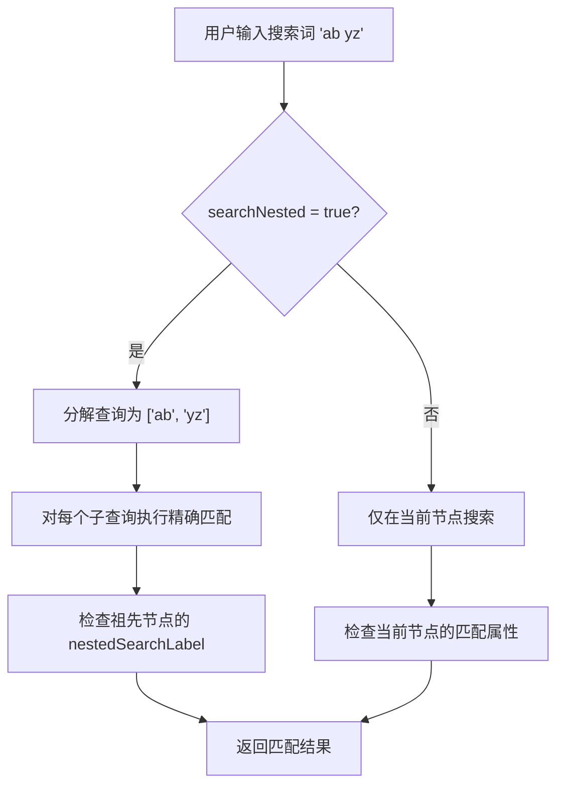
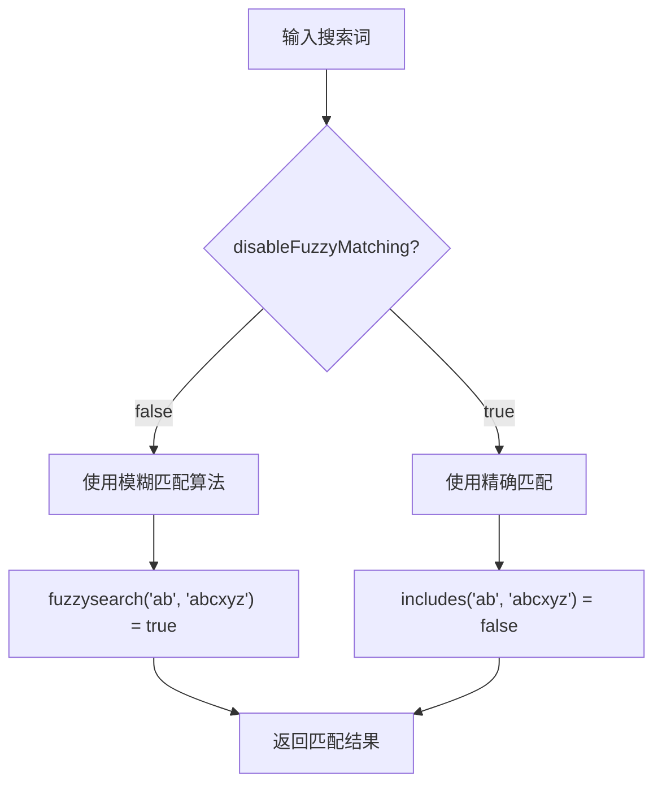
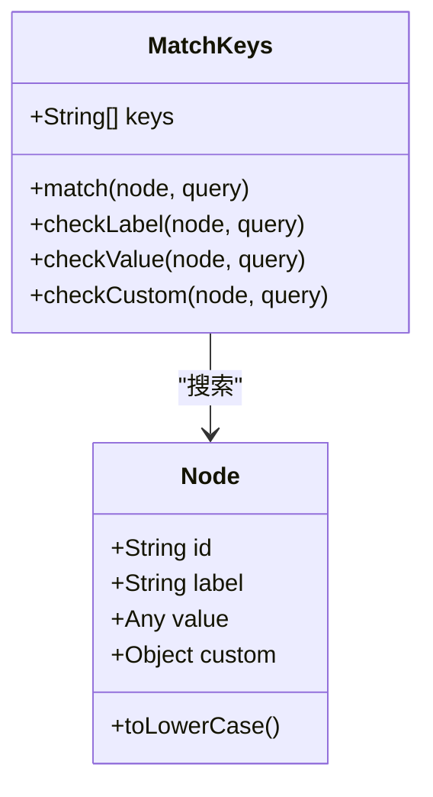
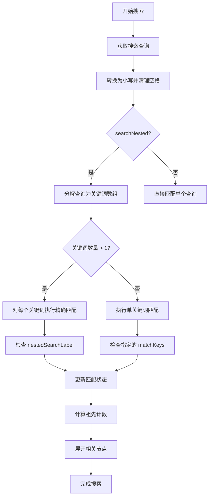
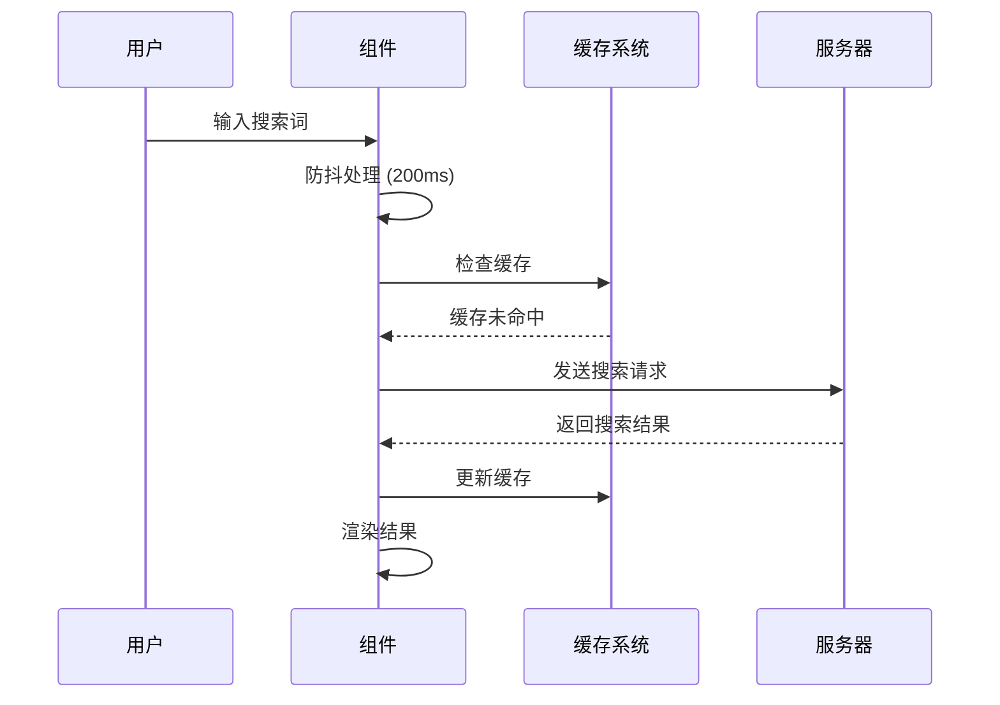
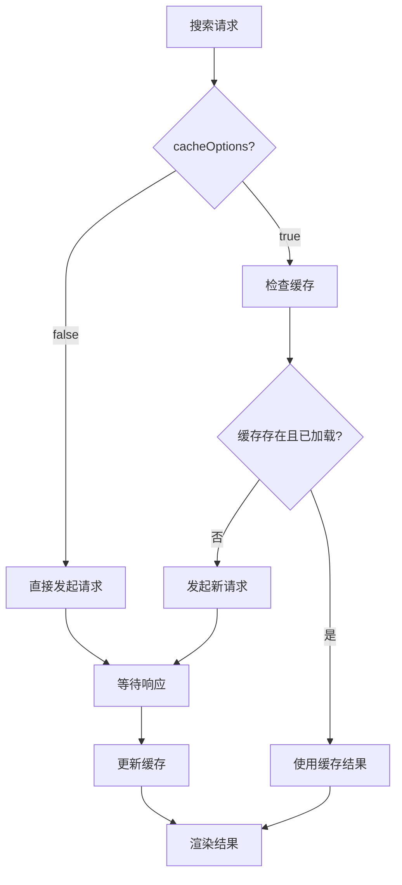

# 搜索功能

<cite>
**本文档引用的文件**
- [src/mixins/treeselectMixin.js](file://src/mixins/treeselectMixin.js)
- [src/components/Treeselect.vue](file://src/components/Treeselect.vue)
- [src/components/Input.vue](file://src/components/Input.vue)
- [src/utils/debounce.js](file://src/utils/debounce.js)
- [src/constants.js](file://src/constants.js)
- [test/unit/specs/Searching.spec.js](file://test/unit/specs/Searching.spec.js)
- [docs/components/DocProps.vue](file://docs/components/DocProps.vue)
- [docs/components/AsyncSearching.vue](file://docs/components/AsyncSearching.vue)
- [docs/components/DelayedLoading.vue](file://docs/components/DelayedLoading.vue)
</cite>

## 目录
1. [概述](#概述)
2. [核心搜索Props](#核心搜索props)
3. [搜索算法与匹配机制](#搜索算法与匹配机制)
4. [同步搜索模式](#同步搜索模式)
5. [异步搜索模式](#异步搜索模式)
6. [搜索结果缓存](#搜索结果缓存)
7. [性能优化策略](#性能优化策略)
8. [代码示例](#代码示例)
9. [最佳实践](#最佳实践)

## 概述

Vue Treeselect 提供了强大的搜索功能，支持同步和异步两种搜索模式。搜索功能的核心特性包括：
- **灵活的匹配机制**：支持标签、值等多种属性的搜索
- **模糊匹配**：可选的模糊搜索算法
- **嵌套搜索**：支持在祖先节点中搜索
- **异步加载**：动态加载搜索结果
- **结果缓存**：避免重复请求
- **性能优化**：防抖处理和智能渲染

## 核心搜索Props

### searchNested（嵌套搜索）

**类型**: `Boolean`  
**默认值**: `false`  
**作用**: 决定是否在祖先节点中进行搜索

当设置为 `true` 时，搜索查询会同时在当前节点和其所有祖先节点中进行匹配。这对于需要跨层级查找的场景非常有用。



**图表来源**
- [src/mixins/treeselectMixin.js](file://src/mixins/treeselectMixin.js#L1250-L1254)

### disableFuzzyMatching（禁用模糊匹配）

**类型**: `Boolean`  
**默认值**: `false`  
**作用**: 控制是否启用模糊匹配功能

当设置为 `true` 时，搜索将采用精确匹配模式，只有完全符合搜索词的内容才会被匹配到。



**图表来源**
- [src/mixins/treeselectMixin.js](file://src/mixins/treeselectMixin.js#L52-L56)

### matchKeys（匹配字段）

**类型**: `Array<String>`  
**默认值**: `['label']`  
**作用**: 指定搜索时检查的节点属性

支持多个属性组合搜索，优先级按数组顺序排列。



**图表来源**
- [src/mixins/treeselectMixin.js](file://src/mixins/treeselectMixin.js#L376-L379)

### async（异步搜索模式）

**类型**: `Boolean`  
**默认值**: `false`  
**作用**: 启用异步搜索模式

当设置为 `true` 时，搜索结果需要通过 `loadOptions` 回调函数动态加载。

### loadOptions（动态加载函数）

**类型**: `Function`  
**参数**: `{ action, searchQuery?, parentNode?, callback }`  
**作用**: 动态加载选项的回调函数

该函数接收以下参数：
- `action`: 操作类型（`LOAD_ROOT_OPTIONS`, `LOAD_CHILDREN_OPTIONS`, `ASYNC_SEARCH`）
- `searchQuery`: 搜索查询字符串（异步搜索时可用）
- `parentNode`: 父节点对象（加载子选项时可用）
- `callback`: 回调函数，用于返回结果

**节来源**
- [src/mixins/treeselectMixin.js](file://src/mixins/treeselectMixin.js#L369-L371)
- [src/mixins/treeselectMixin.js](file://src/mixins/treeselectMixin.js#L1732-L1766)

## 搜索算法与匹配机制

### 匹配算法流程



**图表来源**
- [src/mixins/treeselectMixin.js](file://src/mixins/treeselectMixin.js#L1247-L1278)

### 模糊匹配与精确匹配

系统使用 `match` 函数来决定使用哪种匹配方式：

```javascript
function match(enableFuzzyMatch, needle, haystack) {
  return enableFuzzyMatch
    ? fuzzysearch(needle, haystack)
    : includes(haystack, needle)
}
```

**节来源**
- [src/mixins/treeselectMixin.js](file://src/mixins/treeselectMixin.js#L52-L56)

## 同步搜索模式

同步搜索适用于本地数据集较小的情况，所有搜索都在客户端完成。

### 实现原理

1. **数据预处理**: 将所有节点转换为小写形式以便快速匹配
2. **深度优先遍历**: 遍历整个树结构进行匹配
3. **状态管理**: 维护搜索状态和计数器
4. **结果过滤**: 根据匹配结果过滤显示的节点

### 性能特点

- **即时响应**: 无需网络请求
- **内存占用**: 需要完整加载所有数据
- **适用场景**: 数据量小于1000项

**节来源**
- [src/mixins/treeselectMixin.js](file://src/mixins/treeselectMixin.js#L1217-L1281)

## 异步搜索模式

异步搜索适用于大数据集或需要从服务器获取结果的场景。

### 工作流程



**图表来源**
- [src/mixins/treeselectMixin.js](file://src/mixins/treeselectMixin.js#L1283-L1320)

### 异步搜索状态管理

系统维护每个搜索查询的状态：

```javascript
const createAsyncOptionsStates = () => ({
  isLoaded: false,
  isLoading: false,
  loadingError: '',
})
```

**节来源**
- [src/mixins/treeselectMixin.js](file://src/mixins/treeselectMixin.js#L37-L43)

## 搜索结果缓存

### cacheOptions（缓存选项）

**类型**: `Boolean`  
**默认值**: `true`  
**作用**: 控制是否缓存搜索结果

当设置为 `true` 时，相同的搜索查询不会重复发起请求，而是使用之前的结果。

### 缓存机制



**图表来源**
- [src/mixins/treeselectMixin.js](file://src/mixins/treeselectMixin.js#L1291-L1293)

**节来源**
- [src/mixins/treeselectMixin.js](file://src/mixins/treeselectMixin.js#L1283-L1320)

## 性能优化策略

### 防抖处理

输入防抖确保用户停止输入后才触发搜索，减少不必要的计算。

```javascript
// 防抖延迟时间
export const INPUT_DEBOUNCE_DELAY = process.env.NODE_ENV === 'testing'
  ? 10
  : 200
```

### 搜索结果计数

系统维护详细的搜索结果统计信息：

```javascript
// 计数类型
const ALL_CHILDREN = 'ALL_CHILDREN'
const ALL_DESCENDANTS = 'ALL_DESCENDANTS'
const LEAF_CHILDREN = 'LEAF_CHILDREN'
const LEAF_DESCENDANTS = 'LEAF_DESCENDANTS'
```

这些计数帮助快速确定节点的显示状态，而不需要重新计算。

### 虚拟滚动支持

对于大量搜索结果，系统支持虚拟滚动以提高渲染性能。

**节来源**
- [src/constants.js](file://src/constants.js#L46-L51)
- [src/mixins/treeselectMixin.js](file://src/mixins/treeselectMixin.js#L1260-L1269)

## 代码示例

### 基础同步搜索配置

```vue
<template>
  <treeselect
    :options="options"
    :searchable="true"
    :match-keys="['label', 'value']"
    :disable-fuzzy-matching="false"
  />
</template>
```

### 异步搜索实现

```vue
<template>
  <treeselect
    :async="true"
    :load-options="loadOptions"
    :cache-options="true"
    :default-options="true"
  />
</template>

<script>
export default {
  methods: {
    loadOptions({ action, searchQuery, callback }) {
      if (action === 'ASYNC_SEARCH') {
        // 模拟异步请求
        fetch(`/api/search?q=${searchQuery}`)
          .then(response => response.json())
          .then(data => callback(null, data))
          .catch(error => callback(error))
      }
    }
  }
}
</script>
```

### 嵌套搜索示例

```vue
<template>
  <treeselect
    :options="treeOptions"
    :search-nested="true"
    :match-keys="['label', 'customField']"
  />
</template>
```

**节来源**
- [docs/components/AsyncSearching.vue](file://docs/components/AsyncSearching.vue#L1-L32)
- [docs/components/DelayedLoading.vue](file://docs/components/DelayedLoading.vue#L1-L77)

## 最佳实践

### 选择合适的搜索模式

1. **小数据集 (< 1000 项)**: 使用同步搜索，提供即时响应
2. **大数据集**: 使用异步搜索，配合分页或无限滚动
3. **复杂查询**: 启用嵌套搜索，支持跨层级查找

### 性能优化建议

1. **合理设置防抖时间**: 一般 200-300ms 为宜
2. **启用结果缓存**: 对于重复查询场景
3. **使用虚拟滚动**: 处理大量搜索结果
4. **优化匹配键**: 只包含必要的搜索字段

### 错误处理

```javascript
loadOptions({ action, searchQuery, callback }) {
  // 实现错误重试机制
  const maxRetries = 3;
  let retries = 0;
  
  const fetchData = () => {
    fetch(`/api/search?q=${searchQuery}`)
      .then(response => {
        if (!response.ok) {
          throw new Error('Network response was not ok');
        }
        return response.json();
      })
      .then(data => callback(null, data))
      .catch(error => {
        if (retries < maxRetries) {
          retries++;
          setTimeout(fetchData, 1000 * retries);
        } else {
          callback(error);
        }
      });
  };
  
  fetchData();
}
```

### 搜索提示配置

```javascript
{
  searchPromptText: '请输入关键字搜索...',
  noResultsText: '没有找到匹配的结果',
  loadingText: '正在加载结果...'
}
```

通过合理配置这些搜索相关Props，可以构建出高效、用户友好的树形选择器组件，满足各种复杂的业务需求。