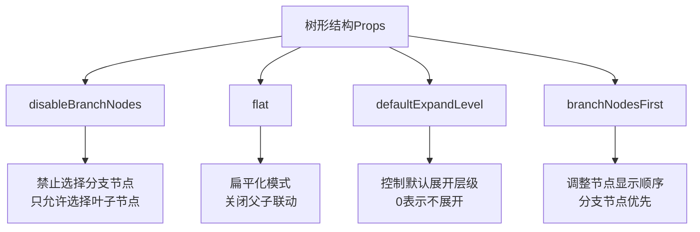
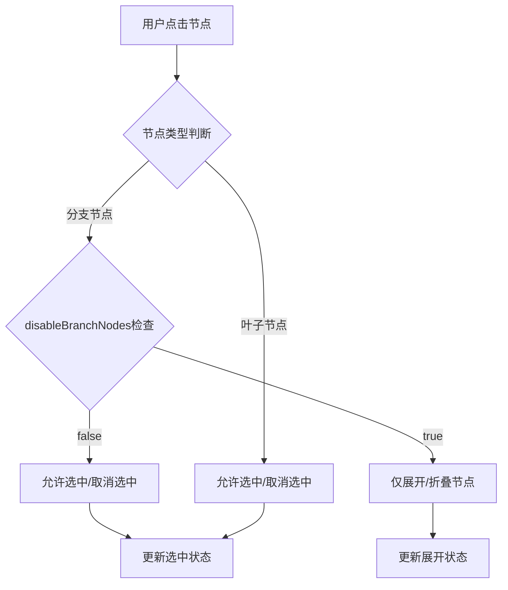
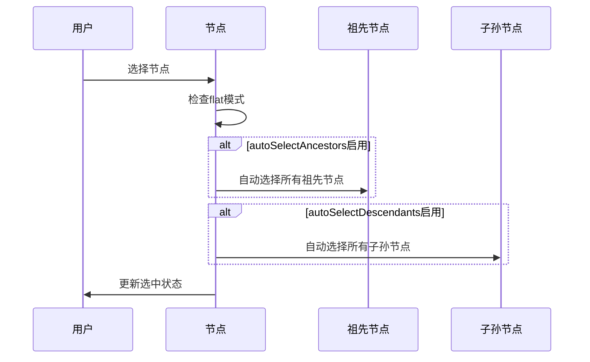
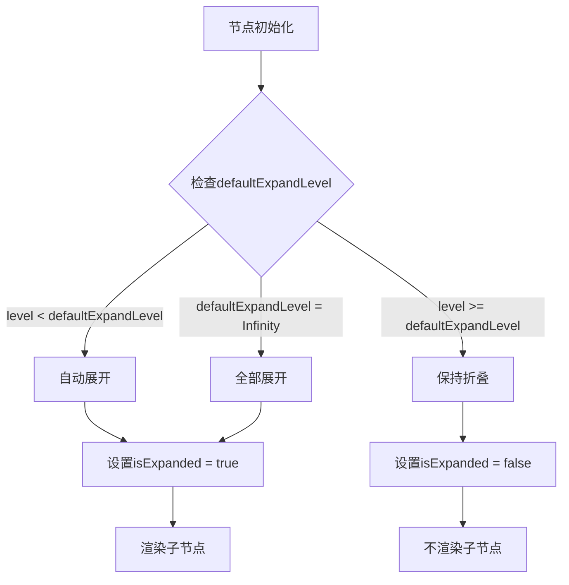
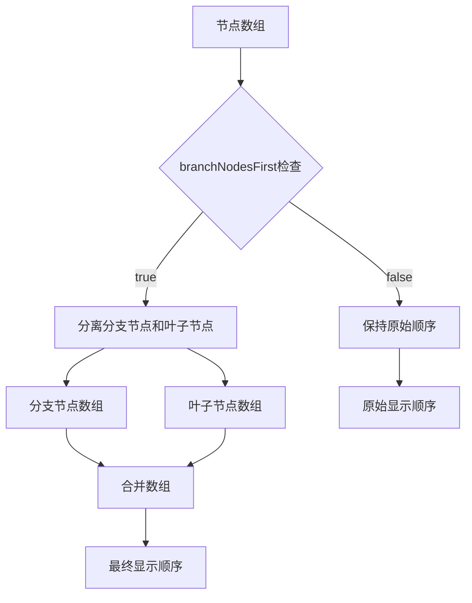
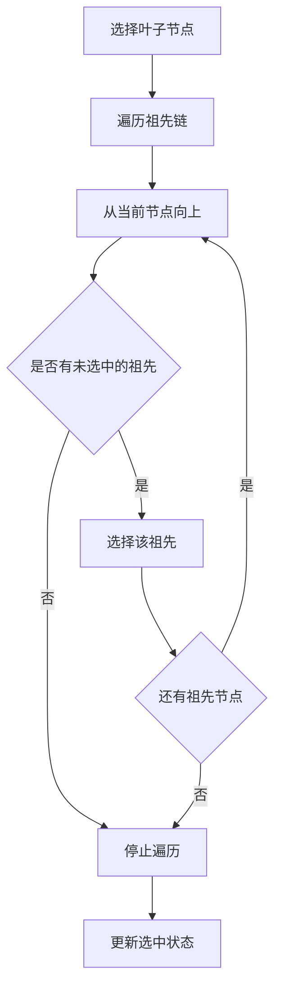
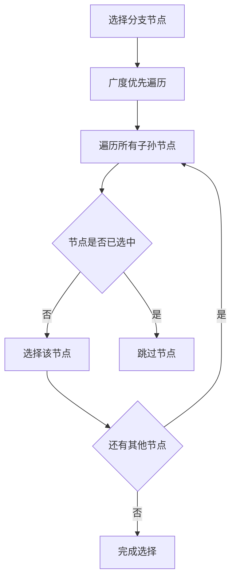
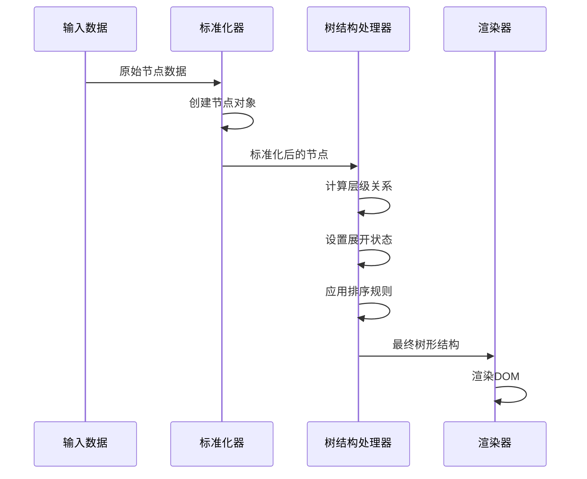
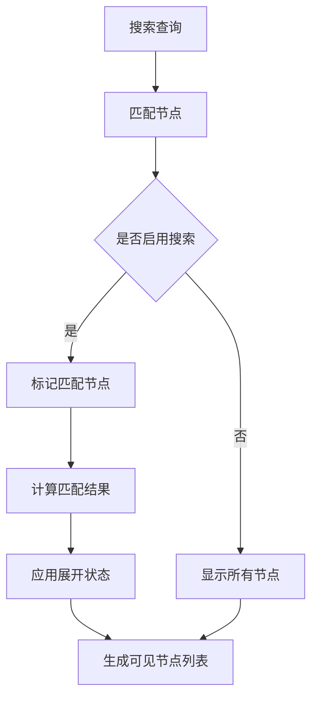

# 树形结构Props文档

<cite>
**本文档中引用的文件**
- [Treeselect.vue](file://src/components/Treeselect.vue)
- [treeselectMixin.js](file://src/mixins/treeselectMixin.js)
- [constants.js](file://src/constants.js)
- [Props.spec.js](file://test/unit/specs/Props.spec.js)
</cite>

## 目录
1. [简介](#简介)
2. [核心Props概览](#核心props概览)
3. [disableBranchNodes - 禁止选择分支节点](#disablebranchnodes---禁止选择分支节点)
4. [flat - 扁平化模式](#flat---扁平化模式)
5. [defaultExpandLevel - 默认展开层级](#defaultexpandlevel---默认展开层级)
6. [branchNodesFirst - 分支节点优先排序](#branchnodesfirst---分支节点优先排序)
7. [自动选择与反选机制](#自动选择与反选机制)
8. [树形结构处理流程](#树形结构处理流程)
9. [性能优化建议](#性能优化建议)
10. [最佳实践](#最佳实践)

## 简介

Vue Treeselect Next 是一个功能强大的多选树形选择器组件，支持复杂的树形数据结构展示和操作。本文档深入解析四个核心Props：`disableBranchNodes`、`flat`、`defaultExpandLevel` 和 `branchNodesFirst`，这些Props共同决定了树形结构的展示方式和交互逻辑。

## 核心Props概览

| Prop名称 | 类型 | 默认值 | 描述 |
|---------|------|--------|------|
| `disableBranchNodes` | Boolean | false | 是否禁止选择分支节点，只允许选择叶子节点 |
| `flat` | Boolean | false | 是否启用扁平化模式，关闭父子节点联动行为 |
| `defaultExpandLevel` | Number | 0 | 默认展开的层级数，Infinity表示全部展开 |
| `branchNodesFirst` | Boolean | false | 是否将分支节点优先显示在列表顶部 |



**图表来源**
- [treeselectMixin.js](file://src/mixins/treeselectMixin.js#L287-L317)

## disableBranchNodes - 禁止选择分支节点

### 功能描述

`disableBranchNodes` Prop用于限制用户只能选择叶子节点，而不能直接选择分支节点。这种设计在需要精确到具体选项的场景下非常有用。

### 实现机制

当设置 `disableBranchNodes: true` 时，组件会执行以下逻辑：

1. **UI层面**：分支节点不再显示复选框
2. **交互层面**：点击分支节点标签不会触发选中状态切换
3. **状态管理**：分支节点的状态完全由其子节点决定

### 配置示例

```javascript
// 基本配置
const basicConfig = {
  disableBranchNodes: true,
  multiple: true
}

// 结合其他Props的高级配置
const advancedConfig = {
  disableBranchNodes: true,
  branchNodesFirst: true,
  defaultExpandLevel: 2,
  searchable: true
}
```

### 影响范围



**图表来源**
- [treeselectMixin.js](file://src/mixins/treeselectMixin.js#L1841-L1843)
- [Props.spec.js](file://test/unit/specs/Props.spec.js#L1226-L1304)

### 测试验证

测试用例展示了 `disableBranchNodes` 的各种行为模式：

- 分支节点无复选框显示
- 叶子节点正常显示复选框
- 分支节点点击不影响选中状态
- 分支节点点击可切换展开/折叠状态

**章节来源**
- [treeselectMixin.js](file://src/mixins/treeselectMixin.js#L287-L290)
- [Props.spec.js](file://test/unit/specs/Props.spec.js#L1226-L1304)

## flat - 扁平化模式

### 功能描述

`flat` Prop启用扁平化模式，该模式下父子节点之间的联动关系被完全移除。每个节点都是独立的个体，选择或取消选择某个节点不会影响其关联的其他节点。

### 核心特性

1. **独立性**：每个节点的操作完全独立
2. **自动关联**：可配合 `autoSelectAncestors` 和 `autoSelectDescendants` 自动处理相关节点
3. **简化逻辑**：避免复杂的级联选择问题

### 自动关联机制



**图表来源**
- [treeselectMixin.js](file://src/mixins/treeselectMixin.js#L1845-L1858)

### 配置组合

```javascript
// 基础扁平化配置
const flatConfig = {
  flat: true,
  multiple: true
}

// 自动关联配置
const autoSelectConfig = {
  flat: true,
  autoSelectAncestors: true,
  autoSelectDescendants: true,
  multiple: true
}

// 禁用分支节点的扁平化
const disableBranchFlatConfig = {
  flat: true,
  disableBranchNodes: true,
  multiple: true
}
```

### 对比传统模式

| 特性 | 传统模式 | 扁平化模式 |
|------|----------|------------|
| 父子联动 | 自动级联 | 完全独立 |
| 选中状态 | 层级依赖 | 独立计算 |
| 性能开销 | 中等 | 较低 |
| 使用场景 | 复杂层级关系 | 简单独立选择 |

**章节来源**
- [treeselectMixin.js](file://src/mixins/treeselectMixin.js#L314-L317)
- [treeselectMixin.js](file://src/mixins/treeselectMixin.js#L1845-L1858)

## defaultExpandLevel - 默认展开层级

### 功能描述

`defaultExpandLevel` Prop控制树形结构的默认展开程度，允许开发者预设哪些层级应该在初始状态下可见。

### 展开策略



**图表来源**
- [treeselectMixin.js](file://src/mixins/treeselectMixin.js#L1596-L1598)

### 数值含义

| 值 | 行为 | 适用场景 |
|-----|------|----------|
| 0 | 不展开任何节点 | 简洁界面，按需展开 |
| 1 | 展开根节点 | 显示主要分类 |
| 2 | 展开两层 | 详细分类展示 |
| Infinity | 全部展开 | 快速访问所有选项 |

### 示例配置

```javascript
// 基础展开配置
const basicExpand = {
  defaultExpandLevel: 1,
  options: [
    {
      id: 'category1',
      label: '分类1',
      children: [
        { id: 'item1', label: '项目1' },
        { id: 'item2', label: '项目2' }
      ]
    }
  ]
}

// 完全展开配置
const fullExpand = {
  defaultExpandLevel: Infinity,
  options: nestedStructure
}

// 不展开配置
const noExpand = {
  defaultExpandLevel: 0,
  options: largeHierarchy
}
```

### 与节点属性的交互

组件还支持节点级别的展开控制：

```javascript
const nodeSpecificExpand = {
  options: [
    {
      id: 'root',
      label: '根节点',
      isDefaultExpanded: true,  // 节点级别强制展开
      children: [
        {
          id: 'child',
          label: '子节点',
          isDefaultExpanded: false  // 节点级别强制折叠
        }
      ]
    }
  ],
  defaultExpandLevel: 1
}
```

**章节来源**
- [treeselectMixin.js](file://src/mixins/treeselectMixin.js#L244-L247)
- [Props.spec.js](file://test/unit/specs/Props.spec.js#L1021-L1096)

## branchNodesFirst - 分支节点优先排序

### 功能描述

`branchNodesFirst` Prop控制树形结构中节点的显示顺序，当设置为 `true` 时，所有分支节点会优先显示在列表顶部，然后是叶子节点。

### 排序算法



**图表来源**
- [treeselectMixin.js](file://src/mixins/treeselectMixin.js#L1663-L1667)

### 实现细节

排序过程在节点标准化阶段完成：

```javascript
// 排序逻辑片段
if (this.branchNodesFirst) {
  const branchNodes = normalizedOptions.filter(option => option.isBranch)
  const leafNodes = normalizedOptions.filter(option => option.isLeaf)
  normalizedOptions = branchNodes.concat(leafNodes)
}
```

### 显示效果对比

| 排序方式 | 显示顺序 | 适用场景 |
|----------|----------|----------|
| `branchNodesFirst: false` | 原始层次顺序 | 按自然层级浏览 |
| `branchNodesFirst: true` | 分支节点 + 叶子节点 | 快速定位分类 |

### 索引计算

组件使用索引系统来维护节点的层次位置：

```javascript
// 索引计算示例
// 树结构: [A, B, C]
// A: [0], B: [1], C: [2]
// A的子节点: A.A: [0, 0], A.B: [0, 1]
// B的子节点: B.A: [1, 0], B.B: [1, 1]
```

**章节来源**
- [treeselectMixin.js](file://src/mixins/treeselectMixin.js#L184-L186)
- [Props.spec.js](file://test/unit/specs/Props.spec.js#L734-L771)

## 自动选择与反选机制

### autoSelectAncestors - 自动选择祖先节点

当启用此功能时，选择某个节点会自动选择其所有祖先节点。



**图表来源**
- [treeselectMixin.js](file://src/mixins/treeselectMixin.js#L1848-L1852)

### autoSelectDescendants - 自动选择子孙节点

启用后，选择某个节点会自动选择其所有子孙节点。



**图表来源**
- [treeselectMixin.js](file://src/mixins/treeselectMixin.js#L1853-L1856)

### autoDeselectAncestors - 自动反选祖先节点

当启用此功能时，取消选择某个节点会自动取消选择其所有祖先节点。

### autoDeselectDescendants - 自动反选子孙节点

启用后，取消选择某个节点会自动取消选择其所有子孙节点。

### 组合使用示例

```javascript
const autoSelectConfig = {
  flat: true,
  autoSelectAncestors: true,
  autoSelectDescendants: true,
  autoDeselectAncestors: true,
  autoDeselectDescendants: true,
  multiple: true
}
```

**章节来源**
- [treeselectMixin.js](file://src/mixins/treeselectMixin.js#L134-L161)

## 树形结构处理流程

### 节点标准化流程



**图表来源**
- [treeselectMixin.js](file://src/mixins/treeselectMixin.js#L1588-L1670)

### 可见节点计算

组件通过 `visibleOptionIds` 计算当前可见的节点列表：

```javascript
// 可见节点过滤逻辑
this.traverseAllNodesByIndex(node => {
  if (!this.localSearch.active || this.shouldOptionBeIncludedInSearchResult(node)) {
    visibleOptionIds.push(node.id)
  }
  // 跳过未展开的分支节点的子节点
  if (node.isBranch && !this.shouldExpand(node)) {
    return false
  }
})
```

### 搜索结果处理



**图表来源**
- [treeselectMixin.js](file://src/mixins/treeselectMixin.js#L783-L797)

**章节来源**
- [treeselectMixin.js](file://src/mixins/treeselectMixin.js#L783-L797)
- [treeselectMixin.js](file://src/mixins/treeselectMixin.js#L1227-L1258)

## 性能优化建议

### 大数据集处理

对于包含大量节点的树形结构，建议采用以下优化策略：

1. **启用虚拟滚动**
```javascript
{
  virtualScroll: true,
  optionHeight: 40, // 根据实际高度调整
  maxHeight: 300
}
```

2. **合理设置默认展开层级**
```javascript
{
  defaultExpandLevel: 2, // 避免一次性加载过多节点
  lazyLoad: true // 按需加载子节点
}
```

3. **使用扁平化模式**
```javascript
{
  flat: true, // 减少层级计算复杂度
  disableBranchNodes: true // 限制选择范围
}
```

### 内存优化

```javascript
// 避免不必要的深度复制
const optimizedConfig = {
  cacheOptions: true, // 缓存搜索结果
  debounceTime: 300,  // 防抖处理搜索输入
  maxCacheSize: 100   // 限制缓存大小
}
```

### 渲染优化

```javascript
// 使用shouldExpand自定义展开逻辑
methods: {
  shouldExpand(node) {
    // 只展开必要的节点
    return node.level <= this.maxVisibleLevel;
  }
}
```

## 最佳实践

### 场景化配置

#### 产品分类选择
```javascript
const categorySelection = {
  disableBranchNodes: true,
  branchNodesFirst: true,
  defaultExpandLevel: 1,
  searchable: true
}
```

#### 权限分配
```javascript
const permissionAssignment = {
  flat: true,
  autoSelectAncestors: true,
  autoDeselectAncestors: true,
  multiple: true
}
```

#### 地域层级选择
```javascript
const regionSelection = {
  defaultExpandLevel: 2,
  branchNodesFirst: false,
  searchable: true,
  clearable: true
}
```

### 错误处理

```javascript
// 验证配置有效性
methods: {
  validateTreeConfig(config) {
    const errors = [];
    
    if (config.flat && config.disableBranchNodes) {
      errors.push('flat模式下disableBranchNodes无效');
    }
    
    if (config.defaultExpandLevel < 0) {
      errors.push('defaultExpandLevel不能为负数');
    }
    
    return errors;
  }
}
```

### 用户体验优化

```javascript
// 提供清晰的视觉反馈
const userExperienceConfig = {
  showCount: true,
  showCountOf: 'ALL_CHILDREN',
  noResultsText: '没有找到匹配的选项',
  loadingText: '正在加载...'
}
```

通过合理配置这些Props，可以构建出既功能强大又用户体验良好的树形选择器组件，满足各种复杂的业务需求。