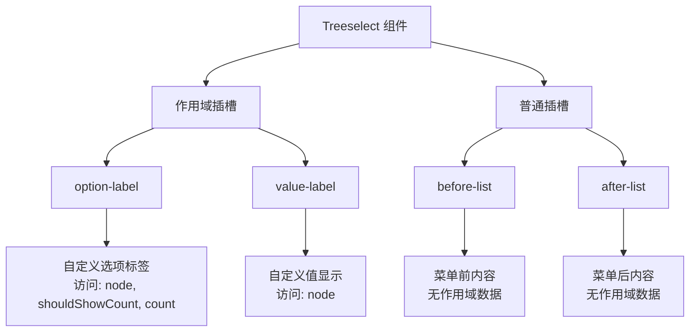

# Slots 插槽参考文档

<cite>
**本文档中引用的文件**
- [Treeselect.vue](file://src/components/Treeselect.vue)
- [treeselectMixin.js](file://src/mixins/treeselectMixin.js)
- [Option.vue](file://src/components/Option.vue)
- [SingleValue.vue](file://src/components/SingleValue.vue)
- [MultiValue.vue](file://src/components/MultiValue.vue)
- [Control.vue](file://src/components/Control.vue)
- [Placeholder.vue](file://src/components/Placeholder.vue)
- [Menu.vue](file://src/components/Menu.vue)
- [VirtualList.vue](file://src/components/VirtualList.vue)
- [Slots.spec.js](file://test/unit/specs/Slots.spec.js)
</cite>

## 目录
1. [概述](#概述)
2. [可用插槽类型](#可用插槽类型)
3. [作用域插槽详解](#作用域插槽详解)
4. [普通插槽详解](#普通插槽详解)
5. [插槽使用场景](#插槽使用场景)
6. [实际代码示例](#实际代码示例)
7. [最佳实践](#最佳实践)
8. [故障排除](#故障排除)

## 概述

Vue Treeselect 组件提供了丰富的插槽系统，允许开发者完全自定义组件的外观和行为。插槽分为两种类型：**普通插槽**和**作用域插槽**。普通插槽提供基本的内容替换功能，而作用域插槽则提供了访问组件内部数据的能力。

### 主要特性

- **高度可定制性**：支持自定义选项渲染、值显示、占位符等
- **数据访问**：作用域插槽可以访问节点数据和组件状态
- **灵活布局**：可以在列表前后添加自定义内容
- **性能优化**：支持虚拟滚动模式下的插槽渲染

## 可用插槽类型

Vue Treeselect 提供以下插槽：



**图表来源**
- [Option.vue](file://src/components/Option.vue#L180-L190)
- [SingleValue.vue](file://src/components/SingleValue.vue#L13-L16)
- [Menu.vue](file://src/components/Menu.vue#L92-L107)

### 插槽分类表

| 插槽名称 | 类型 | 是否作用域 | 访问数据 | 使用场景 |
|---------|------|-----------|----------|----------|
| `option-label` | 作用域插槽 | ✓ | node, shouldShowCount, count, labelClassName, countClassName | 自定义选项标签显示 |
| `value-label` | 作用域插槽 | ✓ | node | 自定义已选值显示 |
| `before-list` | 普通插槽 | ✗ | 无 | 在选项列表前添加内容 |
| `after-list` | 普通插槽 | ✗ | 无 | 在选项列表后添加内容 |

## 作用域插槽详解

### option-label 插槽

`option-label` 插槽用于自定义选项标签的渲染，是最常用的自定义插槽之一。

#### 可用作用域数据

```javascript
{
  node: Object,           // 节点对象，包含完整的节点信息
  shouldShowCount: Boolean, // 是否应该显示计数器
  count: Number,          // 计数值（当 shouldShowCount 为 true 时有效）
  labelClassName: String, // 标签类名
  countClassName: String  // 计数器类名
}
```

#### 节点对象属性

节点对象包含以下重要属性：

| 属性名 | 类型 | 描述 |
|--------|------|------|
| `id` | String/Number | 节点唯一标识符 |
| `label` | String | 节点显示文本 |
| `isBranch` | Boolean | 是否为分支节点（有子节点） |
| `isLeaf` | Boolean | 是否为叶子节点（无子节点） |
| `level` | Number | 节点层级深度 |
| `isDisabled` | Boolean | 是否禁用 |
| `isHighlighted` | Boolean | 是否高亮 |
| `isMatched` | Boolean | 搜索匹配状态 |
| `parentNode` | Object | 父节点对象 |
| `children` | Array | 子节点数组 |

#### 使用示例

```vue
<template>
  <treeselect
    v-model="value"
    :options="options"
    placeholder="请选择..."
  >
    <!-- 自定义选项标签 -->
    <template #option-label="{ node, shouldShowCount, count, labelClassName, countClassName }">
      <span :class="labelClassName">
        {{ node.isBranch ? '📁' : '📄' }} {{ node.label }}
        <span v-if="shouldShowCount" :class="countClassName">
          ({{ count }})
        </span>
      </span>
    </template>
  </treeselect>
</template>
```

**节源**
- [Option.vue](file://src/components/Option.vue#L180-L190)

### value-label 插槽

`value-label` 插槽用于自定义单选模式下已选值的显示。

#### 可用作用域数据

```javascript
{
  node: Object  // 已选中的节点对象
}
```

#### 使用示例

```vue
<template>
  <treeselect
    v-model="value"
    :options="options"
    placeholder="请选择..."
  >
    <!-- 自定义已选值显示 -->
    <template #value-label="{ node }">
      <span class="custom-value">
        
        <span>{{ node.label }}</span>
        <span class="badge">{{ node.type }}</span>
      </span>
    </template>
  </treeselect>
</template>
```

**节源**
- [SingleValue.vue](file://src/components/SingleValue.vue#L13-L16)

## 普通插槽详解

### before-list 插槽

`before-list` 插槽在选项列表之前渲染内容，常用于添加标题、搜索框或其他前置元素。

#### 特点
- 无作用域数据
- 适用于添加静态内容或工具栏

#### 使用示例

```vue
<template>
  <treeselect
    v-model="value"
    :options="options"
    placeholder="请选择..."
  >
    <!-- 在选项列表前添加内容 -->
    <template #before-list>
      <div class="custom-header">
        <h3>选择您的选项</h3>
        <div class="search-bar">
          <input 
            v-model="searchQuery" 
            placeholder="搜索选项..." 
            @input="onSearch"
          />
        </div>
      </div>
    </template>
  </treeselect>
</template>
```

**节源**
- [Menu.vue](file://src/components/Menu.vue#L92-L107)

### after-list 插槽

`after-list` 插槽在选项列表之后渲染内容，常用于添加加载更多按钮、提示信息等。

#### 特点
- 无作用域数据
- 适用于添加分页、加载更多等功能

#### 使用示例

```vue
<template>
  <treeselect
    v-model="value"
    :options="options"
    placeholder="请选择..."
  >
    <!-- 在选项列表后添加内容 -->
    <template #after-list>
      <div class="custom-footer">
        <button 
          v-if="hasMore" 
          @click="loadMore"
          class="load-more-btn"
        >
          加载更多...
        </button>
        <p class="info">共找到 {{ totalCount }} 个选项</p>
      </div>
    </template>
  </treeselect>
</template>
```

**节源**
- [Menu.vue](file://src/components/Menu.vue#L101-L107)

## 插槽使用场景

### 场景1：自定义视觉效果

```vue
<template>
  <treeselect
    v-model="value"
    :options="options"
    placeholder="请选择..."
  >
    <!-- 自定义选项样式 -->
    <template #option-label="{ node, shouldShowCount, count }">
      <div class="custom-option" :class="{
        'is-branch': node.isBranch,
        'is-selected': isSelected(node.id),
        'is-disabled': node.isDisabled
      }">
        <span class="option-icon">{{ node.isBranch ? '📁' : '📄' }}</span>
        <span class="option-label">{{ node.label }}</span>
        <span v-if="shouldShowCount" class="option-count">({{ count }})</span>
      </div>
    </template>
  </treeselect>
</template>
```

### 场景2：添加交互功能

```vue
<template>
  <treeselect
    v-model="value"
    :options="options"
    placeholder="请选择..."
  >
    <!-- 添加操作按钮 -->
    <template #option-label="{ node }">
      <div class="option-with-actions">
        <span>{{ node.label }}</span>
        <div class="actions">
          <button @click.stop="editNode(node)">编辑</button>
          <button @click.stop="deleteNode(node)">删除</button>
        </div>
      </div>
    </template>
  </treeselect>
</template>
```

### 场景3：条件渲染

```vue
<template>
  <treeselect
    v-model="value"
    :options="options"
    placeholder="请选择..."
  >
    <!-- 条件显示不同内容 -->
    <template #option-label="{ node, shouldShowCount, count }">
      <span :class="['conditional-label', {
        'urgent': node.priority === 'high',
        'completed': node.completed
      }]">
        {{ node.label }}
        <span v-if="shouldShowCount" class="count-badge">+{{ count }}</span>
      </span>
    </template>
  </treeselect>
</template>
```

## 实际代码示例

### 完整示例：高级自定义选项

```vue
<template>
  <treeselect
    v-model="value"
    :options="options"
    :multiple="true"
    placeholder="请选择多个选项..."
    :max-height="300"
  >
    <!-- 自定义选项标签 -->
    <template #option-label="{ node, shouldShowCount, count, labelClassName, countClassName }">
      <div class="advanced-option" :data-type="node.type">
        <div class="option-content">
          <!-- 图标 -->
          <span class="option-icon" :style="{ color: node.color }">
            {{ getIcon(node) }}
          </span>
          
          <!-- 主要内容 -->
          <div class="option-main">
            <span :class="labelClassName">{{ node.label }}</span>
            <span v-if="node.description" class="option-desc">
              {{ node.description }}
            </span>
          </div>
          
          <!-- 计数器 -->
          <span v-if="shouldShowCount" :class="countClassName">
            (+{{ count }})
          </span>
        </div>
        
        <!-- 操作按钮 -->
        <div class="option-actions" v-if="node.actions">
          <button 
            v-for="action in node.actions" 
            :key="action.name"
            @click.stop="executeAction(action, node)"
            class="action-btn"
          >
            {{ action.icon }}
          </button>
        </div>
      </div>
    </template>
    
    <!-- 自定义值显示 -->
    <template #value-label="{ node }">
      <div class="custom-value-display">
        <span class="value-icon" :style="{ color: node.color }">
          {{ getIcon(node) }}
        </span>
        <span class="value-text">{{ node.label }}</span>
        <span class="value-meta">{{ node.type }}</span>
      </div>
    </template>
    
    <!-- 前置内容 -->
    <template #before-list>
      <div class="filter-section">
        <div class="filter-controls">
          <input 
            v-model="filterText"
            placeholder="过滤选项..."
            @input="applyFilter"
          />
          <select v-model="filterType" @change="applyFilter">
            <option value="">全部类型</option>
            <option value="folder">文件夹</option>
            <option value="file">文件</option>
          </select>
        </div>
      </div>
    </template>
    
    <!-- 后置内容 -->
    <template #after-list>
      <div class="additional-info">
        <p>已选择 {{ selectedCount }} 项，最多可选 {{ maxSelection }} 项</p>
        <button 
          v-if="selectedCount > 0" 
          @click="clearSelection"
          class="clear-btn"
        >
          清空选择
        </button>
      </div>
    </template>
  </treeselect>
</template>

<script>
export default {
  data() {
    return {
      value: [],
      options: [
        {
          id: 'folder1',
          label: '工作文件夹',
          type: 'folder',
          color: '#4CAF50',
          actions: [
            { name: 'edit', icon: '✏️' },
            { name: 'delete', icon: '🗑️' }
          ],
          children: [
            {
              id: 'file1',
              label: '项目计划.docx',
              type: 'file',
              color: '#2196F3',
              description: '2024年项目规划'
            }
          ]
        }
      ],
      filterText: '',
      filterType: '',
      maxSelection: 10
    }
  },
  
  computed: {
    selectedCount() {
      return this.value.length
    }
  },
  
  methods: {
    getIcon(node) {
      if (node.icon) return node.icon
      return node.isBranch ? '📁' : '📄'
    },
    
    applyFilter() {
      // 应用过滤逻辑
    },
    
    executeAction(action, node) {
      console.log(`执行 ${action.name} 操作于 ${node.label}`)
      // 处理动作逻辑
    },
    
    clearSelection() {
      this.value = []
    }
  }
}
</script>

<style scoped>
.advanced-option {
  display: flex;
  justify-content: space-between;
  align-items: center;
  padding: 8px;
  border-radius: 4px;
  margin: 2px 0;
  transition: all 0.2s;
}

.advanced-option:hover {
  background-color: rgba(0, 0, 0, 0.05);
}

.option-content {
  display: flex;
  align-items: center;
  gap: 8px;
  flex-grow: 1;
}

.option-actions {
  display: flex;
  gap: 4px;
}

.action-btn {
  font-size: 12px;
  padding: 2px 6px;
  border: none;
  background: none;
  cursor: pointer;
  opacity: 0.7;
}

.action-btn:hover {
  opacity: 1;
}

.custom-value-display {
  display: flex;
  align-items: center;
  gap: 8px;
}

.filter-section {
  padding: 12px;
  border-bottom: 1px solid #eee;
}

.filter-controls {
  display: flex;
  gap: 8px;
  margin-bottom: 8px;
}

.additional-info {
  padding: 12px;
  text-align: center;
  color: #666;
}
</style>
```

**节源**
- [Option.vue](file://src/components/Option.vue#L180-L190)
- [SingleValue.vue](file://src/components/SingleValue.vue#L13-L16)
- [Menu.vue](file://src/components/Menu.vue#L92-L107)

## 最佳实践

### 1. 性能优化建议

- **避免复杂计算**：在作用域插槽中避免进行复杂的计算或数据处理
- **使用缓存**：对于重复使用的图标或样式，考虑使用缓存机制
- **条件渲染**：合理使用条件渲染减少不必要的DOM操作

### 2. 代码组织

```vue
<!-- 推荐：将复杂逻辑提取到计算属性或方法 -->
<template>
  <treeselect>
    <template #option-label="{ node }">
      <CustomOptionRenderer :node="node" />
    </template>
  </treeselect>
</template>

<script>
import CustomOptionRenderer from './CustomOptionRenderer.vue'

export default {
  components: {
    CustomOptionRenderer
  }
}
</script>
```

### 3. 样式管理

```css
/* 使用CSS变量和作用域样式 */
.treeselect-custom {
  --primary-color: #4CAF50;
  --secondary-color: #2196F3;
}

.custom-option {
  /* 避免使用全局样式污染 */
  &.is-branch {
    font-weight: bold;
  }
  
  &.is-selected {
    background-color: var(--primary-color);
    color: white;
  }
}
```

### 4. 可访问性考虑

```vue
<template>
  <treeselect>
    <template #option-label="{ node }">
      <span 
        role="option" 
        :aria-selected="isSelected(node.id)"
        :aria-label="`${node.label} ${node.isBranch ? '(文件夹)' : '(文件)'}`"
      >
        {{ node.label }}
      </span>
    </template>
  </treeselect>
</template>
```

## 故障排除

### 常见问题及解决方案

#### 1. 插槽内容不显示

**问题**：插槽内容没有正确渲染

**可能原因**：
- 插槽名称拼写错误
- 作用域数据访问错误
- 组件版本不兼容

**解决方案**：
```vue
<!-- 检查插槽名称 -->
<template #option-label="{ node }">
  <!-- 确保正确访问node对象 -->
  {{ node.label }}
</template>
```

#### 2. 性能问题

**问题**：大量数据时渲染缓慢

**解决方案**：
- 使用虚拟滚动
- 减少插槽中的DOM复杂度
- 避免在插槽中进行复杂计算

#### 3. 样式冲突

**问题**：插槽内容样式被覆盖

**解决方案**：
```css
/* 使用更具体的选择器 */
.treeselect-custom .custom-option {
  /* 避免全局样式影响 */
}

/* 或使用CSS模块 */
<style module>
.customOption {
  /* 模块化样式 */
}
</style>
```

#### 4. 数据访问问题

**问题**：无法访问预期的作用域数据

**解决方案**：
```javascript
// 检查可用的scope数据
console.log('可用作用域数据:', scopeData)

// 确保正确解构
const { node, shouldShowCount, count } = scopeData
```

### 调试技巧

1. **使用浏览器开发工具**：检查插槽渲染的DOM结构
2. **添加调试信息**：在插槽中输出作用域数据
3. **简化测试**：先用简单的模板测试插槽功能
4. **版本兼容性**：确认使用的Vue Treeselect版本支持所需插槽

**节源**
- [treeselectMixin.js](file://src/mixins/treeselectMixin.js#L1554-L1586)

## 总结

Vue Treeselect 的插槽系统提供了强大的自定义能力，通过合理使用普通插槽和作用域插槽，可以实现高度定制化的用户界面。掌握这些插槽的使用方法和最佳实践，能够帮助开发者构建更加灵活和用户友好的树形选择器组件。

关键要点：
- 理解不同类型插槽的特点和用途
- 掌握作用域数据的结构和访问方法
- 注意性能优化和可维护性
- 考虑可访问性和用户体验

通过本文档的学习，您应该能够熟练运用 Vue Treeselect 的插槽功能，创建符合特定需求的定制化组件。