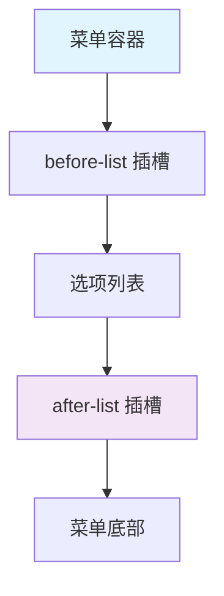
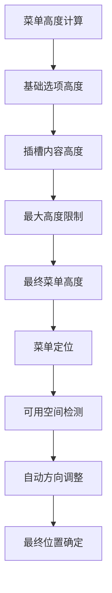

# after-list 插槽

<cite>
**本文档引用的文件**
- [Menu.vue](file://src/components/Menu.vue)
- [MenuPortal.vue](file://src/components/MenuPortal.vue)
- [treeselectMixin.js](file://src/mixins/treeselectMixin.js)
- [VirtualList.vue](file://src/components/VirtualList.vue)
- [LargeDataExample.vue](file://src/examples/LargeDataExample.vue)
- [OPTIMIZATION_SUMMARY.md](file://OPTIMIZATION_SUMMARY.md)
</cite>

## 目录
1. [简介](#简介)
2. [插槽位置与布局特性](#插槽位置与布局特性)
3. [作用域数据详解](#作用域数据详解)
4. [使用场景示例](#使用场景示例)
5. [异步加载与无限滚动最佳实践](#异步加载与无限滚动最佳实践)
6. [高度计算与菜单定位影响](#高度计算与菜单定位影响)
7. [性能优化建议](#性能优化建议)
8. [故障排除指南](#故障排除指南)

## 简介

`after-list` 插槽是 Treeselect 组件提供的一个重要扩展点，位于下拉菜单选项列表的底部。它允许开发者在选项列表下方添加自定义内容，如加载更多按钮、分页控件或辅助信息展示。该插槽采用作用域插槽模式，提供了丰富的组件上下文数据，使开发者能够精确控制插槽内容的行为和外观。

## 插槽位置与布局特性

### 位置特性

`after-list` 插槽位于菜单选项列表的最底部，紧随所有选项内容之后。这种布局设计确保了插槽内容不会干扰正常的选项浏览体验。



**图表来源**
- [Menu.vue](file://src/components/Menu.vue#L80-L87)

### 布局约束

- **固定位置**：始终位于选项列表的最底部
- **响应式设计**：随菜单宽度自动调整
- **滚动行为**：当选项过多时，插槽内容会随选项列表一起滚动
- **样式继承**：继承菜单容器的基本样式和主题

**章节来源**
- [Menu.vue](file://src/components/Menu.vue#L80-L87)

## 作用域数据详解

`after-list` 插槽的作用域数据与 `before-list` 插槽类似，提供了完整的菜单状态和组件上下文信息。

### 可用的作用域属性

| 属性名 | 类型 | 描述 | 示例值 |
|--------|------|------|--------|
| `menu` | Object | 菜单状态信息 | `{ isOpen: true, placement: 'bottom' }` |
| `instance` | Object | 组件实例上下文 | 当前 Treeselect 实例 |
| `isOpen` | Boolean | 菜单是否打开 | `true` |
| `placement` | String | 菜单放置方向 | `'bottom'` 或 `'top'` |
| `zIndex` | Number | z-index 层级 | `1000` |

### 实际使用示例

```javascript
// 基本作用域数据访问
{
  menu: {
    isOpen: true,
    placement: 'bottom'
  },
  instance: {
    // 完整的组件实例
  },
  isOpen: true,
  placement: 'bottom',
  zIndex: 1000
}
```

**章节来源**
- [Menu.vue](file://src/components/Menu.vue#L101-L107)

## 使用场景示例

### 加载更多按钮

在大数据量场景下，`after-list` 插槽非常适合实现"加载更多"功能：

```vue
<treeselect
  v-model="value"
  :options="options"
  :load-options="loadMoreOptions"
>
  <template #after-list="{ instance }">
    <div class="load-more-container">
      <button 
        v-if="instance.hasMore"
        @click="loadMore(instance)"
        class="load-more-button"
      >
        加载更多 ({{ instance.loadedCount }}/{{ instance.totalCount }})
      </button>
      <div v-else class="no-more-data">
        已加载全部 {{ instance.totalCount }} 项
      </div>
    </div>
  </template>
</treeselect>
```

### 分页控件

对于需要分页显示的场景：

```vue
<template #after-list="{ instance }">
  <div class="pagination-controls">
    <button 
      :disabled="instance.currentPage === 1"
      @click="previousPage(instance)"
    >
      上一页
    </button>
    
    <span class="page-info">
      第 {{ instance.currentPage }} 页，共 {{ instance.totalPages }} 页
    </span>
    
    <button 
      :disabled="!instance.hasMorePages"
      @click="nextPage(instance)"
    >
      下一页
    </button>
  </div>
</template>
```

### 辅助信息展示

提供搜索结果统计或操作提示：

```vue
<template #after-list="{ instance }">
  <div class="search-info">
    <div class="result-count">
      找到 {{ instance.filteredOptions.length }} 个匹配项
    </div>
    <div class="help-text">
      使用 ↑↓ 键导航，回车键选择
    </div>
  </div>
</template>
```

**章节来源**
- [LargeDataExample.vue](file://src/examples/LargeDataExample.vue#L24-L37)

## 异步加载与无限滚动最佳实践

### 异步加载实现

在异步加载场景中，`after-list` 插槽可以完美配合 `loadOptions` 属性：

```vue
<treeselect
  v-model="value"
  :options="options"
  :load-options="loadOptions"
>
  <template #after-list="{ instance }">
    <div class="loading-indicator">
      <button 
        v-if="instance.isLoading"
        disabled
        class="loading-button"
      >
        加载中...
      </button>
      <button 
        v-else-if="instance.hasMore"
        @click="loadMoreData(instance)"
        class="load-more-button"
      >
        加载更多数据
      </button>
    </div>
  </template>
</treeselect>
```

### 无限滚动策略

实现无缝的无限滚动体验：

```javascript
methods: {
  async loadOptions({ action, parentNode, callback }) {
    if (action === LOAD_ROOT_OPTIONS) {
      // 初始加载
      const data = await this.fetchInitialData();
      callback(null, data);
    } else if (action === LOAD_CHILDREN_OPTIONS) {
      // 子节点加载
      const data = await this.fetchChildData(parentNode);
      callback(null, data);
    }
  },
  
  async loadMoreData(instance) {
    try {
      instance.setLoading(true);
      const newData = await this.fetchMoreData();
      instance.addOptions(newData);
    } catch (error) {
      instance.setError(error.message);
    } finally {
      instance.setLoading(false);
    }
  }
}
```

### 性能优化技巧

1. **防抖处理**：避免频繁触发加载请求
2. **缓存机制**：已加载的数据应缓存避免重复请求
3. **预加载**：在接近底部时提前加载更多数据
4. **错误处理**：提供重试机制和错误提示

**章节来源**
- [treeselectMixin.js](file://src/mixins/treeselectMixin.js#L1291-L1320)

## 高度计算与菜单定位影响

### 高度计算机制

`after-list` 插槽的高度直接影响菜单的整体尺寸计算：



**图表来源**
- [Menu.vue](file://src/components/Menu.vue#L251-L278)

### 对菜单定位的影响

1. **空间占用**：插槽内容增加会导致菜单整体高度增加
2. **溢出处理**：当内容超出最大高度时，会出现滚动条
3. **定位调整**：菜单会根据可用空间自动调整打开方向
4. **性能影响**：过高的插槽内容可能影响渲染性能

### 最佳实践建议

```css
/* 推荐的插槽样式 */
.vue-treeselect__after-list {
  padding: 8px 12px;
  background: #f8f8f8;
  border-top: 1px solid #eee;
  min-height: 40px;
}

/* 避免过高的插槽内容 */
.vue-treeselect__after-list {
  max-height: 100px; /* 限制最大高度 */
  overflow-y: auto; /* 超出时显示滚动条 */
}
```

**章节来源**
- [Menu.vue](file://src/components/Menu.vue#L251-L278)

## 性能优化建议

### 虚拟滚动配合

当使用虚拟滚动时，`after-list` 插槽的性能表现更加出色：

```vue
<treeselect
  v-model="value"
  :options="largeOptions"
  :virtual-scroll="true"
  :option-height="40"
>
  <template #after-list="{ instance }">
    <div class="virtual-scroll-footer">
      <button @click="loadMoreVirtualData">
        加载更多 ({{ instance.loadedCount }}/{{ instance.totalCount }})
      </button>
    </div>
  </template>
</treeselect>
```

### 内存管理

1. **及时清理**：在组件销毁时清理插槽相关资源
2. **懒加载**：插槽内容按需加载
3. **防抖优化**：避免频繁更新插槽内容
4. **缓存策略**：合理缓存插槽状态

### 渲染优化

```javascript
// 使用计算属性优化插槽内容
computed: {
  afterListContent() {
    // 缓存插槽内容，避免重复计算
    if (!this._cachedContent) {
      this._cachedContent = this.generateAfterListContent();
    }
    return this._cachedContent;
  }
}
```

**章节来源**
- [OPTIMIZATION_SUMMARY.md](file://OPTIMIZATION_SUMMARY.md#L10-L20)

## 故障排除指南

### 常见问题及解决方案

#### 1. 插槽内容不显示

**原因**：插槽名称拼写错误或未正确传递作用域数据

**解决方案**：
```vue
<!-- 错误 -->
<template #afterlist="{ instance }">
<!-- 正确 -->
<template #after-list="{ instance }">
```

#### 2. 高度计算异常

**原因**：插槽内容高度计算不准确

**解决方案**：
```css
.vue-treeselect__after-list {
  box-sizing: border-box; /* 确保 padding 和 border 被正确计算 */
  height: auto !important; /* 避免强制固定高度 */
}
```

#### 3. 菜单定位错误

**原因**：插槽内容过高导致菜单无法完全显示

**解决方案**：
```javascript
// 监听菜单状态变化
watch: {
  'menu.isOpen'(isOpen) {
    if (isOpen) {
      this.$nextTick(() => {
        // 检查菜单是否被截断
        this.checkMenuVisibility();
      });
    }
  }
}
```

#### 4. 性能问题

**原因**：插槽内容过于复杂或频繁更新

**解决方案**：
- 使用 `v-if` 控制插槽内容显示
- 实现内容缓存机制
- 避免在插槽中进行复杂的计算

### 调试技巧

1. **检查 DOM 结构**：确认插槽内容正确插入
2. **监控性能**：使用浏览器开发者工具分析渲染性能
3. **验证数据流**：确保作用域数据正确传递
4. **测试边界情况**：验证极端情况下的表现

**章节来源**
- [Menu.vue](file://src/components/Menu.vue#L240-L250)

## 总结

`after-list` 插槽是 Treeselect 组件的强大扩展功能，为开发者提供了灵活的定制能力。通过合理使用该插槽，可以实现丰富的交互功能，同时需要注意性能优化和用户体验的平衡。在大数据量场景下，结合虚拟滚动和适当的缓存策略，可以确保良好的性能表现。