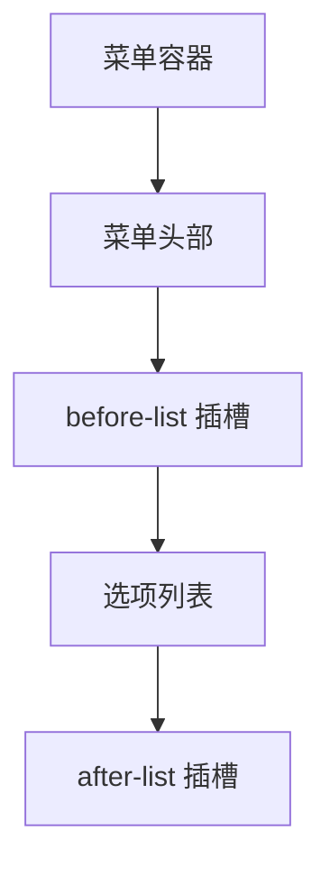
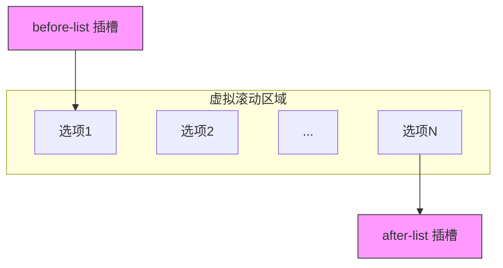

# before-list 插槽

<cite>
**本文档引用的文件**   
- [Menu.vue](file://src/components/Menu.vue#L92-L98)
- [treeselectMixin.js](file://src/mixins/treeselectMixin.js)
- [VirtualList.vue](file://src/components/VirtualList.vue)
</cite>

## 目录
1. [简介](#简介)
2. [定位特性](#定位特性)
3. [作用域数据](#作用域数据)
4. [实际应用示例](#实际应用示例)
5. [虚拟滚动机制](#虚拟滚动机制)
6. [布局样式冲突解决策略](#布局样式冲突解决策略)

## 简介
`before-list` 插槽是 Treeselect 组件提供的一个作用域插槽，允许开发者在下拉菜单选项列表的上方插入自定义内容。该插槽位于菜单主体之前、选项列表之后，为用户界面提供了额外的定制化空间。

**Section sources**
- [Menu.vue](file://src/components/Menu.vue#L81)

## 定位特性
`before-list` 插槽的内容被渲染在下拉菜单选项列表的正上方，紧随菜单头部之后。其定位遵循标准的文档流布局，不会影响选项列表本身的布局结构。无论菜单是否启用虚拟滚动，该插槽始终位于可视区域的顶部位置。

**Diagram sources **
- [Menu.vue](file://src/components/Menu.vue#L81-L87)

**Section sources**
- [Menu.vue](file://src/components/Menu.vue#L79-L88)

## 作用域数据
`before-list` 插槽的作用域数据包含菜单状态信息和组件实例引用，允许开发者根据当前交互状态动态调整插槽内容。主要包含以下数据：

- `isOpen`: 布尔值，表示菜单当前是否处于打开状态
- `searchQuery`: 字符串，表示当前的搜索查询内容
- `instance`: 组件实例引用，提供对 Treeselect 组件所有属性和方法的访问

这些数据通过作用域插槽传递，使开发者能够创建响应式的内容，例如根据搜索状态显示不同的提示信息或根据菜单状态调整按钮的可用性。

**Section sources**
- [Menu.vue](file://src/components/Menu.vue#L92-L98)
- [treeselectMixin.js](file://src/mixins/treeselectMixin.js)

## 实际应用示例
`before-list` 插槽适用于多种场景，包括但不限于：

- **搜索提示**: 在搜索框下方显示搜索建议或快捷搜索词
- **快捷操作按钮**: 添加"全选"、"清空"等常用操作按钮
- **分类标题**: 在不同类型的选项之间添加分组标题
- **状态指示器**: 显示当前加载状态或数据统计信息

这些内容通常为静态或半静态性质，适合放置不需要频繁更新的UI元素。

**Section sources**
- [Menu.vue](file://src/components/Menu.vue#L81)

## 虚拟滚动机制
`before-list` 插槽不参与虚拟滚动机制。当 Treeselect 组件启用 `virtualScroll` 属性时，只有选项列表部分会进行虚拟化渲染以优化性能，而 `before-list` 插槽的内容始终会被完整渲染。这使得该插槽特别适合放置静态或半静态内容，因为这些内容不会受到滚动性能优化的影响。

**Diagram sources **
- [VirtualList.vue](file://src/components/VirtualList.vue)
- [Menu.vue](file://src/components/Menu.vue#L81)

**Section sources**
- [VirtualList.vue](file://src/components/VirtualList.vue)
- [Menu.vue](file://src/components/Menu.vue#L165-L167)

## 布局样式冲突解决策略
由于 `before-list` 插槽位于菜单内部，可能会与默认样式产生冲突。以下是常见的解决策略：

1. **使用内联样式**: 直接在插槽内容上应用内联样式以确保优先级
2. **CSS 类名隔离**: 为插槽内容添加唯一的类名，并在样式表中明确指定
3. **样式穿透**: 使用 Vue 的 `::v-deep` 或 `/deep/` 选择器穿透作用域样式限制
4. **外边距控制**: 通过设置适当的 `margin` 或 `padding` 避免与其他元素的间距问题

建议在使用时测试不同状态下的显示效果，确保在各种交互场景下都能正确呈现。

**Section sources**
- [Menu.vue](file://src/components/Menu.vue#L80-L88)
- [VirtualList.vue](file://src/components/VirtualList.vue)